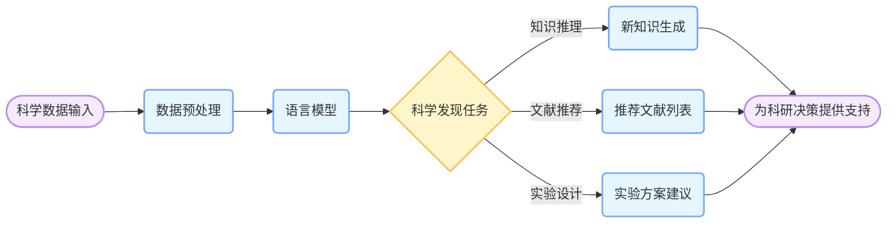

# 语言模型在科学发现过程中的辅助作用

> 关键词：语言模型、科学发现、辅助作用、知识推理、数据挖掘

> 摘要：本文深入探讨了语言模型在科学发现过程中的辅助作用。首先介绍了相关背景，包括研究目的、预期读者、文档结构和术语表。接着阐述了语言模型与科学发现相关的核心概念及其联系，通过文本示意图和Mermaid流程图进行直观展示。详细讲解了语言模型的核心算法原理和具体操作步骤，并使用Python源代码进行说明。同时给出了相关的数学模型和公式，辅以举例说明。通过项目实战，展示了语言模型在实际应用中的代码实现和详细解读。分析了语言模型在不同科学领域的实际应用场景，推荐了学习、开发所需的工具和资源，以及相关论文著作。最后总结了语言模型在科学发现中的未来发展趋势与挑战，解答了常见问题，并提供了扩展阅读和参考资料，旨在全面揭示语言模型在推动科学发现方面的重要价值。

## 1. 背景介绍 
### 1.1 目的和范围
科学发现是一个复杂而漫长的过程，涉及到知识的积累、实验的设计、数据的分析等多个环节。随着信息技术的飞速发展，语言模型作为一种强大的工具，逐渐在科学研究中发挥出重要作用。本文的目的在于深入探讨语言模型在科学发现过程中的具体辅助作用，分析其工作原理、应用场景以及面临的挑战。研究范围涵盖了自然科学、社会科学等多个领域，旨在为科研人员、技术开发者以及对科学发现和语言模型感兴趣的读者提供全面而深入的参考。

### 1.2 预期读者
本文预期读者包括科研工作者，他们可以了解如何利用语言模型加速科学研究进程，提高研究效率；计算机科学领域的开发者，能够从中获取语言模型在科学应用方面的技术思路和实现方法；高校师生，可将其作为学习科学研究方法和语言模型技术的参考资料；以及对科学发现和人工智能技术感兴趣的普通读者，帮助他们了解语言模型在推动科学进步中的重要作用。

### 1.3 文档结构概述
本文将按照以下结构展开：首先介绍相关背景知识，包括研究目的、读者群体和文档结构；接着阐述语言模型与科学发现相关的核心概念及其联系，通过文本示意图和流程图进行直观展示；详细讲解语言模型的核心算法原理和具体操作步骤，并用Python代码进行说明；给出相关的数学模型和公式，并举例说明；通过项目实战展示语言模型在实际应用中的代码实现和详细解读；分析语言模型在不同科学领域的实际应用场景；推荐学习、开发所需的工具和资源，以及相关论文著作；最后总结语言模型在科学发现中的未来发展趋势与挑战，解答常见问题，并提供扩展阅读和参考资料。

### 1.4 术语表
#### 1.4.1 核心术语定义
- **语言模型**：是一种基于概率统计或深度学习的模型，用于对自然语言文本进行建模，预测文本中每个位置的下一个词的概率分布。
- **科学发现**：指科学家通过观察、实验、理论推导等方法，揭示自然规律、获得新知识或创造新理论的过程。
- **知识推理**：基于已有的知识和规则，推导出新的知识或结论的过程。
- **数据挖掘**：从大量的数据中发现有价值的信息和知识的过程。

#### 1.4.2 相关概念解释
- **预训练语言模型**：在大规模文本数据上进行无监督学习训练得到的语言模型，具有强大的语言理解和生成能力。
- **微调**：在预训练语言模型的基础上，针对特定的任务，使用少量的标注数据对模型进行进一步训练，以适应具体任务的需求。
- **知识图谱**：一种以图的形式表示知识的方法，节点表示实体，边表示实体之间的关系。

#### 1.4.3 缩略词列表
- **NLP**：Natural Language Processing，自然语言处理
- **GPT**：Generative Pretrained Transformer，生成式预训练变换器
- **BERT**：Bidirectional Encoder Representations from Transformers，基于变换器的双向编码器表示

## 2. 核心概念与联系 
### 核心概念原理
语言模型的核心原理是学习语言的统计规律，通过对大量文本数据的学习，建立起语言的概率分布模型。以基于深度学习的Transformer架构的语言模型为例，它利用多头注意力机制（Multi-Head Attention）来捕捉文本中不同位置之间的依赖关系。多头注意力机制允许模型在不同的表示子空间中并行地关注输入序列的不同部分，从而提高模型对文本的理解能力。

在科学发现过程中，语言模型可以作为一个知识源和推理工具。它可以对科学文献、实验数据等进行处理和分析，提取有价值的信息和知识。例如，通过对大量科学论文的学习，语言模型可以了解不同领域的研究进展、关键概念和研究方法，从而为科研人员提供参考和启发。

### 架构的文本示意图
语言模型在科学发现中的应用架构可以描述如下：首先是数据输入层，包括科学文献、实验报告、数据库等各种形式的数据。这些数据经过预处理，如分词、词性标注等，然后输入到语言模型中。语言模型对输入数据进行特征提取和语义理解，输出相应的文本表示。接着，这些表示可以用于各种科学发现任务，如知识推理、文献推荐、实验设计等。最后，根据任务的输出结果，为科研人员提供决策支持和建议。

### Mermaid流程图


这个流程图展示了语言模型在科学发现过程中的工作流程。从科学数据的输入开始，经过预处理后进入语言模型。语言模型的输出可以用于不同的科学发现任务，最终为科研决策提供支持。

## 3. 核心算法原理 & 具体操作步骤 
### 核心算法原理
以GPT（Generative Pretrained Transformer）模型为例，其核心算法基于Transformer架构。Transformer架构主要由编码器和解码器组成，在GPT中，只使用了解码器部分。

解码器由多个相同的层堆叠而成，每层包含多头注意力机制和前馈神经网络。多头注意力机制的计算公式如下：

- 计算查询（Query）、键（Key）和值（Value）：
  - $Q = XW^Q$
  - $K = XW^K$
  - $V = XW^V$
  其中，$X$ 是输入的词嵌入矩阵，$W^Q$、$W^K$、$W^V$ 分别是查询、键和值的权重矩阵。

- 计算注意力分数：
  - $Attention(Q, K, V) = softmax(\frac{QK^T}{\sqrt{d_k}})V$
  其中，$d_k$ 是键向量的维度。

- 多头注意力机制：
  - $MultiHead(Q, K, V) = Concat(head_1, \cdots, head_h)W^O$
  其中，$head_i = Attention(QW^Q_i, KW^K_i, VW^V_i)$，$h$ 是头的数量，$W^O$ 是输出的权重矩阵。

前馈神经网络由两个线性层和一个非线性激活函数（通常是ReLU）组成：

- $FFN(x) = max(0, xW_1 + b_1)W_2 + b_2$
  其中，$W_1$、$W_2$ 是权重矩阵，$b_1$、$b_2$ 是偏置向量。

### 具体操作步骤
#### 步骤1：数据准备
收集科学领域的文本数据，如科学论文、研究报告等。对数据进行清洗和预处理，包括去除噪声、分词、构建词表等。

#### 步骤2：模型训练
使用大规模的科学文本数据对GPT模型进行预训练。预训练的目标是最大化文本序列的似然概率，即预测下一个词的概率。在训练过程中，使用随机梯度下降（SGD）或其变种（如Adam）来更新模型的参数。

#### 步骤3：微调
针对具体的科学发现任务，如知识推理、文献推荐等，使用少量的标注数据对预训练模型进行微调。微调的过程与预训练类似，但使用的是任务特定的损失函数。

#### 步骤4：应用部署
将微调后的模型部署到实际应用中，为科研人员提供服务。例如，开发一个科学文献推荐系统，根据用户输入的关键词，使用语言模型推荐相关的科学论文。

### Python源代码示例
```python
import torch
import torch.nn as nn
import torch.optim as optim
from transformers import GPT2LMHeadModel, GPT2Tokenizer

# 步骤1：数据准备
tokenizer = GPT2Tokenizer.from_pretrained('gpt2')
text = "This is a sample scientific text."
input_ids = tokenizer.encode(text, return_tensors='pt')

# 步骤2：模型训练（这里简单示例，实际需要大规模数据）
model = GPT2LMHeadModel.from_pretrained('gpt2')
optimizer = optim.Adam(model.parameters(), lr=1e-5)
loss_fn = nn.CrossEntropyLoss()

for epoch in range(10):
    outputs = model(input_ids, labels=input_ids)
    loss = outputs.loss
    optimizer.zero_grad()
    loss.backward()
    optimizer.step()
    print(f'Epoch {epoch+1}, Loss: {loss.item()}')

# 步骤3：微调（假设已有标注数据）
# 这里省略微调的具体代码，需要根据具体任务准备标注数据和调整损失函数

# 步骤4：应用部署
input_text = "Please recommend some scientific papers about AI."
input_ids = tokenizer.encode(input_text, return_tensors='pt')
output = model.generate(input_ids, max_length=100, num_return_sequences=1)
generated_text = tokenizer.decode(output[0], skip_special_tokens=True)
print(generated_text)
```

这段代码展示了使用GPT2模型进行基本训练和生成文本的过程。首先，使用`GPT2Tokenizer`对文本进行编码，然后加载预训练的`GPT2LMHeadModel`。在训练过程中，使用交叉熵损失函数和Adam优化器进行参数更新。最后，使用生成方法生成与输入文本相关的文本。

## 4. 数学模型和公式 & 详细讲解 & 举例说明 
### 语言模型的数学模型
语言模型的目标是计算给定文本序列 $x_1, x_2, \cdots, x_n$ 的概率 $P(x_1, x_2, \cdots, x_n)$。根据链式法则，可以将其分解为：

$$P(x_1, x_2, \cdots, x_n) = \prod_{i=1}^{n} P(x_i | x_1, x_2, \cdots, x_{i-1})$$

其中，$P(x_i | x_1, x_2, \cdots, x_{i-1})$ 表示在已知前面 $i-1$ 个词的情况下，第 $i$ 个词出现的条件概率。

### 基于神经网络的语言模型
在基于神经网络的语言模型中，通常使用神经网络来估计条件概率 $P(x_i | x_1, x_2, \cdots, x_{i-1})$。以循环神经网络（RNN）为例，假设 $h_t$ 是时刻 $t$ 的隐藏状态，$x_t$ 是时刻 $t$ 的输入词，$y_t$ 是时刻 $t$ 的输出概率分布。

- 隐藏状态更新：
  - $h_t = f(W_{hh}h_{t-1} + W_{xh}x_t + b_h)$
  其中，$W_{hh}$ 和 $W_{xh}$ 是权重矩阵，$b_h$ 是偏置向量，$f$ 是激活函数（如tanh）。

- 输出概率分布：
  - $y_t = softmax(W_{hy}h_t + b_y)$
  其中，$W_{hy}$ 是权重矩阵，$b_y$ 是偏置向量。

### 举例说明
假设我们有一个简单的文本序列 "The dog runs"，词汇表为 $\{The, dog, runs, cat\}$。我们要计算 $P(The, dog, runs)$。

- 首先，计算 $P(The)$：假设通过训练，模型学习到 $P(The) = 0.2$。
- 然后，计算 $P(dog | The)$：假设模型学习到 $P(dog | The) = 0.3$。
- 最后，计算 $P(runs | The, dog)$：假设模型学习到 $P(runs | The, dog) = 0.5$。

则 $P(The, dog, runs) = P(The) \times P(dog | The) \times P(runs | The, dog) = 0.2 \times 0.3 \times 0.5 = 0.03$。

在实际应用中，语言模型会处理更长的文本序列和更大的词汇表，通过不断学习和优化参数，提高对文本概率的估计准确性。

## 5. 项目实战：代码实际案例和详细解释说明 
### 5.1  开发环境搭建
#### 操作系统
建议使用Linux系统，如Ubuntu 18.04及以上版本，因为Linux系统在科研和开发领域具有广泛的应用，并且有丰富的开发工具和库支持。

#### Python环境
安装Python 3.7及以上版本。可以使用Anaconda来管理Python环境，方便安装和管理各种依赖库。

#### 安装必要的库
使用`pip`或`conda`安装以下库：
- `transformers`：用于加载和使用预训练的语言模型，如GPT、BERT等。
- `torch`：PyTorch深度学习框架，提供了高效的张量计算和自动求导功能。
- `numpy`：用于数值计算和数组操作。
- `pandas`：用于数据处理和分析。

安装命令示例：
```bash
pip install transformers torch numpy pandas
```

### 5.2  源代码详细实现和代码解读
#### 科学文献推荐系统
以下是一个简单的科学文献推荐系统的代码实现：

```python
import torch
from transformers import GPT2LMHeadModel, GPT2Tokenizer
import pandas as pd

# 加载预训练模型和分词器
tokenizer = GPT2Tokenizer.from_pretrained('gpt2')
model = GPT2LMHeadModel.from_pretrained('gpt2')

# 加载科学文献数据
data = pd.read_csv('scientific_papers.csv')
papers = data['abstract'].tolist()

def recommend_papers(query, top_k=3):
    # 对查询进行编码
    input_ids = tokenizer.encode(query, return_tensors='pt')
    
    # 生成推荐文本
    output = model.generate(input_ids, max_length=100, num_return_sequences=1)
    generated_text = tokenizer.decode(output[0], skip_special_tokens=True)
    
    # 计算相似度（这里简单示例，实际可使用更复杂的方法）
    similarities = []
    for paper in papers:
        paper_ids = tokenizer.encode(paper, return_tensors='pt')
        similarity = torch.nn.functional.cosine_similarity(input_ids, paper_ids).item()
        similarities.append(similarity)
    
    # 排序并返回前k篇文献
    sorted_indices = sorted(range(len(similarities)), key=lambda i: similarities[i], reverse=True)
    top_papers = [papers[i] for i in sorted_indices[:top_k]]
    
    return top_papers

# 示例查询
query = "Research on artificial intelligence in healthcare"
recommended_papers = recommend_papers(query)
for i, paper in enumerate(recommended_papers):
    print(f"Recommended Paper {i+1}: {paper}")
```

#### 代码解读
1. **加载预训练模型和分词器**：使用`transformers`库加载预训练的GPT2模型和对应的分词器。
2. **加载科学文献数据**：使用`pandas`库读取包含科学文献摘要的CSV文件，并将摘要存储在列表中。
3. **推荐函数`recommend_papers`**：
    - 对查询进行编码，将其转换为模型可以处理的输入格式。
    - 使用模型生成推荐文本。
    - 计算查询与每篇文献摘要的相似度，这里简单使用余弦相似度。
    - 对相似度进行排序，选择前k篇文献作为推荐结果。
4. **示例查询**：输入一个查询，调用推荐函数并输出推荐的文献摘要。

### 5.3  代码解读与分析
#### 优点
- **简单易用**：使用预训练的语言模型和常见的Python库，代码实现简单，易于理解和修改。
- **可扩展性**：可以通过更换不同的预训练模型或调整相似度计算方法来提高推荐效果。

#### 缺点
- **相似度计算简单**：使用余弦相似度作为相似度度量方法，可能无法准确反映文本之间的语义相似度。
- **缺乏领域适应性**：预训练模型可能没有充分学习科学领域的专业知识，需要进行微调以提高推荐的准确性。

在实际应用中，可以对代码进行改进，例如使用更复杂的相似度计算方法（如基于BERT的语义相似度），或者对模型进行微调以适应科学领域的需求。

## 6. 实际应用场景 
### 自然科学领域
#### 天文学
语言模型可以帮助天文学家快速筛选和分析大量的天文观测数据和研究文献。例如，通过对天文文献的学习，语言模型可以理解不同天体的特征和研究方法，为天文学家提供相关的研究建议。在寻找新的天体时，语言模型可以根据已知的天体特征和观测数据，预测可能存在的天体位置和性质。

#### 物理学
在物理学研究中，语言模型可以辅助物理学家进行理论推导和实验设计。例如，当物理学家遇到复杂的物理问题时，语言模型可以提供相关的理论知识和研究案例，帮助他们开拓思路。在实验设计方面，语言模型可以根据实验目的和已有条件，提供可能的实验方案和参数设置建议。

#### 生物学
生物学领域有大量的研究文献和实验数据，语言模型可以帮助生物学家快速获取和整理相关信息。例如，在基因研究中，语言模型可以分析基因序列数据和相关的文献，预测基因的功能和相互作用。在药物研发方面，语言模型可以根据疾病的特征和药物的作用机制，推荐可能有效的药物靶点和候选药物。

### 社会科学领域
#### 经济学
语言模型可以分析经济数据和新闻报道，预测经济趋势和市场变化。例如，通过对大量的经济新闻和政策文件的学习，语言模型可以理解经济政策的影响和市场的反应，为经济学家和投资者提供决策支持。在宏观经济研究中，语言模型可以帮助分析不同经济变量之间的关系，建立经济模型。

#### 社会学
在社会学研究中，语言模型可以处理和分析大量的社会调查数据和文本资料。例如，通过对社交媒体数据的分析，语言模型可以了解社会舆论和公众情绪的变化，为社会学家研究社会现象和社会问题提供数据支持。在社会政策制定方面，语言模型可以根据社会问题的特征和公众需求，提供政策建议和评估方案。

#### 心理学
语言模型可以辅助心理学家进行心理评估和治疗。例如，通过对患者的语言表达进行分析，语言模型可以识别患者的心理状态和情绪变化，为心理治疗提供参考。在心理学研究中，语言模型可以帮助分析大量的实验数据和研究文献，发现心理现象的规律和机制。

## 7. 工具和资源推荐
### 7.1 学习资源推荐
#### 7.1.1 书籍推荐
- 《深度学习》（Deep Learning）：由Ian Goodfellow、Yoshua Bengio和Aaron Courville撰写，是深度学习领域的经典教材，涵盖了神经网络、卷积神经网络、循环神经网络等核心内容。
- 《自然语言处理入门》：何晗著，适合初学者入门自然语言处理，介绍了自然语言处理的基本概念、算法和应用。
- 《Python自然语言处理》（Natural Language Processing with Python）：Steven Bird、Ewan Klein和Edward Loper著，通过Python代码示例详细介绍了自然语言处理的各种技术和方法。

#### 7.1.2 在线课程
- Coursera上的“深度学习专项课程”（Deep Learning Specialization）：由Andrew Ng教授授课，系统地介绍了深度学习的基础知识和应用。
- edX上的“自然语言处理基础”（Foundations of Natural Language Processing）：提供了自然语言处理的基础理论和实践方法。
- 哔哩哔哩（Bilibili）上有许多关于语言模型和自然语言处理的教程视频，适合初学者快速入门。

#### 7.1.3 技术博客和网站
- Hugging Face Blog：提供了关于预训练语言模型、自然语言处理技术的最新研究成果和应用案例。
- Medium上的Towards Data Science：有大量关于数据科学、机器学习和自然语言处理的优质文章。
- arXiv.org：是一个收集物理学、数学、计算机科学等领域预印本论文的网站，可以及时了解最新的科研进展。

### 7.2 开发工具框架推荐
#### 7.2.1 IDE和编辑器
- PyCharm：是一款专业的Python集成开发环境，提供了代码编辑、调试、版本控制等功能，适合Python开发。
- Jupyter Notebook：是一个交互式的开发环境，支持代码、文本、图像等多种形式的展示，方便进行数据探索和模型实验。
- Visual Studio Code：是一款轻量级的代码编辑器，支持多种编程语言和插件扩展，具有丰富的功能和良好的用户体验。

#### 7.2.2 调试和性能分析工具
- PyTorch Profiler：是PyTorch提供的性能分析工具，可以帮助开发者分析模型的运行时间、内存使用等情况，优化模型性能。
- TensorBoard：是TensorFlow提供的可视化工具，也可以用于PyTorch模型的训练过程可视化和性能分析。
- cProfile：是Python标准库中的性能分析模块，可以分析Python代码的运行时间和函数调用情况。

#### 7.2.3 相关框架和库
- Transformers：由Hugging Face开发的库，提供了各种预训练的语言模型和相应的工具，方便开发者使用和微调语言模型。
- NLTK（Natural Language Toolkit）：是Python中常用的自然语言处理库，提供了分词、词性标注、命名实体识别等多种自然语言处理任务的工具和数据集。
- SpaCy：是一个快速、高效的自然语言处理库，支持多种语言，提供了预训练的模型和简单易用的API。

### 7.3 相关论文著作推荐
#### 7.3.1 经典论文
- “Attention Is All You Need”：提出了Transformer架构，是现代语言模型的基础。
- “BERT: Pre-training of Deep Bidirectional Transformers for Language Understanding”：介绍了BERT模型，开启了预训练语言模型在自然语言处理领域的广泛应用。
- “Generative Pretrained Transformer 3 (GPT-3): Its Nature, Scope, Limits, and Consequences”：对GPT-3模型进行了详细的介绍和分析。

#### 7.3.2 最新研究成果
- 关注ACL（Association for Computational Linguistics）、EMNLP（Conference on Empirical Methods in Natural Language Processing）等自然语言处理领域的顶级会议，这些会议上会发表最新的研究成果。
- arXiv.org上搜索“language model”、“scientific discovery”等关键词，可以获取最新的预印本论文。

#### 7.3.3 应用案例分析
- 阅读《自然》（Nature）、《科学》（Science）等顶级科学期刊上的文章，了解语言模型在科学发现中的实际应用案例。
- 关注科技公司和科研机构的官方博客，如OpenAI、Google AI等，他们会分享语言模型在实际项目中的应用经验和成果。

## 8. 总结：未来发展趋势与挑战
### 未来发展趋势
#### 更强的语言理解和生成能力
未来的语言模型将不断提高对自然语言的理解和生成能力，能够更准确地理解复杂的语义和语境，生成更加自然、流畅的文本。例如，在科学文献生成方面，语言模型可以生成高质量的研究报告和论文，为科研人员节省时间和精力。

#### 与其他技术的融合
语言模型将与计算机视觉、知识图谱、强化学习等技术进行更深入的融合。例如，结合计算机视觉技术，语言模型可以对图像和视频进行理解和描述；结合知识图谱，语言模型可以获取更丰富的知识，提高推理和决策能力；结合强化学习，语言模型可以通过与环境的交互不断优化自身的性能。

#### 跨领域应用拓展
语言模型将在更多的科学领域和实际场景中得到应用。除了自然科学和社会科学领域，语言模型还可以应用于医疗、教育、金融等领域，为这些领域的发展提供支持和创新。

### 挑战
#### 数据质量和隐私问题
语言模型的训练需要大量的数据，但数据的质量和隐私问题是一个挑战。低质量的数据可能会影响模型的性能，而敏感数据的使用可能会导致隐私泄露。因此，需要加强数据管理和保护，提高数据的质量和安全性。

#### 模型可解释性和可靠性
语言模型通常是基于深度学习的黑盒模型，其决策过程和推理机制难以解释。在科学发现等重要领域，模型的可解释性和可靠性至关重要。因此，需要研究开发可解释的语言模型，提高模型的透明度和可信度。

#### 伦理和社会影响
语言模型的广泛应用可能会带来一些伦理和社会问题，如虚假信息传播、算法偏见等。需要制定相应的伦理准则和法律法规，规范语言模型的使用，减少其负面影响。

## 9. 附录：常见问题与解答
### 问题1：语言模型在科学发现中的准确性如何保证？
解答：可以通过以下方法保证语言模型在科学发现中的准确性：
- 使用高质量的科学数据进行训练，确保数据的准确性和可靠性。
- 对模型进行微调，使其适应具体的科学任务和领域。
- 结合多种模型和方法，进行综合分析和验证。
- 引入人工审核和验证机制，对模型的输出结果进行评估和修正。

### 问题2：语言模型能否替代科研人员进行科学发现？
解答：语言模型不能完全替代科研人员进行科学发现。虽然语言模型可以提供有价值的信息和建议，但科学发现是一个创造性的过程，需要科研人员的专业知识、创新思维和实验验证。语言模型可以作为科研人员的辅助工具，帮助他们提高工作效率和发现新的研究方向。

### 问题3：如何选择适合科学发现的语言模型？
解答：选择适合科学发现的语言模型可以考虑以下因素：
- 模型的性能和能力，如语言理解和生成能力、知识推理能力等。
- 模型的领域适应性，是否在科学领域有良好的表现。
- 模型的可扩展性和可定制性，是否可以根据具体任务进行微调。
- 模型的开源性和易用性，是否有丰富的文档和工具支持。

## 10. 扩展阅读 & 参考资料
### 扩展阅读
- 《人工智能时代的科学发现》：探讨了人工智能技术在科学发现中的应用和发展趋势。
- 《自然语言处理：从理论到实践》：深入介绍了自然语言处理的各种技术和方法，以及在实际应用中的案例。
- 《科学研究的艺术》：介绍了科学研究的方法和技巧，帮助读者提高科学发现的能力。

### 参考资料
- Goodfellow, I., Bengio, Y., & Courville, A. (2016). Deep Learning. MIT Press.
- Bird, S., Klein, E., & Loper, E. (2009). Natural Language Processing with Python. O'Reilly Media.
- Vaswani, A., Shazeer, N., Parmar, N., Uszkoreit, J., Jones, L., Gomez, A. N.,... & Polosukhin, I. (2017). Attention is all you need. Advances in neural information processing systems, 5998-6008.
- Devlin, J., Chang, M. W., Lee, K., & Toutanova, K. (2018). BERT: Pre-training of deep bidirectional transformers for language understanding. arXiv preprint arXiv:1810.04805.

作者：AI天才研究院/AI Genius Institute & 禅与计算机程序设计艺术 /Zen And The Art of Computer Programming