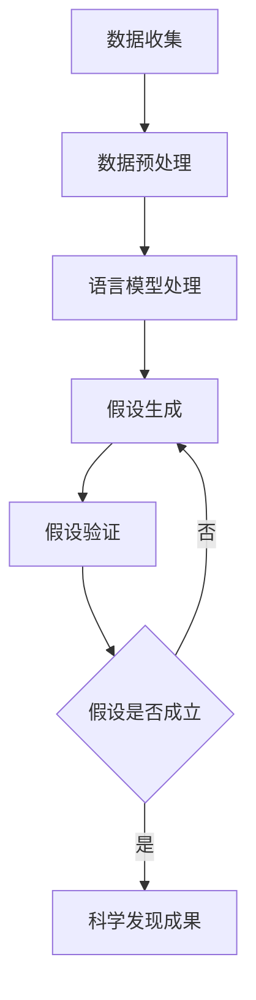

# 语言模型在科学发现过程自动化与假设验证中的突破性探索

> 关键词：语言模型、科学发现自动化、假设验证、自然语言处理、机器学习、知识图谱、人工智能

> 摘要：本文聚焦于语言模型在科学发现过程自动化与假设验证中的突破性应用。首先介绍了相关背景，包括研究目的、预期读者等内容。详细阐述了语言模型、科学发现自动化和假设验证的核心概念及其联系，通过文本示意图和 Mermaid 流程图进行直观展示。深入讲解了核心算法原理，结合 Python 代码进行说明，并给出相关数学模型和公式。通过项目实战案例，展示了语言模型在实际中的应用过程。探讨了其在不同领域的实际应用场景，推荐了学习资源、开发工具框架和相关论文著作。最后总结了未来发展趋势与挑战，解答常见问题并提供扩展阅读与参考资料，旨在全面揭示语言模型在科学发现与假设验证中的重要作用和巨大潜力。

## 1. 背景介绍 
### 1.1 目的和范围
科学研究是推动人类社会进步的重要力量，然而传统的科学发现过程往往依赖于科学家的个人经验和大量的实验尝试，效率较低且成本较高。随着人工智能技术的飞速发展，语言模型作为其中的重要分支，展现出了强大的自然语言处理能力。本研究的目的在于探索如何利用语言模型实现科学发现过程的自动化以及高效的假设验证，从而加速科学研究的进程，提高科学发现的效率和准确性。

研究范围涵盖了多个科学领域，包括但不限于物理学、化学、生物学、医学等。同时，涉及到自然语言处理、机器学习、知识图谱等多个相关技术领域，旨在综合运用这些技术来实现语言模型在科学发现和假设验证中的有效应用。

### 1.2 预期读者
本文的预期读者包括科研工作者，他们可以通过了解语言模型在科学发现和假设验证中的应用，为自己的研究工作提供新的思路和方法；人工智能领域的从业者，能够从技术实现的角度深入了解语言模型的应用场景和优化方向；计算机科学相关专业的学生，有助于他们拓宽知识面，了解前沿技术在实际科研中的应用。

### 1.3 文档结构概述
本文首先介绍研究的背景信息，包括目的、预期读者和文档结构概述等内容。接着阐述语言模型、科学发现自动化和假设验证的核心概念及其联系，通过图形化的方式进行直观展示。然后深入讲解核心算法原理，结合 Python 代码详细说明具体操作步骤，并给出相关数学模型和公式。通过项目实战案例，展示语言模型在实际中的应用过程，包括开发环境搭建、源代码实现和代码解读。探讨语言模型在不同领域的实际应用场景，推荐学习资源、开发工具框架和相关论文著作。最后总结未来发展趋势与挑战，解答常见问题并提供扩展阅读与参考资料。

### 1.4 术语表
#### 1.4.1 核心术语定义
- **语言模型**：是一种对自然语言文本进行建模的统计模型，用于预测给定上下文下下一个词出现的概率。它可以学习语言的模式和规律，从而生成自然语言文本或进行文本理解。
- **科学发现自动化**：指利用计算机技术和人工智能方法，自动完成科学研究中的部分或全部过程，包括数据收集、分析、假设生成和验证等，以提高科学发现的效率和准确性。
- **假设验证**：在科学研究中，对提出的假设进行检验和评估的过程。通过实验、观察或数据分析等方法，判断假设是否成立。

#### 1.4.2 相关概念解释
- **自然语言处理**：是人工智能的一个重要领域，旨在让计算机理解和处理人类语言。它包括文本分类、情感分析、机器翻译、信息抽取等多个任务。
- **机器学习**：是一门多领域交叉学科，涉及概率论、统计学、逼近论、凸分析、算法复杂度理论等多门学科。它专门研究计算机怎样模拟或实现人类的学习行为，以获取新的知识或技能，重新组织已有的知识结构使之不断改善自身的性能。
- **知识图谱**：是一种语义网络，用于表示实体之间的关系。它将各种知识以图形化的方式组织起来，便于计算机进行推理和查询。

#### 1.4.3 缩略词列表
- **NLP**：Natural Language Processing，自然语言处理
- **ML**：Machine Learning，机器学习
- **LM**：Language Model，语言模型

## 2. 核心概念与联系 

### 核心概念原理
#### 语言模型
语言模型的基本原理是基于概率统计的方法，通过对大量文本数据的学习，计算出在给定上下文的情况下，下一个词出现的概率。例如，在一个简单的二元语言模型中，对于一个句子 $w_1, w_2, \cdots, w_n$，其概率可以表示为：

$P(w_1, w_2, \cdots, w_n) = P(w_1)P(w_2|w_1)P(w_3|w_1, w_2) \cdots P(w_n|w_1, w_2, \cdots, w_{n - 1})$

在实际应用中，为了简化计算，通常采用马尔可夫假设，即假设一个词的出现只与它前面的有限个词有关。例如，在二元语言模型中，假设一个词的出现只与它前面的一个词有关，则上述概率可以简化为：

$P(w_1, w_2, \cdots, w_n) = P(w_1)P(w_2|w_1)P(w_3|w_2) \cdots P(w_n|w_{n - 1})$

#### 科学发现自动化
科学发现自动化的核心原理是利用计算机算法和人工智能技术，模拟科学家的思维过程，自动完成科学研究中的各个环节。它包括数据收集、数据预处理、特征提取、模型构建、假设生成和验证等步骤。通过对大量科学数据的分析和挖掘，发现潜在的规律和知识，从而提出新的科学假设。

#### 假设验证
假设验证的基本原理是基于统计学的方法，通过对样本数据的分析，判断假设是否成立。在科学研究中，通常会提出一个原假设 $H_0$ 和一个备择假设 $H_1$，然后通过实验或观察收集数据，计算统计量，并根据统计量的分布来判断是否拒绝原假设。

### 架构的文本示意图
```plaintext
科学发现自动化系统
|
|-- 数据收集模块
|   |-- 科学文献数据库
|   |-- 实验数据采集设备
|
|-- 数据预处理模块
|   |-- 数据清洗
|   |-- 数据标注
|
|-- 语言模型模块
|   |-- 预训练语言模型
|   |-- 微调语言模型
|
|-- 假设生成模块
|   |-- 基于规则的方法
|   |-- 基于机器学习的方法
|
|-- 假设验证模块
|   |-- 实验设计
|   |-- 实验执行
|   |-- 结果分析
```

### Mermaid 流程图


## 3. 核心算法原理 & 具体操作步骤 

### 语言模型的训练算法
语言模型的训练通常采用无监督学习的方法，常见的算法包括基于神经网络的方法，如循环神经网络（RNN）、长短时记忆网络（LSTM）和 Transformer 等。下面以 Transformer 为例，介绍语言模型的训练算法。

#### Transformer 原理
Transformer 是一种基于注意力机制的深度学习模型，它由编码器和解码器组成。编码器负责将输入的文本序列转换为一系列的特征向量，解码器则根据这些特征向量生成输出的文本序列。

Transformer 的核心是多头注意力机制，它允许模型在不同的表示子空间中并行地关注输入序列的不同部分。多头注意力机制的计算公式如下：

$MultiHead(Q, K, V) = Concat(head_1, \cdots, head_h)W^O$

其中，$head_i = Attention(QW_i^Q, KW_i^K, VW_i^V)$，$Attention(Q, K, V) = softmax(\frac{QK^T}{\sqrt{d_k}})V$，$Q$、$K$、$V$ 分别是查询、键和值矩阵，$W_i^Q$、$W_i^K$、$W_i^V$ 和 $W^O$ 是可学习的权重矩阵，$d_k$ 是键向量的维度。

#### Python 代码实现
```python
import torch
import torch.nn as nn
import torch.nn.functional as F

class MultiHeadAttention(nn.Module):
    def __init__(self, d_model, num_heads):
        super(MultiHeadAttention, self).__init__()
        assert d_model % num_heads == 0, "d_model must be divisible by num_heads"
        
        self.d_model = d_model
        self.num_heads = num_heads
        self.d_k = d_model // num_heads
        
        self.W_q = nn.Linear(d_model, d_model)
        self.W_k = nn.Linear(d_model, d_model)
        self.W_v = nn.Linear(d_model, d_model)
        self.W_o = nn.Linear(d_model, d_model)
        
    def scaled_dot_product_attention(self, Q, K, V, mask=None):
        attn_scores = torch.matmul(Q, K.transpose(-2, -1)) / torch.sqrt(torch.tensor(self.d_k, dtype=torch.float32))
        if mask is not None:
            attn_scores = attn_scores.masked_fill(mask == 0, -1e9)
        attn_probs = F.softmax(attn_scores, dim=-1)
        output = torch.matmul(attn_probs, V)
        return output
        
    def split_heads(self, x):
        batch_size, seq_length, d_model = x.size()
        return x.view(batch_size, seq_length, self.num_heads, self.d_k).transpose(1, 2)
        
    def combine_heads(self, x):
        batch_size, num_heads, seq_length, d_k = x.size()
        return x.transpose(1, 2).contiguous().view(batch_size, seq_length, self.d_model)
        
    def forward(self, Q, K, V, mask=None):
        Q = self.split_heads(self.W_q(Q))
        K = self.split_heads(self.W_k(K))
        V = self.split_heads(self.W_v(V))
        
        attn_output = self.scaled_dot_product_attention(Q, K, V, mask)
        output = self.W_o(self.combine_heads(attn_output))
        return output
```

### 假设生成算法
假设生成可以采用基于规则的方法或基于机器学习的方法。下面以基于机器学习的方法为例，介绍假设生成的具体操作步骤。

#### 数据准备
首先，需要收集大量的科学文献和实验数据，并进行标注。标注的内容包括实验条件、实验结果、相关假设等。

#### 特征提取
从标注的数据中提取特征，例如文本特征、数值特征等。可以使用词嵌入技术将文本转换为向量表示，使用归一化方法对数值特征进行处理。

#### 模型训练
选择合适的机器学习模型，如支持向量机（SVM）、决策树、神经网络等，对提取的特征进行训练。训练的目标是学习到实验条件和实验结果之间的关系，从而生成合理的假设。

#### Python 代码实现
```python
from sklearn.svm import SVC
from sklearn.feature_extraction.text import TfidfVectorizer
from sklearn.model_selection import train_test_split
from sklearn.metrics import accuracy_score

# 示例数据
text_data = ["实验条件1，结果为阳性", "实验条件2，结果为阴性"]
labels = [1, 0]

# 特征提取
vectorizer = TfidfVectorizer()
X = vectorizer.fit_transform(text_data)

# 划分训练集和测试集
X_train, X_test, y_train, y_test = train_test_split(X, labels, test_size=0.2, random_state=42)

# 模型训练
model = SVC()
model.fit(X_train, y_train)

# 模型预测
y_pred = model.predict(X_test)

# 评估模型
accuracy = accuracy_score(y_test, y_pred)
print(f"Accuracy: {accuracy}")
```

### 假设验证算法
假设验证通常采用统计学的方法，例如 t 检验、方差分析等。下面以 t 检验为例，介绍假设验证的具体操作步骤。

#### 提出假设
提出原假设 $H_0$ 和备择假设 $H_1$，例如 $H_0$：两组数据的均值相等，$H_1$：两组数据的均值不相等。

#### 收集数据
收集两组相关的数据，例如实验组和对照组的数据。

#### 计算统计量
根据数据计算 t 统计量，t 统计量的计算公式如下：

$t = \frac{\bar{X}_1 - \bar{X}_2}{s_p\sqrt{\frac{1}{n_1} + \frac{1}{n_2}}}$

其中，$\bar{X}_1$ 和 $\bar{X}_2$ 分别是两组数据的均值，$n_1$ 和 $n_2$ 分别是两组数据的样本量，$s_p$ 是合并标准差，计算公式如下：

$s_p = \sqrt{\frac{(n_1 - 1)s_1^2 + (n_2 - 1)s_2^2}{n_1 + n_2 - 2}}$

其中，$s_1^2$ 和 $s_2^2$ 分别是两组数据的方差。

#### 确定临界值
根据自由度和显著性水平，确定 t 分布的临界值。

#### 做出决策
比较计算得到的 t 统计量和临界值的大小，如果 t 统计量大于临界值，则拒绝原假设，否则接受原假设。

#### Python 代码实现
```python
from scipy import stats
import numpy as np

# 示例数据
group1 = np.array([1, 2, 3, 4, 5])
group2 = np.array([6, 7, 8, 9, 10])

# 进行 t 检验
t_statistic, p_value = stats.ttest_ind(group1, group2)

# 输出结果
print(f"t statistic: {t_statistic}")
print(f"p value: {p_value}")

# 根据 p 值做出决策
alpha = 0.05
if p_value < alpha:
    print("Reject the null hypothesis")
else:
    print("Accept the null hypothesis")
```

## 4. 数学模型和公式 & 详细讲解 & 举例说明 

### 语言模型的数学模型
语言模型的数学模型通常基于概率统计的方法，下面以 n 元语言模型为例进行详细讲解。

#### n 元语言模型的定义
n 元语言模型假设一个词的出现只与它前面的 $n - 1$ 个词有关。对于一个句子 $w_1, w_2, \cdots, w_m$，其概率可以表示为：

$P(w_1, w_2, \cdots, w_m) = \prod_{i = 1}^{m} P(w_i|w_{i - n + 1}, \cdots, w_{i - 1})$

其中，$P(w_i|w_{i - n + 1}, \cdots, w_{i - 1})$ 表示在给定前面 $n - 1$ 个词的条件下，第 $i$ 个词出现的概率。

#### 最大似然估计
在 n 元语言模型中，通常使用最大似然估计来估计条件概率 $P(w_i|w_{i - n + 1}, \cdots, w_{i - 1})$。最大似然估计的公式如下：

$\hat{P}(w_i|w_{i - n + 1}, \cdots, w_{i - 1}) = \frac{C(w_{i - n + 1}, \cdots, w_{i - 1}, w_i)}{C(w_{i - n + 1}, \cdots, w_{i - 1})}$

其中，$C(w_{i - n + 1}, \cdots, w_{i - 1}, w_i)$ 表示 $n$ 元组 $(w_{i - n + 1}, \cdots, w_{i - 1}, w_i)$ 在训练数据中出现的次数，$C(w_{i - n + 1}, \cdots, w_{i - 1})$ 表示 $(n - 1)$ 元组 $(w_{i - n + 1}, \cdots, w_{i - 1})$ 在训练数据中出现的次数。

#### 举例说明
假设我们有一个训练数据：“I like to play football”，我们要计算二元语言模型中 $P(play|to)$ 的概率。

首先，统计 $C(to, play)$ 和 $C(to)$ 的次数。在训练数据中，$C(to, play) = 1$，$C(to) = 1$。

然后，根据最大似然估计公式，$\hat{P}(play|to) = \frac{C(to, play)}{C(to)} = \frac{1}{1} = 1$。

### 假设生成的数学模型
假设生成可以采用机器学习的方法，下面以线性回归模型为例进行详细讲解。

#### 线性回归模型的定义
线性回归模型假设自变量 $x$ 和因变量 $y$ 之间存在线性关系，其数学模型可以表示为：

$y = \beta_0 + \beta_1x_1 + \beta_2x_2 + \cdots + \beta_nx_n + \