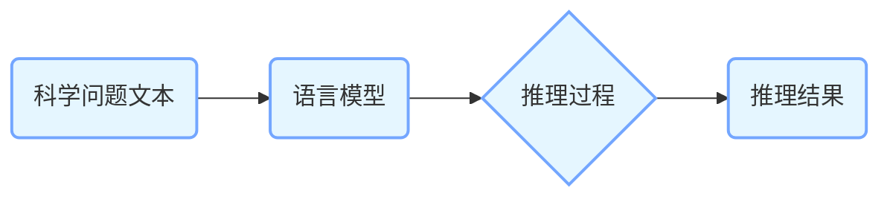

# 语言模型在科学推理任务中的能力提升

> 关键词：语言模型、科学推理任务、能力提升、自然语言处理、深度学习

> 摘要：本文围绕语言模型在科学推理任务中的能力提升展开深入探讨。首先介绍了研究的背景和目的，明确预期读者和文档结构。接着阐述了语言模型和科学推理任务的核心概念及相互联系，给出了相应的文本示意图和Mermaid流程图。详细讲解了提升语言模型在科学推理任务中能力的核心算法原理，并使用Python代码进行了具体说明。从数学模型和公式的角度深入剖析了相关原理，并举例说明。通过项目实战，给出代码实际案例并进行详细解释。探讨了语言模型在科学推理任务中的实际应用场景，推荐了学习资源、开发工具框架以及相关论文著作。最后总结了未来发展趋势与挑战，还提供了常见问题与解答以及扩展阅读和参考资料。旨在为相关领域的研究者和开发者提供全面且深入的技术指导。

## 1. 背景介绍 
### 1.1 目的和范围
随着人工智能技术的飞速发展，语言模型在自然语言处理领域取得了显著的成果。然而，在科学推理任务中，语言模型的表现仍有待提高。科学推理任务通常涉及复杂的逻辑推理、知识理解和应用，需要语言模型具备更强的推理能力和知识表示能力。本文的目的是深入研究如何提升语言模型在科学推理任务中的能力，探讨相关的技术原理、算法和实际应用。研究范围涵盖了从语言模型的基本概念到具体的科学推理任务，包括数学推理、物理推理、生物推理等多个领域。

### 1.2 预期读者
本文预期读者主要包括人工智能领域的研究者、自然语言处理工程师、对科学推理和语言模型感兴趣的学生以及相关领域的技术爱好者。对于希望深入了解语言模型在科学推理任务中应用的专业人士，本文将提供系统的技术讲解和实践指导；对于初学者，也能帮助他们建立起对该领域的基本认识和理解。

### 1.3 文档结构概述
本文将按照以下结构进行组织：首先介绍核心概念与联系，明确语言模型和科学推理任务的基本概念以及它们之间的关系；接着详细阐述核心算法原理和具体操作步骤，并使用Python代码进行说明；然后从数学模型和公式的角度对相关原理进行深入讲解，并举例说明；通过项目实战展示代码实际案例并进行详细解释；探讨语言模型在科学推理任务中的实际应用场景；推荐学习资源、开发工具框架以及相关论文著作；最后总结未来发展趋势与挑战，提供常见问题与解答以及扩展阅读和参考资料。

### 1.4 术语表
#### 1.4.1 核心术语定义
- **语言模型**：是一种基于概率统计的模型，用于预测给定上下文下下一个词出现的概率。在深度学习中，通常指基于神经网络的语言模型，如循环神经网络（RNN）、长短期记忆网络（LSTM）、Transformer等。
- **科学推理任务**：是指涉及科学领域知识和逻辑推理的任务，如数学证明、物理问题求解、生物现象解释等。这些任务需要语言模型具备对科学知识的理解和应用能力，以及逻辑推理和问题解决的能力。
- **推理能力**：指语言模型根据给定的信息和知识，通过逻辑推理得出结论的能力。在科学推理任务中，推理能力表现为对科学概念的理解、对科学规律的应用以及对问题的分析和解决能力。
- **知识表示**：是指将知识以某种形式表示出来，以便计算机能够处理和理解。在语言模型中，知识表示通常采用向量空间模型，将文本信息转换为向量表示，使得模型能够对知识进行学习和推理。

#### 1.4.2 相关概念解释
- **自然语言处理（NLP）**：是人工智能的一个重要分支，研究如何让计算机理解和处理人类语言。语言模型是自然语言处理中的核心技术之一，广泛应用于文本生成、机器翻译、问答系统等任务。
- **深度学习**：是一种基于神经网络的机器学习方法，通过构建多层神经网络来学习数据的特征和模式。在语言模型中，深度学习技术被广泛应用，如基于Transformer架构的预训练语言模型取得了显著的效果。
- **预训练模型**：是指在大规模无监督数据上进行预训练的模型。预训练模型可以学习到丰富的语言知识和语义信息，为后续的微调任务提供良好的初始化参数。在科学推理任务中，预训练模型可以作为基础模型进行微调，以提升模型在特定任务上的性能。

#### 1.4.3 缩略词列表
- **RNN**：Recurrent Neural Network，循环神经网络
- **LSTM**：Long Short-Term Memory，长短期记忆网络
- **Transformer**：一种基于注意力机制的神经网络架构
- **BERT**：Bidirectional Encoder Representations from Transformers，基于Transformer的双向编码器表示
- **GPT**：Generative Pretrained Transformer，生成式预训练Transformer

## 2. 核心概念与联系 
### 核心概念原理
#### 语言模型原理
语言模型的基本原理是基于概率统计，通过学习大量的文本数据，计算给定上下文下下一个词出现的概率。在深度学习中，常见的语言模型架构有RNN、LSTM和Transformer等。

以Transformer为例，它采用了注意力机制，能够更好地捕捉文本中的长距离依赖关系。Transformer由编码器和解码器组成，编码器用于对输入的文本进行编码，解码器用于生成输出文本。在预训练阶段，Transformer模型在大规模无监督数据上进行训练，学习语言的通用知识和语义信息。

#### 科学推理任务原理
科学推理任务通常涉及科学领域的知识和逻辑推理。解决科学推理任务需要对科学概念、原理和规律有深入的理解，并能够运用这些知识进行逻辑推理和问题解决。例如，在数学推理任务中，需要运用数学公式和定理进行推导和证明；在物理推理任务中，需要理解物理概念和定律，运用它们来分析和解决物理问题。

### 架构的文本示意图
```plaintext
语言模型 <-- 输入科学问题文本 --> 科学推理任务
|
| 利用预训练知识和推理能力
|
| 输出推理结果
```

### Mermaid流程图


## 3. 核心算法原理 & 具体操作步骤 
### 核心算法原理
提升语言模型在科学推理任务中的能力，一种常见的方法是在预训练模型的基础上进行微调。预训练模型已经学习到了丰富的语言知识和语义信息，通过在科学推理任务的数据集上进行微调，可以让模型更好地适应特定的任务。

以基于BERT的微调为例，BERT是一种双向编码器表示模型，它在大规模无监督数据上进行预训练，能够学习到文本的双向上下文信息。在微调阶段，我们可以在BERT模型的基础上添加一个分类器或回归器，根据具体的科学推理任务进行调整。

### 具体操作步骤
#### 步骤1：数据准备
首先需要收集和整理科学推理任务的数据集。数据集应包含科学问题文本和对应的答案或推理结果。将数据集划分为训练集、验证集和测试集，用于模型的训练、评估和测试。

#### 步骤2：模型加载
加载预训练的BERT模型。可以使用Hugging Face的Transformers库来方便地加载预训练模型。

```python
from transformers import BertModel

# 加载预训练的BERT模型
model = BertModel.from_pretrained('bert-base-uncased')
```

#### 步骤3：添加分类器或回归器
根据具体的科学推理任务，在BERT模型的基础上添加一个分类器或回归器。例如，如果是分类任务，可以添加一个全连接层作为分类器。

```python
import torch.nn as nn

class ScienceReasoningModel(nn.Module):
    def __init__(self, bert_model):
        super(ScienceReasoningModel, self).__init__()
        self.bert = bert_model
        self.classifier = nn.Linear(768, num_classes)  # num_classes 为分类的类别数

    def forward(self, input_ids, attention_mask):
        outputs = self.bert(input_ids=input_ids, attention_mask=attention_mask)
        pooled_output = outputs.pooler_output
        logits = self.classifier(pooled_output)
        return logits

# 创建科学推理模型
science_model = ScienceReasoningModel(model)
```

#### 步骤4：模型训练
使用训练集对模型进行训练。定义损失函数和优化器，然后进行迭代训练。

```python
import torch.optim as optim

# 定义损失函数和优化器
criterion = nn.CrossEntropyLoss()
optimizer = optim.Adam(science_model.parameters(), lr=1e-5)

# 训练模型
for epoch in range(num_epochs):
    science_model.train()
    for batch in train_dataloader:
        input_ids = batch['input_ids']
        attention_mask = batch['attention_mask']
        labels = batch['labels']

        optimizer.zero_grad()
        logits = science_model(input_ids, attention_mask)
        loss = criterion(logits, labels)
        loss.backward()
        optimizer.step()
```

#### 步骤5：模型评估
使用验证集对模型进行评估，计算模型的准确率、召回率等指标。

```python
from sklearn.metrics import accuracy_score

science_model.eval()
predictions = []
true_labels = []
with torch.no_grad():
    for batch in val_dataloader:
        input_ids = batch['input_ids']
        attention_mask = batch['attention_mask']
        labels = batch['labels']

        logits = science_model(input_ids, attention_mask)
        preds = torch.argmax(logits, dim=1)
        predictions.extend(preds.tolist())
        true_labels.extend(labels.tolist())

accuracy = accuracy_score(true_labels, predictions)
print(f'Validation Accuracy: {accuracy}')
```

#### 步骤6：模型测试
使用测试集对模型进行最终测试，评估模型在未知数据上的性能。

```python
science_model.eval()
test_predictions = []
test_true_labels = []
with torch.no_grad():
    for batch in test_dataloader:
        input_ids = batch['input_ids']
        attention_mask = batch['attention_mask']
        labels = batch['labels']

        logits = science_model(input_ids, attention_mask)
        preds = torch.argmax(logits, dim=1)
        test_predictions.extend(preds.tolist())
        test_true_labels.extend(labels.tolist())

test_accuracy = accuracy_score(test_true_labels, test_predictions)
print(f'Test Accuracy: {test_accuracy}')
```

## 4. 数学模型和公式 & 详细讲解 & 举例说明 
### 语言模型的数学基础
语言模型的目标是计算给定上下文 $C$ 下下一个词 $w$ 出现的概率 $P(w|C)$。在统计语言模型中，通常使用 $n$-gram 模型来近似计算这个概率。

#### $n$-gram 模型
$n$-gram 模型假设一个词的出现只依赖于它前面的 $n-1$ 个词。对于一个长度为 $m$ 的文本序列 $w_1, w_2, \cdots, w_m$，其概率可以表示为：

$$P(w_1, w_2, \cdots, w_m) = \prod_{i=1}^{m} P(w_i|w_{i - n + 1}, \cdots, w_{i - 1})$$

其中，$P(w_i|w_{i - n + 1}, \cdots, w_{i - 1})$ 可以通过最大似然估计来计算：

$$P(w_i|w_{i - n + 1}, \cdots, w_{i - 1}) = \frac{count(w_{i - n + 1}, \cdots, w_{i})}{count(w_{i - n + 1}, \cdots, w_{i - 1})}$$

例如，对于一个三元组（trigram）模型（$n = 3$），计算 $P(w_3|w_1, w_2)$ 时，需要统计在训练数据中 $w_1, w_2, w_3$ 同时出现的次数 $count(w_1, w_2, w_3)$ 和 $w_1, w_2$ 同时出现的次数 $count(w_1, w_2)$。

#### 深度学习语言模型
在深度学习中，语言模型通常使用神经网络来学习 $P(w|C)$。以Transformer为例，它通过多头注意力机制来捕捉文本中的上下文信息。

多头注意力机制的计算公式如下：

$$Attention(Q, K, V) = softmax(\frac{QK^T}{\sqrt{d_k}})V$$

其中，$Q$ 是查询矩阵，$K$ 是键矩阵，$V$ 是值矩阵，$d_k$ 是键的维度。

多头注意力机制将多个注意力头的结果拼接起来，然后通过一个线性变换得到最终的输出：

$$MultiHead(Q, K, V) = Concat(head_1, \cdots, head_h)W^O$$

其中，$head_i = Attention(QW_i^Q, KW_i^K, VW_i^V)$，$W_i^Q$、$W_i^K$、$W_i^V$ 和 $W^O$ 是可学习的参数矩阵。

### 科学推理任务中的数学模型
在科学推理任务中，通常需要将科学知识和逻辑推理进行形式化表示。以数学推理任务为例，我们可以使用谓词逻辑来表示数学命题和推理规则。

#### 谓词逻辑
谓词逻辑是一种形式化的逻辑语言，用于表示命题和推理规则。例如，对于一个简单的数学命题“对于任意实数 $x$，如果 $x > 0$，那么 $x^2 > 0$”，可以用谓词逻辑表示为：

$$\forall x (x > 0 \rightarrow x^2 > 0)$$

在进行推理时，可以使用推理规则，如假言推理规则：

如果已知 $A \rightarrow B$ 和 $A$ 为真，则可以推出 $B$ 为真。

#### 举例说明
假设我们有以下科学知识和推理任务：

知识：
- 所有的鸟类都会飞（用谓词逻辑表示为：$\forall x (Bird(x) \rightarrow CanFly(x))$）
- 企鹅是鸟类（用谓词逻辑表示为：$Bird(Penguin)$）

推理任务：判断企鹅是否会飞。

根据假言推理规则，因为 $Bird(Penguin)$ 为真，且 $\forall x (Bird(x) \rightarrow CanFly(x))$ 为真，所以可以推出 $CanFly(Penguin)$ 为真。

在实际应用中，我们可以将这些知识和推理规则编码到语言模型中，让模型进行推理。例如，将上述知识和推理任务以文本的形式输入到语言模型中，模型可以根据学习到的语言知识和推理能力进行判断和回答。

## 5. 项目实战：代码实际案例和详细解释说明 
### 5.1  开发环境搭建
#### 安装Python和相关库
首先需要安装Python环境，建议使用Python 3.7及以上版本。然后安装必要的库，如PyTorch、Transformers、Scikit-learn等。

```bash
pip install torch transformers scikit-learn
```

#### 数据准备
假设我们有一个科学推理任务的数据集，数据集包含科学问题文本和对应的答案标签。将数据集保存为CSV文件，文件包含两列：`question` 和 `label`。

### 5.2  源代码详细实现和代码解读
```python
import torch
from torch.utils.data import Dataset, DataLoader
from transformers import BertTokenizer, BertModel
import torch.nn as nn
import torch.optim as optim
from sklearn.model_selection import train_test_split
from sklearn.metrics import accuracy_score
import pandas as pd

# 定义数据集类
class ScienceReasoningDataset(Dataset):
    def __init__(self, questions, labels, tokenizer, max_length):
        self.questions = questions
        self.labels = labels
        self.tokenizer = tokenizer
        self.max_length = max_length

    def __len__(self):
        return len(self.questions)

    def __getitem__(self, idx):
        question = self.questions[idx]
        label = self.labels[idx]
        encoding = self.tokenizer.encode_plus(
            question,
            add_special_tokens=True,
            max_length=self.max_length,
            padding='max_length',
            truncation=True,
            return_tensors='pt'
        )
        input_ids = encoding['input_ids'].flatten()
        attention_mask = encoding['attention_mask'].flatten()
        return {
            'input_ids': input_ids,
            'attention_mask': attention_mask,
            'labels': torch.tensor(label, dtype=torch.long)
        }

# 定义科学推理模型
class ScienceReasoningModel(nn.Module):
    def __init__(self, bert_model):
        super(ScienceReasoningModel, self).__init__()
        self.bert = bert_model
        self.classifier = nn.Linear(768, num_classes)  # num_classes 为分类的类别数

    def forward(self, input_ids, attention_mask):
        outputs = self.bert(input_ids=input_ids, attention_mask=attention_mask)
        pooled_output = outputs.pooler_output
        logits = self.classifier(pooled_output)
        return logits

# 加载数据集
data = pd.read_csv('science_reasoning_dataset.csv')
questions = data['question'].tolist()
labels = data['label'].tolist()

# 划分训练集、验证集和测试集
train_questions, test_questions, train_labels, test_labels = train_test_split(questions, labels, test_size=0.2, random_state=42)
train_questions, val_questions, train_labels, val_labels = train_test_split(train_questions, train_labels, test_size=0.1, random_state=42)

# 加载预训练的BERT模型和分词器
tokenizer = BertTokenizer.from_pretrained('bert-base-uncased')
bert_model = BertModel.from_pretrained('bert-base-uncased')

# 创建数据集和数据加载器
max_length = 128
train_dataset = ScienceReasoningDataset(train_questions, train_labels, tokenizer, max_length)
val_dataset = ScienceReasoningDataset(val_questions, val_labels, tokenizer, max_length)
test_dataset = ScienceReasoningDataset(test_questions, test_labels, tokenizer, max_length)

batch_size = 16
train_dataloader = DataLoader(train_dataset, batch_size=batch_size, shuffle=True)
val_dataloader = DataLoader(val_dataset, batch_size=batch_size, shuffle=False)
test_dataloader = DataLoader(test_dataset, batch_size=batch_size, shuffle=False)

# 创建科学推理模型
num_classes = len(set(labels))
science_model = ScienceReasoningModel(bert_model)

# 定义损失函数和优化器
criterion = nn.CrossEntropyLoss()
optimizer = optim.Adam(science_model.parameters(), lr=1e-5)

# 训练模型
num_epochs = 3
for epoch in range(num_epochs):
    science_model.train()
    for batch in train_dataloader:
        input_ids = batch['input_ids']
        attention_mask = batch['attention_mask']
        labels = batch['labels']

        optimizer.zero_grad()
        logits = science_model(input_ids, attention_mask)
        loss = criterion(logits, labels)
        loss.backward()
        optimizer.step()

    # 验证模型
    science_model.eval()
    predictions = []
    true_labels = []
    with torch.no_grad():
        for batch in val_dataloader:
            input_ids = batch['input_ids']
            attention_mask = batch['attention_mask']
            labels = batch['labels']

            logits = science_model(input_ids, attention_mask)
            preds = torch.argmax(logits, dim=1)
            predictions.extend(preds.tolist())
            true_labels.extend(labels.tolist())

    accuracy = accuracy_score(true_labels, predictions)
    print(f'Epoch {epoch + 1}/{num_epochs}, Validation Accuracy: {accuracy}')

# 测试模型
science_model.eval()
test_predictions = []
test_true_labels = []
with torch.no_grad():
    for batch in test_dataloader:
        input_ids = batch['input_ids']
        attention_mask = batch['attention_mask']
        labels = batch['labels']

        logits = science_model(input_ids, attention_mask)
        preds = torch.argmax(logits, dim=1)
        test_predictions.extend(preds.tolist())
        test_true_labels.extend(labels.tolist())

test_accuracy = accuracy_score(test_true_labels, test_predictions)
print(f'Test Accuracy: {test_accuracy}')
```

### 5.3  代码解读与分析
#### 数据集类 `ScienceReasoningDataset`
该类继承自 `torch.utils.data.Dataset`，用于处理科学推理任务的数据集。在 `__getitem__` 方法中，使用 `BertTokenizer` 对问题文本进行分词和编码，将其转换为模型可以接受的输入格式。

#### 科学推理模型 `ScienceReasoningModel`
该类继承自 `nn.Module`，在BERT模型的基础上添加了一个全连接层作为分类器。在 `forward` 方法中，首先调用BERT模型进行编码，然后将编码结果输入到分类器中得到预测结果。

#### 数据加载和划分
使用 `pandas` 库加载CSV文件中的数据集，然后使用 `sklearn.model_selection.train_test_split` 函数将数据集划分为训练集、验证集和测试集。

#### 模型训练和评估
使用 `torch.utils.data.DataLoader` 创建数据加载器，将数据集分批输入到模型中进行训练。在训练过程中，使用交叉熵损失函数和Adam优化器进行参数更新。在每个epoch结束后，使用验证集对模型进行评估，计算准确率。最后，使用测试集对模型进行最终测试，评估模型在未知数据上的性能。

## 6. 实际应用场景 
### 科学教育
在科学教育领域，语言模型可以作为智能辅导系统的核心组件，帮助学生解决科学问题，进行科学推理和学习。例如，当学生遇到数学、物理、化学等学科的问题时，语言模型可以根据问题提供详细的解答和推理过程，帮助学生理解知识点和掌握解题方法。

### 科研辅助
在科研工作中，语言模型可以辅助科研人员进行文献调研、知识检索和推理分析。科研人员可以输入研究问题或关键词，语言模型可以从大量的科研文献中提取相关信息，进行知识整合和推理，为科研人员提供有价值的参考和建议。

### 智能问答系统
在智能问答系统中，语言模型可以处理用户提出的科学相关问题，提供准确的答案和推理过程。例如，在科普网站、科学论坛等平台上，智能问答系统可以快速响应用户的问题，提高用户获取科学知识的效率。

### 科学发现和创新
语言模型可以通过对大量科学数据和知识的学习和分析，发现潜在的科学规律和关系，为科学发现和创新提供支持。例如，在生物学领域，语言模型可以分析基因序列数据，预测基因功能和疾病关联，为生物医学研究提供新的思路和方向。

## 7. 工具和资源推荐
### 7.1 学习资源推荐
#### 7.1.1 书籍推荐
- 《深度学习》（Deep Learning）：由Ian Goodfellow、Yoshua Bengio和Aaron Courville所著，是深度学习领域的经典教材，涵盖了神经网络、深度学习模型、优化算法等方面的知识。
- 《自然语言处理入门》：由何晗所著，系统介绍了自然语言处理的基本概念、方法和技术，包括词法分析、句法分析、语义理解等内容。
- 《Python自然语言处理》（Natural Language Processing with Python）：由Steven Bird、Ewan Klein和Edward Loper所著，通过Python代码示例详细介绍了自然语言处理的各种技术和应用。

#### 7.1.2 在线课程
- Coursera上的“深度学习专项课程”（Deep Learning Specialization）：由Andrew Ng教授主讲，包括神经网络和深度学习、改善深层神经网络、结构化机器学习项目、卷积神经网络、序列模型等课程，系统全面地介绍了深度学习的理论和实践。
- edX上的“自然语言处理基础”（Foundations of Natural Language Processing）：由哥伦比亚大学的教授主讲，介绍了自然语言处理的基本概念、算法和应用。
- 哔哩哔哩（B站）上有许多关于自然语言处理和深度学习的免费教程，如“李宏毅机器学习”等课程，讲解生动易懂，适合初学者学习。

#### 7.1.3 技术博客和网站
- Hugging Face博客：提供了关于自然语言处理、深度学习模型的最新研究成果和技术应用，同时还介绍了Hugging Face的相关工具和库的使用方法。
- Medium上的Towards Data Science：汇集了大量数据科学、机器学习、自然语言处理等领域的优秀文章，涵盖了最新的技术动态和实践经验。
- 机器之心：专注于人工智能领域的资讯和技术分享，提供了丰富的技术文章、研究报告和行业动态。

### 7.2 开发工具框架推荐
#### 7.2.1 IDE和编辑器
- PyCharm：是一款专门为Python开发设计的集成开发环境（IDE），具有代码编辑、调试、代码分析等功能，支持多种Python框架和库，提高开发效率。
- Jupyter Notebook：是一个基于Web的交互式计算环境，支持Python、R等多种编程语言。可以方便地进行代码编写、运行和可视化展示，适合进行数据探索和模型实验。
- Visual Studio Code：是一款轻量级的代码编辑器，支持多种编程语言和插件扩展。可以通过安装Python插件来进行Python开发，具有代码高亮、智能提示等功能。

#### 7.2.2 调试和性能分析工具
- PyTorch Profiler：是PyTorch自带的性能分析工具，可以帮助开发者分析模型的性能瓶颈，如计算时间、内存使用等。通过分析结果，开发者可以对模型进行优化，提高训练和推理效率。
- TensorBoard：是TensorFlow的可视化工具，也可以与PyTorch结合使用。可以可视化模型的训练过程、损失曲线、准确率等指标，帮助开发者监控模型的训练情况。
- cProfile：是Python标准库中的性能分析工具，可以分析Python代码的执行时间和函数调用情况。通过分析结果，开发者可以找出代码中的性能瓶颈，进行优化。

#### 7.2.3 相关框架和库
- PyTorch：是一个开源的深度学习框架，具有动态图机制、易于使用和调试等优点。在自然语言处理领域，PyTorch被广泛应用于模型的开发和训练。
- Hugging Face Transformers：是一个用于自然语言处理的开源库，提供了多种预训练模型和工具，如BERT、GPT等。可以方便地加载和使用预训练模型，进行文本分类、问答系统等任务。
- Scikit-learn：是一个用于机器学习的开源库，提供了多种机器学习算法和工具，如分类、回归、聚类等。可以用于数据预处理、模型评估等任务。

### 7.3 相关论文著作推荐
#### 7.3.1 经典论文
- “Attention Is All You Need”：提出了Transformer架构，是自然语言处理领域的重要突破。Transformer架构通过注意力机制有效地捕捉了文本中的长距离依赖关系，为后续的预训练模型奠定了基础。
- “BERT: Pre-training of Deep Bidirectional Transformers for Language Understanding”：介绍了BERT模型，通过双向编码器表示学习到了丰富的语言知识和语义信息。BERT模型在多个自然语言处理任务中取得了显著的效果。
- “Generative Pretrained Transformer 3 (GPT-3): Language Models are Few-Shot Learners”：介绍了GPT-3模型，展示了大规模预训练模型在少样本学习方面的强大能力。GPT-3模型可以在少量样本的情况下完成多种自然语言处理任务。

#### 7.3.2 最新研究成果
- 关注顶级学术会议如ACL（Association for Computational Linguistics）、EMNLP（Conference on Empirical Methods in Natural Language Processing）、NeurIPS（Conference on Neural Information Processing Systems）等的最新论文，了解语言模型在科学推理任务中的最新研究进展。
- 一些知名的研究机构和实验室如OpenAI、Google Research、Facebook AI Research等会发布关于语言模型和科学推理的最新研究成果，可以关注他们的官方网站和博客。

#### 7.3.3 应用案例分析
- 可以参考一些实际应用案例的研究报告和论文，了解语言模型在科学教育、科研辅助、智能问答系统等领域的具体应用和效果。例如，某些智能辅导系统的评估报告、科研机构使用语言模型进行知识发现的案例分析等。

## 8. 总结：未来发展趋势与挑战
### 未来发展趋势
#### 多模态融合
未来的语言模型将不仅仅局限于处理文本信息，而是会与图像、音频、视频等多种模态的信息进行融合。在科学推理任务中，多模态融合可以提供更丰富的信息，帮助模型更好地理解科学问题和进行推理。例如，在生物学领域，结合图像和文本信息可以更准确地识别生物物种和分析生物特征。

#### 知识增强
为了提高语言模型在科学推理任务中的能力，知识增强将是一个重要的发展方向。可以将外部的科学知识图谱、知识库等融入到语言模型中，让模型能够更好地利用先验知识进行推理。例如，在化学推理任务中，将化学元素周期表、化学反应方程式等知识融入到模型中，提高模型的推理准确性。

#### 少样本和零样本学习
在实际应用中，获取大量标注数据往往是困难的。因此，少样本和零样本学习将成为未来语言模型的重要研究方向。通过设计更有效的模型结构和学习算法，让模型能够在少量样本或没有样本的情况下进行科学推理。例如，利用元学习、迁移学习等技术，让模型能够快速适应新的科学推理任务。

#### 可解释性增强
随着语言模型在科学推理任务中的应用越来越广泛，模型的可解释性变得越来越重要。未来的研究将致力于提高语言模型的可解释性，让模型能够解释其推理过程和决策依据。例如，通过可视化技术、特征重要性分析等方法，让用户能够理解模型是如何得出结论的。

### 挑战
#### 知识表示和推理的复杂性
科学领域的知识具有高度的复杂性和专业性，如何将这些知识有效地表示和编码到语言模型中，并实现准确的推理是一个巨大的挑战。例如，在量子物理、生物学等领域，知识的表示和推理涉及到复杂的数学模型和概念，需要更先进的技术和方法。

#### 数据质量和标注难度
高质量的标注数据是训练语言模型的关键。然而，在科学推理任务中，获取高质量的标注数据往往是困难的。一方面，科学问题的标注需要专业的知识和技能；另一方面，数据的质量和一致性也难以保证。因此，如何提高数据的质量和标注效率是一个亟待解决的问题。

#### 计算资源和效率
训练和推理大规模的语言模型需要大量的计算资源和时间。在科学推理任务中，模型的复杂性和数据量往往更大，对计算资源的需求也更高。如何提高模型的训练和推理效率，降低计算成本，是未来需要面对的挑战之一。

#### 伦理和安全问题
随着语言模型在科学推理任务中的应用越来越广泛，伦理和安全问题也日益凸显。例如，模型可能会产生错误的推理结果，误导用户；模型的输出可能会包含敏感信息，泄露隐私等。因此，如何确保语言模型的伦理和安全性是一个重要的问题。

## 9. 附录：常见问题与解答
### 问题1：如何选择适合科学推理任务的预训练模型？
解答：选择适合科学推理任务的预训练模型需要考虑多个因素。首先，要考虑模型的规模和性能，一般来说，大规模的预训练模型具有更强的语言理解和推理能力，但也需要更多的计算资源。其次，要考虑模型的架构和特点，例如，BERT模型具有双向编码器表示能力，适合处理文本理解和分类任务；GPT模型具有生成能力，适合处理文本生成任务。此外，还可以参考模型在相关科学推理任务上的表现和评估结果，选择性能较好的模型。

### 问题2：在微调语言模型时，如何避免过拟合？
解答：避免过拟合可以采取以下几种方法。一是增加数据集的规模，收集更多的标注数据进行训练，让模型学习到更丰富的特征和模式。二是使用正则化方法，如L1和L2正则化，对模型的参数进行约束，防止模型过于复杂。三是采用早停策略，在验证集上监控模型的性能，当验证集的性能不再提升时，停止训练，避免模型在训练集上过度拟合。四是进行数据增强，通过对训练数据进行变换和扩充，增加数据的多样性，提高模型的泛化能力。

### 问题3：如何评估语言模型在科学推理任务中的性能？
解答：评估语言模型在科学推理任务中的性能可以使用多种指标。对于分类任务，可以使用准确率、召回率、F1值等指标来评估模型的分类性能。对于回归任务，可以使用均方误差（MSE）、平均绝对误差（MAE）等指标来评估模型的预测精度。此外，还可以使用一些专门针对科学推理任务的评估指标，如推理准确率、推理完整性等。同时，也可以进行人工评估，邀请专业的科学人员对模型的推理结果进行评价和打分。

### 问题4：如何将外部知识融入到语言模型中？
解答：将外部知识融入到语言模型中可以采用以下几种方法。一是知识图谱嵌入，将知识图谱中的实体和关系表示为向量，然后将这些向量与语言模型的输入进行融合。二是知识注入，在模型的训练过程中，将外部知识作为额外的输入信息，让模型学习到知识与文本之间的关联。三是基于知识的预训练，在大规模的知识数据上对模型进行预训练，让模型学习到丰富的知识信息。四是知识蒸馏，将一个包含外部知识的教师模型的知识蒸馏到语言模型中，让语言模型学习到教师模型的知识和推理能力。

## 10. 扩展阅读 & 参考资料
### 扩展阅读
- 《人工智能：一种现代的方法》（Artificial Intelligence: A Modern Approach）：全面介绍了人工智能的基本概念、方法和技术，包括搜索算法、知识表示、推理系统、机器学习等内容，是人工智能领域的经典教材。
- 《深度学习进阶：自然语言处理》（Deep Learning for Natural Language Processing）：深入介绍了深度学习在自然语言处理中的应用，包括词嵌入、循环神经网络、卷积神经网络、Transformer等模型和算法。
- 《科学推理：逻辑与科学思维方法》：系统介绍了科学推理的基本概念、方法和技巧，包括归纳推理、演绎推理、类比推理等内容，有助于提高科学推理能力。

### 参考资料
- Hugging Face官方文档：https://huggingface.co/docs
- PyTorch官方文档：https://pytorch.org/docs/stable/index.html
- ACL Anthology：https://aclanthology.org/ ，收录了自然语言处理领域的大量学术论文。
- arXiv：https://arxiv.org/ ，提供了最新的学术研究论文预印本，涵盖了人工智能、机器学习等多个领域。

作者：AI天才研究院/AI Genius Institute & 禅与计算机程序设计艺术 /Zen And The Art of Computer Programming