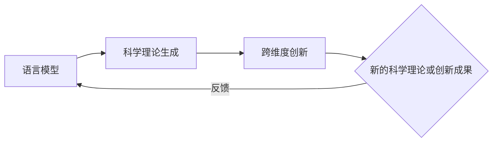

# 语言模型在科学理论生成与跨维度创新中的前沿应用研究

> 关键词：语言模型；科学理论生成；跨维度创新；前沿应用；知识融合

> 摘要：本文聚焦于语言模型在科学理论生成与跨维度创新中的前沿应用。首先介绍了研究的背景、目的、预期读者等内容。接着阐述了语言模型、科学理论生成和跨维度创新的核心概念及其联系，给出了相应的原理和架构示意图与流程图。详细讲解了相关核心算法原理及具体操作步骤，并结合Python源代码进行说明。探讨了其中涉及的数学模型和公式，通过举例加深理解。通过项目实战展示了代码的实际案例及详细解释。分析了语言模型在不同领域的实际应用场景。推荐了学习资源、开发工具框架以及相关论文著作。最后总结了未来发展趋势与挑战，解答了常见问题，并提供了扩展阅读和参考资料，旨在为相关领域的研究和实践提供全面而深入的指导。

## 1. 背景介绍 
### 1.1 目的和范围
随着人工智能技术的飞速发展，语言模型取得了巨大的进步。本研究的目的在于深入探讨语言模型在科学理论生成与跨维度创新方面的前沿应用。具体范围包括分析语言模型如何辅助科学家进行科学理论的构建、推理和验证，以及如何促进不同领域知识的融合与创新，实现跨维度的思维突破和创新成果。通过本研究，期望能够揭示语言模型在推动科学进步和创新方面的潜力和价值，为相关领域的研究和实践提供理论支持和方法指导。

### 1.2 预期读者
本文章预期读者主要包括人工智能领域的研究人员、科学家、工程师，以及对科学理论创新和跨学科研究感兴趣的学者和爱好者。对于从事自然语言处理、机器学习、科学哲学等相关领域的专业人士，文章将提供关于语言模型新应用方向的深入见解和技术细节；对于非专业但关注科学发展和创新的读者，文章也将以通俗易懂的方式介绍语言模型在科学研究中的作用和意义。

### 1.3 文档结构概述
本文将按照以下结构展开：首先介绍核心概念与联系，明确语言模型、科学理论生成和跨维度创新的基本概念和它们之间的关联；接着阐述核心算法原理和具体操作步骤，结合Python代码进行详细说明；然后探讨涉及的数学模型和公式，并举例说明其应用；通过项目实战展示代码的实际案例和详细解释；分析语言模型在不同实际场景中的应用；推荐相关的学习资源、开发工具框架和论文著作；最后总结未来发展趋势与挑战，解答常见问题，并提供扩展阅读和参考资料。

### 1.4 术语表
#### 1.4.1 核心术语定义
- **语言模型**：是一种基于概率统计的模型，用于对自然语言文本进行建模和预测。它可以根据给定的文本序列，预测下一个可能出现的单词或字符的概率分布。常见的语言模型包括基于规则的模型、统计语言模型和神经网络语言模型。
- **科学理论生成**：指科学家通过观察、实验、推理等方法，构建和发展科学理论的过程。语言模型在科学理论生成中的应用，是指利用语言模型的能力来辅助科学家进行理论的提出、验证和完善。
- **跨维度创新**：强调打破传统学科界限和思维模式，将不同领域的知识、方法和理念进行融合和创新，从而产生新的科学理论、技术和产品。语言模型可以作为一种工具，促进跨维度创新的实现。

#### 1.4.2 相关概念解释
- **知识融合**：将来自不同领域、不同来源的知识进行整合和统一，形成更全面、更深入的知识体系。语言模型可以通过对大量文本数据的学习，实现不同领域知识的融合。
- **语义理解**：指计算机对自然语言文本的含义进行理解和解释的能力。语言模型通过学习文本的语义信息，能够更好地理解科学文献中的内容，为科学理论生成和跨维度创新提供支持。

#### 1.4.3 缩略词列表
- **NLP**：Natural Language Processing，自然语言处理
- **RNN**：Recurrent Neural Network，循环神经网络
- **LSTM**：Long Short-Term Memory，长短期记忆网络
- **GPT**：Generative Pretrained Transformer，生成式预训练变换器

## 2. 核心概念与联系 

### 2.1 核心概念原理
#### 2.1.1 语言模型原理
语言模型的核心目标是计算一个句子或文本序列的概率。传统的统计语言模型基于马尔可夫假设，即一个词的出现只与它前面的有限个词有关。例如，n - 元语法模型（n - gram model）假设一个词的出现只与它前面的 n - 1 个词有关。

神经网络语言模型则通过神经网络来学习词的表示和语言的模式。以循环神经网络（RNN）为例，它可以处理变长的输入序列，通过隐藏状态的传递来捕捉序列中的上下文信息。长短期记忆网络（LSTM）是一种改进的 RNN，它通过门控机制解决了传统 RNN 的梯度消失问题，能够更好地处理长序列。

生成式预训练变换器（GPT）是一种基于Transformer架构的语言模型。Transformer采用了自注意力机制，能够并行处理输入序列，高效地捕捉序列中的长距离依赖关系。GPT通过在大规模无监督文本数据上进行预训练，学习到通用的语言知识，然后可以在特定任务上进行微调。

#### 2.1.2 科学理论生成原理
科学理论生成是一个复杂的认知过程，通常包括观察现象、提出假设、进行实验验证、修正假设等步骤。科学家通过对自然现象的观察和分析，发现问题和规律，然后提出初步的假设。这些假设需要通过进一步的实验和推理来验证和完善。在这个过程中，科学家需要综合运用逻辑思维、创造性思维和批判性思维。

语言模型在科学理论生成中的作用主要体现在辅助信息检索、知识整合和假设生成等方面。它可以帮助科学家快速获取相关的科学文献和研究成果，将不同领域的知识进行整合，为提出新的假设提供灵感和支持。

#### 2.1.3 跨维度创新原理
跨维度创新强调打破传统的学科界限和思维定式，将不同领域的知识、方法和理念进行融合和创新。其原理在于不同领域的知识和方法往往具有互补性，通过跨领域的交流和合作，可以发现新的问题和解决方案。

语言模型可以作为跨维度创新的桥梁，它可以理解和处理来自不同领域的文本信息，将不同领域的知识进行关联和融合。例如，语言模型可以分析生物学和物理学领域的文献，发现两者之间的潜在联系，从而为跨学科研究提供思路。

### 2.2 核心概念架构的文本示意图
```plaintext
             +-----------------+
             |  语言模型       |
             +-----------------+
                   |
                   | 辅助信息检索、知识整合、假设生成
                   v
 +---------------------+
 |  科学理论生成       |
 +---------------------+
                   |
                   | 促进知识融合与思维突破
                   v
 +---------------------+
 |  跨维度创新         |
 +---------------------+
```

### 2.3 Mermaid 流程图


这个流程图展示了语言模型、科学理论生成和跨维度创新之间的关系。语言模型为科学理论生成提供支持，科学理论生成促进跨维度创新，跨维度创新产生新的科学理论或创新成果，这些成果又可以反馈给语言模型，进一步提升其性能。

## 3. 核心算法原理 & 具体操作步骤 

### 3.1 核心算法原理
#### 3.1.1 基于Transformer的语言模型原理
Transformer架构主要由编码器和解码器组成。编码器负责对输入序列进行编码，解码器根据编码器的输出生成输出序列。

自注意力机制是Transformer的核心组件之一。它可以让模型在处理每个位置的输入时，关注序列中其他位置的信息。对于输入序列 $\mathbf{X} = [\mathbf{x}_1, \mathbf{x}_2, \cdots, \mathbf{x}_n]$，自注意力机制的计算过程如下：

首先，将输入向量 $\mathbf{x}_i$ 分别乘以三个不同的权重矩阵 $W^Q$, $W^K$, $W^V$，得到查询向量 $\mathbf{q}_i$、键向量 $\mathbf{k}_i$ 和值向量 $\mathbf{v}_i$：

$\mathbf{q}_i = \mathbf{x}_i W^Q$

$\mathbf{k}_i = \mathbf{x}_i W^K$

$\mathbf{v}_i = \mathbf{x}_i W^V$

然后，计算注意力分数：

$a_{ij} = \frac{\mathbf{q}_i^T \mathbf{k}_j}{\sqrt{d_k}}$

其中，$d_k$ 是键向量的维度。

接着，通过softmax函数将注意力分数归一化：

$\alpha_{ij} = \frac{\exp(a_{ij})}{\sum_{k = 1}^{n} \exp(a_{ik})}$

最后，计算输出向量：

$\mathbf{z}_i = \sum_{j = 1}^{n} \alpha_{ij} \mathbf{v}_j$

多头注意力机制是在自注意力机制的基础上，使用多个不同的查询、键和值矩阵，并行计算多个注意力头，然后将结果拼接起来，最后通过一个线性变换得到最终的输出。

#### 3.1.2 科学理论生成算法原理
在科学理论生成中，语言模型可以通过以下步骤辅助：
1. **信息检索**：根据科学家输入的关键词，从大规模的科学文献数据库中检索相关的文献。
2. **知识提取**：对检索到的文献进行分析，提取其中的关键信息和知识。
3. **知识整合**：将提取的知识进行整合，构建知识图谱或知识库。
4. **假设生成**：基于整合后的知识，利用语言模型生成可能的科学假设。
5. **假设验证**：通过实验或推理对生成的假设进行验证。

#### 3.1.3 跨维度创新算法原理
跨维度创新算法主要包括以下步骤：
1. **领域知识表示**：将不同领域的知识进行表示，例如使用词向量或图表示。
2. **领域关联分析**：通过计算不同领域知识之间的相似度或相关性，发现潜在的关联。
3. **跨领域知识融合**：将相关领域的知识进行融合，生成新的知识组合。
4. **创新方案生成**：基于融合后的知识，利用语言模型生成跨维度的创新方案。

### 3.2 具体操作步骤
#### 3.2.1 基于Python的Transformer语言模型实现步骤
以下是一个使用Hugging Face的Transformers库实现简单语言生成的示例代码：

```python
from transformers import GPT2LMHeadModel, GPT2Tokenizer

# 加载预训练的模型和分词器
tokenizer = GPT2Tokenizer.from_pretrained('gpt2')
model = GPT2LMHeadModel.from_pretrained('gpt2')

# 输入文本
input_text = "In the field of physics, "

# 对输入文本进行分词
input_ids = tokenizer.encode(input_text, return_tensors='pt')

# 生成文本
output = model.generate(input_ids, max_length=100, num_beams=5, no_repeat_ngram_size=2, early_stopping=True)

# 解码生成的文本
generated_text = tokenizer.decode(output[0], skip_special_tokens=True)

print(generated_text)
```

代码解释：
1. 导入必要的库，包括 `GPT2LMHeadModel` 和 `GPT2Tokenizer`。
2. 加载预训练的GPT - 2模型和分词器。
3. 定义输入文本。
4. 使用分词器对输入文本进行分词，得到输入的ID序列。
5. 调用模型的 `generate` 方法生成文本，设置生成的最大长度、束搜索的束数等参数。
6. 使用分词器对生成的ID序列进行解码，得到最终的文本。

#### 3.2.2 科学理论生成操作步骤
1. **安装必要的库**：如 `requests` 用于网络请求，`beautifulsoup4` 用于网页解析，`pandas` 用于数据处理。
```python
import requests
from bs4 import BeautifulSoup
import pandas as pd

# 信息检索
def search_scientific_literature(keyword):
    url = f"https://example.com/search?query={keyword}"  # 替换为实际的科学文献搜索网站
    response = requests.get(url)
    soup = BeautifulSoup(response.text, 'html.parser')
    # 解析搜索结果，提取文献链接等信息
    literature_links = []
    for link in soup.find_all('a'):
        if 'literature' in link.get('href'):
            literature_links.append(link.get('href'))
    return literature_links

# 知识提取
def extract_knowledge(literature_links):
    knowledge = []
    for link in literature_links:
        response = requests.get(link)
        soup = BeautifulSoup(response.text, 'html.parser')
        # 提取文献中的关键信息
        key_info = soup.find('div', class_='key-info').text
        knowledge.append(key_info)
    return knowledge

# 知识整合
def integrate_knowledge(knowledge):
    df = pd.DataFrame(knowledge, columns=['Knowledge'])
    # 可以使用知识图谱工具进行进一步的整合
    return df

# 假设生成
def generate_hypothesis(knowledge_df):
    # 这里可以使用语言模型生成假设
    input_text = 'Based on the following knowledge: ' + ' '.join(knowledge_df['Knowledge'])
    input_ids = tokenizer.encode(input_text, return_tensors='pt')
    output = model.generate(input_ids, max_length=50, num_beams=3, no_repeat_ngram_size=2, early_stopping=True)
    hypothesis = tokenizer.decode(output[0], skip_special_tokens=True)
    return hypothesis

keyword = 'quantum mechanics'
literature_links = search_scientific_literature(keyword)
knowledge = extract_knowledge(literature_links)
knowledge_df = integrate_knowledge(knowledge)
hypothesis = generate_hypothesis(knowledge_df)
print(hypothesis)
```

#### 3.2.3 跨维度创新操作步骤
```python
from sklearn.metrics.pairwise import cosine_similarity
import numpy as np

# 领域知识表示
def represent_domain_knowledge(domain_texts):
    # 可以使用词向量模型如Word2Vec或BERT进行知识表示
    from transformers import AutoTokenizer, AutoModel
    tokenizer = AutoTokenizer.from_pretrained('bert-base-uncased')
    model = AutoModel.from_pretrained('bert-base-uncased')
    embeddings = []
    for text in domain_texts:
        input_ids = tokenizer.encode(text, return_tensors='pt')
        outputs = model(input_ids)
        embedding = outputs.last_hidden_state.mean(dim=1).detach().numpy()
        embeddings.append(embedding)
    return np.vstack(embeddings)

# 领域关联分析
def analyze_domain_relations(embeddings):
    similarity_matrix = cosine_similarity(embeddings)
    # 找出相似度较高的领域
    related_domains = []
    for i in range(len(similarity_matrix)):
        for j in range(i + 1, len(similarity_matrix)):
            if similarity_matrix[i][j] > 0.5:
                related_domains.append((i, j))
    return related_domains

# 跨领域知识融合
def fuse_cross_domain_knowledge(related_domains, domain_texts):
    fused_knowledge = []
    for i, j in related_domains:
        fused_text = domain_texts[i] + ' ' + domain_texts[j]
        fused_knowledge.append(fused_text)
    return fused_knowledge

# 创新方案生成
def generate_innovation_schemes(fused_knowledge):
    innovation_schemes = []
    for text in fused_knowledge:
        input_ids = tokenizer.encode(text, return_tensors='pt')
        output = model.generate(input_ids, max_length=100, num_beams=3, no_repeat_ngram_size=2, early_stopping=True)
        scheme = tokenizer.decode(output[0], skip_special_tokens=True)
        innovation_schemes.append(scheme)
    return innovation_schemes

domain_texts = [
    "Biology is the study of living organisms...",
    "Physics is the study of matter and energy..."
]
embeddings = represent_domain_knowledge(domain_texts)
related_domains = analyze_domain_relations(embeddings)
fused_knowledge = fuse_cross_domain_knowledge(related_domains, domain_texts)
innovation_schemes = generate_innovation_schemes(fused_knowledge)
print(innovation_schemes)
```

## 4. 数学模型和公式 & 详细讲解 & 举例说明 

### 4.1 语言模型中的数学模型和公式
#### 4.1.1 最大似然估计
在训练语言模型时，通常使用最大似然估计来学习模型的参数。给定一个文本序列 $w_1, w_2, \cdots, w_n$，语言模型的目标是最大化该序列的概率 $P(w_1, w_2, \cdots, w_n)$。

根据链式法则，$P(w_1, w_2, \cdots, w_n) = \prod_{i = 1}^{n} P(w_i | w_1, w_2, \cdots, w_{i - 1})$

在实际应用中，由于计算复杂度的问题，通常采用n - 元语法模型进行近似，即假设 $P(w_i | w_1, w_2, \cdots, w_{i - 1}) \approx P(w_i | w_{i - n + 1}, \cdots, w_{i - 1})$

例如，在二元语法模型（bigram model）中，$P(w_i | w_1, w_2, \cdots, w_{i - 1}) \approx P(w_i | w_{i - 1})$

#### 4.1.2 自注意力机制公式
自注意力机制的核心公式在前面已经介绍过，这里再次强调：

查询向量 $\mathbf{q}_i$、键向量 $\mathbf{k}_i$ 和值向量 $\mathbf{v}_i$ 的计算：

$\mathbf{q}_i = \mathbf{x}_i W^Q$

$\mathbf{k}_i = \mathbf{x}_i W^K$

$\mathbf{v}_i = \mathbf{x}_i W^V$

注意力分数的计算：

$a_{ij} = \frac{\mathbf{q}_i^T \mathbf{k}_j}{\sqrt{d_k}}$

归一化后的注意力权重：

$\alpha_{ij} = \frac{\exp(a_{ij})}{\sum_{k = 1}^{n} \exp(a_{ik})}$

输出向量的计算：

$\mathbf{z}_i = \sum_{j = 1}^{n} \alpha_{ij} \mathbf{v}_j$

### 4.2 科学理论生成中的数学模型和公式
#### 4.2.1 贝叶斯推理
在科学理论生成中，贝叶斯推理可以用于评估假设的合理性。设 $H$ 为假设，$E$ 为证据，则根据贝叶斯定理：

$P(H | E) = \frac{P(E | H) P(H)}{P(E)}$

其中，$P(H)$ 是假设 $H$ 的先验概率，$P(E | H)$ 是在假设 $H$ 成立的情况下观察到证据 $E$ 的概率，$P(E)$ 是证据 $E$ 的先验概率，$P(H | E)$ 是在观察到证据 $E$ 后假设 $H$ 的后验概率。

例如，在天文学中，假设 $H$ 是“某个星系中存在黑洞”，证据 $E$ 是“观测到该星系中心有强烈的引力透镜效应”。通过计算 $P(H | E)$，可以评估假设的合理性。

#### 4.2.2 信息熵
信息熵可以用于衡量科学文献中的信息含量。对于一个离散随机变量 $X$，其信息熵定义为：

$H(X) = -\sum_{i = 1}^{n} p(x_i) \log p(x_i)$

其中，$p(x_i)$ 是随机变量 $X$ 取值为 $x_i$ 的概率。在科学文献分析中，可以将每个单词看作一个随机变量，计算文献中单词的信息熵，以评估文献的信息丰富程度。

### 4.3 跨维度创新中的数学模型和公式
#### 4.3.1 相似度计算
在跨维度创新中，需要计算不同领域知识之间的相似度。常用的相似度计算方法包括余弦相似度和欧几里得距离。

对于两个向量 $\mathbf{x}$ 和 $\mathbf{y}$，余弦相似度定义为：

$\text{cosine similarity}(\mathbf{x}, \mathbf{y}) = \frac{\mathbf{x}^T \mathbf{y}}{\|\mathbf{x}\| \|\mathbf{y}\|}$

欧几里得距离定义为：

$d(\mathbf{x}, \mathbf{y}) = \sqrt{\sum_{i = 1}^{n} (x_i - y_i)^2}$

例如，在前面的跨维度创新代码示例中，使用余弦相似度来分析不同领域知识表示向量之间的关系。

### 4.4 举例说明
#### 4.4.1 语言模型最大似然估计举例
假设有一个简单的文本语料库 $\{ "the dog runs", "the cat sleeps" \}$，使用二元语法模型进行训练。

对于句子 "the dog runs"，其概率为：

$P(\text{the dog runs}) = P(\text{the}) P(\text{dog} | \text{the}) P(\text{runs} | \text{dog})$

假设语料库中“the”出现了2次，总单词数为6，则 $P(\text{the}) = \frac{2}{6}$

“dog”在“the”后面出现了1次，“the”出现了2次，则 $P(\text{dog} | \text{the}) = \frac{1}{2}$

“runs”在“dog”后面出现了1次，“dog”出现了1次，则 $P(\text{runs} | \text{dog}) = 1$

所以 $P(\text{the dog runs}) = \frac{2}{6} \times \frac{1}{2} \times 1 = \frac{1}{6}$

#### 4.4.2 贝叶斯推理举例
假设某种疾病在人群中的发病率为 $P(D) = 0.01$，即先验概率。有一种检测方法，其准确率为 $P(+ | D) = 0.9$（患病情况下检测为阳性的概率），假阳性率为 $P(+ | \neg D) = 0.05$（未患病情况下检测为阳性的概率）。

现在一个人检测结果为阳性，求他真正患病的概率 $P(D | +)$。

根据贝叶斯定理：

$P(D | +) = \frac{P(+ | D) P(D)}{P(+ | D) P(D) + P(+ | \neg D) P(\neg D)}$

$P(\neg D) = 1 - P(D) = 0.99$

$P(D | +) = \frac{0.9 \times 0.01}{0.9 \times 0.01 + 0.05 \times 0.99} \approx 0.15$

这表明即使检测结果为阳性，真正患病的概率也只有约15%。

## 5. 项目实战：代码实际案例和详细解释说明 

### 5.1  开发环境搭建
#### 5.1.1 安装Python
首先，需要安装Python环境。建议使用Python 3.7及以上版本。可以从Python官方网站（https://www.python.org/downloads/）下载并安装适合自己操作系统的Python版本。

#### 5.1.2 创建虚拟环境
为了避免不同项目之间的依赖冲突，建议使用虚拟环境。可以使用 `venv` 模块创建虚拟环境：

```bash
python -m venv myenv
```

激活虚拟环境：

在Windows上：
```bash
myenv\Scripts\activate
```

在Linux或Mac上：
```bash
source myenv/bin/activate
```

#### 5.1.3 安装必要的库
在激活的虚拟环境中，使用 `pip` 安装必要的库：

```bash
pip install transformers requests beautifulsoup4 pandas scikit-learn
```

### 5.2  源代码详细实现和代码解读
#### 5.2.1 语言模型文本生成代码
```python
from transformers import GPT2LMHeadModel, GPT2Tokenizer

# 加载预训练的模型和分词器
tokenizer = GPT2Tokenizer.from_pretrained('gpt2')
model = GPT2LMHeadModel.from_pretrained('gpt2')

# 输入文本
input_text = "In the field of physics, "

# 对输入文本进行分词
input_ids = tokenizer.encode(input_text, return_tensors='pt')

# 生成文本
output = model.generate(input_ids, max_length=100, num_beams=5, no_repeat_ngram_size=2, early_stopping=True)

# 解码生成的文本
generated_text = tokenizer.decode(output[0], skip_special_tokens=True)

print(generated_text)
```

代码解读：
- `from transformers import GPT2LMHeadModel, GPT2Tokenizer`：导入GPT - 2模型和分词器。
- `tokenizer = GPT2Tokenizer.from_pretrained('gpt2')`：加载预训练的GPT - 2分词器。
- `model = GPT2LMHeadModel.from_pretrained('gpt2')`：加载预训练的GPT - 2语言模型。
- `input_text = "In the field of physics, "`：定义输入文本。
- `input_ids = tokenizer.encode(input_text, return_tensors='pt')`：使用分词器对输入文本进行分词，得到输入的ID序列，并转换为PyTorch张量。
- `output = model.generate(input_ids, max_length=100, num_beams=5, no_repeat_ngram_size=2, early_stopping=True)`：调用模型的 `generate` 方法生成文本，设置生成的最大长度为100，束搜索的束数为5，避免生成重复的2 - 元语法，当满足停止条件时停止生成。
- `generated_text = tokenizer.decode(output[0], skip_special_tokens=True)`：使用分词器对生成的ID序列进行解码，跳过特殊标记，得到最终的文本。

#### 5.2.2 科学理论生成代码
```python
import requests
from bs4 import BeautifulSoup
import pandas as pd
from transformers import GPT2LMHeadModel, GPT2Tokenizer

# 加载预训练的模型和分词器
tokenizer = GPT2Tokenizer.from_pretrained('gpt2')
model = GPT2LMHeadModel.from_pretrained('gpt2')

# 信息检索
def search_scientific_literature(keyword):
    url = f"https://example.com/search?query={keyword}"  # 替换为实际的科学文献搜索网站
    response = requests.get(url)
    soup = BeautifulSoup(response.text, 'html.parser')
    # 解析搜索结果，提取文献链接等信息
    literature_links = []
    for link in soup.find_all('a'):
        if 'literature' in link.get('href'):
            literature_links.append(link.get('href'))
    return literature_links

# 知识提取
def extract_knowledge(literature_links):
    knowledge = []
    for link in literature_links:
        response = requests.get(link)
        soup = BeautifulSoup(response.text, 'html.parser')
        # 提取文献中的关键信息
        key_info = soup.find('div', class_='key-info').text
        knowledge.append(key_info)
    return knowledge

# 知识整合
def integrate_knowledge(knowledge):
    df = pd.DataFrame(knowledge, columns=['Knowledge'])
    # 可以使用知识图谱工具进行进一步的整合
    return df

# 假设生成
def generate_hypothesis(knowledge_df):
    # 这里可以使用语言模型生成假设
    input_text = 'Based on the following knowledge: ' + ' '.join(knowledge_df['Knowledge'])
    input_ids = tokenizer.encode(input_text, return_tensors='pt')
    output = model.generate(input_ids, max_length=50, num_beams=3, no_repeat_ngram_size=2, early_stopping=True)
    hypothesis = tokenizer.decode(output[0], skip_special_tokens=True)
    return hypothesis

keyword = 'quantum mechanics'
literature_links = search_scientific_literature(keyword)
knowledge = extract_knowledge(literature_links)
knowledge_df = integrate_knowledge(knowledge)
hypothesis = generate_hypothesis(knowledge_df)
print(hypothesis)
```

代码解读：
- `search_scientific_literature` 函数：根据关键词从科学文献搜索网站检索相关文献的链接。
- `extract_knowledge` 函数：根据文献链接提取文献中的关键信息。
- `integrate_knowledge` 函数：将提取的知识整合到一个Pandas DataFrame中。
- `generate_hypothesis` 函数：使用语言模型根据整合后的知识生成科学假设。

#### 5.2.3 跨维度创新代码
```python
from sklearn.metrics.pairwise import cosine_similarity
import numpy as np
from transformers import AutoTokenizer, AutoModel

# 领域知识表示
def represent_domain_knowledge(domain_texts):
    # 可以使用词向量模型如Word2Vec或BERT进行知识表示
    tokenizer = AutoTokenizer.from_pretrained('bert-base-uncased')
    model = AutoModel.from_pretrained('bert-base-uncased')
    embeddings = []
    for text in domain_texts:
        input_ids = tokenizer.encode(text, return_tensors='pt')
        outputs = model(input_ids)
        embedding = outputs.last_hidden_state.mean(dim=1).detach().numpy()
        embeddings.append(embedding)
    return np.vstack(embeddings)

# 领域关联分析
def analyze_domain_relations(embeddings):
    similarity_matrix = cosine_similarity(embeddings)
    # 找出相似度较高的领域
    related_domains = []
    for i in range(len(similarity_matrix)):
        for j in range(i + 1, len(similarity_matrix)):
            if similarity_matrix[i][j] > 0.5:
                related_domains.append((i, j))
    return related_domains

# 跨领域知识融合
def fuse_cross_domain_knowledge(related_domains, domain_texts):
    fused_knowledge = []
    for i, j in related_domains:
        fused_text = domain_texts[i] + ' ' + domain_texts[j]
        fused_knowledge.append(fused_text)
    return fused_knowledge

# 创新方案生成
def generate_innovation_schemes(fused_knowledge):
    from transformers import GPT2LMHeadModel, GPT2Tokenizer
    tokenizer = GPT2Tokenizer.from_pretrained('gpt2')
    model = GPT2LMHeadModel.from_pretrained('gpt2')
    innovation_schemes = []
    for text in fused_knowledge:
        input_ids = tokenizer.encode(text, return_tensors='pt')
        output = model.generate(input_ids, max_length=100, num_beams=3, no_repeat_ngram_size=2, early_stopping=True)
        scheme = tokenizer.decode(output[0], skip_special_tokens=True)
        innovation_schemes.append(scheme)
    return innovation_schemes

domain_texts = [
    "Biology is the study of living organisms...",
    "Physics is the study of matter and energy..."
]
embeddings = represent_domain_knowledge(domain_texts)
related_domains = analyze_domain_relations(embeddings)
fused_knowledge = fuse_cross_domain_knowledge(related_domains, domain_texts)
innovation_schemes = generate_innovation_schemes(fused_knowledge)
print(innovation_schemes)
```

代码解读：
- `represent_domain_knowledge` 函数：使用BERT模型将不同领域的文本表示为向量。
- `analyze_domain_relations` 函数：计算不同领域向量之间的余弦相似度，找出相似度较高的领域对。
- `fuse_cross_domain_knowledge` 函数：将相关领域的文本进行融合。
- `generate_innovation_schemes` 函数：使用GPT - 2模型根据融合后的文本生成跨维度的创新方案。

### 5.3  代码解读与分析
#### 5.3.1 语言模型文本生成代码分析
- **优点**：使用预训练的GPT - 2模型可以快速生成连贯的文本，代码实现简单，易于理解和修改。
- **缺点**：生成的文本可能缺乏逻辑性和准确性，因为模型只是基于训练数据进行概率生成，没有真正的理解能力。

#### 5.3.2 科学理论生成代码分析
- **优点**：通过信息检索、知识提取、知识整合和假设生成等步骤，实现了科学理论生成的基本流程，利用语言模型可以为科学家提供新的假设思路。
- **缺点**：信息检索部分依赖于具体的科学文献搜索网站，可能存在数据获取不全面的问题；知识提取部分需要根据具体的文献格式进行调整，缺乏通用性。

#### 5.3.3 跨维度创新代码分析
- **优点**：通过领域知识表示、领域关联分析、跨领域知识融合和创新方案生成等步骤，实现了跨维度创新的基本流程，利用词向量和语言模型可以发现不同领域之间的潜在联系并生成创新方案。
- **缺点**：领域知识表示方法可能不够准确，只考虑了文本的语义信息，没有考虑领域的结构和背景知识；创新方案的质量依赖于语言模型的性能，可能存在不合理的方案。

## 6. 实际应用场景 
### 6.1 科学研究领域
#### 6.1.1 天文学研究
在天文学中，语言模型可以帮助天文学家快速检索和整合大量的天文观测数据和研究文献。例如，天文学家在研究星系演化时，可以使用语言模型搜索相关的文献，提取其中的关键信息，如星系的形态、质量、恒星形成率等，然后根据这些信息生成关于星系演化的新假设。语言模型还可以辅助天文学家进行跨领域的研究，将天文学与物理学、化学等领域的知识进行融合，探索星系演化的新机制。

#### 6.1.2 生物学研究
在生物学中，语言模型可以用于基因序列分析、蛋白质结构预测等方面。例如，通过对大量的基因序列数据和生物学文献的学习，语言模型可以预测基因的功能和相互作用，为基因治疗和药物研发提供支持。语言模型还可以促进生物学与计算机科学、数学等领域的交叉研究，如开发新的生物信息学算法和模型。

### 6.2 技术创新领域
#### 6.2.1 人工智能技术创新
在人工智能领域，语言模型可以用于自然语言处理、计算机视觉、机器学习等多个方向的创新。例如，在自然语言处理中，语言模型可以生成更加自然和准确的对话系统；在计算机视觉中，语言模型可以与图像识别模型相结合，实现图像的文本描述和理解。语言模型还可以启发新的人工智能算法和架构的设计，推动人工智能技术的发展。

#### 6.2.2 材料科学技术创新
在材料科学中，语言模型可以帮助材料科学家搜索和分析大量的材料文献和实验数据，发现新的材料性能和应用。例如，通过对材料的化学成分、结构和性能之间的关系进行学习，语言模型可以预测新的材料配方和制备方法，为新型材料的研发提供指导。语言模型还可以促进材料科学与物理学、化学等领域的跨学科合作，加速材料科学技术的创新。

### 6.3 教育领域
#### 6.3.1 个性化学习
在教育领域，语言模型可以实现个性化学习。通过对学生的学习数据和学习偏好的分析，语言模型可以为学生提供个性化的学习资源和学习建议。例如，根据学生的数学成绩和学习进度，语言模型可以推荐适合的数学教材和练习题，帮助学生提高学习效果。

#### 6.3.2 智能教学助手
语言模型可以作为智能教学助手，为教师提供教学支持。例如，教师在备课过程中，可以使用语言模型搜索相关的教学资料和案例，生成教学计划和课件。在课堂上，语言模型可以实时回答学生的问题，辅助教师进行教学。

## 7. 工具和资源推荐
### 7.1 学习资源推荐
#### 7.1.1 书籍推荐
- 《深度学习》（Deep Learning）：由Ian Goodfellow、Yoshua Bengio和Aaron Courville所著，是深度学习领域的经典教材，涵盖了神经网络、卷积神经网络、循环神经网络等重要内容。
- 《自然语言处理入门》：何晗著，适合初学者入门自然语言处理，介绍了自然语言处理的基本概念、方法和技术。
- 《科学哲学导论》：对科学理论的生成、验证和发展等哲学问题进行了深入探讨，有助于理解科学研究的本质和方法。

#### 7.1.2 在线课程
- Coursera上的“深度学习专项课程”（Deep Learning Specialization）：由Andrew Ng教授授课，系统地介绍了深度学习的理论和实践。
- edX上的“自然语言处理基础”（Foundations of Natural Language Processing）：讲解了自然语言处理的基本算法和模型。
- 中国大学MOOC上的“科学技术哲学”：从哲学角度探讨科学技术的发展规律和创新方法。

#### 7.1.3 技术博客和网站
- Hugging Face博客：提供了关于语言模型的最新研究成果和应用案例，以及Transformers库的使用教程。
- arXiv：是一个预印本平台，包含了大量的科学研究论文，特别是人工智能和自然语言处理领域的最新研究。
- 机器之心：关注人工智能领域的前沿动态和技术应用，有很多关于语言模型的深度解读和分析文章。

### 7.2 开发工具框架推荐
#### 7.2.1 IDE和编辑器
- PyCharm：是一款专业的Python集成开发环境，提供了代码编辑、调试、版本控制等功能，适合开发Python项目。
- Jupyter Notebook：是一个交互式的开发环境，支持代码、文本、图像等多种格式的展示，方便进行数据探索和模型实验。
- Visual Studio Code：是一款轻量级的代码编辑器，支持多种编程语言和插件扩展，可用于开发和调试各种项目。

#### 7.2.2 调试和性能分析工具
- TensorBoard：是TensorFlow的可视化工具，可以用于可视化模型的训练过程、损失函数曲线、模型结构等，帮助调试和优化模型。
- Py-Spy：是一个轻量级的Python性能分析工具，可以实时监控Python程序的CPU使用情况和函数调用时间，找出性能瓶颈。
- cProfile：是Python标准库中的性能分析模块，可以分析Python程序中各个函数的执行时间和调用次数。

#### 7.2.3 相关框架和库
- Hugging Face Transformers：是一个流行的自然语言处理库，提供了多种预训练的语言模型，如GPT - 2、BERT等，以及方便的模型加载、训练和推理接口。
- PyTorch：是一个开源的深度学习框架，具有动态图的特点，易于使用和调试，广泛应用于自然语言处理、计算机视觉等领域。
- SpaCy：是一个高效的自然语言处理库，提供了词性标注、命名实体识别、句法分析等功能，适合处理大规模的文本数据。

### 7.3 相关论文著作推荐
#### 7.3.1 经典论文
- 《Attention Is All You Need》：提出了Transformer架构，是自然语言处理领域的重要突破，为后续的语言模型发展奠定了基础。
- 《BERT: Pre-training of Deep Bidirectional Transformers for Language Understanding》：介绍了BERT模型，通过预训练和微调的方式在多个自然语言处理任务上取得了优异的成绩。
- 《Generative Adversarial Nets》：提出了生成对抗网络（GAN）的概念，为生成式模型的发展开辟了新的方向。

#### 7.3.2 最新研究成果
- 关注NeurIPS、ACL、ICML等顶级学术会议的论文，这些会议收录了人工智能和自然语言处理领域的最新研究成果。
- 定期查阅《Journal of Artificial Intelligence Research》《Transactions of the Association for Computational Linguistics》等学术期刊，了解相关领域的前沿研究。

#### 7.3.3 应用案例分析
- 《AI for Science: A Review》：对人工智能在科学研究中的应用进行了全面的综述，包括物理学、生物学、天文学等多个领域的应用案例。
- 《Cross-Disciplinary Innovation in Technology: Case Studies and Best Practices》：通过实际案例分析了跨学科创新在技术领域的应用和实践经验。

## 8. 总结：未来发展趋势与挑战
### 8.1 未来发展趋势
#### 8.1.1 更强的语言理解和生成能力
未来的语言模型将具备更强的语言理解和生成能力，能够更好地理解科学文献中的复杂语义和逻辑关系，生成更加准确、连贯和有深度的科学理论和创新方案。例如，语言模型可能能够进行科学推理和证明，辅助科学家解决复杂的科学问题。

#### 8.1.2 跨领域融合的深度和广度不断拓展
随着跨学科研究的不断发展，语言模型将在更多的领域之间实现深度融合。不仅可以融合自然科学领域的知识，还可以将自然科学与社会科学、人文科学等领域的知识进行整合，促进更广泛的跨维度创新。例如，在可持续发展领域，语言模型可以将环境科学、经济学、社会学等领域的知识进行融合，提出更加全面和可行的解决方案。

#### 8.1.3 与其他技术的深度结合
语言模型将与计算机视觉、传感器技术、物联网等其他技术进行深度结合，实现多模态的信息处理和创新。例如，在智能医疗领域，语言模型可以结合医学图像和患者的生理数据，进行疾病诊断和治疗方案推荐。

### 8.2 挑战
#### 8.2.1 知识准确性和可靠性
语言模型生成的科学理论和创新方案的准确性和可靠性是一个重要的挑战。由于语言模型是基于大规模数据进行训练的，可能会存在数据噪声和偏差，导致生成的结果不准确或不合理。需要建立有效的评估和验证机制，确保生成的结果符合科学事实和逻辑。

#### 8.2.2 跨领域知识的理解和整合
跨领域知识的理解和整合是一个复杂的过程，需要语言模型具备对不同领域知识的深入理解和分析能力。不同领域的知识具有不同的概念体系、术语和逻辑结构，如何将它们进行有效的整合是一个亟待解决的问题。

#### 8.2.3 伦理和法律问题
随着语言模型在科学研究和创新中的广泛应用，伦理和法律问题也日益凸显。例如，语言模型生成的科学成果的知识产权归属问题、语言模型可能被用于虚假信息传播和学术造假等问题，需要建立相应的伦理和法律规范来加以约束。

## 9. 附录：常见问题与解答
### 9.1 语言模型生成的科学理论一定正确吗？
不一定。语言模型是基于大规模数据进行训练的，它生成的科学理论是基于概率的预测，可能存在不准确或不合理的情况。生成的理论需要经过科学家的进一步验证和分析，结合实验数据和科学逻辑来判断其正确性。

### 9.2 如何提高语言模型在科学理论生成和跨维度创新中的性能？
可以从以下几个方面提高性能：
- 使用更多、更优质的科学数据进行训练，提高模型对科学知识的理解和掌握。
- 采用多模态的输入，结合图像、音频等信息，丰富模型的知识来源。
- 设计更合理的模型架构和训练方法，提高模型的