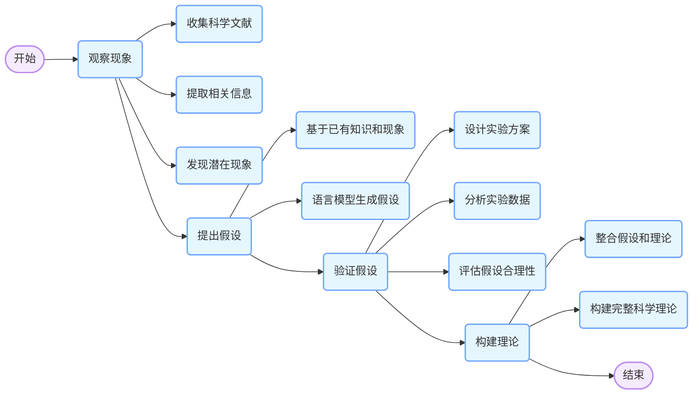

# 语言模型在科学理论生成中的应用探索

> 关键词：语言模型、科学理论生成、自然语言处理、知识图谱、机器学习

> 摘要：本文旨在深入探索语言模型在科学理论生成中的应用。随着自然语言处理技术的飞速发展，语言模型展现出了强大的文本生成和知识理解能力。文章将详细介绍语言模型的核心概念与架构，阐述其在科学理论生成中的核心算法原理和操作步骤，通过数学模型和公式进行理论支撑，并结合实际案例展示语言模型在科学理论生成中的具体应用。此外，还会探讨语言模型在该领域面临的挑战和未来发展趋势，为相关研究和实践提供全面的参考。

## 1. 背景介绍 
### 1.1 目的和范围
科学理论的生成是一个复杂且具有创造性的过程，传统方法往往依赖于科学家的专业知识和长期的研究积累。近年来，语言模型的出现为科学理论生成带来了新的思路和方法。本研究的目的在于探索语言模型如何辅助和促进科学理论的生成，具体范围包括语言模型在不同科学领域（如物理学、生物学、化学等）的应用可能性，以及如何利用语言模型处理科学文献、生成假设和构建理论框架等方面。

### 1.2 预期读者
本文预期读者包括自然语言处理领域的研究人员、科学家、科研工作者以及对科学理论生成和语言模型应用感兴趣的技术爱好者。对于自然语言处理研究人员，本文可以为他们拓展研究方向提供参考；对于科学家和科研工作者，能够帮助他们了解如何利用语言模型提高科学研究的效率和质量；对于技术爱好者，则可以作为了解语言模型在科学领域应用的入门资料。

### 1.3 文档结构概述
本文将按照以下结构进行组织：首先介绍语言模型和科学理论生成的核心概念以及它们之间的联系；接着详细阐述语言模型在科学理论生成中所涉及的核心算法原理和具体操作步骤；然后通过数学模型和公式对相关理论进行深入讲解，并举例说明；再通过实际项目案例展示语言模型在科学理论生成中的具体应用；之后探讨语言模型在科学理论生成中的实际应用场景；推荐相关的学习资源、开发工具和论文著作；最后总结语言模型在科学理论生成中的未来发展趋势与挑战，并提供常见问题的解答和扩展阅读资料。

### 1.4 术语表
#### 1.4.1 核心术语定义
- **语言模型**：是一种基于概率统计的模型，用于计算文本序列出现的概率。它可以根据输入的文本生成下一个可能的单词或句子，反映了语言的语法和语义结构。
- **科学理论生成**：指的是通过对科学现象的观察、实验和分析，构建出能够解释这些现象的理论体系的过程。
- **自然语言处理（NLP）**：是计算机科学与语言学的交叉领域，旨在让计算机能够理解、处理和生成人类语言。

#### 1.4.2 相关概念解释
- **知识图谱**：是一种以图的形式表示知识的方法，节点表示实体，边表示实体之间的关系。它可以用于存储和组织科学知识，为语言模型提供丰富的背景信息。
- **机器学习**：是一门多领域交叉学科，涉及概率论、统计学、逼近论、凸分析、算法复杂度理论等多门学科。它专门研究计算机怎样模拟或实现人类的学习行为，以获取新的知识或技能，重新组织已有的知识结构使之不断改善自身的性能。

#### 1.4.3 缩略词列表
- **NLP**：自然语言处理（Natural Language Processing）
- **LM**：语言模型（Language Model）
- **BERT**：基于变压器的双向编码器表示（Bidirectional Encoder Representations from Transformers）
- **GPT**：生成式预训练变换器（Generative Pretrained Transformer）

## 2. 核心概念与联系 

### 2.1 语言模型的原理和架构
语言模型的核心目标是计算一个文本序列 $w_1, w_2, \cdots, w_n$ 出现的概率 $P(w_1, w_2, \cdots, w_n)$。常见的语言模型包括基于统计的 $n$-gram 模型和基于深度学习的神经网络模型，如循环神经网络（RNN）、长短期记忆网络（LSTM）和变换器（Transformer）等。

#### 2.1.1 $n$-gram 模型
$n$-gram 模型是一种基于统计的语言模型，它假设一个词的出现只与它前面的 $n-1$ 个词有关。具体来说，$n$-gram 模型计算的概率为：

$$P(w_i|w_1, w_2, \cdots, w_{i-1}) \approx P(w_i|w_{i-n+1}, w_{i-n+2}, \cdots, w_{i-1})$$

其中，$P(w_i|w_{i-n+1}, w_{i-n+2}, \cdots, w_{i-1})$ 可以通过语料库中相应 $n$-gram 的频率来估计。

#### 2.1.2 神经网络语言模型
神经网络语言模型通过神经网络来学习语言的概率分布。以变换器为例，它是一种基于自注意力机制的神经网络架构，能够并行处理输入序列，有效捕捉长距离依赖关系。变换器由编码器和解码器组成，编码器将输入序列转换为一系列的隐藏表示，解码器根据这些表示生成输出序列。

### 2.2 科学理论生成的过程
科学理论生成通常包括以下几个步骤：
1. **观察现象**：科学家通过实验、观察等方式收集科学现象的数据。
2. **提出假设**：根据观察到的现象，提出可能的解释或假设。
3. **验证假设**：通过进一步的实验和数据分析，验证假设的正确性。
4. **构建理论**：如果假设得到验证，将其整合到已有的科学知识体系中，构建新的科学理论。

### 2.3 语言模型与科学理论生成的联系
语言模型可以在科学理论生成的各个阶段发挥作用：
- **在观察现象阶段**：语言模型可以帮助科学家处理和分析大量的科学文献，提取相关信息，发现潜在的科学现象。
- **在提出假设阶段**：语言模型可以根据已有的科学知识和观察到的现象，生成可能的假设。
- **在验证假设阶段**：语言模型可以辅助科学家设计实验方案，分析实验数据，评估假设的合理性。
- **在构建理论阶段**：语言模型可以帮助科学家整合不同的假设和理论，构建更加完整和系统的科学理论。

### 2.4 文本示意图和 Mermaid 流程图
#### 2.4.1 文本示意图
```plaintext
科学理论生成流程
|-- 观察现象
|   |-- 收集科学文献
|   |-- 提取相关信息
|   |-- 发现潜在现象
|-- 提出假设
|   |-- 基于已有知识和现象
|   |-- 语言模型生成假设
|-- 验证假设
|   |-- 设计实验方案
|   |-- 分析实验数据
|   |-- 评估假设合理性
|-- 构建理论
|   |-- 整合假设和理论
|   |-- 构建完整科学理论
```

#### 2.4.2 Mermaid 流程图


## 3. 核心算法原理 & 具体操作步骤 

### 3.1 核心算法原理
在科学理论生成中，我们主要使用基于变换器的语言模型，如 GPT 系列和 BERT 等。这些模型的核心算法是自注意力机制，它能够计算输入序列中每个位置与其他位置之间的相关性，从而捕捉长距离依赖关系。

#### 3.1.1 自注意力机制
自注意力机制的核心思想是通过计算查询（Query）、键（Key）和值（Value）之间的相似度，为输入序列中的每个位置分配不同的权重。具体来说，对于输入序列 $X = [x_1, x_2, \cdots, x_n]$，我们首先将其分别映射到查询矩阵 $Q$、键矩阵 $K$ 和值矩阵 $V$：

$$Q = XW_Q$$
$$K = XW_K$$
$$V = XW_V$$

其中，$W_Q$、$W_K$ 和 $W_V$ 是可学习的权重矩阵。然后，计算注意力分数：

$$Attention(Q, K, V) = softmax\left(\frac{QK^T}{\sqrt{d_k}}\right)V$$

其中，$d_k$ 是查询和键的维度，$softmax$ 函数用于将注意力分数归一化到 $[0, 1]$ 之间。

#### 3.1.2 多头注意力机制
为了捕捉不同类型的依赖关系，我们通常使用多头注意力机制。多头注意力机制将自注意力机制重复多次，每次使用不同的权重矩阵进行计算，然后将结果拼接起来：

$$MultiHead(Q, K, V) = Concat(head_1, head_2, \cdots, head_h)W_O$$

其中，$head_i = Attention(QW_{Q_i}, KW_{K_i}, VW_{V_i})$，$W_{Q_i}$、$W_{K_i}$ 和 $W_{V_i}$ 是第 $i$ 个头的权重矩阵，$W_O$ 是输出权重矩阵。

### 3.2 具体操作步骤
#### 3.2.1 数据预处理
在使用语言模型进行科学理论生成之前，需要对科学文献数据进行预处理。具体步骤包括：
1. **文本清洗**：去除文本中的噪声信息，如 HTML 标签、标点符号等。
2. **分词**：将文本分割成单词或子词。
3. **编码**：将分词后的文本转换为数字编码，以便输入到语言模型中。

#### 3.2.2 模型训练
使用预处理后的数据对语言模型进行训练。训练过程通常包括以下步骤：
1. **定义损失函数**：常用的损失函数是交叉熵损失函数，用于衡量模型预测结果与真实标签之间的差异。
2. **优化器选择**：选择合适的优化器，如随机梯度下降（SGD）、Adam 等，用于更新模型的参数。
3. **训练循环**：在训练数据上进行多次迭代，不断更新模型的参数，直到模型收敛。

#### 3.2.3 假设生成
训练好的语言模型可以用于生成科学假设。具体步骤如下：
1. **输入上下文**：将观察到的科学现象和已有的科学知识作为输入上下文，输入到语言模型中。
2. **生成假设**：语言模型根据输入上下文生成可能的假设。
3. **筛选假设**：对生成的假设进行筛选，选择最合理和最有潜力的假设进行进一步验证。

### 3.3 Python 源代码实现
```python
import torch
import torch.nn as nn
import torch.optim as optim
from transformers import GPT2LMHeadModel, GPT2Tokenizer

# 数据预处理
tokenizer = GPT2Tokenizer.from_pretrained('gpt2')
def preprocess_text(text):
    # 文本清洗
    text = text.replace('\n', ' ')
    # 分词和编码
    input_ids = tokenizer.encode(text, return_tensors='pt')
    return input_ids

# 模型训练
model = GPT2LMHeadModel.from_pretrained('gpt2')
criterion = nn.CrossEntropyLoss()
optimizer = optim.Adam(model.parameters(), lr=1e-4)

def train_model(model, input_ids, epochs=10):
    model.train()
    for epoch in range(epochs):
        optimizer.zero_grad()
        outputs = model(input_ids, labels=input_ids)
        loss = outputs.loss
        loss.backward()
        optimizer.step()
        print(f'Epoch {epoch+1}/{epochs}, Loss: {loss.item()}')

# 假设生成
def generate_hypothesis(model, input_text, max_length=100):
    model.eval()
    input_ids = preprocess_text(input_text)
    with torch.no_grad():
        output = model.generate(input_ids, max_length=max_length)
    hypothesis = tokenizer.decode(output[0], skip_special_tokens=True)
    return hypothesis

# 示例
input_text = "在某些化学反应中，反应速率会随着温度的升高而加快。请提出可能的解释。"
input_ids = preprocess_text(input_text)
train_model(model, input_ids)
hypothesis = generate_hypothesis(model, input_text)
print("生成的假设:", hypothesis)
```

## 4. 数学模型和公式 & 详细讲解 & 举例说明 

### 4.1 语言模型的数学基础
语言模型的核心是计算文本序列的概率分布。对于一个长度为 $n$ 的文本序列 $w_1, w_2, \cdots, w_n$，其概率可以表示为：

$$P(w_1, w_2, \cdots, w_n) = \prod_{i=1}^{n} P(w_i|w_1, w_2, \cdots, w_{i-1})$$

在 $n$-gram 模型中，我们假设一个词的出现只与它前面的 $n-1$ 个词有关，因此上述概率可以近似为：

$$P(w_1, w_2, \cdots, w_n) \approx \prod_{i=1}^{n} P(w_i|w_{i-n+1}, w_{i-n+2}, \cdots, w_{i-1})$$

其中，$P(w_i|w_{i-n+1}, w_{i-n+2}, \cdots, w_{i-1})$ 可以通过语料库中相应 $n$-gram 的频率来估计：

$$P(w_i|w_{i-n+1}, w_{i-n+2}, \cdots, w_{i-1}) = \frac{Count(w_{i-n+1}, w_{i-n+2}, \cdots, w_{i})}{Count(w_{i-n+1}, w_{i-n+2}, \cdots, w_{i-1})}$$

### 4.2 自注意力机制的数学原理
自注意力机制的核心是计算查询（Query）、键（Key）和值（Value）之间的相似度。对于输入序列 $X = [x_1, x_2, \cdots, x_n]$，我们首先将其分别映射到查询矩阵 $Q$、键矩阵 $K$ 和值矩阵 $V$：

$$Q = XW_Q$$
$$K = XW_K$$
$$V = XW_V$$

其中，$W_Q$、$W_K$ 和 $W_V$ 是可学习的权重矩阵。然后，计算注意力分数：

$$Attention(Q, K, V) = softmax\left(\frac{QK^T}{\sqrt{d_k}}\right)V$$

其中，$d_k$ 是查询和键的维度，$softmax$ 函数用于将注意力分数归一化到 $[0, 1]$ 之间。

### 4.3 多头注意力机制的数学原理
多头注意力机制将自注意力机制重复多次，每次使用不同的权重矩阵进行计算，然后将结果拼接起来：

$$MultiHead(Q, K, V) = Concat(head_1, head_2, \cdots, head_h)W_O$$

其中，$head_i = Attention(QW_{Q_i}, KW_{K_i}, VW_{V_i})$，$W_{Q_i}$、$W_{K_i}$ 和 $W_{V_i}$ 是第 $i$ 个头的权重矩阵，$W_O$ 是输出权重矩阵。

### 4.4 举例说明
假设我们有一个输入序列 $X = [x_1, x_2, x_3]$，其中 $x_i$ 是一个 $d$ 维的向量。我们首先将其分别映射到查询矩阵 $Q$、键矩阵 $K$ 和值矩阵 $V$：

$$Q = XW_Q = \begin{bmatrix} x_1 \\ x_2 \\ x_3 \end{bmatrix} \begin{bmatrix} w_{Q1}^T \\ w_{Q2}^T \\ w_{Q3}^T \end{bmatrix} = \begin{bmatrix} x_1^T w_{Q1} & x_1^T w_{Q2} & x_1^T w_{Q3} \\ x_2^T w_{Q1} & x_2^T w_{Q2} & x_2^T w_{Q3} \\ x_3^T w_{Q1} & x_3^T w_{Q2} & x_3^T w_{Q3} \end{bmatrix}$$

$$K = XW_K = \begin{bmatrix} x_1 \\ x_2 \\ x_3 \end{bmatrix} \begin{bmatrix} w_{K1}^T \\ w_{K2}^T \\ w_{K3}^T \end{bmatrix} = \begin{bmatrix} x_1^T w_{K1} & x_1^T w_{K2} & x_1^T w_{K3} \\ x_2^T w_{K1} & x_2^T w_{K2} & x_2^T w_{K3} \\ x_3^T w_{K1} & x_3^T w_{K2} & x_3^T w_{K3} \end{bmatrix}$$

$$V = XW_V = \begin{bmatrix} x_1 \\ x_2 \\ x_3 \end{bmatrix} \begin{bmatrix} w_{V1}^T \\ w_{V2}^T \\ w_{V3}^T \end{bmatrix} = \begin{bmatrix} x_1^T w_{V1} & x_1^T w_{V2} & x_1^T w_{V3} \\ x_2^T w_{V1} & x_2^T w_{V2} & x_2^T w_{V3} \\ x_3^T w_{V1} & x_3^T w_{V2} & x_3^T w_{V3} \end{bmatrix}$$

然后，计算注意力分数：

$$Attention(Q, K, V) = softmax\left(\frac{QK^T}{\sqrt{d_k}}\right)V$$

假设 $d_k = 3$，则：

$$QK^T = \begin{bmatrix} x_1^T w_{Q1} & x_1^T w_{Q2} & x_1^T w_{Q3} \\ x_2^T w_{Q1} & x_2^T w_{Q2} & x_2^T w_{Q3} \\ x_3^T w_{Q1} & x_3^T w_{Q2} & x_3^T w_{Q3} \end{bmatrix} \begin{bmatrix} x_1^T w_{K1} & x_2^T w_{K1} & x_3^T w_{K1} \\ x_1^T w_{K2} & x_2^T w_{K2} & x_3^T w_{K2} \\ x_1^T w_{K3} & x_2^T w_{K3} & x_3^T w_{K3} \end{bmatrix}$$

$$softmax\left(\frac{QK^T}{\sqrt{d_k}}\right) = \begin{bmatrix} \frac{e^{\frac{(QK^T)_{11}}{\sqrt{3}}}}{\sum_{j=1}^{3} e^{\frac{(QK^T)_{1j}}{\sqrt{3}}}} & \frac{e^{\frac{(QK^T)_{12}}{\sqrt{3}}}}{\sum_{j=1}^{3} e^{\frac{(QK^T)_{1j}}{\sqrt{3}}}} & \frac{e^{\frac{(QK^T)_{13}}{\sqrt{3}}}}{\sum_{j=1}^{3} e^{\frac{(QK^T)_{1j}}{\sqrt{3}}}} \\ \frac{e^{\frac{(QK^T)_{21}}{\sqrt{3}}}}{\sum_{j=1}^{3} e^{\frac{(QK^T)_{2j}}{\sqrt{3}}}} & \frac{e^{\frac{(QK^T)_{22}}{\sqrt{3}}}}{\sum_{j=1}^{3} e^{\frac{(QK^T)_{2j}}{\sqrt{3}}}} & \frac{e^{\frac{(QK^T)_{23}}{\sqrt{3}}}}{\sum_{j=1}^{3} e^{\frac{(QK^T)_{2j}}{\sqrt{3}}}} \\ \frac{e^{\frac{(QK^T)_{31}}{\sqrt{3}}}}{\sum_{j=1}^{3} e^{\frac{(QK^T)_{3j}}{\sqrt{3}}}} & \frac{e^{\frac{(QK^T)_{32}}{\sqrt{3}}}}{\sum_{j=1}^{3} e^{\frac{(QK^T)_{3j}}{\sqrt{3}}}} & \frac{e^{\frac{(QK^T)_{33}}{\sqrt{3}}}}{\sum_{j=1}^{3} e^{\frac{(QK^T)_{3j}}{\sqrt{3}}}} \end{bmatrix}$$

最后，计算注意力输出：

$$Attention(Q, K, V) = softmax\left(\frac{QK^T}{\sqrt{d_k}}\right)V$$

## 5. 项目实战：代码实际案例和详细解释说明 

### 5.1 开发环境搭建
#### 5.1.1 安装 Python
首先，确保你已经安装了 Python 3.6 或更高版本。可以从 Python 官方网站（https://www.python.org/downloads/）下载并安装 Python。

#### 5.1.2 创建虚拟环境
为了避免不同项目之间的依赖冲突，建议使用虚拟环境。可以使用 `venv` 模块创建虚拟环境：

```bash
python -m venv myenv
```

激活虚拟环境：

- 在 Windows 上：
```bash
myenv\Scripts\activate
```

- 在 Linux 或 macOS 上：
```bash
source myenv/bin/activate
```

#### 5.1.3 安装依赖库
在虚拟环境中安装所需的依赖库，包括 `torch`、`transformers` 等：

```bash
pip install torch transformers
```

### 5.2 源代码详细实现和代码解读
```python
import torch
import torch.nn as nn
import torch.optim as optim
from transformers import GPT2LMHeadModel, GPT2Tokenizer

# 数据预处理
tokenizer = GPT2Tokenizer.from_pretrained('gpt2')
def preprocess_text(text):
    # 文本清洗
    text = text.replace('\n', ' ')
    # 分词和编码
    input_ids = tokenizer.encode(text, return_tensors='pt')
    return input_ids

# 模型训练
model = GPT2LMHeadModel.from_pretrained('gpt2')
criterion = nn.CrossEntropyLoss()
optimizer = optim.Adam(model.parameters(), lr=1e-4)

def train_model(model, input_ids, epochs=10):
    model.train()
    for epoch in range(epochs):
        optimizer.zero_grad()
        outputs = model(input_ids, labels=input_ids)
        loss = outputs.loss
        loss.backward()
        optimizer.step()
        print(f'Epoch {epoch+1}/{epochs}, Loss: {loss.item()}')

# 假设生成
def generate_hypothesis(model, input_text, max_length=100):
    model.eval()
    input_ids = preprocess_text(input_text)
    with torch.no_grad():
        output = model.generate(input_ids, max_length=max_length)
    hypothesis = tokenizer.decode(output[0], skip_special_tokens=True)
    return hypothesis

# 示例
input_text = "在某些化学反应中，反应速率会随着温度的升高而加快。请提出可能的解释。"
input_ids = preprocess_text(input_text)
train_model(model, input_ids)
hypothesis = generate_hypothesis(model, input_text)
print("生成的假设:", hypothesis)
```

#### 5.2.1 数据预处理
- `tokenizer = GPT2Tokenizer.from_pretrained('gpt2')`：加载预训练的 GPT-2 分词器。
- `preprocess_text` 函数：对输入文本进行清洗，去除换行符，然后使用分词器将文本转换为数字编码。

#### 5.2.2 模型训练
- `model = GPT2LMHeadModel.from_pretrained('gpt2')`：加载预训练的 GPT-2 语言模型。
- `criterion = nn.CrossEntropyLoss()`：定义交叉熵损失函数。
- `optimizer = optim.Adam(model.parameters(), lr=1e-4)`：定义 Adam 优化器，学习率为 $1e-4$。
- `train_model` 函数：在输入数据上对模型进行训练，每个 epoch 打印一次损失值。

#### 5.2.3 假设生成
- `generate_hypothesis` 函数：将模型设置为评估模式，对输入文本进行编码，然后使用 `model.generate` 方法生成假设，最后将生成的编码转换为文本。

### 5.3 代码解读与分析
#### 5.3.1 数据预处理的重要性
数据预处理是自然语言处理任务中的关键步骤，它可以提高模型的训练效率和性能。在本项目中，我们对输入文本进行清洗和编码，确保模型能够正确处理输入数据。

#### 5.3.2 模型训练的注意事项
在模型训练过程中，需要注意以下几点：
- **学习率的选择**：学习率过大可能导致模型无法收敛，学习率过小可能导致训练速度过慢。可以通过实验选择合适的学习率。
- **训练轮数的选择**：训练轮数过多可能导致模型过拟合，训练轮数过少可能导致模型欠拟合。可以通过交叉验证选择合适的训练轮数。

#### 5.3.3 假设生成的局限性
虽然语言模型可以生成看似合理的假设，但这些假设的质量和可靠性还需要进一步验证。在实际应用中，需要结合科学知识和实验数据对生成的假设进行筛选和评估。

## 6. 实际应用场景 
### 6.1 物理学领域
在物理学领域，语言模型可以帮助物理学家处理大量的科学文献，提取相关信息，发现潜在的物理现象。例如，通过分析天体物理学文献，语言模型可以生成关于黑洞、暗物质等未知现象的假设，为物理学家提供新的研究方向。

### 6.2 生物学领域
在生物学领域，语言模型可以辅助生物学家进行基因序列分析、蛋白质结构预测等任务。例如，通过分析大量的基因序列数据，语言模型可以生成关于基因功能和疾病机制的假设，为生物医学研究提供支持。

### 6.3 化学领域
在化学领域，语言模型可以帮助化学家设计新的化学反应和材料。例如，通过分析化学文献和实验数据，语言模型可以生成关于化学反应机理和材料性能的假设，为化学合成和材料研发提供指导。

### 6.4 其他领域
除了上述领域，语言模型还可以应用于天文学、地质学、心理学等多个科学领域，为科学研究提供新的工具和方法。

## 7. 工具和资源推荐
### 7.1 学习资源推荐
#### 7.1.1 书籍推荐
- 《自然语言处理入门》：作者何晗，本书系统介绍了自然语言处理的基本概念、方法和技术，适合初学者入门。
- 《深度学习》：作者 Ian Goodfellow、Yoshua Bengio 和 Aaron Courville，本书是深度学习领域的经典教材，全面介绍了深度学习的理论和实践。
- 《Python 自然语言处理》：作者 Steven Bird、Ewan Klein 和 Edward Loper，本书介绍了如何使用 Python 进行自然语言处理，包含大量的代码示例和实践项目。

#### 7.1.2 在线课程
- Coursera 上的“自然语言处理专项课程”：由斯坦福大学教授授课，系统介绍了自然语言处理的各个方面，包括词法分析、句法分析、语义分析等。
- edX 上的“深度学习基础”：由微软研究院的专家授课，介绍了深度学习的基本概念、算法和应用。
- 哔哩哔哩上的“李宏毅机器学习课程”：由台湾大学教授李宏毅授课，课程内容生动有趣，适合初学者学习。

#### 7.1.3 技术博客和网站
- Medium：是一个技术博客平台，上面有很多自然语言处理和深度学习领域的优秀文章。
- arXiv：是一个预印本平台，上面有很多最新的学术论文，包括自然语言处理和机器学习领域的研究成果。
- 机器之心：是一个专注于人工智能领域的媒体平台，提供了大量的技术文章、研究报告和行业动态。

### 7.2 开发工具框架推荐
#### 7.2.1 IDE和编辑器
- PyCharm：是一款专门为 Python 开发设计的集成开发环境，具有代码编辑、调试、版本控制等功能。
- Jupyter Notebook：是一个交互式的开发环境，适合进行数据分析和模型实验。
- Visual Studio Code：是一款轻量级的代码编辑器，支持多种编程语言和插件扩展。

#### 7.2.2 调试和性能分析工具
- TensorBoard：是 TensorFlow 提供的一个可视化工具，可以用于查看模型的训练过程、损失曲线、模型结构等。
- PyTorch Profiler：是 PyTorch 提供的一个性能分析工具，可以用于分析模型的运行时间、内存使用情况等。
- cProfile：是 Python 内置的一个性能分析工具，可以用于分析 Python 代码的运行时间和函数调用情况。

#### 7.2.3 相关框架和库
- PyTorch：是一个开源的深度学习框架，具有动态图、易于使用等特点，广泛应用于自然语言处理和计算机视觉领域。
- TensorFlow：是一个开源的深度学习框架，具有分布式训练、模型部署等功能，被广泛应用于工业界和学术界。
- Transformers：是一个基于 PyTorch 和 TensorFlow 的自然语言处理库，提供了多种预训练的语言模型，如 BERT、GPT-2 等。

### 7.3 相关论文著作推荐
#### 7.3.1 经典论文
- 《Attention Is All You Need》：提出了变换器（Transformer）架构，是自然语言处理领域的经典论文。
- 《BERT: Pre-training of Deep Bidirectional Transformers for Language Understanding》：介绍了 BERT 模型，该模型在多个自然语言处理任务中取得了显著的性能提升。
- 《Generative Pretrained Transformer 2 (GPT-2)》：介绍了 GPT-2 模型，该模型在文本生成任务中表现出色。

#### 7.3.2 最新研究成果
- 《Improving Language Understanding by Generative Pre-Training》：提出了基于生成式预训练的语言模型，为语言模型的发展提供了新的思路。
- 《XLNet: Generalized Autoregressive Pretraining for Language Understanding》：提出了 XLNet 模型，该模型结合了自回归和自编码的优点，在多个自然语言处理任务中取得了更好的性能。
- 《RoBERTa: A Robustly Optimized BERT Pretraining Approach》：对 BERT 模型进行了优化，提出了 RoBERTa 模型，该模型在多个自然语言处理任务中取得了更好的性能。

#### 7.3.3 应用案例分析
- 《Using Language Models for Scientific Discovery》：介绍了语言模型在科学发现中的应用，包括如何使用语言模型生成科学假设和构建科学理论。
- 《Natural Language Processing for Biology and Medicine》：介绍了自然语言处理在生物学和医学领域的应用，包括基因序列分析、蛋白质结构预测等任务。
- 《Applying Language Models to Chemistry and Materials Science》：介绍了语言模型在化学和材料科学领域的应用，包括化学反应设计、材料性能预测等任务。

## 8. 总结：未来发展趋势与挑战
### 8.1 未来发展趋势
#### 8.1.1 模型规模的不断扩大
随着计算能力的不断提升，语言模型的规模将不断扩大。更大的模型通常具有更强的语言理解和生成能力，能够在更多的科学领域发挥作用。

#### 8.1.2 多模态融合
未来的语言模型将不仅仅局限于处理文本数据，还将融合图像、音频、视频等多模态数据。多模态融合可以提供更丰富的信息，有助于生成更准确和全面的科学理论。

#### 8.1.3 可解释性和可信赖性的提升
随着语言模型在科学研究中的应用越来越广泛，其可解释性和可信赖性将成为重要的研究方向。未来的语言模型需要能够解释其生成的假设和理论的依据，并且具有较高的可靠性和稳定性。

### 8.2 挑战
#### 8.2.1 数据质量和多样性
语言模型的性能很大程度上依赖于训练数据的质量和多样性。在科学领域，数据的质量和多样性往往受到限制，如何获取高质量和多样化的科学数据是一个挑战。

#### 8.2.2 模型的泛化能力
虽然语言模型在某些任务上取得了很好的性能，但在面对新的科学问题和领域时，其泛化能力仍然有待提高。如何提高语言模型的泛化能力，使其能够在不同的科学领域中发挥作用，是一个需要解决的问题。

#### 8.2.3 伦理和法律问题
语言模型在科学理论生成中的应用可能会带来一些伦理和法律问题，如数据隐私、知识产权等。如何在应用语言模型的过程中，遵守伦理和法律规定，是一个需要关注的问题。

## 9. 附录：常见问题与解答
### 9.1 语言模型生成的假设一定是正确的吗？
不一定。语言模型生成的假设只是基于已有的科学知识和输入的上下文，其质量和可靠性还需要进一步验证。在实际应用中，需要结合科学知识和实验数据对生成的假设进行筛选和评估。

### 9.2 如何提高语言模型在科学理论生成中的性能？
可以从以下几个方面提高语言模型在科学理论生成中的性能：
- **使用高质量的训练数据**：确保训练数据的质量和多样性，包含丰富的科学知识和信息。
- **调整模型参数**：通过实验选择合适的模型参数，如学习率、训练轮数等。
- **融合其他技术**：可以将语言模型与知识图谱、机器学习等技术相结合，提高模型的性能和泛化能力。

### 9.3 语言模型在科学理论生成中的应用有哪些局限性？
语言模型在科学理论生成中的应用存在以下局限性：
- **缺乏真正的理解**：语言模型只是基于统计规律生成文本，缺乏对科学概念和现象的真正理解。
- **数据依赖**：语言模型的性能很大程度上依赖于训练数据的质量和多样性，如果训练数据不足或存在偏差，可能会影响模型的性能。
- **可解释性差**：语言模型的决策过程往往是黑盒的，难以解释其生成的假设和理论的依据。

## 10. 扩展阅读 & 参考资料
### 10.1 扩展阅读
- 《科学革命的结构》：作者托马斯·库恩，本书介绍了科学发展的范式转换理论，对理解科学理论生成的过程具有重要的启示作用。
- 《人工智能时代的科学革命》：作者周志华，本书探讨了人工智能技术对科学研究的影响和挑战，以及如何利用人工智能推动科学革命。
- 《自然语言处理综论》：作者 Daniel Jurafsky 和 James H. Martin，本书是自然语言处理领域的经典教材，全面介绍了自然语言处理的各个方面。

### 10.2 参考资料
- 《Attention Is All You Need》：https://arxiv.org/abs/1706.03762
- 《BERT: Pre-training of Deep Bidirectional Transformers for Language Understanding》：https://arxiv.org/abs/1810.04805
- 《Generative Pretrained Transformer 2 (GPT-2)》：https://d4mucfpksywv.cloudfront.net/better-language-models/language-models.pdf
- 《Improving Language Understanding by Generative Pre-Training》：https://s3-us-west-2.amazonaws.com/openai-assets/research-covers/language-unsupervised/language_understanding_paper.pdf
- 《XLNet: Generalized Autoregressive Pretraining for Language Understanding》：https://arxiv.org/abs/1906.08237
- 《RoBERTa: A Robustly Optimized BERT Pretraining Approach》：https://arxiv.org/abs/1907.11692

作者：AI天才研究院/AI Genius Institute & 禅与计算机程序设计艺术 /Zen And The Art of Computer Programming