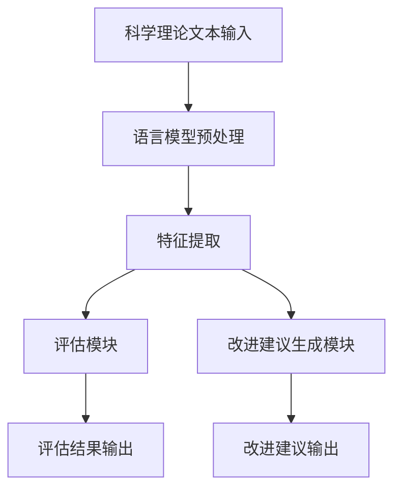

# 语言模型在科学理论评估与改进中的应用

> 关键词：语言模型、科学理论评估、科学理论改进、自然语言处理、知识图谱

> 摘要：本文深入探讨了语言模型在科学理论评估与改进中的应用。首先介绍了相关背景，包括目的、预期读者、文档结构和术语表。接着阐述了核心概念及其联系，展示了相关原理和架构的示意图与流程图。详细讲解了核心算法原理，并用 Python 代码进行说明。同时给出了数学模型和公式，并举例阐释。通过项目实战展示了代码的实际应用和详细解读。分析了语言模型在科学理论评估与改进中的实际应用场景。推荐了学习资源、开发工具框架和相关论文著作。最后总结了未来发展趋势与挑战，还提供了常见问题解答和扩展阅读参考资料，旨在为研究者和从业者全面了解语言模型在该领域的应用提供深入的指导。

## 1. 背景介绍 
### 1.1 目的和范围
科学理论是人类对自然规律和社会现象的理性认识，其评估与改进对于推动科学发展至关重要。传统的科学理论评估与改进方法往往依赖于专家的主观判断和复杂的实验验证，效率较低且具有一定的局限性。随着人工智能技术的发展，语言模型逐渐展现出在处理自然语言文本方面的强大能力。本文章的目的在于探讨如何利用语言模型的优势，实现科学理论的高效评估与改进，为科学研究提供新的思路和方法。本文的范围涵盖了语言模型在科学理论评估与改进中的基本原理、算法实现、实际应用以及相关工具和资源的推荐。

### 1.2 预期读者
本文预期读者包括从事自然语言处理、人工智能、科学哲学、各具体科学领域研究的科研人员，对科学研究方法创新感兴趣的学者，以及希望了解语言模型在科学领域应用的技术爱好者和学生。

### 1.3 文档结构概述
本文将按照以下结构展开：首先介绍相关背景知识，包括目的、读者和文档结构概述以及术语表；接着阐述语言模型在科学理论评估与改进中的核心概念及其联系；然后详细讲解核心算法原理和具体操作步骤，并给出相应的 Python 代码；之后介绍数学模型和公式，并通过实例进行说明；通过项目实战展示代码的实际应用和详细解读；分析语言模型在科学理论评估与改进中的实际应用场景；推荐相关的学习资源、开发工具框架和论文著作；最后总结未来发展趋势与挑战，提供常见问题解答和扩展阅读参考资料。

### 1.4 术语表
#### 1.4.1 核心术语定义
- **语言模型**：是一种基于概率统计的模型，用于预测给定上下文下下一个词出现的概率。它可以对自然语言文本进行建模，学习语言的模式和规律。
- **科学理论评估**：对科学理论的合理性、准确性、有效性等方面进行评价和判断的过程。
- **科学理论改进**：在评估的基础上，对科学理论进行修正、完善和优化的过程。
- **知识图谱**：一种结构化的语义网络，用于表示实体、概念及其之间的关系，能够为语言模型提供丰富的背景知识。

#### 1.4.2 相关概念解释
- **自然语言处理**：是人工智能的一个重要分支，旨在让计算机能够理解、处理和生成自然语言文本。语言模型是自然语言处理中的关键技术之一。
- **机器学习**：是一门多领域交叉学科，涉及概率论、统计学、逼近论、凸分析、算法复杂度理论等多门学科。它专门研究计算机怎样模拟或实现人类的学习行为，以获取新的知识或技能，重新组织已有的知识结构使之不断改善自身的性能。语言模型的训练通常基于机器学习算法。

#### 1.4.3 缩略词列表
- **NLP**：Natural Language Processing，自然语言处理
- **ML**：Machine Learning，机器学习
- **LLM**：Large Language Model，大语言模型

## 2. 核心概念与联系 

### 核心概念原理
语言模型在科学理论评估与改进中的应用主要基于以下原理：语言模型通过大量的文本数据进行训练，学习到了语言的语法、语义和语用等方面的知识。在科学理论评估方面，语言模型可以对科学文献中的理论描述进行分析，判断其逻辑合理性、内部一致性和与已有知识的兼容性。例如，通过检查理论描述中的语句是否符合逻辑规则，是否存在矛盾或歧义等。在科学理论改进方面，语言模型可以根据已有的科学知识和理论上下文，生成可能的改进建议。它可以利用自身学习到的知识图谱和语言模式，为理论的完善提供新的思路和方向。

### 架构的文本示意图
```plaintext
科学理论文本输入 -> 语言模型预处理（分词、词性标注等） -> 特征提取（词向量表示、句法结构等） -> 评估模块（逻辑分析、一致性检查等） -> 评估结果输出
                                         |
                                         V
                                改进建议生成模块（基于知识图谱和上下文） -> 改进建议输出
```

### Mermaid 流程图


## 3. 核心算法原理 & 具体操作步骤 

### 核心算法原理
在语言模型用于科学理论评估与改进的过程中，主要涉及到文本分类、相似度计算和生成模型等算法。以下以一个简单的文本分类算法为例，说明如何评估科学理论的合理性。

文本分类的基本思想是将输入的科学理论文本划分到不同的类别中，例如“合理”、“不合理”、“待进一步研究”等。常用的文本分类算法有朴素贝叶斯分类器、支持向量机和深度学习中的神经网络等。这里我们使用简单的朴素贝叶斯分类器进行说明。

朴素贝叶斯分类器基于贝叶斯定理和特征条件独立假设。对于一个文本 $x=(x_1,x_2,\cdots,x_n)$，其中 $x_i$ 表示文本中的第 $i$ 个特征（例如单词），分类器要计算 $P(c_j|x)$，即文本 $x$ 属于类别 $c_j$ 的概率。根据贝叶斯定理：

$$P(c_j|x)=\frac{P(x|c_j)P(c_j)}{P(x)}$$

由于 $P(x)$ 对于所有类别都是相同的，因此可以忽略分母，只需要比较 $P(x|c_j)P(c_j)$ 的大小。在朴素贝叶斯分类器中，假设特征之间是条件独立的，即：

$$P(x|c_j)=\prod_{i=1}^{n}P(x_i|c_j)$$

### 具体操作步骤
1. **数据准备**：收集大量的科学理论文本，并标注其所属的类别（合理、不合理等）。
2. **特征提取**：将文本转换为特征向量，例如使用词袋模型或 TF-IDF 方法。
3. **模型训练**：使用训练数据对朴素贝叶斯分类器进行训练，计算 $P(c_j)$ 和 $P(x_i|c_j)$。
4. **模型评估**：使用测试数据对训练好的模型进行评估，计算准确率、召回率等指标。
5. **应用预测**：对于新的科学理论文本，使用训练好的模型进行分类预测。

### Python 源代码实现
```python
import numpy as np
from sklearn.feature_extraction.text import CountVectorizer
from sklearn.naive_bayes import MultinomialNB
from sklearn.model_selection import train_test_split
from sklearn.metrics import accuracy_score

# 示例数据
texts = ["This scientific theory is well - founded and consistent.",
         "This theory has many logical contradictions.",
         "The proposed theory needs more experimental verification."]
labels = ["reasonable", "unreasonable", "to_be_further_studied"]

# 特征提取
vectorizer = CountVectorizer()
X = vectorizer.fit_transform(texts)

# 划分训练集和测试集
X_train, X_test, y_train, y_test = train_test_split(X, labels, test_size=0.2, random_state=42)

# 模型训练
clf = MultinomialNB()
clf.fit(X_train, y_train)

# 模型预测
y_pred = clf.predict(X_test)

# 模型评估
accuracy = accuracy_score(y_test, y_pred)
print(f"Accuracy: {accuracy}")

# 对新文本进行预测
new_text = ["This theory seems to be quite reasonable."]
new_X = vectorizer.transform(new_text)
new_pred = clf.predict(new_X)
print(f"Prediction for new text: {new_pred[0]}")
```

## 4. 数学模型和公式 & 详细讲解 & 举例说明 

### 贝叶斯定理
贝叶斯定理是朴素贝叶斯分类器的基础，其公式为：

$$P(c|x)=\frac{P(x|c)P(c)}{P(x)}$$

其中：
- $P(c|x)$ 是后验概率，表示在给定特征 $x$ 的情况下，样本属于类别 $c$ 的概率。
- $P(x|c)$ 是似然概率，表示在类别 $c$ 的条件下，出现特征 $x$ 的概率。
- $P(c)$ 是先验概率，表示类别 $c$ 在总体中的出现概率。
- $P(x)$ 是证据概率，表示特征 $x$ 在总体中的出现概率。

### 详细讲解
在文本分类中，我们的目标是找到使得 $P(c|x)$ 最大的类别 $c$。由于 $P(x)$ 对于所有类别都是相同的，因此只需要比较 $P(x|c)P(c)$ 的大小。

先验概率 $P(c)$ 可以通过训练数据中各类别的样本数量来估计：

$$P(c)=\frac{N_c}{N}$$

其中 $N_c$ 是类别 $c$ 的样本数量，$N$ 是总的样本数量。

似然概率 $P(x_i|c)$ 可以通过训练数据中在类别 $c$ 下特征 $x_i$ 的出现频率来估计：

$$P(x_i|c)=\frac{N_{c,x_i}+\alpha}{N_c + \alpha n}$$

其中 $N_{c,x_i}$ 是在类别 $c$ 下特征 $x_i$ 的出现次数，$\alpha$ 是平滑参数（通常取 1），$n$ 是特征的总数。

### 举例说明
假设我们有一个文本分类任务，要判断文本是关于科学理论的“合理”还是“不合理”。训练数据如下：

| 文本 | 类别 |
| ---- | ---- |
| 该理论逻辑严谨，证据充分 | 合理 |
| 该理论存在明显漏洞 | 不合理 |
| 该理论符合现有科学知识 | 合理 |

总样本数 $N = 3$，“合理”类别的样本数 $N_{合理}=2$，“不合理”类别的样本数 $N_{不合理}=1$。

则先验概率：

$P(合理)=\frac{2}{3}$，$P(不合理)=\frac{1}{3}$

假设我们使用词袋模型，特征为“逻辑严谨”、“存在漏洞”、“符合现有科学知识”等。在“合理”类别中，“逻辑严谨”出现了 1 次，“符合现有科学知识”出现了 1 次。在“不合理”类别中，“存在漏洞”出现了 1 次。

假设特征总数 $n = 3$，平滑参数 $\alpha = 1$。

对于“合理”类别：

$P(逻辑严谨|合理)=\frac{1 + 1}{2+1\times3}=\frac{2}{5}$

对于“不合理”类别：

$P(存在漏洞|不合理)=\frac{1 + 1}{1+1\times3}=\frac{1}{2}$

当有新的文本“该理论逻辑严谨”时，我们可以计算：

$P(合理|该理论逻辑严谨)\propto P(该理论逻辑严谨|合理)P(合理)=\frac{2}{5}\times\frac{2}{3}=\frac{4}{15}$

$P(不合理|该理论逻辑严谨)\propto P(该理论逻辑严谨|不合理)P(不合理)$，由于“逻辑严谨”在“不合理”类别中未出现，$P(该理论逻辑严谨|不合理)=\frac{0 + 1}{1+1\times3}=\frac{1}{4}$，则 $P(不合理|该理论逻辑严谨)=\frac{1}{4}\times\frac{1}{3}=\frac{1}{12}$

因为 $\frac{4}{15}>\frac{1}{12}$，所以预测该文本属于“合理”类别。

## 5. 项目实战：代码实际案例和详细解释说明 

### 5.1  开发环境搭建
- **操作系统**：推荐使用 Linux 或 macOS 系统，也可以使用 Windows 系统。
- **Python 环境**：建议使用 Python 3.7 及以上版本。可以通过 Anaconda 或官方 Python 安装包进行安装。
- **依赖库安装**：使用以下命令安装所需的依赖库：
```bash
pip install numpy scikit - learn
```

### 5.2  源代码详细实现和代码解读
```python
import numpy as np
from sklearn.feature_extraction.text import CountVectorizer
from sklearn.naive_bayes import MultinomialNB
from sklearn.model_selection import train_test_split
from sklearn.metrics import accuracy_score

# 示例数据
texts = ["This scientific theory is well - founded and consistent.",
         "This theory has many logical contradictions.",
         "The proposed theory needs more experimental verification."]
labels = ["reasonable", "unreasonable", "to_be_further_studied"]

# 特征提取
vectorizer = CountVectorizer()
X = vectorizer.fit_transform(texts)
```
- `CountVectorizer` 是 scikit - learn 中的一个类，用于将文本转换为词袋模型表示。`fit_transform` 方法会先学习文本中的词汇表，然后将文本转换为特征向量。

```python
# 划分训练集和测试集
X_train, X_test, y_train, y_test = train_test_split(X, labels, test_size=0.2, random_state=42)
```
- `train_test_split` 函数用于将数据集划分为训练集和测试集，`test_size = 0.2` 表示测试集占总数据集的 20%，`random_state` 用于保证每次划分的结果相同。

```python
# 模型训练
clf = MultinomialNB()
clf.fit(X_train, y_train)
```
- `MultinomialNB` 是 scikit - learn 中的多项式朴素贝叶斯分类器。`fit` 方法用于使用训练数据对模型进行训练。

```python
# 模型预测
y_pred = clf.predict(X_test)

# 模型评估
accuracy = accuracy_score(y_test, y_pred)
print(f"Accuracy: {accuracy}")
```
- `predict` 方法用于对测试数据进行预测，`accuracy_score` 函数用于计算预测结果的准确率。

```python
# 对新文本进行预测
new_text = ["This theory seems to be quite reasonable."]
new_X = vectorizer.transform(new_text)
new_pred = clf.predict(new_X)
print(f"Prediction for new text: {new_pred[0]}")
```
- 对于新的文本，需要使用之前训练好的 `vectorizer` 进行特征提取，然后使用训练好的模型进行预测。

### 5.3  代码解读与分析
这段代码实现了一个简单的文本分类任务，用于评估科学理论的合理性。主要步骤包括数据准备、特征提取、模型训练、模型评估和新文本预测。通过使用朴素贝叶斯分类器，我们可以根据文本的特征来判断其所属的类别。

优点：
- 代码简单易懂，易于实现。
- 朴素贝叶斯分类器计算效率高，适合处理大规模文本数据。

缺点：
- 朴素贝叶斯分类器的特征独立性假设在实际应用中可能不成立，会影响分类效果。
- 对于复杂的文本分类任务，可能需要更复杂的模型和特征工程方法。

## 6. 实际应用场景 
### 科学文献筛选
在科学研究中，每天都会产生大量的科学文献。研究人员需要花费大量的时间和精力来筛选与自己研究方向相关且质量较高的文献。语言模型可以对文献中的理论描述进行评估，快速判断其合理性和创新性，帮助研究人员筛选出有价值的文献。例如，在医学领域，语言模型可以分析新的治疗方法理论是否符合医学原理和临床经验，从而帮助医生和研究人员选择值得进一步研究的文献。

### 理论创新启发
语言模型可以学习到大量的科学知识和理论模式，通过对已有科学理论的分析和理解，为研究人员提供新的理论创新思路。例如，在物理学领域，语言模型可以根据现有的物理理论和实验数据，生成可能的新理论假设，为物理学家探索新的物理规律提供启发。

### 教育领域应用
在科学教育中，语言模型可以用于评估学生对科学理论的理解和掌握程度。教师可以让学生撰写关于科学理论的文章或报告，然后使用语言模型对学生的作品进行评估，指出其中存在的问题和不足之处，并提供改进建议。同时，语言模型还可以作为教学辅助工具，为学生提供科学理论的解释和拓展知识，帮助学生更好地理解科学理论。

### 科研项目评估
在科研项目申请和评审过程中，语言模型可以对项目中的科学理论进行评估，判断其可行性和创新性。评审人员可以利用语言模型的评估结果，更客观地评价科研项目的质量，提高评审效率和准确性。

## 7. 工具和资源推荐
### 7.1 学习资源推荐
#### 7.1.1 书籍推荐
- 《自然语言处理入门》：这本书系统地介绍了自然语言处理的基本概念、算法和应用，适合初学者入门。
- 《机器学习》（周志华）：全面介绍了机器学习的各种算法和理论，对于理解语言模型的训练和优化有很大帮助。
- 《科学哲学》：帮助读者深入理解科学理论的本质、评估方法和发展规律，为语言模型在科学理论评估与改进中的应用提供哲学基础。

#### 7.1.2 在线课程
- Coursera 上的“Natural Language Processing Specialization”：由知名高校的教授授课，涵盖了自然语言处理的各个方面，包括语言模型的原理和应用。
- edX 上的“Machine Learning Fundamentals”：介绍了机器学习的基本概念和算法，为学习语言模型提供了必要的基础知识。

#### 7.1.3 技术博客和网站
- Medium 上的 Towards Data Science：有很多关于自然语言处理和机器学习的高质量文章，包括最新的研究成果和实践经验。
- arXiv.org：是一个预印本平台，提供了大量的学术论文，其中包括很多关于语言模型和科学研究方法的前沿研究。

### 7.2 开发工具框架推荐
#### 7.2.1 IDE和编辑器
- PyCharm：是一款专业的 Python 集成开发环境，具有强大的代码编辑、调试和项目管理功能。
- Jupyter Notebook：适合进行交互式的数据分析和模型开发，方便代码的编写、运行和展示。

#### 7.2.2 调试和性能分析工具
- TensorBoard：是 TensorFlow 提供的可视化工具，可以用于监控模型的训练过程、分析模型的性能和可视化模型的结构。
- Py-Spy：是一个轻量级的 Python 性能分析工具，可以帮助开发者找出代码中的性能瓶颈。

#### 7.2.3 相关框架和库
- TensorFlow：是一个开源的机器学习框架，提供了丰富的工具和库，用于构建和训练各种类型的语言模型。
- PyTorch：是另一个流行的深度学习框架，具有动态图的优势，适合快速开发和实验。
- Hugging Face Transformers：提供了预训练的语言模型和相关工具，方便开发者进行自然语言处理任务的开发。

### 7.3 相关论文著作推荐
#### 7.3.1 经典论文
- “Attention Is All You Need”：提出了 Transformer 架构，为现代语言模型的发展奠定了基础。
- “BERT: Pre-training of Deep Bidirectional Transformers for Language Understanding”：介绍了 BERT 模型，在自然语言处理任务中取得了显著的效果。

#### 7.3.2 最新研究成果
- 关注 ACL（Association for Computational Linguistics）、EMNLP（Conference on Empirical Methods in Natural Language Processing）等自然语言处理领域的顶级会议，了解最新的研究动态。

#### 7.3.3 应用案例分析
- 可以参考一些科研机构和企业发布的关于语言模型在科学研究中的应用案例报告，学习实际应用中的经验和方法。

## 8. 总结：未来发展趋势与挑战
### 未来发展趋势
- **多模态融合**：未来的语言模型将不仅仅局限于处理文本数据，还会融合图像、音频、视频等多模态数据，为科学理论评估与改进提供更全面的信息。例如，在生物学研究中，结合生物图像和相关的文献文本，更准确地评估生物学理论。
- **跨学科应用拓展**：语言模型将在更多的学科领域得到应用，促进学科之间的交叉融合。例如，在社会科学和自然科学的交叉领域，语言模型可以帮助分析复杂的社会现象和自然规律之间的关系。
- **个性化和自适应**：语言模型将能够根据不同用户的需求和背景，提供个性化的科学理论评估和改进建议。例如，为不同专业水平的科研人员提供不同层次的分析和建议。

### 挑战
- **知识准确性和可靠性**：语言模型的训练数据可能存在错误或偏差，导致其生成的评估和改进建议不准确。如何确保语言模型所使用的知识的准确性和可靠性是一个重要的挑战。
- **理论深度理解**：科学理论往往具有较高的专业性和复杂性，语言模型目前还难以深入理解科学理论的本质和内涵。如何提高语言模型对科学理论的深度理解能力是需要解决的问题。
- **伦理和法律问题**：语言模型在科学理论评估与改进中的应用可能会涉及到伦理和法律问题，例如数据隐私、知识产权等。如何建立相应的伦理和法律规范，保障科学研究的合法合规进行是一个挑战。

## 9. 附录：常见问题与解答
### 问题 1：语言模型能否完全替代专家进行科学理论评估？
解答：目前语言模型还不能完全替代专家进行科学理论评估。虽然语言模型可以处理大量的文本数据，提供快速的分析和建议，但科学理论评估往往需要专家的专业知识、经验和判断力。语言模型可以作为辅助工具，帮助专家提高评估效率和准确性。

### 问题 2：如何选择合适的语言模型用于科学理论评估与改进？
解答：选择合适的语言模型需要考虑多个因素，如模型的性能、可解释性、训练数据的质量和适用性等。对于一些简单的任务，可以选择轻量级的语言模型；对于复杂的科学理论评估任务，可能需要选择预训练的大型语言模型，并进行微调。同时，还可以参考相关的研究和实践经验，选择在类似任务中表现较好的模型。

### 问题 3：语言模型在科学理论评估与改进中的应用是否会带来新的学术不端行为？
解答：语言模型的应用可能会带来一些新的学术不端风险，例如利用语言模型生成虚假的科学理论或评估报告。但通过建立严格的学术规范和审核机制，可以有效防范这些问题。同时，科研人员也应该树立正确的学术道德观念，合理使用语言模型。

## 10. 扩展阅读 & 参考资料
### 扩展阅读
- 《人工智能时代的科学研究方法变革》
- 《自然语言处理前沿技术与应用》

### 参考资料
- [1] Goodfellow, I. J., Bengio, Y., & Courville, A. (2016). Deep Learning. MIT Press.
- [2] Jurafsky, D., & Martin, J. H. (2021). Speech and Language Processing (3rd ed.). Pearson.
- [3] Popper, K. R. (2002). The Logic of Scientific Discovery. Routledge.

作者：AI天才研究院/AI Genius Institute & 禅与计算机程序设计艺术 /Zen And The Art of Computer Programming