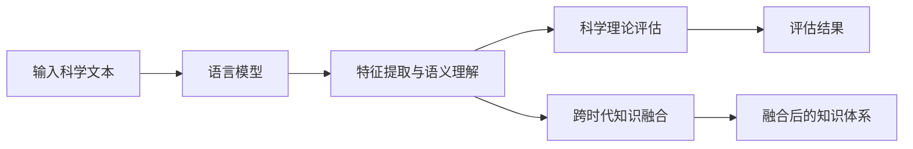

# 语言模型在科学理论评估与跨时代知识融合中的创新应用研究

> 关键词：语言模型、科学理论评估、跨时代知识融合、创新应用、自然语言处理

> 摘要：本文聚焦于语言模型在科学理论评估与跨时代知识融合方面的创新应用。随着人工智能技术的飞速发展，语言模型展现出强大的自然语言处理能力。在科学研究领域，如何利用语言模型对科学理论进行有效评估，以及实现不同时代知识的融合，成为极具价值的研究方向。文章深入探讨了语言模型的核心概念、算法原理，结合数学模型进行详细分析，并通过项目实战展示其具体应用。同时，介绍了相关的实际应用场景、工具和资源，最后对未来发展趋势与挑战进行总结，旨在为相关领域的研究和实践提供全面而深入的参考。

## 1. 背景介绍 
### 1.1 目的和范围
本研究的主要目的是探索语言模型在科学理论评估与跨时代知识融合中的创新应用方式和效果。通过深入分析语言模型的特性和优势，研究如何利用其对不同领域的科学理论进行客观、准确的评估，以及如何将不同时代的科学知识进行有效的整合和利用。研究范围涵盖了多个科学领域，包括物理学、生物学、化学等，旨在全面展示语言模型在科学研究中的广泛应用潜力。

### 1.2 预期读者
本文预期读者包括从事人工智能、自然语言处理、科学研究方法等领域的科研人员、学者，以及对科学理论评估和知识融合感兴趣的专业人士。同时，也适合相关专业的研究生和高年级本科生阅读，为他们提供前沿的研究思路和方法。

### 1.3 文档结构概述
本文将按照以下结构进行阐述：首先介绍语言模型、科学理论评估和跨时代知识融合的核心概念及其相互联系；接着详细讲解语言模型的核心算法原理和具体操作步骤，并结合 Python 代码进行说明；然后引入数学模型和公式，对相关原理进行深入剖析；通过项目实战展示语言模型在实际应用中的具体实现和效果；介绍语言模型在科学研究中的实际应用场景；推荐相关的学习资源、开发工具框架和论文著作；最后对未来发展趋势与挑战进行总结，并提供常见问题的解答和扩展阅读参考资料。

### 1.4 术语表
#### 1.4.1 核心术语定义
- **语言模型**：是一种对自然语言文本进行建模的统计模型，用于预测文本序列中每个词出现的概率。它能够学习语言的语法、语义和上下文信息，从而生成自然流畅的文本或对输入文本进行理解和处理。
- **科学理论评估**：指对科学领域中提出的各种理论进行系统、客观的评价，以确定其合理性、有效性、创新性等方面的特征。评估过程通常涉及对理论的逻辑结构、实验验证、与现有知识的一致性等多个方面的分析。
- **跨时代知识融合**：将不同历史时期的科学知识进行整合和衔接，消除因时代差异导致的知识隔阂，挖掘不同时代知识之间的内在联系和互补性，以促进科学知识的传承和创新发展。

#### 1.4.2 相关概念解释
- **自然语言处理（NLP）**：是人工智能的一个重要分支，旨在让计算机能够理解、处理和生成自然语言。语言模型是自然语言处理中的核心技术之一，为实现各种自然语言处理任务提供了基础。
- **知识图谱**：是一种以图的形式表示知识的方法，通过节点和边来表示实体和实体之间的关系。在跨时代知识融合中，知识图谱可以用于整合不同时代的知识，构建统一的知识体系。

#### 1.4.3 缩略词列表
- **NLP**：Natural Language Processing（自然语言处理）
- **BERT**：Bidirectional Encoder Representations from Transformers（基于变换器的双向编码器表示）
- **GPT**：Generative Pretrained Transformer（生成式预训练变换器）

## 2. 核心概念与联系 

### 核心概念原理
#### 语言模型原理
语言模型的核心目标是学习语言的概率分布，即给定一个词序列，预测下一个词出现的概率。常见的语言模型包括基于统计的 n-gram 模型和基于深度学习的神经网络模型，如循环神经网络（RNN）、长短期记忆网络（LSTM）和变换器（Transformer）等。

以变换器为例，它采用了自注意力机制，能够并行处理输入序列，捕捉长距离的依赖关系。变换器由编码器和解码器组成，编码器将输入序列转换为一系列的特征表示，解码器根据这些特征表示生成输出序列。

#### 科学理论评估原理
科学理论评估需要综合考虑多个方面的因素，包括理论的内部逻辑一致性、与实验数据的拟合程度、对新现象的预测能力等。评估过程通常涉及对理论的形式化表达、实验验证结果、与其他理论的比较等环节。

#### 跨时代知识融合原理
跨时代知识融合的关键在于识别不同时代知识之间的关联和差异，通过语义理解和知识表示技术，将不同格式和表达方式的知识进行统一和整合。这需要对不同时代的科学文献、研究成果进行深入分析，挖掘其中的潜在知识联系。

### 架构的文本示意图
```plaintext
语言模型
|
|-- 输入：科学文献、理论描述等自然语言文本
|
|-- 处理：通过预训练模型学习语言特征，进行语义理解和表示
|
|-- 输出：文本的特征向量、语义表示等
|
|-- 应用
|   |-- 科学理论评估：根据特征向量评估理论的合理性、创新性等
|   |-- 跨时代知识融合：识别不同时代知识的关联，进行知识整合
```

### Mermaid 流程图


## 3. 核心算法原理 & 具体操作步骤 

### 核心算法原理
以 BERT 语言模型为例，其核心算法基于变换器架构，采用了双向预训练的方式。BERT 的预训练任务包括掩码语言模型（Masked Language Model，MLM）和下一句预测（Next Sentence Prediction，NSP）。

#### 掩码语言模型（MLM）
在 MLM 任务中，输入序列中的一部分词被随机掩码，模型需要根据上下文预测这些掩码词。具体来说，对于输入序列 $x = [x_1, x_2, \cdots, x_n]$，随机选择 $15\%$ 的词进行掩码，将这些词替换为特殊的掩码标记 [MASK]。模型的目标是最大化预测这些掩码词的概率，即：

$$
\mathcal{L}_{MLM} = - \sum_{i \in \mathcal{M}} \log P(x_i | x_1, \cdots, x_{i-1}, x_{i+1}, \cdots, x_n)
$$

其中，$\mathcal{M}$ 是被掩码的词的索引集合。

#### 下一句预测（NSP）
NSP 任务用于判断两个句子是否是连续的上下文。模型输入由两个句子 $A$ 和 $B$ 组成，中间用特殊标记 [SEP] 分隔。模型的目标是预测 $B$ 是否是 $A$ 的下一句，即：

$$
\mathcal{L}_{NSP} = - \sum_{j=1}^{m} [y_j \log P(y_j) + (1 - y_j) \log (1 - P(y_j))]
$$

其中，$y_j$ 是真实标签（0 或 1），$P(y_j)$ 是模型预测的概率。

BERT 的最终损失函数是 MLM 损失和 NSP 损失的加权和：

$$
\mathcal{L} = \alpha \mathcal{L}_{MLM} + (1 - \alpha) \mathcal{L}_{NSP}
$$

通常，$\alpha = 0.5$。

### 具体操作步骤
#### 数据预处理
首先，需要对输入的科学文本数据进行预处理，包括分词、转换为词索引等操作。以下是使用 Python 和 Transformers 库进行数据预处理的示例代码：

```python
from transformers import BertTokenizer

# 加载预训练的 BERT 分词器
tokenizer = BertTokenizer.from_pretrained('bert-base-uncased')

# 示例文本
text = "This is a scientific theory."

# 分词并转换为词索引
input_ids = tokenizer.encode(text, add_special_tokens=True)

print("Input IDs:", input_ids)
```

#### 模型加载与推理
加载预训练的 BERT 模型，并对输入数据进行推理，获取文本的特征表示。示例代码如下：

```python
from transformers import BertModel
import torch

# 加载预训练的 BERT 模型
model = BertModel.from_pretrained('bert-base-uncased')

# 将输入数据转换为 PyTorch 张量
input_tensor = torch.tensor([input_ids])

# 进行推理
with torch.no_grad():
    outputs = model(input_tensor)

# 获取最后一层的隐藏状态
last_hidden_states = outputs.last_hidden_state

print("Last hidden states shape:", last_hidden_states.shape)
```

#### 科学理论评估与知识融合
根据获取的文本特征表示，可以进行科学理论评估和跨时代知识融合的具体任务。例如，可以计算不同理论文本之间的相似度，以评估理论的创新性和相关性；也可以将不同时代的知识文本进行聚类，实现知识的融合。

```python
import numpy as np
from sklearn.metrics.pairwise import cosine_similarity

# 示例：计算两个文本的相似度
text1 = "This is a scientific theory."
text2 = "This is another scientific theory."

input_ids1 = tokenizer.encode(text1, add_special_tokens=True)
input_ids2 = tokenizer.encode(text2, add_special_tokens=True)

input_tensor1 = torch.tensor([input_ids1])
input_tensor2 = torch.tensor([input_ids2])

with torch.no_grad():
    outputs1 = model(input_tensor1)
    outputs2 = model(input_tensor2)

last_hidden_states1 = outputs1.last_hidden_state.mean(dim=1).numpy()
last_hidden_states2 = outputs2.last_hidden_state.mean(dim=1).numpy()

similarity = cosine_similarity(last_hidden_states1, last_hidden_states2)

print("Similarity:", similarity)
```

## 4. 数学模型和公式 & 详细讲解 & 举例说明 

### 语言模型的概率公式
语言模型的基本任务是计算给定词序列 $w_1, w_2, \cdots, w_n$ 的概率 $P(w_1, w_2, \cdots, w_n)$。根据链式法则，可以将其分解为：

$$
P(w_1, w_2, \cdots, w_n) = \prod_{i=1}^{n} P(w_i | w_1, w_2, \cdots, w_{i-1})
$$

例如，对于句子 “The dog runs.”，其概率可以表示为：

$$
P(\text{The}, \text{dog}, \text{runs}) = P(\text{The}) \times P(\text{dog} | \text{The}) \times P(\text{runs} | \text{The}, \text{dog})
$$

### n-gram 模型
n-gram 模型是一种简单的语言模型，它假设每个词的出现只依赖于其前 $n-1$ 个词。因此，$n$-gram 模型的概率公式可以简化为：

$$
P(w_i | w_1, w_2, \cdots, w_{i-1}) \approx P(w_i | w_{i-n+1}, w_{i-n+2}, \cdots, w_{i-1})
$$

例如，对于一个 2-gram（bigram）模型，句子 “The dog runs.” 的概率可以表示为：

$$
P(\text{The}, \text{dog}, \text{runs}) \approx P(\text{The}) \times P(\text{dog} | \text{The}) \times P(\text{runs} | \text{dog})
$$

### 自注意力机制的数学公式
自注意力机制是变换器架构的核心组成部分，它能够计算输入序列中每个位置与其他位置之间的相关性。给定输入序列 $X = [x_1, x_2, \cdots, x_n]$，其中 $x_i \in \mathbb{R}^d$ 是第 $i$ 个位置的输入向量。自注意力机制的计算步骤如下：

1. 计算查询（Query）、键（Key）和值（Value）矩阵：

$$
Q = XW_Q, \quad K = XW_K, \quad V = XW_V
$$

其中，$W_Q \in \mathbb{R}^{d \times d_k}$，$W_K \in \mathbb{R}^{d \times d_k}$，$W_V \in \mathbb{R}^{d \times d_v}$ 是可学习的权重矩阵。

2. 计算注意力分数：

$$
\text{Attention}(Q, K, V) = \text{softmax}\left(\frac{QK^T}{\sqrt{d_k}}\right)V
$$

其中，$\text{softmax}$ 是归一化函数，用于将注意力分数转换为概率分布。

例如，假设输入序列 $X$ 是一个长度为 3 的向量序列，每个向量的维度为 4，即 $X \in \mathbb{R}^{3 \times 4}$。则 $Q, K, V$ 的维度分别为 $\mathbb{R}^{3 \times d_k}$，$\mathbb{R}^{3 \times d_k}$，$\mathbb{R}^{3 \times d_v}$。注意力分数矩阵的维度为 $\mathbb{R}^{3 \times 3}$，最终的输出矩阵的维度为 $\mathbb{R}^{3 \times d_v}$。

### 科学理论评估的数学模型
在科学理论评估中，可以使用多种指标来衡量理论的优劣。例如，可以使用信息熵来评估理论的复杂性和不确定性。给定一个理论的概率分布 $P = [p_1, p_2, \cdots, p_n]$，其信息熵定义为：

$$
H(P) = - \sum_{i=1}^{n} p_i \log p_i
$$

信息熵越大，说明理论的不确定性越高，可能越复杂。

另一个常用的指标是理论与实验数据的拟合度。假设理论预测值为 $\hat{y}_i$，实验观测值为 $y_i$，可以使用均方误差（MSE）来衡量拟合度：

$$
\text{MSE} = \frac{1}{n} \sum_{i=1}^{n} (\hat{y}_i - y_i)^2
$$

MSE 越小，说明理论与实验数据的拟合度越好。

### 举例说明
假设我们有两个科学理论 $T_1$ 和 $T_2$，分别对某一实验结果进行预测。实验数据为 $y = [1, 2, 3, 4, 5]$，理论 $T_1$ 的预测值为 $\hat{y}_1 = [1.1, 2.2, 3.1, 4.2, 5.1]$，理论 $T_2$ 的预测值为 $\hat{y}_2 = [0.8, 2.5, 3.2, 3.8, 5.3]$。

计算两个理论的均方误差：

$$
\text{MSE}_1 = \frac{1}{5} \sum_{i=1}^{5} (\hat{y}_{1i} - y_i)^2 = \frac{(1.1 - 1)^2 + (2.2 - 2)^2 + (3.1 - 3)^2 + (4.2 - 4)^2 + (5.1 - 5)^2}{5} = 0.02
$$

$$
\text{MSE}_2 = \frac{1}{5} \sum_{i=1}^{5} (\hat{y}_{2i} - y_i)^2 = \frac{(0.8 - 1)^2 + (2.5 - 2)^2 + (3.2 - 3)^2 + (3.8 - 4)^2 + (5.3 - 5)^2}{5} = 0.074
$$

由于 $\text{MSE}_1 < \text{MSE}_2$，可以认为理论 $T_1$ 与实验数据的拟合度更好。

## 5. 项目实战：代码实际案例和详细解释说明 

### 5.1  开发环境搭建
#### 安装 Python
首先，确保你已经安装了 Python 3.6 或更高版本。可以从 Python 官方网站（https://www.python.org/downloads/）下载并安装适合你操作系统的 Python 版本。

#### 创建虚拟环境
为了避免不同项目之间的依赖冲突，建议使用虚拟环境。可以使用 `venv` 模块创建虚拟环境：

```bash
python -m venv myenv
```

激活虚拟环境：

- 在 Windows 上：
```bash
myenv\Scripts\activate
```

- 在 Linux 或 macOS 上：
```bash
source myenv/bin/activate
```

#### 安装依赖库
在虚拟环境中安装所需的依赖库，包括 `transformers`、`torch`、`numpy`、`scikit-learn` 等：

```bash
pip install transformers torch numpy scikit-learn
```

### 5.2  源代码详细实现和代码解读
#### 数据准备
假设我们有一个包含多个科学理论描述的文本文件 `theories.txt`，每行代表一个理论描述。以下是读取文件并进行预处理的代码：

```python
from transformers import BertTokenizer
import torch

# 加载预训练的 BERT 分词器
tokenizer = BertTokenizer.from_pretrained('bert-base-uncased')

# 读取文件
with open('theories.txt', 'r', encoding='utf-8') as f:
    theories = f.readlines()

# 去除换行符
theories = [theory.strip() for theory in theories]

# 分词并转换为词索引
input_ids = []
for theory in theories:
    ids = tokenizer.encode(theory, add_special_tokens=True)
    input_ids.append(ids)

# 填充序列到相同长度
max_length = max(len(ids) for ids in input_ids)
input_ids = [ids + [0] * (max_length - len(ids)) for ids in input_ids]

# 转换为 PyTorch 张量
input_tensor = torch.tensor(input_ids)
```

#### 模型加载与特征提取
加载预训练的 BERT 模型，并对输入数据进行特征提取：

```python
from transformers import BertModel

# 加载预训练的 BERT 模型
model = BertModel.from_pretrained('bert-base-uncased')

# 进行推理
with torch.no_grad():
    outputs = model(input_tensor)

# 获取最后一层的隐藏状态
last_hidden_states = outputs.last_hidden_state

# 计算每个理论的平均特征向量
features = last_hidden_states.mean(dim=1).numpy()
```

#### 科学理论评估：计算相似度
使用余弦相似度计算不同理论之间的相似度，以评估理论的相关性：

```python
from sklearn.metrics.pairwise import cosine_similarity

# 计算相似度矩阵
similarity_matrix = cosine_similarity(features)

# 输出相似度最高的理论对
n = len(theories)
max_similarity = -1
max_pair = None
for i in range(n):
    for j in range(i + 1, n):
        if similarity_matrix[i][j] > max_similarity:
            max_similarity = similarity_matrix[i][j]
            max_pair = (i, j)

print(f"Most similar theories: {theories[max_pair[0]]} and {theories[max_pair[1]]}")
print(f"Similarity score: {max_similarity}")
```

#### 跨时代知识融合：聚类分析
使用 K-means 聚类算法对不同时代的科学知识进行聚类，实现知识的融合：

```python
from sklearn.cluster import KMeans

# 假设我们要将知识分为 3 类
n_clusters = 3
kmeans = KMeans(n_clusters=n_clusters)
kmeans.fit(features)

# 输出每个类别的理论
clusters = [[] for _ in range(n_clusters)]
for i, label in enumerate(kmeans.labels_):
    clusters[label].append(theories[i])

for i, cluster in enumerate(clusters):
    print(f"Cluster {i}:")
    for theory in cluster:
        print(f"  - {theory}")
```

### 5.3  代码解读与分析
#### 数据预处理部分
- 首先，使用 `BertTokenizer` 对输入的科学理论文本进行分词和转换为词索引。
- 为了方便模型处理，将所有序列填充到相同的长度，使用 `torch.tensor` 将输入数据转换为 PyTorch 张量。

#### 模型加载与特征提取部分
- 加载预训练的 BERT 模型，使用 `model` 对输入数据进行推理，获取最后一层的隐藏状态。
- 计算每个理论的平均特征向量，将其作为该理论的表示。

#### 科学理论评估部分
- 使用 `cosine_similarity` 函数计算不同理论之间的余弦相似度，找出相似度最高的理论对。

#### 跨时代知识融合部分
- 使用 `KMeans` 聚类算法对理论的特征向量进行聚类，将相似的理论归为一类，实现知识的融合。

## 6. 实际应用场景 
### 科学研究辅助
在科学研究过程中，研究人员需要评估大量的科学理论和研究成果。语言模型可以帮助研究人员快速筛选和评估相关理论，找出最有潜力和创新性的研究方向。例如，通过计算不同理论之间的相似度，研究人员可以发现潜在的研究热点和交叉领域。

### 知识传承与创新
跨时代知识融合可以促进科学知识的传承和创新。语言模型可以将不同历史时期的科学知识进行整合和挖掘，帮助研究人员发现不同时代知识之间的内在联系和互补性。例如，在物理学领域，将经典力学和量子力学的知识进行融合，可以为新的理论研究提供启示。

### 教育领域
在教育领域，语言模型可以用于科学理论的教学和评估。教师可以使用语言模型对学生的科学论文和报告进行评估，提供客观的反馈和建议。同时，语言模型还可以帮助学生更好地理解和掌握不同的科学理论，通过提供相关的知识链接和解释。

### 科技情报分析
科技情报机构可以利用语言模型对大量的科技文献和专利进行分析，评估不同技术领域的发展趋势和创新能力。通过对科学理论的评估和知识融合，科技情报机构可以为企业和政府提供有价值的决策支持。

## 7. 工具和资源推荐
### 7.1 学习资源推荐
#### 7.1.1 书籍推荐
- 《自然语言处理入门》：介绍了自然语言处理的基本概念、算法和技术，适合初学者阅读。
- 《深度学习》：由 Ian Goodfellow、Yoshua Bengio 和 Aaron Courville 撰写，是深度学习领域的经典教材，涵盖了神经网络、卷积神经网络、循环神经网络等内容。
- 《人工智能：一种现代的方法》：全面介绍了人工智能的各个领域，包括自然语言处理、机器学习、知识表示等，是人工智能领域的权威著作。

#### 7.1.2 在线课程
- Coursera 上的 “Natural Language Processing Specialization”：由斯坦福大学的教授授课，系统地介绍了自然语言处理的各个方面，包括语言模型、词嵌入、文本分类等。
- edX 上的 “Deep Learning Specialization”：由 Andrew Ng 教授授课，深入讲解了深度学习的原理和应用，包括神经网络、卷积神经网络、循环神经网络等。
- 中国大学 MOOC 上的 “自然语言处理”：由国内高校的教授授课，结合了国内的研究成果和实际应用，适合国内学习者。

#### 7.1.3 技术博客和网站
- Hugging Face Blog：提供了关于自然语言处理和语言模型的最新研究成果和应用案例，是了解语言模型发展动态的重要渠道。
- Towards Data Science：是一个数据科学和人工智能领域的博客平台，有很多关于自然语言处理和语言模型的高质量文章。
- arXiv：是一个预印本论文平台，收录了大量的计算机科学、物理学、数学等领域的研究论文，可以及时了解最新的研究进展。

### 7.2 开发工具框架推荐
#### 7.2.1 IDE和编辑器
- PyCharm：是一款专门为 Python 开发设计的集成开发环境（IDE），具有代码自动补全、调试、版本控制等功能，适合开发大型的 Python 项目。
- Jupyter Notebook：是一个交互式的开发环境，支持多种编程语言，尤其适合数据分析和机器学习任务。可以在浏览器中编写和运行代码，方便进行实验和展示。
- Visual Studio Code：是一款轻量级的代码编辑器，支持多种编程语言和插件扩展。可以通过安装 Python 插件来进行 Python 开发，具有良好的代码编辑和调试功能。

#### 7.2.2 调试和性能分析工具
- PyTorch Profiler：是 PyTorch 提供的性能分析工具，可以帮助开发者分析模型的运行时间、内存使用等情况，找出性能瓶颈。
- TensorBoard：是 TensorFlow 提供的可视化工具，也可以用于 PyTorch 项目。可以可视化模型的训练过程、损失曲线、梯度分布等信息，帮助开发者调试和优化模型。
- cProfile：是 Python 内置的性能分析模块，可以分析 Python 代码的运行时间和函数调用情况，找出代码中的性能瓶颈。

#### 7.2.3 相关框架和库
- Transformers：是 Hugging Face 开发的一个自然语言处理库，提供了多种预训练的语言模型，如 BERT、GPT、XLNet 等，方便开发者进行语言模型的使用和微调。
- PyTorch：是一个开源的深度学习框架，具有动态图机制，方便开发者进行模型的构建和训练。在自然语言处理领域，PyTorch 被广泛应用于语言模型的开发。
- scikit-learn：是一个简单易用的机器学习库，提供了多种机器学习算法和工具，如分类、聚类、回归等。在科学理论评估和知识融合中，可以使用 scikit-learn 进行数据处理和模型评估。

### 7.3 相关论文著作推荐
#### 7.3.1 经典论文
- “Attention Is All You Need”：介绍了变换器（Transformer）架构，是自然语言处理领域的重要突破，为后续的语言模型发展奠定了基础。
- “BERT: Pre-training of Deep Bidirectional Transformers for Language Understanding”：提出了 BERT 语言模型，通过双向预训练的方式，大大提高了语言模型的性能。
- “Generative Pretrained Transformer 3 (GPT-3): Language Models are Few-Shot Learners”：介绍了 GPT-3 语言模型，展示了其强大的生成能力和少样本学习能力。

#### 7.3.2 最新研究成果
- 关注 arXiv 上的最新论文，特别是关于语言模型在科学研究、知识融合等领域的应用。例如，一些研究探索了如何使用语言模型进行科学理论的自动评估和知识图谱的构建。
- 参加自然语言处理领域的顶级会议，如 ACL（Association for Computational Linguistics）、EMNLP（Conference on Empirical Methods in Natural Language Processing）等，了解最新的研究动态和成果。

#### 7.3.3 应用案例分析
- 一些科技公司和研究机构会发布关于语言模型应用的案例分析报告。例如，谷歌、微软等公司在自然语言处理领域有很多实际应用案例，可以参考他们的报告了解语言模型在实际场景中的应用效果和挑战。

## 8. 总结：未来发展趋势与挑战
### 未来发展趋势
#### 更强大的语言模型
随着计算资源的不断增加和算法的不断创新，未来的语言模型将变得更加强大。模型的规模将不断扩大，能够学习到更丰富的语言知识和语义信息，从而在科学理论评估和跨时代知识融合中发挥更重要的作用。

#### 多模态融合
未来的语言模型将不仅仅局限于处理文本数据，还将与图像、音频、视频等多模态数据进行融合。通过多模态融合，可以更全面地理解科学知识，提高科学理论评估和知识融合的准确性和有效性。

#### 个性化和定制化
根据不同用户的需求和领域特点，未来的语言模型将实现个性化和定制化。例如，为不同学科的研究人员提供专门的科学理论评估和知识融合工具，提高工具的针对性和实用性。

### 挑战
#### 数据质量和标注问题
科学领域的数据往往具有专业性强、数据量小、标注困难等特点。如何获取高质量的科学数据，并进行有效的标注，是语言模型在科学研究中应用的一个重要挑战。

#### 语义理解的局限性
尽管语言模型在自然语言处理方面取得了很大的进展，但在语义理解方面仍然存在一定的局限性。特别是在科学领域，一些专业术语和概念具有复杂的语义，语言模型可能无法准确理解和处理。

#### 伦理和法律问题
随着语言模型在科学研究中的广泛应用，伦理和法律问题也日益凸显。例如，如何确保语言模型的评估结果公正、客观，如何保护科学数据的隐私和安全等，都是需要解决的问题。

## 9. 附录：常见问题与解答
### 语言模型在科学理论评估中的准确性如何保证？
语言模型的评估准确性受到多种因素的影响，包括模型的质量、数据的质量和标注、评估指标的选择等。为了保证评估的准确性，可以采取以下措施：
- 使用高质量的预训练语言模型，并根据具体任务进行微调。
- 收集和整理高质量的科学数据，并进行准确的标注。
- 选择合适的评估指标，综合考虑多个方面的因素。

### 跨时代知识融合中如何处理不同时代的语言差异？
不同时代的语言在词汇、语法、表达方式等方面可能存在差异，这给跨时代知识融合带来了一定的困难。可以采取以下方法来处理语言差异：
- 使用语言模型进行语义理解，忽略表面的语言差异，挖掘知识的内在联系。
- 构建知识图谱，将不同时代的知识以统一的形式表示，消除语言差异的影响。
- 进行语言规范化处理，将不同时代的语言转换为统一的格式。

### 语言模型在科学研究中的应用是否会取代人类专家？
语言模型在科学研究中的应用可以辅助人类专家进行科学理论评估和知识融合，但不会取代人类专家。语言模型虽然具有强大的计算和处理能力，但缺乏人类的创造力、判断力和领域知识。人类专家在科学研究中仍然起着关键的作用，语言模型只是一种工具，帮助人类专家更高效地完成工作。

## 10. 扩展阅读 & 参考资料
- 《自然语言处理实战：基于 Python 和深度学习》
- 《科学研究的艺术》
- Hugging Face 官方文档：https://huggingface.co/docs
- arXiv 预印本平台：https://arxiv.org/

作者：AI天才研究院/AI Genius Institute & 禅与计算机程序设计艺术 /Zen And The Art of Computer Programming