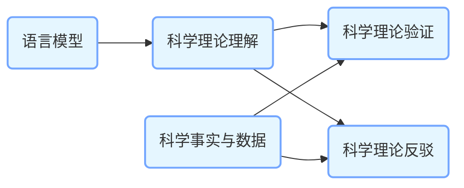

# 语言模型在科学理论验证与反驳中的应用

> 关键词：语言模型、科学理论验证、科学理论反驳、自然语言处理、知识推理

> 摘要：本文深入探讨了语言模型在科学理论验证与反驳领域的应用。首先介绍了相关背景知识，包括研究目的、预期读者等。接着阐述了语言模型、科学理论验证与反驳的核心概念及它们之间的联系。详细讲解了相关核心算法原理，并给出Python代码示例。通过数学模型和公式进一步剖析内在逻辑，结合项目实战案例进行代码实现和解读。分析了语言模型在科学研究各场景中的实际应用，推荐了学习资源、开发工具和相关论文。最后总结了该领域的未来发展趋势与挑战，并给出常见问题解答和扩展阅读参考资料。

## 1. 背景介绍 
### 1.1 目的和范围
本研究的目的在于探索语言模型在科学理论验证与反驳过程中的具体应用方式和潜在价值。随着自然语言处理技术的飞速发展，语言模型具备了强大的语言理解和生成能力，这为科学研究提供了新的工具和视角。我们将研究范围限定在利用语言模型对不同学科领域的科学理论进行评估、验证以及发现可能存在的矛盾和不合理之处。通过对语言模型的合理运用，旨在提高科学研究的效率和准确性，辅助科学家更深入地理解和检验科学理论。

### 1.2 预期读者
本文预期读者包括从事自然语言处理、人工智能研究的科研人员，他们可以从本文中获取语言模型在科学研究领域的新应用思路和方法；科学哲学家和科学史学家，借助语言模型的分析手段可以从新的角度审视科学理论的发展和演变；各学科领域的科学家，能够了解如何利用语言模型辅助自己的研究工作，对已有的科学理论进行验证和完善。

### 1.3 文档结构概述
本文将首先介绍相关的核心概念，包括语言模型、科学理论验证与反驳，并阐述它们之间的联系。接着详细讲解用于科学理论验证与反驳的核心算法原理，同时给出具体的Python代码实现步骤。然后通过数学模型和公式对算法进行深入分析，并举例说明其应用。之后进行项目实战，包括开发环境搭建、源代码详细实现和代码解读。再探讨语言模型在实际科学研究中的应用场景。推荐相关的学习资源、开发工具和论文著作。最后总结未来发展趋势与挑战，提供常见问题解答和扩展阅读参考资料。

### 1.4 术语表
#### 1.4.1 核心术语定义
- **语言模型**：是一种基于概率统计或深度学习的模型，用于预测给定文本序列的下一个词或字符的概率分布。它通过学习大量的文本数据来捕捉语言的模式和规律，从而能够生成自然流畅的文本。
- **科学理论验证**：指通过各种方法和证据来检验科学理论的正确性和可靠性，判断其是否与客观事实相符。
- **科学理论反驳**：是指找出科学理论中存在的矛盾、错误或不合理之处，从而证明该理论在某些方面是不成立的。

#### 1.4.2 相关概念解释
- **自然语言处理（NLP）**：是人工智能的一个重要分支，主要研究如何让计算机理解、处理和生成人类语言。语言模型是自然语言处理中的核心技术之一。
- **知识推理**：是指从已有的知识中推导出新的知识的过程。在科学理论验证与反驳中，知识推理可以帮助我们从已知的科学事实和理论中推断出某个理论是否合理。

#### 1.4.3 缩略词列表
- **NLP**：Natural Language Processing（自然语言处理）
- **GPT**：Generative Pretrained Transformer（生成式预训练变换器）
- **BERT**：Bidirectional Encoder Representations from Transformers（基于变换器的双向编码器表示）

## 2. 核心概念与联系 

### 语言模型原理
语言模型的核心目标是学习语言的概率分布，即给定一个前文序列 $x_1, x_2, \cdots, x_n$，预测下一个词 $x_{n+1}$ 的概率 $P(x_{n+1}|x_1, x_2, \cdots, x_n)$。常见的语言模型包括基于统计的n-gram模型和基于深度学习的神经网络模型，如循环神经网络（RNN）、长短期记忆网络（LSTM）和变换器（Transformer）。

以Transformer为例，它采用了多头自注意力机制（Multi-Head Self-Attention）来捕捉文本中的长距离依赖关系。多头自注意力机制允许模型在不同的表示子空间中并行地关注输入序列的不同部分，从而提高模型的表达能力。

### 科学理论验证与反驳原理
科学理论验证通常基于实证研究和逻辑推理。实证研究通过实验、观察等方式收集数据，然后将数据与理论预测进行对比，如果数据与理论预测相符，则在一定程度上验证了理论的正确性。逻辑推理则是从已有的公理、定理和事实出发，通过演绎、归纳等方法来推导理论的合理性。

科学理论反驳则是寻找理论与事实之间的矛盾或者理论内部的逻辑矛盾。当发现某个理论的预测与实际观察结果不符，或者理论中存在逻辑上的不一致时，就可以对该理论提出反驳。

### 核心概念联系示意图


从图中可以看出，语言模型首先用于对科学理论进行理解，将科学理论文本转化为计算机可处理的表示形式。然后结合科学事实与数据，分别进行科学理论验证和反驳的操作。

## 3. 核心算法原理 & 具体操作步骤 

### 基于语言模型的科学理论理解算法
我们可以使用预训练的语言模型（如BERT）来对科学理论文本进行编码，将文本转化为向量表示。以下是一个使用Python和Hugging Face的`transformers`库实现的示例代码：

```python
from transformers import AutoTokenizer, AutoModel
import torch

# 加载预训练的BERT模型和分词器
tokenizer = AutoTokenizer.from_pretrained('bert-base-uncased')
model = AutoModel.from_pretrained('bert-base-uncased')

def encode_scientific_theory(text):
    # 对文本进行分词
    inputs = tokenizer(text, return_tensors='pt')
    # 通过模型进行编码
    outputs = model(**inputs)
    # 获取[CLS]标记的输出作为文本的表示向量
    embedding = outputs.last_hidden_state[:, 0, :]
    return embedding

# 示例科学理论文本
theory_text = "The theory of relativity states that the laws of physics are the same for all non-accelerating observers."
theory_embedding = encode_scientific_theory(theory_text)
print("理论文本的向量表示:", theory_embedding)
```

### 科学理论验证算法
科学理论验证可以通过比较理论预测与实际观察结果的相似度来实现。我们可以使用余弦相似度来衡量两者之间的相似度。以下是具体的代码实现：

```python
from sklearn.metrics.pairwise import cosine_similarity

def verify_scientific_theory(theory_embedding, observation_embedding):
    # 计算余弦相似度
    similarity = cosine_similarity(theory_embedding.detach().numpy(), observation_embedding.detach().numpy())
    return similarity[0][0]

# 示例观察结果文本
observation_text = "Experiments have shown that the speed of light is constant in all inertial frames."
observation_embedding = encode_scientific_theory(observation_text)

# 进行理论验证
similarity_score = verify_scientific_theory(theory_embedding, observation_embedding)
print("理论与观察结果的相似度:", similarity_score)
```

### 科学理论反驳算法
科学理论反驳可以通过寻找理论与事实之间的逻辑矛盾来实现。我们可以使用基于规则的方法或者机器学习方法来判断是否存在矛盾。以下是一个简单的基于规则的示例：

```python
def refute_scientific_theory(theory_text, fact_text):
    # 简单规则：如果理论文本中包含与事实文本相反的表述，则认为存在反驳
    if "not" in theory_text and fact_text not in theory_text:
        return True
    return False

# 示例反驳测试
refute_result = refute_scientific_theory("The speed of light is not constant.", "The speed of light is constant.")
print("是否反驳成功:", refute_result)
```

## 4. 数学模型和公式 & 详细讲解 & 举例说明 

### 语言模型的概率计算
在语言模型中，我们通常使用链式法则来计算一个句子 $S = (x_1, x_2, \cdots, x_n)$ 的概率：

$$P(S) = P(x_1)P(x_2|x_1)P(x_3|x_1, x_2) \cdots P(x_n|x_1, x_2, \cdots, x_{n-1})$$

例如，对于句子 "The cat is on the mat."，其概率可以表示为：

$$P(\text{The cat is on the mat.}) = P(\text{The})P(\text{cat}|\text{The})P(\text{is}|\text{The cat})P(\text{on}|\text{The cat is})P(\text{the}|\text{The cat is on})P(\text{mat}|\text{The cat is on the})$$

### 余弦相似度公式
余弦相似度用于衡量两个向量之间的夹角余弦值，其公式为：

$$\text{Cosine Similarity}(\vec{A}, \vec{B}) = \frac{\vec{A} \cdot \vec{B}}{\|\vec{A}\| \|\vec{B}\|}$$

其中，$\vec{A}$ 和 $\vec{B}$ 是两个向量，$\vec{A} \cdot \vec{B}$ 是它们的点积，$\|\vec{A}\|$ 和 $\|\vec{B}\|$ 分别是它们的模。

例如，假设有两个向量 $\vec{A} = [1, 2, 3]$ 和 $\vec{B} = [4, 5, 6]$，则它们的余弦相似度为：

$$\text{Cosine Similarity}(\vec{A}, \vec{B}) = \frac{1\times4 + 2\times5 + 3\times6}{\sqrt{1^2 + 2^2 + 3^2} \sqrt{4^2 + 5^2 + 6^2}} \approx 0.9747$$

### 应用举例
在科学理论验证中，我们可以将理论文本和观察结果文本分别编码为向量 $\vec{T}$ 和 $\vec{O}$，然后计算它们的余弦相似度。如果相似度较高，则说明理论与观察结果相符，在一定程度上验证了理论的正确性。例如，当计算得到的相似度为 0.8 时，我们可以认为理论与观察结果有较强的一致性。

在科学理论反驳中，如果我们发现理论预测的结果与实际观察结果在逻辑上相互矛盾，就可以反驳该理论。例如，某理论预测“所有金属在常温下都是固体”，而实际观察到汞在常温下是液体，这就构成了对该理论的反驳。

## 5. 项目实战：代码实际案例和详细解释说明 

### 5.1  开发环境搭建
#### 安装Python
首先，确保你已经安装了Python 3.6或更高版本。你可以从Python官方网站（https://www.python.org/downloads/）下载并安装Python。

#### 创建虚拟环境
为了避免不同项目之间的依赖冲突，建议使用虚拟环境。在命令行中执行以下命令创建并激活虚拟环境：

```bash
# 创建虚拟环境
python -m venv lang_model_env
# 激活虚拟环境（Windows）
lang_model_env\Scripts\activate
# 激活虚拟环境（Linux/Mac）
source lang_model_env/bin/activate
```

#### 安装依赖库
在虚拟环境中安装所需的依赖库，包括`transformers`、`torch`和`sklearn`：

```bash
pip install transformers torch scikit-learn
```

### 5.2  源代码详细实现和代码解读
以下是一个完整的项目实战代码示例，用于对科学理论进行验证和反驳：

```python
from transformers import AutoTokenizer, AutoModel
import torch
from sklearn.metrics.pairwise import cosine_similarity

# 加载预训练的BERT模型和分词器
tokenizer = AutoTokenizer.from_pretrained('bert-base-uncased')
model = AutoModel.from_pretrained('bert-base-uncased')

def encode_scientific_theory(text):
    """
    对科学理论文本进行编码
    :param text: 科学理论文本
    :return: 文本的向量表示
    """
    # 对文本进行分词
    inputs = tokenizer(text, return_tensors='pt')
    # 通过模型进行编码
    outputs = model(**inputs)
    # 获取[CLS]标记的输出作为文本的表示向量
    embedding = outputs.last_hidden_state[:, 0, :]
    return embedding

def verify_scientific_theory(theory_embedding, observation_embedding):
    """
    验证科学理论与观察结果的相似度
    :param theory_embedding: 理论文本的向量表示
    :param observation_embedding: 观察结果文本的向量表示
    :return: 相似度得分
    """
    # 计算余弦相似度
    similarity = cosine_similarity(theory_embedding.detach().numpy(), observation_embedding.detach().numpy())
    return similarity[0][0]

def refute_scientific_theory(theory_text, fact_text):
    """
    反驳科学理论
    :param theory_text: 科学理论文本
    :param fact_text: 事实文本
    :return: 是否反驳成功
    """
    # 简单规则：如果理论文本中包含与事实文本相反的表述，则认为存在反驳
    if "not" in theory_text and fact_text not in theory_text:
        return True
    return False

# 示例科学理论文本
theory_text = "The theory of gravity states that objects attract each other with a force proportional to their masses."
theory_embedding = encode_scientific_theory(theory_text)

# 示例观察结果文本
observation_text = "Experiments have shown that two heavy objects attract each other."
observation_embedding = encode_scientific_theory(observation_text)

# 进行理论验证
similarity_score = verify_scientific_theory(theory_embedding, observation_embedding)
print("理论与观察结果的相似度:", similarity_score)

# 示例反驳测试
refute_text = "Objects do not attract each other."
refute_result = refute_scientific_theory(refute_text, "Objects attract each other.")
print("是否反驳成功:", refute_result)
```

### 5.3  代码解读与分析
- **`encode_scientific_theory`函数**：该函数使用预训练的BERT模型对科学理论文本进行编码。首先使用分词器将文本分词，然后将分词结果输入到BERT模型中，最后获取`[CLS]`标记的输出作为文本的向量表示。
- **`verify_scientific_theory`函数**：该函数计算理论文本的向量表示和观察结果文本的向量表示之间的余弦相似度。相似度得分越高，说明理论与观察结果越相符。
- **`refute_scientific_theory`函数**：该函数使用简单的规则来判断是否可以反驳科学理论。如果理论文本中包含“not”且不包含事实文本，则认为存在反驳。

通过这个项目实战，我们可以看到如何使用语言模型对科学理论进行验证和反驳。

## 6. 实际应用场景 
### 物理学研究
在物理学中，语言模型可以用于验证和反驳各种物理理论。例如，对于相对论，科学家可以使用语言模型对相关的理论文本和实验观察结果进行编码和分析，判断理论预测与实验数据的一致性。如果发现理论预测与实验结果存在较大差异，就可以进一步深入研究，寻找理论可能存在的问题。

### 生物学研究
在生物学领域，语言模型可以帮助科学家验证生物进化理论、基因表达理论等。通过对大量的生物学文献和实验数据进行处理，语言模型可以分析理论与实际观察之间的关系，发现新的生物学现象和规律，或者反驳一些不符合实际的理论假设。

### 社会科学研究
在社会科学中，如经济学、社会学等，语言模型可以用于验证经济理论、社会现象的解释模型等。例如，对于宏观经济理论，语言模型可以分析经济数据报告和理论预测之间的相似度，判断理论的有效性。同时，也可以通过对社会现象的文本描述进行分析，反驳一些不合理的社会理论。

## 7. 工具和资源推荐
### 7.1 学习资源推荐
#### 7.1.1 书籍推荐
- 《自然语言处理入门》：这本书详细介绍了自然语言处理的基本概念、算法和技术，适合初学者入门。
- 《深度学习》：全面介绍了深度学习的理论和实践，对于理解语言模型的原理和实现有很大帮助。
- 《科学哲学》：帮助读者了解科学理论的本质、验证和反驳的方法，从哲学角度思考科学研究。

#### 7.1.2 在线课程
- Coursera上的“Natural Language Processing Specialization”：由知名教授授课，系统地介绍了自然语言处理的各个方面。
- edX上的“Deep Learning for Natural Language Processing”：专注于深度学习在自然语言处理中的应用，包括语言模型的训练和使用。

#### 7.1.3 技术博客和网站
- Hugging Face Blog：提供了关于语言模型的最新研究成果和应用案例，是了解语言模型发展动态的重要渠道。
- Towards Data Science：发表了大量关于自然语言处理和机器学习的技术文章，有很多关于语言模型在不同领域应用的分享。

### 7.2 开发工具框架推荐
#### 7.2.1 IDE和编辑器
- PyCharm：功能强大的Python集成开发环境，提供了代码编辑、调试、版本控制等一系列功能，适合开发大型的Python项目。
- Jupyter Notebook：交互式的开发环境，方便进行代码编写、数据可视化和实验验证，非常适合进行自然语言处理的研究和开发。

#### 7.2.2 调试和性能分析工具
- TensorBoard：用于可视化深度学习模型的训练过程和性能指标，帮助开发者监控模型的训练进度和优化效果。
- Py-Spy：可以对Python程序进行性能分析，找出程序中的性能瓶颈，提高代码的运行效率。

#### 7.2.3 相关框架和库
- Transformers：Hugging Face开发的开源库，提供了各种预训练的语言模型和工具，方便开发者快速使用和微调语言模型。
- NLTK：自然语言处理工具包，包含了丰富的文本处理函数和语料库，是自然语言处理开发的常用工具。

### 7.3 相关论文著作推荐
#### 7.3.1 经典论文
- “Attention Is All You Need”：介绍了Transformer架构，是现代语言模型发展的重要里程碑。
- “BERT: Pre-training of Deep Bidirectional Transformers for Language Understanding”：提出了BERT模型，在自然语言处理领域取得了巨大的成功。

#### 7.3.2 最新研究成果
- 关注顶级学术会议如ACL（Association for Computational Linguistics）、EMNLP（Conference on Empirical Methods in Natural Language Processing）上的论文，了解语言模型在科学理论验证与反驳领域的最新研究进展。

#### 7.3.3 应用案例分析
- 一些科研机构和企业会发布关于语言模型在不同领域应用的案例分析报告，可以从中学习到实际应用中的经验和技巧。

## 8. 总结：未来发展趋势与挑战
### 未来发展趋势
- **多模态融合**：未来的语言模型将不仅仅局限于处理文本信息，还会融合图像、音频等多模态信息，从而更全面地理解科学理论和相关实验数据。例如，在物理学研究中，可以结合实验图像和数据对理论进行更准确的验证。
- **知识增强**：通过将外部知识图谱与语言模型相结合，增强语言模型的知识推理能力。这样可以更好地处理科学理论中的复杂概念和逻辑关系，提高理论验证和反驳的准确性。
- **跨学科应用**：语言模型将在更多的学科领域得到应用，促进不同学科之间的交叉融合。例如，在医学和生物学的交叉领域，语言模型可以帮助分析基因数据和临床病例，验证相关的医学理论。

### 挑战
- **语义理解的局限性**：虽然语言模型在语言处理方面取得了很大进展，但对于科学理论中的复杂语义和专业概念的理解仍然存在一定的局限性。例如，一些抽象的物理概念和数学公式，语言模型可能无法准确理解其含义。
- **数据质量和数量**：科学研究中的数据往往具有专业性强、数据量相对较少的特点。获取高质量、大规模的科学数据用于训练语言模型是一个挑战。同时，数据的标注和整理也需要大量的人力和时间成本。
- **伦理和法律问题**：在使用语言模型进行科学理论验证和反驳时，可能会涉及到伦理和法律问题。例如，错误的理论反驳可能会对科研人员的声誉造成影响，如何确保语言模型的应用符合伦理和法律规范是一个需要解决的问题。

## 9. 附录：常见问题与解答
### 问题1：语言模型能否完全替代科学家进行科学理论验证和反驳？
答：目前语言模型还不能完全替代科学家。虽然语言模型可以辅助科学家进行理论验证和反驳，通过处理大量的文本数据和进行相似度计算等操作，但科学研究不仅仅是文本处理，还需要科学家的专业知识、实验设计能力和创新思维。语言模型只能提供一些参考和辅助，最终的判断和决策仍然需要科学家来完成。

### 问题2：如何选择合适的语言模型用于科学理论验证和反驳？
答：选择合适的语言模型需要考虑多个因素。首先，要考虑模型的性能和适用范围。例如，如果处理的是英文科学文本，BERT-base等预训练模型可能是一个不错的选择；如果处理的是特定领域的科学文本，可以选择在该领域进行微调的模型。其次，要考虑模型的计算资源需求和训练成本。一些大型的语言模型需要大量的计算资源和时间进行训练和推理，需要根据实际情况进行选择。

### 问题3：语言模型在科学理论验证和反驳中的准确性如何保证？
答：为了保证语言模型在科学理论验证和反驳中的准确性，可以采取以下措施。一是使用高质量的训练数据，包括科学文献、实验报告等。二是对语言模型进行适当的微调，使其适应科学领域的任务。三是结合多种验证方法，如实验验证、逻辑推理等，综合判断理论的正确性。同时，要对语言模型的输出结果进行人工审核和评估，避免出现错误的判断。

## 10. 扩展阅读 & 参考资料
- [Hugging Face官方文档](https://huggingface.co/docs/transformers/index)
- [自然语言处理前沿研究论文集](https://arxiv.org/list/cs.CL/recent)
- [科学哲学相关学术期刊](https://www.journals.elsevier.com/studies-in-history-and-philosophy-of-science)

作者：AI天才研究院/AI Genius Institute & 禅与计算机程序设计艺术 /Zen And The Art of Computer Programming