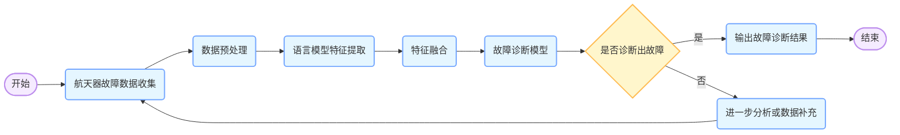

# 语言模型在航天器故障诊断中的应用探索

> 关键词：语言模型、航天器故障诊断、自然语言处理、深度学习、故障推理、特征提取、知识表示

> 摘要：本文聚焦于语言模型在航天器故障诊断领域的应用探索。首先介绍了研究的背景、目的和预期读者等信息，阐述了语言模型及航天器故障诊断的核心概念及其联系。详细讲解了相关核心算法原理，包括使用 Python 代码实现部分关键步骤。给出了数学模型和公式，并结合实际例子进行说明。通过项目实战，展示了在航天器故障诊断中运用语言模型的具体代码实现和解读。探讨了语言模型在航天器故障诊断中的实际应用场景，推荐了学习、开发所需的工具和资源，最后总结了未来发展趋势与挑战，并提供了常见问题解答和扩展阅读资料。旨在为相关领域的研究和实践提供全面且深入的参考。

## 1. 背景介绍 
### 1.1 目的和范围
航天器故障诊断是确保航天任务顺利进行的关键环节。传统的故障诊断方法主要依赖于物理模型、信号处理和机器学习算法，但这些方法在处理复杂的故障场景和非结构化数据时存在一定的局限性。语言模型作为自然语言处理领域的重要成果，具有强大的语义理解和知识推理能力，能够对航天器故障相关的文本信息进行有效处理。本文的目的在于探索语言模型在航天器故障诊断中的应用，研究如何利用语言模型对故障报告、维修记录等文本数据进行分析，以提高故障诊断的准确性和效率。范围涵盖了从语言模型的基本原理到实际应用的各个方面，包括核心算法、数学模型、项目实战以及未来发展趋势等。

### 1.2 预期读者
本文预期读者包括航天工程领域的研究人员、工程师，他们可以从中了解语言模型在航天器故障诊断中的潜在应用，为实际工作提供新的思路和方法；自然语言处理领域的专业人士，通过本文可以深入了解航天领域的特殊需求，拓展语言模型的应用场景；以及对航天和人工智能交叉领域感兴趣的学生和爱好者，帮助他们系统地学习相关知识。

### 1.3 文档结构概述
本文首先介绍了语言模型和航天器故障诊断的核心概念及其联系，为后续的研究奠定基础。接着详细讲解了核心算法原理，并给出具体的 Python 代码实现。通过数学模型和公式进一步阐述算法的理论基础，并结合实例进行说明。然后通过项目实战展示了如何将语言模型应用于航天器故障诊断的实际代码案例和详细解释。探讨了语言模型在航天器故障诊断中的实际应用场景，为实际工作提供参考。推荐了学习和开发所需的工具和资源，方便读者深入学习。最后总结了未来发展趋势与挑战，提供了常见问题解答和扩展阅读资料，形成一个完整的知识体系。

### 1.4 术语表
#### 1.4.1 核心术语定义
- **语言模型**：是一种基于概率统计或深度学习的模型，用于对自然语言文本进行建模，预测文本中每个词出现的概率，从而理解和生成自然语言。
- **航天器故障诊断**：通过对航天器系统的各种数据和信息进行分析，识别系统是否发生故障，并确定故障的类型、位置和原因的过程。
- **故障推理**：根据已知的故障信息和相关知识，推断出可能的故障原因和发展趋势的过程。
- **特征提取**：从原始数据中提取出能够反映数据本质特征的信息，以便于后续的分析和处理。
- **知识表示**：将人类的知识以计算机能够理解和处理的方式进行表示，以便于知识的存储、检索和推理。

#### 1.4.2 相关概念解释
- **自然语言处理（NLP）**：是一门研究如何让计算机理解、处理和生成自然语言的学科，语言模型是 NLP 中的重要技术之一。
- **深度学习**：是一种基于人工神经网络的机器学习方法，通过构建多层神经网络模型，自动从大量数据中学习特征和模式，在语言模型等领域取得了显著的成果。
- **语义理解**：是指计算机能够理解自然语言文本的含义，包括词汇、语法和语义等方面的信息。

#### 1.4.3 缩略词列表
- **NLP**：Natural Language Processing（自然语言处理）
- **RNN**：Recurrent Neural Network（循环神经网络）
- **LSTM**：Long Short-Term Memory（长短期记忆网络）
- **GRU**：Gated Recurrent Unit（门控循环单元）
- **BERT**：Bidirectional Encoder Representations from Transformers（基于变换器的双向编码器表示）

## 2. 核心概念与联系 

### 核心概念原理
#### 语言模型
语言模型的核心目标是计算一个句子或文本序列的概率。早期的语言模型基于统计方法，如 n - 元语法模型，它假设一个词的出现只依赖于前面的 n - 1 个词。例如，二元语法模型（n = 2）中，一个词 $w_i$ 出现的概率只依赖于它前面的一个词 $w_{i - 1}$，可以表示为 $P(w_i|w_{i - 1})$。

随着深度学习的发展，基于神经网络的语言模型逐渐成为主流。如循环神经网络（RNN）及其变体长短期记忆网络（LSTM）和门控循环单元（GRU），它们能够处理序列数据，通过隐藏状态来记忆之前的信息。以 LSTM 为例，它通过输入门、遗忘门和输出门来控制信息的流动，解决了传统 RNN 中的梯度消失问题，能够更好地处理长序列数据。

近年来，基于变换器（Transformer）架构的语言模型取得了巨大的成功，如 BERT。BERT 采用了双向编码器表示，通过掩码语言模型（Masked Language Model，MLM）和下一句预测（Next Sentence Prediction，NSP）任务进行预训练，能够学习到丰富的语义信息。

#### 航天器故障诊断
航天器故障诊断主要基于传感器数据和历史故障记录等信息。传统方法包括基于物理模型的方法，通过建立航天器系统的数学模型，根据模型的输出和实际测量值的差异来判断是否发生故障；基于信号处理的方法，如频谱分析、小波变换等，对传感器信号进行处理和特征提取；以及基于机器学习的方法，如决策树、支持向量机等，通过对历史故障数据的学习来进行故障分类和诊断。

### 架构的文本示意图
```plaintext
              语言模型
               ┌─────────────────────┐
               │  数据输入（文本）   │
               ├─────────────────────┤
               │  特征提取与编码    │
               ├─────────────────────┤
               │  语义理解与推理    │
               ├─────────────────────┤
               │  故障诊断输出      │
               └─────────────────────┘
           与航天器故障诊断的联系
┌───────────────────────────────────────────────────────────┐
│  航天器故障数据（传感器数据、故障报告等）               │
│        ├───────────────────────────────────────────────┤
│        │  数据预处理（清洗、转换等）                     │
│        ├───────────────────────────────────────────────┤
│        │  特征融合（与语言模型特征结合）                 │
│        ├───────────────────────────────────────────────┤
│        │  故障诊断模型（结合语言模型和传统方法）         │
│        ├───────────────────────────────────────────────┤
│        │  故障诊断结果输出（故障类型、位置等）           │
└───────────────────────────────────────────────────────────┘
```

### Mermaid 流程图


## 3. 核心算法原理 & 具体操作步骤 

### 语言模型特征提取算法原理
以 BERT 为例，BERT 模型通过多层变换器编码器对输入的文本进行编码。输入文本首先被分词为词元（tokens），并添加特殊的起始和结束标记，如 `[CLS]` 和 `[SEP]`。然后，每个词元被转换为词嵌入（word embeddings），同时还添加了位置嵌入（position embeddings）和片段嵌入（segment embeddings），以表示词元的位置和所属的句子。

接着，经过多层变换器编码器的处理，每个词元都会得到一个上下文相关的表示。最后，取 `[CLS]` 标记对应的输出作为整个句子的表示，用于后续的分类或推理任务。

### Python 代码实现
```python
import torch
from transformers import BertTokenizer, BertModel

# 加载预训练的 BERT 模型和分词器
tokenizer = BertTokenizer.from_pretrained('bert-base-uncased')
model = BertModel.from_pretrained('bert-base-uncased')

# 输入文本
text = "The spacecraft sensor shows abnormal readings."

# 分词
tokens = tokenizer(text, return_tensors='pt')

# 通过 BERT 模型获取特征
with torch.no_grad():
    outputs = model(**tokens)

# 取 [CLS] 标记的输出作为句子表示
sentence_embedding = outputs.last_hidden_state[:, 0, :]

print(sentence_embedding.shape)
```
### 具体操作步骤
1. **数据准备**：收集航天器故障相关的文本数据，如故障报告、维修记录等，并进行清洗和预处理，去除噪声和无用信息。
2. **分词**：使用合适的分词器将文本分词为词元。
3. **特征提取**：使用预训练的语言模型（如 BERT）对分词后的文本进行编码，获取文本的特征表示。
4. **特征融合**：将语言模型提取的特征与航天器传感器数据等传统特征进行融合，构建更全面的特征向量。
5. **故障诊断模型训练**：使用融合后的特征向量训练故障诊断模型，如支持向量机、神经网络等。
6. **故障诊断**：将新的故障数据输入到训练好的模型中，进行故障诊断和分类。

## 4. 数学模型和公式 & 详细讲解 & 举例说明 

### 语言模型概率计算
在 n - 元语法模型中，一个句子 $S = w_1, w_2, \cdots, w_m$ 的概率可以表示为：
$$P(S) = P(w_1, w_2, \cdots, w_m) = \prod_{i = 1}^{m} P(w_i|w_1, w_2, \cdots, w_{i - 1})$$
在二元语法模型中，上式可以简化为：
$$P(S) = P(w_1) \prod_{i = 2}^{m} P(w_i|w_{i - 1})$$

例如，对于句子 “The spacecraft has a problem”，假设我们已经统计了大量的语料库，得到以下概率：
$P(\text{The}) = 0.1$，$P(\text{spacecraft}|\text{The}) = 0.05$，$P(\text{has}|\text{spacecraft}) = 0.1$，$P(\text{a}|\text{has}) = 0.2$，$P(\text{problem}|\text{a}) = 0.1$
则该句子的概率为：
$$P(S) = 0.1 \times 0.05 \times 0.1 \times 0.2 \times 0.1 = 1 \times 10^{-6}$$

### 基于神经网络的语言模型
以简单的 RNN 为例，假设输入序列为 $x_1, x_2, \cdots, x_T$，隐藏状态为 $h_1, h_2, \cdots, h_T$，输出为 $y_1, y_2, \cdots, y_T$。RNN 的更新公式如下：
$$h_t = \tanh(W_{xh} x_t + W_{hh} h_{t - 1} + b_h)$$
$$y_t = W_{hy} h_t + b_y$$
其中，$W_{xh}$ 是输入到隐藏层的权重矩阵，$W_{hh}$ 是隐藏层到隐藏层的权重矩阵，$W_{hy}$ 是隐藏层到输出层的权重矩阵，$b_h$ 和 $b_y$ 分别是隐藏层和输出层的偏置向量。

例如，假设输入向量 $x_t$ 的维度为 10，隐藏状态向量 $h_t$ 的维度为 20，输出向量 $y_t$ 的维度为 5。则 $W_{xh}$ 的维度为 $20 \times 10$，$W_{hh}$ 的维度为 $20 \times 20$，$W_{hy}$ 的维度为 $5 \times 20$。

### 故障诊断模型的损失函数
在故障诊断中，常用的损失函数是交叉熵损失函数。假设模型的输出为 $\hat{y}$，真实标签为 $y$，则交叉熵损失函数定义为：
$$L = - \sum_{i = 1}^{C} y_i \log(\hat{y}_i)$$
其中，$C$ 是故障类型的数量。

例如，假设有三种故障类型，真实标签 $y = [0, 1, 0]$，模型输出 $\hat{y} = [0.1, 0.8, 0.1]$，则交叉熵损失为：
$$L = - (0 \times \log(0.1) + 1 \times \log(0.8) + 0 \times \log(0.1)) \approx 0.223$$

## 5. 项目实战：代码实际案例和详细解释说明 

### 5.1  开发环境搭建
#### 安装 Python
首先，确保你已经安装了 Python 3.6 或更高版本。可以从 Python 官方网站（https://www.python.org/downloads/）下载并安装。

#### 安装必要的库
使用以下命令安装所需的库：
```bash
pip install torch transformers scikit-learn pandas numpy
```
其中，`torch` 是 PyTorch 深度学习框架，`transformers` 用于加载预训练的语言模型，`scikit-learn` 提供了机器学习算法和工具，`pandas` 和 `numpy` 用于数据处理和分析。

### 5.2  源代码详细实现和代码解读
```python
import torch
from transformers import BertTokenizer, BertModel
from sklearn.svm import SVC
from sklearn.model_selection import train_test_split
import pandas as pd
import numpy as np

# 加载预训练的 BERT 模型和分词器
tokenizer = BertTokenizer.from_pretrained('bert-base-uncased')
model = BertModel.from_pretrained('bert-base-uncased')

# 读取航天器故障数据
data = pd.read_csv('spacecraft_fault_data.csv')
texts = data['fault_description'].tolist()
labels = data['fault_type'].tolist()

# 提取文本特征
features = []
for text in texts:
    tokens = tokenizer(text, return_tensors='pt')
    with torch.no_grad():
        outputs = model(**tokens)
    sentence_embedding = outputs.last_hidden_state[:, 0, :].numpy()
    features.append(sentence_embedding.flatten())

features = np.array(features)

# 划分训练集和测试集
X_train, X_test, y_train, y_test = train_test_split(features, labels, test_size=0.2, random_state=42)

# 训练支持向量机模型
svm_model = SVC()
svm_model.fit(X_train, y_train)

# 评估模型
accuracy = svm_model.score(X_test, y_test)
print(f"模型准确率: {accuracy}")
```
### 代码解读与分析
1. **数据加载**：使用 `pandas` 库读取包含航天器故障描述和故障类型的 CSV 文件，并将故障描述和故障类型分别存储在 `texts` 和 `labels` 列表中。
2. **特征提取**：使用预训练的 BERT 模型对每个故障描述进行编码，提取句子的特征表示。将提取的特征存储在 `features` 列表中，并转换为 `numpy` 数组。
3. **数据划分**：使用 `train_test_split` 函数将数据集划分为训练集和测试集，测试集占总数据的 20%。
4. **模型训练**：使用支持向量机（SVM）作为故障诊断模型，调用 `fit` 方法对训练集进行训练。
5. **模型评估**：使用 `score` 方法计算模型在测试集上的准确率，并打印输出。

## 6. 实际应用场景 
### 故障报告分析
航天器在运行过程中会产生大量的故障报告，这些报告通常以自然语言的形式描述故障现象和相关情况。语言模型可以对这些故障报告进行分析，提取关键信息，如故障发生的时间、地点、症状等，并进行分类和归纳，帮助工程师快速了解故障的大致情况。

### 故障原因推理
通过对历史故障数据和相关知识的学习，语言模型可以根据当前的故障描述进行故障原因的推理。例如，当检测到某个传感器的数据异常时，语言模型可以结合相关的故障模式和知识，推断出可能的故障原因，如传感器故障、线路故障或系统软件故障等。

### 故障预测
语言模型可以对航天器的运行状态报告、维护记录等文本信息进行分析，提取与故障相关的特征和模式。通过对这些特征和模式的监测和分析，可以预测航天器可能发生的故障，提前采取预防措施，减少故障对航天任务的影响。

### 智能维修建议
在诊断出故障后，语言模型可以根据故障类型和相关知识，提供智能的维修建议。例如，推荐合适的维修工具、维修步骤和维修人员资质等，帮助维修人员快速、准确地进行维修工作。

## 7. 工具和资源推荐
### 7.1 学习资源推荐
#### 7.1.1 书籍推荐
- 《自然语言处理入门》：这本书适合初学者，系统地介绍了自然语言处理的基本概念、算法和技术，包括语言模型、分词、词性标注等内容。
- 《深度学习》：由 Ian Goodfellow、Yoshua Bengio 和 Aaron Courville 所著，是深度学习领域的经典教材，详细介绍了深度学习的理论和实践，包括神经网络、卷积神经网络、循环神经网络等内容。
- 《航天器故障诊断技术》：专门介绍航天器故障诊断的原理、方法和技术，涵盖了基于物理模型、信号处理和机器学习的故障诊断方法。

#### 7.1.2 在线课程
- Coursera 上的 “Natural Language Processing Specialization”：由斯坦福大学的教授授课，全面介绍了自然语言处理的各个方面，包括语言模型、文本分类、情感分析等内容。
- edX 上的 “Deep Learning for Self-Driving Cars”：虽然主要针对自动驾驶领域，但其中的深度学习知识和技术也适用于航天器故障诊断，包括神经网络的训练和优化等内容。
- 中国大学 MOOC 上的 “航天工程概论”：介绍了航天工程的基本概念、航天器的设计和运行等内容，有助于了解航天器故障诊断的背景和需求。

#### 7.1.3 技术博客和网站
- Hugging Face Blog：提供了关于自然语言处理和语言模型的最新研究成果和技术应用，包括预训练模型的使用和优化等内容。
- ArXiv.org：是一个开放的学术论文平台，包含了大量关于自然语言处理、机器学习和航天工程的研究论文，可以及时了解最新的研究动态。
- 航天爱好者网：提供了航天领域的新闻、技术文章和论坛，有助于了解航天器故障诊断的实际应用和行业动态。

### 7.2 开发工具框架推荐
#### 7.2.1 IDE和编辑器
- PyCharm：是一款专业的 Python 集成开发环境，提供了丰富的代码编辑、调试和项目管理功能，适合开发基于 Python 的航天器故障诊断系统。
- Jupyter Notebook：是一个交互式的开发环境，支持 Python 代码的编写、运行和可视化，方便进行数据探索和模型实验。
- Visual Studio Code：是一款轻量级的代码编辑器，支持多种编程语言和插件，具有强大的代码编辑和调试功能。

#### 7.2.2 调试和性能分析工具
- PyTorch Profiler：是 PyTorch 框架提供的性能分析工具，可以帮助开发者分析模型的运行时间、内存使用等情况，优化模型的性能。
- TensorBoard：是 TensorFlow 框架提供的可视化工具，也可以与 PyTorch 结合使用，用于可视化模型的训练过程、损失函数曲线等信息。
- cProfile：是 Python 内置的性能分析工具，可以分析 Python 代码的运行时间和函数调用情况，帮助开发者找出代码中的性能瓶颈。

#### 7.2.3 相关框架和库
- PyTorch：是一个开源的深度学习框架，提供了丰富的神经网络模型和优化算法，支持 GPU 加速，方便开发基于深度学习的语言模型和故障诊断模型。
- Transformers：是 Hugging Face 开发的自然语言处理库，提供了多种预训练的语言模型，如 BERT、GPT 等，方便进行文本处理和特征提取。
- Scikit-learn：是一个常用的机器学习库，提供了多种机器学习算法和工具，如分类、回归、聚类等，可用于故障诊断模型的训练和评估。

### 7.3 相关论文著作推荐
#### 7.3.1 经典论文
- “Attention Is All You Need”：介绍了变换器（Transformer）架构，是自然语言处理领域的经典论文，为后续的语言模型发展奠定了基础。
- “BERT: Pre-training of Deep Bidirectional Transformers for Language Understanding”：提出了 BERT 模型，通过双向编码器表示和预训练任务，取得了当时自然语言处理多项任务的最优成绩。
- “A Survey of Fault Diagnosis and Fault-Tolerant Techniques—Part I: Fault Diagnosis with Model-Based and Signal-Based Approaches”：对基于模型和信号的故障诊断方法进行了全面的综述，是故障诊断领域的经典论文。

#### 7.3.2 最新研究成果
- 可以关注每年的自然语言处理和航天工程领域的顶级会议，如 ACL（Association for Computational Linguistics）、ICML（International Conference on Machine Learning）、IEEE Aerospace Conference 等，这些会议上会发表最新的研究成果。
- 在 ArXiv.org 上搜索相关主题的论文，如 “Language models for spacecraft fault diagnosis”，可以获取最新的研究动态。

#### 7.3.3 应用案例分析
- 一些航天机构和企业会发布关于航天器故障诊断的应用案例报告，如 NASA（美国国家航空航天局）的技术报告和研究论文，这些案例可以为实际应用提供参考和借鉴。

## 8. 总结：未来发展趋势与挑战
### 未来发展趋势
#### 多模态融合
未来的航天器故障诊断系统将不仅仅依赖于文本数据，还会融合图像、音频、传感器数据等多模态信息。语言模型可以与计算机视觉、信号处理等技术相结合，实现更全面、准确的故障诊断。例如，结合图像数据可以直观地检测航天器表面的损伤情况，结合音频数据可以识别异常的声音信号。

#### 强化学习与主动学习
引入强化学习和主动学习技术，使语言模型能够在与环境的交互中不断学习和优化。强化学习可以根据故障诊断的结果给予模型奖励或惩罚，引导模型学习更有效的诊断策略。主动学习可以让模型主动选择最有价值的数据进行学习，提高学习效率和诊断性能。

#### 知识图谱与语义推理
构建航天器故障诊断的知识图谱，将故障知识、领域知识和专家经验进行整合和表示。语言模型可以与知识图谱相结合，进行语义推理和知识问答，提高故障诊断的智能化水平。例如，当遇到复杂的故障情况时，模型可以通过知识图谱查询相关的知识和案例，进行推理和判断。

### 挑战
#### 数据稀缺性
航天器故障数据相对较少，尤其是一些罕见的故障情况，难以获取足够的样本进行模型训练。这就需要采用数据增强、迁移学习等技术，充分利用有限的数据进行模型训练，提高模型的泛化能力。

#### 模型可解释性
语言模型通常是黑盒模型，其决策过程难以解释。在航天器故障诊断中，需要模型能够给出明确的诊断依据和解释，以便工程师理解和信任诊断结果。因此，提高模型的可解释性是一个重要的挑战。

#### 实时性要求
航天器故障诊断需要在短时间内给出准确的诊断结果，以确保及时采取措施。语言模型的计算复杂度较高，如何在保证诊断准确性的前提下，提高模型的实时性是一个亟待解决的问题。

## 9. 附录：常见问题与解答
### 问题 1：语言模型在航天器故障诊断中的准确性如何保证？
解答：可以通过以下方法保证语言模型在航天器故障诊断中的准确性。首先，收集大量、高质量的故障数据进行模型训练，数据应涵盖各种类型的故障情况。其次，选择合适的语言模型和训练方法，如预训练模型的微调、多模型融合等。此外，对模型进行严格的评估和验证，使用交叉验证、测试集评估等方法，不断优化模型的参数和结构。

### 问题 2：如何处理航天器故障数据中的噪声和不规范文本？
解答：对于噪声和不规范文本，可以进行数据预处理。首先，去除文本中的特殊字符、标点符号和停用词。然后，进行文本归一化处理，如将所有单词转换为小写、词干提取等。还可以使用正则表达式或规则匹配的方法，对不规范的文本进行修正和清理。

### 问题 3：语言模型能否替代传统的航天器故障诊断方法？
解答：目前语言模型还不能完全替代传统的航天器故障诊断方法。语言模型在处理文本信息和语义理解方面具有优势，但传统的基于物理模型和信号处理的方法在处理传感器数据和系统动态特性方面具有独特的优势。因此，将语言模型与传统方法相结合，发挥各自的优势，是更合理的选择。

### 问题 4：如何选择适合航天器故障诊断的语言模型？
解答：选择适合航天器故障诊断的语言模型需要考虑多个因素。首先，模型的性能和效果是重要的指标，可以通过在相关数据集上的实验和评估来比较不同模型的表现。其次，模型的计算复杂度和资源需求也需要考虑，要确保模型能够在航天器的计算资源限制下运行。此外，模型的可解释性和可扩展性也是需要考虑的因素。

## 10. 扩展阅读 & 参考资料
### 扩展阅读
- 《人工智能时代的自然语言处理》：深入介绍了自然语言处理的前沿技术和应用，包括语言模型的最新发展。
- 《航天系统工程导论》：全面介绍了航天系统工程的理论和方法，有助于深入了解航天器故障诊断在航天系统中的地位和作用。
- 《机器学习实战》：通过实际案例介绍了机器学习的各种算法和应用，对于理解故障诊断模型的训练和实现有很大帮助。

### 参考资料
- Hugging Face 官方文档：https://huggingface.co/docs
- PyTorch 官方文档：https://pytorch.org/docs/stable/index.html
- Scikit-learn 官方文档：https://scikit-learn.org/stable/documentation.html
- NASA 技术报告和研究论文：https://www.nasa.gov/

作者：AI天才研究院/AI Genius Institute & 禅与计算机程序设计艺术 /Zen And The Art of Computer Programming