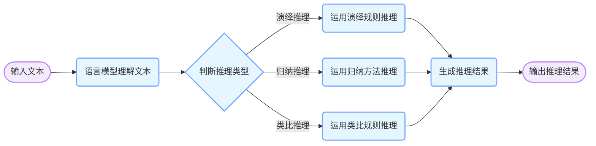

# 语言模型在逻辑推理中的优势与局限

> 关键词：语言模型、逻辑推理、优势、局限、自然语言处理

> 摘要：本文深入探讨了语言模型在逻辑推理领域的应用，详细分析了其具备的优势，如知识整合能力、自然语言理解等，同时也指出了在处理复杂逻辑、知识更新等方面存在的局限。通过对核心概念、算法原理、数学模型的阐述，结合实际项目案例，展示了语言模型在逻辑推理中的实际表现。此外，还介绍了相关的工具和资源，最后对语言模型在逻辑推理中的未来发展趋势与挑战进行了总结。

## 1. 背景介绍 
### 1.1 目的和范围
随着人工智能技术的飞速发展，语言模型在自然语言处理领域取得了显著的成果。逻辑推理作为人类智能的重要组成部分，对于解决复杂问题、做出合理决策具有关键作用。本文章旨在全面分析语言模型在逻辑推理中的优势与局限，涵盖从基本概念到实际应用的多个层面，为相关领域的研究和应用提供参考。

### 1.2 预期读者
本文适合对人工智能、自然语言处理、逻辑推理等领域感兴趣的科研人员、工程师、学生以及对新技术有探索欲望的爱好者阅读。无论是想要深入了解语言模型技术原理的专业人士，还是希望了解人工智能在逻辑推理中应用现状的初学者，都能从本文中获取有价值的信息。

### 1.3 文档结构概述
本文将首先介绍语言模型和逻辑推理的核心概念及其联系，通过文本示意图和 Mermaid 流程图进行直观展示。接着详细阐述语言模型在逻辑推理中所运用的核心算法原理，并给出具体操作步骤和 Python 源代码示例。然后介绍相关的数学模型和公式，并结合实例进行说明。通过实际项目案例，展示语言模型在逻辑推理中的具体应用和代码实现。之后分析语言模型在逻辑推理中的实际应用场景，推荐相关的学习资源、开发工具框架和论文著作。最后总结语言模型在逻辑推理中的未来发展趋势与挑战，并对常见问题进行解答。

### 1.4 术语表
#### 1.4.1 核心术语定义
- **语言模型**：是一种基于概率统计的模型，用于预测给定上下文下下一个词出现的概率。它通过学习大量的文本数据，掌握语言的语法、语义和结构信息，从而能够生成自然流畅的文本。
- **逻辑推理**：是指从已知的前提条件出发，依据一定的逻辑规则，推导出新的结论的过程。逻辑推理可以分为演绎推理、归纳推理、类比推理等不同类型。
- **自然语言处理（NLP）**：是一门研究如何让计算机理解、处理和生成自然语言的学科。它涉及到语音识别、机器翻译、文本分类、信息抽取等多个领域。

#### 1.4.2 相关概念解释
- **预训练模型**：是指在大规模无监督数据上进行预训练的语言模型。预训练模型可以学习到丰富的语言知识和语义信息，为后续的任务提供良好的初始化参数。
- **微调**：是指在预训练模型的基础上，针对特定的任务在小规模有监督数据上进行进一步训练的过程。微调可以使模型更好地适应特定任务的需求。
- **上下文**：是指文本中某个词或句子周围的其他词或句子。上下文信息对于理解文本的语义和进行逻辑推理具有重要作用。

#### 1.4.3 缩略词列表
- **NLP**：Natural Language Processing（自然语言处理）
- **GPT**：Generative Pretrained Transformer（生成式预训练变换器）
- **BERT**：Bidirectional Encoder Representations from Transformers（基于变换器的双向编码器表示）

## 2. 核心概念与联系 

### 语言模型的原理
语言模型的核心目标是计算一个句子 $S = w_1, w_2, \cdots, w_n$ 出现的概率 $P(S)$。通常采用链式法则将其分解为每个词在其前面词的条件下出现的概率之积：

$$P(S) = P(w_1, w_2, \cdots, w_n) = \prod_{i=1}^{n} P(w_i | w_1, w_2, \cdots, w_{i-1})$$

早期的语言模型，如 $n$-gram 模型，假设每个词只依赖于其前面的 $n - 1$ 个词，从而简化计算：

$$P(w_i | w_1, w_2, \cdots, w_{i-1}) \approx P(w_i | w_{i - n + 1}, \cdots, w_{i-1})$$

现代的语言模型，如基于 Transformer 架构的模型（如 GPT、BERT 等），通过自注意力机制能够捕捉更广泛的上下文信息，从而更准确地估计词的条件概率。

### 逻辑推理的类型
逻辑推理主要包括以下几种类型：
- **演绎推理**：从一般性的前提出发，通过推导即“演绎”，得出具体陈述或个别结论的过程。例如，“所有的人都会死亡，苏格拉底是人，所以苏格拉底会死亡”。
- **归纳推理**：从个别事例中概括出一般性结论的推理过程。例如，“观察到天鹅 A 是白色的，天鹅 B 是白色的，天鹅 C 是白色的，所以所有的天鹅都是白色的”。
- **类比推理**：根据两个或两类对象有部分属性相同，从而推出它们的其他属性也相同的推理过程。例如，“地球和火星都有大气层、水等，地球上有生命，所以火星上可能也有生命”。

### 语言模型与逻辑推理的联系
语言模型可以为逻辑推理提供自然语言的理解和生成能力。通过对文本的语义理解，语言模型能够识别逻辑推理中的前提条件和结论，并尝试运用所学的知识和规则进行推理。同时，语言模型可以生成自然语言形式的推理过程和结论，方便人类理解和交流。

### 文本示意图
```plaintext
语言模型
|
|-- 知识学习（大规模文本数据）
|   |
|   |-- 语法知识
|   |-- 语义知识
|   |-- 常识知识
|
|-- 推理能力（结合逻辑规则）
|   |
|   |-- 演绎推理
|   |-- 归纳推理
|   |-- 类比推理
|
|-- 输出结果（自然语言形式）
```

### Mermaid 流程图


## 3. 核心算法原理 & 具体操作步骤 

### 基于 Transformer 的语言模型原理
Transformer 是一种基于自注意力机制的神经网络架构，它由编码器和解码器组成。在语言模型中，通常使用编码器来学习文本的表示。

自注意力机制允许模型在处理每个位置的词时，考虑句子中其他所有位置的词的信息。具体来说，对于输入序列 $X = [x_1, x_2, \cdots, x_n]$，自注意力机制计算每个位置的输出 $z_i$ 如下：

1. 计算查询（Query）、键（Key）和值（Value）：
    $$Q = XW^Q$$
    $$K = XW^K$$
    $$V = XW^V$$
    其中 $W^Q$、$W^K$ 和 $W^V$ 是可学习的权重矩阵。

2. 计算注意力分数：
    $$Attention(Q, K, V) = \text{softmax}\left(\frac{QK^T}{\sqrt{d_k}}\right)V$$
    其中 $d_k$ 是键的维度。

Transformer 通常由多个编码器层堆叠而成，每个编码器层包含一个自注意力子层和一个前馈神经网络子层。

### Python 代码示例
以下是使用 PyTorch 实现一个简单的自注意力机制的代码：

```python
import torch
import torch.nn as nn

class SelfAttention(nn.Module):
    def __init__(self, input_dim, d_k):
        super(SelfAttention, self).__init__()
        self.W_q = nn.Linear(input_dim, d_k)
        self.W_k = nn.Linear(input_dim, d_k)
        self.W_v = nn.Linear(input_dim, d_k)

    def forward(self, X):
        Q = self.W_q(X)
        K = self.W_k(X)
        V = self.W_v(X)

        attention_scores = torch.matmul(Q, K.transpose(-2, -1)) / torch.sqrt(torch.tensor(Q.size(-1)).float())
        attention_probs = torch.softmax(attention_scores, dim=-1)
        output = torch.matmul(attention_probs, V)
        return output

# 示例使用
input_dim = 128
d_k = 64
batch_size = 32
seq_length = 10

X = torch.randn(batch_size, seq_length, input_dim)
self_attn = SelfAttention(input_dim, d_k)
output = self_attn(X)
print(output.shape)
```

### 具体操作步骤
1. **数据预处理**：将输入的文本数据进行分词、编码等处理，转换为模型可以接受的输入格式。
2. **模型加载**：加载预训练的语言模型，如 GPT 或 BERT。
3. **微调（可选）**：如果有特定的逻辑推理任务，可以在预训练模型的基础上进行微调。
4. **推理过程**：将处理后的输入数据输入到模型中，模型根据学习到的知识和规则进行推理。
5. **结果输出**：将模型的输出转换为自然语言形式，输出推理结果。

## 4. 数学模型和公式 & 详细讲解 & 举例说明 

### 交叉熵损失函数
在训练语言模型时，通常使用交叉熵损失函数来衡量模型预测的概率分布与真实标签的概率分布之间的差异。对于一个分类问题，假设模型的预测概率分布为 $p = [p_1, p_2, \cdots, p_n]$，真实标签的概率分布为 $q = [q_1, q_2, \cdots, q_n]$，则交叉熵损失函数定义为：

$$H(p, q) = -\sum_{i=1}^{n} q_i \log(p_i)$$

在语言模型中，真实标签是一个单热编码向量，即只有一个位置为 1，其余位置为 0。因此，交叉熵损失函数可以简化为：

$$H(p, q) = -\log(p_{y})$$
其中 $y$ 是真实标签的索引。

### 举例说明
假设我们有一个简单的语言模型，用于预测下一个词。输入序列为“我喜欢”，模型预测下一个词的概率分布为 $p = [0.1, 0.2, 0.3, 0.4]$，分别对应“苹果”、“香蕉”、“橘子”、“葡萄”。如果真实的下一个词是“葡萄”，则其索引 $y = 3$（从 0 开始计数），那么交叉熵损失为：

$$H(p, q) = -\log(0.4) \approx 0.916$$

### 梯度下降优化算法
为了最小化交叉熵损失函数，通常使用梯度下降优化算法。梯度下降算法的基本思想是沿着损失函数的负梯度方向更新模型的参数。对于一个可微的损失函数 $L(\theta)$，其中 $\theta$ 是模型的参数，梯度下降算法的更新公式为：

$$\theta_{t+1} = \theta_t - \alpha \nabla L(\theta_t)$$
其中 $\alpha$ 是学习率，$\nabla L(\theta_t)$ 是损失函数在 $\theta_t$ 处的梯度。

### 举例说明
假设我们有一个简单的线性模型 $y = wx + b$，损失函数为均方误差损失 $L(w, b) = \frac{1}{n} \sum_{i=1}^{n} (y_i - (wx_i + b))^2$。我们可以通过计算 $L$ 关于 $w$ 和 $b$ 的梯度，然后使用梯度下降算法更新 $w$ 和 $b$ 的值。

```python
import torch

# 生成一些示例数据
x = torch.tensor([1.0, 2.0, 3.0, 4.0])
y = torch.tensor([2.0, 4.0, 6.0, 8.0])

# 初始化参数
w = torch.tensor(0.0, requires_grad=True)
b = torch.tensor(0.0, requires_grad=True)

# 定义学习率和迭代次数
learning_rate = 0.01
num_epochs = 100

for epoch in range(num_epochs):
    # 前向传播
    y_pred = w * x + b
    loss = ((y_pred - y) ** 2).mean()

    # 反向传播
    loss.backward()

    # 更新参数
    with torch.no_grad():
        w -= learning_rate * w.grad
        b -= learning_rate * b.grad

    # 清零梯度
    w.grad.zero_()
    b.grad.zero_()

    if (epoch + 1) % 10 == 0:
        print(f'Epoch [{epoch+1}/{num_epochs}], Loss: {loss.item():.4f}')

print(f'Final w: {w.item()}, Final b: {b.item()}')
```

## 5. 项目实战：代码实际案例和详细解释说明 

### 5.1  开发环境搭建
#### 安装 Python
首先需要安装 Python 3.x 版本。可以从 Python 官方网站（https://www.python.org/downloads/） 下载并安装。

#### 安装 PyTorch
PyTorch 是一个广泛使用的深度学习框架。可以根据自己的系统和 CUDA 版本选择合适的安装方式。例如，在 Linux 系统上，如果使用 CUDA 11.3，可以使用以下命令安装：

```sh
pip install torch torchvision torchaudio --extra-index-url https://download.pytorch.org/whl/cu113
```

#### 安装 Transformers 库
Transformers 库提供了许多预训练的语言模型，如 GPT、BERT 等。可以使用以下命令安装：

```sh
pip install transformers
```

### 5.2  源代码详细实现和代码解读
以下是一个使用 Transformers 库进行简单逻辑推理的示例代码：

```python
from transformers import AutoTokenizer, AutoModelForSequenceClassification
import torch

# 加载预训练的模型和分词器
model_name = "bert-base-chinese"
tokenizer = AutoTokenizer.from_pretrained(model_name)
model = AutoModelForSequenceClassification.from_pretrained(model_name, num_labels=2)

# 定义输入文本
premise = "所有的猫都会抓老鼠。"
hypothesis = "这只动物是猫，所以它会抓老鼠。"

# 对输入文本进行编码
inputs = tokenizer(premise, hypothesis, return_tensors="pt")

# 进行推理
with torch.no_grad():
    outputs = model(**inputs)
    logits = outputs.logits
    predictions = torch.argmax(logits, dim=1)

# 输出结果
if predictions.item() == 0:
    print("推理不成立")
else:
    print("推理成立")
```

### 代码解读与分析
1. **模型和分词器加载**：使用 `AutoTokenizer` 和 `AutoModelForSequenceClassification` 从 Hugging Face 的模型库中加载预训练的 BERT 模型和对应的分词器。
2. **输入文本定义**：定义前提条件 `premise` 和假设 `hypothesis`，用于进行逻辑推理。
3. **文本编码**：使用分词器对输入文本进行编码，将其转换为模型可以接受的输入格式。
4. **推理过程**：将编码后的输入数据输入到模型中，使用 `torch.no_grad()` 上下文管理器禁用梯度计算，以提高推理速度。模型输出逻辑值 `logits`，通过 `torch.argmax` 函数获取预测结果。
5. **结果输出**：根据预测结果输出推理是否成立。

## 6. 实际应用场景 
### 智能问答系统
语言模型在智能问答系统中可以用于理解用户的问题，并根据知识库中的信息进行逻辑推理，给出准确的回答。例如，在一个医疗问答系统中，用户询问“感冒了应该吃什么药”，语言模型可以根据医学知识和用户的症状描述进行推理，推荐合适的药物。

### 文本分类和情感分析
在文本分类任务中，语言模型可以分析文本的语义和逻辑结构，将文本分类到不同的类别中。例如，在新闻分类任务中，语言模型可以根据新闻的内容判断其属于政治、经济、体育等哪个类别。在情感分析任务中，语言模型可以分析文本中表达的情感倾向，如积极、消极或中性。

### 机器翻译
在机器翻译中，语言模型可以帮助理解源语言文本的逻辑和语义，生成更准确、通顺的目标语言翻译。例如，在翻译一篇科技文章时，语言模型可以理解文章中的专业术语和逻辑关系，将其准确地翻译成另一种语言。

### 智能客服
智能客服系统可以利用语言模型进行逻辑推理，理解用户的问题和需求，并提供相应的解决方案。例如，在电商客服中，用户询问“我的订单什么时候能到”，智能客服可以根据订单信息和物流规则进行推理，给出预计到达时间。

## 7. 工具和资源推荐
### 7.1 学习资源推荐
#### 7.1.1 书籍推荐
- 《深度学习》（Deep Learning）：由 Ian Goodfellow、Yoshua Bengio 和 Aaron Courville 所著，是深度学习领域的经典教材，涵盖了神经网络、卷积神经网络、循环神经网络等多个方面的内容。
- 《自然语言处理入门》：何晗所著，适合初学者入门自然语言处理，介绍了自然语言处理的基本概念、方法和应用。
- 《Python 深度学习》（Deep Learning with Python）：由 Francois Chollet 所著，通过实际案例介绍了如何使用 Python 和 Keras 进行深度学习模型的开发。

#### 7.1.2 在线课程
- Coursera 上的“深度学习专项课程”（Deep Learning Specialization）：由 Andrew Ng 教授授课，包括神经网络和深度学习、改善深层神经网络、结构化机器学习项目等多个课程，全面介绍了深度学习的理论和实践。
- edX 上的“自然语言处理基础”（Foundations of Natural Language Processing）：介绍了自然语言处理的基本概念、算法和应用，适合初学者学习。
- 哔哩哔哩（B 站）上有许多关于深度学习和自然语言处理的免费教程，如李沐的《动手学深度学习》课程，通过代码实践深入讲解深度学习的原理和应用。

#### 7.1.3 技术博客和网站
- Hugging Face 博客（https://huggingface.co/blog）：提供了关于自然语言处理、深度学习等领域的最新技术和研究成果，同时也有许多关于 Transformers 库的使用教程和案例。
- Medium 上的 Towards Data Science（https://towardsdatascience.com/）：汇集了众多数据科学、机器学习和人工智能领域的优秀文章，涵盖了理论讲解、实践案例和技术趋势分析等方面。
- 机器之心（https://www.alignmentforum.org/）：专注于人工智能领域的资讯和技术解读，提供了丰富的行业动态和技术文章。

### 7.2 开发工具框架推荐
#### 7.2.1 IDE和编辑器
- PyCharm：是一款专门为 Python 开发设计的集成开发环境（IDE），提供了代码编辑、调试、版本控制等丰富的功能，适合专业的 Python 开发者使用。
- Jupyter Notebook：是一个基于网页的交互式开发环境，支持 Python、R 等多种编程语言。它可以将代码、文本、图像等内容整合在一起，方便进行数据分析和模型开发。
- Visual Studio Code：是一款轻量级的代码编辑器，支持多种编程语言和插件扩展。它具有丰富的代码高亮、自动补全、调试等功能，适合初学者和快速开发。

#### 7.2.2 调试和性能分析工具
- PyTorch Profiler：是 PyTorch 官方提供的性能分析工具，可以帮助开发者分析模型的运行时间、内存使用等情况，找出性能瓶颈。
- TensorBoard：是 TensorFlow 提供的可视化工具，也可以与 PyTorch 结合使用。它可以可视化模型的训练过程、损失曲线、网络结构等信息，方便开发者进行调试和优化。
- cProfile：是 Python 标准库中的性能分析工具，可以分析 Python 代码的运行时间和函数调用情况，帮助开发者找出代码中的性能瓶颈。

#### 7.2.3 相关框架和库
- Transformers：是 Hugging Face 开发的一个开源库，提供了许多预训练的语言模型和工具，方便开发者进行自然语言处理任务的开发。
- NLTK（Natural Language Toolkit）：是一个广泛使用的自然语言处理工具包，提供了丰富的语料库、词性标注、分词等工具，适合初学者学习和实践。
- SpaCy：是一个高效的自然语言处理库，提供了快速的分词、词性标注、命名实体识别等功能，适合大规模数据的处理。

### 7.3 相关论文著作推荐
#### 7.3.1 经典论文
- “Attention Is All You Need”：介绍了 Transformer 架构，提出了自注意力机制，是现代语言模型的基础。
- “BERT: Pre-training of Deep Bidirectional Transformers for Language Understanding”：提出了 BERT 模型，通过双向预训练的方式学习语言表示，在多个自然语言处理任务上取得了显著的成果。
- “Generative Pretrained Transformer 3 (GPT-3): Its Nature, Scope, Limits, and Consequences”：介绍了 GPT-3 模型，展示了其强大的语言生成能力和广泛的应用场景。

#### 7.3.2 最新研究成果
- 关注 ACL（Association for Computational Linguistics）、EMNLP（Conference on Empirical Methods in Natural Language Processing）等自然语言处理领域的顶级会议，这些会议上会发布许多最新的研究成果。
- 阅读 ArXiv 上的预印本论文，许多研究人员会在 ArXiv 上提前发布自己的研究成果。

#### 7.3.3 应用案例分析
- 一些科技公司的博客文章会分享他们在实际项目中使用语言模型进行逻辑推理的应用案例，如 Google、Microsoft、OpenAI 等公司的官方博客。
- Kaggle 上有许多关于自然语言处理的竞赛和数据集，参赛者会分享他们的解决方案和代码实现，这些案例可以帮助我们了解语言模型在实际应用中的具体做法。

## 8. 总结：未来发展趋势与挑战
### 未来发展趋势
- **多模态融合**：未来的语言模型将不仅仅局限于文本处理，还会与图像、音频、视频等多种模态的数据进行融合，实现更全面、更智能的逻辑推理。例如，在一个智能安防系统中，结合图像和文本信息进行事件推理。
- **知识增强**：通过将外部知识库与语言模型相结合，增强模型的知识储备和推理能力。例如，将维基百科等知识库中的知识融入到语言模型中，使其能够更好地处理需要专业知识的逻辑推理任务。
- **个性化推理**：根据用户的个性化需求和偏好，提供更符合用户特点的逻辑推理服务。例如，在智能推荐系统中，根据用户的历史行为和兴趣进行个性化的商品推荐推理。

### 挑战
- **数据质量和隐私问题**：语言模型的训练需要大量的数据，但数据的质量和隐私问题是一个挑战。低质量的数据可能会影响模型的性能，而隐私问题则需要在数据收集、使用和存储过程中得到妥善解决。
- **可解释性和可靠性**：语言模型在逻辑推理中的决策过程往往是黑盒的，难以解释其推理依据。同时，模型的可靠性也需要进一步提高，避免出现错误的推理结果。
- **计算资源和能耗问题**：训练和运行大规模的语言模型需要大量的计算资源和能耗，这不仅增加了成本，也对环境造成了一定的压力。如何提高模型的效率，减少计算资源和能耗的需求是一个重要的挑战。

## 9. 附录：常见问题与解答
### 问题 1：语言模型在逻辑推理中的准确率如何提高？
解答：可以通过以下几种方法提高语言模型在逻辑推理中的准确率：
- 使用更多高质量的训练数据，特别是包含逻辑推理任务的标注数据。
- 对预训练模型进行微调，使其更好地适应特定的逻辑推理任务。
- 结合外部知识库，增强模型的知识储备和推理能力。
- 采用集成学习的方法，将多个模型的结果进行融合。

### 问题 2：语言模型能否处理复杂的逻辑推理问题？
解答：目前的语言模型在处理一些简单的逻辑推理问题上取得了较好的效果，但在处理复杂的逻辑推理问题时仍然存在一定的局限性。复杂的逻辑推理问题可能涉及到多个前提条件、复杂的逻辑规则和知识背景，需要模型具备更强的推理能力和知识理解能力。未来随着技术的发展，语言模型在处理复杂逻辑推理问题上的能力有望得到进一步提升。

### 问题 3：如何选择适合逻辑推理任务的语言模型？
解答：选择适合逻辑推理任务的语言模型可以考虑以下几个因素：
- 模型的规模和性能：一般来说，规模较大的模型在处理复杂任务时具有更好的性能，但也需要更多的计算资源。
- 模型的预训练任务：选择与逻辑推理任务相关的预训练任务的模型，如经过问答任务预训练的模型可能更适合逻辑推理。
- 模型的可解释性：如果需要对推理结果进行解释，选择具有较好可解释性的模型。
- 模型的开源性和易用性：开源的模型可以方便进行二次开发和定制，易用性高的模型可以降低开发成本。

## 10. 扩展阅读 & 参考资料
- Goodfellow, I., Bengio, Y., & Courville, A. (2016). Deep Learning. MIT Press.
- Chollet, F. (2017). Deep Learning with Python. Manning Publications.
- Devlin, J., Chang, M. W., Lee, K., & Toutanova, K. (2018). BERT: Pre-training of Deep Bidirectional Transformers for Language Understanding. arXiv preprint arXiv:1810.04805.
- Brown, T. B., Mann, B., Ryder, N., Subbiah, M., Kaplan, J., Dhariwal, P.,... & Amodei, D. (2020). Language Models are Few-Shot Learners. arXiv preprint arXiv:2005.14165.

作者：AI天才研究院/AI Genius Institute & 禅与计算机程序设计艺术 /Zen And The Art of Computer Programming