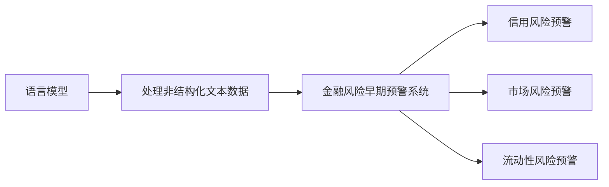

# 语言模型在金融风险早期预警中的应用研究

> 关键词：语言模型、金融风险早期预警、自然语言处理、机器学习、数据分析

> 摘要：本文聚焦于语言模型在金融风险早期预警中的应用。首先介绍了研究的背景、目的、预期读者等内容，阐述了核心概念及相互联系。详细讲解了相关核心算法原理并给出Python代码示例，对数学模型和公式进行了深入剖析和举例说明。通过项目实战展示了如何搭建开发环境、实现源代码并进行解读分析。探讨了语言模型在金融风险早期预警中的实际应用场景，推荐了学习资源、开发工具框架以及相关论文著作。最后总结了未来发展趋势与挑战，并给出常见问题解答和扩展阅读参考资料，旨在为相关领域的研究和实践提供全面且深入的指导。

## 1. 背景介绍 
### 1.1 目的和范围
金融风险的早期预警对于金融机构、投资者以及监管部门都至关重要。及时发现潜在的金融风险可以帮助各方采取有效的措施来降低损失、维护金融稳定。传统的金融风险预警方法主要依赖于结构化的金融数据，如财务报表、交易数据等。然而，随着互联网和社交媒体的发展，大量的非结构化文本数据涌现，这些数据包含了丰富的关于金融市场、企业和经济环境的信息。语言模型作为自然语言处理领域的重要工具，能够对这些非结构化文本数据进行有效的处理和分析，提取有价值的信息，从而为金融风险早期预警提供新的视角和方法。

本研究的范围主要包括：介绍适用于金融风险早期预警的语言模型的核心概念和原理；探讨如何将语言模型应用于金融风险早期预警的具体算法和步骤；通过实际案例展示语言模型在金融风险早期预警中的应用效果；分析语言模型在金融风险早期预警中面临的挑战和未来发展趋势。

### 1.2 预期读者
本文的预期读者包括金融领域的从业者，如银行风险管理部门的工作人员、投资经理、金融分析师等，他们可以通过本文了解如何利用语言模型来提升金融风险早期预警的能力。同时，也适合计算机科学和自然语言处理领域的研究人员和开发者，他们可以从金融应用的角度深入了解语言模型的实际应用场景和挑战。此外，金融监管部门的工作人员也可以通过本文了解语言模型在金融风险监测中的应用，为制定监管政策提供参考。

### 1.3 文档结构概述
本文将按照以下结构进行组织：首先介绍核心概念与联系，包括语言模型和金融风险早期预警的基本概念以及它们之间的关联；接着详细阐述核心算法原理和具体操作步骤，并给出Python代码示例；然后介绍相关的数学模型和公式，并进行详细讲解和举例说明；通过项目实战展示语言模型在金融风险早期预警中的具体应用，包括开发环境搭建、源代码实现和代码解读；探讨语言模型在金融风险早期预警中的实际应用场景；推荐相关的学习资源、开发工具框架和论文著作；最后总结未来发展趋势与挑战，提供常见问题解答和扩展阅读参考资料。

### 1.4 术语表
#### 1.4.1 核心术语定义
- **语言模型**：是一种对语言数据进行建模的概率模型，用于预测给定上下文下下一个词出现的概率。在自然语言处理中，语言模型可以用于文本生成、机器翻译、信息检索等任务。
- **金融风险早期预警**：是指通过对各种金融数据和信息的监测和分析，提前发现潜在的金融风险，并发出预警信号，以便金融机构和监管部门采取相应的措施来防范和化解风险。
- **自然语言处理（NLP）**：是计算机科学与语言学的交叉领域，旨在让计算机能够理解、处理和生成人类语言。自然语言处理技术包括文本分类、情感分析、命名实体识别等。
- **机器学习**：是一门多领域交叉学科，涉及概率论、统计学、逼近论、凸分析、算法复杂度理论等多门学科。它专门研究计算机怎样模拟或实现人类的学习行为，以获取新的知识或技能，重新组织已有的知识结构使之不断改善自身的性能。

#### 1.4.2 相关概念解释
- **词嵌入**：是将词语表示为低维向量的技术，通过词嵌入可以将文本数据转换为计算机能够处理的数值形式。词嵌入能够捕捉词语之间的语义关系，使得在向量空间中距离相近的词语具有相似的语义。
- **深度学习**：是机器学习的一个分支领域，它通过构建多层神经网络来学习数据的复杂特征和模式。深度学习在自然语言处理、图像识别等领域取得了显著的成果。
- **金融舆情**：是指公众对金融市场、金融机构、金融产品等方面的看法、态度和情绪。金融舆情可以通过社交媒体、新闻报道等渠道获取，对金融市场的波动和金融风险的产生具有重要影响。

#### 1.4.3 缩略词列表
- **NLP**：Natural Language Processing（自然语言处理）
- **ML**：Machine Learning（机器学习）
- **DL**：Deep Learning（深度学习）
- **BERT**：Bidirectional Encoder Representations from Transformers（基于变换器的双向编码器表示）
- **LSTM**：Long Short-Term Memory（长短期记忆网络）

## 2. 核心概念与联系 

### 语言模型的基本原理
语言模型的核心目标是对语言数据的概率分布进行建模。给定一个文本序列 $w_1, w_2, \cdots, w_n$，语言模型的任务是计算该序列出现的概率 $P(w_1, w_2, \cdots, w_n)$。根据链式法则，这个概率可以分解为：

$$P(w_1, w_2, \cdots, w_n) = \prod_{i=1}^{n} P(w_i | w_1, w_2, \cdots, w_{i-1})$$

早期的语言模型，如n-gram模型，假设当前词的出现只依赖于前 $n-1$ 个词，即：

$$P(w_i | w_1, w_2, \cdots, w_{i-1}) \approx P(w_i | w_{i-(n-1)}, \cdots, w_{i-1})$$

然而，n-gram模型存在数据稀疏和长距离依赖的问题。为了解决这些问题，近年来深度学习语言模型得到了广泛的应用，如基于循环神经网络（RNN）及其变体（如LSTM、GRU）和变换器（Transformer）架构的语言模型。

### 金融风险早期预警的基本概念
金融风险早期预警是一个复杂的系统工程，它涉及到对各种金融数据和信息的收集、整理、分析和判断。金融风险可以分为信用风险、市场风险、流动性风险等多种类型。早期预警的目的是在风险发生之前，通过对相关指标和信息的监测和分析，发现潜在的风险因素，并发出预警信号。

### 语言模型与金融风险早期预警的联系
语言模型可以为金融风险早期预警提供新的数据源和分析方法。一方面，通过对新闻报道、社交媒体、企业公告等非结构化文本数据的分析，语言模型可以提取有关金融市场、企业和经济环境的信息，如市场情绪、企业声誉、宏观经济趋势等。这些信息可以作为金融风险早期预警的重要补充，帮助提高预警的准确性和及时性。另一方面，语言模型可以用于对金融文本数据进行分类、情感分析、命名实体识别等任务，从而为金融风险的评估和预警提供更深入的分析和支持。

### 核心概念架构的文本示意图
```plaintext
                    语言模型
                      |
                      | 处理非结构化文本数据
                      v
金融风险早期预警系统
  |                 |                 |
  |                 |                 |
信用风险预警    市场风险预警    流动性风险预警
```

### Mermaid 流程图


## 3. 核心算法原理 & 具体操作步骤 

### 基于BERT的金融文本情感分析算法原理
BERT（Bidirectional Encoder Representations from Transformers）是一种基于变换器架构的预训练语言模型，它通过在大规模文本数据上进行无监督学习，学习到了丰富的语言表示。在金融风险早期预警中，我们可以使用BERT进行金融文本的情感分析，以判断文本所表达的情感倾向（积极、消极或中性），从而了解市场情绪和企业声誉。

BERT的核心是变换器的编码器部分，它采用了多头自注意力机制，能够捕捉文本中不同位置之间的依赖关系。在预训练阶段，BERT使用了两种任务：掩码语言模型（Masked Language Model，MLM）和下一句预测（Next Sentence Prediction，NSP）。在微调阶段，我们可以在BERT的基础上添加一个分类层，用于金融文本的情感分类。

### 具体操作步骤
1. **数据收集与预处理**：收集金融领域的新闻报道、社交媒体评论等文本数据，并进行清洗、分词等预处理操作。
2. **模型加载**：加载预训练的BERT模型。
3. **数据编码**：将预处理后的文本数据编码为BERT模型能够接受的输入格式。
4. **模型微调**：在编码后的数据上对BERT模型进行微调，训练分类层的参数。
5. **模型评估与预测**：使用测试数据对微调后的模型进行评估，并使用训练好的模型对新的金融文本数据进行情感分类预测。

### Python代码示例
```python
import torch
from transformers import BertTokenizer, BertForSequenceClassification
from torch.utils.data import DataLoader, Dataset
from sklearn.model_selection import train_test_split
import pandas as pd

# 定义数据集类
class FinancialTextDataset(Dataset):
    def __init__(self, texts, labels, tokenizer, max_length):
        self.texts = texts
        self.labels = labels
        self.tokenizer = tokenizer
        self.max_length = max_length

    def __len__(self):
        return len(self.texts)

    def __getitem__(self, idx):
        text = str(self.texts[idx])
        label = self.labels[idx]
        encoding = self.tokenizer.encode_plus(
            text,
            add_special_tokens=True,
            max_length=self.max_length,
            padding='max_length',
            truncation=True,
            return_tensors='pt'
        )
        return {
            'input_ids': encoding['input_ids'].flatten(),
            'attention_mask': encoding['attention_mask'].flatten(),
            'labels': torch.tensor(label, dtype=torch.long)
        }

# 数据加载与预处理
data = pd.read_csv('financial_text_data.csv')
texts = data['text'].tolist()
labels = data['label'].tolist()

train_texts, test_texts, train_labels, test_labels = train_test_split(texts, labels, test_size=0.2, random_state=42)

# 加载预训练的BERT模型和分词器
tokenizer = BertTokenizer.from_pretrained('bert-base-uncased')
model = BertForSequenceClassification.from_pretrained('bert-base-uncased', num_labels=3)

# 定义数据集和数据加载器
max_length = 128
train_dataset = FinancialTextDataset(train_texts, train_labels, tokenizer, max_length)
test_dataset = FinancialTextDataset(test_texts, test_labels, tokenizer, max_length)

train_dataloader = DataLoader(train_dataset, batch_size=16, shuffle=True)
test_dataloader = DataLoader(test_dataset, batch_size=16, shuffle=False)

# 训练参数设置
device = torch.device('cuda' if torch.cuda.is_available() else 'cpu')
model.to(device)

optimizer = torch.optim.AdamW(model.parameters(), lr=2e-5)
epochs = 3

# 模型训练
for epoch in range(epochs):
    model.train()
    total_loss = 0
    for batch in train_dataloader:
        input_ids = batch['input_ids'].to(device)
        attention_mask = batch['attention_mask'].to(device)
        labels = batch['labels'].to(device)

        optimizer.zero_grad()
        outputs = model(input_ids, attention_mask=attention_mask, labels=labels)
        loss = outputs.loss
        total_loss += loss.item()

        loss.backward()
        optimizer.step()

    print(f'Epoch {epoch + 1}, Loss: {total_loss / len(train_dataloader)}')

# 模型评估
model.eval()
correct_predictions = 0
total_predictions = 0

with torch.no_grad():
    for batch in test_dataloader:
        input_ids = batch['input_ids'].to(device)
        attention_mask = batch['attention_mask'].to(device)
        labels = batch['labels'].to(device)

        outputs = model(input_ids, attention_mask=attention_mask)
        logits = outputs.logits
        predictions = torch.argmax(logits, dim=1)

        correct_predictions += (predictions == labels).sum().item()
        total_predictions += labels.size(0)

accuracy = correct_predictions / total_predictions
print(f'Test Accuracy: {accuracy}')
```

## 4. 数学模型和公式 & 详细讲解 & 举例说明 

### 掩码语言模型（MLM）
在掩码语言模型中，输入的文本序列中的一部分词会被随机掩码，模型的任务是预测这些被掩码的词。具体来说，给定一个文本序列 $w_1, w_2, \cdots, w_n$，我们随机选择其中的一些词进行掩码，得到掩码后的序列 $\tilde{w}_1, \tilde{w}_2, \cdots, \tilde{w}_n$。模型的目标是最大化以下概率：

$$\max_{\theta} \sum_{i=1}^{n} \log P(w_i | \tilde{w}_1, \tilde{w}_2, \cdots, \tilde{w}_{i-1}, \tilde{w}_{i+1}, \cdots, \tilde{w}_n; \theta)$$

其中，$\theta$ 是模型的参数。

例如，假设输入的文本序列是 “The dog is running fast”，我们随机掩码 “dog” 这个词，得到掩码后的序列 “The [MASK] is running fast”。模型需要预测 [MASK] 位置应该填入的词，即最大化 $P(\text{dog} | \text{The}, [MASK], \text{is}, \text{running}, \text{fast}; \theta)$。

### 下一句预测（NSP）
下一句预测任务用于学习句子之间的关系。给定两个句子 $A$ 和 $B$，模型需要判断 $B$ 是否是 $A$ 的下一句。模型的目标是最大化以下概率：

$$\max_{\theta} P(y | A, B; \theta)$$

其中，$y$ 是一个二分类标签，表示 $B$ 是否是 $A$ 的下一句，$\theta$ 是模型的参数。

例如，假设 $A$ 是 “I went to the park yesterday.”，$B$ 是 “I saw a lot of beautiful flowers there.”，模型需要判断 $B$ 是否是 $A$ 的下一句，并最大化相应的预测概率。

### 交叉熵损失函数
在金融文本情感分析的微调阶段，我们使用交叉熵损失函数来衡量模型预测结果与真实标签之间的差异。对于一个样本 $(x, y)$，其中 $x$ 是输入文本，$y$ 是真实标签，模型的预测概率分布为 $p(y|x)$，交叉熵损失函数定义为：

$$L(y, p(y|x)) = -\sum_{i=1}^{C} y_i \log p(y_i|x)$$

其中，$C$ 是类别数。在金融文本情感分析中，$C$ 通常为 3（积极、消极、中性）。

例如，假设一个样本的真实标签为 $y = [0, 1, 0]$（表示消极情感），模型的预测概率分布为 $p(y|x) = [0.1, 0.8, 0.1]$，则交叉熵损失为：

$$L(y, p(y|x)) = -(0 \times \log 0.1 + 1 \times \log 0.8 + 0 \times \log 0.1) \approx 0.223$$

## 5. 项目实战：代码实际案例和详细解释说明 

### 5.1  开发环境搭建
#### 操作系统
推荐使用Linux系统，如Ubuntu 18.04或更高版本，因为Linux系统在深度学习开发中具有更好的稳定性和兼容性。

#### Python环境
安装Python 3.7或更高版本。可以使用Anaconda来管理Python环境，以下是创建和激活虚拟环境的命令：

```bash
conda create -n financial_risk_alert python=3.8
conda activate financial_risk_alert
```

#### 依赖库安装
安装所需的Python库，包括`transformers`、`torch`、`pandas`、`sklearn`等：

```bash
pip install transformers torch pandas scikit-learn
```

### 5.2  源代码详细实现和代码解读
以下是对前面给出的Python代码的详细解读：

```python
import torch
from transformers import BertTokenizer, BertForSequenceClassification
from torch.utils.data import DataLoader, Dataset
from sklearn.model_selection import train_test_split
import pandas as pd

# 定义数据集类
class FinancialTextDataset(Dataset):
    def __init__(self, texts, labels, tokenizer, max_length):
        self.texts = texts
        self.labels = labels
        self.tokenizer = tokenizer
        self.max_length = max_length

    def __len__(self):
        return len(self.texts)

    def __getitem__(self, idx):
        text = str(self.texts[idx])
        label = self.labels[idx]
        encoding = self.tokenizer.encode_plus(
            text,
            add_special_tokens=True,
            max_length=self.max_length,
            padding='max_length',
            truncation=True,
            return_tensors='pt'
        )
        return {
            'input_ids': encoding['input_ids'].flatten(),
            'attention_mask': encoding['attention_mask'].flatten(),
            'labels': torch.tensor(label, dtype=torch.long)
        }

# 数据加载与预处理
data = pd.read_csv('financial_text_data.csv')
texts = data['text'].tolist()
labels = data['label'].tolist()

train_texts, test_texts, train_labels, test_labels = train_test_split(texts, labels, test_size=0.2, random_state=42)

# 加载预训练的BERT模型和分词器
tokenizer = BertTokenizer.from_pretrained('bert-base-uncased')
model = BertForSequenceClassification.from_pretrained('bert-base-uncased', num_labels=3)

# 定义数据集和数据加载器
max_length = 128
train_dataset = FinancialTextDataset(train_texts, train_labels, tokenizer, max_length)
test_dataset = FinancialTextDataset(test_texts, test_labels, tokenizer, max_length)

train_dataloader = DataLoader(train_dataset, batch_size=16, shuffle=True)
test_dataloader = DataLoader(test_dataset, batch_size=16, shuffle=False)

# 训练参数设置
device = torch.device('cuda' if torch.cuda.is_available() else 'cpu')
model.to(device)

optimizer = torch.optim.AdamW(model.parameters(), lr=2e-5)
epochs = 3

# 模型训练
for epoch in range(epochs):
    model.train()
    total_loss = 0
    for batch in train_dataloader:
        input_ids = batch['input_ids'].to(device)
        attention_mask = batch['attention_mask'].to(device)
        labels = batch['labels'].to(device)

        optimizer.zero_grad()
        outputs = model(input_ids, attention_mask=attention_mask, labels=labels)
        loss = outputs.loss
        total_loss += loss.item()

        loss.backward()
        optimizer.step()

    print(f'Epoch {epoch + 1}, Loss: {total_loss / len(train_dataloader)}')

# 模型评估
model.eval()
correct_predictions = 0
total_predictions = 0

with torch.no_grad():
    for batch in test_dataloader:
        input_ids = batch['input_ids'].to(device)
        attention_mask = batch['attention_mask'].to(device)
        labels = batch['labels'].to(device)

        outputs = model(input_ids, attention_mask=attention_mask)
        logits = outputs.logits
        predictions = torch.argmax(logits, dim=1)

        correct_predictions += (predictions == labels).sum().item()
        total_predictions += labels.size(0)

accuracy = correct_predictions / total_predictions
print(f'Test Accuracy: {accuracy}')
```

#### 代码解读
1. **导入必要的库**：导入`torch`、`transformers`、`pandas`和`sklearn`等库，用于深度学习模型的构建、数据处理和模型评估。
2. **定义数据集类**：`FinancialTextDataset`类继承自`torch.utils.data.Dataset`，用于封装金融文本数据和标签，并将文本数据编码为BERT模型能够接受的输入格式。
3. **数据加载与预处理**：使用`pandas`读取CSV文件中的金融文本数据和标签，并使用`sklearn`的`train_test_split`函数将数据划分为训练集和测试集。
4. **加载预训练的BERT模型和分词器**：使用`transformers`库加载预训练的BERT模型和分词器，并根据金融文本情感分析的任务设置分类的类别数为3。
5. **定义数据集和数据加载器**：创建训练集和测试集的数据集对象，并使用`torch.utils.data.DataLoader`创建数据加载器，用于批量加载数据。
6. **训练参数设置**：设置训练设备（GPU或CPU）、优化器和训练轮数。
7. **模型训练**：在每个训练轮次中，将模型设置为训练模式，遍历训练数据加载器，计算损失并进行反向传播和参数更新。
8. **模型评估**：将模型设置为评估模式，遍历测试数据加载器，计算模型的预测结果，并统计正确预测的样本数，最后计算测试集的准确率。

### 5.3  代码解读与分析
通过上述代码，我们实现了一个基于BERT的金融文本情感分析模型。在训练过程中，模型通过不断调整参数来最小化交叉熵损失，从而提高对金融文本情感的分类准确率。在评估阶段，我们使用测试集来评估模型的泛化能力。

需要注意的是，模型的性能可能受到多种因素的影响，如数据质量、模型架构、训练参数等。在实际应用中，我们可以通过调整这些因素来进一步提高模型的性能。例如，可以增加训练数据的数量、尝试不同的预训练模型、调整学习率和训练轮数等。

## 6. 实际应用场景 
### 市场情绪监测
金融市场的情绪对资产价格的波动具有重要影响。通过使用语言模型对新闻报道、社交媒体评论等文本数据进行情感分析，可以实时监测市场情绪的变化。当市场情绪出现过度乐观或过度悲观时，可能预示着市场的反转或波动加剧，从而为投资者提供早期预警信号。

例如，在股票市场中，如果大量的新闻报道和社交媒体评论对某只股票持积极态度，而语言模型分析显示市场情绪过度乐观，那么投资者可以警惕该股票可能存在的回调风险。

### 企业声誉评估
企业的声誉对其经营和财务状况有着重要的影响。负面的新闻报道、社交媒体上的负面评价等都可能对企业的声誉造成损害，进而引发金融风险。语言模型可以对与企业相关的文本数据进行分析，评估企业的声誉状况。

例如，通过对企业的新闻报道、年报、社交媒体评论等文本数据进行情感分析和命名实体识别，可以及时发现企业面临的负面事件，如财务造假、产品质量问题等，从而为投资者和金融机构提供早期预警。

### 宏观经济趋势分析
宏观经济趋势对金融市场的稳定和金融机构的风险状况具有重要影响。语言模型可以对宏观经济新闻、政府报告、专家评论等文本数据进行分析，提取有关宏观经济趋势的信息，如经济增长、通货膨胀、利率走势等。

例如，通过对宏观经济新闻中的关键词进行提取和分析，语言模型可以判断宏观经济的走势是向好还是向坏，从而为金融机构的风险管理和投资决策提供参考。

### 信用风险预警
在信贷业务中，金融机构需要评估借款人的信用风险。除了传统的财务指标外，语言模型可以对借款人的社交媒体信息、新闻报道等非结构化文本数据进行分析，提取有关借款人的信用状况、还款意愿等信息。

例如，通过对借款人在社交媒体上的言论和行为进行分析，语言模型可以判断借款人的信用意识和还款意愿。如果发现借款人在社交媒体上频繁抱怨财务困难或有不良的信用记录，那么金融机构可以提前采取措施，如提高贷款利率、减少贷款额度等，以降低信用风险。

## 7. 工具和资源推荐
### 7.1 学习资源推荐
#### 7.1.1 书籍推荐
- 《自然语言处理入门》：作者何晗，本书系统地介绍了自然语言处理的基本概念、算法和应用，适合初学者入门。
- 《深度学习》：作者Ian Goodfellow、Yoshua Bengio和Aaron Courville，这本书是深度学习领域的经典教材，详细介绍了深度学习的原理、模型和算法。
- 《Python自然语言处理》：作者Steven Bird、Ewan Klein和Edward Loper，本书介绍了如何使用Python进行自然语言处理，包括文本处理、分类、聚类等任务。

#### 7.1.2 在线课程
- Coursera上的“Natural Language Processing Specialization”：由斯坦福大学的教授授课，涵盖了自然语言处理的各个方面，包括词嵌入、循环神经网络、变换器等。
- edX上的“Deep Learning for Natural Language Processing”：由华盛顿大学的教授授课，重点介绍了深度学习在自然语言处理中的应用。
- 哔哩哔哩上的“李宏毅机器学习”：李宏毅教授的机器学习课程，其中包含了自然语言处理的相关内容，讲解生动有趣，易于理解。

#### 7.1.3 技术博客和网站
- Hugging Face Blog：Hugging Face是一家专注于自然语言处理的公司，其博客上发布了许多关于语言模型的最新研究成果和应用案例。
- Medium上的“Towards Data Science”：这是一个专注于数据科学和机器学习的社区，上面有许多关于自然语言处理和金融科技的优秀文章。
- 机器之心：国内领先的人工智能媒体，提供了丰富的自然语言处理和金融科技的资讯和技术文章。

### 7.2 开发工具框架推荐
#### 7.2.1 IDE和编辑器
- PyCharm：一款专业的Python集成开发环境，具有代码自动补全、调试、版本控制等功能，适合Python项目的开发。
- Jupyter Notebook：一个交互式的开发环境，支持Python、R等多种编程语言，适合数据探索和模型实验。
- Visual Studio Code：一款轻量级的代码编辑器，具有丰富的插件和扩展功能，支持多种编程语言的开发。

#### 7.2.2 调试和性能分析工具
- PyTorch Profiler：PyTorch自带的性能分析工具，可以帮助开发者分析模型的训练和推理时间、内存使用情况等。
- TensorBoard：TensorFlow的可视化工具，也可以用于PyTorch项目，用于可视化模型的训练过程、损失曲线、准确率等指标。
- cProfile：Python的内置性能分析工具，可以帮助开发者分析代码的运行时间和函数调用关系。

#### 7.2.3 相关框架和库
- Transformers：Hugging Face开发的自然语言处理库，提供了丰富的预训练语言模型和工具，方便开发者进行自然语言处理任务的开发。
- PyTorch：一个开源的深度学习框架，具有动态图、易于使用等优点，广泛应用于自然语言处理和计算机视觉领域。
- Scikit-learn：一个开源的机器学习库，提供了丰富的机器学习算法和工具，用于数据预处理、模型选择和评估等任务。

### 7.3 相关论文著作推荐
#### 7.3.1 经典论文
- “Attention Is All You Need”：这篇论文提出了变换器（Transformer）架构，为现代语言模型的发展奠定了基础。
- “BERT: Pre-training of Deep Bidirectional Transformers for Language Understanding”：这篇论文介绍了BERT模型，该模型在自然语言处理任务中取得了显著的成果。
- “Long Short-Term Memory”：这篇论文提出了长短期记忆网络（LSTM），解决了传统循环神经网络的梯度消失和梯度爆炸问题。

#### 7.3.2 最新研究成果
- 关注顶级学术会议，如ACL（Association for Computational Linguistics）、EMNLP（Conference on Empirical Methods in Natural Language Processing）等，这些会议上会发布自然语言处理领域的最新研究成果。
- 关注知名学术期刊，如Journal of Artificial Intelligence Research（JAIR）、Transactions of the Association for Computational Linguistics（TACL）等，这些期刊上发表了许多高质量的自然语言处理研究论文。

#### 7.3.3 应用案例分析
- 金融科技领域的学术会议和期刊上会有许多关于语言模型在金融风险预警中的应用案例分析，如IEEE International Conference on Financial Informatics and Engineering（ICFIE）、Journal of Financial Data Science等。
- 一些知名金融机构的研究报告也会介绍语言模型在金融风险预警中的应用实践，如摩根大通、高盛等金融机构的研究报告。

## 8. 总结：未来发展趋势与挑战
### 未来发展趋势
#### 多模态融合
未来的金融风险早期预警系统将不仅仅依赖于文本数据，还会融合图像、音频、视频等多模态数据。例如，通过分析企业的财务报表图像、管理层的演讲音频等，提取更丰富的信息，提高预警的准确性和全面性。

#### 强化学习与语言模型的结合
强化学习可以让模型在与环境的交互中不断学习和优化策略。将强化学习与语言模型相结合，可以使金融风险早期预警系统更加智能和自适应。例如，模型可以根据不同的市场环境和风险状况，自动调整预警策略。

#### 联邦学习在金融领域的应用
联邦学习允许在不共享原始数据的情况下进行模型训练，这对于金融领域的数据隐私保护非常重要。未来，联邦学习可能会在金融风险早期预警中得到广泛应用，使得金融机构可以在保护用户数据隐私的前提下，共同训练更强大的语言模型。

### 挑战
#### 数据质量和标注问题
金融领域的文本数据往往存在噪声、歧义等问题，数据质量参差不齐。此外，对金融文本数据进行标注需要专业的金融知识和大量的人力成本，这给模型的训练和评估带来了挑战。

#### 模型可解释性
深度学习语言模型通常是黑盒模型，难以解释其决策过程和结果。在金融风险早期预警中，模型的可解释性非常重要，因为决策者需要了解预警信号的依据和可靠性。因此，如何提高语言模型的可解释性是一个亟待解决的问题。

#### 计算资源和效率
训练和部署大规模的语言模型需要大量的计算资源和时间。在金融领域，实时性是非常重要的，因此如何提高模型的计算效率，在有限的计算资源下实现快速的风险预警，是一个挑战。

## 9. 附录：常见问题与解答
### 问题1：如何选择适合金融风险早期预警的语言模型？
解答：选择适合金融风险早期预警的语言模型需要考虑多个因素。首先，模型的性能是关键，包括准确率、召回率、F1值等指标。可以通过在公开数据集或实际金融数据上进行实验和比较，选择性能较好的模型。其次，模型的可解释性也很重要，特别是在金融领域，决策者需要了解模型的决策依据。此外，模型的训练和推理效率也是需要考虑的因素，因为在实际应用中，需要快速地进行风险预警。最后，还需要考虑模型的可扩展性和适应性，以应对不断变化的金融市场和数据。

### 问题2：如何处理金融文本数据中的噪声和歧义？
解答：处理金融文本数据中的噪声和歧义可以采用以下方法。首先，进行数据清洗，去除文本中的无用信息，如HTML标签、标点符号、停用词等。其次，使用词法分析和句法分析技术，对文本进行分词、词性标注、命名实体识别等处理，以提高文本的结构化程度。此外，可以使用深度学习模型，如BERT等，来学习文本的语义表示，从而更好地处理歧义问题。还可以结合领域知识和规则，对文本进行过滤和修正，以减少噪声和歧义的影响。

### 问题3：如何评估语言模型在金融风险早期预警中的性能？
解答：评估语言模型在金融风险早期预警中的性能可以采用多种指标。常用的指标包括准确率、召回率、F1值等，这些指标可以衡量模型对风险事件的分类能力。此外，还可以使用ROC曲线和AUC值来评估模型的性能，ROC曲线可以直观地展示模型的分类性能，AUC值可以量化模型的整体性能。在实际应用中，还可以考虑使用经济指标，如风险调整后的收益率、夏普比率等，来评估模型的实际效果。

### 问题4：如何提高语言模型在金融风险早期预警中的可解释性？
解答：提高语言模型在金融风险早期预警中的可解释性可以采用以下方法。首先，可以使用可解释的模型架构，如决策树、线性回归等，这些模型的决策过程相对容易理解。其次，可以使用特征重要性分析技术，分析模型在做出决策时所依赖的特征，从而了解模型的决策依据。此外，还可以使用可视化技术，将模型的决策过程和结果以直观的方式展示出来，帮助决策者更好地理解模型。最后，可以结合领域知识和专家经验，对模型的结果进行解释和验证。

## 10. 扩展阅读 & 参考资料
- 《金融科技：框架与实践》
- 《人工智能与金融风险管理》
- 金融科技相关的学术期刊和会议论文
- Hugging Face官方文档和教程
- PyTorch官方文档和教程

作者：AI天才研究院/AI Genius Institute & 禅与计算机程序设计艺术 /Zen And The Art of Computer Programming