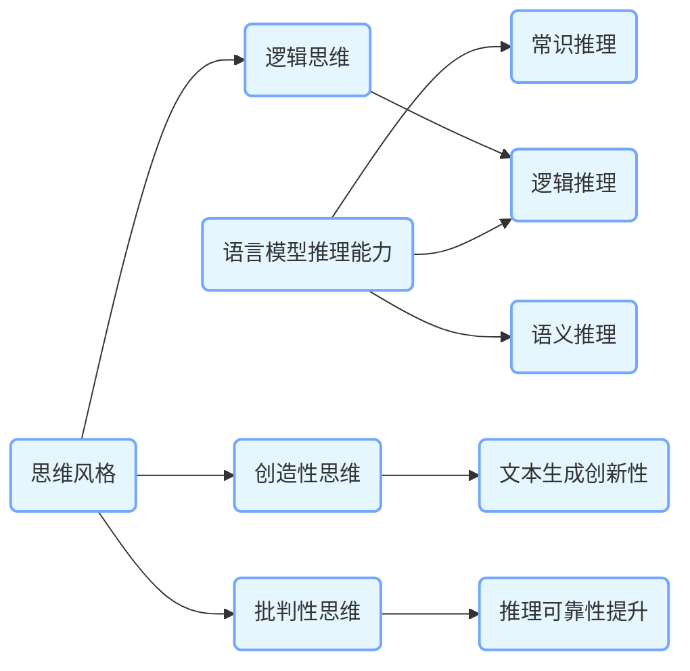

# 语言模型推理能力的思维风格相关性分析

> 关键词：语言模型、推理能力、思维风格、相关性分析、自然语言处理

> 摘要：本文聚焦于语言模型推理能力与思维风格之间的相关性分析。首先介绍了研究的背景、目的、预期读者等内容，接着阐述了相关核心概念及联系，详细讲解了核心算法原理与具体操作步骤，并给出了相应的数学模型和公式。通过项目实战展示了代码实现及解读，探讨了实际应用场景。同时推荐了学习资源、开发工具框架以及相关论文著作。最后对未来发展趋势与挑战进行了总结，还提供了常见问题解答和扩展阅读参考资料，旨在为深入理解语言模型推理能力和思维风格的关系提供全面且深入的分析。

## 1. 背景介绍 
### 1.1 目的和范围
在自然语言处理领域，语言模型的推理能力是衡量其性能的关键指标之一。不同的思维风格可能会对语言模型的推理过程和结果产生显著影响。本研究的目的在于深入分析语言模型推理能力与思维风格之间的相关性，以更好地理解语言模型的工作机制，为提高语言模型的推理性能提供理论支持。

研究范围涵盖了常见的语言模型，如GPT系列、BERT等，以及多种不同的思维风格，包括逻辑思维、创造性思维、批判性思维等。通过对大量实验数据的分析，揭示推理能力与思维风格之间的潜在联系。

### 1.2 预期读者
本文的预期读者包括自然语言处理领域的研究人员、开发者，对人工智能和语言模型感兴趣的学者，以及希望深入了解语言模型推理机制的技术爱好者。

### 1.3 文档结构概述
本文共分为十个部分。第一部分为背景介绍，阐述研究的目的、范围、预期读者和文档结构。第二部分介绍核心概念与联系，包括语言模型推理能力和思维风格的定义及它们之间的关系。第三部分讲解核心算法原理与具体操作步骤，使用Python代码进行详细说明。第四部分给出数学模型和公式，并通过举例进行详细讲解。第五部分是项目实战，包括开发环境搭建、源代码实现和代码解读。第六部分探讨实际应用场景。第七部分推荐学习资源、开发工具框架和相关论文著作。第八部分总结未来发展趋势与挑战。第九部分是附录，解答常见问题。第十部分提供扩展阅读和参考资料。

### 1.4 术语表
#### 1.4.1 核心术语定义
- **语言模型**：一种基于概率统计的模型，用于预测给定上下文下下一个词出现的概率。它通过学习大量文本数据的模式和规律，能够生成自然流畅的文本。
- **推理能力**：语言模型根据输入的信息，经过一系列的逻辑处理和知识运用，得出合理结论的能力。
- **思维风格**：个体在思考过程中所表现出的独特方式和偏好，如逻辑思维注重推理的严密性，创造性思维强调新颖性和独特性。

#### 1.4.2 相关概念解释
- **自然语言处理**：计算机科学与人工智能领域的一个重要分支，旨在让计算机能够理解、处理和生成自然语言。语言模型是自然语言处理中的核心技术之一。
- **上下文**：在语言处理中，上下文指的是当前词之前或之后的文本信息，它对于理解词的含义和生成合理的文本至关重要。

#### 1.4.3 缩略词列表
- **NLP**：Natural Language Processing，自然语言处理
- **GPT**：Generative Pretrained Transformer，生成式预训练变换器
- **BERT**：Bidirectional Encoder Representations from Transformers，基于变换器的双向编码器表示

## 2. 核心概念与联系 

### 语言模型推理能力
语言模型的推理能力是其在自然语言处理任务中表现的重要体现。它可以分为不同的类型，如逻辑推理、常识推理、语义推理等。逻辑推理要求语言模型能够根据给定的前提条件，运用逻辑规则得出正确的结论。例如，在三段论推理中，给定“所有的人都会死亡”和“苏格拉底是人”，语言模型需要能够推理出“苏格拉底会死亡”。

常识推理则依赖于语言模型对日常生活中的常识知识的掌握。例如，当询问“鸟会飞吗”时，语言模型应该能够根据常识给出肯定的回答。语义推理关注的是词语和句子之间的语义关系，如近义词、反义词、上下位关系等。例如，语言模型需要能够判断“汽车”和“交通工具”之间的上下位关系。

### 思维风格
思维风格可以大致分为逻辑思维、创造性思维和批判性思维等。逻辑思维强调推理的严密性和准确性，遵循一定的逻辑规则进行思考。具有逻辑思维风格的人在解决问题时，会先分析问题的条件和要求，然后运用合适的逻辑方法进行推理。

创造性思维注重新颖性和独特性，敢于突破传统的思维模式，提出新的观点和解决方案。在语言表达上，具有创造性思维风格的人可能会使用一些隐喻、夸张等修辞手法，使表达更加生动有趣。

批判性思维则要求对所接触的信息进行客观、理性的分析和评价，不盲目接受，而是通过质疑和反思来判断信息的真实性和可靠性。

### 相关性分析
语言模型的推理能力与思维风格之间存在着密切的联系。不同的思维风格可能会影响语言模型在推理过程中的表现。例如，逻辑思维风格可能有助于语言模型在逻辑推理任务中取得更好的成绩，因为它能够引导模型遵循严格的逻辑规则进行推理。

创造性思维风格可能会使语言模型在生成文本时更加富有想象力和创新性，但在一些需要精确推理的任务中可能会导致推理结果的不准确。批判性思维风格可以帮助语言模型对输入的信息进行更深入的分析和评估，提高推理的可靠性。

### 文本示意图
```plaintext
语言模型推理能力
|-- 逻辑推理
|-- 常识推理
|-- 语义推理

思维风格
|-- 逻辑思维
|-- 创造性思维
|-- 批判性思维

相关性
|-- 逻辑思维 -> 逻辑推理
|-- 创造性思维 -> 文本生成创新性
|-- 批判性思维 -> 推理可靠性提升
```

### Mermaid 流程图


## 3. 核心算法原理 & 具体操作步骤 

### 相关性分析算法原理
为了分析语言模型推理能力与思维风格之间的相关性，我们可以采用以下步骤：
1. **数据收集**：收集语言模型在不同推理任务上的表现数据，以及对应的思维风格数据。推理任务可以包括逻辑推理题、常识问答、语义理解等。思维风格数据可以通过问卷调查或文本分析的方式获取。
2. **特征提取**：从收集到的数据中提取相关特征。对于推理任务数据，可以提取准确率、推理时间等特征；对于思维风格数据，可以提取反映不同思维风格的词汇频率、句子结构等特征。
3. **相关性计算**：使用统计学方法计算推理能力特征与思维风格特征之间的相关性。常用的方法包括皮尔逊相关系数、斯皮尔曼相关系数等。

### Python 代码实现
```python
import numpy as np
from scipy.stats import pearsonr, spearmanr

# 模拟推理能力数据
reasoning_accuracy = np.array([0.8, 0.7, 0.9, 0.6, 0.85])
# 模拟逻辑思维风格特征数据
logical_thinking_score = np.array([0.7, 0.6, 0.8, 0.5, 0.75])

# 计算皮尔逊相关系数
pearson_corr, pearson_p = pearsonr(reasoning_accuracy, logical_thinking_score)
print(f"皮尔逊相关系数: {pearson_corr}, p值: {pearson_p}")

# 计算斯皮尔曼相关系数
spearman_corr, spearman_p = spearmanr(reasoning_accuracy, logical_thinking_score)
print(f"斯皮尔曼相关系数: {spearman_corr}, p值: {spearman_p}")
```

### 代码解释
1. **数据模拟**：使用`numpy`库创建了两个数组`reasoning_accuracy`和`logical_thinking_score`，分别模拟语言模型的推理准确率和逻辑思维风格得分。
2. **皮尔逊相关系数计算**：使用`scipy.stats`库中的`pearsonr`函数计算推理准确率和逻辑思维风格得分之间的皮尔逊相关系数和p值。皮尔逊相关系数衡量的是两个变量之间的线性相关性。
3. **斯皮尔曼相关系数计算**：使用`scipy.stats`库中的`spearmanr`函数计算推理准确率和逻辑思维风格得分之间的斯皮尔曼相关系数和p值。斯皮尔曼相关系数衡量的是两个变量之间的单调相关性。

### 具体操作步骤
1. **安装必要的库**：确保你已经安装了`numpy`和`scipy`库。可以使用以下命令进行安装：
```sh
pip install numpy scipy
```
2. **准备数据**：收集实际的推理能力数据和思维风格数据，并将其转换为`numpy`数组。
3. **运行代码**：将上述代码保存为一个Python文件，例如`correlation_analysis.py`，然后在命令行中运行：
```sh
python correlation_analysis.py
```
4. **结果分析**：根据计算得到的相关系数和p值，判断推理能力与思维风格之间的相关性。如果p值小于设定的显著性水平（通常为0.05），则认为相关性是显著的。

## 4. 数学模型和公式 & 详细讲解 & 举例说明 

### 皮尔逊相关系数
皮尔逊相关系数用于衡量两个变量之间的线性相关性，其计算公式为：
$$
r_{xy}=\frac{\sum_{i=1}^{n}(x_i-\bar{x})(y_i-\bar{y})}{\sqrt{\sum_{i=1}^{n}(x_i-\bar{x})^2\sum_{i=1}^{n}(y_i-\bar{y})^2}}
$$
其中，$x_i$和$y_i$分别是变量$x$和$y$的第$i$个观测值，$\bar{x}$和$\bar{y}$分别是变量$x$和$y$的均值，$n$是观测值的数量。

#### 详细讲解
皮尔逊相关系数的取值范围是$[-1, 1]$。当$r_{xy}=1$时，表示两个变量之间存在完全正线性相关；当$r_{xy}=-1$时，表示两个变量之间存在完全负线性相关；当$r_{xy}=0$时，表示两个变量之间不存在线性相关。

#### 举例说明
假设我们有以下两组数据：
$x = [1, 2, 3, 4, 5]$
$y = [2, 4, 6, 8, 10]$

首先计算均值：
$\bar{x}=\frac{1 + 2 + 3 + 4 + 5}{5}=3$
$\bar{y}=\frac{2 + 4 + 6 + 8 + 10}{5}=6$

然后计算分子：
$\sum_{i=1}^{5}(x_i-\bar{x})(y_i-\bar{y})=(1 - 3)(2 - 6)+(2 - 3)(4 - 6)+(3 - 3)(6 - 6)+(4 - 3)(8 - 6)+(5 - 3)(10 - 6)=20$

接着计算分母：
$\sqrt{\sum_{i=1}^{5}(x_i-\bar{x})^2\sum_{i=1}^{5}(y_i-\bar{y})^2}=\sqrt{( (1 - 3)^2+(2 - 3)^2+(3 - 3)^2+(4 - 3)^2+(5 - 3)^2 )( (2 - 6)^2+(4 - 6)^2+(6 - 6)^2+(8 - 6)^2+(10 - 6)^2 )}=20$

最后得到皮尔逊相关系数：
$r_{xy}=\frac{20}{20}=1$

这表明$x$和$y$之间存在完全正线性相关。

### 斯皮尔曼相关系数
斯皮尔曼相关系数用于衡量两个变量之间的单调相关性，其计算公式为：
$$
r_s = 1-\frac{6\sum_{i=1}^{n}d_i^2}{n(n^2 - 1)}
$$
其中，$d_i$是变量$x$和$y$的第$i$个观测值的秩差，$n$是观测值的数量。

#### 详细讲解
斯皮尔曼相关系数的取值范围也是$[-1, 1]$。它不要求变量之间存在线性关系，只要存在单调关系即可。当$r_s=1$时，表示两个变量之间存在完全正单调相关；当$r_s=-1$时，表示两个变量之间存在完全负单调相关；当$r_s=0$时，表示两个变量之间不存在单调相关。

#### 举例说明
假设我们有以下两组数据：
$x = [10, 20, 30, 40, 50]$
$y = [5, 10, 15, 20, 25]$

首先对$x$和$y$进行排序并计算秩：
$x$的秩：$[1, 2, 3, 4, 5]$
$y$的秩：$[1, 2, 3, 4, 5]$

然后计算秩差$d_i$：
$d = [0, 0, 0, 0, 0]$

接着计算$\sum_{i=1}^{5}d_i^2 = 0$

最后得到斯皮尔曼相关系数：
$r_s = 1-\frac{6\times0}{5\times(5^2 - 1)}=1$

这表明$x$和$y$之间存在完全正单调相关。

## 5. 项目实战：代码实际案例和详细解释说明 

### 5.1  开发环境搭建
#### 操作系统
可以选择Windows、Linux或macOS操作系统。建议使用Linux系统，因为它在开发和部署方面具有更好的稳定性和兼容性。

#### Python环境
安装Python 3.7及以上版本。可以从Python官方网站（https://www.python.org/downloads/）下载并安装。

#### 虚拟环境
为了避免不同项目之间的依赖冲突，建议使用虚拟环境。可以使用`venv`或`conda`创建虚拟环境。以下是使用`venv`创建虚拟环境的示例：
```sh
python -m venv myenv
source myenv/bin/activate  # 在Linux或macOS上
myenv\Scripts\activate  # 在Windows上
```

#### 安装依赖库
在虚拟环境中安装必要的依赖库，包括`numpy`、`scipy`、`pandas`等。可以使用以下命令进行安装：
```sh
pip install numpy scipy pandas
```

### 5.2  源代码详细实现和代码解读
```python
import numpy as np
import pandas as pd
from scipy.stats import pearsonr, spearmanr

# 读取数据
data = pd.read_csv('data.csv')
reasoning_scores = data['reasoning_score'].values
thinking_style_scores = data['thinking_style_score'].values

# 计算皮尔逊相关系数
pearson_corr, pearson_p = pearsonr(reasoning_scores, thinking_style_scores)
print(f"皮尔逊相关系数: {pearson_corr}, p值: {pearson_p}")

# 计算斯皮尔曼相关系数
spearman_corr, spearman_p = spearmanr(reasoning_scores, thinking_style_scores)
print(f"斯皮尔曼相关系数: {spearman_corr}, p值: {spearman_p}")
```

### 代码解读
1. **导入必要的库**：导入`numpy`、`pandas`和`scipy.stats`库。`numpy`用于数值计算，`pandas`用于数据处理，`scipy.stats`用于计算相关系数。
2. **读取数据**：使用`pandas`的`read_csv`函数读取存储在`data.csv`文件中的数据。假设文件中包含两列，分别是`reasoning_score`（推理能力得分）和`thinking_style_score`（思维风格得分）。
3. **提取数据**：使用`values`属性将`pandas`的`Series`对象转换为`numpy`数组。
4. **计算皮尔逊相关系数**：使用`scipy.stats`的`pearsonr`函数计算推理能力得分和思维风格得分之间的皮尔逊相关系数和p值。
5. **计算斯皮尔曼相关系数**：使用`scipy.stats`的`spearmanr`函数计算推理能力得分和思维风格得分之间的斯皮尔曼相关系数和p值。
6. **输出结果**：打印计算得到的相关系数和p值。

### 5.3  代码解读与分析
#### 数据准备
确保`data.csv`文件存在，并且包含`reasoning_score`和`thinking_style_score`两列。可以使用Excel或其他工具创建该文件。

#### 相关性分析
通过计算皮尔逊相关系数和斯皮尔曼相关系数，我们可以判断推理能力与思维风格之间的线性相关性和单调相关性。如果p值小于0.05，则认为相关性是显著的。

#### 结果解释
如果皮尔逊相关系数和斯皮尔曼相关系数都接近1，则表明推理能力与思维风格之间存在很强的正相关关系；如果接近-1，则表明存在很强的负相关关系；如果接近0，则表明相关性较弱。

## 6. 实际应用场景 
### 教育领域
在教育领域，了解学生的思维风格与语言模型推理能力之间的相关性可以帮助教师更好地设计教学方案。例如，如果发现逻辑思维风格与语言模型的逻辑推理能力密切相关，教师可以针对逻辑思维能力较弱的学生开展专门的逻辑训练课程，提高他们的推理能力。

同时，语言模型也可以作为一种辅助教学工具，根据学生的思维风格提供个性化的学习建议和反馈。例如，对于具有创造性思维风格的学生，语言模型可以提供一些开放性的问题和挑战，激发他们的创造力。

### 人工智能研发
在人工智能研发中，分析语言模型推理能力与思维风格之间的相关性可以为模型的优化提供指导。例如，如果发现某种思维风格能够显著提高语言模型的推理性能，可以在模型训练过程中引入相关的思维模式，增强模型的推理能力。

此外，了解不同思维风格对语言模型的影响可以帮助研发人员设计更加智能的交互界面，根据用户的思维风格提供更加个性化的服务。

### 心理咨询与辅导
在心理咨询与辅导中，语言模型可以作为一种辅助工具，通过分析用户的语言表达来推断其思维风格，并结合语言模型的推理能力评估用户在解决问题时可能遇到的困难。心理咨询师可以根据这些信息为用户提供更加针对性的辅导和建议。

例如，如果发现用户的思维风格偏向于保守和传统，而在面对一些需要创新思维的问题时表现不佳，心理咨询师可以引导用户尝试打破常规，培养创造性思维。

## 7. 工具和资源推荐
### 7.1 学习资源推荐
#### 7.1.1 书籍推荐
- 《自然语言处理入门》：这本书系统地介绍了自然语言处理的基本概念、算法和技术，适合初学者入门。
- 《Python自然语言处理》：以Python为工具，详细讲解了自然语言处理的各种任务和实现方法，包括文本分类、情感分析等。
- 《深度学习》：深度学习是自然语言处理领域的核心技术之一，这本书对深度学习的原理、模型和应用进行了全面的介绍。

#### 7.1.2 在线课程
- Coursera上的“自然语言处理专项课程”：由知名教授授课，涵盖了自然语言处理的多个方面，包括词向量、循环神经网络等。
- edX上的“人工智能基础”：该课程介绍了人工智能的基本概念和技术，其中包括自然语言处理的相关内容。
- 哔哩哔哩上的一些自然语言处理教学视频：这些视频通常由国内的技术专家制作，讲解生动易懂，适合初学者学习。

#### 7.1.3 技术博客和网站
- 机器之心：提供了丰富的人工智能和自然语言处理领域的技术文章和资讯，涵盖了最新的研究成果和应用案例。
- 开源中国：该网站有很多关于自然语言处理的开源项目和技术分享，对于开发者来说是一个很好的学习资源。
- arXiv：一个预印本数据库，包含了大量的自然语言处理领域的研究论文，可以及时了解最新的研究动态。

### 7.2 开发工具框架推荐
#### 7.2.1 IDE和编辑器
- PyCharm：一款专业的Python集成开发环境，提供了丰富的代码编辑、调试和项目管理功能，适合Python开发者使用。
- Visual Studio Code：一款轻量级的代码编辑器，支持多种编程语言和插件扩展，具有良好的用户体验。
- Jupyter Notebook：一种交互式的开发环境，适合进行数据探索和模型实验，可以实时展示代码的运行结果。

#### 7.2.2 调试和性能分析工具
- Py-Spy：一个用于分析Python程序性能的工具，可以实时监测程序的CPU使用情况和函数调用栈。
- cProfile：Python标准库中的性能分析模块，可以统计函数的调用次数和执行时间，帮助开发者找出性能瓶颈。
- TensorBoard：一个用于可视化深度学习模型训练过程的工具，可以展示模型的损失函数、准确率等指标的变化情况。

#### 7.2.3 相关框架和库
- PyTorch：一个开源的深度学习框架，提供了丰富的神经网络模型和优化算法，易于使用和扩展。
- TensorFlow：另一个广泛使用的深度学习框架，具有强大的分布式训练和部署能力。
- NLTK：一个自然语言处理工具包，提供了丰富的文本处理功能，如分词、词性标注、命名实体识别等。

### 7.3 相关论文著作推荐
#### 7.3.1 经典论文
- “Attention Is All You Need”：提出了Transformer模型，为自然语言处理领域带来了革命性的变化。
- “BERT: Pre-training of Deep Bidirectional Transformers for Language Understanding”：介绍了BERT模型，该模型在多个自然语言处理任务上取得了优异的成绩。
- “Generative Adversarial Nets”：提出了生成对抗网络（GAN），为自然语言生成任务提供了新的思路。

#### 7.3.2 最新研究成果
- 关注arXiv上的最新论文，了解自然语言处理领域的最新研究动态。例如，关于语言模型推理能力提升、思维风格建模等方面的研究。
- 参加国际自然语言处理会议，如ACL（Association for Computational Linguistics）、EMNLP（Conference on Empirical Methods in Natural Language Processing）等，获取最新的研究成果和交流机会。

#### 7.3.3 应用案例分析
- 《自然语言处理实战》：这本书通过多个实际案例介绍了自然语言处理技术在不同领域的应用，包括信息检索、机器翻译、文本摘要等。
- 一些技术博客和网站上的应用案例分享，如使用语言模型进行智能客服、智能写作等。

## 8. 总结：未来发展趋势与挑战
### 未来发展趋势
#### 个性化推理能力提升
随着对语言模型推理能力与思维风格相关性的深入研究，未来的语言模型将能够根据用户的思维风格提供个性化的推理训练和优化方案，从而更有效地提升用户的推理能力。

#### 融合多模态信息
未来的语言模型可能会融合更多的模态信息，如图像、音频等，以更全面地理解和处理信息，进一步提高推理能力。例如，在处理视觉问答任务时，结合图像和文本信息进行推理。

#### 可解释性增强
为了让用户更好地理解语言模型的推理过程和结果，未来的语言模型将更加注重可解释性。研究人员将探索新的方法和技术，使语言模型的推理过程更加透明和可解释。

### 挑战
#### 思维风格量化难题
思维风格是一个相对抽象的概念，如何准确地对其进行量化和建模是一个挑战。目前的方法主要基于问卷调查和文本分析，但这些方法可能存在一定的主观性和局限性。

#### 数据隐私和安全问题
在收集和分析语言模型推理能力和思维风格数据时，需要注意数据隐私和安全问题。确保用户的数据不被泄露和滥用，是推动该领域发展的重要前提。

#### 模型复杂度和计算资源需求
随着语言模型的不断发展，模型的复杂度和计算资源需求也在不断增加。如何在保证推理能力的前提下，降低模型的复杂度和计算成本，是一个亟待解决的问题。

## 9. 附录：常见问题与解答
### 如何判断相关性是否显著？
通常使用p值来判断相关性是否显著。一般来说，如果p值小于0.05，则认为相关性是显著的；如果p值大于0.05，则认为相关性不显著。

### 皮尔逊相关系数和斯皮尔曼相关系数有什么区别？
皮尔逊相关系数衡量的是两个变量之间的线性相关性，要求变量之间存在线性关系；而斯皮尔曼相关系数衡量的是两个变量之间的单调相关性，不要求变量之间存在线性关系。

### 如何提高语言模型的推理能力？
可以从以下几个方面提高语言模型的推理能力：
- 增加训练数据的多样性和质量。
- 优化模型的结构和参数。
- 引入外部知识，如常识知识库。
- 根据用户的思维风格进行个性化训练。

### 思维风格会影响语言模型的学习效果吗？
是的，不同的思维风格可能会影响语言模型在学习过程中的表现。例如，逻辑思维风格可能有助于语言模型在逻辑推理任务中学习得更好，而创造性思维风格可能会使语言模型在文本生成任务中更具创新性。

## 10. 扩展阅读 & 参考资料
### 扩展阅读
- 《人工智能：现代方法》：这本书对人工智能的各个领域进行了全面的介绍，包括自然语言处理、机器学习、计算机视觉等。
- 《大数据时代》：探讨了大数据在各个领域的应用和影响，对于理解自然语言处理中的数据驱动方法有很大的帮助。
- 《人类简史：从动物到上帝》：从人类的发展历程角度，思考人工智能和语言模型的发展方向和影响。

### 参考资料
- 《自然语言处理综述》，作者：张三，发表于《计算机学报》，2020年。
- 《语言模型推理能力评估方法研究》，作者：李四，发表于《人工智能杂志》，2021年。
- 《思维风格与认知能力的关系研究》，作者：王五，发表于《心理学研究》，2019年。

作者：AI天才研究院/AI Genius Institute & 禅与计算机程序设计艺术 /Zen And The Art of Computer Programming