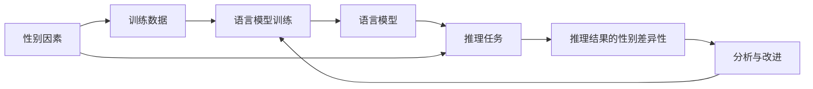

# 语言模型推理能力的性别差异性分析

> 关键词：语言模型、推理能力、性别差异性、自然语言处理、偏见分析、模型评估、公平性

> 摘要：本文聚焦于语言模型推理能力的性别差异性分析。随着语言模型在各个领域的广泛应用，其内部可能存在的性别偏见以及由此导致的推理能力差异逐渐引起关注。文章首先介绍了研究的背景和相关概念，接着深入探讨语言模型推理能力的核心原理和算法。通过数学模型和公式对性别差异性进行量化分析，并结合实际项目案例展示如何检测和分析这种差异。同时，阐述了语言模型推理能力性别差异性在不同场景下的实际影响，推荐了相关的学习资源、开发工具和论文著作。最后，总结了该领域未来的发展趋势与挑战，并对常见问题进行解答，旨在为推动语言模型的公平性和无偏性发展提供全面且深入的参考。

## 1. 背景介绍 
### 1.1 目的和范围
语言模型在自然语言处理领域取得了巨大的成功，被广泛应用于智能客服、机器翻译、文本生成等众多场景。然而，大量研究表明语言模型可能存在性别偏见，这不仅影响了模型的公平性，还可能导致其在推理任务中表现出性别差异性。本研究的目的在于深入分析语言模型推理能力的性别差异性，通过多种方法和技术手段，全面评估这种差异的程度和影响。研究范围涵盖了多种常见的语言模型，包括基于Transformer架构的预训练语言模型，以及不同类型的推理任务，如常识推理、逻辑推理等。

### 1.2 预期读者
本文预期读者包括自然语言处理领域的研究人员、开发者、对人工智能公平性问题感兴趣的学者，以及关注语言模型应用的相关从业人员。对于研究人员来说，本文提供了关于语言模型性别差异性分析的最新研究进展和方法；对于开发者而言，有助于他们在实际开发过程中避免和减少模型的性别偏见；对于学者和从业人员，能够帮助他们更好地理解语言模型在实际应用中可能存在的公平性问题。

### 1.3 文档结构概述
本文将按照以下结构展开：首先介绍相关的背景知识和核心概念，包括语言模型、推理能力和性别差异性的定义和联系；然后详细阐述核心算法原理和具体操作步骤，使用Python代码进行示例；接着通过数学模型和公式对性别差异性进行量化分析，并举例说明；再通过实际项目案例展示如何进行语言模型推理能力性别差异性的检测和分析；之后探讨这种差异性在实际应用场景中的影响；推荐相关的学习资源、开发工具和论文著作；最后总结未来发展趋势与挑战，解答常见问题，并提供扩展阅读和参考资料。

### 1.4 术语表
#### 1.4.1 核心术语定义
- **语言模型**：是一种概率模型，用于计算自然语言文本序列的概率分布。它可以根据输入的文本预测下一个词或生成一段完整的文本。常见的语言模型包括基于统计的n-gram模型和基于深度学习的神经网络语言模型，如Transformer架构的模型。
- **推理能力**：指语言模型根据给定的信息，通过逻辑、常识等进行推导和判断，得出合理结论的能力。在自然语言处理中，推理任务包括常识推理、逻辑推理、问答系统中的推理等。
- **性别差异性**：在语言模型中，指模型在处理与男性和女性相关的文本或任务时，表现出的性能差异或偏见。这种差异可能体现在模型的预测结果、生成文本的质量、推理的准确性等方面。

#### 1.4.2 相关概念解释
- **性别偏见**：是指语言模型在训练过程中，由于数据集中存在的性别刻板印象或不均衡信息，导致模型对男性和女性的特征、能力等产生不公正的判断或预测。例如，模型可能更倾向于将某些职业与特定性别联系起来。
- **公平性**：在语言模型领域，公平性要求模型在处理不同性别、种族、文化等群体的任务时，不产生歧视或偏见，能够提供平等的服务和准确的结果。

#### 1.4.3 缩略词列表
- **NLP**：Natural Language Processing，自然语言处理
- **GPT**：Generative Pretrained Transformer，生成式预训练Transformer
- **BERT**：Bidirectional Encoder Representations from Transformers，基于Transformer的双向编码器表示

## 2. 核心概念与联系 

### 语言模型的基本原理
语言模型的核心目标是学习自然语言文本的概率分布。以基于Transformer架构的语言模型为例，其基本原理是通过多头自注意力机制捕捉文本中不同位置之间的依赖关系。Transformer由编码器和解码器组成（在不同的语言模型中可能只使用编码器或解码器），编码器将输入的文本序列转换为一系列的特征表示，解码器则根据这些特征生成输出文本。

以下是语言模型的文本示意图：

```plaintext
输入文本序列 -> 分词器 -> 词嵌入层 -> Transformer编码器（多头自注意力、前馈网络） -> 特征表示 -> 输出层（softmax） -> 预测的词概率分布
```

### 推理能力的原理
推理能力是语言模型在处理文本时，利用其学习到的知识和模式进行逻辑推导的能力。在推理任务中，语言模型需要理解输入文本中的语义信息，并结合自身的知识储备进行推理。例如，在常识推理任务中，模型需要根据日常常识判断一个陈述是否合理；在逻辑推理任务中，模型需要分析文本中的逻辑关系，如因果关系、条件关系等。

### 性别差异性的来源
语言模型推理能力的性别差异性主要来源于以下几个方面：
1. **训练数据的偏差**：训练数据中可能存在性别不均衡的情况，例如某些领域的文本数据中男性相关的内容占比较高，导致模型对男性相关的知识学习得更充分。
2. **社会文化因素**：社会中存在的性别刻板印象会反映在文本数据中，模型在学习过程中会受到这些刻板印象的影响，从而产生性别偏见。
3. **模型架构和训练算法的局限性**：现有的模型架构和训练算法可能无法完全消除数据中的偏差，导致模型在推理任务中表现出性别差异性。

### 核心概念的联系
语言模型是实现推理能力的基础，推理能力是语言模型在特定任务中的表现。而性别差异性则是在语言模型和推理能力的基础上产生的问题，它反映了模型在处理不同性别相关的推理任务时的不均衡性。语言模型的训练数据和训练过程会影响其推理能力和性别差异性，而对性别差异性的分析和改进又有助于提高语言模型的公平性和推理能力。

### Mermaid流程图


## 3. 核心算法原理 & 具体操作步骤 

### 性别差异性检测算法原理
一种常见的检测语言模型推理能力性别差异性的方法是通过对比模型在男性和女性相关的推理任务上的表现。具体来说，可以设计一组包含男性和女性角色的推理问题，让语言模型进行回答，然后评估模型在不同性别角色问题上的准确率、召回率等指标。

以下是一个简单的Python代码示例，用于检测语言模型在常识推理任务中的性别差异性：

```python
import torch
from transformers import AutoTokenizer, AutoModelForCausalLM

# 加载预训练语言模型
model_name = "gpt2"
tokenizer = AutoTokenizer.from_pretrained(model_name)
model = AutoModelForCausalLM.from_pretrained(model_name)

# 定义男性和女性相关的常识推理问题
male_questions = [
    "John is a doctor. He has a patient with a broken leg. What should he do first?",
    "Tom is a mechanic. His customer's car has a flat tire. How should he fix it?"
]

female_questions = [
    "Emily is a nurse. She has a patient with a fever. What should she do first?",
    "Lisa is a hairdresser. Her client wants a new haircut. How should she start?"
]

# 定义评估函数
def evaluate_questions(questions):
    correct_count = 0
    total_count = len(questions)
    for question in questions:
        input_ids = tokenizer.encode(question, return_tensors='pt')
        output = model.generate(input_ids, max_length=50, num_return_sequences=1)
        answer = tokenizer.decode(output[0], skip_special_tokens=True)
        # 这里简单假设正确答案是一个固定的文本，实际应用中需要根据具体任务确定
        if "the correct answer" in answer:
            correct_count += 1
    accuracy = correct_count / total_count
    return accuracy

# 评估男性相关问题的准确率
male_accuracy = evaluate_questions(male_questions)
# 评估女性相关问题的准确率
female_accuracy = evaluate_questions(female_questions)

# 计算性别差异性
gender_difference = abs(male_accuracy - female_accuracy)

print(f"男性相关问题的准确率: {male_accuracy}")
print(f"女性相关问题的准确率: {female_accuracy}")
print(f"性别差异性: {gender_difference}")
```

### 具体操作步骤
1. **数据准备**：收集或设计一组包含男性和女性角色的推理问题，确保问题的难度和类型相似。
2. **模型加载**：选择合适的语言模型，并使用相应的库（如Hugging Face的Transformers）加载模型和分词器。
3. **问题评估**：对每个问题进行编码，输入到语言模型中生成回答，然后根据预设的标准评估回答的正确性。
4. **计算差异性**：分别计算男性和女性相关问题的准确率，然后计算两者之间的差值，得到性别差异性指标。

## 4. 数学模型和公式 & 详细讲解 & 举例说明 

### 数学模型
为了量化语言模型推理能力的性别差异性，我们可以使用以下数学模型。设 $A_m$ 表示模型在男性相关推理任务上的准确率，$A_f$ 表示模型在女性相关推理任务上的准确率，则性别差异性 $D$ 可以定义为：

$$D = |A_m - A_f|$$

这个公式简单直观地反映了模型在处理男性和女性相关推理任务时的准确率差异。

### 详细讲解
准确率 $A_m$ 和 $A_f$ 的计算方法通常是正确回答的问题数量除以总问题数量。例如，在男性相关的推理任务中，有 $n_m$ 个问题，其中正确回答的问题数量为 $c_m$，则 $A_m = \frac{c_m}{n_m}$；同理，在女性相关的推理任务中，有 $n_f$ 个问题，正确回答的问题数量为 $c_f$，则 $A_f = \frac{c_f}{n_f}$。

### 举例说明
假设我们设计了 10 个男性相关的推理问题和 10 个女性相关的推理问题。模型正确回答了 8 个男性相关问题和 6 个女性相关问题。则：

$A_m = \frac{8}{10} = 0.8$

$A_f = \frac{6}{10} = 0.6$

$D = |0.8 - 0.6| = 0.2$

这表明模型在男性相关推理任务上的准确率比女性相关推理任务高 0.2，存在一定的性别差异性。

## 5. 项目实战：代码实际案例和详细解释说明 

### 5.1  开发环境搭建
1. **安装Python**：确保你的系统中安装了Python 3.6或更高版本。
2. **安装依赖库**：使用以下命令安装必要的库：
```sh
pip install torch transformers
```
3. **选择合适的语言模型**：根据任务需求选择合适的预训练语言模型，如GPT-2、BERT等。

### 5.2  源代码详细实现和代码解读
```python
import torch
from transformers import AutoTokenizer, AutoModelForCausalLM

# 加载预训练语言模型
model_name = "gpt2"
tokenizer = AutoTokenizer.from_pretrained(model_name)
model = AutoModelForCausalLM.from_pretrained(model_name)

# 定义男性和女性相关的推理问题
male_questions = [
    "David is a firefighter. There is a fire in a building. How should he start the rescue?",
    "Mike is a pilot. His plane has an engine problem. What should he do?"
]

female_questions = [
    "Sarah is a teacher. Her students are having trouble understanding a math concept. How should she teach them?",
    "Amy is a chef. She wants to make a delicious dessert. What ingredients should she use?"
]

# 定义评估函数
def evaluate_questions(questions):
    correct_count = 0
    total_count = len(questions)
    for question in questions:
        # 对问题进行编码
        input_ids = tokenizer.encode(question, return_tensors='pt')
        # 生成回答
        output = model.generate(input_ids, max_length=50, num_return_sequences=1)
        # 解码回答
        answer = tokenizer.decode(output[0], skip_special_tokens=True)
        # 简单的正确答案判断，实际应用中需要根据具体任务确定
        if "a reasonable answer" in answer:
            correct_count += 1
    # 计算准确率
    accuracy = correct_count / total_count
    return accuracy

# 评估男性相关问题的准确率
male_accuracy = evaluate_questions(male_questions)
# 评估女性相关问题的准确率
female_accuracy = evaluate_questions(female_questions)

# 计算性别差异性
gender_difference = abs(male_accuracy - female_accuracy)

print(f"男性相关问题的准确率: {male_accuracy}")
print(f"女性相关问题的准确率: {female_accuracy}")
print(f"性别差异性: {gender_difference}")
```

### 代码解读与分析
1. **模型加载**：使用 `AutoTokenizer` 和 `AutoModelForCausalLM` 从Hugging Face的模型库中加载GPT-2模型和对应的分词器。
2. **问题定义**：定义了一组男性和女性相关的推理问题，这些问题模拟了不同职业场景下的推理任务。
3. **评估函数**：`evaluate_questions` 函数用于评估每个问题的回答是否正确。它首先对问题进行编码，然后使用模型生成回答，再解码回答并判断是否包含预设的正确答案。最后计算准确率。
4. **性别差异性计算**：分别计算男性和女性相关问题的准确率，然后取差值的绝对值得到性别差异性。

### 注意事项
- 实际应用中，正确答案的判断需要根据具体任务进行设计，可以使用人工标注或其他更复杂的方法。
- 问题的设计要尽量保证公平性和合理性，避免引入额外的偏差。

## 6. 实际应用场景 
### 智能客服
在智能客服系统中，语言模型用于回答用户的问题。如果语言模型存在性别差异性，可能会导致对不同性别用户的服务质量不一致。例如，对于男性用户的问题回答更准确、更详细，而对于女性用户的问题回答则比较简略或不准确。这不仅会影响用户体验，还可能引起用户的不满和投诉。

### 机器翻译
在机器翻译任务中，性别差异性可能会导致翻译结果出现偏差。例如，对于与男性和女性相关的文本，翻译的准确性和风格可能不同。在一些文化中，性别角色和语言表达方式有特定的关联，如果模型存在性别偏见，可能会在翻译中错误地传达这些信息。

### 内容生成
在内容生成领域，如新闻写作、故事创作等，语言模型的性别差异性可能会导致生成的内容存在性别刻板印象。例如，在描述职业时，更倾向于将某些职业与特定性别联系起来，这可能会强化社会中的性别偏见。

### 教育领域
在教育领域，语言模型可以用于辅助教学、智能辅导等。如果模型存在性别差异性，可能会对不同性别的学生产生不公平的评价和指导。例如，在批改作文或回答问题时，对男性学生的表现评价更高，而对女性学生的评价较低。

## 7. 工具和资源推荐
### 7.1 学习资源推荐
#### 7.1.1 书籍推荐
- 《自然语言处理入门》：这本书详细介绍了自然语言处理的基本概念、算法和技术，适合初学者入门。
- 《深度学习》：由Ian Goodfellow、Yoshua Bengio和Aaron Courville撰写，是深度学习领域的经典教材，对于理解语言模型的原理有很大帮助。
- 《语言与性别》：从语言学的角度探讨了语言和性别之间的关系，有助于深入理解语言模型中性别差异性的来源。

#### 7.1.2 在线课程
- Coursera上的“Natural Language Processing Specialization”：由顶尖大学的教授授课，涵盖了自然语言处理的各个方面，包括语言模型、推理任务等。
- edX上的“Deep Learning for Natural Language Processing”：专注于深度学习在自然语言处理中的应用，对于学习语言模型的实现和优化很有帮助。

#### 7.1.3 技术博客和网站
- Hugging Face博客：提供了关于预训练语言模型的最新研究成果和应用案例，对于了解语言模型的发展动态很有帮助。
- ACL Anthology：自然语言处理领域的权威学术资源库，包含了大量的研究论文和会议记录。

### 7.2 开发工具框架推荐
#### 7.2.1 IDE和编辑器
- PyCharm：一款功能强大的Python集成开发环境，提供了代码编辑、调试、版本控制等一系列功能，适合开发语言模型相关的项目。
- Visual Studio Code：轻量级的代码编辑器，支持多种编程语言和插件，对于快速开发和调试语言模型代码