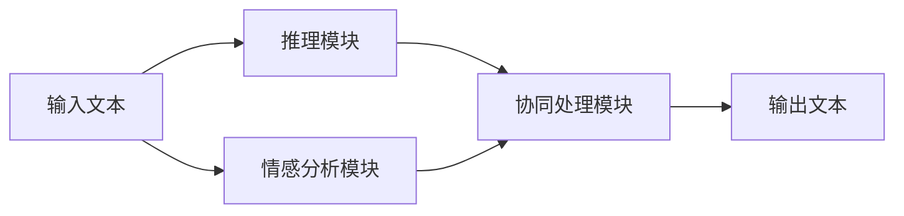

# 语言模型推理能力的情感智能协同效应研究

> 关键词：语言模型、推理能力、情感智能、协同效应、自然语言处理

> 摘要：本文聚焦于语言模型推理能力与情感智能的协同效应。在自然语言处理技术飞速发展的当下，语言模型不仅需要具备强大的推理能力以理解和生成合理的文本，还应拥有情感智能来感知和处理文本中的情感信息。文章首先介绍了研究的背景、目的和范围，详细阐述了相关核心概念及其联系，接着深入探讨了核心算法原理、数学模型和公式，并结合具体的项目实战案例进行分析。同时，还介绍了该领域的实际应用场景、相关工具和资源，最后对未来发展趋势与挑战进行了总结，并给出了常见问题的解答和扩展阅读参考资料，旨在全面剖析语言模型推理能力和情感智能的协同机制，为相关研究和应用提供有益的指导。

## 1. 背景介绍 
### 1.1 目的和范围
在自然语言处理领域，语言模型的发展取得了显著的成果。早期的语言模型主要关注语法和语义的处理，以生成流畅和合理的文本。然而，随着应用场景的不断拓展，如智能客服、情感分析、对话系统等，仅具备推理能力的语言模型已无法满足需求，情感智能的融入变得至关重要。

本研究的目的在于深入探究语言模型推理能力与情感智能之间的协同效应。具体范围包括分析两者的相互作用机制、研究如何通过协同提升语言模型的性能、探索在不同应用场景下的最佳协同策略等。通过本研究，期望为语言模型的进一步发展提供理论支持和实践指导，推动自然语言处理技术在更多领域的应用。

### 1.2 预期读者
本文的预期读者包括自然语言处理领域的研究人员、开发者、对人工智能技术感兴趣的学者以及相关企业的技术人员。对于研究人员，本文提供了关于语言模型推理能力和情感智能协同效应的前沿研究视角和理论分析；对于开发者，文中包含的算法原理、代码实现和项目实战案例将有助于他们在实际项目中应用和优化相关技术；对于学者和企业技术人员，本文可以帮助他们了解该领域的发展趋势和应用前景，为决策和创新提供参考。

### 1.3 文档结构概述
本文共分为十个部分。第一部分为背景介绍，阐述了研究的目的、范围、预期读者和文档结构；第二部分介绍核心概念与联系，包括语言模型推理能力、情感智能的定义、原理和架构，并通过示意图和流程图进行展示；第三部分详细讲解核心算法原理和具体操作步骤，结合Python源代码进行说明；第四部分介绍数学模型和公式，并通过举例进行详细讲解；第五部分是项目实战，包括开发环境搭建、源代码实现和代码解读；第六部分探讨实际应用场景；第七部分推荐相关的工具和资源，包括学习资源、开发工具框架和论文著作；第八部分总结未来发展趋势与挑战；第九部分是附录，解答常见问题；第十部分提供扩展阅读和参考资料。

### 1.4 术语表
#### 1.4.1 核心术语定义
- **语言模型推理能力**：指语言模型根据输入的文本信息，运用逻辑、知识和上下文理解，生成合理输出的能力。它包括语义推理、逻辑推理、常识推理等多个方面，旨在使语言模型能够准确理解问题并给出恰当的回答。
- **情感智能**：在自然语言处理中，情感智能是指语言模型能够识别、理解和处理文本中所包含的情感信息的能力。它可以判断文本的情感极性（如积极、消极、中性），还能识别更复杂的情感类型（如喜悦、悲伤、愤怒等）。
- **协同效应**：指语言模型的推理能力和情感智能相互作用、相互促进，产生比各自单独作用更大的效果。通过协同，语言模型能够在推理过程中更好地考虑情感因素，同时在情感分析中利用推理能力提高准确性。

#### 1.4.2 相关概念解释
- **自然语言处理（NLP）**：是人工智能的一个重要分支，旨在让计算机能够理解、处理和生成人类语言。它涉及多个任务，如文本分类、情感分析、机器翻译、问答系统等。
- **深度学习**：是一种基于人工神经网络的机器学习方法，在自然语言处理中得到了广泛应用。深度学习模型可以自动从大量数据中学习特征和模式，从而实现对自然语言的有效处理。
- **预训练模型**：是指在大规模语料库上进行无监督学习训练得到的模型。这些模型学习了丰富的语言知识和模式，可以作为基础模型，通过微调应用于各种具体的自然语言处理任务。

#### 1.4.3 缩略词列表
- **NLP**：Natural Language Processing（自然语言处理）
- **RNN**：Recurrent Neural Network（循环神经网络）
- **LSTM**：Long Short - Term Memory（长短期记忆网络）
- **GRU**：Gated Recurrent Unit（门控循环单元）
- **Transformer**：一种基于注意力机制的深度学习模型架构
- **BERT**：Bidirectional Encoder Representations from Transformers（基于Transformer的双向编码器表示）

## 2. 核心概念与联系 
### 2.1 语言模型推理能力原理和架构
语言模型推理能力的核心在于理解输入文本的语义和逻辑关系，并根据这些信息生成合理的输出。传统的语言模型基于统计方法，通过计算词与词之间的概率分布来生成文本。然而，随着深度学习的发展，基于神经网络的语言模型逐渐成为主流。

以Transformer架构为例，它采用了多头注意力机制，能够捕捉文本中不同位置之间的依赖关系。其架构主要包括输入层、编码器和解码器。输入层将文本转换为向量表示，编码器对输入进行特征提取和编码，解码器根据编码信息生成输出文本。

下面是Transformer架构的Mermaid流程图：


### 2.2 情感智能原理和架构
情感智能的实现主要通过情感分析技术。常见的方法包括基于词典的方法、机器学习方法和深度学习方法。基于词典的方法通过预先定义的情感词典，对文本中的词语进行情感极性判断，然后综合计算文本的情感倾向。机器学习方法则通过训练分类器，将文本分为不同的情感类别。深度学习方法，如卷积神经网络（CNN）和循环神经网络（RNN）及其变体（LSTM、GRU），可以自动从文本中学习情感特征。

以基于深度学习的情感分析架构为例，其一般包括输入层、特征提取层和分类层。输入层将文本转换为向量表示，特征提取层提取文本的情感特征，分类层根据特征判断文本的情感类别。

下面是基于深度学习的情感分析架构的Mermaid流程图：


### 2.3 推理能力与情感智能的联系
语言模型的推理能力和情感智能之间存在着密切的联系。一方面，推理能力可以帮助情感智能更准确地理解文本的上下文和语义，从而提高情感分析的准确性。例如，在某些文本中，词语的情感极性可能会受到上下文的影响，通过推理能力可以更好地判断其真实的情感含义。另一方面，情感智能可以为推理过程提供额外的信息，使语言模型在生成输出时考虑到情感因素，生成更符合用户情感需求的文本。例如，在智能客服系统中，根据用户的情感状态，语言模型可以调整回复的语气和内容，提供更贴心的服务。

下面是推理能力与情感智能协同的Mermaid流程图：


## 3. 核心算法原理 & 具体操作步骤 
### 3.1 情感分析的核心算法：基于BERT的情感分类
BERT是一种预训练的语言模型，它通过在大规模语料库上进行无监督学习，学习到了丰富的语言知识和语义表示。在情感分析任务中，可以使用BERT作为基础模型，通过微调来实现情感分类。

#### 算法原理
BERT模型的输入是一个文本序列，经过多层Transformer编码器的处理后，输出每个位置的向量表示。在情感分类任务中，通常取第一个位置（[CLS]标记）的向量表示作为整个文本的特征表示，然后将其输入到一个全连接层进行分类。

#### 具体操作步骤
1. **数据预处理**：将文本数据进行分词处理，并转换为BERT模型所需的输入格式，包括词索引、注意力掩码和段索引。
2. **加载预训练的BERT模型**：从预训练模型库中加载BERT模型的权重。
3. **添加分类层**：在BERT模型的基础上添加一个全连接层，用于进行情感分类。
4. **微调模型**：使用标注好的情感分类数据集对模型进行微调，更新模型的参数。
5. **模型评估**：使用测试数据集对微调后的模型进行评估，计算准确率、召回率等指标。

#### Python源代码实现
```python
import torch
from torch.utils.data import Dataset, DataLoader
from transformers import BertTokenizer, BertForSequenceClassification, AdamW
from sklearn.model_selection import train_test_split
import pandas as pd

# 定义数据集类
class SentimentDataset(Dataset):
    def __init__(self, texts, labels, tokenizer, max_length):
        self.texts = texts
        self.labels = labels
        self.tokenizer = tokenizer
        self.max_length = max_length

    def __len__(self):
        return len(self.texts)

    def __getitem__(self, idx):
        text = str(self.texts[idx])
        label = self.labels[idx]
        encoding = self.tokenizer.encode_plus(
            text,
            add_special_tokens=True,
            max_length=self.max_length,
            padding='max_length',
            truncation=True,
            return_tensors='pt'
        )
        return {
            'input_ids': encoding['input_ids'].flatten(),
            'attention_mask': encoding['attention_mask'].flatten(),
            'labels': torch.tensor(label, dtype=torch.long)
        }

# 数据加载和预处理
def load_data(file_path):
    data = pd.read_csv(file_path)
    texts = data['text'].tolist()
    labels = data['label'].tolist()
    return texts, labels

# 训练模型
def train_model(model, train_dataloader, optimizer, device, epochs):
    model.train()
    for epoch in range(epochs):
        total_loss = 0
        for batch in train_dataloader:
            input_ids = batch['input_ids'].to(device)
            attention_mask = batch['attention_mask'].to(device)
            labels = batch['labels'].to(device)

            optimizer.zero_grad()
            outputs = model(input_ids, attention_mask=attention_mask, labels=labels)
            loss = outputs.loss
            total_loss += loss.item()
            loss.backward()
            optimizer.step()
        print(f'Epoch {epoch + 1}, Loss: {total_loss / len(train_dataloader)}')

# 评估模型
def evaluate_model(model, test_dataloader, device):
    model.eval()
    correct = 0
    total = 0
    with torch.no_grad():
        for batch in test_dataloader:
            input_ids = batch['input_ids'].to(device)
            attention_mask = batch['attention_mask'].to(device)
            labels = batch['labels'].to(device)

            outputs = model(input_ids, attention_mask=attention_mask)
            logits = outputs.logits
            predictions = torch.argmax(logits, dim=1)
            correct += (predictions == labels).sum().item()
            total += labels.size(0)
    accuracy = correct / total
    print(f'Accuracy: {accuracy}')

# 主函数
def main():
    file_path = 'sentiment_data.csv'
    texts, labels = load_data(file_path)
    train_texts, test_texts, train_labels, test_labels = train_test_split(texts, labels, test_size=0.2, random_state=42)

    tokenizer = BertTokenizer.from_pretrained('bert-base-uncased')
    max_length = 128
    train_dataset = SentimentDataset(train_texts, train_labels, tokenizer, max_length)
    test_dataset = SentimentDataset(test_texts, test_labels, tokenizer, max_length)

    train_dataloader = DataLoader(train_dataset, batch_size=16, shuffle=True)
    test_dataloader = DataLoader(test_dataset, batch_size=16, shuffle=False)

    device = torch.device('cuda' if torch.cuda.is_available() else 'cpu')
    model = BertForSequenceClassification.from_pretrained('bert-base-uncased', num_labels=2)
    model.to(device)

    optimizer = AdamW(model.parameters(), lr=2e-5)
    epochs = 3
    train_model(model, train_dataloader, optimizer, device, epochs)
    evaluate_model(model, test_dataloader, device)

if __name__ == '__main__':
    main()
```

### 3.2 推理能力与情感智能协同的算法
#### 算法原理
在推理过程中，将情感分析的结果作为额外的信息输入到推理模块中。推理模块在生成输出时，会根据情感信息调整输出的内容和语气。例如，如果输入文本的情感为积极，推理模块可以生成更热情、鼓励的回复；如果情感为消极，则生成更安慰、理解的回复。

#### 具体操作步骤
1. **输入文本处理**：对输入文本进行分词和编码处理，同时进行情感分析，得到文本的情感类别。
2. **推理模块处理**：将编码后的文本和情感类别作为输入，传入推理模块。推理模块根据这些信息生成初步的推理结果。
3. **情感调整**：根据情感类别对初步的推理结果进行调整，生成最终的输出文本。

#### Python源代码实现
```python
import torch
from transformers import AutoTokenizer, AutoModelForCausalLM

# 加载推理模型和分词器
tokenizer = AutoTokenizer.from_pretrained('gpt2')
model = AutoModelForCausalLM.from_pretrained('gpt2')

# 情感分析函数（这里简单模拟）
def sentiment_analysis(text):
    if 'good' in text or 'great' in text:
        return 'positive'
    elif 'bad' in text or 'terrible' in text:
        return 'negative'
    else:
        return 'neutral'

# 推理和情感调整函数
def generate_response(input_text):
    sentiment = sentiment_analysis(input_text)
    input_ids = tokenizer.encode(input_text, return_tensors='pt')
    output = model.generate(input_ids)
    response = tokenizer.decode(output[0], skip_special_tokens=True)

    if sentiment == 'positive':
        adjusted_response = 'Great! ' + response
    elif sentiment == 'negative':
        adjusted_response = 'I\'m sorry to hear that. ' + response
    else:
        adjusted_response = response

    return adjusted_response

# 测试
input_text = 'This is a great movie!'
response = generate_response(input_text)
print(response)
```

## 4. 数学模型和公式 & 详细讲解 & 举例说明 
### 4.1 情感分析的数学模型：Softmax分类器
在情感分析中，通常使用Softmax分类器将文本分为不同的情感类别。Softmax函数将模型的输出转换为概率分布，表示文本属于每个类别的概率。

#### 数学公式
假设模型的输出为一个向量 $\mathbf{z} = [z_1, z_2, \cdots, z_k]$，其中 $k$ 是情感类别的数量。Softmax函数的定义如下：

$$
\sigma(\mathbf{z})_j = \frac{e^{z_j}}{\sum_{i=1}^{k} e^{z_i}} \quad \text{for } j = 1, 2, \cdots, k
$$

其中，$\sigma(\mathbf{z})_j$ 表示文本属于第 $j$ 类的概率。

#### 详细讲解
Softmax函数的作用是将模型的输出转换为概率分布，使得所有类别的概率之和为1。通过比较每个类别的概率大小，可以确定文本最可能属于的类别。

#### 举例说明
假设模型的输出为 $\mathbf{z} = [2, 1, 0]$，表示文本属于三个不同情感类别的得分。使用Softmax函数计算每个类别的概率：

$$
\sigma(\mathbf{z})_1 = \frac{e^{2}}{e^{2} + e^{1} + e^{0}} \approx 0.67
$$

$$
\sigma(\mathbf{z})_2 = \frac{e^{1}}{e^{2} + e^{1} + e^{0}} \approx 0.24
$$

$$
\sigma(\mathbf{z})_3 = \frac{e^{0}}{e^{2} + e^{1} + e^{0}} \approx 0.09
$$

可以看出，文本属于第一类的概率最大，因此可以将文本分类为第一类。

### 4.2 推理能力与情感智能协同的数学模型：加权融合
在推理过程中，将推理结果和情感信息进行加权融合，以生成最终的输出。

#### 数学公式
假设推理模块的输出为 $\mathbf{r} = [r_1, r_2, \cdots, r_n]$，情感信息的表示为 $\mathbf{s} = [s_1, s_2, \cdots, s_n]$，权重分别为 $\alpha$ 和 $\beta$（$\alpha + \beta = 1$）。则最终的输出 $\mathbf{o}$ 为：

$$
\mathbf{o} = \alpha \mathbf{r} + \beta \mathbf{s}
$$

#### 详细讲解
加权融合的目的是在推理结果中融入情感信息，使得输出更加符合用户的情感需求。权重 $\alpha$ 和 $\beta$ 可以根据具体的应用场景进行调整，以平衡推理能力和情感智能的作用。

#### 举例说明
假设推理模块的输出为 $\mathbf{r} = [0.2, 0.3, 0.5]$，情感信息的表示为 $\mathbf{s} = [0.1, 0.4, 0.5]$，权重 $\alpha = 0.6$，$\beta = 0.4$。则最终的输出为：

$$
\mathbf{o} = 0.6 \times [0.2, 0.3, 0.5] + 0.4 \times [0.1, 0.4, 0.5] = [0.16, 0.34, 0.5]
$$

## 5. 项目实战：代码实际案例和详细解释说明 
### 5.1  开发环境搭建
#### 安装Python
首先需要安装Python环境，建议使用Python 3.7及以上版本。可以从Python官方网站（https://www.python.org/downloads/）下载安装包进行安装。

#### 安装依赖库
使用pip命令安装项目所需的依赖库，包括transformers、torch、pandas、sklearn等。

```bash
pip install transformers torch pandas scikit-learn
```

### 5.2  源代码详细实现和代码解读
#### 情感分析代码实现
```python
import torch
from torch.utils.data import Dataset, DataLoader
from transformers import BertTokenizer, BertForSequenceClassification, AdamW
from sklearn.model_selection import train_test_split
import pandas as pd

# 定义数据集类
class SentimentDataset(Dataset):
    def __init__(self, texts, labels, tokenizer, max_length):
        self.texts = texts
        self.labels = labels
        self.tokenizer = tokenizer
        self.max_length = max_length

    def __len__(self):
        return len(self.texts)

    def __getitem__(self, idx):
        text = str(self.texts[idx])
        label = self.labels[idx]
        encoding = self.tokenizer.encode_plus(
            text,
            add_special_tokens=True,
            max_length=self.max_length,
            padding='max_length',
            truncation=True,
            return_tensors='pt'
        )
        return {
            'input_ids': encoding['input_ids'].flatten(),
            'attention_mask': encoding['attention_mask'].flatten(),
            'labels': torch.tensor(label, dtype=torch.long)
        }

# 数据加载和预处理
def load_data(file_path):
    data = pd.read_csv(file_path)
    texts = data['text'].tolist()
    labels = data['label'].tolist()
    return texts, labels

# 训练模型
def train_model(model, train_dataloader, optimizer, device, epochs):
    model.train()
    for epoch in range(epochs):
        total_loss = 0
        for batch in train_dataloader:
            input_ids = batch['input_ids'].to(device)
            attention_mask = batch['attention_mask'].to(device)
            labels = batch['labels'].to(device)

            optimizer.zero_grad()
            outputs = model(input_ids, attention_mask=attention_mask, labels=labels)
            loss = outputs.loss
            total_loss += loss.item()
            loss.backward()
            optimizer.step()
        print(f'Epoch {epoch + 1}, Loss: {total_loss / len(train_dataloader)}')

# 评估模型
def evaluate_model(model, test_dataloader, device):
    model.eval()
    correct = 0
    total = 0
    with torch.no_grad():
        for batch in test_dataloader:
            input_ids = batch['input_ids'].to(device)
            attention_mask = batch['attention_mask'].to(device)
            labels = batch['labels'].to(device)

            outputs = model(input_ids, attention_mask=attention_mask)
            logits = outputs.logits
            predictions = torch.argmax(logits, dim=1)
            correct += (predictions == labels).sum().item()
            total += labels.size(0)
    accuracy = correct / total
    print(f'Accuracy: {accuracy}')

# 主函数
def main():
    file_path = 'sentiment_data.csv'
    texts, labels = load_data(file_path)
    train_texts, test_texts, train_labels, test_labels = train_test_split(texts, labels, test_size=0.2, random_state=42)

    tokenizer = BertTokenizer.from_pretrained('bert-base-uncased')
    max_length = 128
    train_dataset = SentimentDataset(train_texts, train_labels, tokenizer, max_length)
    test_dataset = SentimentDataset(test_texts, test_labels, tokenizer, max_length)

    train_dataloader = DataLoader(train_dataset, batch_size=16, shuffle=True)
    test_dataloader = DataLoader(test_dataset, batch_size=16, shuffle=False)

    device = torch.device('cuda' if torch.cuda.is_available() else 'cpu')
    model = BertForSequenceClassification.from_pretrained('bert-base-uncased', num_labels=2)
    model.to(device)

    optimizer = AdamW(model.parameters(), lr=2e-5)
    epochs = 3
    train_model(model, train_dataloader, optimizer, device, epochs)
    evaluate_model(model, test_dataloader, device)

if __name__ == '__main__':
    main()
```

#### 代码解读
1. **数据集类 `SentimentDataset`**：继承自 `torch.utils.data.Dataset`，用于封装文本数据和标签，并将文本转换为BERT模型所需的输入格式。
2. **数据加载和预处理函数 `load_data`**：从CSV文件中读取文本数据和标签，并将其转换为列表形式。
3. **训练模型函数 `train_model`**：在训练过程中，将数据分批输入到模型中，计算损失并进行反向传播更新模型参数。
4. **评估模型函数 `evaluate_model`**：在测试数据集上评估模型的准确率。
5. **主函数 `main`**：负责数据的划分、模型的加载、训练和评估等操作。

#### 推理和情感协同代码实现
```python
import torch
from transformers import AutoTokenizer, AutoModelForCausalLM

# 加载推理模型和分词器
tokenizer = AutoTokenizer.from_pretrained('gpt2')
model = AutoModelForCausalLM.from_pretrained('gpt2')

# 情感分析函数（这里简单模拟）
def sentiment_analysis(text):
    if 'good' in text or 'great' in text:
        return 'positive'
    elif 'bad' in text or 'terrible' in text:
        return 'negative'
    else:
        return 'neutral'

# 推理和情感调整函数
def generate_response(input_text):
    sentiment = sentiment_analysis(input_text)
    input_ids = tokenizer.encode(input_text, return_tensors='pt')
    output = model.generate(input_ids)
    response = tokenizer.decode(output[0], skip_special_tokens=True)

    if sentiment == 'positive':
        adjusted_response = 'Great! ' + response
    elif sentiment == 'negative':
        adjusted_response = 'I\'m sorry to hear that. ' + response
    else:
        adjusted_response = response

    return adjusted_response

# 测试
input_text = 'This is a great movie!'
response = generate_response(input_text)
print(response)
```

#### 代码解读
1. **加载模型和分词器**：使用 `transformers` 库加载GPT - 2模型和对应的分词器。
2. **情感分析函数 `sentiment_analysis`**：简单地根据文本中是否包含特定的关键词来判断情感类别。
3. **推理和情感调整函数 `generate_response`**：对输入文本进行情感分析，然后使用GPT - 2模型生成回复，最后根据情感类别对回复进行调整。

### 5.3  代码解读与分析
#### 情感分析代码
- **优点**：使用BERT模型进行情感分析，能够充分利用预训练模型的语言知识，提高分类的准确性。代码结构清晰，易于理解和扩展。
- **缺点**：需要大量的标注数据进行微调，训练时间较长。对于一些复杂的情感表达，可能无法准确分类。

#### 推理和情感协同代码
- **优点**：通过简单的情感分析和回复调整，实现了推理能力和情感智能的初步协同。代码简单易懂，易于实现。
- **缺点**：情感分析方法过于简单，只考虑了关键词，可能无法准确判断文本的情感。调整回复的方式也比较单一，缺乏灵活性。

## 6. 实际应用场景 
### 智能客服系统
在智能客服系统中，语言模型的推理能力可以帮助理解用户的问题并提供准确的解答，而情感智能可以感知用户的情绪状态。当用户情绪积极时，客服可以使用更热情的语言进行回复；当用户情绪消极时，客服可以表达理解和安慰，从而提高用户的满意度。

### 社交媒体监测
通过分析社交媒体上的文本内容，语言模型可以识别用户的情感倾向和观点。结合推理能力，还可以预测用户的行为和趋势。例如，对于一家公司来说，可以通过监测社交媒体上的用户反馈，及时了解产品的优缺点，并采取相应的措施。

### 个性化推荐系统
在个性化推荐系统中，情感智能可以帮助了解用户的喜好和情绪状态。结合推理能力，根据用户的历史行为和当前情绪，为用户推荐更符合其需求的产品或内容。例如，当用户处于积极情绪时，可以推荐一些欢快的音乐或喜剧电影；当用户处于消极情绪时，可以推荐一些治愈系的内容。

### 教育辅助系统
在教育辅助系统中，语言模型的推理能力可以帮助学生解答问题，而情感智能可以关注学生的学习情绪。当学生遇到困难而情绪低落时，系统可以给予鼓励和引导；当学生取得进步而情绪积极时，系统可以给予表扬和进一步的挑战，从而提高学生的学习积极性和效果。

## 7. 工具和资源推荐
### 7.1 学习资源推荐
#### 7.1.1 书籍推荐
- 《自然语言处理入门》：这本书适合初学者，系统地介绍了自然语言处理的基本概念、方法和技术，包括词法分析、句法分析、语义分析等内容。
- 《深度学习》：由Ian Goodfellow、Yoshua Bengio和Aaron Courville所著，是深度学习领域的经典教材，详细介绍了深度学习的理论和算法，对于理解基于深度学习的语言模型非常有帮助。
- 《Transformers for Natural Language Processing》：专注于介绍Transformer架构及其在自然语言处理中的应用，包括BERT、GPT等模型的原理和实现。

#### 7.1.2 在线课程
- Coursera上的“Natural Language Processing Specialization”：由斯坦福大学的教授授课，涵盖了自然语言处理的多个方面，包括词向量、循环神经网络、注意力机制等内容。
- edX上的“Deep Learning for Natural Language Processing”：深入介绍了深度学习在自然语言处理中的应用，包括情感分析、机器翻译、问答系统等任务。
- 哔哩哔哩上有很多关于自然语言处理和深度学习的免费教程，例如李沐老师的《动手学深度学习》课程，通过代码实践的方式帮助学习者掌握相关知识和技能。

#### 7.1.3 技术博客和网站
- Hugging Face博客（https://huggingface.co/blog）：提供了关于自然语言处理和深度学习的最新研究成果、技术文章和开源项目介绍。
- Towards Data Science（https://towardsdatascience.com/）：是一个数据科学和人工智能领域的社区，有很多关于自然语言处理的高质量文章和教程。
- ACL Anthology（https://aclanthology.org/）：是自然语言处理领域的权威文献库，包含了大量的学术论文和研究报告。

### 7.2 开发工具框架推荐
#### 7.2.1 IDE和编辑器
- PyCharm：是一款专门为Python开发设计的集成开发环境，具有强大的代码编辑、调试和自动补全功能，适合开发自然语言处理项目。
- Jupyter Notebook：是一个交互式的开发环境，支持Python代码的编写、运行和可视化，非常适合进行数据探索和模型实验。
- Visual Studio Code：是一款轻量级的代码编辑器，支持多种编程语言和插件扩展，可通过安装Python扩展来进行自然语言处理开发。

#### 7.2.2 调试和性能分析工具
- TensorBoard：是TensorFlow提供的可视化工具，可以用于监控模型的训练过程，查看损失函数、准确率等指标的变化情况，还可以可视化模型的结构和参数。
- PyTorch Profiler：是PyTorch提供的性能分析工具，可以帮助开发者找出代码中的性能瓶颈，优化模型的训练和推理速度。
- cProfile：是Python标准库中的性能分析工具，可以统计代码中各个函数的执行时间和调用次数，帮助开发者找出性能问题。

#### 7.2.3 相关框架和库
- Transformers：由Hugging Face开发的自然语言处理库，提供了大量的预训练模型，如BERT、GPT、XLNet等，方便开发者快速实现各种自然语言处理任务。
- NLTK（Natural Language Toolkit）：是Python中最常用的自然语言处理库之一，提供了丰富的工具和数据集，包括分词、词性标注、命名实体识别等功能。
- SpaCy：是另一个流行的自然语言处理库，具有高效的处理速度和简洁的API，支持多种语言的处理，适用于大规模文本处理任务。

### 7.3 相关论文著作推荐
#### 7.3.1 经典论文
- “Attention Is All You Need”：提出了Transformer架构，为后续的预训练语言模型发展奠定了基础。
- “BERT: Pre-training of Deep Bidirectional Transformers for Language Understanding”：介绍了BERT模型的预训练方法和在多个自然语言处理任务上的优异表现。
- “Generative Pretrained Transformer 3 (GPT - 3): Language Models are Few - Shot Learners”：介绍了GPT - 3模型的强大能力和在少样本学习方面的应用。

#### 7.3.2 最新研究成果
- 关注自然语言处理领域的顶级会议，如ACL（Association for Computational Linguistics）、EMNLP（Conference on Empirical Methods in Natural Language Processing）等，这些会议上发表的论文通常代表了该领域的最新研究成果。
- 可以通过Google Scholar等学术搜索引擎，搜索关于语言模型推理能力和情感智能协同效应的最新研究论文。

#### 7.3.3 应用案例分析
- 一些企业和研究机构会发布关于自然语言处理技术应用的案例分析报告，可以通过他们的官方网站或相关技术博客获取这些资料。例如，谷歌、微软、百度等公司在自然语言处理领域有很多实际应用案例。

## 8. 总结：未来发展趋势与挑战
### 未来发展趋势
#### 多模态融合
未来的语言模型将不仅仅局限于文本处理，还会与图像、音频等多种模态的数据进行融合。例如，在智能客服系统中，结合用户的语音情感和面部表情，提供更个性化的服务。通过多模态融合，语言模型可以获取更丰富的信息，提高推理能力和情感智能的协同效果。

#### 强化学习与持续学习
引入强化学习机制，让语言模型在与环境的交互中不断学习和优化。例如，在对话系统中，根据用户的反馈调整回复策略，提高用户满意度。同时，持续学习能力也是未来的发展方向，语言模型可以不断从新的数据中学习，适应不断变化的语言和情感表达。

#### 跨语言和跨文化应用
随着全球化的发展，语言模型需要具备跨语言和跨文化的处理能力。能够理解不同语言和文化背景下的情感表达和推理逻辑，为不同地区的用户提供服务。这需要研究人员开发更通用的模型和算法，以及收集和标注多语言、多文化的数据集。

### 挑战
#### 数据质量和标注成本
高质量的标注数据是训练语言模型的关键。然而，情感分析和推理任务的标注需要专业的知识和大量的人力成本。如何获取高质量、大规模的标注数据，以及如何降低标注成本，是当前面临的一个挑战。

#### 模型可解释性
深度学习模型通常是黑盒模型，难以解释其决策过程。在语言模型的推理能力和情感智能协同应用中，模型的可解释性尤为重要。例如，在医疗、金融等领域，需要了解模型做出决策的依据，以确保决策的可靠性和安全性。

#### 伦理和隐私问题
语言模型在处理用户数据时，涉及到伦理和隐私问题。例如，如何保护用户的个人信息不被泄露，如何避免模型产生偏见和歧视等。研究人员需要制定相应的伦理准则和技术措施，确保语言模型的安全和可靠应用。

## 9. 附录：常见问题与解答
### 问题1：如何提高情感分析的准确性？
- **解答**：可以从以下几个方面提高情感分析的准确性。首先，使用更强大的预训练模型，如BERT、RoBERTa等，这些模型在大规模语料库上进行了预训练，学习到了更丰富的语言知识。其次，增加标注数据的数量和质量，标注数据越丰富、越准确，模型的学习效果越好。此外，还可以采用集成学习的方法，将多个不同的情感分析模型进行融合，综合它们的结果来提高准确性。

### 问题2：推理能力和情感智能协同的算法复杂度如何？
- **解答**：推理能力和情感智能协同的算法复杂度取决于具体的实现方法。如果使用深度学习模型，算法复杂度通常较高，因为深度学习模型需要大量的计算资源和时间进行训练和推理。例如，基于BERT的情感分析模型和基于GPT的推理模型，都需要较高的计算资源。然而，可以通过模型压缩、量化等技术来降低算法复杂度，提高模型的运行效率。

### 问题3：如何处理不同语言和文化背景下的情感表达？
- **解答**：处理不同语言和文化背景下的情感表达是一个具有挑战性的问题。可以采用以下方法：一是收集和标注多语言、多文化的数据集，让模型学习不同语言和文化下的情感表达模式。二是使用跨语言的预训练模型，如XLM - RoBERTa，这些模型在多种语言上进行了预训练，具有一定的跨语言能力。三是结合文化知识和背景信息，对模型的输出进行调整和优化。

## 10. 扩展阅读 & 参考资料
### 扩展阅读
- 《情感计算》：深入探讨了情感智能的理论和技术，包括情感的识别、表达和理解等方面。
- 《人工智能：现代方法》：全面介绍了人工智能的各个领域，包括自然语言处理、机器学习、知识表示等内容，对于理解语言模型的推理能力有很大的帮助。

### 参考资料
- Devlin, J., Chang, M. - W., Lee, K., & Toutanova, K. (2018). BERT: Pre - training of Deep Bidirectional Transformers for Language Understanding. arXiv preprint arXiv:1810.04805.
- Vaswani, A., Shazeer, N., Parmar, N., Uszkoreit, J., Jones, L., Gomez, A. N.,... & Polosukhin, I. (2017). Attention Is All You Need. Advances in neural information processing systems, 5998 - 6008.
- Brown, T. B., Mann, B., Ryder, N., Subbiah, M., Kaplan, J. D., Dhariwal, P.,... & Amodei, D. (2020). Language models are few - shot learners. arXiv preprint arXiv:2005.14165.

作者：AI天才研究院/AI Genius Institute & 禅与计算机程序设计艺术 /Zen And The Art of Computer Programming