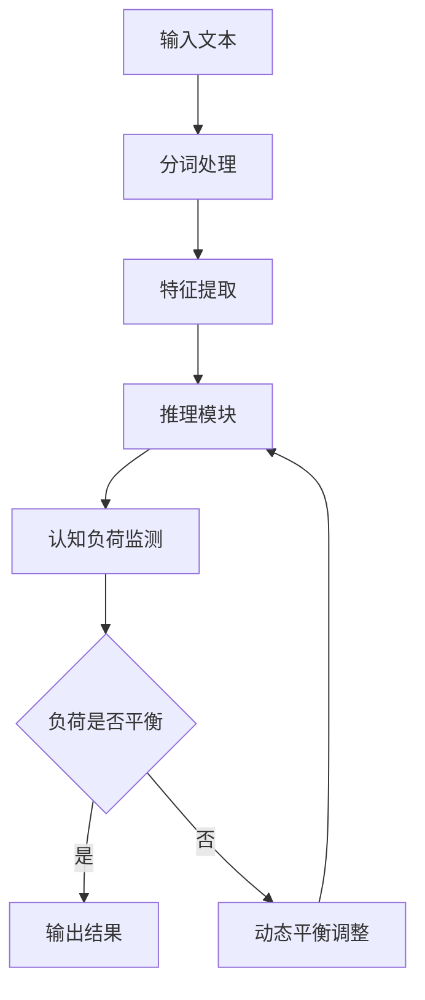

# 语言模型推理能力的认知负荷动态平衡研究

> 关键词：语言模型、推理能力、认知负荷、动态平衡、研究方法

> 摘要：本文聚焦于语言模型推理能力的认知负荷动态平衡研究。通过深入剖析语言模型推理过程中的认知负荷机制，阐述动态平衡的概念及重要性。详细探讨核心概念之间的联系，介绍相关核心算法原理与操作步骤，运用数学模型和公式进行理论分析，并结合实际案例展开项目实战。同时，分析了语言模型推理能力在不同场景的实际应用，推荐了学习、开发相关的工具和资源。最后总结了该领域未来的发展趋势与挑战，为解决常见问题提供解答，并给出扩展阅读与参考资料，旨在为该领域的研究和应用提供全面而深入的指导。

## 1. 背景介绍 
### 1.1 目的和范围
本研究的主要目的是深入理解语言模型在进行推理任务时认知负荷的动态变化情况，并探索如何实现其动态平衡。语言模型在自然语言处理领域的应用越来越广泛，从智能客服到机器翻译，再到知识问答系统等。然而，在执行复杂推理任务时，语言模型可能会面临认知负荷过高或过低的问题，这会影响其推理的准确性和效率。本研究旨在揭示认知负荷的变化规律，为优化语言模型的推理性能提供理论依据和实践指导。

研究范围涵盖了多种类型的语言模型，包括基于深度学习的Transformer架构模型（如GPT系列、BERT等），以及传统的统计语言模型。研究内容涉及认知负荷的度量、影响因素分析、动态平衡的实现策略等方面。

### 1.2 预期读者
本文的预期读者主要包括自然语言处理领域的研究人员、开发人员和相关专业的学生。对于研究人员来说，本文可以为他们的研究提供新的思路和方法；对于开发人员，能够帮助他们在实际项目中优化语言模型的推理性能；对于学生而言，有助于他们深入理解语言模型推理的相关理论和技术。

### 1.3 文档结构概述
本文共分为十个部分。第一部分为背景介绍，阐述研究的目的、范围、预期读者和文档结构。第二部分介绍核心概念与联系，解释语言模型推理能力、认知负荷和动态平衡等核心概念，并给出它们之间的联系示意图和流程图。第三部分讲解核心算法原理和具体操作步骤，通过Python代码详细阐述。第四部分运用数学模型和公式对相关理论进行详细讲解，并举例说明。第五部分进行项目实战，包括开发环境搭建、源代码实现和代码解读。第六部分分析语言模型推理能力的实际应用场景。第七部分推荐学习、开发所需的工具和资源。第八部分总结未来发展趋势与挑战。第九部分为附录，解答常见问题。第十部分提供扩展阅读和参考资料。

### 1.4 术语表
#### 1.4.1 核心术语定义
- **语言模型推理能力**：指语言模型根据给定的输入信息，运用内部的知识和算法进行逻辑推导，得出合理结论的能力。
- **认知负荷**：在语言模型进行推理任务时，其处理信息所消耗的计算资源和内存资源的总和，反映了模型处理任务的难度和复杂度。
- **动态平衡**：在语言模型推理过程中，使认知负荷保持在一个合理的范围内，避免过高或过低，以实现推理性能的最优化。

#### 1.4.2 相关概念解释
- **Transformer架构**：一种基于自注意力机制的深度学习架构，广泛应用于语言模型中，能够有效地处理序列数据。
- **自注意力机制**：Transformer架构中的核心机制，它允许模型在处理序列时，关注序列中不同位置的元素之间的关系。

#### 1.4.3 缩略词列表
- **GPT**：Generative Pretrained Transformer，生成式预训练Transformer模型。
- **BERT**：Bidirectional Encoder Representations from Transformers，基于Transformer的双向编码器表示模型。

## 2. 核心概念与联系 

### 核心概念原理
#### 语言模型推理能力
语言模型的推理能力是其智能的重要体现。它通过对输入文本的理解和分析，结合自身学习到的知识和模式，进行逻辑推导。例如，在问答系统中，语言模型需要根据用户的问题，从知识库中找到相关信息，并进行推理得出答案。语言模型的推理能力取决于其架构设计、训练数据和训练方法。

#### 认知负荷
认知负荷是衡量语言模型在推理过程中处理信息难度的指标。它主要包括两个方面：计算负荷和内存负荷。计算负荷指模型在进行推理时所需的计算量，如矩阵乘法、激活函数计算等；内存负荷指模型在推理过程中所需的内存空间，用于存储中间结果和参数。

#### 动态平衡
动态平衡的目标是使语言模型在推理过程中，认知负荷始终保持在一个合理的范围内。当认知负荷过高时，模型可能会出现推理速度慢、准确性下降等问题；当认知负荷过低时，模型的性能没有得到充分发挥。通过动态调整模型的参数、输入数据的处理方式等，可以实现认知负荷的动态平衡。

### 架构的文本示意图
```plaintext
语言模型推理过程
|
|-- 输入文本
|   |
|   |-- 分词处理
|   |   |
|   |   |-- 特征提取
|   |   |   |
|   |   |   |-- 推理模块
|   |   |   |   |
|   |   |   |   |-- 认知负荷监测
|   |   |   |   |   |
|   |   |   |   |   |-- 动态平衡调整
|   |   |   |   |   |   |
|   |   |   |   |   |   |-- 输出结果
```

### Mermaid流程图


## 3. 核心算法原理 & 具体操作步骤 

### 认知负荷监测算法原理
认知负荷监测的目的是实时评估语言模型在推理过程中的计算负荷和内存负荷。我们可以通过以下方式来实现：

#### 计算负荷监测
计算负荷可以通过统计模型在推理过程中执行的计算操作数量来衡量。例如，在一个基于Transformer架构的语言模型中，主要的计算操作是矩阵乘法。我们可以统计矩阵乘法的次数来估计计算负荷。

```python
import torch

def calculate_computation_load(model, input_tensor):
    """
    计算模型的计算负荷
    :param model: 语言模型
    :param input_tensor: 输入张量
    :return: 计算负荷
    """
    computation_load = 0
    def hook(module, input, output):
        nonlocal computation_load
        if isinstance(module, torch.nn.Linear):
            # 假设线性层主要进行矩阵乘法
            in_features = input[0].size(-1)
            out_features = output.size(-1)
            computation_load += in_features * out_features
    hooks = []
    for name, module in model.named_modules():
        if isinstance(module, torch.nn.Linear):
            hooks.append(module.register_forward_hook(hook))
    with torch.no_grad():
        model(input_tensor)
    for hook in hooks:
        hook.remove()
    return computation_load

```

#### 内存负荷监测
内存负荷可以通过统计模型在推理过程中占用的内存空间来衡量。在PyTorch中，我们可以使用`torch.cuda.memory_allocated()`函数来获取当前分配的GPU内存。

```python
import torch

def calculate_memory_load(model, input_tensor):
    """
    计算模型的内存负荷
    :param model: 语言模型
    :param input_tensor: 输入张量
    :return: 内存负荷
    """
    torch.cuda.empty_cache()
    start_memory = torch.cuda.memory_allocated()
    with torch.no_grad():
        model(input_tensor)
    end_memory = torch.cuda.memory_allocated()
    memory_load = end_memory - start_memory
    return memory_load

```

### 动态平衡调整算法原理
当监测到认知负荷过高或过低时，需要进行动态平衡调整。调整的方法可以包括调整模型的参数、改变输入数据的处理方式等。以下是一个简单的动态平衡调整示例，当计算负荷过高时，减少输入序列的长度。

```python
import torch

def dynamic_balance_adjustment(model, input_tensor, computation_load_threshold):
    """
    动态平衡调整
    :param model: 语言模型
    :param input_tensor: 输入张量
    :param computation_load_threshold: 计算负荷阈值
    :return: 调整后的输入张量
    """
    computation_load = calculate_computation_load(model, input_tensor)
    if computation_load > computation_load_threshold:
        # 当计算负荷过高时，减少输入序列的长度
        new_length = int(input_tensor.size(1) * 0.8)
        input_tensor = input_tensor[:, :new_length]
    return input_tensor

```

### 具体操作步骤
1. 初始化语言模型和输入数据。
2. 调用`calculate_computation_load`和`calculate_memory_load`函数，计算当前的计算负荷和内存负荷。
3. 判断认知负荷是否处于合理范围内，如果超出阈值，则调用`dynamic_balance_adjustment`函数进行调整。
4. 使用调整后的输入数据进行推理，得到输出结果。

```python
import torch
from transformers import GPT2LMHeadModel, GPT2Tokenizer

# 初始化模型和分词器
model = GPT2LMHeadModel.from_pretrained('gpt2')
tokenizer = GPT2Tokenizer.from_pretrained('gpt2')

# 准备输入数据
input_text = "This is a test sentence for language model reasoning."
input_tensor = tokenizer.encode(input_text, return_tensors='pt')

# 计算认知负荷
computation_load = calculate_computation_load(model, input_tensor)
memory_load = calculate_memory_load(model, input_tensor)

# 设定计算负荷阈值
computation_load_threshold = 1000000

# 动态平衡调整
adjusted_input_tensor = dynamic_balance_adjustment(model, input_tensor, computation_load_threshold)

# 进行推理
with torch.no_grad():
    output = model(adjusted_input_tensor)

# 解码输出结果
output_text = tokenizer.decode(output.logits.argmax(dim=-1)[0])
print("Output text:", output_text)

```

## 4. 数学模型和公式 & 详细讲解 & 举例说明 

### 计算负荷数学模型
计算负荷 $C$ 可以表示为模型中各个计算操作的计算量之和。对于一个基于Transformer架构的语言模型，主要的计算操作是矩阵乘法。假设模型中有 $n$ 个线性层，第 $i$ 个线性层的输入特征维度为 $d_{in}^i$，输出特征维度为 $d_{out}^i$，则计算负荷 $C$ 可以表示为：

$$C = \sum_{i=1}^{n} d_{in}^i \times d_{out}^i$$

### 内存负荷数学模型
内存负荷 $M$ 主要包括模型参数的内存占用 $M_{param}$ 和中间结果的内存占用 $M_{intermediate}$。模型参数的内存占用可以通过统计模型中所有参数的数量和每个参数的字节数来计算。中间结果的内存占用取决于模型的计算过程和输入数据的大小。

$$M = M_{param} + M_{intermediate}$$

### 动态平衡调整公式
假设当前计算负荷为 $C_{current}$，计算负荷阈值为 $C_{threshold}$，调整系数为 $\alpha$（$0 < \alpha < 1$）。当 $C_{current} > C_{threshold}$ 时，我们可以通过减少输入序列的长度 $L$ 来降低计算负荷。调整后的输入序列长度 $L_{new}$ 可以表示为：

$$L_{new} = \alpha \times L$$

### 举例说明
假设我们有一个简单的语言模型，包含两个线性层。第一个线性层的输入特征维度为 $d_{in}^1 = 100$，输出特征维度为 $d_{out}^1 = 200$；第二个线性层的输入特征维度为 $d_{in}^2 = 200$，输出特征维度为 $d_{out}^2 = 300$。则计算负荷 $C$ 为：

$$C = d_{in}^1 \times d_{out}^1 + d_{in}^2 \times d_{out}^2 = 100 \times 200 + 200 \times 300 = 20000 + 60000 = 80000$$

假设模型参数的内存占用 $M_{param} = 100000$ 字节，中间结果的内存占用 $M_{intermediate} = 50000$ 字节，则内存负荷 $M$ 为：

$$M = M_{param} + M_{intermediate} = 100000 + 50000 = 150000$$

假设当前输入序列长度 $L = 100$，计算负荷阈值 $C_{threshold} = 60000$，调整系数 $\alpha = 0.8$。由于 $C_{current} = 80000 > C_{threshold}$，则调整后的输入序列长度 $L_{new}$ 为：

$$L_{new} = \alpha \times L = 0.8 \times 100 = 80$$

## 5. 项目实战：代码实际案例和详细解释说明 

### 5.1  开发环境搭建
#### 操作系统
建议使用Linux系统，如Ubuntu 18.04或更高版本，因为Linux系统在深度学习开发中具有更好的稳定性和兼容性。

#### Python环境
使用Python 3.7或更高版本。可以使用Anaconda来管理Python环境，以下是创建和激活虚拟环境的命令：

```bash
conda create -n language_model_reasoning python=3.8
conda activate language_model_reasoning
```

#### 安装依赖库
安装必要的深度学习库和自然语言处理库，如PyTorch、Transformers等：

```bash
pip install torch transformers
```

### 5.2  源代码详细实现和代码解读
```python
import torch
from transformers import GPT2LMHeadModel, GPT2Tokenizer

# 初始化模型和分词器
model = GPT2LMHeadModel.from_pretrained('gpt2')
tokenizer = GPT2Tokenizer.from_pretrained('gpt2')

# 定义认知负荷监测函数
def calculate_computation_load(model, input_tensor):
    computation_load = 0
    def hook(module, input, output):
        nonlocal computation_load
        if isinstance(module, torch.nn.Linear):
            in_features = input[0].size(-1)
            out_features = output.size(-1)
            computation_load += in_features * out_features
    hooks = []
    for name, module in model.named_modules():
        if isinstance(module, torch.nn.Linear):
            hooks.append(module.register_forward_hook(hook))
    with torch.no_grad():
        model(input_tensor)
    for hook in hooks:
        hook.remove()
    return computation_load

def calculate_memory_load(model, input_tensor):
    torch.cuda.empty_cache()
    start_memory = torch.cuda.memory_allocated()
    with torch.no_grad():
        model(input_tensor)
    end_memory = torch.cuda.memory_allocated()
    memory_load = end_memory - start_memory
    return memory_load

# 定义动态平衡调整函数
def dynamic_balance_adjustment(model, input_tensor, computation_load_threshold):
    computation_load = calculate_computation_load(model, input_tensor)
    if computation_load > computation_load_threshold:
        new_length = int(input_tensor.size(1) * 0.8)
        input_tensor = input_tensor[:, :new_length]
    return input_tensor

# 准备输入数据
input_text = "This is a test sentence for language model reasoning."
input_tensor = tokenizer.encode(input_text, return_tensors='pt')

# 计算认知负荷
computation_load = calculate_computation_load(model, input_tensor)
memory_load = calculate_memory_load(model, input_tensor)

# 设定计算负荷阈值
computation_load_threshold = 1000000

# 动态平衡调整
adjusted_input_tensor = dynamic_balance_adjustment(model, input_tensor, computation_load_threshold)

# 进行推理
with torch.no_grad():
    output = model(adjusted_input_tensor)

# 解码输出结果
output_text = tokenizer.decode(output.logits.argmax(dim=-1)[0])
print("Output text:", output_text)

```

### 代码解读与分析
1. **模型和分词器初始化**：使用`GPT2LMHeadModel`和`GPT2Tokenizer`从预训练模型中加载模型和分词器。
2. **认知负荷监测函数**：
    - `calculate_computation_load`函数通过注册前向钩子来统计模型中线性层的矩阵乘法计算量。
    - `calculate_memory_load`函数通过记录模型推理前后的GPU内存使用情况来计算内存负荷。
3. **动态平衡调整函数**：`dynamic_balance_adjustment`函数根据计算负荷阈值来调整输入序列的长度。
4. **推理过程**：将输入文本编码为张量，计算认知负荷，进行动态平衡调整，然后使用调整后的输入张量进行推理，最后解码输出结果。

## 6. 实际应用场景 
### 智能客服
在智能客服系统中，语言模型需要根据用户的问题进行推理，提供准确的答案。通过实现认知负荷的动态平衡，可以提高客服系统的响应速度和准确性。当用户的问题比较复杂时，可能会导致认知负荷过高，此时可以通过调整模型的参数或输入数据的处理方式来降低负荷，保证系统的稳定性。

### 机器翻译
在机器翻译任务中，语言模型需要对源语言文本进行理解和推理，然后生成目标语言的翻译结果。认知负荷的动态平衡可以帮助模型在处理长句子或复杂语义时，保持高效的推理性能。例如，当遇到长句子时，可以适当减少输入序列的长度，降低计算负荷。

### 知识问答系统
知识问答系统需要从大量的知识库中检索相关信息，并进行推理得出答案。动态平衡认知负荷可以使系统在处理不同难度的问题时，都能快速准确地给出答案。对于简单问题，保持较低的认知负荷；对于复杂问题，合理调整负荷以提高推理能力。

## 7. 工具和资源推荐
### 7.1 学习资源推荐
#### 7.1.1 书籍推荐
- 《深度学习》（Deep Learning）：由Ian Goodfellow、Yoshua Bengio和Aaron Courville所著，是深度学习领域的经典教材，涵盖了神经网络、卷积神经网络、循环神经网络等基础知识。
- 《自然语言处理入门》：何晗著，适合初学者，介绍了自然语言处理的基本概念、方法和技术。
- 《Python自然语言处理》（Natural Language Processing with Python）：Steven Bird、Ewan Klein和Edward Loper所著，详细介绍了使用Python进行自然语言处理的方法和工具。

#### 7.1.2 在线课程
- Coursera上的“深度学习专项课程”（Deep Learning Specialization）：由Andrew Ng教授讲授，包括神经网络和深度学习、改善深层神经网络、结构化机器学习项目等课程。
- edX上的“自然语言处理基础”（Foundations of Natural Language Processing）：介绍了自然语言处理的基本理论和方法。

#### 7.1.3 技术博客和网站
- arXiv：提供了大量的学术论文，包括自然语言处理领域的最新研究成果。
- Medium：有许多技术博客文章，涵盖了深度学习、自然语言处理等领域的技术分享和实践经验。
- Hugging Face博客：专注于自然语言处理和深度学习，提供了许多关于语言模型的最新消息和技术文章。

### 7.2 开发工具框架推荐
#### 7.2.1 IDE和编辑器
- PyCharm：一款功能强大的Python集成开发环境，提供了代码编辑、调试、版本控制等功能。
- Jupyter Notebook：交互式的开发环境，适合进行数据探索、模型实验和代码演示。

#### 7.2.2 调试和性能分析工具
- PyTorch Profiler：用于分析PyTorch模型的性能，包括计算时间、内存使用等。
- TensorBoard：用于可视化深度学习模型的训练过程和性能指标。

#### 7.2.3 相关框架和库
- PyTorch：一个开源的深度学习框架，提供了丰富的神经网络层和优化算法。
- Transformers：Hugging Face开发的自然语言处理库，提供了多种预训练的语言模型和工具。
- NLTK：自然语言工具包，提供了许多自然语言处理的工具和数据集。

### 7.3 相关论文著作推荐
#### 7.3.1 经典论文
- “Attention Is All You Need”：提出了Transformer架构，为现代语言模型的发展奠定了基础。
- “BERT: Pre-training of Deep Bidirectional Transformers for Language Understanding”：介绍了BERT模型，开创了预训练语言模型的新纪元。

#### 7.3.2 最新研究成果
- 在arXiv上搜索“language model reasoning”和“cognitive load in language models”等关键词，可以找到许多关于语言模型推理能力和认知负荷的最新研究论文。

#### 7.3.3 应用案例分析
- 可以在ACM Digital Library、IEEE Xplore等学术数据库中搜索语言模型在智能客服、机器翻译、知识问答系统等领域的应用案例分析论文。

## 8. 总结：未来发展趋势与挑战
### 未来发展趋势
#### 更强大的推理能力
未来的语言模型将不断提高其推理能力，能够处理更加复杂的逻辑推理任务，如数学证明、科学推理等。这需要进一步改进模型的架构和训练方法，引入更多的先验知识和推理规则。

#### 自适应的认知负荷管理
语言模型将具备更强的自适应能力，能够根据不同的任务和输入数据，自动调整认知负荷，实现更加精准的动态平衡。例如，在处理不同领域的文本时，能够快速适应并优化推理策略。

#### 多模态推理
语言模型将与其他模态的信息（如图像、音频等）进行融合，实现多模态推理。这将拓宽语言模型的应用场景，如在智能视频分析、语音交互等领域发挥更大的作用。

### 挑战
#### 数据质量和数量
提高语言模型的推理能力需要大量高质量的数据进行训练。然而，获取和标注这些数据是一项艰巨的任务，尤其是对于一些特定领域的推理任务。

#### 计算资源限制
随着模型规模的不断增大，语言模型的推理过程需要消耗大量的计算资源。如何在有限的计算资源下实现高效的推理，是一个亟待解决的问题。

#### 可解释性
语言模型的推理过程往往是黑盒的，难以解释其决策依据。提高语言模型的可解释性，对于其在一些关键领域的应用（如医疗、金融等）至关重要。

## 9. 附录：常见问题与解答
### 问题1：如何选择合适的计算负荷阈值？
解答：计算负荷阈值的选择需要根据具体的应用场景和硬件资源来确定。可以通过实验的方法，在不同的阈值下测试模型的推理性能，选择一个能够使模型在准确性和效率之间达到平衡的阈值。

### 问题2：动态平衡调整是否会影响模型的推理准确性？
解答：在一定程度上，动态平衡调整可能会对模型的推理准确性产生影响。例如，减少输入序列的长度可能会丢失一些有用的信息。但是，通过合理的调整策略，可以将这种影响降到最低。在实际应用中，需要在准确性和效率之间进行权衡。

### 问题3：如何处理内存泄漏问题？
解答：内存泄漏可能会导致模型的内存负荷不断增加，影响推理性能。可以使用`torch.cuda.empty_cache()`函数来释放不再使用的GPU内存。另外，检查代码中是否存在循环引用或未释放的张量，及时进行清理。

## 10. 扩展阅读 & 参考资料
### 扩展阅读
- 《人工智能：现代方法》（Artificial Intelligence: A Modern Approach）：全面介绍了人工智能的各个领域，包括自然语言处理、机器学习等。
- 《神经网络与深度学习》：邱锡鹏著，深入讲解了神经网络的原理和应用。

### 参考资料
- Hugging Face官方文档：https://huggingface.co/docs
- PyTorch官方文档：https://pytorch.org/docs/stable/index.html
- arXiv：https://arxiv.org/

作者：AI天才研究院/AI Genius Institute & 禅与计算机程序设计艺术 /Zen And The Art of Computer Programming