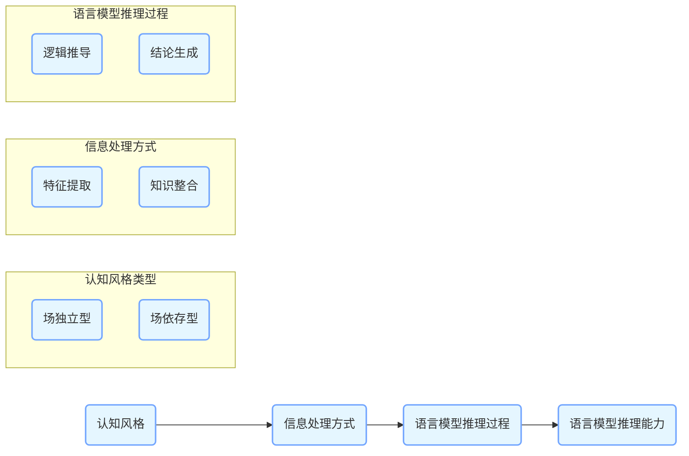

# 语言模型推理能力的认知风格影响因素分析

> 关键词：语言模型、推理能力、认知风格、影响因素、分析

> 摘要：本文旨在深入分析语言模型推理能力的认知风格影响因素。首先介绍了研究的背景、目的、预期读者等内容，接着阐述了核心概念与联系，详细讲解了相关算法原理和具体操作步骤，给出了数学模型和公式并举例说明。通过项目实战展示代码实现和解读，探讨了实际应用场景，推荐了相关工具和资源，最后总结了未来发展趋势与挑战，解答常见问题并提供扩展阅读和参考资料，为理解语言模型推理能力与认知风格之间的关系提供全面且深入的视角。

## 1. 背景介绍 
### 1.1 目的和范围
随着人工智能技术的飞速发展，语言模型在自然语言处理领域取得了显著的成果。然而，不同语言模型在推理能力上存在较大差异。认知风格作为人类认知过程中的一种稳定的个体差异，可能对语言模型的推理能力产生重要影响。本研究的目的在于系统地分析认知风格的各个方面如何影响语言模型的推理能力，范围涵盖从认知风格的基本概念到其在语言模型推理中的具体作用机制，以及相关的技术实现和实际应用。

### 1.2 预期读者
本文预期读者包括人工智能领域的研究人员、程序员、软件架构师，以及对语言模型和认知科学感兴趣的学生和爱好者。研究人员可以从本文中获取关于语言模型推理能力影响因素的新见解，为进一步的研究提供方向；程序员和软件架构师可以了解如何在实际开发中考虑认知风格因素来提升语言模型的推理性能；学生和爱好者可以通过本文初步了解语言模型推理与认知风格的相关知识。

### 1.3 文档结构概述
本文首先介绍研究的背景信息，包括目的、预期读者和文档结构。接着阐述核心概念与联系，明确相关概念的定义和它们之间的关系。然后详细讲解核心算法原理和具体操作步骤，并用Python代码进行说明。之后给出数学模型和公式，通过具体例子加深理解。通过项目实战展示代码实现和解读，探讨实际应用场景。推荐相关的学习资源、开发工具框架和论文著作。最后总结未来发展趋势与挑战，解答常见问题并提供扩展阅读和参考资料。

### 1.4 术语表
#### 1.4.1 核心术语定义
- **语言模型**：是一种对自然语言文本进行概率建模的模型，用于预测下一个可能出现的词或字符，常见的有基于统计的语言模型和基于深度学习的语言模型，如Transformer架构的模型。
- **推理能力**：指语言模型根据给定的输入信息，通过逻辑推导、知识运用等方式得出合理结论的能力。
- **认知风格**：是个体在感知、记忆、思维等认知过程中所表现出来的稳定的、独特的方式和倾向，如场独立型和场依存型认知风格。

#### 1.4.2 相关概念解释
- **场独立型认知风格**：这类个体倾向于以独立于周围环境的方式进行认知，能够更自主地分析和处理信息，较少受到外部环境的干扰。在语言模型推理中，可能表现为更注重内在逻辑和规则的运用。
- **场依存型认知风格**：个体在认知过程中更依赖于周围环境的信息，容易受到外部线索的影响。在语言模型中，可能体现为更善于利用上下文信息进行推理。

#### 1.4.3 缩略词列表
- **NLP**：Natural Language Processing，自然语言处理
- **DNN**：Deep Neural Network，深度神经网络
- **RNN**：Recurrent Neural Network，循环神经网络
- **LSTM**：Long Short - Term Memory，长短期记忆网络
- **GRU**：Gated Recurrent Unit，门控循环单元

## 2. 核心概念与联系 

### 核心概念原理
语言模型的推理能力是其在自然语言处理任务中的关键性能指标之一。它涉及到对输入文本的理解、知识的运用和逻辑推理过程。认知风格则是个体认知过程中的一种稳定特征，反映了个体在信息处理方式上的差异。

从原理上讲，不同的认知风格会影响语言模型对信息的获取、表示和处理。例如，场独立型认知风格可能促使语言模型更注重对文本的抽象特征提取和逻辑规则的应用，而场依存型认知风格可能使模型更依赖于上下文信息和外部知识的整合。

### 架构的文本示意图
以下是语言模型推理能力与认知风格关系的文本示意图：

认知风格（场独立型、场依存型等） -> 影响信息处理方式（特征提取、知识整合等） -> 作用于语言模型推理过程（逻辑推导、结论生成等） -> 影响语言模型推理能力

### Mermaid 流程图


这个流程图展示了认知风格通过影响信息处理方式，进而作用于语言模型推理过程，最终影响推理能力的过程。同时，细分了认知风格类型、信息处理方式和语言模型推理过程的具体内容。

## 3. 核心算法原理 & 具体操作步骤 

### 算法原理
为了分析认知风格对语言模型推理能力的影响，我们可以采用基于特征工程和模型训练的方法。首先，我们需要对文本数据进行特征提取，这些特征可以反映认知风格的相关信息。然后，将这些特征融入到语言模型的训练过程中，观察模型推理能力的变化。

以下是一个简单的基于深度学习的语言模型推理能力分析算法原理：

1. **数据预处理**：对输入的文本数据进行清洗、分词等操作，将文本转换为适合模型处理的格式。
2. **特征提取**：从文本数据中提取与认知风格相关的特征，例如文本的复杂度、上下文依赖程度等。
3. **模型构建**：选择合适的语言模型架构，如Transformer，构建语言模型。
4. **特征融合**：将提取的认知风格特征融入到语言模型的输入层或隐藏层。
5. **模型训练**：使用标注好的数据集对融合后的模型进行训练，优化模型参数。
6. **推理能力评估**：使用测试数据集评估模型的推理能力，比较不同认知风格特征下模型的性能。

### 具体操作步骤及Python代码实现

```python
import torch
import torch.nn as nn
import torch.optim as optim
from torch.utils.data import Dataset, DataLoader
from transformers import BertTokenizer, BertModel

# 1. 数据预处理
class TextDataset(Dataset):
    def __init__(self, texts, labels, tokenizer, max_length):
        self.texts = texts
        self.labels = labels
        self.tokenizer = tokenizer
        self.max_length = max_length

    def __len__(self):
        return len(self.texts)

    def __getitem__(self, idx):
        text = self.texts[idx]
        label = self.labels[idx]
        encoding = self.tokenizer.encode_plus(
            text,
            add_special_tokens=True,
            max_length=self.max_length,
            padding='max_length',
            truncation=True,
            return_tensors='pt'
        )
        input_ids = encoding['input_ids'].flatten()
        attention_mask = encoding['attention_mask'].flatten()
        return {
            'input_ids': input_ids,
            'attention_mask': attention_mask,
            'labels': torch.tensor(label, dtype=torch.long)
        }

# 2. 特征提取（简单示例：文本长度作为特征）
def extract_features(texts):
    features = []
    for text in texts:
        features.append(len(text.split()))
    return features

# 3. 模型构建
class CustomBertModel(nn.Module):
    def __init__(self, bert_model_name, num_classes):
        super(CustomBertModel, self).__init__()
        self.bert = BertModel.from_pretrained(bert_model_name)
        self.dropout = nn.Dropout(0.1)
        self.fc = nn.Linear(self.bert.config.hidden_size + 1, num_classes)  # 增加一个特征维度

    def forward(self, input_ids, attention_mask, features):
        outputs = self.bert(input_ids=input_ids, attention_mask=attention_mask)
        pooled_output = outputs.pooler_output
        features = features.unsqueeze(1)
        combined_input = torch.cat((pooled_output, features), dim=1)
        x = self.dropout(combined_input)
        logits = self.fc(x)
        return logits

# 4. 特征融合和模型训练
def train_model(model, train_dataloader, optimizer, criterion, device):
    model.train()
    total_loss = 0
    for batch in train_dataloader:
        input_ids = batch['input_ids'].to(device)
        attention_mask = batch['attention_mask'].to(device)
        labels = batch['labels'].to(device)
        features = torch.tensor(extract_features([text for text in batch['text']])).to(device)  # 假设 batch 中有 text 字段

        optimizer.zero_grad()
        logits = model(input_ids, attention_mask, features)
        loss = criterion(logits, labels)
        loss.backward()
        optimizer.step()
        total_loss += loss.item()
    return total_loss / len(train_dataloader)

# 5. 推理能力评估
def evaluate_model(model, test_dataloader, device):
    model.eval()
    correct_predictions = 0
    total_predictions = 0
    with torch.no_grad():
        for batch in test_dataloader:
            input_ids = batch['input_ids'].to(device)
            attention_mask = batch['attention_mask'].to(device)
            labels = batch['labels'].to(device)
            features = torch.tensor(extract_features([text for text in batch['text']])).to(device)  # 假设 batch 中有 text 字段

            logits = model(input_ids, attention_mask, features)
            predictions = torch.argmax(logits, dim=1)
            correct_predictions += (predictions == labels).sum().item()
            total_predictions += labels.size(0)
    accuracy = correct_predictions / total_predictions
    return accuracy

# 示例使用
if __name__ == "__main__":
    texts = ["This is a sample text.", "Another example sentence."]
    labels = [0, 1]
    tokenizer = BertTokenizer.from_pretrained('bert-base-uncased')
    max_length = 128
    dataset = TextDataset(texts, labels, tokenizer, max_length)
    dataloader = DataLoader(dataset, batch_size=2, shuffle=True)

    device = torch.device('cuda' if torch.cuda.is_available() else 'cpu')
    model = CustomBertModel('bert-base-uncased', num_classes=2).to(device)
    optimizer = optim.Adam(model.parameters(), lr=2e-5)
    criterion = nn.CrossEntropyLoss()

    num_epochs = 3
    for epoch in range(num_epochs):
        train_loss = train_model(model, dataloader, optimizer, criterion, device)
        print(f'Epoch {epoch + 1}/{num_epochs}, Train Loss: {train_loss}')

    test_accuracy = evaluate_model(model, dataloader, device)
    print(f'Test Accuracy: {test_accuracy}')
```

这段代码实现了一个简单的基于BERT的语言模型，将文本长度作为认知风格相关的特征融入到模型中，通过训练和评估来观察特征对模型推理能力的影响。

## 4. 数学模型和公式 & 详细讲解 & 举例说明 

### 数学模型
我们可以将语言模型的推理过程看作一个函数映射。假设输入文本为 $x$，认知风格特征为 $f$，语言模型的参数为 $\theta$，则模型的输出 $y$ 可以表示为：

$$y = L(x, f; \theta)$$

其中 $L$ 表示语言模型的推理函数，它可以是一个神经网络模型，如Transformer。

### 详细讲解
- **输入部分**：$x$ 是输入的文本数据，通常需要经过编码转换为数值向量。$f$ 是认知风格相关的特征，例如文本的复杂度、上下文依赖程度等。这些特征可以通过特征工程的方法从文本数据中提取得到。
- **模型参数**：$\theta$ 是语言模型的参数，包括神经网络的权重和偏置。在训练过程中，我们通过优化算法（如随机梯度下降）来调整这些参数，使得模型的输出尽可能接近真实标签。
- **输出部分**：$y$ 是模型的输出，通常是一个概率分布，表示不同类别的可能性。在推理任务中，我们可以选择概率最大的类别作为最终的推理结果。

### 举例说明
假设我们有一个文本分类任务，输入文本 $x$ 是一篇新闻文章，认知风格特征 $f$ 是文章的句子平均长度（反映文本复杂度）。语言模型 $L$ 是一个基于Transformer的分类模型，模型参数 $\theta$ 是在大规模数据集上预训练得到的。

我们将输入文本 $x$ 经过分词和编码转换为输入向量，同时将句子平均长度 $f$ 作为一个额外的特征输入到模型中。模型根据输入和参数进行计算，输出一个概率分布 $y$，表示文章属于不同类别的可能性。例如，$y = [0.1, 0.2, 0.7]$ 表示文章属于类别1的概率为0.1，属于类别2的概率为0.2，属于类别3的概率为0.7，我们选择概率最大的类别3作为最终的推理结果。

## 5. 项目实战：代码实际案例和详细解释说明 

### 5.1  开发环境搭建
#### 操作系统
建议使用Linux或macOS系统，因为这些系统对深度学习开发有更好的支持。Windows系统也可以使用，但可能会遇到一些兼容性问题。

#### 编程语言和版本
使用Python 3.7及以上版本，Python是深度学习开发中最常用的编程语言，具有丰富的库和工具。

#### 深度学习框架
使用PyTorch作为深度学习框架，它提供了动态图机制，方便模型的构建和调试。可以通过以下命令安装PyTorch：
```sh
pip install torch torchvision
```

#### 自然语言处理库
使用Hugging Face的Transformers库，它提供了各种预训练的语言模型和工具。可以通过以下命令安装：
```sh
pip install transformers
```

### 5.2  源代码详细实现和代码解读
以下是一个更完整的项目实战代码示例，用于分析认知风格对语言模型推理能力的影响。

```python
import torch
import torch.nn as nn
import torch.optim as optim
from torch.utils.data import Dataset, DataLoader
from transformers import BertTokenizer, BertModel
import numpy as np
from sklearn.model_selection import train_test_split

# 数据预处理类
class TextDataset(Dataset):
    def __init__(self, texts, labels, tokenizer, max_length):
        self.texts = texts
        self.labels = labels
        self.tokenizer = tokenizer
        self.max_length = max_length

    def __len__(self):
        return len(self.texts)

    def __getitem__(self, idx):
        text = self.texts[idx]
        label = self.labels[idx]
        encoding = self.tokenizer.encode_plus(
            text,
            add_special_tokens=True,
            max_length=self.max_length,
            padding='max_length',
            truncation=True,
            return_tensors='pt'
        )
        input_ids = encoding['input_ids'].flatten()
        attention_mask = encoding['attention_mask'].flatten()
        return {
            'input_ids': input_ids,
            'attention_mask': attention_mask,
            'labels': torch.tensor(label, dtype=torch.long)
        }

# 特征提取函数（文本复杂度特征）
def extract_features(texts):
    features = []
    for text in texts:
        words = text.split()
        # 句子平均长度作为复杂度特征
        sentence_length = np.mean([len(sentence.split()) for sentence in text.split('.') if sentence])
        features.append(sentence_length)
    return torch.tensor(features, dtype=torch.float32)

# 自定义BERT模型
class CustomBertModel(nn.Module):
    def __init__(self, bert_model_name, num_classes):
        super(CustomBertModel, self).__init__()
        self.bert = BertModel.from_pretrained(bert_model_name)
        self.dropout = nn.Dropout(0.1)
        self.fc = nn.Linear(self.bert.config.hidden_size + 1, num_classes)

    def forward(self, input_ids, attention_mask, features):
        outputs = self.bert(input_ids=input_ids, attention_mask=attention_mask)
        pooled_output = outputs.pooler_output
        features = features.unsqueeze(1)
        combined_input = torch.cat((pooled_output, features), dim=1)
        x = self.dropout(combined_input)
        logits = self.fc(x)
        return logits

# 训练模型函数
def train_model(model, train_dataloader, optimizer, criterion, device):
    model.train()
    total_loss = 0
    for batch in train_dataloader:
        input_ids = batch['input_ids'].to(device)
        attention_mask = batch['attention_mask'].to(device)
        labels = batch['labels'].to(device)
        features = extract_features([text for text in batch['text']]).to(device) if 'text' in batch else None

        optimizer.zero_grad()
        logits = model(input_ids, attention_mask, features)
        loss = criterion(logits, labels)
        loss.backward()
        optimizer.step()
        total_loss += loss.item()
    return total_loss / len(train_dataloader)

# 评估模型函数
def evaluate_model(model, test_dataloader, device):
    model.eval()
    correct_predictions = 0
    total_predictions = 0
    with torch.no_grad():
        for batch in test_dataloader:
            input_ids = batch['input_ids'].to(device)
            attention_mask = batch['attention_mask'].to(device)
            labels = batch['labels'].to(device)
            features = extract_features([text for text in batch['text']]).to(device) if 'text' in batch else None

            logits = model(input_ids, attention_mask, features)
            predictions = torch.argmax(logits, dim=1)
            correct_predictions += (predictions == labels).sum().item()
            total_predictions += labels.size(0)
    accuracy = correct_predictions / total_predictions
    return accuracy

# 主函数
if __name__ == "__main__":
    # 示例数据
    texts = ["This is a simple sentence.", "A more complex sentence with multiple clauses and details."]
    labels = [0, 1]

    # 划分训练集和测试集
    train_texts, test_texts, train_labels, test_labels = train_test_split(texts, labels, test_size=0.2, random_state=42)

    # 初始化分词器和数据集
    tokenizer = BertTokenizer.from_pretrained('bert-base-uncased')
    max_length = 128
    train_dataset = TextDataset(train_texts, train_labels, tokenizer, max_length)
    test_dataset = TextDataset(test_texts, test_labels, tokenizer, max_length)
    train_dataloader = DataLoader(train_dataset, batch_size=2, shuffle=True)
    test_dataloader = DataLoader(test_dataset, batch_size=2, shuffle=False)

    # 设备选择
    device = torch.device('cuda' if torch.cuda.is_available() else 'cpu')

    # 初始化模型、优化器和损失函数
    model = CustomBertModel('bert-base-uncased', num_classes=2).to(device)
    optimizer = optim.Adam(model.parameters(), lr=2e-5)
    criterion = nn.CrossEntropyLoss()

    # 训练模型
    num_epochs = 3
    for epoch in range(num_epochs):
        train_loss = train_model(model, train_dataloader, optimizer, criterion, device)
        print(f'Epoch {epoch + 1}/{num_epochs}, Train Loss: {train_loss}')

    # 评估模型
    test_accuracy = evaluate_model(model, test_dataloader, device)
    print(f'Test Accuracy: {test_accuracy}')
```

### 代码解读与分析
#### 数据预处理部分
- `TextDataset` 类继承自 `torch.utils.data.Dataset`，用于将文本数据转换为适合模型输入的格式。在 `__getitem__` 方法中，使用 `BertTokenizer` 对文本进行分词和编码，得到输入ID和注意力掩码。

#### 特征提取部分
- `extract_features` 函数用于从文本中提取认知风格相关的特征，这里使用句子平均长度作为文本复杂度的特征。

#### 模型构建部分
- `CustomBertModel` 类继承自 `nn.Module`，在BERT模型的基础上增加了一个全连接层，将提取的特征与BERT的输出进行拼接，然后通过全连接层进行分类。

#### 训练和评估部分
- `train_model` 函数用于训练模型，在每个批次中计算损失并进行反向传播更新模型参数。
- `evaluate_model` 函数用于评估模型的性能，计算模型在测试集上的准确率。

通过这个项目实战，我们可以看到如何将认知风格相关的特征融入到语言模型中，并观察其对模型推理能力的影响。

## 6. 实际应用场景 
### 智能问答系统
在智能问答系统中，语言模型的推理能力至关重要。不同认知风格的用户对问题的理解和表达方式可能不同。例如，场独立型用户可能更倾向于直接提出核心问题，而场依存型用户可能会提供更多的上下文信息。通过分析认知风格对语言模型推理能力的影响，可以优化问答系统的性能，更好地理解不同用户的问题并给出准确的答案。

### 机器翻译
机器翻译过程中，语言模型需要理解源语言文本的含义并准确地翻译成目标语言。认知风格因素可能影响模型对文本语义的理解和推理。例如，场独立型认知风格可能使模型更注重词汇和语法规则的运用，而场依存型认知风格可能使模型更善于利用上下文信息进行翻译。通过考虑认知风格因素，可以提高机器翻译的质量。

### 文本分类
在文本分类任务中，语言模型需要根据文本的内容将其分类到不同的类别中。不同认知风格的文本可能具有不同的特征和表达方式。例如，场独立型文本可能结构更清晰，逻辑更明确，而场依存型文本可能更依赖于上下文和背景信息。分析认知风格对语言模型推理能力的影响，可以帮助我们更好地设计文本分类模型，提高分类的准确率。

### 对话系统
对话系统需要理解用户的意图并进行有效的交互。认知风格会影响用户在对话中的表达方式和信息传递方式。例如，场独立型用户可能更简洁明了地表达自己的需求，而场依存型用户可能会在对话中提供更多的细节和背景信息。通过考虑认知风格因素，可以使对话系统更好地理解用户的意图，提供更符合用户需求的回复。

## 7. 工具和资源推荐
### 7.1 学习资源推荐
#### 7.1.1 书籍推荐
- 《自然语言处理入门》：这本书适合初学者，系统地介绍了自然语言处理的基本概念、方法和技术，包括语言模型、分词、词性标注等内容。
- 《深度学习》：由Ian Goodfellow、Yoshua Bengio和Aaron Courville合著，是深度学习领域的经典教材，详细介绍了深度学习的原理、算法和应用。
- 《Python自然语言处理》：介绍了如何使用Python进行自然语言处理，包括使用NLTK、SpaCy等库进行文本处理和分析。

#### 7.1.2 在线课程
- Coursera上的“Natural Language Processing Specialization”：由深度学习领域的知名学者授课，涵盖了自然语言处理的多个方面，包括语言模型、机器翻译、问答系统等。
- edX上的“Deep Learning for Natural Language Processing”：介绍了深度学习在自然语言处理中的应用，包括神经网络架构、注意力机制等。
- 吴恩达的“Deep Learning Specialization”：虽然不是专门针对自然语言处理的课程，但其中的深度学习基础知识对于理解语言模型非常有帮助。

#### 7.1.3 技术博客和网站
- Hugging Face Blog：提供了关于Transformer模型、自然语言处理技术的最新研究和应用案例。
- Towards Data Science：有很多关于自然语言处理和深度学习的技术文章和教程。
- ArXiv：可以获取最新的自然语言处理和人工智能领域的研究论文。

### 7.2 开发工具框架推荐
#### 7.2.1 IDE和编辑器
- PyCharm：是一款功能强大的Python集成开发环境，提供了代码编辑、调试、版本控制等功能，适合大规模项目的开发。
- Jupyter Notebook：交互式的开发环境，适合进行数据探索、模型实验和代码演示。
- Visual Studio Code：轻量级的代码编辑器，支持多种编程语言和插件，可用于快速开发和调试。

#### 7.2.2 调试和性能分析工具
- PyTorch Profiler：可以帮助我们分析模型的性能瓶颈，找出耗时较长的操作和模块。
- TensorBoard：可以可视化模型的训练过程，包括损失函数的变化、准确率的变化等。
- NVIDIA Nsight Systems：用于分析GPU的性能，帮助我们优化模型在GPU上的运行效率。

#### 7.2.3 相关框架和库
- PyTorch：是一个开源的深度学习框架，提供了动态图机制和丰富的神经网络层，方便模型的构建和训练。
- Hugging Face Transformers：提供了各种预训练的语言模型和工具，如BERT、GPT等，可以快速实现自然语言处理任务。
- NLTK：自然语言工具包，提供了丰富的文本处理工具和数据集，如分词、词性标注、命名实体识别等。

### 7.3 相关论文著作推荐
#### 7.3.1 经典论文
- “Attention Is All You Need”：介绍了Transformer架构，是自然语言处理领域的里程碑式论文，提出了注意力机制，极大地推动了语言模型的发展。
- “BERT: Pre-training of Deep Bidirectional Transformers for Language Understanding”：提出了BERT模型，通过预训练和微调的方式在多个自然语言处理任务中取得了优异的成绩。
- “Generative Pretrained Transformer 3 (GPT - 3): Language Models are Few - Shot Learners”：介绍了GPT - 3模型，展示了大规模预训练语言模型在少样本学习和生成任务中的强大能力。

#### 7.3.2 最新研究成果
- 关注ArXiv上关于自然语言处理和认知科学交叉领域的最新论文，了解认知风格对语言模型推理能力影响的最新研究进展。
- 参加自然语言处理领域的顶级会议，如ACL、EMNLP等，获取最新的研究成果和技术动态。

#### 7.3.3 应用案例分析
- 阅读相关的技术博客和报告，了解认知风格在智能问答系统、机器翻译等实际应用中的案例分析和经验总结。
- 分析开源项目中的代码和文档，学习如何在实际项目中应用认知风格相关的技术和方法。

## 8. 总结：未来发展趋势与挑战
### 未来发展趋势
#### 多模态融合
未来的语言模型可能会融合更多的模态信息，如视觉、听觉等。认知风格不仅会影响语言处理，还会影响对其他模态信息的感知和推理。例如，不同认知风格的用户对图像和语音信息的理解方式可能不同，将认知风格因素融入多模态语言模型中，可以提高模型的综合推理能力。

#### 个性化推理
随着人工智能技术的发展，越来越强调个性化服务。在语言模型推理中，考虑用户的认知风格可以实现个性化的推理过程。例如，根据用户的认知风格调整模型的推理策略和输出方式，提供更符合用户需求的答案和建议。

#### 跨语言和跨文化应用
语言模型的应用越来越广泛，涉及到不同语言和文化背景。认知风格在不同语言和文化中可能存在差异，研究认知风格对跨语言和跨文化语言模型推理能力的影响，有助于开发更通用和有效的语言模型。

### 挑战
#### 认知风格的准确测量
目前，准确测量认知风格仍然是一个挑战。认知风格是一个复杂的概念，受到多种因素的影响，难以用简单的指标进行量化。在语言模型中应用认知风格因素，需要更准确的测量方法和工具。

#### 数据获取和标注
为了研究认知风格对语言模型推理能力的影响，需要大量带有认知风格标注的数据。然而，获取和标注这样的数据是一项艰巨的任务，需要耗费大量的时间和人力。

#### 模型复杂度和计算资源
将认知风格因素融入语言模型中可能会增加模型的复杂度，需要更多的计算资源进行训练和推理。如何在保证模型性能的前提下，降低模型的复杂度和计算成本，是一个需要解决的问题。

## 9. 附录：常见问题与解答
### 问题1：认知风格如何影响语言模型的推理能力？
认知风格影响语言模型对信息的获取、表示和处理方式。例如，场独立型认知风格可能使模型更注重内在逻辑和规则的运用，而场依存型认知风格可能使模型更依赖于上下文信息和外部知识的整合。这些不同的处理方式会影响模型在推理过程中的表现，进而影响推理能力。

### 问题2：如何提取认知风格相关的特征？
可以从文本数据中提取多种与认知风格相关的特征，如文本的复杂度、上下文依赖程度、词汇选择等。例如，文本的句子平均长度可以作为文本复杂度的特征，反映场独立型或场依存型认知风格的倾向。也可以使用一些心理测量工具来获取用户的认知风格信息，并将其作为额外的特征输入到模型中。

### 问题3：在实际应用中，如何考虑认知风格因素来优化语言模型？
在实际应用中，可以将认知风格相关的特征融入到语言模型的训练过程中。例如，在模型的输入层或隐藏层添加认知风格特征，让模型学习这些特征与推理结果之间的关系。还可以根据不同认知风格的用户需求，调整模型的推理策略和输出方式，提供个性化的服务。

### 问题4：研究认知风格对语言模型推理能力的影响有什么实际意义？
研究认知风格对语言模型推理能力的影响具有重要的实际意义。在智能问答系统、机器翻译、文本分类等自然语言处理任务中，考虑认知风格因素可以提高模型的性能和用户体验。例如，在智能问答系统中，更好地理解不同认知风格用户的问题，提供更准确的答案；在机器翻译中，根据认知风格调整翻译策略，提高翻译质量。

## 10. 扩展阅读 & 参考资料
### 扩展阅读
- 《认知心理学》：深入了解认知风格的心理学基础和相关理论。
- 《人工智能哲学》：探讨人工智能与人类认知的关系，为研究认知风格对语言模型的影响提供哲学思考。
- 《自然语言处理进展》：关注自然语言处理领域的最新研究成果和技术发展趋势。

### 参考资料
- 相关学术论文：在ACM Digital Library、IEEE Xplore等数据库中搜索关于语言模型推理能力和认知风格的学术论文。
- 开源项目：参考Hugging Face、GitHub等平台上的开源自然语言处理项目，学习相关的代码实现和技术应用。
- 行业报告：阅读市场研究机构发布的关于人工智能和自然语言处理的行业报告，了解行业动态和发展趋势。

作者：AI天才研究院/AI Genius Institute & 禅与计算机程序设计艺术 /Zen And The Art of Computer Programming