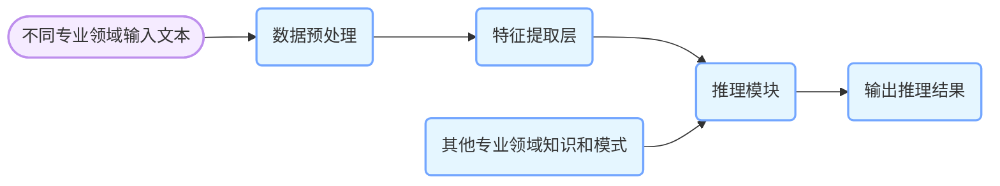

# 语言模型推理能力的跨专业迁移性分析

> 关键词：语言模型、推理能力、跨专业迁移性、知识泛化、专业领域应用

> 摘要：本文聚焦于语言模型推理能力的跨专业迁移性，旨在深入剖析语言模型在不同专业领域间推理能力的迁移表现、原理及影响因素。通过介绍相关核心概念，阐述推理算法原理，结合数学模型与公式进行理论分析，并给出项目实战案例。同时探讨了语言模型推理能力跨专业迁移在实际场景中的应用，推荐了相关学习资源、开发工具和论文著作。最后对未来发展趋势与挑战进行总结，为语言模型在多专业领域的进一步应用提供有价值的参考。

## 1. 背景介绍 
### 1.1 目的和范围
本研究的主要目的是全面分析语言模型推理能力的跨专业迁移性。随着语言模型在自然语言处理领域的广泛应用，其在单一专业领域的表现已得到一定验证，但对于能否将在一个专业领域学到的推理能力有效迁移到其他专业领域，仍缺乏系统深入的研究。本文将涵盖多种常见专业领域，如医学、法律、工程技术等，研究语言模型在这些领域间推理能力迁移的可行性、效果及相关影响因素。

### 1.2 预期读者
本文预期读者包括自然语言处理领域的研究人员、从事语言模型开发的程序员、对跨学科应用感兴趣的学者，以及关注人工智能在专业领域应用的相关从业人员。

### 1.3 文档结构概述
本文首先介绍相关核心概念及它们之间的联系，通过文本示意图和Mermaid流程图进行直观展示。接着阐述核心算法原理，并给出具体操作步骤，同时使用Python源代码详细说明。然后引入数学模型和公式，进行详细讲解并举例说明。之后通过项目实战，介绍开发环境搭建、源代码实现与解读。再探讨语言模型推理能力跨专业迁移的实际应用场景。随后推荐相关学习资源、开发工具和论文著作。最后总结未来发展趋势与挑战，并给出常见问题解答和扩展阅读参考资料。

### 1.4 术语表
#### 1.4.1 核心术语定义
- **语言模型**：是一种基于概率统计的模型，用于预测给定上下文下下一个词出现的概率。在深度学习时代，通常指基于神经网络的大规模预训练语言模型，如GPT、BERT等。
- **推理能力**：语言模型根据输入的信息，通过逻辑分析、知识运用等方式得出合理结论的能力。
- **跨专业迁移性**：指语言模型在一个专业领域学习到的推理能力能够应用到其他不同专业领域的特性。

#### 1.4.2 相关概念解释
- **知识泛化**：语言模型在训练过程中，从大量数据中学习到通用的知识和模式，使其能够处理未见过的输入，这是推理能力跨专业迁移的基础。
- **领域适应性**：语言模型在不同专业领域中，能够根据该领域的特点和需求，调整自身的推理方式和输出结果的能力。

#### 1.4.3 缩略词列表
- **NLP**：Natural Language Processing，自然语言处理
- **LM**：Language Model，语言模型

## 2. 核心概念与联系 

### 核心概念原理
语言模型的推理能力基于其对大规模文本数据的学习。在预训练阶段，语言模型通过自监督学习的方式，学习到语言的语法、语义和知识模式。当面对推理任务时，语言模型会根据输入的文本信息，在其内部的知识表示空间中进行搜索和匹配，利用学习到的模式进行推理。

跨专业迁移性的原理在于语言模型的知识泛化能力。不同专业领域的知识虽然具有独特性，但也存在一些通用的逻辑和语义结构。语言模型在一个专业领域学习到的这些通用结构和模式，可以被迁移到其他专业领域，从而实现推理能力的跨专业应用。

### 架构的文本示意图
语言模型推理能力的跨专业迁移架构可以描述为：

输入层接收来自不同专业领域的文本数据，这些数据经过预处理后进入语言模型的特征提取层。在特征提取层，语言模型将文本转换为向量表示，提取其中的语义和逻辑特征。然后，这些特征进入推理模块，推理模块根据语言模型学习到的知识和模式进行推理。最后，输出层输出推理结果。在跨专业迁移过程中，语言模型会利用其在其他专业领域学习到的通用知识和模式，对新领域的输入进行推理。

### Mermaid 流程图


## 3. 核心算法原理 & 具体操作步骤 

### 核心算法原理
以基于Transformer架构的语言模型为例，其核心算法是多头自注意力机制（Multi-Head Self-Attention）。多头自注意力机制允许模型在不同的表示子空间中并行地关注输入序列的不同部分，从而捕捉到输入序列中的长距离依赖关系和语义信息。

多头自注意力机制的计算过程如下：
1. 对于输入序列 $X = [x_1, x_2,..., x_n]$，首先将其分别通过三个线性变换矩阵 $W^Q$、$W^K$ 和 $W^V$ 得到查询向量 $Q$、键向量 $K$ 和值向量 $V$。
2. 计算注意力分数，即查询向量 $Q$ 与键向量 $K$ 的点积，然后进行缩放并通过softmax函数得到注意力权重。
3. 将注意力权重与值向量 $V$ 相乘并求和，得到每个位置的输出。
4. 将多个头的输出拼接起来，再通过一个线性变换得到最终的输出。

### Python源代码实现
```python
import torch
import torch.nn as nn

class MultiHeadSelfAttention(nn.Module):
    def __init__(self, input_dim, num_heads):
        super(MultiHeadSelfAttention, self).__init__()
        self.input_dim = input_dim
        self.num_heads = num_heads
        self.head_dim = input_dim // num_heads

        self.qkv_proj = nn.Linear(input_dim, 3 * input_dim)
        self.out_proj = nn.Linear(input_dim, input_dim)

    def forward(self, x):
        batch_size, seq_len, input_dim = x.size()
        qkv = self.qkv_proj(x)
        q, k, v = qkv.chunk(3, dim=-1)

        q = q.view(batch_size, seq_len, self.num_heads, self.head_dim).transpose(1, 2)
        k = k.view(batch_size, seq_len, self.num_heads, self.head_dim).transpose(1, 2)
        v = v.view(batch_size, seq_len, self.num_heads, self.head_dim).transpose(1, 2)

        attn_scores = torch.matmul(q, k.transpose(-2, -1)) / (self.head_dim ** 0.5)
        attn_probs = torch.softmax(attn_scores, dim=-1)
        output = torch.matmul(attn_probs, v)

        output = output.transpose(1, 2).contiguous().view(batch_size, seq_len, input_dim)
        output = self.out_proj(output)
        return output

# 示例使用
input_dim = 512
num_heads = 8
batch_size = 16
seq_len = 32

x = torch.randn(batch_size, seq_len, input_dim)
attention_layer = MultiHeadSelfAttention(input_dim, num_heads)
output = attention_layer(x)
print(output.shape)
```

### 具体操作步骤
1. **数据准备**：收集不同专业领域的文本数据，并进行清洗、标注等预处理操作。
2. **模型选择**：选择合适的预训练语言模型，如GPT、BERT等。
3. **微调模型**：使用目标专业领域的数据对预训练模型进行微调，使其适应新领域的特点。
4. **推理测试**：使用微调后的模型对新领域的推理任务进行测试，评估其推理能力和跨专业迁移效果。

## 4. 数学模型和公式 & 详细讲解 & 举例说明 

### 多头自注意力机制数学模型
多头自注意力机制的数学公式如下：

#### 线性变换
查询向量 $Q$、键向量 $K$ 和值向量 $V$ 的计算：
$$Q = XW^Q$$
$$K = XW^K$$
$$V = XW^V$$
其中，$X \in \mathbb{R}^{n \times d}$ 是输入序列，$W^Q, W^K, W^V \in \mathbb{R}^{d \times d}$ 是线性变换矩阵，$d$ 是输入向量的维度。

#### 注意力分数计算
$$\text{Attention}(Q, K, V) = \text{softmax}(\frac{QK^T}{\sqrt{d_k}})V$$
其中，$d_k$ 是键向量的维度。

#### 多头注意力
多头注意力将多个头的输出拼接起来：
$$\text{MultiHead}(Q, K, V) = \text{Concat}(\text{head}_1, \text{head}_2,..., \text{head}_h)W^O$$
其中，$\text{head}_i = \text{Attention}(QW_i^Q, KW_i^K, VW_i^V)$，$W_i^Q, W_i^K, W_i^V \in \mathbb{R}^{d \times d/h}$ 是每个头的线性变换矩阵，$W^O \in \mathbb{R}^{d \times d}$ 是输出的线性变换矩阵，$h$ 是头的数量。

### 详细讲解
多头自注意力机制通过将输入序列映射到多个不同的子空间，使得模型能够从不同的角度关注输入序列的不同部分。注意力分数的计算使用了点积的方式，通过缩放因子 $\sqrt{d_k}$ 来避免点积结果过大，导致softmax函数的梯度消失。多头注意力将多个头的输出拼接起来，能够捕捉到更丰富的语义信息。

### 举例说明
假设输入序列 $X = [x_1, x_2, x_3]$，其中 $x_i \in \mathbb{R}^{512}$。我们使用8个头的多头自注意力机制，每个头的维度为 $512/8 = 64$。首先，将 $X$ 通过线性变换矩阵 $W^Q$、$W^K$ 和 $W^V$ 得到查询向量 $Q$、键向量 $K$ 和值向量 $V$。然后，计算每个头的注意力分数和输出。最后，将8个头的输出拼接起来，再通过线性变换矩阵 $W^O$ 得到最终的输出。

## 5. 项目实战：代码实际案例和详细解释说明 

### 5.1  开发环境搭建
#### 操作系统
建议使用Linux系统，如Ubuntu 18.04或更高版本。

#### 编程语言
使用Python 3.7或更高版本。

#### 深度学习框架
使用PyTorch深度学习框架，可通过以下命令安装：
```bash
pip install torch torchvision
```

#### 其他依赖库
安装transformers库，用于加载预训练语言模型：
```bash
pip install transformers
```

### 5.2  源代码详细实现和代码解读
以下是一个使用Hugging Face的transformers库进行跨专业推理的示例代码：

```python
from transformers import AutoTokenizer, AutoModelForSequenceClassification
import torch

# 加载预训练模型和分词器
model_name = "bert-base-uncased"
tokenizer = AutoTokenizer.from_pretrained(model_name)
model = AutoModelForSequenceClassification.from_pretrained(model_name, num_labels=2)

# 定义输入文本
medical_text = "The patient has a fever and cough, which may be a symptom of influenza."
legal_text = "The defendant is accused of theft, and the evidence is conclusive."

# 对输入文本进行分词
medical_inputs = tokenizer(medical_text, return_tensors="pt")
legal_inputs = tokenizer(legal_text, return_tensors="pt")

# 进行推理
with torch.no_grad():
    medical_outputs = model(**medical_inputs)
    legal_outputs = model(**legal_inputs)

# 获取推理结果
medical_prediction = torch.argmax(medical_outputs.logits, dim=1).item()
legal_prediction = torch.argmax(legal_outputs.logits, dim=1).item()

print(f"Medical prediction: {medical_prediction}")
print(f"Legal prediction: {legal_prediction}")
```

### 代码解读与分析
1. **加载预训练模型和分词器**：使用`AutoTokenizer`和`AutoModelForSequenceClassification`从Hugging Face的模型库中加载预训练的BERT模型和对应的分词器。
2. **定义输入文本**：定义了一个医学领域的文本和一个法律领域的文本。
3. **分词处理**：使用分词器将输入文本转换为模型可以接受的输入格式。
4. **推理过程**：使用`torch.no_grad()`上下文管理器来禁用梯度计算，提高推理速度。调用模型的前向传播函数进行推理。
5. **获取推理结果**：使用`torch.argmax`函数获取预测结果的索引。

### 代码分析
该代码展示了如何使用预训练的语言模型进行跨专业推理。通过加载通用的预训练模型，可以在不同专业领域的文本上进行推理。然而，由于预训练模型可能没有针对特定专业领域进行微调，其推理效果可能有限。在实际应用中，通常需要使用目标专业领域的数据对模型进行微调，以提高推理性能。

## 6. 实际应用场景 
### 医学领域
在医学领域，语言模型的推理能力跨专业迁移可以应用于以下方面：
- **疾病诊断辅助**：语言模型可以根据患者的症状描述、病历信息等，结合医学知识进行推理，辅助医生进行疾病诊断。例如，将在常见疾病诊断领域学习到的推理模式迁移到罕见病诊断中。
- **医学文献分析**：对大量的医学文献进行分析和推理，提取有价值的信息，如药物疗效评估、疾病流行趋势分析等。

### 法律领域
- **法律案例分析**：语言模型可以对法律案例进行分析和推理，判断案件的性质、适用的法律条款等。将在民事案件领域学习到的推理能力迁移到刑事案件领域。
- **法律咨询服务**：为用户提供法律咨询服务，根据用户的问题和相关法律知识进行推理，给出合理的建议。

### 工程技术领域
- **故障诊断**：在工业生产中，语言模型可以根据设备的运行数据、故障描述等进行推理，诊断设备的故障原因。将在机械故障诊断领域的推理经验迁移到电子设备故障诊断中。
- **设计方案评估**：对工程设计方案进行评估和推理，判断方案的可行性、合理性等。

## 7. 工具和资源推荐
### 7.1 学习资源推荐
#### 7.1.1 书籍推荐
- 《深度学习》（Deep Learning）：由Ian Goodfellow、Yoshua Bengio和Aaron Courville撰写，是深度学习领域的经典教材，涵盖了神经网络、优化算法等基础知识。
- 《自然语言处理入门》（Natural Language Processing with Python）：介绍了使用Python进行自然语言处理的基本方法和技术，适合初学者。
- 《Transformer神经网络实战》：详细介绍了Transformer架构及其在自然语言处理中的应用。

#### 7.1.2 在线课程
- Coursera上的“Natural Language Processing Specialization”：由顶尖高校的教授授课，涵盖了自然语言处理的各个方面。
- edX上的“Deep Learning for Natural Language Processing”：专注于深度学习在自然语言处理中的应用。

#### 7.1.3 技术博客和网站
- Hugging Face博客：提供了关于语言模型、自然语言处理的最新技术和研究成果。
- Medium上的“Towards Data Science”：有很多关于人工智能、自然语言处理的优质文章。

### 7.2 开发工具框架推荐
#### 7.2.1 IDE和编辑器
- PyCharm：是一款功能强大的Python集成开发环境，提供了代码编辑、调试、版本控制等功能。
- Jupyter Notebook：适合进行交互式编程和数据分析，方便展示代码和结果。

#### 7.2.2 调试和性能分析工具
- TensorBoard：可以用于可视化模型的训练过程和性能指标。
- Py-Spy：用于分析Python程序的性能瓶颈。

#### 7.2.3 相关框架和库
- Hugging Face的transformers库：提供了丰富的预训练语言模型和工具，方便进行自然语言处理任务。
- AllenNLP：是一个用于自然语言处理的深度学习框架，提供了很多实用的工具和模型。

### 7.3 相关论文著作推荐
#### 7.3.1 经典论文
- “Attention Is All You Need”：介绍了Transformer架构，是自然语言处理领域的里程碑论文。
- “BERT: Pre-training of Deep Bidirectional Transformers for Language Understanding”：提出了BERT模型，开启了预训练语言模型的新时代。

#### 7.3.2 最新研究成果
- 关注ACL（Association for Computational Linguistics）、EMNLP（Conference on Empirical Methods in Natural Language Processing）等顶级自然语言处理会议的论文，了解最新的研究动态。

#### 7.3.3 应用案例分析
- 可以参考一些知名企业和研究机构发布的关于语言模型在专业领域应用的案例分析报告，了解实际应用中的经验和挑战。

## 8. 总结：未来发展趋势与挑战
### 未来发展趋势
- **多模态融合**：将语言模型的推理能力与图像、音频等多模态信息融合，实现更强大的跨专业推理。例如，在医学领域结合医学影像和文本信息进行更准确的诊断。
- **强化学习与元学习结合**：利用强化学习和元学习的方法，提高语言模型的推理能力和跨专业迁移效率。通过强化学习让模型在不同专业领域的任务中进行探索和学习，元学习则可以快速适应新的专业领域。
- **个性化推理服务**：根据用户的专业背景和需求，提供个性化的推理服务。语言模型可以学习用户的偏好和专业知识，为用户提供更精准的推理结果。

### 挑战
- **领域知识的融合**：不同专业领域的知识具有独特性和复杂性，如何将这些知识有效地融合到语言模型中，是实现跨专业迁移的关键挑战。
- **数据的稀缺性**：在一些专业领域，可用的数据量较少，这会影响语言模型的训练和推理效果。需要探索有效的数据增强和迁移学习方法。
- **可解释性问题**：语言模型的推理过程往往是黑盒的，难以解释其推理结果。在专业领域应用中，可解释性是非常重要的，需要研究如何提高语言模型推理的可解释性。

## 9. 附录：常见问题与解答
### 问题1：语言模型的推理能力跨专业迁移的效果如何评估？
答：可以使用准确率、召回率、F1值等指标来评估推理结果的准确性。同时，也可以通过人工评估的方式，让专业人员对推理结果的合理性和实用性进行评价。

### 问题2：如何提高语言模型在跨专业迁移中的推理能力？
答：可以通过以下方法提高推理能力：使用目标专业领域的数据对预训练模型进行微调；引入领域知识图谱，将专业知识融入到模型中；使用多任务学习的方法，让模型同时学习多个专业领域的任务。

### 问题3：跨专业迁移是否适用于所有专业领域？
答：不是所有专业领域都适合跨专业迁移。一些专业领域的知识和逻辑结构差异较大，可能需要更多的领域特定数据和模型调整。但对于一些具有通用逻辑和语义结构的领域，跨专业迁移是可行的。

## 10. 扩展阅读 & 参考资料
- Goodfellow, I., Bengio, Y., & Courville, A. (2016). Deep Learning. MIT Press.
- Bird, S., Klein, E., & Loper, E. (2009). Natural Language Processing with Python. O'Reilly Media.
- Vaswani, A., Shazeer, N., Parmar, N., Uszkoreit, J., Jones, L., Gomez, A. N.,... & Polosukhin, I. (2017). Attention is all you need. In Advances in neural information processing systems (pp. 5998-6008).
- Devlin, J., Chang, M. W., Lee, K., & Toutanova, K. (2018). Bert: Pre-training of deep bidirectional transformers for language understanding. arXiv preprint arXiv:1810.04805.

作者：AI天才研究院/AI Genius Institute & 禅与计算机程序设计艺术 /Zen And The Art of Computer Programming