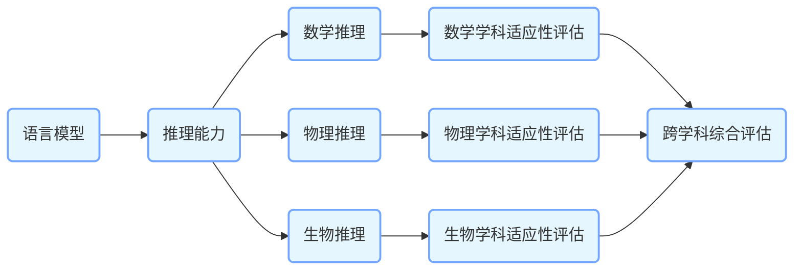

# 语言模型推理能力的跨学科适应性评估研究

> 关键词：语言模型、推理能力、跨学科适应性、评估研究、自然语言处理

> 摘要：本文聚焦于语言模型推理能力的跨学科适应性评估研究。随着语言模型在各个领域的广泛应用，其推理能力在不同学科场景下的表现和适应性变得至关重要。文章首先介绍了研究的背景，包括目的、预期读者、文档结构和相关术语。接着阐述了核心概念及联系，通过文本示意图和 Mermaid 流程图进行清晰展示。详细讲解了核心算法原理和具体操作步骤，并结合 Python 源代码进行说明。给出了相关的数学模型和公式，辅以举例加深理解。通过项目实战，展示了代码的实际案例和详细解释。探讨了语言模型推理能力在实际应用中的场景，推荐了学习资源、开发工具框架和相关论文著作。最后总结了未来发展趋势与挑战，并提供了常见问题解答和扩展阅读参考资料。

## 1. 背景介绍 
### 1.1 目的和范围
近年来，语言模型取得了显著的进展，如 GPT 系列等模型在自然语言处理任务中展现出了强大的能力。然而，不同学科具有各自独特的知识体系、逻辑结构和推理方式。评估语言模型推理能力在跨学科场景下的适应性，有助于了解其在不同学科领域的优势和局限性，为模型的改进和应用提供有价值的参考。本研究的范围涵盖了多个常见学科领域，如数学、物理、生物、历史等，旨在全面评估语言模型在不同学科推理任务中的表现。

### 1.2 预期读者
本文的预期读者包括自然语言处理领域的研究人员、对语言模型应用感兴趣的跨学科研究者、从事人工智能教育的教师以及相关领域的工程师。这些读者希望深入了解语言模型推理能力的跨学科适应性评估方法和结果，以便在自己的研究或工作中更好地应用语言模型。

### 1.3 文档结构概述
本文将按照以下结构展开：首先介绍核心概念与联系，包括语言模型推理能力、跨学科适应性等概念的原理和相互关系，并通过示意图和流程图进行展示。接着阐述核心算法原理和具体操作步骤，使用 Python 代码进行详细说明。然后给出相关的数学模型和公式，并举例说明。通过项目实战，展示代码的实际应用和详细解释。探讨语言模型推理能力在实际应用场景中的表现。推荐学习资源、开发工具框架和相关论文著作。最后总结未来发展趋势与挑战，提供常见问题解答和扩展阅读参考资料。

### 1.4 术语表
#### 1.4.1 核心术语定义
- **语言模型**：是一种基于概率统计的模型，用于预测文本序列中下一个可能出现的单词或字符。常见的语言模型有基于规则的模型、统计语言模型和深度学习语言模型。
- **推理能力**：指语言模型根据给定的信息，通过逻辑推导、知识运用等方式得出合理结论的能力。在不同学科中，推理能力表现为不同的形式，如数学中的逻辑推理、物理中的因果推理等。
- **跨学科适应性**：指语言模型的推理能力在不同学科领域的适应程度，即能否在不同学科的知识体系和推理方式下有效工作。

#### 1.4.2 相关概念解释
- **自然语言处理**：是计算机科学与语言学的交叉领域，旨在让计算机理解和处理人类语言。语言模型是自然语言处理中的重要工具。
- **知识图谱**：是一种以图的形式表示知识的方法，节点表示实体，边表示实体之间的关系。知识图谱可以为语言模型提供结构化的知识，辅助其推理。

#### 1.4.3 缩略词列表
- **NLP**：Natural Language Processing，自然语言处理
- **GPT**：Generative Pretrained Transformer，生成式预训练变换器

## 2. 核心概念与联系 
### 核心概念原理
语言模型的推理能力基于其对大量文本数据的学习和理解。通过预训练过程，语言模型学习到了语言的模式、语法和语义信息。在推理任务中，语言模型根据输入的问题或信息，结合自身学习到的知识，尝试生成合理的答案。

跨学科适应性则要求语言模型能够适应不同学科的知识体系和推理方式。不同学科的知识具有不同的结构和特点，例如数学学科注重逻辑推导和证明，物理学科强调因果关系和实验验证。语言模型需要能够理解和运用这些不同的知识结构，才能在跨学科场景中有效推理。

### 文本示意图
```plaintext
                语言模型
                  |
                  |  推理能力
                  |
  +----------------+----------------+
  |                |                |
数学学科适应性  物理学科适应性  生物学科适应性
  |                |                |
  +----------------+----------------+
  |
跨学科综合评估
```

### Mermaid 流程图


## 3. 核心算法原理 & 具体操作步骤 
### 核心算法原理
为了评估语言模型的推理能力在跨学科场景下的适应性，我们可以采用基于问答任务的评估方法。具体来说，我们会收集不同学科的推理问题，将这些问题输入到语言模型中，然后根据模型的回答进行评分。

在评分过程中，我们可以使用多种指标，如准确率、召回率、F1 值等。准确率表示模型回答正确的问题占总问题数的比例，召回率表示模型能够回答出的正确问题占所有正确问题的比例，F1 值是准确率和召回率的调和平均数。

### 具体操作步骤
1. **问题收集**：从不同学科的教材、试卷、学术论文等资源中收集推理问题，并按照学科进行分类。
2. **数据预处理**：对收集到的问题进行清洗和标注，确保问题的质量和一致性。
3. **模型推理**：将预处理后的问题输入到语言模型中，获取模型的回答。
4. **评分计算**：根据模型的回答和标准答案，计算准确率、召回率和 F1 值等指标。
5. **结果分析**：分析不同学科的评分结果，评估语言模型的跨学科适应性。

### Python 源代码
```python
import numpy as np

# 模拟语言模型的回答和标准答案
model_answers = ["answer1", "answer2", "answer3"]
true_answers = ["answer1", "wrong_answer", "answer3"]

# 计算准确率
accuracy = np.mean(np.array(model_answers) == np.array(true_answers))
print(f"Accuracy: {accuracy}")

# 计算召回率和 F1 值（假设这里简单定义正确回答为正例）
true_positives = np.sum((np.array(model_answers) == np.array(true_answers)) & (np.array(true_answers)!= ""))
false_negatives = np.sum((np.array(model_answers)!= np.array(true_answers)) & (np.array(true_answers)!= ""))
recall = true_positives / (true_positives + false_negatives)
precision = true_positives / np.sum(np.array(model_answers)!= "")
f1 = 2 * (precision * recall) / (precision + recall)

print(f"Recall: {recall}")
print(f"F1-score: {f1}")
```

## 4. 数学模型和公式 & 详细讲解 & 举例说明 
### 准确率
准确率（Accuracy）是指模型预测正确的样本数占总样本数的比例。其数学公式为：
$$Accuracy = \frac{TP + TN}{TP + TN + FP + FN}$$
其中，$TP$ 表示真正例（模型预测为正例，实际也为正例），$TN$ 表示真反例（模型预测为反例，实际也为反例），$FP$ 表示假正例（模型预测为正例，实际为反例），$FN$ 表示假反例（模型预测为反例，实际为正例）。

例如，在一个包含 100 个问题的评估中，模型正确回答了 80 个问题，那么准确率为：
$$Accuracy = \frac{80}{100} = 0.8$$

### 召回率
召回率（Recall）是指模型预测为正例的样本中，实际为正例的比例。其数学公式为：
$$Recall = \frac{TP}{TP + FN}$$

例如，在一个包含 50 个正例的评估中，模型正确预测出了 40 个正例，那么召回率为：
$$Recall = \frac{40}{40 + 10} = 0.8$$

### F1 值
F1 值是准确率和召回率的调和平均数，用于综合衡量模型的性能。其数学公式为：
$$F1 = 2 \times \frac{Precision \times Recall}{Precision + Recall}$$
其中，$Precision$ 表示精确率，即模型预测为正例的样本中，实际为正例的比例，公式为：
$$Precision = \frac{TP}{TP + FP}$$

例如，假设准确率为 0.8，召回率为 0.9，那么 F1 值为：
$$F1 = 2 \times \frac{0.8 \times 0.9}{0.8 + 0.9} \approx 0.847$$

## 5. 项目实战：代码实际案例和详细解释说明 
### 5.1  开发环境搭建
为了进行语言模型推理能力的跨学科适应性评估，我们需要搭建以下开发环境：
- **Python 环境**：建议使用 Python 3.7 及以上版本。
- **深度学习框架**：可以选择 PyTorch 或 TensorFlow 等深度学习框架，用于加载和运行语言模型。
- **数据集**：收集不同学科的推理问题数据集，并进行预处理。

以下是安装必要库的示例命令：
```bash
pip install torch transformers numpy pandas
```

### 5.2  源代码详细实现和代码解读
```python
import torch
from transformers import AutoTokenizer, AutoModelForCausalLM
import pandas as pd
import numpy as np

# 加载语言模型和分词器
model_name = "gpt2"
tokenizer = AutoTokenizer.from_pretrained(model_name)
model = AutoModelForCausalLM.from_pretrained(model_name)

# 加载数据集
data = pd.read_csv("questions.csv")

# 定义评估函数
def evaluate(model, tokenizer, questions, answers):
    correct_count = 0
    total_count = len(questions)
    model_answers = []
    
    for question, answer in zip(questions, answers):
        input_ids = tokenizer.encode(question, return_tensors="pt")
        output = model.generate(input_ids)
        output_text = tokenizer.decode(output[0], skip_special_tokens=True)
        model_answers.append(output_text)
        
        if output_text.strip() == answer.strip():
            correct_count += 1
    
    accuracy = correct_count / total_count
    return accuracy, model_answers

# 提取问题和答案
questions = data["question"].tolist()
answers = data["answer"].tolist()

# 进行评估
accuracy, model_answers = evaluate(model, tokenizer, questions, answers)
print(f"Accuracy: {accuracy}")
```

### 代码解读与分析
1. **加载语言模型和分词器**：使用 `transformers` 库加载预训练的语言模型和对应的分词器。
2. **加载数据集**：使用 `pandas` 库读取包含问题和答案的 CSV 文件。
3. **定义评估函数**：遍历每个问题，将问题输入到语言模型中，获取模型的回答。比较模型的回答和标准答案，统计正确回答的数量，计算准确率。
4. **进行评估**：调用评估函数，输出评估结果。

需要注意的是，上述代码只是一个简单的示例，实际应用中可能需要根据具体情况进行调整和优化。例如，可以使用更复杂的评分指标，对回答进行更细致的处理等。

## 6. 实际应用场景 
### 教育领域
在教育领域，语言模型的推理能力可以用于智能辅导系统。例如，在数学、物理等学科的学习中，学生可以向智能辅导系统提出推理问题，系统可以根据语言模型的回答为学生提供解答和指导。通过评估语言模型在不同学科的推理能力，可以选择更适合的模型应用于教育场景，提高教学效果。

### 科研领域
在科研领域，语言模型可以辅助科研人员进行文献综述、知识发现等工作。例如，在生物学科中，科研人员可以使用语言模型对大量的生物文献进行推理分析，发现潜在的研究方向和规律。评估语言模型的跨学科适应性可以帮助科研人员选择更合适的模型，提高科研效率。

### 智能客服领域
在智能客服领域，语言模型可以用于回答用户的问题。不同行业的智能客服可能涉及不同学科的知识，如金融客服需要具备金融知识，医疗客服需要具备医学知识。通过评估语言模型在跨学科场景下的推理能力，可以提高智能客服的回答准确性和质量，提升用户体验。

## 7. 工具和资源推荐
### 7.1 学习资源推荐
#### 7.1.1 书籍推荐
- 《自然语言处理入门》：这本书系统地介绍了自然语言处理的基本概念、算法和技术，适合初学者入门。
- 《深度学习》：深度学习是语言模型的核心技术之一，这本书详细讲解了深度学习的原理和应用。
- 《知识图谱：方法、实践与应用》：知识图谱可以为语言模型提供结构化的知识，这本书介绍了知识图谱的构建和应用方法。

#### 7.1.2 在线课程
- Coursera 上的“Natural Language Processing Specialization”：这是一个由顶尖高校教授授课的自然语言处理专项课程，涵盖了语言模型、文本分类、机器翻译等多个方面的内容。
- edX 上的“Deep Learning for Natural Language Processing”：该课程深入讲解了深度学习在自然语言处理中的应用，包括语言模型的训练和优化。

#### 7.1.3 技术博客和网站
- Hugging Face Blog：Hugging Face 是一家专注于自然语言处理的公司，其博客上有很多关于语言模型的最新研究成果和应用案例。
- Towards Data Science：这是一个数据科学领域的知名博客平台，上面有很多关于自然语言处理和语言模型的高质量文章。

### 7.2 开发工具框架推荐
#### 7.2.1 IDE和编辑器
- PyCharm：是一款专门为 Python 开发设计的集成开发环境，具有代码编辑、调试、版本控制等功能，非常适合开发自然语言处理项目。
- Jupyter Notebook：是一个交互式的开发环境，可以方便地进行代码编写、运行和可视化展示，常用于数据分析和模型实验。

#### 7.2.2 调试和性能分析工具
- TensorBoard：是 TensorFlow 提供的一个可视化工具，可以用于监控模型的训练过程、分析模型的性能等。
- PyTorch Profiler：是 PyTorch 提供的一个性能分析工具，可以帮助开发者找出代码中的性能瓶颈。

#### 7.2.3 相关框架和库
- Transformers：是 Hugging Face 开发的一个开源库，提供了丰富的预训练语言模型和工具，方便开发者进行自然语言处理任务的开发。
- NLTK：是一个自然语言处理工具包，提供了多种文本处理的功能，如分词、词性标注、命名实体识别等。

### 7.3 相关论文著作推荐
#### 7.3.1 经典论文
- “Attention Is All You Need”：这篇论文提出了 Transformer 架构，是现代语言模型的基础。
- “BERT: Pre-training of Deep Bidirectional Transformers for Language Understanding”：这篇论文介绍了 BERT 模型，开创了预训练语言模型的新时代。

#### 7.3.2 最新研究成果
- “GPT-3: Language Models are Few-Shot Learners”：这篇论文介绍了 GPT-3 模型，展示了其在少样本学习方面的强大能力。
- “XLNet: Generalized Autoregressive Pretraining for Language Understanding”：这篇论文提出了 XLNet 模型，在多个自然语言处理任务上取得了优异的成绩。

#### 7.3.3 应用案例分析
- “Applying Language Models to Medical Question Answering”：这篇论文介绍了如何将语言模型应用于医疗问答系统，分析了语言模型在医疗领域的应用效果和挑战。
- “Using Language Models for Financial News Analysis”：这篇论文探讨了如何使用语言模型进行金融新闻分析，为金融领域的决策提供支持。

## 8. 总结：未来发展趋势与挑战
### 未来发展趋势
- **多模态融合**：未来的语言模型可能会融合图像、音频等多种模态的信息，进一步提高其推理能力和跨学科适应性。例如，在生物学科中，可以结合生物图像和文本信息进行更全面的推理分析。
- **知识增强**：通过引入知识图谱等结构化知识，增强语言模型的推理能力。知识图谱可以为语言模型提供更准确的知识表示和推理依据，提高其在不同学科领域的表现。
- **个性化推理**：根据用户的需求和背景，为用户提供个性化的推理服务。例如，在教育领域，可以根据学生的学习情况和学科偏好，为学生提供更适合的推理指导。

### 挑战
- **数据质量和多样性**：不同学科的知识具有不同的特点和表达方式，需要大量高质量、多样化的数据进行训练。目前，跨学科数据的收集和标注还存在一定的困难。
- **推理的可解释性**：语言模型的推理过程往往是黑盒的，难以解释其得出结论的依据。在一些对可解释性要求较高的领域，如医疗、金融等，这是一个亟待解决的问题。
- **跨学科知识的融合**：不同学科的知识体系和推理方式差异较大，如何将这些知识有效地融合到语言模型中，是一个挑战。

## 9. 附录：常见问题与解答
### 问题 1：如何选择适合的语言模型进行跨学科推理评估？
解答：可以根据模型的性能、适用场景和数据规模等因素进行选择。一般来说，预训练模型如 GPT 系列、BERT 等在自然语言处理任务中表现较好，可以作为参考。同时，还需要考虑模型的计算资源需求和训练成本。

### 问题 2：如何提高语言模型在跨学科场景下的推理能力？
解答：可以通过以下几种方法提高语言模型的跨学科推理能力：1. 使用更多的跨学科数据进行训练；2. 引入知识图谱等结构化知识；3. 设计更合理的模型架构和训练方法。

### 问题 3：评估语言模型推理能力的指标有哪些局限性？
解答：常见的评估指标如准确率、召回率等有一定的局限性。例如，准确率只考虑了回答的正确性，没有考虑回答的完整性和逻辑性。在实际应用中，可能需要结合多种指标进行综合评估。

## 10. 扩展阅读 & 参考资料
- Goodfellow, I. J., Bengio, Y., & Courville, A. (2016). Deep Learning. MIT Press.
- Jurafsky, D., & Martin, J. H. (2021). Speech and Language Processing. Pearson.
- Vaswani, A., Shazeer, N., Parmar, N., Uszkoreit, J., Jones, L., Gomez, A. N.,... & Polosukhin, I. (2017). Attention is all you need. Advances in neural information processing systems, 5998-6008.
- Devlin, J., Chang, M. W., Lee, K., & Toutanova, K. (2018). Bert: Pre-training of deep bidirectional transformers for language understanding. arXiv preprint arXiv:1810.04805.

作者：AI天才研究院/AI Genius Institute & 禅与计算机程序设计艺术 /Zen And The Art of Computer Programming