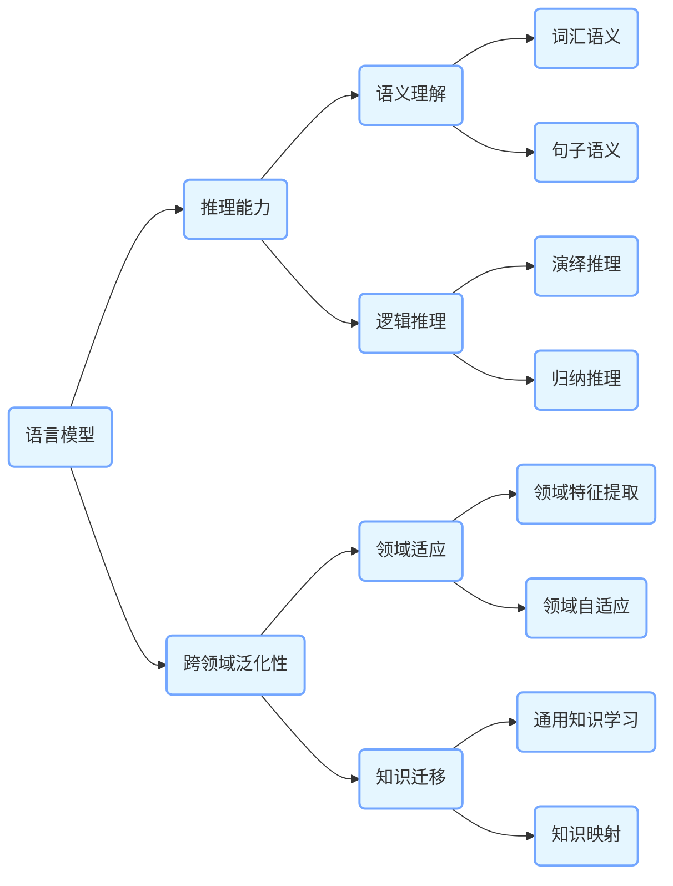

# 语言模型推理能力的跨领域泛化性评估研究

> 关键词：语言模型、推理能力、跨领域泛化性、评估研究、自然语言处理

> 摘要：本研究聚焦于语言模型推理能力的跨领域泛化性评估。随着语言模型在自然语言处理领域的广泛应用，其在不同领域的推理表现成为衡量模型性能的关键指标。文章首先介绍了研究的背景、目的、预期读者和文档结构，接着阐述了核心概念及联系，包括推理能力和跨领域泛化性的原理与架构。详细讲解了用于评估的核心算法原理及具体操作步骤，给出了相应的Python代码。同时，运用数学模型和公式对评估过程进行了深入分析，并举例说明。通过项目实战展示了评估过程的代码实现和解读。探讨了实际应用场景，推荐了相关的学习资源、开发工具框架和论文著作。最后总结了未来发展趋势与挑战，解答了常见问题，并提供了扩展阅读和参考资料，旨在为语言模型推理能力的跨领域泛化性评估提供全面、深入的研究和指导。

## 1. 背景介绍 
### 1.1 目的和范围
随着自然语言处理技术的飞速发展，语言模型如GPT - 3、BERT等取得了显著的成果。然而，这些模型在单一领域的表现与在多个不同领域的泛化能力存在差异。本研究的目的在于建立一套科学、有效的评估体系，以准确衡量语言模型推理能力的跨领域泛化性。研究范围涵盖了多种类型的语言模型，包括基于Transformer架构的模型、传统的循环神经网络模型等，以及多个不同的领域，如医疗、金融、法律等。

### 1.2 预期读者
本文的预期读者包括自然语言处理领域的研究人员、开发者、数据科学家，以及对语言模型性能评估感兴趣的学者和从业人员。对于正在进行语言模型研发的人员，本文提供的评估方法和技术可以帮助他们优化模型；对于研究语言模型理论的学者，本文的分析和结论可以为其提供新的研究视角。

### 1.3 文档结构概述
本文共分为十个部分。第一部分为背景介绍，阐述研究的目的、范围、预期读者和文档结构。第二部分介绍核心概念与联系，解释推理能力和跨领域泛化性的原理，并给出相应的架构示意图和流程图。第三部分讲解核心算法原理和具体操作步骤，通过Python代码详细说明。第四部分运用数学模型和公式对评估过程进行分析，并举例说明。第五部分通过项目实战展示评估过程的代码实现和解读。第六部分探讨语言模型推理能力跨领域泛化性评估的实际应用场景。第七部分推荐相关的学习资源、开发工具框架和论文著作。第八部分总结未来发展趋势与挑战。第九部分解答常见问题。第十部分提供扩展阅读和参考资料。

### 1.4 术语表
#### 1.4.1 核心术语定义
- **语言模型**：一种基于概率统计或深度学习技术，对自然语言文本进行建模的模型，用于预测下一个词或生成文本。
- **推理能力**：语言模型根据给定的输入信息，通过逻辑分析、知识运用等方式得出合理结论的能力。
- **跨领域泛化性**：语言模型在不同领域的数据上都能保持良好性能的能力，即从一个领域学习到的知识和能力能够迁移到其他领域。

#### 1.4.2 相关概念解释
- **领域**：具有特定主题和知识体系的范围，如医疗领域涉及医学知识、疾病诊断等；金融领域涉及股票市场、投资分析等。
- **评估指标**：用于衡量语言模型推理能力跨领域泛化性的量化指标，如准确率、召回率、F1值等。

#### 1.4.3 缩略词列表
- **NLP**：Natural Language Processing，自然语言处理
- **RNN**：Recurrent Neural Network，循环神经网络
- **LSTM**：Long Short - Term Memory，长短期记忆网络
- **GRU**：Gated Recurrent Unit，门控循环单元
- **Transformer**：一种基于自注意力机制的深度学习架构

## 2. 核心概念与联系 

### 推理能力原理
推理能力是语言模型理解和处理自然语言文本的重要能力之一。它涉及到对文本中语义、逻辑关系的分析和理解。例如，在一个问答系统中，当用户提出一个问题时，语言模型需要通过对问题的理解，结合自身的知识储备，进行推理得出答案。从原理上来说，推理能力基于模型对大量文本数据的学习，通过学习文本中的模式和规律，构建语义和逻辑表示。

### 跨领域泛化性原理
跨领域泛化性要求语言模型能够在不同领域的数据上都能保持较好的性能。这是因为在实际应用中，语言模型可能会面临来自多个不同领域的输入。例如，一个智能客服系统可能会同时处理医疗、金融等不同领域的客户咨询。语言模型的跨领域泛化性取决于其学习到的知识的通用性和可迁移性。模型需要能够从一个领域学习到的知识中抽象出通用的模式和规律，并将其应用到其他领域。

### 核心概念架构示意图


### 核心概念联系说明
推理能力和跨领域泛化性是相互关联的。良好的推理能力是实现跨领域泛化性的基础，只有当语言模型具备较强的推理能力时，才能在不同领域的数据上进行有效的推理。而跨领域泛化性的提升又可以进一步促进推理能力的发展，因为在不同领域的学习和应用可以让模型接触到更多样化的推理场景，从而丰富其推理知识和经验。

## 3. 核心算法原理 & 具体操作步骤 

### 核心算法原理
我们采用基于对比学习的方法来评估语言模型推理能力的跨领域泛化性。对比学习的核心思想是通过对比正样本和负样本，使模型能够学习到更具区分性的特征。在本研究中，我们将同一领域的样本作为正样本，不同领域的样本作为负样本。具体来说，我们使用一个编码器将输入的文本转换为向量表示，然后计算正样本和负样本之间的相似度。通过最大化正样本之间的相似度，最小化负样本之间的相似度，来训练模型。

### Python代码实现
```python
import torch
import torch.nn as nn
import torch.optim as optim

# 定义编码器
class Encoder(nn.Module):
    def __init__(self, input_dim, hidden_dim, output_dim):
        super(Encoder, self).__init__()
        self.fc1 = nn.Linear(input_dim, hidden_dim)
        self.relu = nn.ReLU()
        self.fc2 = nn.Linear(hidden_dim, output_dim)

    def forward(self, x):
        x = self.fc1(x)
        x = self.relu(x)
        x = self.fc2(x)
        return x

# 定义对比损失函数
class ContrastiveLoss(nn.Module):
    def __init__(self, margin=1.0):
        super(ContrastiveLoss, self).__init__()
        self.margin = margin

    def forward(self, output1, output2, label):
        euclidean_distance = nn.functional.pairwise_distance(output1, output2)
        loss_contrastive = torch.mean((1 - label) * torch.pow(euclidean_distance, 2) +
                                      label * torch.pow(torch.clamp(self.margin - euclidean_distance, min=0.0), 2))
        return loss_contrastive

# 训练过程
def train_model(encoder, train_loader, criterion, optimizer, num_epochs):
    encoder.train()
    for epoch in range(num_epochs):
        running_loss = 0.0
        for inputs1, inputs2, labels in train_loader:
            optimizer.zero_grad()
            outputs1 = encoder(inputs1)
            outputs2 = encoder(inputs2)
            loss = criterion(outputs1, outputs2, labels)
            loss.backward()
            optimizer.step()
            running_loss += loss.item()
        print(f'Epoch {epoch + 1}, Loss: {running_loss / len(train_loader)}')

# 示例参数设置
input_dim = 100
hidden_dim = 50
output_dim = 20
margin = 1.0
num_epochs = 10
learning_rate = 0.001

# 创建编码器和损失函数
encoder = Encoder(input_dim, hidden_dim, output_dim)
criterion = ContrastiveLoss(margin)
optimizer = optim.Adam(encoder.parameters(), lr=learning_rate)

# 这里假设 train_loader 是一个包含正样本、负样本和标签的 DataLoader
# train_loader =...

# 训练模型
train_model(encoder, train_loader, criterion, optimizer, num_epochs)
```

### 具体操作步骤
1. **数据准备**：收集不同领域的文本数据，并将其划分为训练集和测试集。对数据进行预处理，如分词、词向量编码等。
2. **模型初始化**：初始化编码器模型，设置模型的输入维度、隐藏维度和输出维度。
3. **定义损失函数和优化器**：使用对比损失函数和Adam优化器。
4. **训练模型**：将训练数据输入到模型中，通过反向传播更新模型参数。
5. **评估模型**：使用测试数据评估模型的推理能力和跨领域泛化性，计算评估指标。

## 4. 数学模型和公式 & 详细讲解 & 举例说明 

### 对比损失函数公式
对比损失函数的公式为：
$$
L_{contrastive} = \frac{1}{N} \sum_{i=1}^{N} (1 - y_i) \cdot d_i^2 + y_i \cdot \max(0, m - d_i)^2
$$
其中，$N$ 是样本数量，$y_i$ 是样本标签（$y_i = 0$ 表示正样本对，$y_i = 1$ 表示负样本对），$d_i$ 是样本对之间的欧氏距离，$m$ 是边际参数。

### 详细讲解
- 当 $y_i = 0$ 时，即正样本对，损失函数为 $d_i^2$。这意味着我们希望正样本对之间的距离尽可能小，即相似度尽可能高。
- 当 $y_i = 1$ 时，即负样本对，损失函数为 $\max(0, m - d_i)^2$。这意味着我们希望负样本对之间的距离大于边际 $m$，如果小于 $m$，则会产生损失。

### 举例说明
假设我们有两个样本对：
- 正样本对：$x_1$ 和 $x_2$，它们的向量表示分别为 $v_1$ 和 $v_2$，欧氏距离 $d_1 = \|v_1 - v_2\| = 0.2$，标签 $y_1 = 0$。
- 负样本对：$x_3$ 和 $x_4$，它们的向量表示分别为 $v_3$ 和 $v_4$，欧氏距离 $d_2 = \|v_3 - v_4\| = 0.8$，标签 $y_2 = 1$，边际 $m = 1.0$。

则对比损失为：
$$
L_{contrastive} = \frac{1}{2} \left[(1 - 0) \cdot 0.2^2 + 1 \cdot \max(0, 1.0 - 0.8)^2\right] = \frac{1}{2} (0.04 + 0.04) = 0.04
$$

## 5. 项目实战：代码实际案例和详细解释说明 

### 5.1  开发环境搭建
- **操作系统**：推荐使用Linux系统，如Ubuntu 18.04或更高版本。
- **Python环境**：使用Python 3.7或更高版本。可以使用Anaconda来管理Python环境，创建一个新的虚拟环境：
```bash
conda create -n language_model_eval python=3.8
conda activate language_model_eval
```
- **依赖库安装**：安装必要的Python库，如PyTorch、NumPy、Pandas等。
```bash
pip install torch numpy pandas
```

### 5.2  源代码详细实现和代码解读
```python
import torch
import torch.nn as nn
import torch.optim as optim
import numpy as np
import pandas as pd
from torch.utils.data import Dataset, DataLoader

# 自定义数据集类
class CustomDataset(Dataset):
    def __init__(self, data, labels):
        self.data = data
        self.labels = labels

    def __len__(self):
        return len(self.data)

    def __getitem__(self, idx):
        return self.data[idx], self.data[idx + 1], self.labels[idx]

# 定义编码器
class Encoder(nn.Module):
    def __init__(self, input_dim, hidden_dim, output_dim):
        super(Encoder, self).__init__()
        self.fc1 = nn.Linear(input_dim, hidden_dim)
        self.relu = nn.ReLU()
        self.fc2 = nn.Linear(hidden_dim, output_dim)

    def forward(self, x):
        x = self.fc1(x)
        x = self.relu(x)
        x = self.fc2(x)
        return x

# 定义对比损失函数
class ContrastiveLoss(nn.Module):
    def __init__(self, margin=1.0):
        super(ContrastiveLoss, self).__init__()
        self.margin = margin

    def forward(self, output1, output2, label):
        euclidean_distance = nn.functional.pairwise_distance(output1, output2)
        loss_contrastive = torch.mean((1 - label) * torch.pow(euclidean_distance, 2) +
                                      label * torch.pow(torch.clamp(self.margin - euclidean_distance, min=0.0), 2))
        return loss_contrastive

# 训练过程
def train_model(encoder, train_loader, criterion, optimizer, num_epochs):
    encoder.train()
    for epoch in range(num_epochs):
        running_loss = 0.0
        for inputs1, inputs2, labels in train_loader:
            optimizer.zero_grad()
            outputs1 = encoder(inputs1)
            outputs2 = encoder(inputs2)
            loss = criterion(outputs1, outputs2, labels)
            loss.backward()
            optimizer.step()
            running_loss += loss.item()
        print(f'Epoch {epoch + 1}, Loss: {running_loss / len(train_loader)}')

# 示例数据生成
input_dim = 100
num_samples = 1000
data = np.random.randn(num_samples, input_dim)
labels = np.random.randint(0, 2, num_samples - 1)

# 创建数据集和数据加载器
dataset = CustomDataset(data, labels)
train_loader = DataLoader(dataset, batch_size=32, shuffle=True)

# 示例参数设置
hidden_dim = 50
output_dim = 20
margin = 1.0
num_epochs = 10
learning_rate = 0.001

# 创建编码器和损失函数
encoder = Encoder(input_dim, hidden_dim, output_dim)
criterion = ContrastiveLoss(margin)
optimizer = optim.Adam(encoder.parameters(), lr=learning_rate)

# 训练模型
train_model(encoder, train_loader, criterion, optimizer, num_epochs)
```

### 代码解读与分析
1. **自定义数据集类**：`CustomDataset` 类继承自 `torch.utils.data.Dataset`，用于封装数据和标签。`__len__` 方法返回数据集的长度，`__getitem__` 方法根据索引返回样本对和标签。
2. **编码器**：`Encoder` 类是一个简单的全连接神经网络，包含两个线性层和一个ReLU激活函数。它将输入的文本向量编码为低维向量。
3. **对比损失函数**：`ContrastiveLoss` 类实现了对比损失函数，根据正样本和负样本的标签计算损失。
4. **训练过程**：`train_model` 函数用于训练编码器模型。在每个epoch中，将训练数据输入到模型中，计算损失并进行反向传播更新模型参数。
5. **示例数据生成**：使用 `numpy` 生成随机数据和标签，模拟实际的文本数据。
6. **数据加载器**：使用 `torch.utils.data.DataLoader` 创建数据加载器，用于批量加载数据。

## 6. 实际应用场景 
### 智能客服系统
在智能客服系统中，语言模型需要处理来自不同领域的客户咨询，如电商、金融、医疗等。通过评估语言模型推理能力的跨领域泛化性，可以选择性能更好的模型，提高客服系统的响应准确性和效率。例如，当客户咨询电商商品的退换货政策时，模型需要能够准确理解问题并给出合理的答案；当客户咨询金融投资建议时，模型也需要能够进行有效的推理和解答。

### 信息检索系统
信息检索系统需要从大量的文本数据中检索出与用户查询相关的信息。不同领域的文本数据具有不同的特点和语义，语言模型的跨领域泛化性可以帮助信息检索系统在不同领域的数据上都能取得较好的检索效果。例如，在医疗领域的信息检索中，模型需要能够理解医学术语和疾病诊断信息；在科技领域的信息检索中，模型需要能够处理技术文献和专利信息。

### 自动问答系统
自动问答系统旨在根据用户的问题提供准确的答案。在实际应用中，用户的问题可能涉及多个不同的领域。通过评估语言模型的跨领域泛化性，可以提高自动问答系统的通用性和实用性。例如，一个面向大众的自动问答系统可能会收到关于历史、科学、文化等多个领域的问题，模型需要能够在不同领域的知识之间进行有效的推理和转换。

## 7. 工具和资源推荐
### 7.1 学习资源推荐
#### 7.1.1 书籍推荐
- 《自然语言处理入门》：这本书详细介绍了自然语言处理的基本概念、算法和技术，适合初学者入门。
- 《深度学习》：由Ian Goodfellow、Yoshua Bengio和Aaron Courville撰写，是深度学习领域的经典教材，涵盖了神经网络、卷积神经网络、循环神经网络等内容。
- 《Python自然语言处理》：通过Python代码示例，介绍了自然语言处理的各种技术和应用，包括文本分类、情感分析、信息提取等。

#### 7.1.2 在线课程
- Coursera上的“Natural Language Processing Specialization”：由顶尖大学的教授授课，系统地介绍了自然语言处理的各个方面，包括语言模型、机器翻译、问答系统等。
- edX上的“Deep Learning for Natural Language Processing”：深入讲解了深度学习在自然语言处理中的应用，包括Transformer架构、预训练模型等。

#### 7.1.3 技术博客和网站
- Medium上的“Towards Data Science”：有很多关于自然语言处理和机器学习的高质量文章，涵盖了最新的研究成果和实践经验。
- arXiv.org：是一个预印本平台，提供了大量的学术论文，包括自然语言处理领域的最新研究。

### 7.2 开发工具框架推荐
#### 7.2.1 IDE和编辑器
- PyCharm：是一款专业的Python集成开发环境，具有代码自动补全、调试、版本控制等功能，适合Python开发。
- Jupyter Notebook：是一个交互式的开发环境，支持Python、R等多种编程语言，方便进行数据探索和模型实验。

#### 7.2.2 调试和性能分析工具
- TensorBoard：是TensorFlow的可视化工具，可以用于可视化模型的训练过程、损失函数变化、模型结构等。
- Py-Spy：是一个Python性能分析工具，可以分析Python程序的CPU使用率、函数调用时间等。

#### 7.2.3 相关框架和库
- PyTorch：是一个开源的深度学习框架，具有动态图、易于使用等特点，广泛应用于自然语言处理领域。
- Hugging Face Transformers：提供了大量的预训练语言模型，如BERT、GPT - 2等，方便进行模型的微调和解码。

### 7.3 相关论文著作推荐
#### 7.3.1 经典论文
- “Attention Is All You Need”：介绍了Transformer架构，是自然语言处理领域的里程碑式论文。
- “BERT: Pre-training of Deep Bidirectional Transformers for Language Understanding”：提出了BERT模型，开启了预训练语言模型的新时代。

#### 7.3.2 最新研究成果
- “RoBERTa: A Robustly Optimized BERT Pretraining Approach”：对BERT模型进行了优化，提高了模型的性能。
- “GPT - 3: Language Models are Few - Shot Learners”：介绍了GPT - 3模型，展示了其强大的语言生成和推理能力。

#### 7.3.3 应用案例分析
- “Using Language Models for Medical Question Answering”：分析了语言模型在医疗问答系统中的应用，探讨了模型的推理能力和跨领域泛化性。
- “Financial Text Analysis with Language Models”：研究了语言模型在金融文本分析中的应用，包括风险评估、市场预测等。

## 8. 总结：未来发展趋势与挑战
### 未来发展趋势
- **多模态融合**：未来的语言模型可能会融合图像、音频等多模态信息，进一步提高推理能力和跨领域泛化性。例如，在医疗领域，结合医学影像和文本信息可以更准确地进行疾病诊断。
- **知识增强**：将外部知识图谱与语言模型相结合，为模型提供更丰富的知识，增强其推理能力。例如，在历史领域的问答系统中，引入历史事件和人物的知识图谱可以提高回答的准确性。
- **零样本和少样本学习**：提高语言模型在零样本和少样本情况下的推理能力和跨领域泛化性，减少对大量标注数据的依赖。

### 挑战
- **数据偏差**：不同领域的数据可能存在偏差，这会影响语言模型的跨领域泛化性。例如，某些领域的数据可能存在标注不准确、数据分布不均衡等问题。
- **计算资源需求**：训练和评估大规模语言模型需要大量的计算资源，这限制了模型的发展和应用。
- **可解释性**：语言模型的推理过程往往是黑盒的，缺乏可解释性。在一些对安全性和可靠性要求较高的领域，如医疗和金融，可解释性是一个重要的挑战。

## 9. 附录：常见问题与解答
### 问题1：如何选择合适的评估指标来衡量语言模型推理能力的跨领域泛化性？
答：可以选择准确率、召回率、F1值等传统的分类评估指标，也可以使用更复杂的指标，如语义相似度、推理一致性等。具体选择应根据评估的任务和数据特点来确定。

### 问题2：对比学习方法在评估语言模型跨领域泛化性中有什么优势？
答：对比学习方法可以通过对比正样本和负样本，使模型学习到更具区分性的特征，从而提高模型在不同领域数据上的泛化能力。它能够有效地捕捉数据之间的相似性和差异性，有助于模型在跨领域场景下进行准确的推理。

### 问题3：如何处理不同领域数据的特征差异？
答：可以采用领域自适应的方法，如特征提取、特征变换等，将不同领域的数据映射到同一特征空间。也可以使用多任务学习的方法，让模型同时学习不同领域的任务，提高其对不同领域特征的适应能力。

## 10. 扩展阅读 & 参考资料
### 扩展阅读
- 《人工智能：现代方法》：全面介绍了人工智能的各个领域，包括自然语言处理、机器学习、知识表示等。
- 《机器学习》：由周志华教授撰写，是机器学习领域的经典教材，涵盖了各种机器学习算法和模型。

### 参考资料
- [Attention Is All You Need](https://arxiv.org/abs/1706.03762)
- [BERT: Pre-training of Deep Bidirectional Transformers for Language Understanding](https://arxiv.org/abs/1810.04805)
- [RoBERTa: A Robustly Optimized BERT Pretraining Approach](https://arxiv.org/abs/1907.11692)
- [GPT - 3: Language Models are Few - Shot Learners](https://arxiv.org/abs/2005.14165)

作者：AI天才研究院/AI Genius Institute & 禅与计算机程序设计艺术 /Zen And The Art of Computer Programming