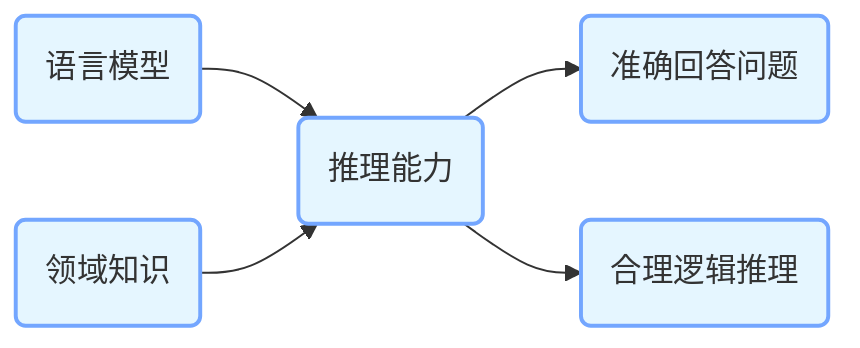

# 语言模型推理能力的领域知识依赖度分析

> 关键词：语言模型、推理能力、领域知识依赖度、自然语言处理、知识图谱

> 摘要：本文旨在深入分析语言模型推理能力与领域知识之间的依赖关系。通过对语言模型核心概念、算法原理、数学模型等方面的详细阐述，结合实际案例和应用场景，探讨领域知识对语言模型推理能力的影响程度。同时，提供相关的工具、资源和论文推荐，最后对语言模型推理能力在领域知识依赖方面的未来发展趋势与挑战进行总结，并给出常见问题的解答和扩展阅读的参考资料。

## 1. 背景介绍 
### 1.1 目的和范围
语言模型在自然语言处理领域取得了显著进展，其推理能力是衡量其性能的重要指标之一。然而，不同领域的知识特点和复杂程度差异很大，语言模型的推理能力在多大程度上依赖于特定领域的知识，是一个值得深入研究的问题。本文的目的就是全面分析语言模型推理能力的领域知识依赖度，范围涵盖语言模型的基本原理、算法实现、实际应用等多个方面。

### 1.2 预期读者
本文预期读者包括自然语言处理领域的研究人员、开发者、学生，以及对语言模型和人工智能技术感兴趣的专业人士。这些读者具备一定的计算机科学和数学基础，希望深入了解语言模型推理能力与领域知识的关系。

### 1.3 文档结构概述
本文首先介绍语言模型推理能力和领域知识的核心概念及其联系，接着阐述相关的核心算法原理和具体操作步骤，通过数学模型和公式进行理论分析，并给出实际案例。然后探讨语言模型推理能力在不同领域的应用场景，推荐相关的学习资源、开发工具和论文著作。最后总结未来发展趋势与挑战，解答常见问题，并提供扩展阅读的参考资料。

### 1.4 术语表
#### 1.4.1 核心术语定义
- **语言模型**：是一种对自然语言文本进行建模的概率模型，用于预测文本序列中每个词出现的概率。
- **推理能力**：指语言模型根据给定的输入信息，通过逻辑分析和知识运用，得出合理结论的能力。
- **领域知识**：特定领域内的专业知识、规则和经验，如医学、法律、金融等领域的知识。
- **领域知识依赖度**：表示语言模型的推理能力受特定领域知识影响的程度。

#### 1.4.2 相关概念解释
- **自然语言处理（NLP）**：是计算机科学与人工智能领域中的一个重要方向，旨在让计算机理解、处理和生成自然语言。
- **知识图谱**：是一种以图的形式表示知识的方法，将实体和它们之间的关系进行可视化展示，有助于语言模型获取和利用领域知识。

#### 1.4.3 缩略词列表
- **NLP**：Natural Language Processing（自然语言处理）
- **GPT**：Generative Pretrained Transformer（生成式预训练变换器）
- **BERT**：Bidirectional Encoder Representations from Transformers（基于变换器的双向编码器表示）

## 2. 核心概念与联系 

### 语言模型推理能力的原理
语言模型的推理能力基于其对大量文本数据的学习和理解。通过预训练过程，语言模型学习到语言的语法、语义和统计规律。在推理阶段，它根据输入的文本信息，结合所学知识进行逻辑推理。例如，对于问题“苹果公司的创始人是谁？”，语言模型会根据其预训练中积累的知识，回答“史蒂夫·乔布斯、史蒂夫·沃兹尼亚克和罗恩·韦恩”。

### 领域知识的特点和作用
领域知识具有专业性、系统性和深度性的特点。不同领域的知识有其独特的概念、规则和逻辑。例如，医学领域的知识涉及疾病诊断、治疗方法和药物作用等；法律领域的知识包括法律法规、案例分析和法律推理等。领域知识对于语言模型的推理能力至关重要，它可以帮助语言模型更准确地理解问题的背景和含义，提供更专业和准确的答案。

### 核心概念的架构示意图

该流程图展示了语言模型、推理能力和领域知识之间的关系。语言模型和领域知识共同作用于推理能力，推理能力的提升表现为能够准确回答问题和进行合理的逻辑推理。

## 3. 核心算法原理 & 具体操作步骤 

### 基于Transformer的语言模型
目前，许多先进的语言模型如GPT和BERT都基于Transformer架构。Transformer的核心是自注意力机制，它可以让模型在处理输入序列时，动态地关注序列中不同位置的信息。以下是一个简单的Python代码示例，展示了如何使用PyTorch实现一个基本的自注意力层：

```python
import torch
import torch.nn as nn

class SelfAttention(nn.Module):
    def __init__(self, input_dim, output_dim):
        super(SelfAttention, self).__init__()
        self.query = nn.Linear(input_dim, output_dim)
        self.key = nn.Linear(input_dim, output_dim)
        self.value = nn.Linear(input_dim, output_dim)
        self.softmax = nn.Softmax(dim=-1)

    def forward(self, x):
        Q = self.query(x)
        K = self.key(x)
        V = self.value(x)
        scores = torch.matmul(Q, K.transpose(-2, -1))
        attention_weights = self.softmax(scores)
        output = torch.matmul(attention_weights, V)
        return output

# 示例使用
input_dim = 128
output_dim = 64
x = torch.randn(32, 10, input_dim)  # 输入数据，batch_size=32，序列长度=10，特征维度=128
attention_layer = SelfAttention(input_dim, output_dim)
output = attention_layer(x)
print(output.shape)
```

### 具体操作步骤
1. **数据预处理**：将输入的文本数据进行分词、编码等处理，转换为模型可以接受的格式。
2. **模型加载**：加载预训练的语言模型，如GPT或BERT。
3. **推理过程**：将预处理后的输入数据输入到模型中，模型根据自身的参数和算法进行推理计算。
4. **结果输出**：将模型的推理结果进行解码和处理，输出最终的答案。

## 4. 数学模型和公式 & 详细讲解 & 举例说明 

### 自注意力机制的数学模型
自注意力机制的核心公式如下：

$$Attention(Q, K, V) = softmax(\frac{QK^T}{\sqrt{d_k}})V$$

其中，$Q$ 是查询矩阵，$K$ 是键矩阵，$V$ 是值矩阵，$d_k$ 是键向量的维度。

### 详细讲解
- $QK^T$ 计算查询向量和键向量之间的相似度得分。
- $\frac{1}{\sqrt{d_k}}$ 是缩放因子，用于避免点积结果过大。
- $softmax$ 函数将相似度得分转换为概率分布，即注意力权重。
- 最后，将注意力权重与值矩阵相乘，得到加权和作为输出。

### 举例说明
假设我们有一个输入序列 $x = [x_1, x_2, x_3]$，每个 $x_i$ 的维度为 $d$。通过线性变换得到 $Q, K, V$ 矩阵：

$Q = [q_1, q_2, q_3]$，$K = [k_1, k_2, k_3]$，$V = [v_1, v_2, v_3]$

计算相似度得分矩阵 $S$：

$$S_{ij} = q_i^Tk_j$$

然后进行缩放和softmax操作得到注意力权重矩阵 $A$：

$$A_{ij} = softmax(\frac{S_{ij}}{\sqrt{d_k}})$$

最后计算输出 $y$：

$$y_i = \sum_{j=1}^{3} A_{ij}v_j$$

## 5. 项目实战：代码实际案例和详细解释说明 

### 5.1  开发环境搭建
- **Python环境**：建议使用Python 3.7及以上版本。
- **深度学习框架**：使用PyTorch进行模型开发和训练。可以通过以下命令安装：
```sh
pip install torch torchvision
```
- **自然语言处理库**：使用Hugging Face的Transformers库，它提供了丰富的预训练语言模型和工具。安装命令如下：
```sh
pip install transformers
```

### 5.2  源代码详细实现和代码解读
以下是一个使用Hugging Face的Transformers库进行问答推理的示例代码：

```python
from transformers import AutoTokenizer, AutoModelForQuestionAnswering
import torch

# 加载预训练的模型和分词器
tokenizer = AutoTokenizer.from_pretrained("bert-large-uncased-whole-word-masking-finetuned-squad")
model = AutoModelForQuestionAnswering.from_pretrained("bert-large-uncased-whole-word-masking-finetuned-squad")

# 定义问题和上下文
question = "What is the capital of France?"
context = "France is a country in Western Europe. Its capital is Paris."

# 对输入进行编码
inputs = tokenizer(question, context, return_tensors='pt')

# 进行推理
with torch.no_grad():
    outputs = model(**inputs)

# 获取答案的起始和结束位置
answer_start_index = outputs.start_logits.argmax()
answer_end_index = outputs.end_logits.argmax()

# 提取答案
predict_answer_tokens = inputs.input_ids[0, answer_start_index : answer_end_index + 1]
answer = tokenizer.decode(predict_answer_tokens)

print("Answer:", answer)
```

### 5.3  代码解读与分析
1. **模型和分词器加载**：使用 `AutoTokenizer` 和 `AutoModelForQuestionAnswering` 从Hugging Face的模型库中加载预训练的BERT模型和对应的分词器。
2. **输入编码**：将问题和上下文作为输入，使用分词器进行编码，转换为模型可以接受的张量格式。
3. **推理过程**：使用 `torch.no_grad()` 上下文管理器，避免在推理过程中计算梯度。将编码后的输入传递给模型，得到输出。
4. **答案提取**：通过 `argmax()` 函数找到答案的起始和结束位置，然后从输入的编码中提取相应的token，并使用分词器进行解码，得到最终的答案。

## 6. 实际应用场景 
### 医疗领域
在医疗领域，语言模型可以根据患者的症状描述和医学知识进行疾病诊断和治疗建议。例如，医生可以输入患者的症状信息，语言模型结合医学领域的知识图谱和病例数据，给出可能的疾病诊断和相应的治疗方案。然而，医疗领域的知识复杂且专业，语言模型的推理能力高度依赖于准确的医学知识。

### 法律领域
在法律领域，语言模型可以用于法律查询、案例分析和法律推理。例如，律师可以输入法律问题，语言模型根据法律法规和案例库进行推理，提供相关的法律依据和分析。法律知识具有严格的逻辑性和规范性，语言模型需要准确理解和运用这些知识才能进行有效的推理。

### 金融领域
在金融领域，语言模型可以用于风险评估、市场预测和投资建议。例如，根据市场数据和金融知识，语言模型可以分析股票走势、评估投资风险等。金融领域的知识涉及大量的经济理论、统计数据和市场动态，语言模型的推理能力需要不断更新和适应这些知识的变化。

## 7. 工具和资源推荐
### 7.1 学习资源推荐
#### 7.1.1 书籍推荐
- 《自然语言处理入门》：介绍了自然语言处理的基本概念、算法和技术，适合初学者入门。
- 《深度学习》：详细讲解了深度学习的原理和方法，对于理解语言模型的底层算法有很大帮助。
- 《知识图谱：方法、实践与应用》：介绍了知识图谱的构建、表示和应用，有助于了解领域知识的管理和利用。

#### 7.1.2 在线课程
- Coursera上的“Natural Language Processing Specialization”：由顶尖大学的教授授课，涵盖了自然语言处理的多个方面。
- edX上的“Deep Learning Fundamentals”：深入讲解了深度学习的基础知识和应用。
- Hugging Face的官方文档和教程：提供了丰富的关于Transformer模型和自然语言处理的学习资源。

#### 7.1.3 技术博客和网站
- Medium上的自然语言处理相关博客：有许多专业人士分享的最新研究成果和实践经验。
- arXiv.org：提供了大量的学术论文，涵盖了自然语言处理和人工智能的各个领域。
- Hugging Face的博客：发布了关于语言模型和自然语言处理的最新技术和应用案例。

### 7.2 开发工具框架推荐
#### 7.2.1 IDE和编辑器
- PyCharm：功能强大的Python集成开发环境，提供了代码编辑、调试、版本控制等功能。
- Jupyter Notebook：交互式的开发环境，适合进行数据探索和模型实验。
- Visual Studio Code：轻量级的代码编辑器，支持多种编程语言和插件扩展。

#### 7.2.2 调试和性能分析工具
- TensorBoard：用于可视化深度学习模型的训练过程和性能指标。
- Py-Spy：用于分析Python程序的性能瓶颈和资源占用情况。
- NVIDIA Nsight Systems：用于分析GPU加速的深度学习模型的性能。

#### 7.2.3 相关框架和库
- PyTorch：开源的深度学习框架，具有动态图和丰富的工具库，适合进行模型开发和训练。
- TensorFlow：另一个广泛使用的深度学习框架，提供了高效的分布式训练和部署功能。
- Hugging Face Transformers：提供了丰富的预训练语言模型和工具，方便进行自然语言处理任务的开发。

### 7.3 相关论文著作推荐
#### 7.3.1 经典论文
- “Attention Is All You Need”：介绍了Transformer架构，是现代语言模型的基础。
- “BERT: Pre-training of Deep Bidirectional Transformers for Language Understanding”：提出了BERT模型，开创了预训练语言模型的新时代。
- “GPT: Generative Pretrained Transformer”：介绍了GPT模型的原理和应用。

#### 7.3.2 最新研究成果
- 关注顶级学术会议如ACL（Association for Computational Linguistics）、EMNLP（Conference on Empirical Methods in Natural Language Processing）上的最新论文，了解语言模型推理能力和领域知识依赖度的最新研究进展。

#### 7.3.3 应用案例分析
- 查阅相关的行业报告和案例研究，了解语言模型在医疗、法律、金融等领域的实际应用情况和效果。

## 8. 总结：未来发展趋势与挑战
### 未来发展趋势
- **领域知识融合**：未来的语言模型将更加注重与领域知识的深度融合，通过知识图谱、专家知识库等方式，提高在特定领域的推理能力。
- **多模态推理**：除了文本信息，语言模型将结合图像、音频等多模态信息进行推理，拓宽应用场景和推理能力。
- **个性化推理**：根据用户的个性化需求和偏好，提供更加精准和个性化的推理结果。

### 挑战
- **领域知识获取和更新**：不同领域的知识不断更新和发展，如何高效地获取和更新领域知识是一个挑战。
- **推理能力评估**：目前缺乏统一的评估标准来准确衡量语言模型在不同领域的推理能力，需要建立更加科学和全面的评估体系。
- **可解释性**：语言模型的推理过程往往是黑盒的，缺乏可解释性，这在一些对解释性要求较高的领域（如医疗、法律）是一个重要的问题。

## 9. 附录：常见问题与解答
### 问题1：语言模型的推理能力和领域知识依赖度有什么关系？
答：语言模型的推理能力在很大程度上依赖于领域知识。领域知识可以帮助语言模型更准确地理解问题的背景和含义，提供更专业和准确的答案。不同领域的知识特点和复杂程度不同，语言模型在不同领域的推理能力也会受到不同程度的影响。

### 问题2：如何提高语言模型在特定领域的推理能力？
答：可以通过以下几种方式提高语言模型在特定领域的推理能力：
- 引入领域知识：将领域知识图谱、专家知识库等融入到语言模型中。
- 领域数据训练：使用特定领域的大量数据对语言模型进行微调。
- 多模型融合：结合多个不同的模型，发挥各自的优势，提高推理能力。

### 问题3：语言模型的推理能力可以完全替代人类专家吗？
答：目前还不能完全替代。虽然语言模型在某些领域的推理能力有了很大提升，但人类专家具有丰富的经验、直觉和创造力，能够处理复杂和不确定的情况。语言模型可以作为人类专家的辅助工具，提供参考和建议。

## 10. 扩展阅读 & 参考资料
- 自然语言处理相关的学术期刊和会议论文
- 各大科技公司的技术博客和研究报告
- 开源的自然语言处理项目和代码库

作者：AI天才研究院/AI Genius Institute & 禅与计算机程序设计艺术 /Zen And The Art of Computer Programming