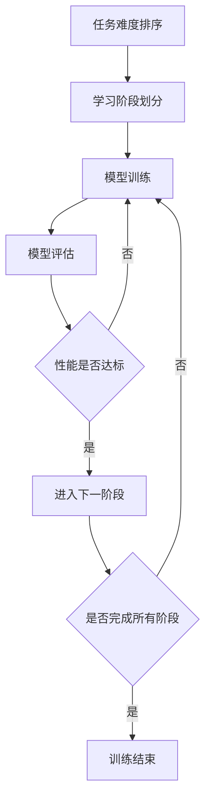

# 课程学习:模仿人类认知发展的AI训练

> 关键词：AI训练、人类认知发展、课程学习、机器学习、认知模型、智能系统、教育理念

> 摘要：本文聚焦于课程学习这一模仿人类认知发展的AI训练方法。首先介绍了课程学习的背景，包括其目的、预期读者和文档结构等内容。接着深入阐述了课程学习的核心概念、与人类认知发展的联系以及相关原理架构，通过Mermaid流程图进行了清晰展示。详细讲解了核心算法原理，并用Python代码进行说明，同时给出了相关的数学模型和公式。在项目实战部分，通过具体代码案例展示了课程学习的实现过程并进行解读分析。探讨了课程学习的实际应用场景，推荐了相关的工具和资源，包括学习资料、开发工具、框架和论文著作等。最后总结了课程学习的未来发展趋势与挑战，还提供了常见问题解答和扩展阅读参考资料，旨在全面深入地探讨这一具有创新性和前瞻性的AI训练方法。

## 1. 背景介绍 
### 1.1 目的和范围
课程学习作为一种模仿人类认知发展的AI训练方法，其目的在于让人工智能系统能够像人类一样逐步、有序地学习知识和技能。传统的机器学习方法往往是让模型在大量的数据上进行无差别学习，而课程学习则借鉴了人类学习的过程，将学习任务按照一定的难度顺序进行组织，使模型能够在不同阶段学习到适合其当前能力的知识，从而提高学习效率和效果。

本文章的范围涵盖了课程学习的基本概念、核心算法原理、数学模型、实际应用场景以及相关的工具和资源推荐等方面。通过全面的阐述，帮助读者深入理解课程学习这一方法，并能够将其应用到实际的AI开发项目中。

### 1.2 预期读者
本文预期读者包括对人工智能、机器学习领域感兴趣的科研人员、工程师、学生以及相关从业人员。对于想要深入了解AI训练新方法、探索如何让AI系统更智能地学习的人员来说，本文将提供有价值的参考。同时，教育领域的研究人员也可以从课程学习模仿人类认知发展的角度，思考如何改进教学方法和教育理念。

### 1.3 文档结构概述
本文首先介绍课程学习的背景信息，包括目的、预期读者和文档结构等。接着阐述课程学习的核心概念以及与人类认知发展的联系，通过文本示意图和Mermaid流程图进行清晰展示。然后详细讲解核心算法原理，并用Python代码进行说明，同时给出相关的数学模型和公式。在项目实战部分，通过具体代码案例展示课程学习的实现过程并进行解读分析。探讨课程学习的实际应用场景，推荐相关的工具和资源，包括学习资料、开发工具、框架和论文著作等。最后总结课程学习的未来发展趋势与挑战，提供常见问题解答和扩展阅读参考资料。

### 1.4 术语表
#### 1.4.1 核心术语定义
- **课程学习（Curriculum Learning）**：一种机器学习训练策略，它按照从简单到复杂的顺序组织训练数据，让模型逐步学习，类似于人类的学习过程。
- **人类认知发展**：指人类在成长过程中，通过感知、思维、语言等心理活动，不断获取知识和技能，提高认知能力的过程。
- **智能体（Agent）**：在人工智能领域，智能体是能够感知环境并采取行动以实现特定目标的实体。
- **训练数据分布**：指训练数据在不同特征和标签上的概率分布情况。

#### 1.4.2 相关概念解释
- **学习难度**：指学习任务对于智能体来说的困难程度，通常与任务的复杂度、所需的知识和技能等因素有关。
- **渐进式学习**：一种逐步推进的学习方式，在每个阶段学习相对简单的内容，随着学习的进行，逐渐增加学习内容的难度。
- **认知模型**：对人类认知过程的抽象表示，用于描述人类如何感知、理解和处理信息。

#### 1.4.3 缩略词列表
- **AI**：Artificial Intelligence，人工智能
- **ML**：Machine Learning，机器学习
- **DL**：Deep Learning，深度学习

## 2. 核心概念与联系 

### 2.1 课程学习的核心概念
课程学习的核心思想是模仿人类的学习过程，将学习任务按照难度进行排序，让模型从简单的任务开始学习，逐渐过渡到复杂的任务。这种学习方式可以帮助模型更好地理解和掌握知识，提高学习效率和泛化能力。

例如，人类在学习语言时，通常会先学习简单的词汇和语法，然后再学习更复杂的句子和篇章。课程学习也是如此，通过逐步增加任务的难度，让模型在每个阶段都能够充分学习和理解当前的知识，从而为学习更复杂的任务打下坚实的基础。

### 2.2 与人类认知发展的联系
人类的认知发展是一个渐进的过程，从婴儿时期的感知觉发展到儿童时期的语言和思维能力的发展，再到成年后的高级认知能力的形成。在这个过程中，人类会根据自己的认知水平和能力，选择适合自己的学习内容和方式。

课程学习正是借鉴了人类认知发展的这一特点，通过合理安排学习任务的难度顺序，让模型能够像人类一样逐步提高自己的学习能力。例如，在图像识别任务中，模型可以先学习识别简单的几何图形，然后再学习识别复杂的物体和场景。

### 2.3 原理架构的文本示意图
课程学习的原理架构可以分为以下几个部分：

1. **任务难度排序**：根据任务的复杂度、所需的知识和技能等因素，对训练任务进行难度排序。
2. **学习阶段划分**：将排序后的任务划分为不同的学习阶段，每个阶段对应一定难度范围的任务。
3. **模型训练**：在每个学习阶段，使用该阶段对应的任务数据对模型进行训练。
4. **模型评估**：在每个学习阶段结束后，对模型的性能进行评估，判断模型是否已经掌握了该阶段的知识。
5. **阶段过渡**：如果模型在当前阶段的性能达到了预期目标，则进入下一个学习阶段；否则，继续在当前阶段进行训练。

### 2.4 Mermaid流程图


## 3. 核心算法原理 & 具体操作步骤 

### 3.1 核心算法原理
课程学习的核心算法原理是根据任务的难度顺序，逐步调整训练数据的分布，让模型在不同阶段学习到适合其当前能力的知识。具体来说，在训练的初期，模型主要学习简单的任务，此时训练数据集中简单任务的比例较高；随着训练的进行，逐渐增加复杂任务的比例，让模型逐步学习到更复杂的知识。

### 3.2 具体操作步骤
1. **任务难度评估**：对所有的训练任务进行难度评估，可以使用一些指标来衡量任务的难度，如任务的复杂度、所需的知识和技能等。
2. **任务排序**：根据任务的难度评估结果，对任务进行排序，从简单到复杂。
3. **学习阶段划分**：将排序后的任务划分为不同的学习阶段，每个阶段对应一定难度范围的任务。
4. **数据采样**：在每个学习阶段，根据该阶段的任务难度，从训练数据集中采样相应的任务数据。
5. **模型训练**：使用采样得到的任务数据对模型进行训练。
6. **模型评估**：在每个学习阶段结束后，使用验证数据集对模型的性能进行评估。
7. **阶段过渡**：如果模型在当前阶段的性能达到了预期目标，则进入下一个学习阶段；否则，继续在当前阶段进行训练。

### 3.3 Python源代码详细阐述
```python
import numpy as np
from sklearn.model_selection import train_test_split
from sklearn.linear_model import LogisticRegression

# 生成示例数据
X = np.random.rand(1000, 10)
y = np.random.randint(0, 2, 1000)

# 划分训练集和验证集
X_train, X_val, y_train, y_val = train_test_split(X, y, test_size=0.2, random_state=42)

# 定义任务难度等级
task_difficulties = np.random.randint(1, 6, 1000)

# 定义学习阶段
num_stages = 5
stage_thresholds = np.linspace(1, 6, num_stages + 1)

# 初始化模型
model = LogisticRegression()

# 课程学习训练过程
for stage in range(num_stages):
    # 确定当前阶段的任务难度范围
    min_difficulty = stage_thresholds[stage]
    max_difficulty = stage_thresholds[stage + 1]
    
    # 筛选当前阶段的任务数据
    stage_indices = np.where((task_difficulties >= min_difficulty) & (task_difficulties < max_difficulty))[0]
    X_stage = X_train[stage_indices]
    y_stage = y_train[stage_indices]
    
    # 训练模型
    model.fit(X_stage, y_stage)
    
    # 评估模型
    val_score = model.score(X_val, y_val)
    print(f"Stage {stage + 1}: Validation score = {val_score}")
```

在上述代码中，我们首先生成了示例数据，并将其划分为训练集和验证集。然后，我们定义了任务难度等级和学习阶段。在每个学习阶段，我们根据任务难度范围筛选出相应的任务数据，并使用这些数据对模型进行训练。最后，我们使用验证数据集对模型的性能进行评估，并输出评估结果。

## 4. 数学模型和公式 & 详细讲解 & 举例说明 

### 4.1 数学模型
课程学习的数学模型可以用以下公式来表示：

设训练数据集为 $\mathcal{D} = \{(x_i, y_i)\}_{i=1}^N$，其中 $x_i$ 是输入样本，$y_i$ 是对应的标签。任务难度函数为 $d(x_i)$，表示样本 $x_i$ 的难度。学习阶段为 $s = 1, 2, \cdots, S$，每个阶段的难度范围为 $[d_{min}^s, d_{max}^s]$。

在第 $s$ 个学习阶段，训练数据集为 $\mathcal{D}^s = \{(x_i, y_i) | d_{min}^s \leq d(x_i) < d_{max}^s\}$。模型在第 $s$ 个学习阶段的目标是最小化损失函数：

$$
L^s(\theta) = \frac{1}{|\mathcal{D}^s|} \sum_{(x_i, y_i) \in \mathcal{D}^s} \ell(f(x_i; \theta), y_i)
$$

其中，$\theta$ 是模型的参数，$f(x_i; \theta)$ 是模型对输入样本 $x_i$ 的预测结果，$\ell$ 是损失函数。

### 4.2 详细讲解
上述数学模型描述了课程学习的基本原理。在每个学习阶段，模型只使用该阶段难度范围内的任务数据进行训练，通过最小化损失函数来更新模型的参数。随着学习阶段的推进，任务的难度逐渐增加，模型也逐渐学习到更复杂的知识。

### 4.3 举例说明
假设我们有一个图像分类任务，训练数据集包含不同难度级别的图像。任务难度函数可以定义为图像的复杂度，例如图像中物体的数量、物体的形状复杂度等。我们将学习过程分为三个阶段：

- **阶段 1**：难度范围为 $[0, 2]$，主要学习简单的图像，如只有一个简单物体的图像。
- **阶段 2**：难度范围为 $[2, 4]$，学习中等复杂度的图像，如包含多个简单物体或一个复杂物体的图像。
- **阶段 3**：难度范围为 $[4, 6]$，学习复杂的图像，如包含多个复杂物体的图像。

在每个阶段，我们使用该阶段难度范围内的图像数据对模型进行训练，通过最小化损失函数来更新模型的参数。这样，模型就可以逐步学习到不同难度级别的图像分类知识。

## 5. 项目实战：代码实际案例和详细解释说明 

### 5.1 开发环境搭建
为了实现课程学习的项目实战，我们需要搭建以下开发环境：

- **操作系统**：Windows、Linux 或 macOS
- **编程语言**：Python 3.x
- **深度学习框架**：PyTorch 或 TensorFlow
- **其他库**：NumPy、Pandas、Scikit-learn 等

可以使用以下命令来安装所需的库：
```bash
pip install torch numpy pandas scikit-learn
```

### 5.2 源代码详细实现和代码解读
以下是一个使用 PyTorch 实现课程学习的代码示例：

```python
import torch
import torch.nn as nn
import torch.optim as optim
from torch.utils.data import Dataset, DataLoader
import numpy as np
from sklearn.model_selection import train_test_split

# 定义数据集类
class CustomDataset(Dataset):
    def __init__(self, X, y, difficulties):
        self.X = torch.tensor(X, dtype=torch.float32)
        self.y = torch.tensor(y, dtype=torch.long)
        self.difficulties = difficulties
    
    def __len__(self):
        return len(self.X)
    
    def __getitem__(self, idx):
        return self.X[idx], self.y[idx], self.difficulties[idx]

# 定义简单的神经网络模型
class SimpleNet(nn.Module):
    def __init__(self, input_size, num_classes):
        super(SimpleNet, self).__init__()
        self.fc1 = nn.Linear(input_size, 64)
        self.relu = nn.ReLU()
        self.fc2 = nn.Linear(64, num_classes)
    
    def forward(self, x):
        out = self.fc1(x)
        out = self.relu(out)
        out = self.fc2(out)
        return out

# 生成示例数据
X = np.random.rand(1000, 10)
y = np.random.randint(0, 2, 1000)
difficulties = np.random.randint(1, 6, 1000)

# 划分训练集和验证集
X_train, X_val, y_train, y_val, diff_train, diff_val = train_test_split(X, y, difficulties, test_size=0.2, random_state=42)

# 创建数据集和数据加载器
train_dataset = CustomDataset(X_train, y_train, diff_train)
val_dataset = CustomDataset(X_val, y_val, diff_val)

# 定义学习阶段
num_stages = 5
stage_thresholds = np.linspace(1, 6, num_stages + 1)

# 初始化模型
model = SimpleNet(input_size=10, num_classes=2)
criterion = nn.CrossEntropyLoss()
optimizer = optim.Adam(model.parameters(), lr=0.001)

# 课程学习训练过程
for stage in range(num_stages):
    # 确定当前阶段的任务难度范围
    min_difficulty = stage_thresholds[stage]
    max_difficulty = stage_thresholds[stage + 1]
    
    # 筛选当前阶段的任务数据
    stage_indices = np.where((diff_train >= min_difficulty) & (diff_train < max_difficulty))[0]
    stage_dataset = torch.utils.data.Subset(train_dataset, stage_indices)
    stage_dataloader = DataLoader(stage_dataset, batch_size=32, shuffle=True)
    
    # 训练模型
    model.train()
    for epoch in range(10):
        running_loss = 0.0
        for inputs, labels, _ in stage_dataloader:
            optimizer.zero_grad()
            outputs = model(inputs)
            loss = criterion(outputs, labels)
            loss.backward()
            optimizer.step()
            running_loss += loss.item()
        print(f"Stage {stage + 1}, Epoch {epoch + 1}: Loss = {running_loss / len(stage_dataloader)}")
    
    # 评估模型
    model.eval()
    correct = 0
    total = 0
    with torch.no_grad():
        for inputs, labels, _ in DataLoader(val_dataset, batch_size=32, shuffle=False):
            outputs = model(inputs)
            _, predicted = torch.max(outputs.data, 1)
            total += labels.size(0)
            correct += (predicted == labels).sum().item()
    print(f"Stage {stage + 1}: Validation accuracy = {correct / total}")
```

### 5.3 代码解读与分析
1. **数据集类**：`CustomDataset` 类继承自 `torch.utils.data.Dataset`，用于封装输入数据、标签和任务难度信息。
2. **神经网络模型**：`SimpleNet` 类定义了一个简单的两层全连接神经网络，用于进行分类任务。
3. **数据生成与划分**：使用 `numpy` 生成示例数据，并使用 `sklearn.model_selection.train_test_split` 函数将数据划分为训练集和验证集。
4. **学习阶段划分**：根据任务难度范围将训练过程划分为多个学习阶段。
5. **训练过程**：在每个学习阶段，筛选出该阶段难度范围内的任务数据，并使用这些数据对模型进行训练。
6. **评估过程**：在每个学习阶段结束后，使用验证数据集对模型的性能进行评估，计算准确率。

通过课程学习的方式，模型可以逐步学习到不同难度级别的任务知识，从而提高学习效率和泛化能力。

## 6. 实际应用场景 
### 6.1 图像识别领域
在图像识别领域，课程学习可以帮助模型更好地学习图像的特征和分类知识。例如，在训练图像分类模型时，可以先让模型学习简单的图像，如只有一个物体的图像，然后逐渐学习包含多个物体、复杂背景的图像。这样可以让模型逐步掌握不同难度级别的图像特征，提高图像识别的准确率。

### 6.2 自然语言处理领域
在自然语言处理领域，课程学习可以应用于文本分类、机器翻译等任务。例如，在训练文本分类模型时，可以先让模型学习简单的文本，如短句子、简单词汇的文本，然后逐渐学习长句子、复杂语义的文本。在机器翻译任务中，可以先让模型学习简单的句子翻译，然后逐渐学习复杂的句子和篇章翻译。

### 6.3 机器人学习领域
在机器人学习领域，课程学习可以帮助机器人更好地学习运动控制、环境感知等技能。例如，在训练机器人进行运动控制时，可以先让机器人学习简单的动作，如直线行走、转弯等，然后逐渐学习复杂的动作，如攀爬、抓取等。在环境感知方面，可以先让机器人学习简单的环境特征，如障碍物的位置、形状等，然后逐渐学习复杂的环境信息，如场景的布局、物体的语义信息等。

### 6.4 游戏AI领域
在游戏AI领域，课程学习可以让游戏AI更好地学习游戏策略和技能。例如，在训练游戏AI玩围棋时，可以先让AI学习简单的围棋规则和基本策略，然后逐渐学习复杂的棋局和高级策略。在训练游戏AI玩射击游戏时，可以先让AI学习简单的移动和射击动作，然后逐渐学习复杂的战术和团队协作策略。

## 7. 工具和资源推荐
### 7.1 学习资源推荐
#### 7.1.1 书籍推荐
- 《深度学习》（Deep Learning）：由 Ian Goodfellow、Yoshua Bengio 和 Aaron Courville 合著，是深度学习领域的经典教材，涵盖了深度学习的基本原理、算法和应用。
- 《机器学习》（Machine Learning）：由 Tom M. Mitchell 著，是机器学习领域的经典教材，介绍了机器学习的基本概念、算法和模型。
- 《人工智能：一种现代的方法》（Artificial Intelligence: A Modern Approach）：由 Stuart Russell 和 Peter Norvig 合著，是人工智能领域的权威教材，全面介绍了人工智能的各个方面。

#### 7.1.2 在线课程
- Coursera 上的“深度学习专项课程”（Deep Learning Specialization）：由 Andrew Ng 教授授课，包括深度学习的基础、卷积神经网络、循环神经网络等内容。
- edX 上的“人工智能导论”（Introduction to Artificial Intelligence）：由麻省理工学院（MIT）的教授授课，介绍了人工智能的基本概念、算法和应用。
- 哔哩哔哩（B 站）上的一些机器学习和深度学习相关的视频教程，如“李宏毅机器学习”等。

#### 7.1.3 技术博客和网站
- Medium 上的机器学习和人工智能相关的博客文章，如 Towards Data Science 等。
- 机器之心（Almost Human）：提供人工智能领域的最新技术动态、研究成果和应用案例。
- 开源中国（OSChina）：提供丰富的开源技术资源和技术文章，包括机器学习、深度学习等领域。

### 7.2 开发工具框架推荐
#### 7.2.1 IDE和编辑器
- PyCharm：一款专门为 Python 开发设计的集成开发环境（IDE），提供了丰富的代码编辑、调试、版本控制等功能。
- Jupyter Notebook：一种交互式的开发环境，适合进行数据分析、机器学习和深度学习的实验和开发。
- Visual Studio Code：一款轻量级的代码编辑器，支持多种编程语言，通过安装相关的插件可以进行 Python 开发。

#### 7.2.2 调试和性能分析工具
- TensorBoard：TensorFlow 提供的可视化工具，用于监控模型的训练过程、可视化模型的结构和性能指标。
- PyTorch Profiler：PyTorch 提供的性能分析工具，用于分析模型的性能瓶颈，优化模型的训练和推理速度。
- cProfile：Python 内置的性能分析工具，用于分析 Python 代码的性能瓶颈。

#### 7.2.3 相关框架和库
- PyTorch：一个开源的深度学习框架，提供了丰富的深度学习模型和工具，易于使用和扩展。
- TensorFlow：一个广泛使用的开源深度学习框架，具有强大的分布式训练和部署能力。
- Scikit-learn：一个简单易用的机器学习库，提供了各种机器学习算法和工具，适合初学者和快速原型开发。

### 7.3 相关论文著作推荐
#### 7.3.1 经典论文
- “Curriculum Learning”：由 Yoshua Bengio 等人发表的论文，首次提出了课程学习的概念和方法。
- “Imitating Human Cognitive Development in AI Training”：探讨了如何模仿人类认知发展的过程来进行 AI 训练的相关研究。

#### 7.3.2 最新研究成果
- 可以关注 arXiv 等学术预印本平台上关于课程学习和人类认知发展相关的最新研究论文。
- 参加国际人工智能会议，如 NeurIPS、ICML 等，了解该领域的最新研究成果和趋势。

#### 7.3.3 应用案例分析
- 可以参考一些实际应用课程学习方法的项目案例，如在图像识别、自然语言处理等领域的应用案例，了解课程学习在实际项目中的应用效果和实现方法。

## 8. 总结：未来发展趋势与挑战
### 8.1 未来发展趋势
- **与人类认知科学的深度融合**：未来，课程学习将更加深入地借鉴人类认知科学的研究成果，进一步优化学习任务的难度排序和学习阶段的划分，使 AI 系统能够更准确地模仿人类的学习过程。
- **多模态学习**：随着人工智能技术的发展，多模态学习将成为一个重要的研究方向。课程学习可以应用于多模态学习中，让 AI 系统能够更好地处理图像、文本、语音等多种模态的信息。
- **自适应课程学习**：开发自适应的课程学习方法，让模型能够根据自身的学习情况和性能动态调整学习任务的难度和顺序，提高学习效率和效果。
- **强化学习与课程学习的结合**：将课程学习与强化学习相结合，让智能体在复杂的环境中能够更快地学习到有效的策略和技能。

### 8.2 挑战
- **任务难度评估的准确性**：准确评估任务的难度是课程学习的关键，但目前还没有一种通用的、准确的任务难度评估方法。不同的任务和数据集可能需要不同的难度评估指标和方法。
- **学习阶段的合理划分**：如何合理地划分学习阶段，使模型能够在每个阶段都能够充分学习和掌握知识，是一个需要解决的问题。学习阶段划分过细或过粗都可能影响模型的学习效果。
- **计算资源的需求**：课程学习通常需要更多的计算资源和时间，因为模型需要在不同的学习阶段进行多次训练。如何在有限的计算资源下提高课程学习的效率，是一个挑战。
- **泛化能力的提升**：虽然课程学习可以提高模型的学习效率，但在某些情况下，模型可能会出现过拟合的问题，导致泛化能力下降。如何在课程学习中提高模型的泛化能力，是一个需要研究的问题。

## 9. 附录：常见问题与解答
### 9.1 课程学习与传统机器学习方法有什么区别？
传统机器学习方法通常是让模型在大量的数据上进行无差别学习，而课程学习则是按照从简单到复杂的顺序组织训练数据，让模型逐步学习。课程学习借鉴了人类的学习过程，能够帮助模型更好地理解和掌握知识，提高学习效率和泛化能力。

### 9.2 如何评估任务的难度？
任务难度的评估可以使用一些指标来衡量，如任务的复杂度、所需的知识和技能等。不同的任务和数据集可能需要不同的难度评估指标和方法。例如，在图像识别任务中，可以使用图像的复杂度、物体的数量等指标来评估任务的难度；在自然语言处理任务中，可以使用文本的长度、词汇的复杂度等指标来评估任务的难度。

### 9.3 课程学习需要更多的计算资源和时间吗？
课程学习通常需要更多的计算资源和时间，因为模型需要在不同的学习阶段进行多次训练。但是，通过合理的任务难度排序和学习阶段划分，可以提高学习效率，减少不必要的计算资源和时间消耗。

### 9.4 课程学习会导致模型过拟合吗？
在某些情况下，课程学习可能会导致模型过拟合。例如，如果学习阶段划分过细，模型可能会在每个阶段都过度拟合当前的任务数据，从而导致泛化能力下降。为了避免过拟合，可以采用一些正则化方法，如 L1 和 L2 正则化、Dropout 等，同时合理调整学习阶段的划分和训练参数。

## 10. 扩展阅读 & 参考资料
- Bengio, Y., Louradour, J., Collobert, R., & Weston, J. (2009). Curriculum learning. In Proceedings of the 26th annual international conference on machine learning (pp. 41-48).
- Mitchell, T. M. (1997). Machine learning. McGraw-Hill.
- Goodfellow, I. J., Bengio, Y., & Courville, A. (2016). Deep learning. MIT press.
- Russell, S. J., & Norvig, P. (2010). Artificial intelligence: A modern approach. Prentice Hall.

作者：AI天才研究院/AI Genius Institute & 禅与计算机程序设计艺术 /Zen And The Art of Computer Programming