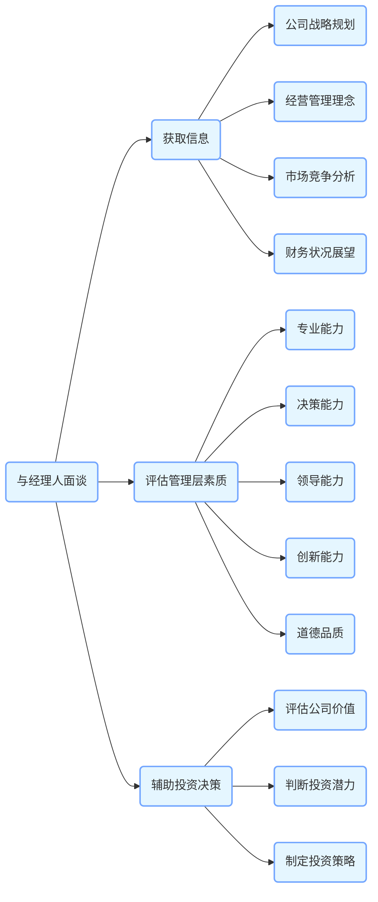

# 费雪的“与经理人面谈”：深入了解公司管理层

> 关键词：费雪、与经理人面谈、公司管理层、基本面分析、投资决策

> 摘要：本文围绕费雪提出的“与经理人面谈”方法展开，详细阐述了该方法在深入了解公司管理层方面的重要性及具体应用。通过介绍其背景，剖析核心概念与联系，讲解核心算法（虽此处更偏向方法流程），给出数学模型和公式辅助理解，结合项目实战案例说明，探讨实际应用场景，推荐相关工具和资源，最后总结未来发展趋势与挑战，并解答常见问题，旨在为投资者和相关研究人员提供全面且深入的指引，帮助其更好地运用该方法评估公司管理层，做出更明智的投资决策。

## 1. 背景介绍 
### 1.1 目的和范围
费雪的“与经理人面谈”方法旨在为投资者提供一种深入了解公司管理层的有效途径。在投资领域，公司管理层的素质、能力和战略眼光对公司的长期发展起着至关重要的作用。通过与经理人面谈，投资者可以直接获取关于公司管理层的第一手信息，包括他们的经营理念、决策风格、对市场的判断等，从而更准确地评估公司的价值和发展潜力。本文的范围将涵盖该方法的理论基础、实际操作步骤、应用案例以及相关的工具和资源推荐等方面。

### 1.2 预期读者
本文的预期读者主要包括投资者、金融分析师、企业研究人员以及对公司基本面分析感兴趣的人士。对于投资者来说，掌握“与经理人面谈”的方法可以帮助他们做出更明智的投资决策；金融分析师可以将该方法作为分析公司的重要工具之一；企业研究人员可以通过研究该方法深入了解公司管理层的行为和决策机制；而对公司基本面分析感兴趣的人士则可以通过本文了解一种独特而有效的分析方法。

### 1.3 文档结构概述
本文将按照以下结构进行阐述：首先介绍“与经理人面谈”方法的背景信息，包括目的、预期读者和文档结构概述等；接着详细剖析该方法的核心概念与联系，通过文本示意图和 Mermaid 流程图进行直观展示；然后讲解核心算法原理和具体操作步骤，并使用 Python 源代码辅助说明；再给出相关的数学模型和公式，并进行详细讲解和举例说明；之后通过项目实战案例展示该方法的实际应用，包括开发环境搭建、源代码详细实现和代码解读等；接着探讨该方法在实际中的应用场景；推荐相关的工具和资源，包括学习资源、开发工具框架和相关论文著作等；最后总结未来发展趋势与挑战，解答常见问题，并提供扩展阅读和参考资料。

### 1.4 术语表
#### 1.4.1 核心术语定义
- **与经理人面谈**：投资者或研究人员与公司的管理层进行面对面的交流，以获取关于公司经营管理、战略规划、市场前景等方面信息的一种方法。
- **公司管理层**：负责公司日常经营管理和决策的核心团队，通常包括公司的高级管理人员，如首席执行官（CEO）、首席财务官（CFO）等。
- **基本面分析**：通过对公司的财务状况、经营业绩、行业前景等基本因素进行分析，评估公司的内在价值和投资潜力的一种分析方法。

#### 1.4.2 相关概念解释
- **信息不对称**：在市场交易中，交易双方所掌握的信息存在差异，一方比另一方拥有更多或更准确的信息。在投资领域，投资者与公司管理层之间往往存在信息不对称的问题，而“与经理人面谈”可以在一定程度上缓解这种信息不对称。
- **管理层素质**：包括管理层的专业能力、决策能力、领导能力、创新能力、道德品质等方面，是影响公司发展的重要因素。

#### 1.4.3 缩略词列表
- **CEO**：Chief Executive Officer，首席执行官
- **CFO**：Chief Financial Officer，首席财务官

## 2. 核心概念与联系 
### 核心概念原理
费雪的“与经理人面谈”方法基于这样一个原理：公司的管理层是公司运营的核心，他们的决策和行动直接影响着公司的业绩和发展。通过与经理人面谈，投资者可以直接了解管理层的思维方式、经营理念和战略规划，从而更准确地评估公司的未来发展潜力。此外，面谈还可以让投资者观察管理层的沟通能力、团队协作能力和应对问题的能力等，这些都是评估管理层素质的重要方面。

### 架构的文本示意图
```plaintext
与经理人面谈
|
|--获取信息
|   |--公司战略规划
|   |--经营管理理念
|   |--市场竞争分析
|   |--财务状况展望
|
|--评估管理层素质
|   |--专业能力
|   |--决策能力
|   |--领导能力
|   |--创新能力
|   |--道德品质
|
|--辅助投资决策
|   |--评估公司价值
|   |--判断投资潜力
|   |--制定投资策略
```

### Mermaid 流程图


## 3. 核心算法原理 & 具体操作步骤 
### 核心算法原理
虽然“与经理人面谈”并非传统意义上的算法，但可以将其流程看作一种特殊的“算法”。其核心原理是通过设计合理的面谈问题，引导经理人提供有价值的信息，然后对这些信息进行分析和评估，以得出关于公司管理层和公司发展的结论。

### 具体操作步骤
#### 步骤 1：准备阶段
- **确定面谈目的**：明确面谈想要获取的信息，例如了解公司的战略规划、评估管理层的能力等。
- **研究公司背景**：收集公司的财务报表、行业报告、新闻报道等资料，了解公司的基本情况和行业地位。
- **设计面谈问题**：根据面谈目的和公司背景，设计一系列有针对性的问题。问题可以包括开放性问题和封闭式问题，以获取不同类型的信息。

#### 步骤 2：面谈阶段
- **建立良好的沟通氛围**：在面谈开始时，与经理人建立良好的沟通氛围，让他们感到放松和舒适。
- **提问并记录信息**：按照设计好的问题进行提问，并认真记录经理人的回答。可以使用录音设备辅助记录，但需要事先征得经理人的同意。
- **引导深入交流**：如果经理人的回答不够详细或深入，可以通过追问等方式引导他们进一步阐述。

#### 步骤 3：分析阶段
- **整理面谈记录**：将面谈记录进行整理，提取关键信息。
- **评估信息价值**：对提取的关键信息进行评估，判断其对了解公司管理层和公司发展的价值。
- **综合分析得出结论**：结合公司的背景信息和面谈获取的信息，对公司管理层的素质和公司的发展潜力进行综合分析，得出结论。

### Python 源代码辅助说明
```python
# 定义面谈问题列表
interview_questions = [
    "请介绍一下公司的未来战略规划。",
    "在面对市场竞争时，公司的主要竞争策略是什么？",
    "您如何评价公司管理层的团队协作能力？",
    "公司在创新方面有哪些具体的举措和计划？"
]

# 模拟面谈过程，记录回答
interview_answers = []
for question in interview_questions:
    answer = input(f"问题：{question}\n回答：")
    interview_answers.append(answer)

# 整理面谈记录，提取关键信息（这里简单示例为直接输出回答）
print("面谈记录整理：")
for i, answer in enumerate(interview_answers):
    print(f"问题 {i + 1} 的回答：{answer}")

# 这里可以进一步添加对回答进行分析和评估的代码，例如使用自然语言处理技术
```

## 4. 数学模型和公式 & 详细讲解 & 举例说明 
### 数学模型和公式
在“与经理人面谈”中，可以使用一些简单的数学模型和公式来辅助评估。例如，可以使用加权平均法来综合评估管理层的各项素质。

设管理层的各项素质指标为 $x_1, x_2, \cdots, x_n$，对应的权重为 $w_1, w_2, \cdots, w_n$，其中 $\sum_{i=1}^{n} w_i = 1$，则管理层的综合素质得分 $S$ 可以表示为：

$$S = \sum_{i=1}^{n} w_i x_i$$

### 详细讲解
- **素质指标 $x_i$**：可以根据面谈获取的信息，对管理层的专业能力、决策能力、领导能力等各项素质进行量化评估，得到相应的得分。例如，可以将专业能力分为 1 - 10 分，1 分表示专业能力较差，10 分表示专业能力很强。
- **权重 $w_i$**：根据各项素质对公司发展的重要程度，赋予相应的权重。例如，对于一家技术创新型公司，创新能力的权重可能会相对较高。
- **综合素质得分 $S$**：通过加权平均的方法，将各项素质指标的得分进行综合，得到管理层的综合素质得分。得分越高，说明管理层的整体素质越好。

### 举例说明
假设我们对面谈获取的信息进行分析后，得到管理层的专业能力得分 $x_1 = 8$ 分，决策能力得分 $x_2 = 7$ 分，领导能力得分 $x_3 = 9$ 分，创新能力得分 $x_4 = 6$ 分。各项素质的权重分别为 $w_1 = 0.2$，$w_2 = 0.3$，$w_3 = 0.3$，$w_4 = 0.2$。则管理层的综合素质得分 $S$ 为：

$$
\begin{align*}
S &= w_1 x_1 + w_2 x_2 + w_3 x_3 + w_4 x_4 \\
&= 0.2 \times 8 + 0.3 \times 7 + 0.3 \times 9 + 0.2 \times 6 \\
&= 1.6 + 2.1 + 2.7 + 1.2 \\
&= 7.6
\end{align*}
$$

通过计算得到管理层的综合素质得分为 7.6 分，我们可以根据这个得分对管理层的整体素质进行初步评估。

## 5. 项目实战：代码实际案例和详细解释说明 
### 5.1  开发环境搭建
#### 安装 Python
首先需要安装 Python 编程语言。可以从 Python 官方网站（https://www.python.org/downloads/）下载适合自己操作系统的 Python 安装包，并按照安装向导进行安装。

#### 安装必要的库
在本项目中，我们可能需要使用一些 Python 库来辅助处理面谈记录和进行数据分析，例如 `pandas` 用于数据处理，`matplotlib` 用于数据可视化等。可以使用以下命令来安装这些库：

```sh
pip install pandas matplotlib
```

### 5.2  源代码详细实现和代码解读
```python
import pandas as pd
import matplotlib.pyplot as plt

# 定义面谈问题列表
interview_questions = [
    "请介绍一下公司的未来战略规划。",
    "在面对市场竞争时，公司的主要竞争策略是什么？",
    "您如何评价公司管理层的团队协作能力？",
    "公司在创新方面有哪些具体的举措和计划？"
]

# 模拟面谈过程，记录回答
interview_answers = []
for question in interview_questions:
    answer = input(f"问题：{question}\n回答：")
    interview_answers.append(answer)

# 整理面谈记录，创建 DataFrame
data = {
    "问题": interview_questions,
    "回答": interview_answers
}
df = pd.DataFrame(data)

# 保存面谈记录到 CSV 文件
df.to_csv("interview_records.csv", index=False)

# 简单的数据分析：统计回答的字符长度
df["回答长度"] = df["回答"].str.len()

# 数据可视化：绘制回答长度的柱状图
plt.bar(df["问题"], df["回答长度"])
plt.xlabel("问题")
plt.ylabel("回答长度（字符）")
plt.title("面谈回答长度统计")
plt.xticks(rotation=45)
plt.show()
```

### 代码解读与分析
- **面谈记录收集**：通过循环遍历面谈问题列表，使用 `input` 函数获取用户输入的回答，并将回答存储在 `interview_answers` 列表中。
- **数据整理**：使用 `pandas` 库创建一个 `DataFrame` 对象，将问题和回答存储在其中，并将其保存为 CSV 文件，方便后续分析。
- **数据分析**：计算每个回答的字符长度，并将其添加到 `DataFrame` 中。可以通过回答长度初步判断经理人对不同问题的重视程度和详细程度。
- **数据可视化**：使用 `matplotlib` 库绘制回答长度的柱状图，直观展示不同问题的回答长度差异。

## 6. 实际应用场景 
### 投资决策
投资者在进行股票投资时，可以通过与公司经理人面谈，深入了解公司的管理层素质和发展潜力，从而做出更明智的投资决策。例如，如果面谈结果显示公司管理层具有较强的专业能力、创新能力和战略眼光，投资者可能会更倾向于投资该公司的股票。

### 企业并购
在企业并购过程中，收购方可以通过与被收购方的经理人面谈，了解被收购方的经营状况、企业文化和管理层团队，评估并购的可行性和潜在风险。如果面谈发现被收购方的管理层存在严重问题，收购方可能会重新考虑并购方案。

### 行业研究
行业研究人员可以通过与不同公司的经理人面谈，了解整个行业的发展趋势、竞争格局和技术创新情况。这些信息对于撰写行业研究报告、预测行业未来发展具有重要价值。

### 企业内部管理评估
企业自身也可以运用“与经理人面谈”的方法，对内部管理层进行评估和考核。通过面谈，企业可以发现管理层存在的问题和不足，及时进行调整和改进，提高企业的管理水平和运营效率。

## 7. 工具和资源推荐
### 7.1 学习资源推荐
#### 7.1.1 书籍推荐
- 《怎样选择成长股》：菲利普·费雪的经典著作，详细介绍了他的投资理念和方法，包括“与经理人面谈”等内容。
- 《聪明的投资者》：本杰明·格雷厄姆的著作，是价值投资领域的经典之作，对基本面分析和投资决策有深入的阐述。
- 《金融炼金术》：乔治·索罗斯的著作，探讨了金融市场的运行规律和投资者的心理行为，对于理解市场和公司基本面有一定的帮助。

#### 7.1.2 在线课程
- Coursera 上的“投资学原理”课程：由知名大学教授授课，涵盖了投资领域的基本概念和方法，包括基本面分析等内容。
- edX 上的“金融市场与投资”课程：提供了系统的金融市场和投资知识，对“与经理人面谈”在投资中的应用有一定的指导作用。

#### 7.1.3 技术博客和网站
- 雪球网：国内知名的投资社区，有大量的投资者分享投资经验和对公司基本面的分析，包括与经理人面谈的案例和心得。
- Seeking Alpha：国外的投资研究网站，提供专业的股票分析和投资建议，包含了很多与公司管理层相关的研究文章。

### 7.2 开发工具框架推荐
#### 7.2.1 IDE和编辑器
- PyCharm：一款专业的 Python 集成开发环境，提供了丰富的代码编辑、调试和项目管理功能，适合进行数据分析和处理。
- Jupyter Notebook：一种交互式的开发环境，支持 Python 代码的编写、运行和可视化展示，非常适合进行数据探索和分析。

#### 7.2.2 调试和性能分析工具
- `pdb`：Python 自带的调试工具，可以帮助开发者定位代码中的问题和错误。
- `cProfile`：Python 标准库中的性能分析工具，可以分析代码的运行时间和函数调用情况，帮助优化代码性能。

#### 7.2.3 相关框架和库
- `pandas`：强大的数据处理和分析库，提供了丰富的数据结构和数据操作方法，适合处理面谈记录和进行数据分析。
- `matplotlib`：常用的数据可视化库，可以绘制各种类型的图表，直观展示数据分析结果。
- `nltk`：自然语言处理库，可以用于对面谈记录进行文本分析，例如提取关键词、进行情感分析等。

### 7.3 相关论文著作推荐
#### 7.3.1 经典论文
- “The Theory of Investment Value”：由约翰·伯尔·威廉姆斯撰写，提出了现金流折现模型，对基本面分析有重要的理论贡献。
- “Efficient Capital Markets: A Review of Theory and Empirical Work”：由尤金·法玛撰写，探讨了有效市场假说，对理解市场和公司基本面的关系有重要意义。

#### 7.3.2 最新研究成果
- 可以通过学术数据库，如 IEEE Xplore、ACM Digital Library 等，搜索关于公司管理层评估和基本面分析的最新研究论文，了解该领域的前沿动态。

#### 7.3.3 应用案例分析
- 一些专业的金融研究机构和咨询公司会发布关于公司管理层评估和投资决策的应用案例分析报告，可以通过这些报告了解“与经理人面谈”方法在实际中的应用情况和效果。

## 8. 总结：未来发展趋势与挑战
### 未来发展趋势
- **数字化和智能化应用**：随着信息技术的不断发展，“与经理人面谈”方法可能会与数字化和智能化技术相结合。例如，利用人工智能技术对面谈记录进行自动分析和处理，提取关键信息和情感倾向，提高分析效率和准确性。
- **国际化和跨文化交流**：在全球化的背景下，投资者和企业的跨国投资和并购活动日益频繁。“与经理人面谈”方法也将更加注重国际化和跨文化交流，需要考虑不同国家和地区的文化差异和商业习惯。
- **与其他分析方法的融合**：未来，“与经理人面谈”方法可能会与其他基本面分析方法、技术分析方法等进行更深入的融合，形成更加全面和综合的投资分析体系。

### 挑战
- **信息真实性和可靠性**：在面谈过程中，经理人可能会出于各种原因提供不真实或不准确的信息。投资者需要具备较强的辨别能力，通过多渠道验证信息的真实性和可靠性。
- **面谈技巧和能力要求**：与经理人面谈需要具备一定的面谈技巧和能力，包括提问技巧、沟通能力、倾听能力等。投资者需要不断学习和提高自己的面谈技巧，以获取更有价值的信息。
- **时间和成本限制**：与经理人面谈需要花费一定的时间和成本，包括安排面谈时间、差旅费用等。对于一些投资者和研究人员来说，可能存在时间和成本上的限制。

## 9. 附录：常见问题与解答
### 问题 1：如何确保与经理人面谈的机会？
解答：可以通过以下几种方式增加与经理人面谈的机会：一是通过参加公司的股东大会或投资者交流会，在会议期间与经理人进行面对面交流；二是通过与公司的投资者关系部门联系，预约面谈时间；三是借助专业的投资机构或中介机构的资源，获取面谈机会。

### 问题 2：面谈时应该注意哪些问题？
解答：面谈时需要注意以下几点：一是提前做好充分的准备，了解公司的背景和面谈目的，设计好问题；二是保持礼貌和尊重，建立良好的沟通氛围；三是认真倾听经理人的回答，不要随意打断；四是注意提问的方式和语气，避免过于尖锐或敏感的问题；五是做好面谈记录，以便后续分析。

### 问题 3：如何分析面谈获取的信息？
解答：可以从以下几个方面分析面谈获取的信息：一是对信息进行分类整理，提取关键信息；二是结合公司的背景信息和行业情况，评估信息的真实性和可靠性；三是运用相关的分析方法和模型，对管理层的素质和公司的发展潜力进行评估；四是与其他渠道获取的信息进行对比和验证，综合判断信息的价值。

### 问题 4：“与经理人面谈”方法适用于所有类型的公司吗？
解答：“与经理人面谈”方法适用于大多数类型的公司，但对于一些规模较小、信息披露不规范的公司，可能获取信息的难度较大。此外，对于一些特殊行业的公司，如金融行业、高科技行业等，可能需要具备更专业的知识和技能才能进行有效的面谈和分析。

## 10. 扩展阅读 & 参考资料
### 扩展阅读
- 《金融市场学》：全面介绍金融市场的基本概念、运行机制和投资策略，有助于进一步理解“与经理人面谈”在金融市场中的应用。
- 《企业战略管理》：探讨企业战略规划和管理的理论和方法，对于分析公司管理层的战略眼光和决策能力有一定的帮助。

### 参考资料
- 菲利普·费雪. 《怎样选择成长股》. 海南出版社.
- 本杰明·格雷厄姆. 《聪明的投资者》. 人民邮电出版社.
- 乔治·索罗斯. 《金融炼金术》. 海南出版社.

作者：AI天才研究院/AI Genius Institute & 禅与计算机程序设计艺术 /Zen And The Art of Computer Programming