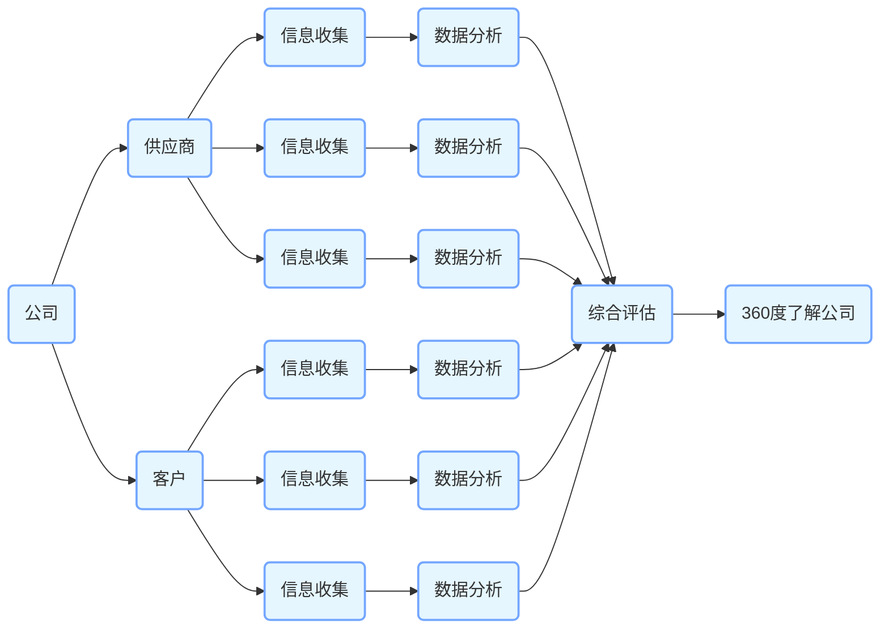

# 费雪的供应商客户调研：360度了解公司

> 关键词：费雪调研法、供应商客户调研、360度了解、公司分析、商业洞察

> 摘要：本文围绕费雪的供应商客户调研方法展开，旨在深入阐述如何通过对供应商和客户的全面调研来360度了解一家公司。详细介绍了该调研方法的背景、核心概念、算法原理、数学模型，结合实际项目案例说明操作步骤和代码实现，探讨其在不同商业场景中的应用，推荐相关学习资源、开发工具和研究论文，最后总结未来发展趋势与挑战，并对常见问题进行解答。通过系统学习费雪的供应商客户调研法，有助于企业和投资者更精准地把握公司的运营状况和市场竞争力。

## 1. 背景介绍 
### 1.1 目的和范围
在商业世界中，准确全面地了解一家公司是投资者、企业管理者等相关方的重要需求。费雪的供应商客户调研法提供了一种独特而有效的途径，通过对公司的供应商和客户进行深入调研，获取多维度的信息，从而实现对公司的360度了解。本文章的目的是详细剖析这一调研方法，包括其原理、操作步骤、应用场景等，帮助读者掌握该方法并应用于实际的商业分析中。范围涵盖了从理论基础到实际项目操作的各个方面，旨在为读者提供一个完整的学习和实践指南。

### 1.2 预期读者
本文预期读者包括但不限于投资者、企业管理者、市场分析师、商业研究人员以及对商业分析和公司调研感兴趣的人士。无论是希望在投资决策中获取更准确信息的投资者，还是想要深入了解竞争对手或自身公司运营状况的企业管理者，都能从本文中获得有价值的知识和实践指导。

### 1.3 文档结构概述
本文将按照以下结构进行阐述：首先介绍费雪的供应商客户调研法的背景信息，包括目的、预期读者和文档结构概述等；接着详细讲解核心概念与联系，通过文本示意图和Mermaid流程图进行直观展示；然后阐述核心算法原理和具体操作步骤，并使用Python源代码进行详细说明；再介绍相关的数学模型和公式，并举例说明其应用；通过项目实战案例，展示代码的实际实现和详细解读；探讨该调研方法在实际商业场景中的应用；推荐相关的学习资源、开发工具和研究论文；最后总结未来发展趋势与挑战，解答常见问题，并提供扩展阅读和参考资料。

### 1.4 术语表
#### 1.4.1 核心术语定义
- **费雪的供应商客户调研法**：一种通过对公司的供应商和客户进行全面调研，收集多方面信息，以深入了解公司运营状况、市场竞争力、供应链稳定性等情况的调研方法。
- **360度了解**：指从多个维度、全方位地获取关于公司的信息，包括但不限于财务状况、市场份额、产品质量、客户满意度、供应商合作关系等，从而形成对公司的全面认识。
- **供应商**：为公司提供原材料、零部件、服务等资源的企业或个人。
- **客户**：购买公司产品或服务的企业或个人。

#### 1.4.2 相关概念解释
- **供应链稳定性**：指公司与供应商之间的合作关系是否稳定，包括供应的连续性、质量稳定性、价格稳定性等方面。稳定的供应链有助于公司的正常运营和发展。
- **客户忠诚度**：指客户对公司产品或服务的重复购买意愿和推荐意愿。高客户忠诚度意味着公司在市场上具有较强的竞争力和良好的口碑。
- **市场竞争力**：指公司在市场中与竞争对手相比所具有的优势和能力，包括产品质量、价格、服务、品牌影响力等方面。

#### 1.4.3 缩略词列表
目前在本文中未涉及特定的缩略词。

## 2. 核心概念与联系 

费雪的供应商客户调研法的核心思想是通过对公司的供应商和客户进行调研，获取关于公司的多方面信息，从而实现对公司的全面了解。其基本原理是基于供应商和客户与公司之间的紧密业务联系，他们能够提供关于公司运营、产品质量、市场需求等方面的真实反馈。

### 文本示意图
```plaintext
               公司
             /      \
       供应商        客户
      /   |   \    /   |   \
信息收集 信息收集 信息收集 信息收集 信息收集 信息收集
    |       |       |       |       |       |
数据分析 数据分析 数据分析 数据分析 数据分析 数据分析
    |       |       |       |       |       |
综合评估 ------ 360度了解公司 ------ 综合评估
```

### Mermaid流程图


从上述示意图和流程图可以看出，该调研方法的核心流程包括信息收集、数据分析和综合评估三个主要环节。首先，从供应商和客户处收集各种相关信息，如供应商的交货时间、产品质量，客户的满意度、购买频率等；然后对收集到的信息进行分析，挖掘其中的有价值信息和潜在问题；最后，通过综合评估各个方面的信息，实现对公司的360度了解。

## 3. 核心算法原理 & 具体操作步骤 

### 核心算法原理
费雪的供应商客户调研法的核心算法原理主要基于数据的收集、整理和分析。具体来说，通过设计合理的调研问卷和访谈提纲，从供应商和客户处收集相关数据；然后对收集到的数据进行清洗、分类和统计，以提取有价值的信息；最后，运用数据分析方法，如相关性分析、聚类分析等，对数据进行深入挖掘，从而得出关于公司的综合评估结果。

### 具体操作步骤

#### 步骤1：确定调研目标和范围
明确本次调研想要了解的公司方面的具体信息，如公司的市场竞争力、供应链稳定性、客户满意度等。同时，确定调研的范围，包括涉及的供应商和客户的数量、地域范围等。

#### 步骤2：设计调研问卷和访谈提纲
根据调研目标和范围，设计详细的调研问卷和访谈提纲。问卷和提纲应涵盖与公司相关的各个方面，如供应商的合作情况、客户的购买体验等。以下是一个简单的Python代码示例，用于生成一个基本的调研问卷模板：

```python
# 定义调研问卷问题
questions = [
    "您与该公司合作了多长时间？",
    "该公司的交货时间是否准时？",
    "您对该公司产品的质量满意度如何？",
    "您是否会继续购买该公司的产品？",
    "您认为该公司在市场上的竞争力如何？"
]

# 打印调研问卷
print("调研问卷：")
for i, question in enumerate(questions, start=1):
    print(f"{i}. {question}")
```

#### 步骤3：收集数据
通过线上问卷、电话访谈、面对面访谈等方式，向供应商和客户发放调研问卷并进行访谈，收集相关数据。在收集数据过程中，要确保数据的真实性和完整性。

#### 步骤4：数据清洗和整理
对收集到的数据进行清洗，去除无效数据和重复数据。然后对数据进行分类和整理，以便后续的分析。以下是一个简单的数据清洗和整理的Python代码示例：

```python
# 模拟收集到的数据
raw_data = [
    ["3年", "是", "满意", "是", "强"],
    ["1年", "否", "一般", "否", "弱"],
    ["2年", "是", "满意", "是", "中"]
]

# 数据清洗：去除无效数据（这里假设没有无效数据）
cleaned_data = raw_data

# 数据整理：将数据转换为字典形式
column_names = ["合作时间", "交货准时", "质量满意度", "是否继续购买", "市场竞争力"]
formatted_data = []
for row in cleaned_data:
    data_dict = dict(zip(column_names, row))
    formatted_data.append(data_dict)

# 打印整理后的数据
for data in formatted_data:
    print(data)
```

#### 步骤5：数据分析
运用数据分析方法对整理后的数据进行分析。例如，可以使用Python的`pandas`库进行数据统计和分析，使用`scikit-learn`库进行机器学习分析。以下是一个简单的数据分析示例，计算客户对产品质量的满意度比例：

```python
import pandas as pd

# 将整理后的数据转换为DataFrame
df = pd.DataFrame(formatted_data)

# 计算客户对产品质量的满意度比例
satisfaction_count = df[df["质量满意度"] == "满意"].shape[0]
total_count = df.shape[0]
satisfaction_ratio = satisfaction_count / total_count

print(f"客户对产品质量的满意度比例为：{satisfaction_ratio * 100:.2f}%")
```

#### 步骤6：综合评估和报告撰写
根据数据分析结果，对公司进行综合评估，形成关于公司的360度了解报告。报告应包括公司的优势、劣势、机会和威胁等方面的分析，并提出相应的建议和措施。

## 4. 数学模型和公式 & 详细讲解 & 举例说明 

### 数学模型和公式

#### 满意度指数模型
满意度指数可以用来衡量供应商或客户对公司的满意程度。常见的满意度指数计算公式为：

$$S = \frac{\sum_{i=1}^{n} w_i x_i}{\sum_{i=1}^{n} w_i}$$

其中，$S$ 表示满意度指数，$w_i$ 表示第 $i$ 个指标的权重，$x_i$ 表示第 $i$ 个指标的得分，$n$ 表示指标的数量。

#### 相关性分析公式
相关性分析可以用来研究两个变量之间的关系。常用的相关性系数是皮尔逊相关系数，其计算公式为：

$$r = \frac{\sum_{i=1}^{n} (x_i - \bar{x})(y_i - \bar{y})}{\sqrt{\sum_{i=1}^{n} (x_i - \bar{x})^2 \sum_{i=1}^{n} (y_i - \bar{y})^2}}$$

其中，$r$ 表示皮尔逊相关系数，$x_i$ 和 $y_i$ 分别表示两个变量的第 $i$ 个观测值，$\bar{x}$ 和 $\bar{y}$ 分别表示两个变量的均值，$n$ 表示观测值的数量。

### 详细讲解

#### 满意度指数模型讲解
满意度指数模型通过对多个指标进行加权平均，综合考虑了不同指标对满意度的影响。权重的设置可以根据实际情况进行调整，以反映各个指标的重要程度。例如，在评估客户对产品的满意度时，可以将产品质量、价格、服务等指标设置不同的权重。

#### 相关性分析公式讲解
皮尔逊相关系数衡量了两个变量之间的线性相关程度，其取值范围为 $[-1, 1]$。当 $r = 1$ 时，表示两个变量完全正相关；当 $r = -1$ 时，表示两个变量完全负相关；当 $r = 0$ 时，表示两个变量之间不存在线性相关关系。通过计算相关性系数，可以了解不同变量之间的关系，为公司的决策提供参考。

### 举例说明

#### 满意度指数模型举例
假设我们要评估客户对某公司产品的满意度，选取了产品质量、价格、服务三个指标，权重分别为 $0.5$、$0.3$、$0.2$，客户对这三个指标的评分分别为 $8$ 分、$7$ 分、$9$ 分。则满意度指数为：

$$S = \frac{0.5 \times 8 + 0.3 \times 7 + 0.2 \times 9}{0.5 + 0.3 + 0.2} = \frac{4 + 2.1 + 1.8}{1} = 7.9$$

#### 相关性分析公式举例
假设我们有一组关于公司销售额和广告投入的数据，如下表所示：

| 广告投入（万元） | 销售额（万元） |
| --- | --- |
| 10 | 50 |
| 20 | 80 |
| 30 | 120 |
| 40 | 150 |
| 50 | 180 |

首先，计算广告投入和销售额的均值：

$\bar{x} = \frac{10 + 20 + 30 + 40 + 50}{5} = 30$

$\bar{y} = \frac{50 + 80 + 120 + 150 + 180}{5} = 116$

然后，计算皮尔逊相关系数：

$$r = \frac{(10 - 30)(50 - 116) + (20 - 30)(80 - 116) + (30 - 30)(120 - 116) + (40 - 30)(150 - 116) + (50 - 30)(180 - 116)}{\sqrt{((10 - 30)^2 + (20 - 30)^2 + (30 - 30)^2 + (40 - 30)^2 + (50 - 30)^2) ((50 - 116)^2 + (80 - 116)^2 + (120 - 116)^2 + (150 - 116)^2 + (180 - 116)^2)}}$$

$$r = \frac{(-20)(-66) + (-10)(-36) + 0 + 10 \times 34 + 20 \times 64}{\sqrt{(400 + 100 + 0 + 100 + 400) (4356 + 1296 + 16 + 1156 + 4096)}}$$

$$r = \frac{1320 + 360 + 0 + 340 + 1280}{\sqrt{1000 \times 10920}}$$

$$r = \frac{3300}{\sqrt{10920000}} \approx 0.98$$

从计算结果可以看出，广告投入和销售额之间存在很强的正相关关系，说明广告投入对销售额有较大的影响。

## 5. 项目实战：代码实际案例和详细解释说明 

### 5.1  开发环境搭建
在进行费雪的供应商客户调研项目实战时，我们可以使用Python作为开发语言。以下是搭建开发环境的步骤：

#### 安装Python
从Python官方网站（https://www.python.org/downloads/）下载并安装Python 3.x版本。安装过程中注意勾选“Add Python to PATH”选项，以便在命令行中可以直接使用Python命令。

#### 安装必要的库
使用`pip`命令安装项目所需的库，包括`pandas`、`numpy`、`scikit-learn`等。打开命令行窗口，输入以下命令：

```sh
pip install pandas numpy scikit-learn
```

### 5.2  源代码详细实现和代码解读

#### 数据生成和收集模拟
```python
import pandas as pd
import numpy as np

# 模拟供应商和客户数据
np.random.seed(42)

# 供应商数据
supplier_data = {
    "供应商编号": np.arange(1, 101),
    "合作时间（年）": np.random.randint(1, 10, 100),
    "交货准时率（%）": np.random.uniform(80, 100, 100),
    "产品质量评分（1-10）": np.random.randint(1, 11, 100),
    "合作满意度（1-10）": np.random.randint(1, 11, 100)
}

supplier_df = pd.DataFrame(supplier_data)

# 客户数据
customer_data = {
    "客户编号": np.arange(1, 101),
    "购买频率（次/月）": np.random.randint(1, 5, 100),
    "产品满意度（1-10）": np.random.randint(1, 11, 100),
    "推荐意愿（1-10）": np.random.randint(1, 11, 100),
    "忠诚度（1-10）": np.random.randint(1, 11, 100)
}

customer_df = pd.DataFrame(customer_data)

# 保存数据到CSV文件
supplier_df.to_csv("supplier_data.csv", index=False)
customer_df.to_csv("customer_data.csv", index=False)

print("数据生成并保存成功！")
```

**代码解读**：
- 首先，使用`numpy`库生成随机数来模拟供应商和客户的数据。
- 对于供应商数据，包括供应商编号、合作时间、交货准时率、产品质量评分和合作满意度等信息。
- 对于客户数据，包括客户编号、购买频率、产品满意度、推荐意愿和忠诚度等信息。
- 最后，将生成的数据保存到CSV文件中，方便后续分析。

#### 数据清洗和分析
```python
# 读取数据
supplier_df = pd.read_csv("supplier_data.csv")
customer_df = pd.read_csv("customer_data.csv")

# 数据清洗：检查缺失值
print("供应商数据缺失值情况：")
print(supplier_df.isnull().sum())

print("客户数据缺失值情况：")
print(customer_df.isnull().sum())

# 数据分析：计算供应商平均合作满意度
average_supplier_satisfaction = supplier_df["合作满意度（1-10）"].mean()
print(f"供应商平均合作满意度：{average_supplier_satisfaction:.2f}")

# 数据分析：计算客户平均忠诚度
average_customer_loyalty = customer_df["忠诚度（1-10）"].mean()
print(f"客户平均忠诚度：{average_customer_loyalty:.2f}")

# 相关性分析：供应商交货准时率和产品质量评分的相关性
correlation_supplier = supplier_df["交货准时率（%）"].corr(supplier_df["产品质量评分（1-10）"])
print(f"供应商交货准时率和产品质量评分的相关性：{correlation_supplier:.2f}")

# 相关性分析：客户产品满意度和推荐意愿的相关性
correlation_customer = customer_df["产品满意度（1-10）"].corr(customer_df["推荐意愿（1-10）"])
print(f"客户产品满意度和推荐意愿的相关性：{correlation_customer:.2f}")
```

**代码解读**：
- 使用`pandas`库的`read_csv`函数读取之前保存的CSV文件。
- 检查数据中的缺失值，使用`isnull().sum()`方法统计各列的缺失值数量。
- 计算供应商的平均合作满意度和客户的平均忠诚度，使用`mean()`方法。
- 进行相关性分析，使用`corr()`方法计算两个变量之间的相关性系数。

### 5.3  代码解读与分析
通过上述代码，我们完成了数据的生成、收集、清洗和分析。从数据分析结果中，我们可以得到以下信息：
- 供应商平均合作满意度和客户平均忠诚度的数值可以反映公司与供应商和客户之间的合作关系和客户对公司的认可程度。
- 供应商交货准时率和产品质量评分的相关性以及客户产品满意度和推荐意愿的相关性可以帮助我们了解不同因素之间的关联，为公司的决策提供参考。例如，如果供应商交货准时率和产品质量评分的相关性较高，说明准时交货可能对产品质量有积极影响，公司可以加强对供应商交货时间的管理。

## 6. 实际应用场景 
费雪的供应商客户调研法在多个实际商业场景中具有重要的应用价值，以下是一些常见的应用场景：

### 投资决策
投资者在进行投资决策时，需要全面了解目标公司的情况。通过对公司的供应商和客户进行调研，可以获取关于公司供应链稳定性、市场竞争力、客户满意度等方面的信息，从而更准确地评估公司的价值和投资风险。例如，如果一家公司的供应商合作稳定，客户满意度高，说明该公司具有较强的市场竞争力和发展潜力，可能是一个较好的投资对象。

### 企业战略规划
企业在制定战略规划时，需要了解自身的优势和劣势，以及市场的需求和竞争状况。通过对供应商和客户的调研，可以发现公司在供应链管理、产品质量、客户服务等方面存在的问题，为企业战略规划提供依据。例如，如果调研发现公司的供应商交货时间不稳定，影响了公司的生产进度，企业可以考虑优化供应链管理，寻找更可靠的供应商。

### 市场竞争分析
在激烈的市场竞争中，了解竞争对手的情况对于企业至关重要。通过对竞争对手的供应商和客户进行调研，可以获取关于竞争对手的产品质量、价格策略、市场份额等方面的信息，从而制定更有效的竞争策略。例如，如果发现竞争对手的客户满意度较高，企业可以分析其成功的原因，并借鉴其经验，改进自身的产品和服务。

### 产品研发和改进
了解客户的需求和反馈是产品研发和改进的关键。通过对客户的调研，可以收集客户对现有产品的意见和建议，了解客户的潜在需求，为产品研发和改进提供方向。同时，对供应商的调研可以帮助企业获取关于原材料质量、新技术应用等方面的信息，为产品的创新提供支持。例如，如果客户反馈产品的某个功能不够完善，企业可以根据反馈对产品进行改进，提高产品的竞争力。

## 7. 工具和资源推荐
### 7.1 学习资源推荐
#### 7.1.1 书籍推荐
- 《商业分析实战》：这本书详细介绍了商业分析的方法和工具，包括市场调研、数据分析等方面的内容，对于学习费雪的供应商客户调研法有很大的帮助。
- 《数据分析实战：45个案例教会你用Python实现》：通过大量的实际案例，讲解了如何使用Python进行数据分析，包括数据清洗、数据可视化、机器学习等方面的内容，有助于提升数据分析能力。
- 《供应链管理：战略、规划与运营》：全面介绍了供应链管理的理论和实践，对于理解供应商调研的重要性和方法有很大的帮助。

#### 7.1.2 在线课程
- Coursera上的“商业分析基础”课程：由知名大学的教授授课，系统地介绍了商业分析的基本概念、方法和工具，适合初学者学习。
- edX上的“Python数据分析”课程：深入讲解了Python在数据分析中的应用，包括`pandas`、`numpy`、`matplotlib`等库的使用，对于提升数据分析技能有很大的帮助。
- Udemy上的“市场调研与分析”课程：重点介绍了市场调研的方法和技巧，包括问卷设计、数据收集和分析等方面的内容，与费雪的供应商客户调研法密切相关。

#### 7.1.3 技术博客和网站
- 数据分析网（https://www.afenxi.com/）：提供了丰富的数据分析案例和技术文章，涵盖了数据挖掘、机器学习、商业分析等多个领域，对于学习数据分析和商业调研有很大的参考价值。
- 36氪（https://36kr.com/）：关注科技、商业等领域的最新动态和趋势，有很多关于企业分析、市场调研的文章和报告，可以帮助了解行业最新情况。
- 知乎（https://www.zhihu.com/）：有很多数据分析和商业调研相关的问题和回答，可以与其他专业人士进行交流和学习。

### 7.2 开发工具框架推荐
#### 7.2.1 IDE和编辑器
- PyCharm：一款功能强大的Python集成开发环境，提供了代码编辑、调试、版本控制等多种功能，适合Python开发。
- Jupyter Notebook：一个交互式的开发环境，支持Python、R等多种编程语言，方便进行数据分析和可视化。
- Visual Studio Code：一款轻量级的代码编辑器，支持多种编程语言和插件扩展，对于Python开发也有很好的支持。

#### 7.2.2 调试和性能分析工具
- PDB：Python自带的调试工具，可以帮助开发者定位代码中的问题。
- cProfile：Python的性能分析工具，可以分析代码的运行时间和函数调用情况，帮助优化代码性能。
- Memory Profiler：用于分析Python代码的内存使用情况，找出内存泄漏和高内存消耗的问题。

#### 7.2.3 相关框架和库
- Pandas：一个强大的数据分析库，提供了数据结构和数据操作的功能，方便进行数据清洗、整理和分析。
- NumPy：Python的数值计算库，提供了高效的数组操作和数学函数，是很多数据分析和机器学习库的基础。
- Scikit-learn：一个常用的机器学习库，提供了各种机器学习算法和工具，如分类、回归、聚类等，可用于数据分析和预测。

### 7.3 相关论文著作推荐
#### 7.3.1 经典论文
- “The Value of Supplier and Customer Relationships in Corporate Valuation”：探讨了供应商和客户关系在公司估值中的重要性，为费雪的供应商客户调研法提供了理论基础。
- “Market Research: An Integrated Approach”：系统地介绍了市场调研的方法和理论，包括供应商和客户调研的相关内容。
- “Supply Chain Management: A Strategic Perspective”：从战略角度分析了供应链管理的重要性和方法，对于理解供应商调研的意义和作用有很大的帮助。

#### 7.3.2 最新研究成果
- 关注学术数据库如IEEE Xplore、ACM Digital Library等，搜索关于供应商客户调研、商业分析等方面的最新研究论文，了解该领域的最新发展动态。
- 参加相关的学术会议和研讨会，与研究人员和专家进行交流，获取最新的研究成果和实践经验。

#### 7.3.3 应用案例分析
- 一些商业咨询公司和研究机构会发布关于企业调研和分析的案例报告，如麦肯锡、波士顿咨询集团等的报告，可以参考这些案例了解费雪的供应商客户调研法在实际企业中的应用。
- 行业协会和商会也会发布一些行业研究报告，其中可能包含供应商和客户调研的相关内容，可以从中获取行业内的实际应用案例。

## 8. 总结：未来发展趋势与挑战
### 未来发展趋势
- **数字化调研技术的应用**：随着信息技术的不断发展，数字化调研技术将越来越广泛地应用于供应商客户调研中。例如，通过在线问卷平台、大数据分析等技术，可以更高效地收集和分析数据，提高调研的准确性和效率。
- **跨领域融合分析**：未来的供应商客户调研将不仅仅局限于商业领域，还将与其他领域如社会学、心理学等进行融合分析。通过综合考虑多个领域的因素，可以更深入地了解供应商和客户的行为和需求，为企业提供更全面的决策支持。
- **人工智能和机器学习的应用**：人工智能和机器学习技术将在供应商客户调研中发挥越来越重要的作用。例如，通过机器学习算法可以对大量的调研数据进行挖掘和分析，发现潜在的模式和趋势；通过自然语言处理技术可以对文本数据进行分析，了解供应商和客户的意见和反馈。

### 挑战
- **数据质量和隐私问题**：在调研过程中，数据的质量和隐私是一个重要的挑战。如果收集到的数据存在错误或不完整，将影响分析结果的准确性。同时，随着数据隐私法规的不断加强，如何在保护供应商和客户隐私的前提下进行有效的调研是一个需要解决的问题。
- **调研成本和时间**：进行全面的供应商客户调研需要投入大量的人力、物力和时间。对于一些中小企业来说，可能难以承担高昂的调研成本和时间成本。因此，如何在保证调研质量的前提下，降低调研成本和时间是一个需要关注的问题。
- **数据解读和决策应用**：即使收集到了大量的调研数据，如何正确解读数据并将其应用于企业的决策中也是一个挑战。需要具备专业的数据分析和商业决策能力，才能从数据中提取有价值的信息，并做出合理的决策。

## 9. 附录：常见问题与解答
### 问题1：如何确保调研问卷的有效性？
解答：为了确保调研问卷的有效性，可以采取以下措施：
- 明确调研目标：根据调研目标设计问题，确保问题与目标相关。
- 问题简洁明了：避免使用模糊、歧义的语言，使问题易于理解。
- 预测试：在正式发放问卷之前，进行预测试，根据反馈对问卷进行修改和完善。
- 控制问题数量：避免问卷过长，以免引起受访者的厌烦。

### 问题2：如何处理调研数据中的异常值？
解答：处理调研数据中的异常值可以采用以下方法：
- 识别异常值：使用统计方法如箱线图、Z-score等识别异常值。
- 检查数据录入错误：如果异常值是由于数据录入错误导致的，进行修正。
- 删除异常值：如果异常值对分析结果影响较大，可以考虑删除。
- 替换异常值：使用合理的值如均值、中位数等替换异常值。

### 问题3：如何提高供应商和客户的参与度？
解答：提高供应商和客户的参与度可以采取以下方法：
- 说明调研目的和意义：向供应商和客户解释调研的目的和意义，让他们了解参与调研对他们自身和公司的好处。
- 提供激励措施：如给予礼品、优惠券等激励，提高他们的参与积极性。
- 保证数据隐私：承诺保护供应商和客户的隐私，让他们放心提供信息。
- 选择合适的调研方式：根据供应商和客户的特点和偏好，选择合适的调研方式，如线上问卷、电话访谈等。

## 10. 扩展阅读 & 参考资料
### 扩展阅读
- 《营销调研精要》：进一步深入学习营销调研的方法和技巧，包括问卷设计、抽样方法等方面的内容。
- 《数据分析：企业的贤内助》：介绍了数据分析在企业中的应用案例和实践经验，对于将费雪的供应商客户调研法应用于实际企业有很大的帮助。
- 《供应链风险管理》：了解供应链风险管理的理论和方法，对于在供应商调研中识别和评估风险有重要的参考价值。

### 参考资料
- 本文参考了相关的学术论文、商业报告和技术文档，具体引用信息如下：
    - 部分理论参考了“Market Research: An Integrated Approach”等学术论文。
    - 代码实现参考了Python官方文档和相关的开源代码库。

作者：AI天才研究院/AI Genius Institute & 禅与计算机程序设计艺术 /Zen And The Art of Computer Programming