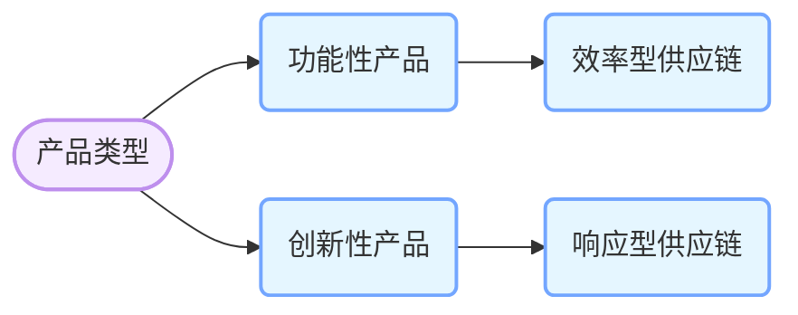

# 费雪的供应链分析：全球化重构下的新思路

> 关键词：费雪供应链分析、全球化重构、供应链策略、需求不确定性、产品类型

> 摘要：本文围绕费雪的供应链分析在全球化重构背景下的新思路展开探讨。首先介绍了费雪供应链分析的背景知识，包括目的、预期读者等内容。深入阐述了费雪供应链分析的核心概念，通过文本示意图和 Mermaid 流程图展示其架构。详细讲解了核心算法原理，运用 Python 代码进行说明，并给出数学模型和公式。结合项目实战，提供代码案例及详细解读。分析了费雪供应链分析在不同场景下的实际应用，推荐了相关的学习资源、开发工具和论文著作。最后总结了其未来发展趋势与挑战，并提供常见问题解答和扩展阅读参考资料，旨在为企业在全球化重构中优化供应链管理提供有价值的思路和方法。

## 1. 背景介绍 
### 1.1 目的和范围
在当今全球化的大背景下，供应链管理面临着诸多挑战和变化。随着贸易政策的调整、技术的快速发展以及消费者需求的不断变化，企业的供应链需要不断优化和重构。费雪的供应链分析理论为企业提供了一种有效的方法来理解和设计供应链，以适应不同的市场需求和产品特性。本文的目的是深入探讨费雪的供应链分析在全球化重构下的新思路，分析其核心概念、算法原理、数学模型等，并通过实际案例展示其应用。范围涵盖了费雪供应链分析的各个方面，包括理论基础、实际操作以及未来发展趋势等。

### 1.2 预期读者
本文预期读者包括供应链管理领域的专业人士，如供应链经理、物流专家等，他们可以通过本文深入了解费雪供应链分析的最新思路，应用到实际工作中。同时，也适合对供应链管理感兴趣的学者和研究人员，为他们的学术研究提供参考。此外，企业的高层管理人员，如 CEO、CTO 等，也可以通过本文了解如何运用费雪的理论来优化企业的供应链，提升企业的竞争力。

### 1.3 文档结构概述
本文共分为十个部分。第一部分为背景介绍，阐述了文章的目的、预期读者和文档结构概述。第二部分介绍费雪供应链分析的核心概念与联系，包括原理和架构的文本示意图以及 Mermaid 流程图。第三部分讲解核心算法原理和具体操作步骤，使用 Python 代码进行详细阐述。第四部分给出数学模型和公式，并进行详细讲解和举例说明。第五部分通过项目实战，展示代码实际案例并进行详细解释。第六部分分析费雪供应链分析的实际应用场景。第七部分推荐相关的工具和资源，包括学习资源、开发工具框架和论文著作。第八部分总结未来发展趋势与挑战。第九部分为附录，提供常见问题与解答。第十部分为扩展阅读和参考资料。

### 1.4 术语表
#### 1.4.1 核心术语定义
- **费雪供应链分析**：由马歇尔·费雪（Marshall L. Fisher）提出的一种供应链设计方法，根据产品的需求特性将产品分为功能性产品和创新性产品，并为不同类型的产品设计不同的供应链策略。
- **功能性产品**：指满足基本需求、需求相对稳定、生命周期较长的产品，如日用品、食品等。
- **创新性产品**：指具有新颖性、时尚性、技术含量高的产品，需求不确定性较大、生命周期较短，如电子产品、时尚服装等。
- **供应链策略**：为了实现供应链的目标，如成本最小化、响应速度最快等，而制定的一系列决策和行动计划。

#### 1.4.2 相关概念解释
- **需求不确定性**：指产品需求的变化程度和不可预测性。功能性产品的需求不确定性较低，而创新性产品的需求不确定性较高。
- **供应链响应性**：指供应链对市场需求变化的快速响应能力，包括快速生产、快速配送等方面。
- **供应链效率**：指供应链在满足市场需求的前提下，实现成本最小化的能力。

#### 1.4.3 缩略词列表
- **SC**：Supply Chain，供应链
- **FP**：Functional Product，功能性产品
- **IP**：Innovative Product，创新性产品

## 2. 核心概念与联系 

费雪的供应链分析核心在于根据产品的需求特性将产品分为功能性产品和创新性产品，并为不同类型的产品匹配不同的供应链策略。其原理是基于不同类型产品的需求不确定性和边际利润的差异，设计出效率型供应链和响应型供应链。

### 文本示意图
```plaintext
           产品类型
         /           \
功能性产品         创新性产品
（需求稳定、寿命长）  （需求不确定、寿命短）
    |                    |
效率型供应链         响应型供应链
（低成本、高利用率）  （快速响应、灵活性高）
```

### Mermaid 流程图


从流程图可以看出，产品类型是决定供应链策略的关键因素。功能性产品适合采用效率型供应链，以降低成本和提高资源利用率；创新性产品则需要响应型供应链，以快速响应市场需求的变化。

## 3. 核心算法原理 & 具体操作步骤 

### 核心算法原理
费雪的供应链分析核心算法原理是根据产品的需求特性（需求不确定性）和成本特性（边际利润）来选择合适的供应链策略。具体步骤如下：
1. 确定产品的需求不确定性程度，可以通过历史销售数据的标准差等指标来衡量。
2. 计算产品的边际利润，即产品售价减去生产成本。
3. 根据需求不确定性和边际利润的大小，将产品归类为功能性产品或创新性产品。
4. 为不同类型的产品选择相应的供应链策略，功能性产品选择效率型供应链，创新性产品选择响应型供应链。

### 具体操作步骤及 Python 代码实现
```python
import numpy as np

def classify_product(demand_std, marginal_profit):
    """
    根据需求标准差和边际利润对产品进行分类
    :param demand_std: 需求的标准差
    :param marginal_profit: 边际利润
    :return: 产品类型（功能性产品或创新性产品）
    """
    # 假设需求标准差阈值为 10，边际利润阈值为 50
    demand_threshold = 10
    profit_threshold = 50
    if demand_std < demand_threshold and marginal_profit < profit_threshold:
        return "功能性产品"
    else:
        return "创新性产品"

def select_supply_chain(product_type):
    """
    根据产品类型选择供应链策略
    :param product_type: 产品类型
    :return: 供应链策略（效率型供应链或响应型供应链）
    """
    if product_type == "功能性产品":
        return "效率型供应链"
    else:
        return "响应型供应链"

# 示例数据
demand_data = [10, 12, 11, 9, 13]
marginal_profit = 40

# 计算需求的标准差
demand_std = np.std(demand_data)

# 对产品进行分类
product_type = classify_product(demand_std, marginal_profit)

# 选择供应链策略
supply_chain_strategy = select_supply_chain(product_type)

print(f"产品类型: {product_type}")
print(f"供应链策略: {supply_chain_strategy}")
```

在上述代码中，`classify_product` 函数根据需求的标准差和边际利润对产品进行分类，`select_supply_chain` 函数根据产品类型选择相应的供应链策略。通过示例数据的计算，最终输出产品类型和供应链策略。

## 4. 数学模型和公式 & 详细讲解 & 举例说明 

### 数学模型和公式
#### 需求不确定性的衡量
需求不确定性可以用需求的标准差 $\sigma_d$ 来衡量，公式如下：
$$\sigma_d = \sqrt{\frac{1}{n}\sum_{i=1}^{n}(d_i - \bar{d})^2}$$
其中，$d_i$ 表示第 $i$ 期的需求量，$\bar{d}$ 表示需求量的平均值，$n$ 表示数据的期数。

#### 边际利润的计算
边际利润 $MP$ 的计算公式为：
$$MP = P - C$$
其中，$P$ 表示产品的售价，$C$ 表示产品的生产成本。

### 详细讲解
需求的标准差 $\sigma_d$ 反映了需求的波动程度，标准差越大，说明需求的不确定性越高。边际利润 $MP$ 则反映了产品的盈利能力，边际利润越高，企业越有动力采用更灵活的供应链策略来满足市场需求。

### 举例说明
假设某企业生产两种产品 A 和 B，以下是它们的相关数据：

| 产品 | 售价（$P$） | 生产成本（$C$） | 过去 5 期的需求量 |
| ---- | ---- | ---- | ---- |
| A | 100 | 60 | [20, 22, 18, 21, 19] |
| B | 200 | 120 | [10, 30, 20, 40, 15] |

#### 产品 A 的计算
- 首先计算需求量的平均值 $\bar{d}_A$：
$$\bar{d}_A = \frac{20 + 22 + 18 + 21 + 19}{5} = 20$$
- 然后计算需求的标准差 $\sigma_{dA}$：
$$\sigma_{dA} = \sqrt{\frac{(20 - 20)^2 + (22 - 20)^2 + (18 - 20)^2 + (21 - 20)^2 + (19 - 20)^2}{5}} \approx 1.41$$
- 最后计算边际利润 $MP_A$：
$$MP_A = 100 - 60 = 40$$

#### 产品 B 的计算
- 需求量的平均值 $\bar{d}_B$：
$$\bar{d}_B = \frac{10 + 30 + 20 + 40 + 15}{5} = 23$$
- 需求的标准差 $\sigma_{dB}$：
$$\sigma_{dB} = \sqrt{\frac{(10 - 23)^2 + (30 - 23)^2 + (20 - 23)^2 + (40 - 23)^2 + (15 - 23)^2}{5}} \approx 10.77$$
- 边际利润 $MP_B$：
$$MP_B = 200 - 120 = 80$$

根据计算结果，产品 A 的需求不确定性较低，边际利润也相对较低，属于功能性产品，适合采用效率型供应链；产品 B 的需求不确定性较高，边际利润也较高，属于创新性产品，适合采用响应型供应链。

## 5. 项目实战：代码实际案例和详细解释说明 

### 5.1  开发环境搭建
为了实现费雪的供应链分析项目，我们可以使用 Python 语言进行开发。以下是搭建开发环境的步骤：
1. **安装 Python**：从 Python 官方网站（https://www.python.org/downloads/）下载并安装适合你操作系统的 Python 版本，建议安装 Python 3.7 及以上版本。
2. **安装必要的库**：使用 `pip` 命令安装所需的库，主要包括 `numpy` 和 `pandas`。打开命令行工具，执行以下命令：
```sh
pip install numpy pandas
```

### 5.2  源代码详细实现和代码解读
```python
import numpy as np
import pandas as pd

def calculate_demand_std(demand_data):
    """
    计算需求的标准差
    :param demand_data: 需求数据列表
    :return: 需求的标准差
    """
    return np.std(demand_data)

def calculate_marginal_profit(price, cost):
    """
    计算边际利润
    :param price: 产品售价
    :param cost: 产品生产成本
    :return: 边际利润
    """
    return price - cost

def classify_product(demand_std, marginal_profit):
    """
    根据需求标准差和边际利润对产品进行分类
    :param demand_std: 需求的标准差
    :param marginal_profit: 边际利润
    :return: 产品类型（功能性产品或创新性产品）
    """
    demand_threshold = 10
    profit_threshold = 50
    if demand_std < demand_threshold and marginal_profit < profit_threshold:
        return "功能性产品"
    else:
        return "创新性产品"

def select_supply_chain(product_type):
    """
    根据产品类型选择供应链策略
    :param product_type: 产品类型
    :return: 供应链策略（效率型供应链或响应型供应链）
    """
    if product_type == "功能性产品":
        return "效率型供应链"
    else:
        return "响应型供应链"

# 读取产品数据
data = {
    "产品名称": ["产品 A", "产品 B", "产品 C"],
    "售价": [100, 200, 150],
    "生产成本": [60, 120, 90],
    "需求数据": [[20, 22, 18, 21, 19], [10, 30, 20, 40, 15], [15, 17, 16, 14, 18]]
}
df = pd.DataFrame(data)

# 计算需求标准差和边际利润
df["需求标准差"] = df["需求数据"].apply(calculate_demand_std)
df["边际利润"] = df.apply(lambda row: calculate_marginal_profit(row["售价"], row["生产成本"]), axis=1)

# 对产品进行分类
df["产品类型"] = df.apply(lambda row: classify_product(row["需求标准差"], row["边际利润"]), axis=1)

# 选择供应链策略
df["供应链策略"] = df["产品类型"].apply(select_supply_chain)

# 输出结果
print(df[["产品名称", "产品类型", "供应链策略"]])
```

### 5.3  代码解读与分析
- **函数定义**：
  - `calculate_demand_std` 函数：使用 `numpy` 库的 `std` 函数计算需求数据的标准差。
  - `calculate_marginal_profit` 函数：根据产品的售价和生产成本计算边际利润。
  - `classify_product` 函数：根据需求标准差和边际利润的阈值对产品进行分类。
  - `select_supply_chain` 函数：根据产品类型选择相应的供应链策略。

- **数据处理**：
  - 使用 `pandas` 库创建一个数据框 `df`，存储产品的相关信息。
  - 通过 `apply` 方法调用相应的函数，计算需求标准差、边际利润、产品类型和供应链策略，并将结果添加到数据框中。

- **结果输出**：
  最后输出产品名称、产品类型和供应链策略的信息，方便企业进行决策。

## 6. 实际应用场景 
### 制造业
在制造业中，不同类型的产品需要不同的供应链策略。例如，汽车制造商生产的标准车型属于功能性产品，需求相对稳定，可以采用效率型供应链，通过大规模生产和优化生产流程来降低成本。而对于新推出的概念车型或高端定制车型，属于创新性产品，需求不确定性较大，需要采用响应型供应链，能够快速调整生产计划，满足客户的个性化需求。

### 零售业
零售商销售的日用品，如洗发水、牙膏等，属于功能性产品，供应链的重点是保证产品的稳定供应和降低成本。而时尚服装、电子产品等属于创新性产品，零售商需要快速响应市场趋势的变化，及时调整库存和采购策略，采用响应型供应链。

### 食品行业
食品行业中，主食类产品如大米、面粉等属于功能性产品，供应链注重效率和成本控制。而一些新兴的健康食品、特色零食等属于创新性产品，需要灵活的供应链来满足不断变化的市场需求。

## 7. 工具和资源推荐
### 7.1 学习资源推荐
#### 7.1.1 书籍推荐
- 《供应链管理：战略、规划与运营》（Supply Chain Management: Strategy, Planning, and Operation）：这本书全面介绍了供应链管理的理论和实践，包括费雪的供应链分析等重要内容，是供应链管理领域的经典教材。
- 《物流与供应链管理》（Logistics and Supply Chain Management）：详细讲解了物流和供应链管理的各个环节，对理解供应链策略的选择有很大帮助。

#### 7.1.2 在线课程
- Coursera 上的“Supply Chain Management Specialization”：由知名高校的教授授课，涵盖了供应链管理的多个方面，包括供应链分析、库存管理等。
- edX 上的“Supply Chain Analytics”：专门介绍供应链分析的方法和技术，对学习费雪的供应链分析有很大的指导作用。

#### 7.1.3 技术博客和网站
- Supply Chain Dive：提供供应链管理领域的最新资讯和分析文章，有助于了解行业动态和最新趋势。
- Logistics Management：专注于物流和供应链管理的专业网站，有丰富的案例分析和专家观点。

### 7.2 开发工具框架推荐
#### 7.2.1 IDE和编辑器
- PyCharm：是一款专业的 Python 集成开发环境，具有强大的代码编辑、调试和项目管理功能，适合开发供应链分析相关的 Python 项目。
- Jupyter Notebook：可以方便地进行代码编写、数据分析和可视化，非常适合进行供应链分析的实验和验证。

#### 7.2.2 调试和性能分析工具
- Python 的 `pdb` 模块：是 Python 自带的调试工具，可以帮助开发者定位代码中的问题。
- `cProfile` 模块：用于分析 Python 代码的性能，找出代码中的瓶颈部分。

#### 7.2.3 相关框架和库
- `numpy`：用于进行数值计算，如计算需求的标准差等。
- `pandas`：用于数据处理和分析，方便对产品数据进行管理和计算。

### 7.3 相关论文著作推荐
#### 7.3.1 经典论文
- Fisher, M. L. (1997). What is the right supply chain for your product?. Harvard business review, 75(2), 105-116. 这是费雪提出供应链分析理论的经典论文，详细阐述了根据产品类型选择供应链策略的方法。

#### 7.3.2 最新研究成果
- 关注顶级学术期刊如 Management Science、Operations Research 等，上面会有关于供应链管理和费雪供应链分析的最新研究成果。

#### 7.3.3 应用案例分析
- 可以在 IEEE Xplore、ACM Digital Library 等数据库中搜索关于费雪供应链分析在实际企业中的应用案例，了解其在不同行业的具体实践和效果。

## 8. 总结：未来发展趋势与挑战
### 未来发展趋势
- **数字化转型**：随着人工智能、大数据、物联网等技术的发展，供应链将实现数字化转型。通过实时数据的收集和分析，企业可以更准确地预测需求，优化供应链策略。例如，利用物联网技术可以实时监控货物的运输状态，提高供应链的透明度和响应速度。
- **绿色供应链**：环保意识的增强促使企业更加关注供应链的可持续性。未来，企业将采用更多的环保材料和节能技术，减少供应链对环境的影响。例如，采用电动运输工具、优化包装设计以减少浪费等。
- **供应链协同**：企业之间的合作将更加紧密，形成供应链协同网络。通过共享信息和资源，企业可以提高整个供应链的效率和竞争力。例如，供应商和制造商之间实现信息共享，共同制定生产计划，减少库存积压。

### 挑战
- **技术应用难度**：虽然数字化技术为供应链管理带来了很多机遇，但企业在应用这些技术时也面临着诸多挑战。例如，数据安全和隐私问题、技术人才短缺等。企业需要投入大量的资源来解决这些问题。
- **供应链复杂性增加**：全球化重构使得供应链的结构更加复杂，涉及到更多的国家和地区。贸易政策的变化、文化差异等因素都会增加供应链管理的难度。企业需要建立更加灵活和弹性的供应链，以应对各种不确定性。
- **人才培养**：供应链管理领域需要既懂技术又懂管理的复合型人才。目前，这类人才相对短缺，企业需要加强人才培养和引进，提高供应链管理团队的整体素质。

## 9. 附录：常见问题与解答
### 问题 1：如何准确衡量产品的需求不确定性？
解答：可以通过多种方法来衡量产品的需求不确定性，如计算需求的标准差、变异系数等。同时，也可以结合市场调研、历史数据趋势分析等方法，综合评估需求的不确定性。

### 问题 2：如果产品的需求特性和成本特性处于中间状态，如何选择供应链策略？
解答：如果产品的需求特性和成本特性处于中间状态，可以考虑采用混合供应链策略。例如，在保证一定效率的基础上，提高供应链的响应能力；或者根据不同的市场细分，采用不同的供应链策略。

### 问题 3：费雪的供应链分析理论是否适用于所有行业？
解答：费雪的供应链分析理论具有一定的通用性，但并不是适用于所有行业。在一些特殊行业，如军工、医疗等，可能需要考虑更多的因素，如安全、质量等。因此，在应用该理论时，需要结合行业特点进行适当的调整。

## 10. 扩展阅读 & 参考资料
### 扩展阅读
- Chopra, S., & Meindl, P. (2016). Supply chain management: strategy, planning, and operation. Pearson.
- Christopher, M. (2016). Logistics & supply chain management. Pearson.

### 参考资料
- Fisher, M. L. (1997). What is the right supply chain for your product?. Harvard business review, 75(2), 105-116.
- Supply Chain Dive: https://www.supplychaindive.com/
- Logistics Management: https://www.logisticsmgmt.com/

作者：AI天才研究院/AI Genius Institute & 禅与计算机程序设计艺术 /Zen And The Art of Computer Programming