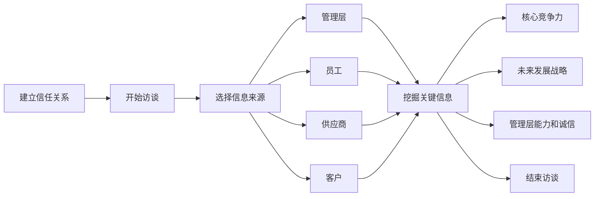

# 费雪的公司访谈技巧

> 关键词：费雪、公司访谈技巧、投资分析、信息收集、企业评估

> 摘要：本文深入探讨了费雪的公司访谈技巧。费雪作为投资领域的重要人物，其公司访谈技巧在评估企业价值、挖掘投资机会方面有着重要作用。文章将介绍相关背景，剖析核心概念，阐述核心算法（虽访谈技巧无严格算法，但会以类比方式讲解步骤），给出数学模型辅助理解，通过项目实战展示技巧应用，分析实际应用场景，推荐相关工具和资源，最后总结未来趋势与挑战，解答常见问题并提供参考资料，帮助读者全面掌握费雪的公司访谈技巧。

## 1. 背景介绍 
### 1.1 目的和范围
本次探讨费雪的公司访谈技巧，目的在于让投资者、企业研究人员等能够学习和运用这些技巧，更准确地评估公司的真实价值、发展潜力和竞争优势。范围涵盖了费雪访谈技巧的原理、操作步骤、实际应用以及相关的工具资源等方面，帮助读者建立起对该技巧的全面认知体系。

### 1.2 预期读者
预期读者主要包括投资领域的从业者，如股票投资者、基金经理等，他们可以通过掌握这些技巧更好地筛选投资标的；企业研究人员，能够运用这些技巧深入了解竞争对手或合作伙伴的情况；同时也适合对商业分析、企业评估感兴趣的爱好者，提升他们对企业分析的能力。

### 1.3 文档结构概述
本文首先介绍背景知识，包括目的、读者和文档结构等。接着阐述核心概念与联系，通过示意图和流程图展示相关要点。然后讲解核心算法原理和具体操作步骤，用 Python 代码类比说明。之后给出数学模型和公式并举例。再通过项目实战展示技巧的实际应用，分析实际场景。随后推荐相关的工具和资源，最后总结未来趋势与挑战，解答常见问题并提供参考资料。

### 1.4 术语表
#### 1.4.1 核心术语定义
- **费雪的公司访谈技巧**：指由投资大师菲利普·费雪（Philip Fisher）所总结的一套用于与公司管理层、员工、供应商、客户等进行有效沟通，以获取公司关键信息的方法和策略。
- **公司评估**：对公司的财务状况、经营业绩、市场竞争力、发展前景等方面进行综合分析和判断的过程。
- **信息收集**：通过各种渠道获取与公司相关的信息，包括公开资料、访谈记录、市场调研等。

#### 1.4.2 相关概念解释
- **定性分析**：基于对公司的非量化因素，如管理团队素质、企业文化、产品创新能力等进行分析和评估。
- **定量分析**：通过对公司的财务数据、市场份额等量化指标进行分析和计算，以评估公司的经营状况和价值。

#### 1.4.3 缩略词列表
暂无

## 2. 核心概念与联系 
费雪的公司访谈技巧核心在于通过与公司内外相关人员的沟通，获取有助于评估公司价值的信息。其主要涉及以下几个核心概念及其联系：

### 核心概念原理
- **信息来源多元化**：不仅要与公司管理层进行访谈，还要与员工、供应商、客户等进行交流。不同的信息来源可以提供不同角度的信息，相互印证和补充，从而更全面地了解公司。
- **深度挖掘关键信息**：关注公司的核心竞争力、未来发展战略、管理层的能力和诚信等关键因素。通过深入的问题和交流，挖掘出这些关键信息，为公司评估提供有力支持。
- **建立信任关系**：在访谈过程中，要与被访谈者建立良好的信任关系，让他们愿意分享真实的信息。这需要访谈者具备良好的沟通技巧和亲和力。

### 架构的文本示意图
```
费雪的公司访谈技巧
|--信息来源多元化
|   |--管理层访谈
|   |--员工访谈
|   |--供应商访谈
|   |--客户访谈
|--深度挖掘关键信息
|   |--核心竞争力
|   |--未来发展战略
|   |--管理层能力和诚信
|--建立信任关系
```

### Mermaid 流程图


## 3. 核心算法原理 & 具体操作步骤 
虽然公司访谈技巧并非严格意义上的算法，但我们可以用类似算法的步骤来描述其操作过程。以下是用 Python 代码类比的步骤：

```python
# 定义访谈类
class CompanyInterview:
    def __init__(self):
        self.information = {}

    # 选择信息来源
    def select_information_source(self):
        sources = ['管理层', '员工', '供应商', '客户']
        for source in sources:
            self.interview(source)

    # 进行访谈
    def interview(self, source):
        print(f"开始与 {source} 进行访谈")
        # 建立信任关系
        self.build_trust(source)
        # 挖掘关键信息
        key_info = self.dig_key_information(source)
        self.information[source] = key_info
        print(f"与 {source} 的访谈结束")

    # 建立信任关系
    def build_trust(self, source):
        print(f"正在与 {source} 建立信任关系")
        # 这里可以添加具体的建立信任的方法，如礼貌沟通、展示专业等
        pass

    # 挖掘关键信息
    def dig_key_information(self, source):
        print(f"正在从 {source} 挖掘关键信息")
        # 这里可以添加具体的挖掘信息的方法，如提出关键问题等
        key_info = {}
        if source == '管理层':
            key_info['核心竞争力'] = '通过访谈了解到的管理层认为的核心竞争力'
            key_info['未来发展战略'] = '通过访谈了解到的未来发展战略'
            key_info['管理层能力和诚信'] = '通过访谈对管理层能力和诚信的评估'
        elif source == '员工':
            key_info['工作氛围'] = '通过访谈了解到的工作氛围'
            key_info['员工满意度'] = '通过访谈了解到的员工满意度'
        elif source == '供应商':
            key_info['供应稳定性'] = '通过访谈了解到的供应稳定性'
            key_info['合作关系'] = '通过访谈了解到的与供应商的合作关系'
        elif source == '客户':
            key_info['产品满意度'] = '通过访谈了解到的客户对产品的满意度'
            key_info['品牌忠诚度'] = '通过访谈了解到的客户对品牌的忠诚度'
        return key_info

    # 输出信息
    def output_information(self):
        print("访谈信息汇总：")
        for source, info in self.information.items():
            print(f"{source}:")
            for key, value in info.items():
                print(f"  {key}: {value}")

# 实例化访谈类
interview = CompanyInterview()
# 选择信息来源并进行访谈
interview.select_information_source()
# 输出信息
interview.output_information()
```

### 具体操作步骤解释
1. **选择信息来源**：确定要与哪些对象进行访谈，包括管理层、员工、供应商和客户。
2. **进行访谈**：针对每个信息来源，先建立信任关系，然后挖掘关键信息。
3. **建立信任关系**：通过礼貌沟通、展示专业等方式与被访谈者建立良好的信任关系。
4. **挖掘关键信息**：根据不同的信息来源，提出相关的关键问题，获取核心竞争力、未来发展战略、工作氛围、供应稳定性等信息。
5. **输出信息**：将访谈获取的信息进行汇总和输出。

## 4. 数学模型和公式 & 详细讲解 & 举例说明 
虽然公司访谈技巧本身不涉及复杂的数学模型，但我们可以用一些简单的数学模型来辅助理解和评估访谈结果。

### 综合评估模型
假设我们从管理层、员工、供应商和客户四个方面获取了信息，每个方面的信息对公司评估的权重分别为 $w_1$、$w_2$、$w_3$、$w_4$，且 $w_1 + w_2 + w_3 + w_4 = 1$。每个方面的信息得分分别为 $s_1$、$s_2$、$s_3$、$s_4$，则公司的综合评估得分 $S$ 可以用以下公式表示：

$$S = w_1s_1 + w_2s_2 + w_3s_3 + w_4s_4$$

### 详细讲解
- **权重 $w_i$**：表示每个信息来源在公司评估中的重要程度。例如，管理层的信息可能对公司的战略规划和决策有重要影响，权重可以设置得较高；而员工的信息主要反映公司的内部情况，权重可以相对较低。
- **得分 $s_i$**：表示从每个信息来源获取的信息质量和对公司的积极程度。得分可以根据具体的信息内容进行主观评估，范围可以设定为 0 - 10 分。

### 举例说明
假设管理层、员工、供应商和客户的权重分别为 $w_1 = 0.4$、$w_2 = 0.2$、$w_3 = 0.2$、$w_4 = 0.2$，得分分别为 $s_1 = 8$、$s_2 = 6$、$s_3 = 7$、$s_4 = 7$，则公司的综合评估得分 $S$ 为：

$$S = 0.4\times8 + 0.2\times6 + 0.2\times7 + 0.2\times7$$
$$S = 3.2 + 1.2 + 1.4 + 1.4$$
$$S = 7.2$$

根据这个得分，我们可以对公司的整体情况有一个初步的评估。得分越高，说明公司在各个方面的表现越好。

## 5. 项目实战：代码实际案例和详细解释说明 
### 5.1  开发环境搭建
由于公司访谈技巧主要是通过实际的访谈操作来实现，不需要复杂的开发环境。但为了记录和分析访谈信息，我们可以使用以下工具：
- **文本编辑器**：如 Visual Studio Code、Sublime Text 等，用于记录访谈笔记和整理信息。
- **电子表格软件**：如 Microsoft Excel、Google Sheets 等，用于对访谈信息进行量化分析和统计。

### 5.2  源代码详细实现和代码解读
我们在前面已经给出了用 Python 代码类比的公司访谈操作步骤，以下是对代码的详细解读：

```python
# 定义访谈类
class CompanyInterview:
    def __init__(self):
        # 初始化一个空字典，用于存储访谈信息
        self.information = {}

    # 选择信息来源
    def select_information_source(self):
        # 定义信息来源列表
        sources = ['管理层', '员工', '供应商', '客户']
        # 遍历信息来源列表，对每个来源进行访谈
        for source in sources:
            self.interview(source)

    # 进行访谈
    def interview(self, source):
        print(f"开始与 {source} 进行访谈")
        # 调用建立信任关系的方法
        self.build_trust(source)
        # 调用挖掘关键信息的方法
        key_info = self.dig_key_information(source)
        # 将挖掘到的关键信息存储到信息字典中
        self.information[source] = key_info
        print(f"与 {source} 的访谈结束")

    # 建立信任关系
    def build_trust(self, source):
        print(f"正在与 {source} 建立信任关系")
        # 这里可以添加具体的建立信任的方法，如礼貌沟通、展示专业等
        pass

    # 挖掘关键信息
    def dig_key_information(self, source):
        print(f"正在从 {source} 挖掘关键信息")
        # 初始化一个空字典，用于存储关键信息
        key_info = {}
        if source == '管理层':
            # 模拟从管理层获取的关键信息
            key_info['核心竞争力'] = '通过访谈了解到的管理层认为的核心竞争力'
            key_info['未来发展战略'] = '通过访谈了解到的未来发展战略'
            key_info['管理层能力和诚信'] = '通过访谈对管理层能力和诚信的评估'
        elif source == '员工':
            # 模拟从员工获取的关键信息
            key_info['工作氛围'] = '通过访谈了解到的工作氛围'
            key_info['员工满意度'] = '通过访谈了解到的员工满意度'
        elif source == '供应商':
            # 模拟从供应商获取的关键信息
            key_info['供应稳定性'] = '通过访谈了解到的供应稳定性'
            key_info['合作关系'] = '通过访谈了解到的与供应商的合作关系'
        elif source == '客户':
            # 模拟从客户获取的关键信息
            key_info['产品满意度'] = '通过访谈了解到的客户对产品的满意度'
            key_info['品牌忠诚度'] = '通过访谈了解到的客户对品牌的忠诚度'
        return key_info

    # 输出信息
    def output_information(self):
        print("访谈信息汇总：")
        # 遍历信息字典，输出每个信息来源的关键信息
        for source, info in self.information.items():
            print(f"{source}:")
            for key, value in info.items():
                print(f"  {key}: {value}")

# 实例化访谈类
interview = CompanyInterview()
# 选择信息来源并进行访谈
interview.select_information_source()
# 输出信息
interview.output_information()
```

### 5.3  代码解读与分析
- **类的定义**：`CompanyInterview` 类封装了公司访谈的相关操作，包括选择信息来源、进行访谈、建立信任关系、挖掘关键信息和输出信息等。
- **初始化方法**：`__init__` 方法初始化了一个空字典 `self.information`，用于存储访谈信息。
- **选择信息来源方法**：`select_information_source` 方法定义了信息来源列表，并遍历列表对每个来源进行访谈。
- **访谈方法**：`interview` 方法调用了建立信任关系和挖掘关键信息的方法，并将挖掘到的信息存储到 `self.information` 字典中。
- **建立信任关系方法**：`build_trust` 方法目前只是打印了一条信息，实际应用中可以添加具体的建立信任的方法。
- **挖掘关键信息方法**：`dig_key_information` 方法根据不同的信息来源，模拟获取了相应的关键信息，并存储到 `key_info` 字典中。
- **输出信息方法**：`output_information` 方法遍历 `self.information` 字典，输出每个信息来源的关键信息。

通过这个代码示例，我们可以清晰地看到公司访谈的操作流程和信息存储方式。

## 6. 实际应用场景 
### 投资决策
投资者在选择投资标的时，可以运用费雪的公司访谈技巧，与目标公司的管理层、员工、供应商和客户进行访谈，了解公司的核心竞争力、未来发展战略、财务状况等信息，从而更准确地评估公司的价值和投资潜力，做出明智的投资决策。

### 企业战略规划
企业在制定战略规划时，可以通过访谈了解市场需求、竞争对手情况、内部员工意见等信息，为战略规划提供有力支持。例如，与客户访谈可以了解客户的需求和满意度，从而优化产品和服务；与供应商访谈可以了解供应情况和成本，为供应链管理提供参考。

### 企业并购
在企业并购过程中，收购方可以通过访谈目标公司的相关人员，深入了解目标公司的真实情况，包括财务状况、业务运营、企业文化等，评估并购的风险和价值，制定合理的并购策略。

### 市场调研
市场调研机构可以运用费雪的公司访谈技巧，与企业和消费者进行访谈，了解市场动态、消费者需求、行业趋势等信息，为企业提供市场调研服务。

## 7. 工具和资源推荐
### 7.1 学习资源推荐
#### 7.1.1 书籍推荐
- 《怎样选择成长股》（Common Stocks and Uncommon Profits）：菲利普·费雪的经典著作，详细阐述了他的投资理念和公司分析方法，其中包括公司访谈技巧的相关内容。
- 《聪明的投资者》（The Intelligent Investor）：本杰明·格雷厄姆的著作，虽然主要侧重于价值投资，但其中也有关于公司分析和信息收集的方法，对理解公司访谈技巧有一定的帮助。

#### 7.1.2 在线课程
- Coursera 上的“投资分析与组合管理”课程：该课程涵盖了投资分析的各个方面，包括公司分析和估值，可能会涉及到公司访谈技巧的讲解。
- Udemy 上的“商业分析与决策”课程：课程中会介绍一些商业分析的方法和工具，其中可能包括访谈技巧的应用。

#### 7.1.3 技术博客和网站
- Seeking Alpha：一个提供投资分析和研究报告的网站，上面有很多关于公司分析和访谈的文章和观点。
- 雪球网：国内知名的投资社区，有很多投资者分享自己的投资经验和公司分析方法，包括访谈技巧的应用案例。

### 7.2 开发工具框架推荐
#### 7.2.1 IDE和编辑器
- Visual Studio Code：一款功能强大的开源代码编辑器，支持多种编程语言和插件，可以用于记录访谈笔记和整理信息。
- Sublime Text：简洁高效的文本编辑器，适合快速记录和编辑访谈内容。

#### 7.2.2 调试和性能分析工具
虽然公司访谈技巧本身不需要调试和性能分析工具，但如果需要对访谈信息进行量化分析和统计，可以使用以下工具：
- Microsoft Excel：功能强大的电子表格软件，可用于数据整理、分析和可视化。
- Google Sheets：在线电子表格软件，方便多人协作和共享数据。

#### 7.2.3 相关框架和库
由于公司访谈技巧主要是通过实际的访谈操作来实现，不需要特定的框架和库。但如果需要对访谈信息进行自然语言处理和分析，可以使用以下库：
- NLTK（Natural Language Toolkit）：Python 中的自然语言处理库，提供了各种文本处理和分析的工具。
- SpaCy：另一个流行的 Python 自然语言处理库，具有高效的处理速度和丰富的功能。

### 7.3 相关论文著作推荐
#### 7.3.1 经典论文
- "The Quality of Earnings" by Thornton L. O'glove：该论文探讨了如何通过分析公司的财务报表和访谈等方式评估公司的盈利质量，对公司访谈技巧的应用有一定的启示。
- "Financial Statement Analysis and Security Valuation" by Stephen H. Penman：论文介绍了财务报表分析和证券估值的方法，其中涉及到如何通过访谈获取公司的财务信息和经营情况。

#### 7.3.2 最新研究成果
可以通过学术数据库，如 IEEE Xplore、ACM Digital Library、ScienceDirect 等，搜索关于公司分析、访谈技巧、投资决策等方面的最新研究成果。

#### 7.3.3 应用案例分析
- 一些知名投资机构的研究报告和案例分析，如巴菲特的伯克希尔·哈撒韦公司的年报和投资案例，其中可能会涉及到公司访谈技巧的应用和分析。
- 企业管理咨询公司的案例研究，如麦肯锡、波士顿咨询集团等，这些案例研究通常会详细介绍如何通过访谈等方式了解企业的情况并提供解决方案。

## 8. 总结：未来发展趋势与挑战
### 未来发展趋势
- **数字化访谈**：随着信息技术的发展，未来公司访谈可能会更多地采用数字化方式，如视频会议、在线问卷等。这将提高访谈的效率和便利性，同时也可以扩大访谈的范围。
- **大数据与人工智能辅助**：大数据和人工智能技术可以帮助分析访谈信息，挖掘潜在的信息和趋势。例如，通过自然语言处理技术对访谈文本进行情感分析、关键词提取等，为公司评估提供更准确的依据。
- **跨领域整合**：公司访谈技巧将与其他领域的知识和方法进行更深入的整合，如心理学、社会学等。通过了解被访谈者的心理和行为特点，提高访谈的效果和质量。

### 挑战
- **信息真实性**：在访谈过程中，被访谈者可能会提供虚假或不准确的信息，这给信息收集和分析带来了挑战。访谈者需要具备识别信息真实性的能力，通过多渠道验证和交叉分析来确保信息的可靠性。
- **访谈技巧的提升**：随着市场环境的变化和企业的发展，访谈技巧也需要不断提升和创新。访谈者需要不断学习和实践，掌握新的访谈方法和技巧，以适应不同的访谈场景和对象。
- **隐私和合规问题**：在数字化访谈过程中，需要注意保护被访谈者的隐私和信息安全，同时要遵守相关的法律法规和行业规范。

## 9. 附录：常见问题与解答
### 问题 1：访谈时应该问哪些问题？
解答：访谈问题应根据不同的信息来源和访谈目的来设计。对于管理层，可以询问公司的核心竞争力、未来发展战略、财务状况等；对于员工，可以询问工作氛围、员工满意度、职业发展等；对于供应商，可以询问供应稳定性、合作关系、成本等；对于客户，可以询问产品满意度、品牌忠诚度、需求偏好等。

### 问题 2：如何建立与被访谈者的信任关系？
解答：建立信任关系需要注意以下几点：一是要礼貌、尊重被访谈者，认真倾听他们的意见和想法；二是要展示自己的专业知识和能力，让被访谈者相信你的访谈是有价值的；三是要保持诚实和透明，不隐瞒自己的目的和意图。

### 问题 3：如果被访谈者不愿意配合怎么办？
解答：如果被访谈者不愿意配合，可以尝试以下方法：一是了解他们不愿意配合的原因，针对性地解决问题；二是强调访谈的目的和意义，让他们认识到访谈对他们和公司的好处；三是提供一些激励措施，如保密承诺、反馈报告等。

### 问题 4：如何分析访谈信息？
解答：分析访谈信息可以采用定性和定量相结合的方法。定性分析可以通过对访谈文本进行归纳、总结和分类，提取关键信息和主题；定量分析可以对访谈中涉及的量化指标进行统计和计算，如满意度得分、市场份额等。同时，可以结合其他渠道的信息进行综合分析，提高分析的准确性和可靠性。

## 10. 扩展阅读 & 参考资料
### 扩展阅读
- 《彼得·林奇的成功投资》（One Up On Wall Street）：彼得·林奇分享了他的投资经验和选股方法，其中也涉及到对公司的分析和调研。
- 《金融炼金术》（The Alchemy of Finance）：乔治·索罗斯阐述了他的投资哲学和市场理论，对理解公司在市场中的表现和价值有一定的帮助。

### 参考资料
- Fisher, Philip A. Common Stocks and Uncommon Profits. Harper & Row, 1958.
- Graham, Benjamin. The Intelligent Investor. HarperBusiness, 2003.
- O'glove, Thornton L. The Quality of Earnings. Dow Jones-Irwin, 1987.
- Penman, Stephen H. Financial Statement Analysis and Security Valuation. McGraw-Hill Education, 2018.

作者：AI天才研究院/AI Genius Institute & 禅与计算机程序设计艺术 /Zen And The Art of Computer Programming