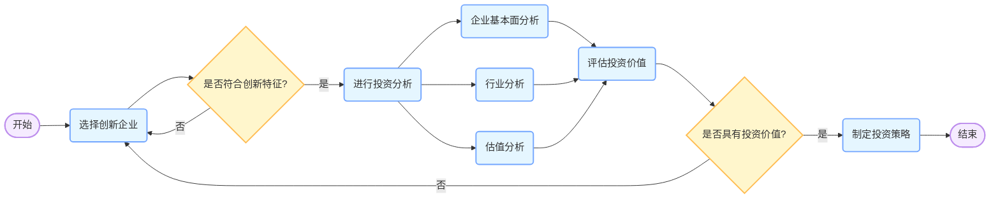

# 费雪的创新企业投资：把握科技革新带来的机遇

> 关键词：费雪投资理念、创新企业、科技革新、投资机遇、企业分析

> 摘要：本文深入探讨了费雪的创新企业投资理念，旨在帮助投资者把握科技革新带来的机遇。从费雪投资理念的背景介绍入手，阐述其核心概念与联系，详细分析核心算法原理及操作步骤，运用数学模型和公式进行理论支撑，并通过实际项目案例展示如何运用该理念进行投资分析。同时，介绍了该投资理念的实际应用场景，推荐了相关的学习工具和资源，最后总结未来发展趋势与挑战，解答常见问题并提供扩展阅读与参考资料。

## 1. 背景介绍 
### 1.1 目的和范围
本文章的主要目的是全面剖析费雪的创新企业投资理念，深入研究如何借助这一理念在科技革新的浪潮中捕捉投资机会。我们将详细探讨费雪投资理念的核心要素、应用方法以及实际操作流程，为投资者提供一套系统的投资分析框架。范围涵盖费雪投资理念的理论基础、核心算法、数学模型，以及在实际项目中的应用案例，同时介绍相关的学习资源和工具。

### 1.2 预期读者
本文预期读者包括对股票投资有兴趣的个人投资者、金融行业的专业人士、投资机构的分析师以及从事金融研究的学者。无论您是投资新手，希望了解如何选择具有潜力的创新企业进行投资，还是经验丰富的投资者，想要进一步完善自己的投资策略，本文都将为您提供有价值的参考。

### 1.3 文档结构概述
本文将按照以下结构进行阐述：首先介绍费雪投资理念的背景知识，包括目的、预期读者和文档结构概述，以及相关术语的定义和解释。接着，深入探讨核心概念与联系，通过文本示意图和 Mermaid 流程图展示其架构。然后，详细讲解核心算法原理，并给出具体操作步骤，同时运用 Python 源代码进行示例。之后，运用数学模型和公式对投资分析进行理论支持，并举例说明。在项目实战部分，通过实际案例展示如何运用费雪投资理念进行投资分析，包括开发环境搭建、源代码实现和代码解读。随后，介绍该投资理念的实际应用场景。再推荐相关的学习工具和资源，包括书籍、在线课程、技术博客、开发工具、框架和库以及相关论文著作。最后，总结未来发展趋势与挑战，解答常见问题并提供扩展阅读与参考资料。

### 1.4 术语表
#### 1.4.1 核心术语定义
- **费雪投资理念**：由菲利普·费雪（Philip Fisher）提出的一种投资哲学，强调通过深入研究企业的基本面，寻找具有长期竞争优势和成长潜力的创新企业进行投资。
- **创新企业**：指那些在技术、产品、服务或商业模式等方面具有创新性，能够为市场带来新的价值和竞争优势的企业。
- **科技革新**：指科学技术领域的重大变革和进步，包括新技术的发明、应用和推广，以及对现有技术的改进和升级。
- **投资机遇**：指在市场中存在的能够为投资者带来潜在收益的投资机会。

#### 1.4.2 相关概念解释
- **成长股投资**：成长股投资是费雪投资理念的核心之一，它关注企业的长期成长潜力，通过投资具有高成长率的企业股票，分享企业成长带来的收益。
- **企业基本面分析**：对企业的财务状况、经营管理、市场竞争力、行业前景等方面进行全面深入的研究和分析，以评估企业的内在价值和投资价值。
- **竞争优势**：企业在市场中相对于竞争对手所具有的优势，包括技术优势、成本优势、品牌优势、渠道优势等，这些优势能够帮助企业获得更高的市场份额和利润。

#### 1.4.3 缩略词列表
- **ROE**：Return on Equity，净资产收益率，反映企业运用自有资本的效率。
- **EPS**：Earnings Per Share，每股收益，衡量企业盈利能力的重要指标。

## 2. 核心概念与联系 

费雪的创新企业投资理念核心在于寻找具有长期成长潜力的创新企业进行投资。其核心概念主要包括创新企业的特征、投资分析的要素以及它们之间的联系。

### 核心概念原理
创新企业通常具有以下特征：
1. **技术创新**：拥有独特的技术或研发能力，能够不断推出新产品或改进现有产品。
2. **市场潜力**：所处市场具有较大的增长空间，能够为企业的发展提供广阔的市场需求。
3. **管理团队**：具备优秀的管理团队，能够有效地组织和运营企业，推动企业的发展。
4. **财务状况**：具有良好的财务状况，包括稳定的现金流、合理的资产负债结构等。

投资分析的要素主要包括：
1. **企业基本面分析**：通过对企业的财务报表、经营管理、市场竞争力等方面进行分析，评估企业的内在价值。
2. **行业分析**：研究企业所处的行业环境，包括行业的发展趋势、竞争格局、政策法规等，判断行业的前景和企业在行业中的地位。
3. **估值分析**：运用合适的估值方法，如市盈率、市净率等，评估企业股票的合理价格，判断投资的性价比。

### 架构的文本示意图
```plaintext
费雪的创新企业投资理念
|
|-- 创新企业特征
|   |-- 技术创新
|   |-- 市场潜力
|   |-- 管理团队
|   |-- 财务状况
|
|-- 投资分析要素
|   |-- 企业基本面分析
|   |   |-- 财务报表分析
|   |   |-- 经营管理分析
|   |   |-- 市场竞争力分析
|   |-- 行业分析
|   |   |-- 行业发展趋势
|   |   |-- 竞争格局
|   |   |-- 政策法规
|   |-- 估值分析
|       |-- 市盈率估值
|       |-- 市净率估值
|
|-- 投资决策
|   |-- 评估投资价值
|   |-- 制定投资策略
```

### Mermaid 流程图


## 3. 核心算法原理 & 具体操作步骤 

### 核心算法原理
费雪的创新企业投资分析主要基于对企业基本面、行业和估值的综合评估。在实际操作中，我们可以通过构建量化指标体系来进行分析。以下是一些核心指标及其计算方法：

#### 1. 净资产收益率（ROE）
ROE 反映了企业运用自有资本的效率，计算公式为：
$$ROE = \frac{净利润}{净资产} \times 100\%$$

#### 2. 每股收益（EPS）
EPS 衡量了企业的盈利能力，计算公式为：
$$EPS = \frac{净利润}{总股本}$$

#### 3. 市盈率（PE）
PE 用于评估股票的估值水平，计算公式为：
$$PE = \frac{股票价格}{每股收益}$$

#### 4. 市净率（PB）
PB 反映了股票价格与每股净资产的关系，计算公式为：
$$PB = \frac{股票价格}{每股净资产}$$

### 具体操作步骤
#### 步骤 1：筛选创新企业
通过行业研究、新闻报道、科技论坛等渠道，寻找具有创新特征的企业。可以关注企业的研发投入、新产品推出情况、专利数量等指标。

#### 步骤 2：收集数据
收集目标企业的财务报表、行业报告、市场数据等信息，为后续的分析提供数据支持。

#### 步骤 3：计算核心指标
使用收集到的数据，计算 ROE、EPS、PE、PB 等核心指标。

#### 步骤 4：评估企业基本面
根据计算得到的核心指标，结合企业的经营管理、市场竞争力等方面进行综合评估，判断企业的基本面是否良好。

#### 步骤 5：分析行业前景
研究企业所处的行业环境，包括行业的发展趋势、竞争格局、政策法规等，判断行业的前景和企业在行业中的地位。

#### 步骤 6：进行估值分析
运用 PE、PB 等估值方法，评估企业股票的合理价格，判断投资的性价比。

#### 步骤 7：做出投资决策
根据综合评估结果，决定是否投资目标企业，并制定相应的投资策略。

### Python 源代码示例
```python
import pandas as pd

# 假设我们已经收集到了某企业的财务数据
financial_data = {
    '净利润': [1000, 1200, 1500],
    '净资产': [5000, 6000, 7000],
    '总股本': [2000, 2000, 2000],
    '股票价格': [10, 12, 15]
}

# 创建 DataFrame
df = pd.DataFrame(financial_data)

# 计算 ROE
df['ROE'] = df['净利润'] / df['净资产'] * 100

# 计算 EPS
df['EPS'] = df['净利润'] / df['总股本']

# 计算 PE
df['PE'] = df['股票价格'] / df['EPS']

# 计算 PB
df['每股净资产'] = df['净资产'] / df['总股本']
df['PB'] = df['股票价格'] / df['每股净资产']

# 打印结果
print(df)
```

在上述代码中，我们首先创建了一个包含企业财务数据的字典，然后使用 Pandas 库将其转换为 DataFrame。接着，我们根据公式计算了 ROE、EPS、PE 和 PB 等指标，并将结果添加到 DataFrame 中。最后，我们打印出计算结果。

## 4. 数学模型和公式 & 详细讲解 & 举例说明 

### 数学模型和公式
#### 1. 净资产收益率（ROE）
$$ROE = \frac{净利润}{净资产} \times 100\%$$
ROE 是衡量企业盈利能力和股东权益回报水平的重要指标。ROE 越高，说明企业运用自有资本的效率越高，股东权益的回报也就越高。

#### 2. 每股收益（EPS）
$$EPS = \frac{净利润}{总股本}$$
EPS 反映了普通股股东每股所能享有的利润。EPS 越高，说明企业的盈利能力越强，股东所能获得的收益也就越高。

#### 3. 市盈率（PE）
$$PE = \frac{股票价格}{每股收益}$$
PE 是最常用的估值指标之一，用于评估股票的估值水平。PE 越高，说明市场对该股票的预期越高，但同时也意味着投资风险相对较大。

#### 4. 市净率（PB）
$$PB = \frac{股票价格}{每股净资产}$$
PB 反映了股票价格与每股净资产的关系。PB 越低，说明股票的估值相对较低，投资价值相对较高。

### 详细讲解
#### ROE
ROE 可以分解为三个因素的乘积，即杜邦分析公式：
$$ROE = 销售净利率 \times 总资产周转率 \times 权益乘数$$
其中，销售净利率反映了企业的盈利能力，总资产周转率反映了企业的运营效率，权益乘数反映了企业的财务杠杆水平。通过杜邦分析，我们可以深入了解企业 ROE 的驱动因素，评估企业的经营状况和财务风险。

#### EPS
EPS 的增长是企业成长的重要标志之一。投资者通常会关注企业 EPS 的增长率，以判断企业的成长潜力。EPS 增长率可以通过以下公式计算：
$$EPS 增长率 = \frac{本期 EPS - 上期 EPS}{上期 EPS} \times 100\%$$

#### PE
PE 的合理范围会因行业、企业的发展阶段等因素而有所不同。一般来说，成长型企业的 PE 会相对较高，而成熟型企业的 PE 会相对较低。投资者可以通过比较目标企业的 PE 与同行业其他企业的 PE，来判断该股票的估值是否合理。

#### PB
PB 通常用于评估具有大量固定资产的企业，如制造业、银行业等。PB 较低的股票可能被市场低估，但也可能意味着企业存在一些问题，如盈利能力不佳、资产质量较差等。因此，在使用 PB 进行估值时，需要结合其他指标进行综合分析。

### 举例说明
假设我们要分析一家科技企业 A 的投资价值。该企业的财务数据如下：
- 净利润：2000 万元
- 净资产：10000 万元
- 总股本：5000 万股
- 股票价格：20 元

#### 计算核心指标
- ROE = $\frac{2000}{10000} \times 100\% = 20\%$
- EPS = $\frac{2000}{5000} = 0.4$ 元
- PE = $\frac{20}{0.4} = 50$
- 每股净资产 = $\frac{10000}{5000} = 2$ 元
- PB = $\frac{20}{2} = 10$

#### 分析结果
- ROE 为 20%，说明该企业运用自有资本的效率较高，盈利能力较强。
- EPS 为 0.4 元，反映了该企业的每股盈利水平。
- PE 为 50，相对较高，说明市场对该企业的预期较高，但也意味着投资风险相对较大。
- PB 为 10，说明该股票的价格相对每股净资产较高。

综合来看，该企业具有一定的投资价值，但需要进一步关注其未来的发展前景和业绩增长情况，以及市场对其的预期是否合理。

## 5. 项目实战：代码实际案例和详细解释说明 

### 5.1  开发环境搭建
为了实现费雪的创新企业投资分析，我们可以使用 Python 作为开发语言，并结合一些常用的数据分析库，如 Pandas、NumPy 和 Matplotlib。以下是搭建开发环境的步骤：

#### 步骤 1：安装 Python
可以从 Python 官方网站（https://www.python.org/downloads/）下载并安装 Python 3.x 版本。

#### 步骤 2：安装必要的库
打开命令行工具，使用以下命令安装 Pandas、NumPy 和 Matplotlib：
```sh
pip install pandas numpy matplotlib
```

### 5.2  源代码详细实现和代码解读
以下是一个完整的 Python 代码示例，用于对创新企业进行投资分析：

```python
import pandas as pd
import numpy as np
import matplotlib.pyplot as plt

# 模拟收集到的企业财务数据
financial_data = {
    '年份': [2018, 2019, 2020, 2021, 2022],
    '净利润': [1000, 1200, 1500, 1800, 2000],
    '净资产': [5000, 6000, 7000, 8000, 9000],
    '总股本': [2000, 2000, 2000, 2000, 2000],
    '股票价格': [10, 12, 15, 18, 20]
}

# 创建 DataFrame
df = pd.DataFrame(financial_data)

# 计算核心指标
df['ROE'] = df['净利润'] / df['净资产'] * 100
df['EPS'] = df['净利润'] / df['总股本']
df['PE'] = df['股票价格'] / df['EPS']
df['每股净资产'] = df['净资产'] / df['总股本']
df['PB'] = df['股票价格'] / df['每股净资产']

# 计算 EPS 增长率
df['EPS 增长率'] = df['EPS'].pct_change() * 100

# 打印计算结果
print(df)

# 绘制 ROE 和 EPS 增长率的折线图
plt.figure(figsize=(10, 6))
plt.plot(df['年份'], df['ROE'], label='ROE')
plt.plot(df['年份'], df['EPS 增长率'], label='EPS 增长率')
plt.xlabel('年份')
plt.ylabel('百分比')
plt.title('ROE 和 EPS 增长率变化趋势')
plt.legend()
plt.grid(True)
plt.show()
```

### 代码解读与分析
#### 1. 数据模拟与 DataFrame 创建
```python
financial_data = {
    '年份': [2018, 2019, 2020, 2021, 2022],
    '净利润': [1000, 1200, 1500, 1800, 2000],
    '净资产': [5000, 6000, 7000, 8000, 9000],
    '总股本': [2000, 2000, 2000, 2000, 2000],
    '股票价格': [10, 12, 15, 18, 20]
}

df = pd.DataFrame(financial_data)
```
这段代码模拟了企业的财务数据，并使用 Pandas 的 `DataFrame` 类将其转换为数据框，方便后续的计算和分析。

#### 2. 核心指标计算
```python
df['ROE'] = df['净利润'] / df['净资产'] * 100
df['EPS'] = df['净利润'] / df['总股本']
df['PE'] = df['股票价格'] / df['EPS']
df['每股净资产'] = df['净资产'] / df['总股本']
df['PB'] = df['股票价格'] / df['每股净资产']
```
根据前面介绍的公式，计算了 ROE、EPS、PE、每股净资产和 PB 等核心指标，并将结果添加到数据框中。

#### 3. EPS 增长率计算
```python
df['EPS 增长率'] = df['EPS'].pct_change() * 100
```
使用 Pandas 的 `pct_change()` 方法计算 EPS 的增长率，并将结果添加到数据框中。

#### 4. 结果打印与可视化
```python
print(df)

plt.figure(figsize=(10, 6))
plt.plot(df['年份'], df['ROE'], label='ROE')
plt.plot(df['年份'], df['EPS 增长率'], label='EPS 增长率')
plt.xlabel('年份')
plt.ylabel('百分比')
plt.title('ROE 和 EPS 增长率变化趋势')
plt.legend()
plt.grid(True)
plt.show()
```
打印计算结果，并使用 Matplotlib 库绘制 ROE 和 EPS 增长率的折线图，直观展示企业的盈利能力和成长趋势。

## 6. 实际应用场景 
### 个人投资者
对于个人投资者来说，费雪的创新企业投资理念可以帮助他们在众多的股票中筛选出具有潜力的创新企业进行投资。通过深入研究企业的基本面和行业前景，个人投资者可以做出更加理性和明智的投资决策，避免盲目跟风和投机行为。例如，个人投资者可以关注科技、医疗、新能源等领域的创新企业，通过分析企业的研发投入、新产品推出情况、市场份额等指标，选择具有成长潜力的企业进行长期投资。

### 投资机构
投资机构通常管理着大量的资金，需要寻找具有高回报率的投资项目。费雪的创新企业投资理念可以为投资机构提供一套系统的投资分析框架，帮助他们筛选出优质的创新企业进行投资。投资机构可以利用专业的研究团队和数据分析工具，对企业的基本面、行业前景和估值进行深入分析，制定合理的投资策略。例如，投资机构可以通过参与创新企业的私募股权融资、首次公开募股（IPO）等方式，获取企业成长带来的收益。

### 企业战略规划
企业自身也可以运用费雪的创新企业投资理念进行战略规划。通过分析自身的创新能力、市场竞争力和财务状况，企业可以制定合理的发展战略，明确自身的发展方向和目标。例如，企业可以加大研发投入，提升自身的技术创新能力；拓展市场渠道，提高市场份额；优化财务结构，降低财务风险等。同时，企业还可以通过并购、重组等方式，整合资源，实现快速发展。

## 7. 工具和资源推荐
### 7.1 学习资源推荐
#### 7.1.1 书籍推荐
- 《怎样选择成长股》（Common Stocks and Uncommon Profits）：菲利普·费雪的经典著作，详细阐述了他的投资理念和选股方法。
- 《聪明的投资者》（The Intelligent Investor）：本杰明·格雷厄姆的代表作，强调了价值投资的重要性，对费雪的投资理念也有一定的影响。
- 《金融炼金术》（The Alchemy of Finance）：乔治·索罗斯的著作，介绍了他的投资哲学和市场分析方法，对投资者拓宽视野有很大帮助。

#### 7.1.2 在线课程
- Coursera 上的“投资学原理”（Principles of Investing）：由知名大学教授授课，系统介绍了投资学的基本原理和方法。
- edX 上的“金融市场”（Financial Markets）：耶鲁大学教授罗伯特·席勒主讲，深入探讨了金融市场的运行机制和投资策略。
- 网易云课堂上的“股票投资实战课程”：结合实际案例，讲解股票投资的技巧和方法。

#### 7.1.3 技术博客和网站
- 雪球（https://xueqiu.com/）：国内知名的投资社区，提供股票行情、财经新闻、投资分析等信息，投资者可以在这里交流投资经验和心得。
- 东方财富网（https://www.eastmoney.com/）：提供全面的财经资讯、股票行情、数据分析等服务，是投资者获取信息的重要渠道。
- Seeking Alpha（https://seekingalpha.com/）：美国知名的金融投资网站，提供专业的股票分析和投资建议。

### 7.2 开发工具框架推荐
#### 7.2.1 IDE和编辑器
- PyCharm：一款专业的 Python 集成开发环境，具有强大的代码编辑、调试和项目管理功能。
- Jupyter Notebook：一种交互式的开发环境，适合进行数据分析和可视化，方便代码的编写和展示。
- Visual Studio Code：一款轻量级的代码编辑器，支持多种编程语言，具有丰富的插件生态系统。

#### 7.2.2 调试和性能分析工具
- pdb：Python 内置的调试工具，可以帮助开发者定位和解决代码中的问题。
- cProfile：Python 标准库中的性能分析工具，可以分析代码的运行时间和函数调用情况。
- Py-Spy：一款轻量级的 Python 性能分析工具，可以实时监控 Python 程序的运行状态。

#### 7.2.3 相关框架和库
- Pandas：用于数据处理和分析的 Python 库，提供了高效的数据结构和数据分析工具。
- NumPy：Python 的科学计算基础库，提供了高效的多维数组对象和数学函数。
- Matplotlib：用于数据可视化的 Python 库，可以绘制各种类型的图表和图形。

### 7.3 相关论文著作推荐
#### 7.3.1 经典论文
- “The Cross - Section of Expected Stock Returns” by Eugene F. Fama and Kenneth R. French：提出了著名的 Fama - French 三因子模型，对股票收益率的影响因素进行了深入研究。
- “Efficient Capital Markets: A Review of Theory and Empirical Work” by Eugene F. Fama：系统阐述了有效市场假说，对金融市场的效率和定价机制进行了探讨。

#### 7.3.2 最新研究成果
- 关注顶级金融学术期刊，如《Journal of Finance》、《Review of Financial Studies》等，了解最新的投资研究成果和理论进展。

#### 7.3.3 应用案例分析
- 阅读一些投资机构或知名投资者的案例分析报告，学习他们的投资策略和分析方法，如巴菲特、彼得·林奇等投资大师的投资案例。

## 8. 总结：未来发展趋势与挑战
### 未来发展趋势
#### 科技革新加速
随着科技的不断进步，科技革新的速度将越来越快，新的技术和商业模式将不断涌现。这将为创新企业的发展提供更多的机遇，也为投资者带来更多的投资选择。例如，人工智能、区块链、量子计算等新兴技术的发展，将催生一批具有高成长潜力的创新企业。

#### 行业融合加剧
不同行业之间的融合将越来越明显，传统行业将借助科技的力量进行转型升级。例如，制造业与互联网、大数据、人工智能等技术的融合，将推动智能制造的发展；金融行业与科技的融合，将催生金融科技的兴起。投资者需要关注行业融合的趋势，寻找具有跨行业竞争优势的创新企业进行投资。

#### 国际化投资趋势增强
随着全球经济一体化的发展，投资者将更加注重国际化投资。创新企业的发展也将不再局限于本国市场，而是面向全球市场。投资者可以通过投资国际化的创新企业，分享全球科技革新带来的机遇。

### 挑战
#### 技术风险
创新企业通常依赖于新技术的研发和应用，技术风险是其面临的主要风险之一。新技术的研发具有不确定性，可能会遇到技术难题无法攻克，或者新技术的应用效果不如预期。投资者需要对创新企业的技术实力和研发能力进行深入评估，降低技术风险。

#### 市场竞争风险
科技革新带来的机遇也吸引了大量的企业进入市场，市场竞争将更加激烈。创新企业需要不断提升自身的核心竞争力，才能在市场中立足。投资者需要关注创新企业的市场份额、竞争优势和市场拓展能力，评估其在激烈市场竞争中的生存和发展能力。

#### 政策风险
政策法规的变化可能会对创新企业的发展产生重大影响。例如，政府对某些行业的监管政策、税收政策等的调整，可能会影响创新企业的盈利能力和发展前景。投资者需要关注政策法规的变化，及时调整投资策略。

## 9. 附录：常见问题与解答
### 问题 1：如何判断一家企业是否具有创新性？
解答：可以从以下几个方面判断企业的创新性：
- 研发投入：企业是否持续投入大量资金进行研发，研发投入占营业收入的比例是否较高。
- 专利数量：企业拥有的专利数量和质量可以反映其技术创新能力。
- 新产品推出情况：企业是否能够不断推出新产品或改进现有产品，满足市场需求。
- 商业模式创新：企业是否采用了新的商业模式，提高了运营效率和市场竞争力。

### 问题 2：费雪的投资理念是否适用于所有类型的企业？
解答：费雪的投资理念主要适用于具有长期成长潜力的创新企业。对于一些成熟型企业或传统行业的企业，可能需要结合其他投资理念和方法进行分析。因为成熟型企业的成长速度相对较慢，其投资价值更多地体现在稳定的现金流和分红上；而传统行业的企业可能面临行业竞争激烈、技术更新换代慢等问题，需要关注其行业地位和成本控制能力。

### 问题 3：在使用 PE 和 PB 进行估值时，需要注意什么？
解答：在使用 PE 和 PB 进行估值时，需要注意以下几点：
- 行业差异：不同行业的 PE 和 PB 水平可能存在较大差异，不能简单地进行跨行业比较。例如，科技行业的 PE 通常较高，而制造业的 PE 相对较低。
- 企业发展阶段：处于不同发展阶段的企业，其 PE 和 PB 也会有所不同。成长型企业的 PE 可能较高，而成熟型企业的 PE 可能较低。
- 财务数据质量：PE 和 PB 的计算依赖于企业的财务数据，需要确保财务数据的真实性和可靠性。同时，要关注企业的财务报表是否存在异常情况，如利润操纵等。

## 10. 扩展阅读 & 参考资料
### 扩展阅读
- 《创新者的窘境》（The Innovator's Dilemma）：克莱顿·克里斯坦森的著作，探讨了创新企业在面对技术变革和市场竞争时所面临的困境和挑战。
- 《从 0 到 1》（Zero to One）：彼得·蒂尔的著作，介绍了创业公司如何从无到有，创造出具有独特价值的产品和服务。

### 参考资料
- 菲利普·费雪的相关著作和文章。
- 金融学术期刊上的相关研究论文。
- 投资机构和财经媒体发布的研究报告和分析文章。

作者：AI天才研究院/AI Genius Institute & 禅与计算机程序设计艺术 /Zen And The Art of Computer Programming