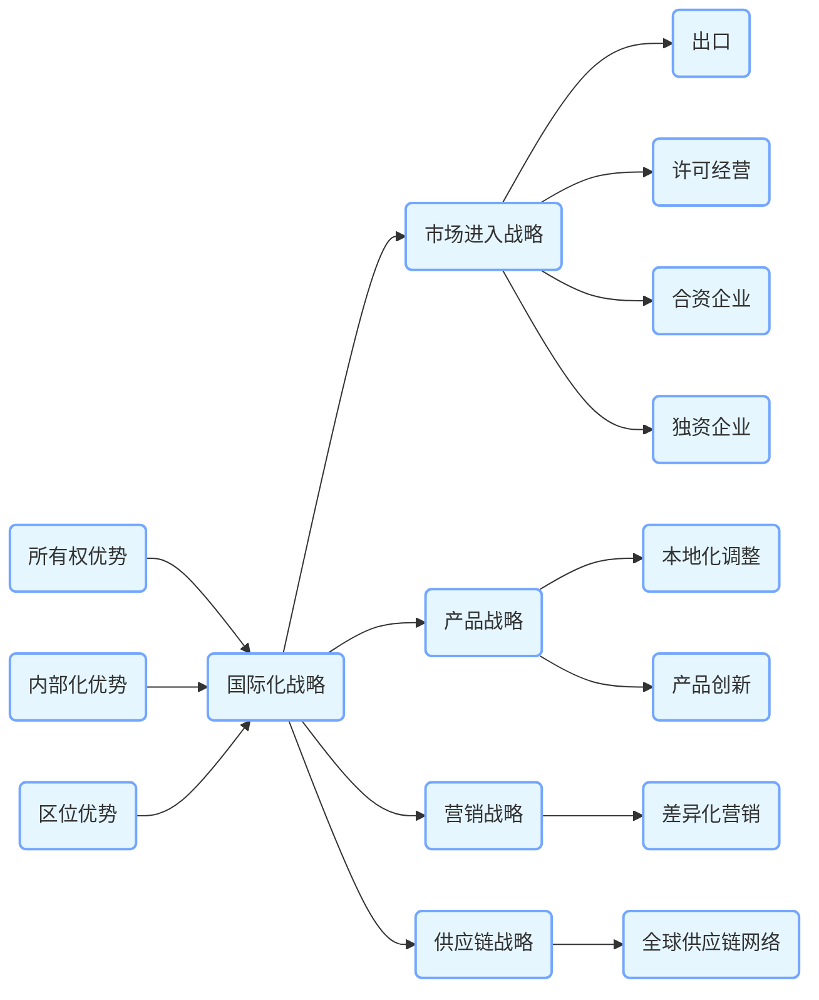

# 费雪的国际化战略评估：全球扩张的潜力

> 关键词：费雪、国际化战略、全球扩张、潜力评估、市场分析

> 摘要：本文聚焦于费雪的国际化战略评估，旨在深入剖析其在全球扩张方面的潜力。通过对费雪相关核心概念的阐述、核心算法原理的讲解、数学模型的分析，结合项目实战案例，探讨其在不同实际应用场景中的表现。同时，推荐了相关的学习资源、开发工具框架以及论文著作，最后总结了未来发展趋势与挑战，并提供常见问题解答和扩展阅读参考资料，为全面理解费雪的国际化战略及全球扩张潜力提供系统的分析。

## 1. 背景介绍 
### 1.1 目的和范围
本研究的目的在于全面评估费雪实施国际化战略、进行全球扩张的潜力。通过对市场环境、企业自身资源与能力等多方面因素的分析，为费雪的国际化决策提供科学依据。范围涵盖了全球主要市场，包括北美、欧洲、亚洲、南美等地区，同时涉及费雪的主要产品线和业务领域。

### 1.2 预期读者
本文预期读者包括费雪公司的管理层、市场营销人员、战略规划人员，以及对企业国际化战略和全球扩张感兴趣的学者、研究人员和行业从业者。

### 1.3 文档结构概述
本文首先介绍相关背景信息，接着阐述核心概念与联系，包括费雪国际化战略的原理和架构。然后详细讲解核心算法原理及具体操作步骤，并给出数学模型和公式进行深入分析。通过项目实战案例展示实际应用，探讨在不同场景下的表现。推荐相关的工具和资源，最后总结未来发展趋势与挑战，提供常见问题解答和扩展阅读参考资料。

### 1.4 术语表
#### 1.4.1 核心术语定义
- **国际化战略**：企业为了实现全球市场的拓展和资源的优化配置，在国际市场上开展一系列经营活动的战略规划。
- **全球扩张**：企业将业务从本土市场向全球其他国家和地区拓展的过程。
- **市场潜力**：特定市场在一定时期内，在一定的营销环境和营销努力下，可能达到的最大需求量。

#### 1.4.2 相关概念解释
- **区位优势**：不同国家或地区在资源禀赋、市场规模、政策环境等方面存在的差异，企业可以利用这些差异选择最有利的投资和经营地点。
- **所有权优势**：企业拥有的独特资源和能力，如品牌、技术、管理经验等，使其在国际市场上具有竞争优势。
- **内部化优势**：企业通过内部化交易，将中间产品的市场交易转化为企业内部的交易，以降低交易成本和风险。

#### 1.4.3 缩略词列表
- **GDP**：国内生产总值（Gross Domestic Product）
- **FDI**：外国直接投资（Foreign Direct Investment）

## 2. 核心概念与联系 

### 费雪国际化战略的原理
费雪的国际化战略基于邓宁的国际生产折衷理论，该理论认为企业开展国际直接投资需要具备所有权优势、内部化优势和区位优势。费雪凭借其强大的品牌影响力、先进的技术研发能力和丰富的管理经验，拥有所有权优势；通过建立全球供应链和销售网络，实现内部化优势；根据不同国家和地区的市场需求、资源禀赋和政策环境，选择合适的区位进行投资和经营。

### 费雪国际化战略的架构
费雪的国际化战略架构包括市场进入战略、产品战略、营销战略和供应链战略。市场进入战略包括出口、许可经营、合资企业和独资企业等方式；产品战略根据不同市场的需求和特点，对产品进行本地化调整和创新；营销战略采用差异化的营销策略，针对不同市场制定不同的促销活动和广告宣传方案；供应链战略通过建立全球供应链网络，实现原材料采购、生产制造和产品配送的优化。

### 文本示意图
费雪国际化战略架构可以用以下文本描述：费雪以自身的所有权优势为基础，通过内部化优势整合全球资源，利用区位优势选择合适的市场进入方式。在不同市场，根据当地需求制定产品战略、营销战略和供应链战略，以实现全球扩张的目标。

### Mermaid 流程图


## 3. 核心算法原理 & 具体操作步骤 

### 市场潜力评估算法
我们可以使用市场潜力指数（MPI）来评估费雪在不同国家和地区的市场潜力。市场潜力指数的计算公式为：

```python
import numpy as np

def market_potential_index(gdp, population, growth_rate, competition_index):
    """
    计算市场潜力指数
    :param gdp: 国内生产总值
    :param population: 人口数量
    :param growth_rate: 经济增长率
    :param competition_index: 竞争指数
    :return: 市场潜力指数
    """
    # 假设各因素的权重
    weights = np.array([0.3, 0.2, 0.3, 0.2])
    factors = np.array([gdp, population, growth_rate, 1 / competition_index])
    mpi = np.dot(weights, factors)
    return mpi

# 示例数据
gdp = 10000
population = 5000000
growth_rate = 0.05
competition_index = 0.8

mpi = market_potential_index(gdp, population, growth_rate, competition_index)
print(f"市场潜力指数: {mpi}")
```

### 具体操作步骤
1. **数据收集**：收集目标国家和地区的 GDP、人口数量、经济增长率和竞争指数等数据。
2. **数据预处理**：对收集到的数据进行清洗和标准化处理，确保数据的准确性和可比性。
3. **计算市场潜力指数**：使用上述算法计算每个目标国家和地区的市场潜力指数。
4. **排名和筛选**：根据市场潜力指数对目标国家和地区进行排名，筛选出市场潜力较大的国家和地区作为费雪的全球扩张目标。

## 4. 数学模型和公式 & 详细讲解 & 举例说明 

### 市场潜力指数模型
市场潜力指数（MPI）的数学模型可以表示为：

$$MPI = w_1 \times GDP + w_2 \times Population + w_3 \times GrowthRate + w_4 \times \frac{1}{CompetitionIndex}$$

其中，$w_1, w_2, w_3, w_4$ 分别为 GDP、人口数量、经济增长率和竞争指数的权重，且 $w_1 + w_2 + w_3 + w_4 = 1$。

### 详细讲解
- **GDP**：反映了一个国家或地区的经济规模和市场消费能力，GDP 越高，市场潜力越大。
- **人口数量**：人口越多，潜在的消费者数量就越多，市场规模也就越大。
- **经济增长率**：表示一个国家或地区的经济发展速度，经济增长率越高，市场需求增长的潜力就越大。
- **竞争指数**：反映了市场的竞争程度，竞争指数越低，市场竞争越激烈，费雪进入市场的难度就越大。因此，在计算市场潜力指数时，使用竞争指数的倒数。

### 举例说明
假设我们要评估两个国家 A 和 B 的市场潜力，相关数据如下：

| 国家 | GDP（亿美元） | 人口数量（万人） | 经济增长率 | 竞争指数 |
| ---- | ---- | ---- | ---- | ---- |
| A | 20000 | 8000 | 0.06 | 0.7 |
| B | 15000 | 6000 | 0.08 | 0.9 |

假设各因素的权重分别为 $w_1 = 0.3, w_2 = 0.2, w_3 = 0.3, w_4 = 0.2$。

计算国家 A 的市场潜力指数：

$$MPI_A = 0.3 \times 20000 + 0.2 \times 8000 + 0.3 \times 0.06 + 0.2 \times \frac{1}{0.7} \approx 6000 + 1600 + 0.018 + 0.286 = 7600.304$$

计算国家 B 的市场潜力指数：

$$MPI_B = 0.3 \times 15000 + 0.2 \times 6000 + 0.3 \times 0.08 + 0.2 \times \frac{1}{0.9} \approx 4500 + 1200 + 0.024 + 0.222 = 5700.246$$

由于 $MPI_A > MPI_B$，可以认为国家 A 的市场潜力大于国家 B，费雪在国家 A 进行全球扩张的潜力更大。

## 5. 项目实战：代码实际案例和详细解释说明 

### 5.1  开发环境搭建
为了实现市场潜力评估的代码，我们可以使用 Python 语言，并安装以下必要的库：
- **NumPy**：用于数值计算和数组操作。
- **Pandas**：用于数据处理和分析。

可以使用以下命令安装这些库：
```sh
pip install numpy pandas
```

### 5.2  源代码详细实现和代码解读
```python
import numpy as np
import pandas as pd

def market_potential_index(gdp, population, growth_rate, competition_index):
    """
    计算市场潜力指数
    :param gdp: 国内生产总值
    :param population: 人口数量
    :param growth_rate: 经济增长率
    :param competition_index: 竞争指数
    :return: 市场潜力指数
    """
    # 假设各因素的权重
    weights = np.array([0.3, 0.2, 0.3, 0.2])
    factors = np.array([gdp, population, growth_rate, 1 / competition_index])
    mpi = np.dot(weights, factors)
    return mpi

# 读取数据
data = pd.read_csv('market_data.csv')

# 计算市场潜力指数
data['MPI'] = data.apply(lambda row: market_potential_index(row['GDP'], row['Population'], row['GrowthRate'], row['CompetitionIndex']), axis=1)

# 按市场潜力指数排序
sorted_data = data.sort_values(by='MPI', ascending=False)

# 输出排名前三的国家
top_three = sorted_data.head(3)
print(top_three)
```

### 代码解读与分析
1. **导入必要的库**：导入 NumPy 和 Pandas 库，用于数值计算和数据处理。
2. **定义市场潜力指数计算函数**：`market_potential_index` 函数接受 GDP、人口数量、经济增长率和竞争指数作为输入，计算并返回市场潜力指数。
3. **读取数据**：使用 Pandas 的 `read_csv` 函数读取包含市场数据的 CSV 文件。
4. **计算市场潜力指数**：使用 Pandas 的 `apply` 方法对每一行数据调用 `market_potential_index` 函数，计算市场潜力指数，并将结果存储在新的列 `MPI` 中。
5. **排序和筛选**：使用 Pandas 的 `sort_values` 方法按市场潜力指数降序排序，然后使用 `head` 方法选取排名前三的国家。
6. **输出结果**：打印排名前三的国家的数据。

## 6. 实际应用场景 
### 新兴市场进入决策
费雪可以使用市场潜力评估模型来评估新兴市场的潜力，从而决定是否进入这些市场。例如，对于一些经济快速增长、人口众多且竞争相对较小的新兴市场，如印度、巴西等，费雪可以通过计算市场潜力指数，判断这些市场是否值得投入资源进行市场拓展。

### 产品线本地化调整
在不同国家和地区，消费者的需求和偏好存在差异。费雪可以根据市场潜力评估结果，对产品线进行本地化调整。例如，在市场潜力较大的国家和地区，加大对适应当地需求的产品研发和推广力度，提高产品的市场竞争力。

### 营销资源分配
根据市场潜力指数，费雪可以合理分配营销资源。对于市场潜力较大的国家和地区，增加广告宣传、促销活动等营销投入，提高品牌知名度和市场份额；对于市场潜力较小的国家和地区，可以适当减少营销资源的投入。

## 7. 工具和资源推荐
### 7.1 学习资源推荐
#### 7.1.1 书籍推荐
- 《国际商务：环境与运作》（International Business: Environment and Operations）：本书全面介绍了国际商务的理论和实践，包括国际化战略、国际市场营销、国际财务管理等方面的内容。
- 《跨国公司战略管理》（Strategic Management of Multinational Corporations）：深入探讨了跨国公司的战略制定、实施和控制，对于理解费雪的国际化战略具有重要的参考价值。

#### 7.1.2 在线课程
- Coursera 上的“International Business”课程：由知名教授授课，涵盖了国际商务的各个方面，包括国际化战略、国际市场营销、国际金融等。
- edX 上的“Global Strategy”课程：聚焦于全球战略的制定和实施，通过案例分析和实践项目，帮助学习者掌握全球战略的核心概念和方法。

#### 7.1.3 技术博客和网站
- Harvard Business Review：提供了大量关于企业战略、国际化经营等方面的高质量文章和案例分析。
- McKinsey Global Institute：发布了许多关于全球经济、市场趋势和企业战略的研究报告，对于了解全球市场动态和费雪的国际化战略具有重要的参考价值。

### 7.2 开发工具框架推荐
#### 7.2.1 IDE和编辑器
- PyCharm：一款功能强大的 Python 集成开发环境，提供了代码编辑、调试、版本控制等功能，适合开发市场潜力评估等 Python 项目。
- Jupyter Notebook：一个交互式的开发环境，支持 Python、R 等多种编程语言，方便进行数据探索、分析和可视化。

#### 7.2.2 调试和性能分析工具
- PDB：Python 内置的调试器，可以帮助开发者定位和解决代码中的问题。
- cProfile：Python 标准库中的性能分析工具，可以分析代码的运行时间和函数调用情况，帮助开发者优化代码性能。

#### 7.2.3 相关框架和库
- NumPy：用于数值计算和数组操作，提供了高效的多维数组对象和各种数学函数。
- Pandas：用于数据处理和分析，提供了 DataFrame 和 Series 等数据结构，方便进行数据清洗、转换和分析。
- Matplotlib：用于数据可视化，提供了各种绘图函数和工具，帮助开发者直观地展示数据。

### 7.3 相关论文著作推荐
#### 7.3.1 经典论文
- John H. Dunning, “The Eclectic Paradigm of International Production: A Restatement and Some Possible Extensions,” Journal of International Business Studies, 1988. 该论文提出了国际生产折衷理论，为企业的国际化战略提供了重要的理论基础。
- Theodore Levitt, “The Globalization of Markets,” Harvard Business Review, 1983. 该论文探讨了全球市场的一体化趋势和企业的全球化营销策略，对费雪的国际化营销战略具有重要的启示。

#### 7.3.2 最新研究成果
- 关注国际商务领域的顶级学术期刊，如 Journal of International Business Studies、Management International Review 等，获取关于企业国际化战略、全球扩张等方面的最新研究成果。

#### 7.3.3 应用案例分析
- 研究一些知名企业的国际化案例，如可口可乐、麦当劳等，了解它们在全球扩张过程中的成功经验和挑战，为费雪的国际化战略提供参考。

## 8. 总结：未来发展趋势与挑战
### 未来发展趋势
- **数字化转型加速**：随着信息技术的快速发展，费雪将加速数字化转型，通过大数据、人工智能等技术手段，提高市场潜力评估的准确性和效率，优化国际化战略决策。
- **可持续发展成为主流**：消费者对可持续发展的关注度不断提高，费雪将更加注重产品的环保性和社会责任，在全球扩张过程中积极推动可持续发展战略。
- **区域合作加强**：全球经济一体化趋势下，区域合作将不断加强。费雪可以借助区域合作的机遇，拓展市场空间，降低贸易壁垒，实现更高效的全球扩张。

### 挑战
- **文化差异**：不同国家和地区存在着巨大的文化差异，费雪在全球扩张过程中需要充分了解和尊重当地文化，避免因文化冲突导致的市场失败。
- **政策法规变化**：各国的政策法规不断变化，费雪需要密切关注政策法规的动态，及时调整国际化战略，以适应政策法规的要求。
- **竞争加剧**：全球市场竞争日益激烈，费雪需要不断提升自身的核心竞争力，如品牌建设、技术创新、成本控制等，以应对激烈的市场竞争。

## 9. 附录：常见问题与解答
### 问题 1：市场潜力指数的权重是如何确定的？
市场潜力指数的权重可以根据企业的战略目标、市场特点和经验判断来确定。一般来说，可以通过专家评估、历史数据分析等方法来确定各因素的权重。在实际应用中，也可以根据不同的市场情况进行调整。

### 问题 2：如何收集目标国家和地区的市场数据？
可以通过以下途径收集目标国家和地区的市场数据：
- **政府机构和国际组织**：如世界银行、国际货币基金组织、各国统计局等，提供了大量的经济、人口、贸易等方面的数据。
- **市场研究机构**：如尼尔森、益普索等，提供了专业的市场研究报告和数据。
- **行业协会和商会**：可以获取行业相关的数据和信息。
- **企业自身的市场调研**：通过问卷调查、访谈等方式收集一手市场数据。

### 问题 3：费雪在全球扩张过程中如何应对文化差异？
费雪可以采取以下措施应对文化差异：
- **文化培训**：对员工进行文化培训，提高员工对不同文化的认知和理解能力。
- **本地化团队建设**：招聘和培养当地员工，充分利用他们对当地文化的了解和资源，开展本地化经营活动。
- **产品和营销策略本地化**：根据当地文化和消费者需求，对产品进行本地化调整，制定差异化的营销策略。

## 10. 扩展阅读 & 参考资料
- 书籍：《国际市场营销》《全球供应链管理》
- 学术期刊：《International Marketing Review》《Journal of World Business》
- 网站：世界银行官网（https://www.worldbank.org/）、国际货币基金组织官网（https://www.imf.org/）

作者：AI天才研究院/AI Genius Institute & 禅与计算机程序设计艺术 /Zen And The Art of Computer Programming