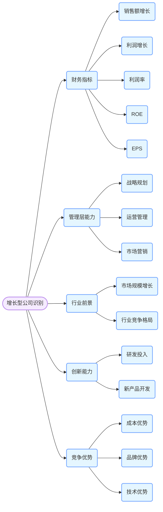

# 费雪的增长型公司识别方法

> 关键词：费雪、增长型公司、识别方法、财务分析、定性评估

> 摘要：本文深入探讨了费雪的增长型公司识别方法。费雪作为投资领域的大师，其提出的方法对于投资者寻找具有长期增长潜力的公司具有重要指导意义。文章首先介绍了该方法产生的背景，包括目的、预期读者、文档结构和相关术语。接着阐述了核心概念及联系，通过文本示意图和 Mermaid 流程图进行清晰展示。详细讲解了核心算法原理，并结合 Python 代码说明具体操作步骤。对涉及的数学模型和公式进行了详细推导和举例。通过项目实战，给出代码实际案例并进行解读分析。还探讨了该方法的实际应用场景，推荐了相关的学习资源、开发工具和论文著作。最后总结了未来发展趋势与挑战，解答了常见问题，并提供了扩展阅读和参考资料。

## 1. 背景介绍 
### 1.1 目的和范围
费雪的增长型公司识别方法旨在帮助投资者从众多上市公司中筛选出那些具有持续增长潜力的公司。这种增长不仅体现在财务指标的增长上，还包括公司在市场竞争中的优势、创新能力等多个方面。本方法的应用范围涵盖了股票投资、风险投资等领域，对于个人投资者、机构投资者以及专业的投资分析师都具有重要的参考价值。

### 1.2 预期读者
本文的预期读者主要包括对股票投资感兴趣的个人投资者，他们希望通过学习费雪的方法来提高自己的投资决策能力；专业的投资机构分析师，他们需要更深入地研究公司的基本面，以制定投资策略；以及金融专业的学生和研究人员，他们可以通过学习该方法来加深对投资分析理论的理解。

### 1.3 文档结构概述
本文将按照以下结构进行阐述：首先介绍费雪增长型公司识别方法的核心概念及它们之间的联系，通过直观的示意图和流程图进行展示；然后详细讲解核心算法原理，并结合 Python 代码说明具体的操作步骤；接着介绍相关的数学模型和公式，并通过实际例子进行详细讲解；之后通过项目实战，给出代码实际案例并进行详细的解读和分析；再探讨该方法在实际投资中的应用场景；推荐相关的学习资源、开发工具和论文著作；最后总结未来发展趋势与挑战，解答常见问题，并提供扩展阅读和参考资料。

### 1.4 术语表
#### 1.4.1 核心术语定义
- **增长型公司**：指那些在较长时间内，其销售额、利润等关键财务指标能够持续增长，并且具有良好的市场前景和竞争优势的公司。
- **利润率**：是指企业在一定时期内的利润与销售收入的比率，反映了企业的盈利能力。
- **研发投入**：企业为了开发新产品、改进现有产品或提高生产效率而投入的资金。
- **管理层能力**：指公司管理层在战略规划、运营管理、市场营销等方面的能力和经验。

#### 1.4.2 相关概念解释
- **市场份额**：指一个公司的产品或服务在特定市场中所占的比例，反映了公司在市场中的竞争地位。
- **客户忠诚度**：指客户对公司产品或服务的认可和重复购买的意愿，高客户忠诚度有助于公司的长期稳定发展。
- **行业竞争格局**：指行业内各个企业之间的竞争关系和市场份额分布情况，了解行业竞争格局有助于评估公司的竞争优势。

#### 1.4.3 缩略词列表
- **ROE**：净资产收益率（Return on Equity），反映了股东权益的收益水平。
- **EPS**：每股收益（Earnings Per Share），是指普通股股东每持有一股所能享有的企业净利润或需承担的企业净亏损。

## 2. 核心概念与联系 
费雪的增长型公司识别方法主要基于以下几个核心概念：财务指标、管理层能力、行业前景、创新能力和竞争优势。这些概念之间相互关联，共同构成了一个完整的分析体系。

### 文本示意图
```plaintext
增长型公司识别
|-- 财务指标
|   |-- 销售额增长
|   |-- 利润增长
|   |-- 利润率
|   |-- ROE
|   |-- EPS
|-- 管理层能力
|   |-- 战略规划
|   |-- 运营管理
|   |-- 市场营销
|-- 行业前景
|   |-- 市场规模增长
|   |-- 行业竞争格局
|-- 创新能力
|   |-- 研发投入
|   |-- 新产品开发
|-- 竞争优势
|   |-- 成本优势
|   |-- 品牌优势
|   |-- 技术优势
```

### Mermaid 流程图


从流程图可以看出，增长型公司的识别需要综合考虑多个方面的因素。财务指标是公司经营状况的直接体现，管理层能力决定了公司的发展方向和运营效率，行业前景为公司的发展提供了外部环境，创新能力是公司保持竞争力的关键，竞争优势则是公司在市场中立足的根本。

## 3. 核心算法原理 & 具体操作步骤 
### 核心算法原理
费雪的增长型公司识别方法本质上是一种多因素综合评估方法。通过对财务指标、管理层能力、行业前景、创新能力和竞争优势等多个因素进行量化评估，然后根据各个因素的权重计算出一个综合得分，得分越高的公司越有可能是增长型公司。

### 具体操作步骤
#### 步骤 1：收集数据
收集公司的财务报表、行业研究报告、新闻资讯等相关数据，这些数据将作为评估的基础。

#### 步骤 2：量化评估各个因素
- **财务指标**：计算销售额增长率、利润增长率、利润率、ROE、EPS 等指标，并根据行业平均水平进行评分。
- **管理层能力**：通过分析管理层的背景、过往业绩、战略规划等方面进行评分。
- **行业前景**：评估行业的市场规模增长趋势、竞争格局等，给出相应的评分。
- **创新能力**：考察公司的研发投入、新产品开发情况等，进行评分。
- **竞争优势**：分析公司的成本优势、品牌优势、技术优势等，给予评分。

#### 步骤 3：确定权重
根据各个因素对公司增长的重要性，确定每个因素的权重。例如，可以设定财务指标权重为 40%，管理层能力权重为 20%，行业前景权重为 15%，创新能力权重为 15%，竞争优势权重为 10%。

#### 步骤 4：计算综合得分
将各个因素的评分乘以相应的权重，然后相加得到综合得分。

### Python 代码实现
```python
# 示例数据
company_data = {
    "财务指标": {
        "销售额增长率": 0.2,
        "利润增长率": 0.15,
        "利润率": 0.1,
        "ROE": 0.12,
        "EPS": 2.5
    },
    "管理层能力": 8,
    "行业前景": 7,
    "创新能力": 6,
    "竞争优势": 7
}

# 行业平均水平
industry_average = {
    "销售额增长率": 0.1,
    "利润增长率": 0.1,
    "利润率": 0.08,
    "ROE": 0.1,
    "EPS": 2
}

# 权重
weights = {
    "财务指标": 0.4,
    "管理层能力": 0.2,
    "行业前景": 0.15,
    "创新能力": 0.15,
    "竞争优势": 0.1
}

# 量化评估财务指标
def evaluate_financial_metrics(data, average):
    score = 0
    metrics = ["销售额增长率", "利润增长率", "利润率", "ROE", "EPS"]
    for metric in metrics:
        if data[metric] > average[metric]:
            score += 1
    return score

# 计算综合得分
def calculate_composite_score(data, average, weights):
    financial_score = evaluate_financial_metrics(data["财务指标"], average)
    management_score = data["管理层能力"]
    industry_score = data["行业前景"]
    innovation_score = data["创新能力"]
    competitive_advantage_score = data["竞争优势"]

    composite_score = (
        financial_score * weights["财务指标"] +
        management_score * weights["管理层能力"] +
        industry_score * weights["行业前景"] +
        innovation_score * weights["创新能力"] +
        competitive_advantage_score * weights["竞争优势"]
    )
    return composite_score

# 计算综合得分
score = calculate_composite_score(company_data, industry_average, weights)
print(f"该公司的综合得分是: {score}")
```

在上述代码中，首先定义了公司的数据、行业平均水平和各个因素的权重。然后定义了 `evaluate_financial_metrics` 函数用于量化评估财务指标，`calculate_composite_score` 函数用于计算综合得分。最后调用 `calculate_composite_score` 函数计算出公司的综合得分并输出。

## 4. 数学模型和公式 & 详细讲解 & 举例说明 
### 数学模型
设公司的综合得分为 $S$，财务指标得分、管理层能力得分、行业前景得分、创新能力得分和竞争优势得分分别为 $S_f$、$S_m$、$S_i$、$S_c$ 和 $S_a$，对应的权重分别为 $w_f$、$w_m$、$w_i$、$w_c$ 和 $w_a$，则综合得分的计算公式为：

$$S = w_f S_f + w_m S_m + w_i S_i + w_c S_c + w_a S_a$$

其中，财务指标得分 $S_f$ 可以通过对多个财务指标进行量化评估后求和得到。例如，设销售额增长率、利润增长率、利润率、ROE 和 EPS 的评分分别为 $s_1$、$s_2$、$s_3$、$s_4$ 和 $s_5$，则财务指标得分 $S_f$ 为：

$$S_f = s_1 + s_2 + s_3 + s_4 + s_5$$

### 详细讲解
- **权重的确定**：权重的确定需要根据各个因素对公司增长的重要性进行判断。一般来说，财务指标是公司经营状况的直接体现，对公司的增长具有重要影响，因此权重可以相对较高。管理层能力决定了公司的发展方向和运营效率，也具有较高的权重。行业前景、创新能力和竞争优势等因素也会对公司的增长产生重要影响，但相对来说权重可以稍低一些。
- **评分的确定**：对于财务指标，可以根据行业平均水平进行评分。如果公司的某个财务指标高于行业平均水平，则可以给予较高的评分；反之，则给予较低的评分。对于管理层能力、行业前景、创新能力和竞争优势等因素，可以通过定性分析和专家评估等方式进行评分。

### 举例说明
假设有两家公司 A 和 B，它们的各项得分和权重如下表所示：

| 公司 | 财务指标得分 $S_f$ | 管理层能力得分 $S_m$ | 行业前景得分 $S_i$ | 创新能力得分 $S_c$ | 竞争优势得分 $S_a$ | 财务指标权重 $w_f$ | 管理层能力权重 $w_m$ | 行业前景权重 $w_i$ | 创新能力权重 $w_c$ | 竞争优势权重 $w_a$ |
| ---- | ---- | ---- | ---- | ---- | ---- | ---- | ---- | ---- | ---- | ---- |
| A | 8 | 7 | 6 | 5 | 4 | 0.4 | 0.2 | 0.15 | 0.15 | 0.1 |
| B | 6 | 8 | 7 | 6 | 5 | 0.4 | 0.2 | 0.15 | 0.15 | 0.1 |

根据上述公式，计算两家公司的综合得分：

公司 A 的综合得分：

$$S_A = 0.4 \times 8 + 0.2 \times 7 + 0.15 \times 6 + 0.15 \times 5 + 0.1 \times 4 = 6.75$$

公司 B 的综合得分：

$$S_B = 0.4 \times 6 + 0.2 \times 8 + 0.15 \times 7 + 0.15 \times 6 + 0.1 \times 5 = 6.65$$

通过比较两家公司的综合得分，可以看出公司 A 的综合得分更高，更有可能是增长型公司。

## 5. 项目实战：代码实际案例和详细解释说明 
### 5.1  开发环境搭建
- **Python 环境**：建议使用 Python 3.7 及以上版本，可以从 Python 官方网站（https://www.python.org/downloads/）下载并安装。
- **开发工具**：可以使用 PyCharm、Jupyter Notebook 等开发工具。这里推荐使用 Jupyter Notebook，它可以方便地进行代码编写、调试和可视化展示。可以通过 Anaconda 来安装 Jupyter Notebook，Anaconda 是一个包含了 Python 解释器、常用库和 Jupyter Notebook 的集成开发环境，可以从 Anaconda 官方网站（https://www.anaconda.com/products/individual）下载并安装。
- **相关库**：需要安装 pandas、numpy 等库，用于数据处理和分析。可以使用以下命令进行安装：
```bash
pip install pandas numpy
```

### 5.2  源代码详细实现和代码解读
```python
import pandas as pd
import numpy as np

# 读取公司数据
data = {
    "公司名称": ["公司 A", "公司 B", "公司 C"],
    "财务指标": [
        {
            "销售额增长率": 0.2,
            "利润增长率": 0.15,
            "利润率": 0.1,
            "ROE": 0.12,
            "EPS": 2.5
        },
        {
            "销售额增长率": 0.15,
            "利润增长率": 0.12,
            "利润率": 0.08,
            "ROE": 0.1,
            "EPS": 2
        },
        {
            "销售额增长率": 0.1,
            "利润增长率": 0.08,
            "利润率": 0.06,
            "ROE": 0.08,
            "EPS": 1.5
        }
    ],
    "管理层能力": [8, 7, 6],
    "行业前景": [7, 6, 5],
    "创新能力": [6, 5, 4],
    "竞争优势": [7, 6, 5]
}

df = pd.DataFrame(data)

# 行业平均水平
industry_average = {
    "销售额增长率": 0.1,
    "利润增长率": 0.1,
    "利润率": 0.08,
    "ROE": 0.1,
    "EPS": 2
}

# 权重
weights = {
    "财务指标": 0.4,
    "管理层能力": 0.2,
    "行业前景": 0.15,
    "创新能力": 0.15,
    "竞争优势": 0.1
}

# 量化评估财务指标
def evaluate_financial_metrics(data, average):
    score = 0
    metrics = ["销售额增长率", "利润增长率", "利润率", "ROE", "EPS"]
    for metric in metrics:
        if data[metric] > average[metric]:
            score += 1
    return score

# 计算综合得分
def calculate_composite_score(row, average, weights):
    financial_score = evaluate_financial_metrics(row["财务指标"], average)
    management_score = row["管理层能力"]
    industry_score = row["行业前景"]
    innovation_score = row["创新能力"]
    competitive_advantage_score = row["竞争优势"]

    composite_score = (
        financial_score * weights["财务指标"] +
        management_score * weights["管理层能力"] +
        industry_score * weights["行业前景"] +
        innovation_score * weights["创新能力"] +
        competitive_advantage_score * weights["竞争优势"]
    )
    return composite_score

# 计算每家公司的综合得分
df["综合得分"] = df.apply(calculate_composite_score, args=(industry_average, weights), axis=1)

# 按照综合得分排序
df = df.sort_values(by="综合得分", ascending=False)

print(df)
```

### 代码解读与分析
- **数据读取**：使用字典 `data` 存储了三家公司的相关数据，包括财务指标、管理层能力、行业前景、创新能力和竞争优势等。然后使用 `pandas` 库的 `DataFrame` 函数将数据转换为数据框 `df`。
- **量化评估财务指标**：定义了 `evaluate_financial_metrics` 函数，该函数接受公司的财务指标数据和行业平均水平作为输入，通过比较每个财务指标与行业平均水平的大小，计算出财务指标得分。
- **计算综合得分**：定义了 `calculate_composite_score` 函数，该函数接受数据框的一行数据、行业平均水平和权重作为输入，调用 `evaluate_financial_metrics` 函数计算财务指标得分，然后根据公式计算综合得分。
- **应用函数并排序**：使用 `apply` 函数将 `calculate_composite_score` 函数应用到数据框的每一行，计算出每家公司的综合得分，并将结果存储在新的列 `综合得分` 中。最后使用 `sort_values` 函数按照综合得分对数据框进行排序，降序排列。

通过上述代码，可以对多家公司进行综合评估，并按照综合得分进行排序，从而筛选出具有增长潜力的公司。

## 6. 实际应用场景 
### 股票投资
在股票投资中，投资者可以使用费雪的增长型公司识别方法来筛选具有长期增长潜力的股票。通过对公司的财务指标、管理层能力、行业前景、创新能力和竞争优势等方面进行综合评估，选择综合得分较高的公司进行投资。这样可以提高投资的成功率，获得更高的投资回报。

### 风险投资
风险投资机构在选择投资项目时，也可以使用该方法来评估创业公司的增长潜力。风险投资通常投资于具有高增长潜力的创业公司，通过对创业公司的各个方面进行评估，可以筛选出最有潜力的项目进行投资，降低投资风险。

### 公司战略规划
公司管理层可以使用费雪的增长型公司识别方法来评估自身公司的优势和劣势，制定相应的战略规划。通过对财务指标的分析，可以了解公司的盈利能力和发展趋势；通过对管理层能力的评估，可以发现管理中存在的问题并加以改进；通过对行业前景和竞争优势的分析，可以制定出符合市场需求的发展战略。

## 7. 工具和资源推荐
### 7.1 学习资源推荐
#### 7.1.1 书籍推荐
- 《怎样选择成长股》（Common Stocks and Uncommon Profits）：作者是菲利普·费雪（Philip A. Fisher），这本书是费雪的经典著作，详细介绍了他的投资理念和增长型公司识别方法。
- 《聪明的投资者》（The Intelligent Investor）：作者是本杰明·格雷厄姆（Benjamin Graham），这本书是价值投资的经典之作，对投资分析和风险管理有深入的阐述，与费雪的方法可以相互补充。
- 《财务报表分析与证券定价》（Financial Statement Analysis and Security Valuation）：作者是斯蒂芬·佩因曼（Stephen H. Penman），这本书详细介绍了财务报表分析的方法和技巧，对于理解费雪方法中的财务指标评估有很大帮助。

#### 7.1.2 在线课程
- Coursera 上的“投资学原理”（Principles of Investing）：该课程由哥伦比亚大学教授授课，涵盖了投资分析的基本原理和方法，包括公司基本面分析、估值方法等内容。
- edX 上的“财务报表分析”（Financial Statement Analysis）：该课程由宾夕法尼亚大学教授授课，详细讲解了财务报表的分析方法和技巧，对于学习费雪方法中的财务指标评估非常有帮助。

#### 7.1.3 技术博客和网站
- Seeking Alpha：这是一个知名的金融投资博客网站，提供了大量的公司分析报告和投资观点，投资者可以从中获取有关增长型公司的信息和分析。
- Motley Fool：该网站提供了投资建议、股票分析和市场评论等内容，对于投资者了解增长型公司的投资机会有一定的参考价值。

### 7.2 开发工具框架推荐
#### 7.2.1 IDE和编辑器
- PyCharm：是一款专业的 Python 集成开发环境，具有代码编辑、调试、自动补全、代码分析等功能，适合专业的 Python 开发者使用。
- Jupyter Notebook：是一个基于网页的交互式开发环境，可以方便地进行代码编写、调试和可视化展示，适合数据分析师和初学者使用。

#### 7.2.2 调试和性能分析工具
- pdb：是 Python 内置的调试器，可以帮助开发者调试代码，查找代码中的错误。
- cProfile：是 Python 内置的性能分析工具，可以分析代码的运行时间和函数调用情况，帮助开发者优化代码性能。

#### 7.2.3 相关框架和库
- pandas：是一个强大的数据处理和分析库，提供了数据结构和数据分析工具，适合处理和分析公司的财务数据。
- numpy：是一个基础的科学计算库，提供了多维数组对象和各种数学函数，适合进行数值计算和统计分析。

### 7.3 相关论文著作推荐
#### 7.3.1 经典论文
- “The Cross-Section of Expected Stock Returns” by Eugene F. Fama and Kenneth R. French：该论文提出了著名的 Fama-French 三因子模型，对股票收益率的影响因素进行了深入研究，对于理解增长型公司的股票表现有重要意义。
- “Capital Asset Prices: A Theory of Market Equilibrium Under Conditions of Risk” by William F. Sharpe：该论文提出了资本资产定价模型（CAPM），为资产定价和投资组合理论奠定了基础，对于评估增长型公司的投资价值有一定的参考作用。

#### 7.3.2 最新研究成果
- 可以关注《Journal of Finance》、《Review of Financial Studies》等金融领域的顶级学术期刊，这些期刊上经常发表有关公司财务、投资分析等方面的最新研究成果。

#### 7.3.3 应用案例分析
- 可以参考一些知名投资机构的研究报告和案例分析，了解他们在实际投资中如何应用费雪的增长型公司识别方法。例如，巴菲特的伯克希尔·哈撒韦公司的年报和投资案例分析，对于学习和应用该方法有很大的启发。

## 8. 总结：未来发展趋势与挑战
### 未来发展趋势
- **数字化和智能化**：随着信息技术的不断发展，数据的获取和分析变得更加容易和高效。未来，费雪的增长型公司识别方法可能会与大数据、人工智能等技术相结合，实现更加精准和自动化的公司评估。
- **多元化评估**：除了传统的财务指标、管理层能力、行业前景等因素，未来可能会更加注重公司的社会责任、环境影响等方面的评估。这些因素对于公司的长期发展也具有重要影响。
- **全球化视角**：随着经济全球化的不断深入，公司的竞争不再局限于国内市场。未来，费雪的方法可能会更加注重从全球化的视角来评估公司的增长潜力，考虑国际市场的竞争和机遇。

### 挑战
- **数据质量和可靠性**：准确的评估需要高质量和可靠的数据支持。然而，在实际应用中，数据的获取和处理可能会存在一定的困难，数据的准确性和完整性也可能会受到影响。
- **行业变化快速**：科技的快速发展和市场环境的不断变化使得行业的竞争格局和发展趋势变得更加难以预测。如何及时调整评估指标和方法，以适应行业的变化，是一个挑战。
- **主观因素影响**：在评估管理层能力、创新能力等因素时，往往会受到主观因素的影响。如何减少主观因素的干扰，提高评估的客观性和准确性，是需要解决的问题。

## 9. 附录：常见问题与解答
### 问题 1：如何确定各个因素的权重？
答：确定各个因素的权重需要综合考虑多个方面的因素。可以参考历史数据和经验，分析各个因素对公司增长的影响程度。也可以结合专家意见和市场情况进行调整。一般来说，财务指标的权重可以相对较高，因为它是公司经营状况的直接体现；管理层能力、行业前景等因素的权重可以根据具体情况进行调整。

### 问题 2：如果公司的某个财务指标异常高或低，应该如何处理？
答：如果公司的某个财务指标异常高或低，需要进一步分析其原因。可能是由于特殊事件或会计政策调整等原因导致的。可以查看公司的财务报表附注，了解具体情况。如果是暂时的异常情况，可以考虑对该指标进行适当的调整或忽略；如果是长期的异常情况，则需要谨慎评估该公司的增长潜力。

### 问题 3：费雪的方法适用于所有行业吗？
答：费雪的方法具有一定的通用性，但不同行业的特点和发展规律可能会有所不同。在应用该方法时，需要根据行业的特点对评估指标和权重进行适当的调整。例如，对于科技行业，可能需要更加注重创新能力和研发投入；对于传统制造业，可能需要更加关注成本优势和市场份额。

## 10. 扩展阅读 & 参考资料
### 扩展阅读
- 《金融炼金术》（The Alchemy of Finance）：作者是乔治·索罗斯（George Soros），这本书介绍了索罗斯的投资哲学和反身性理论，对于理解市场的复杂性和投资决策有很大的启发。
- 《投资最重要的事》（The Most Important Thing Illuminated）：作者是霍华德·马克斯（Howard Marks），这本书强调了投资中的风险管理和逆向思维，与费雪的方法可以相互补充。

### 参考资料
- Fisher, Philip A. Common Stocks and Uncommon Profits. Harper & Row, 1958.
- Graham, Benjamin. The Intelligent Investor. HarperBusiness, 2003.
- Penman, Stephen H. Financial Statement Analysis and Security Valuation. McGraw-Hill Education, 2018.

作者：AI天才研究院/AI Genius Institute & 禅与计算机程序设计艺术 /Zen And The Art of Computer Programming