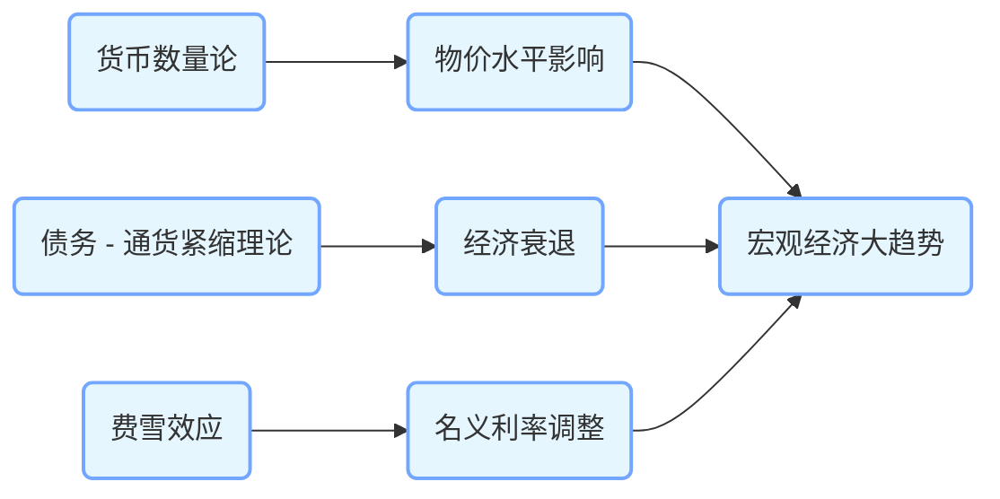

# 费雪的宏观经济分析：把握大趋势

> 关键词：费雪、宏观经济分析、大趋势、货币数量论、债务 - 通货紧缩理论

> 摘要：本文围绕费雪的宏观经济分析展开，深入探讨其核心理论如货币数量论和债务 - 通货紧缩理论。通过详细阐述这些理论的原理、算法以及数学模型，结合实际案例进行分析，展示如何运用费雪的理论把握宏观经济大趋势。同时，介绍相关的实际应用场景、推荐学习资源和开发工具，最后对未来发展趋势与挑战进行总结，并解答常见问题，为读者提供全面深入的费雪宏观经济分析知识体系。

## 1. 背景介绍 
### 1.1 目的和范围
本文章旨在全面介绍费雪（Irving Fisher）的宏观经济分析理论及其实际应用。费雪是美国著名经济学家，他的理论对宏观经济学的发展产生了深远影响。我们将深入探讨费雪的核心理论，包括货币数量论和债务 - 通货紧缩理论，分析这些理论如何帮助我们理解宏观经济的运行规律，以及如何运用这些理论把握宏观经济的大趋势。文章的范围涵盖理论原理、数学模型、实际案例分析以及相关的学习资源和工具推荐。

### 1.2 预期读者
本文预期读者包括经济学专业的学生、研究人员，以及对宏观经济分析感兴趣的投资者、金融从业者等。对于想要深入了解费雪宏观经济理论，掌握宏观经济分析方法，以便在投资决策、政策研究等方面做出更明智选择的人士具有重要的参考价值。

### 1.3 文档结构概述
本文将按照以下结构进行阐述：首先介绍费雪宏观经济分析的核心概念及其相互联系，包括货币数量论和债务 - 通货紧缩理论的原理和架构；接着详细讲解核心算法原理和具体操作步骤，并结合 Python 代码进行说明；然后介绍相关的数学模型和公式，并通过具体例子进行详细讲解；之后通过实际项目案例展示如何运用费雪的理论进行宏观经济分析；再介绍费雪宏观经济分析在实际中的应用场景；接着推荐相关的学习资源、开发工具和论文著作；最后对未来发展趋势与挑战进行总结，并解答常见问题，同时提供扩展阅读和参考资料。

### 1.4 术语表
#### 1.4.1 核心术语定义
- **货币数量论**：是一种关于货币数量与物价水平之间关系的理论，认为在其他条件不变的情况下，物价水平与货币供应量成正比。
- **债务 - 通货紧缩理论**：费雪提出的一种理论，认为经济衰退往往是由过度负债引发的，过度负债导致资产价格下跌和通货紧缩，进而加剧经济衰退。
- **费雪效应**：指名义利率随着通货膨胀率的变化而变化的现象，即名义利率等于实际利率加上预期通货膨胀率。

#### 1.4.2 相关概念解释
- **实际利率**：是指剔除通货膨胀率后储户或投资者得到利息回报的真实利率。
- **名义利率**：是央行或其他提供资金借贷的机构所公布的未调整通货膨胀因素的利率，即利息（报酬）的货币额与本金的货币额的比率。
- **通货膨胀率**：是货币超发部分与实际需要的货币量之比，用以反映通货膨胀、货币贬值的程度。

#### 1.4.3 缩略词列表
- **MV = PT**：货币数量论的表达式，其中 M 表示货币供应量，V 表示货币流通速度，P 表示物价水平，T 表示商品和服务的交易量。

## 2. 核心概念与联系 

### 2.1 货币数量论
货币数量论是费雪宏观经济分析的重要理论之一。其基本思想是货币数量的变化会直接影响物价水平。该理论基于一个简单的交易方程式：$MV = PT$。其中，$M$ 代表货币供应量，即流通中的货币总量；$V$ 表示货币流通速度，指单位货币在一定时期内的平均周转次数；$P$ 是物价水平，反映了商品和服务的总体价格；$T$ 表示商品和服务的交易量。

从这个方程式可以看出，如果货币流通速度 $V$ 和商品和服务的交易量 $T$ 在短期内相对稳定，那么货币供应量 $M$ 的增加将直接导致物价水平 $P$ 的上升。例如，当政府大量增发货币时，在其他条件不变的情况下，物价就会上涨，引发通货膨胀。

### 2.2 债务 - 通货紧缩理论
费雪的债务 - 通货紧缩理论认为，经济繁荣时期，企业和个人往往会过度借贷进行投资和消费，导致债务水平不断上升。当经济出现一些不利因素时，如市场需求下降、资产价格下跌等，债务人可能无法按时偿还债务，从而引发债务违约。债务违约会导致资产抛售，进一步压低资产价格，使企业和个人的资产负债表恶化。

同时，资产价格下跌和债务违约会导致银行等金融机构收紧信贷，货币供应量减少，从而引发通货紧缩。通货紧缩会使物价持续下降，企业利润减少，进一步加剧经济衰退。例如，在 2008 年全球金融危机中，美国房地产市场泡沫破裂，大量次级抵押贷款违约，导致金融机构资产损失严重，信贷紧缩，经济陷入衰退。

### 2.3 费雪效应
费雪效应描述了名义利率、实际利率和通货膨胀率之间的关系。其公式为：$i = r + \pi^e$，其中 $i$ 表示名义利率，$r$ 表示实际利率，$\pi^e$ 表示预期通货膨胀率。

这意味着当预期通货膨胀率上升时，名义利率也会相应上升，以保持实际利率不变。例如，如果实际利率为 2%，预期通货膨胀率为 3%，那么名义利率将为 5%。费雪效应在金融市场中具有重要意义，它影响着投资者的决策和债券等金融资产的价格。

### 2.4 核心概念架构示意图


## 3. 核心算法原理 & 具体操作步骤 

### 3.1 货币数量论的算法原理及 Python 实现
根据货币数量论的交易方程式 $MV = PT$，我们可以通过已知的货币供应量 $M$、货币流通速度 $V$ 和商品和服务的交易量 $T$ 来计算物价水平 $P$。公式变形为：$P=\frac{MV}{T}$。

以下是使用 Python 实现该算法的代码：
```python
def calculate_price_level(money_supply, velocity, transaction_volume):
    """
    计算物价水平
    :param money_supply: 货币供应量
    :param velocity: 货币流通速度
    :param transaction_volume: 商品和服务的交易量
    :return: 物价水平
    """
    price_level = (money_supply * velocity) / transaction_volume
    return price_level

# 示例数据
money_supply = 1000  # 货币供应量
velocity = 2  # 货币流通速度
transaction_volume = 500  # 商品和服务的交易量

# 计算物价水平
price = calculate_price_level(money_supply, velocity, transaction_volume)
print(f"物价水平为: {price}")
```
在上述代码中，我们定义了一个函数 `calculate_price_level`，它接受货币供应量、货币流通速度和商品和服务的交易量作为参数，并返回计算得到的物价水平。然后，我们使用示例数据调用该函数并打印结果。

### 3.2 费雪效应的算法原理及 Python 实现
根据费雪效应公式 $i = r + \pi^e$，我们可以通过已知的实际利率 $r$ 和预期通货膨胀率 $\pi^e$ 来计算名义利率 $i$。

以下是使用 Python 实现该算法的代码：
```python
def calculate_nominal_interest_rate(real_interest_rate, expected_inflation_rate):
    """
    计算名义利率
    :param real_interest_rate: 实际利率
    :param expected_inflation_rate: 预期通货膨胀率
    :return: 名义利率
    """
    nominal_interest_rate = real_interest_rate + expected_inflation_rate
    return nominal_interest_rate

# 示例数据
real_interest_rate = 0.02  # 实际利率为 2%
expected_inflation_rate = 0.03  # 预期通货膨胀率为 3%

# 计算名义利率
nominal_rate = calculate_nominal_interest_rate(real_interest_rate, expected_inflation_rate)
print(f"名义利率为: {nominal_rate * 100}%")
```
在上述代码中，我们定义了一个函数 `calculate_nominal_interest_rate`，它接受实际利率和预期通货膨胀率作为参数，并返回计算得到的名义利率。然后，我们使用示例数据调用该函数并打印结果。

## 4. 数学模型和公式 & 详细讲解 & 举例说明 

### 4.1 货币数量论的数学模型和公式
货币数量论的核心公式为 $MV = PT$。这个公式是基于一个简单的经济交易过程推导出来的。在一定时期内，经济中所有的交易都需要货币来媒介，货币供应量 $M$ 乘以货币流通速度 $V$ 表示在该时期内用于交易的货币总量，而物价水平 $P$ 乘以商品和服务的交易量 $T$ 表示该时期内商品和服务的总价值。由于二者在理论上是相等的，所以得到了这个交易方程式。

为了更深入地理解这个公式，我们可以对其进行变形。例如，当我们想研究货币供应量对物价水平的影响时，可以将公式变形为 $P=\frac{MV}{T}$。假设货币流通速度 $V$ 和商品和服务的交易量 $T$ 保持不变，那么物价水平 $P$ 与货币供应量 $M$ 成正比。

举例来说，假设初始状态下，货币供应量 $M_1 = 100$，货币流通速度 $V = 2$，商品和服务的交易量 $T = 200$，则根据公式 $P_1=\frac{M_1V}{T}=\frac{100\times2}{200}=1$。如果货币供应量增加到 $M_2 = 200$，其他条件不变，那么新的物价水平 $P_2=\frac{M_2V}{T}=\frac{200\times2}{200}=2$。可以看到，货币供应量增加了一倍，物价水平也相应地增加了一倍。

### 4.2 债务 - 通货紧缩理论的数学模型（简化示例）
债务 - 通货紧缩理论虽然没有像货币数量论那样有一个简洁的核心公式，但我们可以通过一个简化的数学模型来理解其基本原理。

假设经济中的总债务为 $D$，资产价格为 $A$，企业的利润为 $\pi$。当债务违约发生时，企业需要抛售资产来偿还债务，这会导致资产价格下降。我们可以假设资产价格的下降幅度与债务违约率 $\delta$ 成正比，即 $\Delta A = -k\delta$，其中 $k$ 是一个正的常数。

资产价格下降会影响企业的利润，假设企业利润的变化与资产价格的变化成正比，即 $\Delta \pi = m\Delta A$，其中 $m$ 是一个正的常数。

企业利润下降会导致企业减少投资和生产，进而使经济中的总产出 $Y$ 下降。假设总产出的下降幅度与企业利润的下降幅度成正比，即 $\Delta Y = n\Delta \pi$，其中 $n$ 是一个正的常数。

总产出下降会导致物价水平 $P$ 下降，形成通货紧缩。假设物价水平的下降幅度与总产出的下降幅度成正比，即 $\Delta P = p\Delta Y$，其中 $p$ 是一个正的常数。

通过这个简化的模型，我们可以看到债务违约如何通过资产价格下降、企业利润下降和总产出下降等环节引发通货紧缩。

### 4.3 费雪效应的数学模型和公式
费雪效应的公式为 $i = r + \pi^e$。这个公式的推导基于实际利率的定义。实际利率 $r$ 是指剔除通货膨胀因素后投资者实际获得的收益率，名义利率 $i$ 是投资者在金融市场上看到的利率，预期通货膨胀率 $\pi^e$ 是投资者对未来通货膨胀率的预期。

例如，假设投资者期望获得的实际利率为 $r = 3\%$，而预期未来一年的通货膨胀率为 $\pi^e = 2\%$，那么根据费雪效应，名义利率 $i$ 应该为 $i = r + \pi^e = 3\%+2\% = 5\%$。这意味着投资者在考虑通货膨胀因素后，要求名义利率达到 5% 才能保证实际获得 3% 的收益率。

如果预期通货膨胀率发生变化，名义利率也会相应调整。例如，如果预期通货膨胀率上升到 $\pi^e = 4\%$，而实际利率保持不变，那么名义利率将上升到 $i = r + \pi^e = 3\%+4\% = 7\%$。

## 5. 项目实战：代码实际案例和详细解释说明 

### 5.1 开发环境搭建
为了进行基于费雪宏观经济分析的项目实战，我们需要搭建一个合适的开发环境。以下是具体步骤：

#### 5.1.1 安装 Python
首先，你需要安装 Python 编程语言。可以从 Python 官方网站（https://www.python.org/downloads/）下载适合你操作系统的 Python 安装包，并按照安装向导进行安装。建议安装 Python 3.7 及以上版本。

#### 5.1.2 安装必要的库
在进行宏观经济数据分析时，我们需要使用一些 Python 库，如 `pandas` 用于数据处理和分析，`matplotlib` 用于数据可视化。可以使用以下命令来安装这些库：
```sh
pip install pandas matplotlib
```

### 5.2 源代码详细实现和代码解读
我们以分析货币供应量和物价水平之间的关系为例，使用实际的宏观经济数据进行分析。假设我们已经从某个数据源获取了货币供应量和物价指数的数据，并将其保存为一个 CSV 文件 `macro_data.csv`。

以下是实现代码：
```python
import pandas as pd
import matplotlib.pyplot as plt

# 读取数据
data = pd.read_csv('macro_data.csv')

# 提取货币供应量和物价指数列
money_supply = data['MoneySupply']
price_index = data['PriceIndex']

# 绘制货币供应量和物价指数的折线图
plt.figure(figsize=(10, 6))
plt.plot(data['Date'], money_supply, label='Money Supply')
plt.plot(data['Date'], price_index, label='Price Index')
plt.xlabel('Date')
plt.ylabel('Value')
plt.title('Money Supply and Price Index over Time')
plt.legend()
plt.grid(True)
plt.show()

# 计算货币供应量和物价指数的相关性
correlation = money_supply.corr(price_index)
print(f"货币供应量和物价指数的相关性为: {correlation}")
```
#### 代码解读：
1. **导入必要的库**：我们导入了 `pandas` 库用于数据处理，`matplotlib.pyplot` 库用于数据可视化。
2. **读取数据**：使用 `pd.read_csv` 函数读取存储宏观经济数据的 CSV 文件。
3. **提取数据列**：从读取的数据中提取货币供应量和物价指数列。
4. **绘制折线图**：使用 `plt.plot` 函数绘制货币供应量和物价指数随时间变化的折线图，以便直观地观察两者之间的关系。
5. **计算相关性**：使用 `corr` 方法计算货币供应量和物价指数之间的相关性，并打印结果。

### 5.3 代码解读与分析
通过绘制货币供应量和物价指数的折线图，我们可以直观地观察到两者之间的变化趋势。如果货币供应量和物价指数的变化趋势相似，说明两者之间可能存在正相关关系，这与货币数量论的观点相符。

计算得到的相关性系数可以进一步量化两者之间的关系。相关性系数的取值范围在 -1 到 1 之间，接近 1 表示正相关，接近 -1 表示负相关，接近 0 表示两者之间没有明显的线性关系。如果相关性系数接近 1，说明货币供应量的增加可能会导致物价指数的上升，支持了货币数量论的观点。

需要注意的是，实际经济中的情况可能更为复杂，货币供应量和物价指数之间的关系可能受到多种因素的影响，如货币流通速度的变化、商品和服务的供给变化等。因此，在进行分析时，我们需要综合考虑其他因素的影响。

## 6. 实际应用场景 
### 6.1 货币政策制定
央行在制定货币政策时，可以运用费雪的宏观经济分析理论。根据货币数量论，央行可以通过调整货币供应量来影响物价水平。当经济出现通货膨胀时，央行可以减少货币供应量，以降低物价水平；当经济出现通货紧缩时，央行可以增加货币供应量，刺激经济增长。

例如，在 2008 年全球金融危机后，许多国家的央行采取了量化宽松的货币政策，大量增加货币供应量，以防止经济陷入深度衰退和通货紧缩。通过增加货币供应量，央行希望提高物价水平，刺激消费和投资，促进经济复苏。

### 6.2 投资决策
投资者在进行投资决策时，可以参考费雪的理论。根据费雪效应，投资者可以根据预期通货膨胀率来调整投资组合。当预期通货膨胀率上升时，投资者可以增加对实物资产（如房地产、黄金等）的投资，因为实物资产的价格通常会随着通货膨胀而上涨；同时，投资者可以减少对固定收益类资产（如债券等）的投资，因为通货膨胀会降低债券的实际收益率。

例如，如果投资者预期未来通货膨胀率将上升，他们可能会选择购买房地产或黄金等资产，以保值增值；而对于债券投资，他们可能会选择短期债券或浮动利率债券，以减少通货膨胀对债券收益的影响。

### 6.3 经济预测
经济学家和分析师可以运用费雪的理论进行经济预测。通过分析货币供应量、债务水平、通货膨胀率等宏观经济指标，预测经济的走势。例如，根据债务 - 通货紧缩理论，如果经济中的债务水平过高，且出现了债务违约的迹象，那么经济可能会陷入衰退和通货紧缩。

分析师可以通过监测债务违约率、资产价格变化等指标，提前预警经济风险，并为政府和企业提供决策建议。例如，在房地产市场泡沫破裂之前，如果分析师发现房地产市场的债务水平过高，且房价开始下跌，他们可以预测到可能会出现债务违约和经济衰退，并建议政府采取相应的政策措施来防范风险。

## 7. 工具和资源推荐
### 7.1 学习资源推荐
#### 7.1.1 书籍推荐
- 《货币的购买力》（*The Purchasing Power of Money*）：费雪的经典著作，详细阐述了货币数量论的原理和应用。
- 《利息理论》（*The Theory of Interest*）：费雪在利息理论方面的重要著作，对理解费雪效应等概念有很大帮助。
- 《宏观经济学》（*Macroeconomics*）：许多宏观经济学教材都会介绍费雪的理论，如曼昆（N. Gregory Mankiw）的《宏观经济学》，可以帮助读者系统地学习宏观经济学知识。

#### 7.1.2 在线课程
- Coursera 平台上的“宏观经济学原理”课程：由知名大学的教授授课，内容涵盖宏观经济学的基本原理和理论，包括费雪的宏观经济分析理论。
- edX 平台上的“货币、银行与金融市场”课程：深入讲解货币理论和金融市场的运行机制，对理解费雪的理论有很大帮助。

#### 7.1.3 技术博客和网站
- 经济学人（The Economist）：提供全球经济形势的分析和评论，包含许多关于宏观经济理论和政策的文章。
- 布鲁金斯学会（Brookings Institution）：一个知名的智库，其网站上有许多关于宏观经济研究的报告和文章。

### 7.2 开发工具框架推荐
#### 7.2.1 IDE和编辑器
- PyCharm：一款专业的 Python 集成开发环境，提供代码编辑、调试、版本控制等功能，适合进行 Python 数据分析和开发。
- Jupyter Notebook：一个交互式的开发环境，支持 Python 等多种编程语言，适合进行数据探索和分析。

#### 7.2.2 调试和性能分析工具
- pdb：Python 自带的调试工具，可以帮助开发者定位代码中的问题。
- cProfile：Python 的性能分析工具，可以分析代码的运行时间和函数调用情况，帮助开发者优化代码性能。

#### 7.2.3 相关框架和库
- pandas：用于数据处理和分析的 Python 库，提供了丰富的数据结构和数据操作方法，适合处理宏观经济数据。
- numpy：用于科学计算的 Python 库，提供了高效的数组操作和数学函数，在数据分析和模型计算中经常使用。
- matplotlib：用于数据可视化的 Python 库，可以绘制各种类型的图表，帮助用户直观地展示数据。

### 7.3 相关论文著作推荐
#### 7.3.1 经典论文
- Fisher, Irving. "The Debt-Deflation Theory of Great Depressions." *Econometrica* 1.4 (1933): 337 - 357. 这篇论文是费雪债务 - 通货紧缩理论的经典之作，详细阐述了债务违约和通货紧缩之间的关系。
- Fisher, Irving. "A Statistical Relation between Unemployment and Price Changes." *International Labour Review* 10 (1925): 785 - 792. 费雪在这篇论文中探讨了失业和价格变化之间的统计关系。

#### 7.3.2 最新研究成果
- 可以关注《美国经济评论》（*American Economic Review*）、《经济学季刊》（*Quarterly Journal of Economics*）等顶级经济学学术期刊，这些期刊会发表关于宏观经济理论和政策的最新研究成果。

#### 7.3.3 应用案例分析
- 国际货币基金组织（IMF）的年度报告和工作论文中包含许多关于各国宏观经济政策和经济形势的分析案例，可以作为实际应用费雪理论的参考。

## 8. 总结：未来发展趋势与挑战
### 8.1 未来发展趋势
- **理论的进一步拓展和完善**：随着经济的发展和变化，费雪的宏观经济分析理论可能会不断得到拓展和完善。例如，在数字经济时代，货币的形式和流通方式发生了很大变化，需要进一步研究货币数量论在数字经济中的应用。
- **与其他理论的融合**：费雪的理论可能会与其他宏观经济理论（如凯恩斯主义、新古典主义等）进行融合，形成更加综合和全面的宏观经济分析框架。这种融合可以更好地解释复杂的经济现象，为政策制定提供更有效的指导。
- **技术应用的加强**：随着大数据、人工智能等技术的发展，费雪的宏观经济分析理论可以与这些技术相结合，提高经济预测的准确性和政策制定的科学性。例如，利用大数据分析可以更准确地监测货币供应量、债务水平等宏观经济指标，利用人工智能算法可以构建更复杂的经济模型进行预测和分析。

### 8.2 挑战
- **经济复杂性增加**：现代经济变得越来越复杂，受到全球化、技术创新、金融创新等多种因素的影响。费雪的理论可能无法完全解释和应对这些复杂的经济现象，需要不断进行修正和完善。
- **数据质量和可得性**：准确的宏观经济数据是运用费雪理论进行分析的基础。然而，在实际中，数据的质量和可得性可能存在问题。例如，一些新兴经济领域的数据可能不够完善，或者数据的统计方法存在差异，这会影响分析结果的准确性。
- **政策实施的难度**：即使我们运用费雪的理论制定了合理的政策，政策的实施也可能面临各种困难。例如，货币政策的传导机制可能会受到金融市场结构、企业和居民行为等多种因素的影响，导致政策效果不如预期。

## 9. 附录：常见问题与解答
### 9.1 货币数量论是否适用于所有经济情况？
货币数量论是一种简化的理论，它假设货币流通速度和商品和服务的交易量在短期内相对稳定。然而，在实际经济中，这些因素可能会发生变化。例如，在经济危机期间，货币流通速度可能会大幅下降，导致货币供应量的增加不一定会直接导致物价水平的上升。因此，货币数量论在某些情况下可能并不完全适用，需要结合其他因素进行综合分析。

### 9.2 费雪效应在实际金融市场中是否总是成立？
费雪效应在理论上描述了名义利率、实际利率和通货膨胀率之间的关系，但在实际金融市场中，由于各种因素的影响，费雪效应可能并不总是成立。例如，投资者的预期可能存在偏差，市场的供求关系也会影响利率的波动。此外，货币政策、财政政策等政策因素也会对利率产生影响。因此，在实际应用中，需要考虑这些因素的综合作用。

### 9.3 如何判断经济是否处于债务 - 通货紧缩状态？
判断经济是否处于债务 - 通货紧缩状态需要综合考虑多个指标。一般来说，可以关注以下几个方面：
- **债务水平**：观察经济中的总债务规模和债务增长率，如果债务水平过高且持续上升，可能存在债务风险。
- **资产价格**：监测房地产、股票等资产价格的变化，如果资产价格出现大幅下跌，可能会引发债务违约和通货紧缩。
- **物价水平**：关注物价指数的变化，如果物价持续下降，可能是通货紧缩的信号。
- **企业利润和就业情况**：如果企业利润下降，失业率上升，也可能是经济陷入债务 - 通货紧缩状态的表现。

## 10. 扩展阅读 & 参考资料
- Fisher, Irving. *The Purchasing Power of Money*. Macmillan, 1911.
- Fisher, Irving. *The Theory of Interest*. Macmillan, 1930.
- Mankiw, N. Gregory. *Macroeconomics*. Worth Publishers, 2020.
- Stiglitz, Joseph E., and Bruce C. Greenwald. *Towards a New Paradigm in Monetary Economics*. Cambridge University Press, 2003.

作者：AI天才研究院/AI Genius Institute & 禅与计算机程序设计艺术 /Zen And The Art of Computer Programming