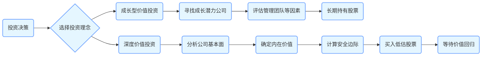

# 费雪的成长型价值投资vs格雷厄姆的深度价值投资

> 关键词：费雪、成长型价值投资、格雷厄姆、深度价值投资、投资理念、投资策略、价值分析

> 摘要：本文旨在深入探讨费雪的成长型价值投资与格雷厄姆的深度价值投资这两种经典投资理念。通过对它们的背景、核心概念、算法原理、数学模型、实际案例等多方面进行详细分析与对比，帮助投资者更好地理解这两种投资策略的特点、优势与局限性，从而在实际投资决策中做出更明智的选择。同时，文章还会介绍相关的工具和资源，探讨未来投资领域的发展趋势与挑战，并对常见问题进行解答。

## 1. 背景介绍 
### 1.1 目的和范围
投资是经济活动中的重要组成部分，不同的投资理念和策略会对投资者的收益产生重大影响。费雪的成长型价值投资和格雷厄姆的深度价值投资是投资领域中两种极具影响力的理论。本文的目的在于全面剖析这两种投资理念，对比它们的异同点，探讨其适用场景和局限性，为投资者提供理论参考和实践指导。范围涵盖这两种投资理念的起源、核心概念、操作方法、实际应用等多个方面。

### 1.2 预期读者
本文预期读者包括对投资领域感兴趣的初学者，希望通过学习经典投资理念来构建自己的投资知识体系；有一定投资经验的投资者，他们希望深入了解不同投资策略的本质，优化自己的投资组合；以及金融专业的学生和研究人员，用于学术研究和理论探讨。

### 1.3 文档结构概述
本文首先介绍两种投资理念的背景信息，包括目的、读者群体和文档结构。接着阐述核心概念与联系，分析其原理和架构，并通过流程图展示。然后讲解核心算法原理和具体操作步骤，结合Python源代码进行说明。之后介绍相关的数学模型和公式，并举例说明。再通过项目实战展示代码实际案例和详细解释。随后探讨实际应用场景，推荐相关的工具和资源。最后总结未来发展趋势与挑战，解答常见问题并提供扩展阅读和参考资料。

### 1.4 术语表
#### 1.4.1 核心术语定义
- **成长型价值投资**：由费雪提出，重点关注具有高成长潜力的公司，通过对公司的长期持有来获取资本增值。投资者更看重公司的未来发展前景、创新能力和管理团队的素质等因素。
- **深度价值投资**：格雷厄姆倡导的投资策略，强调寻找被市场低估的股票，以低于内在价值的价格买入，等待市场对股票价值的重新认可，从而实现投资收益。
- **内在价值**：指公司的真实价值，是基于公司的资产、盈利能力、现金流等基本面因素所确定的价值。

#### 1.4.2 相关概念解释
- **安全边际**：深度价值投资中的重要概念，是指股票的市场价格与内在价值之间的差距。安全边际越大，投资的风险越低。
- **成长股**：指那些具有持续增长潜力的公司的股票，通常表现为销售额、利润等指标的快速增长。

#### 1.4.3 缩略词列表
- **EPS**：Earnings Per Share，每股收益，是衡量公司盈利能力的重要指标。
- **PE**：Price - Earnings Ratio，市盈率，反映股票价格与每股收益之间的关系。

## 2. 核心概念与联系 
### 费雪的成长型价值投资核心概念
费雪认为，投资者应该关注那些具有长期成长潜力的公司。他强调公司的管理层素质、研发能力、市场竞争力等因素对公司未来发展的重要性。成长型价值投资的核心在于寻找那些能够不断创新、拓展市场份额、提高盈利能力的公司，并长期持有其股票。

### 格雷厄姆的深度价值投资核心概念
格雷厄姆主张通过对公司基本面的分析，寻找那些被市场低估的股票。他认为股票的市场价格往往会偏离其内在价值，投资者应该在价格低于内在价值时买入，等待市场价格回归内在价值。深度价值投资注重资产的安全性和估值的合理性。

### 两者的联系
虽然两种投资理念有所不同，但它们都基于价值分析的基础。无论是成长型价值投资还是深度价值投资，都需要对公司的基本面进行深入研究，以确定其投资价值。而且，两种理念的最终目标都是为了实现投资收益的最大化。

### 文本示意图
| 投资理念 | 关注重点 | 投资策略 | 收益来源 |
| --- | --- | --- | --- |
| 成长型价值投资 | 公司成长潜力、创新能力、管理团队 | 长期持有成长股 | 公司成长带来的资本增值 |
| 深度价值投资 | 股票内在价值、安全边际 | 买入低估股票，等待价值回归 | 价格回归带来的差价 |

### Mermaid 流程图


## 3. 核心算法原理 & 具体操作步骤 
### 成长型价值投资的核心算法原理及操作步骤
#### 核心算法原理
成长型价值投资的核心在于评估公司的成长潜力。可以通过分析公司的历史财务数据，如销售额增长率、净利润增长率等，来预测公司未来的成长趋势。同时，还需要考虑公司的行业前景、竞争优势等因素。

#### 具体操作步骤
1. **行业分析**：选择具有高成长潜力的行业，如科技、医疗等。可以通过研究行业报告、政策导向等方式来进行分析。
2. **公司筛选**：在选定的行业中，筛选出具有竞争优势的公司。可以从公司的市场份额、品牌影响力、研发投入等方面进行评估。
3. **财务分析**：分析公司的财务报表，重点关注销售额增长率、净利润增长率、毛利率等指标。可以使用以下Python代码进行简单的财务指标计算：
```python
import pandas as pd

# 假设这是公司的财务数据
financial_data = {
    'year': [2018, 2019, 2020, 2021, 2022],
    'sales': [100, 120, 150, 180, 200],
    'net_income': [10, 12, 15, 18, 20]
}

df = pd.DataFrame(financial_data)

# 计算销售额增长率
df['sales_growth_rate'] = df['sales'].pct_change()

# 计算净利润增长率
df['net_income_growth_rate'] = df['net_income'].pct_change()

print(df)
```
4. **管理团队评估**：了解公司管理团队的背景、经验和能力。可以通过查阅公司公告、新闻报道等方式获取相关信息。
5. **估值分析**：使用合适的估值方法，如市盈率法、市销率法等，评估公司的股票价值。
6. **投资决策**：根据以上分析结果，决定是否投资该公司的股票，并确定投资金额和持有期限。

### 深度价值投资的核心算法原理及操作步骤
#### 核心算法原理
深度价值投资的核心是确定股票的内在价值，并寻找具有足够安全边际的投资机会。可以通过对公司的资产、盈利能力、现金流等基本面因素进行分析，来估算股票的内在价值。

#### 具体操作步骤
1. **财务报表分析**：仔细研究公司的资产负债表、利润表和现金流量表，了解公司的财务状况。可以使用以下Python代码读取和分析财务报表数据：
```python
import pandas as pd

# 假设这是从财务报表中读取的数据
balance_sheet = pd.read_excel('balance_sheet.xlsx')
income_statement = pd.read_excel('income_statement.xlsx')
cash_flow_statement = pd.read_excel('cash_flow_statement.xlsx')

# 进行简单的财务比率计算，如资产负债率
balance_sheet['debt_ratio'] = balance_sheet['total_debt'] / balance_sheet['total_assets']

print(balance_sheet)
```
2. **内在价值估算**：使用不同的估值方法，如股息折现模型（DDM）、自由现金流折现模型（DCF）等，估算股票的内在价值。以股息折现模型为例，其公式为：
$V = \frac{D_1}{r - g}$
其中，$V$ 为股票的内在价值，$D_1$ 为下一期的股息，$r$ 为折现率，$g$ 为股息增长率。
3. **安全边际计算**：计算股票的市场价格与内在价值之间的差距，确定安全边际。安全边际越大，投资的风险越低。
4. **投资决策**：当股票的市场价格低于内在价值，且安全边际足够大时，决定买入该股票。并在股票价格回归内在价值时，考虑卖出获利。

## 4. 数学模型和公式 & 详细讲解 & 举例说明 
### 成长型价值投资相关数学模型和公式
#### 市盈率（PE）模型
市盈率是衡量股票估值的常用指标，其公式为：
$PE = \frac{P}{EPS}$
其中，$P$ 为股票价格，$EPS$ 为每股收益。

举例说明：假设某公司的股票价格为 $50$ 元，每股收益为 $5$ 元，则该股票的市盈率为：
$PE = \frac{50}{5} = 10$

一般来说，市盈率越低，股票越具有投资价值。但对于成长型股票，由于其未来成长潜力较大，市盈率可能会相对较高。

#### 市销率（PS）模型
市销率是另一种常用的估值指标，其公式为：
$PS = \frac{P}{S}$
其中，$P$ 为股票价格，$S$ 为每股销售额。

举例说明：假设某公司的股票价格为 $60$ 元，每股销售额为 $10$ 元，则该股票的市销率为：
$PS = \frac{60}{10} = 6$

市销率可以用于评估公司的销售能力和市场价值，对于一些尚未盈利但具有高成长潜力的公司，市销率可能是更合适的估值指标。

### 深度价值投资相关数学模型和公式
#### 股息折现模型（DDM）
如前面所述，股息折现模型的公式为：
$V = \frac{D_1}{r - g}$

详细讲解：$D_1$ 是下一期的股息，$r$ 是投资者要求的必要收益率，$g$ 是股息的增长率。该模型假设公司的股息会按照固定的增长率 $g$ 持续增长。

举例说明：假设某公司下一期的股息 $D_1 = 2$ 元，投资者要求的必要收益率 $r = 10\%$，股息增长率 $g = 5\%$，则该股票的内在价值为：
$V = \frac{2}{0.1 - 0.05} = \frac{2}{0.05} = 40$（元）

如果该股票的市场价格低于 $40$ 元，则可能具有投资价值。

#### 自由现金流折现模型（DCF）
自由现金流折现模型的公式为：
$V = \sum_{t = 1}^{n} \frac{FCF_t}{(1 + r)^t} + \frac{TV}{(1 + r)^n}$
其中，$FCF_t$ 是第 $t$ 期的自由现金流，$r$ 是折现率，$TV$ 是终值，$n$ 是预测期数。

详细讲解：自由现金流是公司在满足所有运营和投资需求后剩余的现金流量，反映了公司的实际盈利能力。终值是预测期结束后公司的价值，可以使用永续增长模型等方法进行估算。

举例说明：假设某公司未来 $5$ 年的自由现金流分别为 $100$ 万元、$120$ 万元、$150$ 万元、$180$ 万元、$200$ 万元，折现率 $r = 10\%$，预测期结束后的终值 $TV = 2000$ 万元，则该公司的内在价值为：
$V = \frac{100}{(1 + 0.1)^1} + \frac{120}{(1 + 0.1)^2} + \frac{150}{(1 + 0.1)^3} + \frac{180}{(1 + 0.1)^4} + \frac{200}{(1 + 0.1)^5} + \frac{2000}{(1 + 0.1)^5}$
$V \approx 90.91 + 99.17 + 112.70 + 122.94 + 124.18 + 1241.84$
$V \approx 1791.74$（万元）

## 5. 项目实战：代码实际案例和详细解释说明 
### 5.1  开发环境搭建
#### 安装Python
首先，需要安装Python编程语言。可以从Python官方网站（https://www.python.org/downloads/） 下载适合自己操作系统的Python版本，并按照安装向导进行安装。

#### 安装必要的库
在进行投资分析时，需要使用一些Python库，如`pandas`、`numpy`、`matplotlib`等。可以使用以下命令进行安装：
```sh
pip install pandas numpy matplotlib
```

### 5.2  源代码详细实现和代码解读
#### 成长型价值投资案例
```python
import pandas as pd
import matplotlib.pyplot as plt

# 模拟公司的财务数据
financial_data = {
    'year': [2018, 2019, 2020, 2021, 2022],
    'sales': [100, 120, 150, 180, 200],
    'net_income': [10, 12, 15, 18, 20]
}

df = pd.DataFrame(financial_data)

# 计算销售额增长率
df['sales_growth_rate'] = df['sales'].pct_change()

# 计算净利润增长率
df['net_income_growth_rate'] = df['net_income'].pct_change()

# 绘制销售额和净利润增长率的折线图
plt.figure(figsize=(10, 6))
plt.plot(df['year'], df['sales_growth_rate'], label='Sales Growth Rate')
plt.plot(df['year'], df['net_income_growth_rate'], label='Net Income Growth Rate')
plt.xlabel('Year')
plt.ylabel('Growth Rate')
plt.title('Company Growth Rates')
plt.legend()
plt.grid(True)
plt.show()

# 打印计算结果
print(df)
```
代码解读：
1. 首先，我们定义了一个包含公司财务数据的字典`financial_data`，并将其转换为`pandas`的`DataFrame`对象`df`。
2. 然后，使用`pct_change()`方法计算销售额和净利润的增长率，并将结果存储在新的列中。
3. 接着，使用`matplotlib`库绘制销售额和净利润增长率的折线图，以便直观地观察公司的成长趋势。
4. 最后，打印出包含计算结果的`DataFrame`。

#### 深度价值投资案例
```python
import pandas as pd

# 假设这是从财务报表中读取的数据
balance_sheet = pd.DataFrame({
    'total_assets': [1000, 1200, 1500, 1800, 2000],
    'total_debt': [300, 350, 400, 450, 500]
})

# 计算资产负债率
balance_sheet['debt_ratio'] = balance_sheet['total_debt'] / balance_sheet['total_assets']

# 打印计算结果
print(balance_sheet)
```
代码解读：
1. 我们定义了一个包含公司资产负债表数据的`DataFrame`对象`balance_sheet`。
2. 然后，计算资产负债率，并将结果存储在新的列`debt_ratio`中。
3. 最后，打印出包含计算结果的`DataFrame`。

### 5.3  代码解读与分析
#### 成长型价值投资代码分析
通过对销售额和净利润增长率的计算和可视化，我们可以直观地了解公司的成长趋势。如果销售额和净利润增长率持续为正且呈现上升趋势，说明公司具有较好的成长潜力。这有助于投资者筛选出具有投资价值的成长型公司。

#### 深度价值投资代码分析
资产负债率是衡量公司财务风险的重要指标。通过计算资产负债率，我们可以了解公司的负债水平。一般来说，资产负债率越低，公司的财务状况越稳健，投资风险越低。这有助于投资者评估公司的内在价值和投资安全性。

## 6. 实际应用场景 
### 成长型价值投资的实际应用场景
#### 新兴行业投资
在新兴行业，如科技