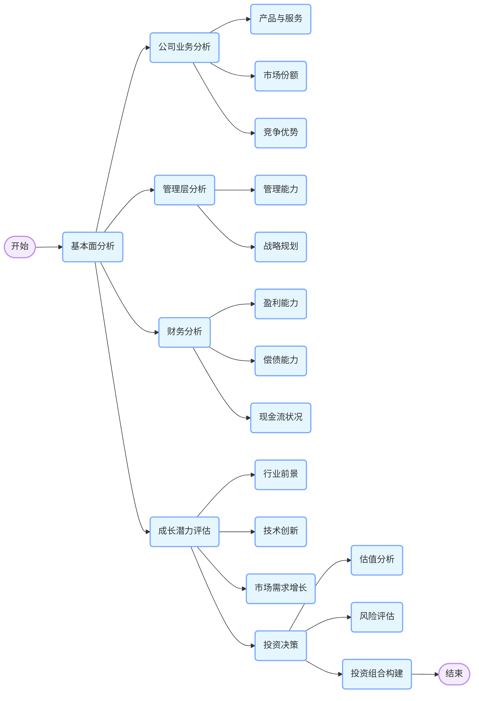

# 费雪的探路者投资法：寻找未来的赢家

> 关键词：费雪探路者投资法、成长股投资、基本面分析、未来赢家、投资策略

> 摘要：本文深入探讨了费雪的探路者投资法，旨在帮助投资者寻找未来具有潜力的赢家。通过介绍该投资法的背景、核心概念、算法原理、数学模型，结合实际案例进行分析，并阐述其在不同场景下的应用，同时推荐相关的学习资源、开发工具和论文著作。最后对该投资法的未来发展趋势与挑战进行总结，并解答常见问题，为投资者提供全面而深入的投资指导。

## 1. 背景介绍 
### 1.1 目的和范围
费雪的探路者投资法的主要目的是帮助投资者从众多的投资对象中筛选出那些具有长期成长潜力的企业，也就是未来的赢家。在当今复杂多变的金融市场中，投资者面临着海量的信息和众多的投资选择，如何做出明智的投资决策是一个关键问题。该投资法通过对企业基本面的深入分析，试图挖掘出那些被市场低估但具有强大增长潜力的公司，从而为投资者带来丰厚的回报。

本文的范围将涵盖费雪探路者投资法的各个方面，包括其核心概念、算法原理、数学模型、实际应用案例以及相关的学习资源和未来发展趋势等。通过全面的介绍和分析，让读者能够深入理解该投资法，并在实际投资中应用。

### 1.2 预期读者
本文的预期读者主要包括以下几类人群：
- 个人投资者：无论是新手投资者还是有一定经验的投资者，都可以从本文中学习到费雪探路者投资法的精髓，提高自己的投资决策能力。
- 金融从业者：如股票分析师、基金经理等，他们可以通过本文对费雪投资法进行更深入的研究，为其工作提供参考。
- 金融专业学生：对于学习金融、投资等相关专业的学生来说，本文可以作为一种实践教学的补充，帮助他们更好地理解投资理论和方法。

### 1.3 文档结构概述
本文将按照以下结构进行组织：
- 核心概念与联系：介绍费雪探路者投资法的核心概念，包括成长股、基本面分析等，并通过示意图和流程图展示其原理和架构。
- 核心算法原理 & 具体操作步骤：详细讲解该投资法的算法原理，并使用Python源代码进行阐述，同时给出具体的操作步骤。
- 数学模型和公式 & 详细讲解 & 举例说明：介绍该投资法涉及的数学模型和公式，并通过具体的例子进行详细讲解。
- 项目实战：代码实际案例和详细解释说明：通过实际的投资案例，展示如何使用费雪探路者投资法进行投资决策，并对代码进行详细解读。
- 实际应用场景：介绍该投资法在不同场景下的应用，如股票投资、基金投资等。
- 工具和资源推荐：推荐相关的学习资源、开发工具和论文著作，帮助读者进一步学习和研究该投资法。
- 总结：未来发展趋势与挑战：对费雪探路者投资法的未来发展趋势进行总结，并分析其面临的挑战。
- 附录：常见问题与解答：解答读者在学习和应用该投资法过程中常见的问题。
- 扩展阅读 & 参考资料：提供相关的扩展阅读资料和参考书目。

### 1.4 术语表
#### 1.4.1 核心术语定义
- **费雪的探路者投资法**：由菲利普·费雪（Philip Fisher）提出的一种投资方法，侧重于寻找具有长期成长潜力的公司，通过对公司基本面的深入分析来进行投资决策。
- **成长股**：指那些销售额和利润额持续增长，且增长速度快于整个经济平均增长水平的股票。
- **基本面分析**：通过对宏观经济、行业和公司的基本情况进行分析，评估公司的内在价值和发展前景。

#### 1.4.2 相关概念解释
- **内在价值**：指公司的真实价值，由公司的资产、盈利能力、现金流等因素决定。
- **竞争优势**：公司在市场竞争中所具有的独特优势，如技术优势、品牌优势、成本优势等。
- **管理层能力**：指公司管理层的经营管理能力，包括战略规划、决策能力、团队管理等方面。

#### 1.4.3 缩略词列表
- **EPS**：Earnings Per Share，每股收益。
- **ROE**：Return on Equity，净资产收益率。
- **PE**：Price-to-Earnings Ratio，市盈率。

## 2. 核心概念与联系 
### 核心概念原理
费雪的探路者投资法的核心原理是通过对公司基本面的深入分析，寻找具有长期成长潜力的公司。该方法认为，一个优秀的公司应该具有以下特点：
- **具有竞争优势**：公司在市场竞争中具有独特的优势，如技术优势、品牌优势、成本优势等，能够在长期内保持领先地位。
- **优秀的管理层**：公司的管理层具有良好的经营管理能力，能够制定正确的战略规划，并有效地执行。
- **持续的创新能力**：公司能够不断推出新产品、新服务，满足市场需求，保持业绩的持续增长。
- **良好的财务状况**：公司具有稳健的财务状况，如合理的资产负债结构、充足的现金流等，能够抵御市场风险。

### 架构的文本示意图
```plaintext
费雪的探路者投资法
|
|-- 基本面分析
|   |-- 公司业务分析
|   |   |-- 产品与服务
|   |   |-- 市场份额
|   |   |-- 竞争优势
|   |-- 管理层分析
|   |   |-- 管理能力
|   |   |-- 战略规划
|   |-- 财务分析
|   |   |-- 盈利能力
|   |   |-- 偿债能力
|   |   |-- 现金流状况
|
|-- 成长潜力评估
|   |-- 行业前景
|   |-- 技术创新
|   |-- 市场需求增长
|
|-- 投资决策
|   |-- 估值分析
|   |-- 风险评估
|   |-- 投资组合构建
```

### Mermaid 流程图


## 3. 核心算法原理 & 具体操作步骤 
### 核心算法原理
费雪的探路者投资法的核心算法原理可以概括为以下几个步骤：
1. **数据收集**：收集公司的基本面数据，包括财务报表、行业报告、新闻资讯等。
2. **指标计算**：根据收集到的数据，计算一系列的财务指标和非财务指标，如EPS、ROE、PE、市场份额、技术创新能力等。
3. **评分体系**：建立一个评分体系，对每个指标进行评分，然后根据权重计算公司的综合得分。
4. **筛选与排序**：根据综合得分对公司进行筛选和排序，选择得分较高的公司作为潜在的投资对象。

### Python源代码实现
```python
import pandas as pd

# 定义指标权重
weights = {
    'EPS': 0.2,
    'ROE': 0.2,
    'PE': 0.1,
    '市场份额': 0.2,
    '技术创新能力': 0.3
}

# 定义评分函数
def score_company(data):
    total_score = 0
    for key, weight in weights.items():
        score = data[key]  # 假设数据中已经包含了各个指标的得分
        total_score += score * weight
    return total_score

# 示例数据
data = [
    {'公司名称': '公司A', 'EPS': 80, 'ROE': 70, 'PE': 60, '市场份额': 75, '技术创新能力': 85},
    {'公司名称': '公司B', 'EPS': 70, 'ROE': 60, 'PE': 70, '市场份额': 65, '技术创新能力': 75},
    {'公司名称': '公司C', 'EPS': 90, 'ROE': 80, 'PE': 50, '市场份额': 85, '技术创新能力': 90}
]

df = pd.DataFrame(data)

# 计算综合得分
df['综合得分'] = df.apply(score_company, axis=1)

# 按综合得分排序
sorted_df = df.sort_values(by='综合得分', ascending=False)

print(sorted_df)
```

### 具体操作步骤
1. **数据收集**：可以通过财经网站、证券交易所、公司年报等渠道收集公司的基本面数据。
2. **指标计算**：根据收集到的数据，使用财务分析工具或编程语言计算各项指标。
3. **评分体系建立**：根据投资目标和风险偏好，确定各个指标的权重，并建立评分标准。
4. **综合得分计算**：使用上述Python代码或其他工具，计算每个公司的综合得分。
5. **筛选与排序**：根据综合得分对公司进行筛选和排序，选择得分较高的公司进行进一步的研究和分析。

## 4. 数学模型和公式 & 详细讲解 & 举例说明 
### 数学模型
费雪的探路者投资法的数学模型可以用以下公式表示：
$$S = \sum_{i=1}^{n} w_i \times s_i$$
其中，$S$ 表示公司的综合得分，$w_i$ 表示第 $i$ 个指标的权重，$s_i$ 表示第 $i$ 个指标的得分，$n$ 表示指标的数量。

### 详细讲解
- **权重 $w_i$**：权重反映了每个指标在综合评估中的重要程度。权重的确定需要根据投资目标、市场环境和个人经验等因素进行综合考虑。例如，如果投资者更关注公司的盈利能力，那么EPS和ROE的权重可以适当提高。
- **得分 $s_i$**：得分是对每个指标的量化评估。得分的计算方法可以根据指标的性质和特点进行确定。例如，对于财务指标，可以根据行业平均水平或历史数据进行评分；对于非财务指标，可以通过专家评估或问卷调查等方式进行评分。

### 举例说明
假设我们要评估三家公司（公司A、公司B、公司C）的投资价值，使用上述的指标和权重。以下是三家公司的各项指标得分：

| 公司名称 | EPS | ROE | PE | 市场份额 | 技术创新能力 |
| ---- | ---- | ---- | ---- | ---- | ---- |
| 公司A | 80 | 70 | 60 | 75 | 85 |
| 公司B | 70 | 60 | 70 | 65 | 75 |
| 公司C | 90 | 80 | 50 | 85 | 90 |

根据公式计算综合得分：
- 公司A的综合得分：
$$S_A = 0.2 \times 80 + 0.2 \times 70 + 0.1 \times 60 + 0.2 \times 75 + 0.3 \times 85 = 77.5$$
- 公司B的综合得分：
$$S_B = 0.2 \times 70 + 0.2 \times 60 + 0.1 \times 70 + 0.2 \times 65 + 0.3 \times 75 = 68.5$$
- 公司C的综合得分：
$$S_C = 0.2 \times 90 + 0.2 \times 80 + 0.1 \times 50 + 0.2 \times 85 + 0.3 \times 90 = 83$$

通过比较综合得分，我们可以看出公司C的得分最高，具有较高的投资价值。

## 5. 项目实战：代码实际案例和详细解释说明 
### 5.1  开发环境搭建
为了实现费雪的探路者投资法的代码实战，我们需要搭建以下开发环境：
- **Python环境**：建议使用Python 3.7及以上版本。可以从Python官方网站（https://www.python.org/downloads/）下载并安装。
- **开发工具**：可以使用PyCharm、Jupyter Notebook等开发工具。这里我们推荐使用Jupyter Notebook，它具有交互式编程的特点，方便我们进行代码调试和数据分析。
- **相关库**：需要安装pandas、numpy等库，用于数据处理和分析。可以使用以下命令进行安装：
```bash
pip install pandas numpy
```

### 5.2  源代码详细实现和代码解读
```python
import pandas as pd
import numpy as np

# 定义指标权重
weights = {
    'EPS': 0.2,
    'ROE': 0.2,
    'PE': 0.1,
    '市场份额': 0.2,
    '技术创新能力': 0.3
}

# 定义评分函数
def score_company(data):
    total_score = 0
    for key, weight in weights.items():
        score = data[key]  # 假设数据中已经包含了各个指标的得分
        total_score += score * weight
    return total_score

# 模拟数据收集
def generate_data(num_companies):
    data = []
    for i in range(num_companies):
        company_data = {
            '公司名称': f'公司{i+1}',
            'EPS': np.random.randint(0, 100),
            'ROE': np.random.randint(0, 100),
            'PE': np.random.randint(0, 100),
            '市场份额': np.random.randint(0, 100),
            '技术创新能力': np.random.randint(0, 100)
        }
        data.append(company_data)
    return data

# 生成模拟数据
num_companies = 10
data = generate_data(num_companies)

# 创建DataFrame
df = pd.DataFrame(data)

# 计算综合得分
df['综合得分'] = df.apply(score_company, axis=1)

# 按综合得分排序
sorted_df = df.sort_values(by='综合得分', ascending=False)

# 输出排名前三的公司
top_three = sorted_df.head(3)
print(top_three)
```

### 代码解读与分析
1. **导入库**：导入pandas和numpy库，用于数据处理和分析。
2. **定义指标权重**：定义了各个指标的权重，这些权重反映了每个指标在综合评估中的重要程度。
3. **定义评分函数**：`score_company` 函数用于计算公司的综合得分，根据指标权重和指标得分进行加权求和。
4. **模拟数据收集**：`generate_data` 函数用于生成模拟的公司数据，包括公司名称和各项指标得分。
5. **生成模拟数据**：调用 `generate_data` 函数生成10家公司的模拟数据。
6. **创建DataFrame**：使用pandas的 `DataFrame` 类将模拟数据转换为数据框。
7. **计算综合得分**：使用 `apply` 方法对数据框的每一行应用 `score_company` 函数，计算每家公司的综合得分。
8. **按综合得分排序**：使用 `sort_values` 方法对数据框按综合得分进行降序排序。
9. **输出排名前三的公司**：使用 `head` 方法选取排名前三的公司并输出。

通过这个代码实战，我们可以看到如何使用Python实现费雪的探路者投资法，对公司进行综合评估和排名。

## 6. 实际应用场景 
### 股票投资
在股票投资中，费雪的探路者投资法可以帮助投资者筛选出具有长期成长潜力的股票。投资者可以通过对公司基本面的分析，评估公司的竞争优势、管理层能力、财务状况等因素，计算公司的综合得分，从而选择得分较高的股票进行投资。例如，投资者可以关注那些具有独特技术优势、市场份额不断扩大、盈利能力持续提升的公司。

### 基金投资
在基金投资中，该投资法可以用于评估基金的投资价值。投资者可以分析基金所投资的股票组合，评估这些股票的基本面情况，从而判断基金的潜在收益和风险。例如，如果一只基金的大部分持仓股票都具有较高的综合得分，那么该基金可能具有较好的投资价值。

### 创业投资
在创业投资中，费雪的探路者投资法可以帮助投资者评估创业项目的可行性和潜力。投资者可以对创业公司的业务模式、团队管理、技术创新等方面进行分析，计算公司的综合得分，从而决定是否对该项目进行投资。例如，对于一家具有创新性技术和优秀管理团队的创业公司，其综合得分可能较高，值得投资者关注。

## 7. 工具和资源推荐
### 7.1 学习资源推荐
#### 7.1.1 书籍推荐
- 《怎样选择成长股》（《Common Stocks and Uncommon Profits》）：菲利普·费雪的经典著作，详细阐述了他的投资理念和方法。
- 《聪明的投资者》（《The Intelligent Investor》）：本杰明·格雷厄姆的经典著作，对价值投资和基本面分析进行了深入探讨。
- 《财务报表分析与证券定价》：介绍了如何通过财务报表分析评估公司的价值和投资潜力。

#### 7.1.2 在线课程
- Coursera上的“投资学原理”课程：由知名大学教授授课，涵盖了投资的基本原理和方法。
- 网易云课堂上的“股票投资入门与实战技巧”课程：适合初学者学习股票投资的基本知识和技巧。

#### 7.1.3 技术博客和网站
- 雪球网：提供股票投资的资讯、分析和交流平台，有很多投资者分享自己的投资经验和见解。
- 东方财富网：提供丰富的财经资讯和金融数据，是投资者获取信息的重要渠道。

### 7.2 开发工具框架推荐
#### 7.2.1 IDE和编辑器
- PyCharm：一款专业的Python集成开发环境，具有代码编辑、调试、版本控制等功能，适合开发复杂的Python程序。
- Jupyter Notebook：一种交互式编程环境，支持Python、R等多种编程语言，方便进行数据分析和可视化。

#### 7.2.2 调试和性能分析工具
- pdb：Python自带的调试工具，可以帮助开发者定位和解决代码中的问题。
- cProfile：Python的性能分析工具，可以分析代码的运行时间和内存使用情况，帮助开发者优化代码性能。

#### 7.2.3 相关框架和库
- pandas：用于数据处理和分析的Python库，提供了丰富的数据结构和数据操作方法。
- numpy：用于科学计算的Python库，提供了高效的数组操作和数学函数。

### 7.3 相关论文著作推荐
#### 7.3.1 经典论文
- 《证券分析》（《Security Analysis》）：本杰明·格雷厄姆和大卫·多德的经典论文，奠定了价值投资的理论基础。
- 《有效市场假说》（《Efficient Markets Hypothesis》）：对市场效率和投资策略进行了深入探讨。

#### 7.3.2 最新研究成果
- 可以关注金融学术期刊，如《金融研究》、《管理世界》等，了解关于投资策略和市场分析的最新研究成果。

#### 7.3.3 应用案例分析
- 可以阅读一些投资机构的研究报告和案例分析，了解他们如何应用费雪的探路者投资法进行投资决策。

## 8. 总结：未来发展趋势与挑战
### 未来发展趋势
- **数字化和智能化**：随着信息技术的不断发展，费雪的探路者投资法将更加数字化和智能化。投资者可以利用大数据、人工智能等技术，更高效地收集和分析公司的基本面数据，提高投资决策的准确性和效率。
- **多元化和全球化**：投资市场将更加多元化和全球化，投资者需要考虑更多的因素，如不同国家和地区的经济环境、政策法规等。费雪的探路者投资法可以帮助投资者在全球范围内寻找具有潜力的投资机会。
- **与其他投资策略的融合**：费雪的探路者投资法可以与其他投资策略相结合，如价值投资、成长投资、量化投资等，形成更加综合和有效的投资策略。

### 挑战
- **数据质量和可靠性**：数据是费雪的探路者投资法的基础，数据的质量和可靠性直接影响投资决策的准确性。投资者需要确保收集到的数据真实、准确、完整。
- **市场变化和不确定性**：金融市场是复杂多变的，市场变化和不确定性给投资决策带来了很大的挑战。投资者需要不断学习和适应市场变化，及时调整投资策略。
- **投资者情绪和心理因素**：投资者的情绪和心理因素也会影响投资决策。在市场波动较大时，投资者容易出现恐慌、贪婪等情绪，导致决策失误。投资者需要保持理性和冷静，避免情绪的干扰。

## 9. 附录：常见问题与解答
### 问题1：如何确定指标的权重？
指标的权重需要根据投资目标、市场环境和个人经验等因素进行综合考虑。可以参考历史数据和行业平均水平，也可以通过专家评估或问卷调查等方式确定权重。

### 问题2：如果某些指标的数据缺失怎么办？
如果某些指标的数据缺失，可以采用以下方法处理：
- 忽略该指标：如果该指标对综合评估的影响较小，可以忽略该指标，只使用其他指标进行评估。
- 估算数据：可以根据历史数据或行业平均水平估算缺失的数据。
- 调整权重：如果某些指标的数据缺失较多，可以适当调整这些指标的权重，降低其在综合评估中的影响。

### 问题3：费雪的探路者投资法适合短期投资吗？
费雪的探路者投资法更适合长期投资。该方法侧重于寻找具有长期成长潜力的公司，需要一定的时间来实现公司的价值增长。短期投资受市场波动和情绪因素的影响较大，不太适合使用该方法。

## 10. 扩展阅读 & 参考资料
### 扩展阅读
- 《投资最重要的事》（《The Most Important Thing Illuminated》）：霍华德·马克斯的著作，分享了他的投资经验和智慧。
- 《金融炼金术》（《The Alchemy of Finance》）：乔治·索罗斯的著作，介绍了他的投资哲学和市场分析方法。

### 参考资料
- 菲利普·费雪. 怎样选择成长股[M]. 海南出版社, 2018.
- 本杰明·格雷厄姆. 聪明的投资者[M]. 人民邮电出版社, 2019.
- 相关财经网站和金融学术期刊的文章和报告。

作者：AI天才研究院/AI Genius Institute & 禅与计算机程序设计艺术 /Zen And The Art of Computer Programming