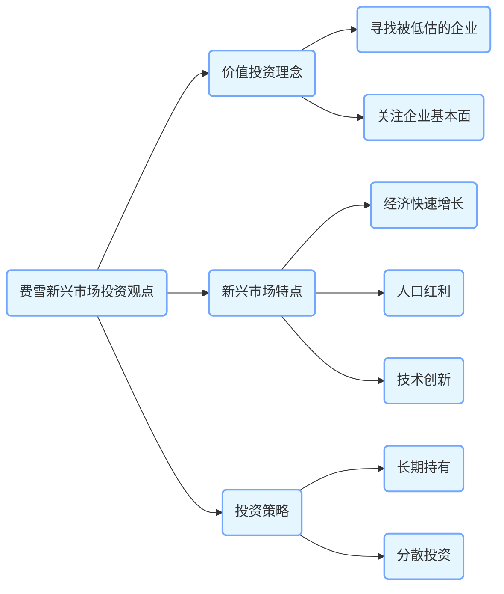

# 费雪的新兴市场投资观点：把握全球机遇

> 关键词：费雪、新兴市场、投资观点、全球机遇、价值投资

> 摘要：本文深入探讨费雪的新兴市场投资观点，旨在揭示如何在新兴市场中把握全球机遇。首先介绍了费雪投资理念的背景，包括其目的、预期读者等。接着阐述了新兴市场投资的核心概念与联系，通过文本示意图和 Mermaid 流程图进行直观展示。详细讲解了相关核心算法原理和具体操作步骤，结合 Python 源代码进行阐述。呈现了数学模型和公式，并举例说明。通过项目实战，给出代码实际案例并详细解释。分析了新兴市场投资的实际应用场景，推荐了相关的工具和资源。最后总结未来发展趋势与挑战，解答常见问题，提供扩展阅读和参考资料，帮助投资者更好地理解和运用费雪的新兴市场投资观点。

## 1. 背景介绍 
### 1.1 目的和范围
费雪作为投资领域的传奇人物，其投资观点影响深远。本文的目的在于深入剖析费雪的新兴市场投资观点，为投资者提供全面且深入的见解。范围涵盖费雪投资理念的核心思想、新兴市场的特点与机遇、如何运用其观点进行投资决策等方面。通过对这些内容的探讨，帮助投资者更好地理解新兴市场投资的本质，把握全球投资机遇。

### 1.2 预期读者
本文预期读者包括对投资领域感兴趣的初学者，希望通过了解费雪的投资观点，初步建立投资理念；有一定投资经验的投资者，希望从费雪的观点中获取新的思路和方法，优化自己的投资策略；以及金融专业的学生和研究人员，为其学术研究和专业学习提供参考。

### 1.3 文档结构概述
本文首先介绍背景信息，让读者了解文章的目的、读者对象和整体结构。接着阐述新兴市场投资的核心概念与联系，使读者对相关概念有清晰的认识。然后详细讲解核心算法原理和具体操作步骤，结合 Python 代码进行说明。通过数学模型和公式进一步深入分析，举例说明其应用。进行项目实战，给出代码实际案例并详细解读。分析新兴市场投资的实际应用场景，推荐相关的工具和资源。最后总结未来发展趋势与挑战，解答常见问题，提供扩展阅读和参考资料。

### 1.4 术语表
#### 1.4.1 核心术语定义
- **新兴市场**：指发展中国家或地区的金融市场，通常具有较高的经济增长率、快速的工业化进程和不断完善的金融体系，但也伴随着较高的风险。
- **价值投资**：一种投资策略，强调通过分析公司的基本面，寻找被低估的股票，以长期持有获取价值增长。
- **成长股**：指那些预期在未来具有较高盈利增长潜力的股票。

#### 1.4.2 相关概念解释
- **投资组合**：投资者将资金分散投资于不同的资产，以降低风险和提高收益的一种投资方式。
- **风险溢价**：投资者为承担额外风险而要求获得的额外回报。

#### 1.4.3 缩略词列表
- **GDP**：国内生产总值（Gross Domestic Product）
- **PE**：市盈率（Price Earnings Ratio）

## 2. 核心概念与联系 
### 核心概念原理
费雪的新兴市场投资观点基于其价值投资理念。他认为新兴市场虽然充满风险，但也蕴含着巨大的投资机遇。新兴市场国家通常具有快速的经济增长、人口红利、技术创新等优势，这些因素为企业的发展提供了良好的环境。费雪强调寻找具有竞争优势、管理优秀、财务健康的企业进行投资。通过深入研究企业的基本面，发现被市场低估的价值，从而实现长期的投资回报。

### 架构的文本示意图
```plaintext
费雪新兴市场投资观点
|-- 价值投资理念
|   |-- 寻找被低估的企业
|   |-- 关注企业基本面
|-- 新兴市场特点
|   |-- 经济快速增长
|   |-- 人口红利
|   |-- 技术创新
|-- 投资策略
|   |-- 长期持有
|   |-- 分散投资
```

### Mermaid 流程图


## 3. 核心算法原理 & 具体操作步骤 
### 核心算法原理
在费雪的新兴市场投资观点中，核心算法原理可以通过筛选具有投资价值的企业来体现。以下是一个简化的企业筛选算法：

1. **财务指标筛选**：通过分析企业的财务报表，筛选出具有良好财务状况的企业。例如，选择市盈率（PE）较低、净资产收益率（ROE）较高、资产负债率合理的企业。
2. **竞争优势评估**：评估企业在行业中的竞争地位，包括市场份额、品牌影响力、技术创新能力等。选择具有竞争优势的企业。
3. **管理团队评估**：考察企业的管理团队，包括管理经验、决策能力、诚信度等。选择管理优秀的企业。

### 具体操作步骤
以下是使用 Python 实现上述核心算法原理的具体操作步骤：

```python
import pandas as pd

# 假设我们有一个包含企业信息的 DataFrame
data = {
    '企业名称': ['企业A', '企业B', '企业C', '企业D'],
    '市盈率': [10, 20, 15, 25],
    '净资产收益率': [0.2, 0.15, 0.18, 0.12],
    '资产负债率': [0.4, 0.5, 0.3, 0.6],
    '市场份额': [0.3, 0.2, 0.25, 0.15],
    '品牌影响力': [8, 6, 7, 5],
    '技术创新能力': [7, 6, 8, 5],
    '管理经验': [8, 7, 8, 6]
}

df = pd.DataFrame(data)

# 财务指标筛选
def financial_screening(df):
    # 筛选市盈率低于 20 的企业
    df = df[df['市盈率'] < 20]
    # 筛选净资产收益率高于 0.15 的企业
    df = df[df['净资产收益率'] > 0.15]
    # 筛选资产负债率低于 0.5 的企业
    df = df[df['资产负债率'] < 0.5]
    return df

# 竞争优势评估
def competitive_advantage_evaluation(df):
    # 计算竞争优势得分，这里简单地将市场份额、品牌影响力和技术创新能力相加
    df['竞争优势得分'] = df['市场份额'] * 10 + df['品牌影响力'] + df['技术创新能力']
    # 筛选竞争优势得分高于 20 的企业
    df = df[df['竞争优势得分'] > 20]
    return df

# 管理团队评估
def management_team_evaluation(df):
    # 筛选管理经验得分高于 7 的企业
    df = df[df['管理经验'] > 7]
    return df

# 综合筛选
df = financial_screening(df)
df = competitive_advantage_evaluation(df)
df = management_team_evaluation(df)

print("筛选后的企业：")
print(df)
```

### 代码解释
1. **数据准备**：使用 `pandas` 库创建一个包含企业信息的 DataFrame。
2. **财务指标筛选**：定义 `financial_screening` 函数，通过条件筛选出具有良好财务状况的企业。
3. **竞争优势评估**：定义 `competitive_advantage_evaluation` 函数，计算竞争优势得分，并筛选出得分较高的企业。
4. **管理团队评估**：定义 `management_team_evaluation` 函数，筛选出管理经验得分较高的企业。
5. **综合筛选**：依次调用上述三个函数，对企业进行综合筛选。

## 4. 数学模型和公式 & 详细讲解 & 举例说明 
### 数学模型和公式
在费雪的新兴市场投资观点中，涉及到一些重要的数学模型和公式，以下是几个常见的例子：

#### 市盈率（PE）
市盈率是衡量股票估值的重要指标，计算公式为：
$$PE = \frac{股价}{每股收益}$$

其中，股价是股票的当前市场价格，每股收益是公司每股的盈利。

#### 净资产收益率（ROE）
净资产收益率反映了公司运用自有资本的效率，计算公式为：
$$ROE = \frac{净利润}{净资产} \times 100\%$$

其中，净利润是公司的税后利润，净资产是公司的所有者权益。

#### 资产负债率
资产负债率反映了公司的负债水平，计算公式为：
$$资产负债率 = \frac{负债总额}{资产总额} \times 100\%$$

其中，负债总额是公司的全部负债，资产总额是公司的全部资产。

### 详细讲解
- **市盈率（PE）**：市盈率越低，说明股票的估值越低，可能存在被低估的情况。但需要注意的是，不同行业的市盈率水平可能存在差异，需要结合行业特点进行分析。
- **净资产收益率（ROE）**：净资产收益率越高，说明公司运用自有资本的效率越高，盈利能力越强。长期来看，高 ROE 的公司往往能够为股东带来更高的回报。
- **资产负债率**：资产负债率过高，说明公司的负债水平较高，财务风险较大。但在某些行业，适当的负债可以提高公司的杠杆效应，增加股东回报。因此，需要根据行业特点和公司的具体情况来判断资产负债率是否合理。

### 举例说明
假设某公司的股价为 20 元，每股收益为 2 元，则该公司的市盈率为：
$$PE = \frac{20}{2} = 10$$

假设该公司的净利润为 1000 万元，净资产为 5000 万元，则该公司的净资产收益率为：
$$ROE = \frac{1000}{5000} \times 100\% = 20\%$$

假设该公司的负债总额为 3000 万元，资产总额为 8000 万元，则该公司的资产负债率为：
$$资产负债率 = \frac{3000}{8000} \times 100\% = 37.5\%$$

## 5. 项目实战：代码实际案例和详细解释说明 
### 5.1  开发环境搭建
为了实现费雪的新兴市场投资观点的项目实战，我们需要搭建以下开发环境：

1. **Python 环境**：建议使用 Python 3.7 及以上版本。可以从 Python 官方网站（https://www.python.org/downloads/） 下载并安装。
2. **开发工具**：推荐使用 PyCharm 或 Jupyter Notebook 作为开发工具。PyCharm 是一款功能强大的 Python 集成开发环境，Jupyter Notebook 则适合进行交互式编程和数据分析。
3. **必要的库**：安装 `pandas`、`numpy` 等库，用于数据处理和分析。可以使用以下命令进行安装：
```sh
pip install pandas numpy
```

### 5.2  源代码详细实现和代码解读
以下是一个更完整的项目实战代码示例，结合了数据获取、数据处理、企业筛选和投资组合构建的过程：

```python
import pandas as pd
import numpy as np

# 模拟数据获取
def get_data():
    data = {
        '企业名称': ['企业A', '企业B', '企业C', '企业D', '企业E'],
        '市盈率': [10, 20, 15, 25, 18],
        '净资产收益率': [0.2, 0.15, 0.18, 0.12, 0.16],
        '资产负债率': [0.4, 0.5, 0.3, 0.6, 0.45],
        '市场份额': [0.3, 0.2, 0.25, 0.15, 0.22],
        '品牌影响力': [8, 6, 7, 5, 7],
        '技术创新能力': [7, 6, 8, 5, 7],
        '管理经验': [8, 7, 8, 6, 7]
    }
    return pd.DataFrame(data)

# 财务指标筛选
def financial_screening(df):
    # 筛选市盈率低于 20 的企业
    df = df[df['市盈率'] < 20]
    # 筛选净资产收益率高于 0.15 的企业
    df = df[df['净资产收益率'] > 0.15]
    # 筛选资产负债率低于 0.5 的企业
    df = df[df['资产负债率'] < 0.5]
    return df

# 竞争优势评估
def competitive_advantage_evaluation(df):
    # 计算竞争优势得分，这里简单地将市场份额、品牌影响力和技术创新能力相加
    df['竞争优势得分'] = df['市场份额'] * 10 + df['品牌影响力'] + df['技术创新能力']
    # 筛选竞争优势得分高于 20 的企业
    df = df[df['竞争优势得分'] > 20]
    return df

# 管理团队评估
def management_team_evaluation(df):
    # 筛选管理经验得分高于 7 的企业
    df = df[df['管理经验'] > 7]
    return df

# 构建投资组合
def build_portfolio(df):
    # 简单地将资金平均分配到筛选后的企业
    num_stocks = len(df)
    df['投资比例'] = 1 / num_stocks
    return df

# 主函数
def main():
    # 获取数据
    df = get_data()
    # 财务指标筛选
    df = financial_screening(df)
    # 竞争优势评估
    df = competitive_advantage_evaluation(df)
    # 管理团队评估
    df = management_team_evaluation(df)
    # 构建投资组合
    df = build_portfolio(df)
    print("投资组合：")
    print(df[['企业名称', '投资比例']])

if __name__ == "__main__":
    main()
```

### 5.3  代码解读与分析
1. **数据获取**：`get_data` 函数模拟了数据获取的过程，返回一个包含企业信息的 DataFrame。
2. **财务指标筛选**：`financial_screening` 函数通过条件筛选出具有良好财务状况的企业。
3. **竞争优势评估**：`competitive_advantage_evaluation` 函数计算竞争优势得分，并筛选出得分较高的企业。
4. **管理团队评估**：`management_team_evaluation` 函数筛选出管理经验得分较高的企业。
5. **构建投资组合**：`build_portfolio` 函数将资金平均分配到筛选后的企业，构建投资组合。
6. **主函数**：`main` 函数依次调用上述函数，完成数据获取、筛选和投资组合构建的过程，并打印出投资组合信息。

## 6. 实际应用场景 
### 个人投资者
个人投资者可以运用费雪的新兴市场投资观点，通过深入研究新兴市场的企业，筛选出具有投资价值的股票，构建自己的投资组合。在投资过程中，注重企业的基本面和长期发展潜力，避免盲目跟风和短期投机行为。

### 机构投资者
机构投资者如基金公司、保险公司等，可以将费雪的投资观点融入到投资策略中。通过专业的研究团队，对新兴市场的企业进行全面的分析和评估，筛选出优质的投资标的，为客户实现资产的增值。

### 跨国企业
跨国企业可以参考费雪的新兴市场投资观点，评估新兴市场的投资环境和企业发展潜力。在进行海外投资和市场拓展时，选择具有竞争优势和发展前景的合作伙伴，降低投资风险，提高投资回报率。

## 7. 工具和资源推荐
### 7.1 学习资源推荐
#### 7.1.1 书籍推荐
- 《怎样选择成长股》（菲利普·费雪著）：费雪的经典著作，详细阐述了他的投资理念和方法。
- 《聪明的投资者》（本杰明·格雷厄姆著）：价值投资领域的经典之作，对费雪的投资观点有一定的影响。
- 《金融炼金术》（乔治·索罗斯著）：探讨了金融市场的运行规律和投资策略，对新兴市场投资有一定的参考价值。

#### 7.1.2 在线课程
- Coursera 上的《投资学原理》：由知名大学教授授课，系统介绍投资学的基本原理和方法。
- edX 上的《金融市场与投资》：提供金融市场和投资领域的专业知识和实践经验。

#### 7.1.3 技术博客和网站
- 雪球网：提供股票投资的资讯、分析和交流平台，有很多投资者分享自己的投资经验和观点。
- 东方财富网：提供全面的金融信息和数据，包括