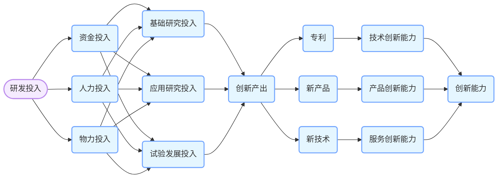

# 费雪的研发投入分析：创新能力的指标

> 关键词：费雪、研发投入、创新能力、指标分析、经济模型、项目实战

> 摘要：本文聚焦于费雪的研发投入分析，探讨其作为创新能力指标的重要意义。通过深入剖析核心概念、算法原理、数学模型，结合实际项目案例进行详细解读，阐述研发投入与创新能力之间的内在联系。同时，介绍相关的应用场景、推荐学习资源和开发工具，分析未来发展趋势与挑战，并对常见问题进行解答。旨在为关注企业创新和研发投入的专业人士提供全面、深入的技术参考。

## 1. 背景介绍 
### 1.1 目的和范围
本研究的主要目的是深入分析费雪的研发投入，并探讨其作为衡量企业创新能力指标的有效性。通过对研发投入相关数据的挖掘和分析，揭示研发投入与企业创新产出之间的关系，为企业制定合理的研发策略提供理论支持和实践指导。研究范围涵盖了费雪公司在不同时期、不同业务领域的研发投入情况，以及相关的创新成果和市场表现。

### 1.2 预期读者
本文预期读者包括企业管理者、研发人员、投资者、经济学者以及对创新管理和研发投入分析感兴趣的专业人士。对于企业管理者，本文提供了评估研发投入效果和优化研发策略的方法；对于研发人员，有助于了解研发投入对创新工作的重要性和影响；对于投资者，可作为评估企业创新潜力和投资价值的参考；对于经济学者，为研究企业创新行为和经济增长提供了实证案例。

### 1.3 文档结构概述
本文将按照以下结构展开：首先介绍核心概念与联系，明确研发投入和创新能力的定义及相互关系；接着阐述核心算法原理和具体操作步骤，包括如何收集和分析研发投入数据；然后介绍相关的数学模型和公式，并通过具体例子进行说明；之后通过项目实战展示代码实现和详细解读；再探讨实际应用场景；推荐相关的工具和资源；最后总结未来发展趋势与挑战，解答常见问题，并提供扩展阅读和参考资料。

### 1.4 术语表
#### 1.4.1 核心术语定义
- **研发投入（Research and Development Investment）**：指企业在研究和开发活动中所投入的资金、人力、物力等资源的总和。通常包括研发人员的薪酬、研发设备的购置、研发项目的经费等。
- **创新能力（Innovation Ability）**：企业在技术、产品、服务、管理等方面进行创新的能力，表现为企业推出新产品、新服务、新流程或改进现有产品和服务的能力。
- **费雪指数（Fisher Index）**：一种综合价格指数，用于衡量多个时期内商品或服务价格的总体变化情况。在研发投入分析中，可用于调整研发投入数据以消除价格因素的影响。

#### 1.4.2 相关概念解释
- **研发强度（R&D Intensity）**：研发投入占企业销售收入的比例，是衡量企业对研发重视程度的重要指标。
- **创新产出（Innovation Output）**：企业通过研发活动所取得的成果，如专利、新产品、新技术等。

#### 1.4.3 缩略词列表
- **R&D**：Research and Development（研究与开发）
- **GDP**：Gross Domestic Product（国内生产总值）

## 2. 核心概念与联系 
### 2.1 研发投入的定义与分类
研发投入是企业为了开展研究和开发活动而投入的各种资源。从投入的形式来看，可以分为资金投入、人力投入和物力投入。资金投入是指企业用于研发项目的直接经费，包括研发人员的工资、研发设备的采购、研发场地的租赁等；人力投入是指参与研发活动的人员数量和质量；物力投入则是指研发所需的设备、仪器、原材料等。

从研发活动的阶段来看，研发投入可以分为基础研究投入、应用研究投入和试验发展投入。基础研究投入主要用于探索新知识、新原理，为后续的应用研究和产品开发提供理论基础；应用研究投入则是将基础研究成果应用于实际问题的研究；试验发展投入则是将应用研究成果转化为新产品、新工艺、新服务的过程。

### 2.2 创新能力的内涵与衡量
创新能力是企业在市场竞争中获取优势的关键因素。它不仅包括技术创新能力，还包括产品创新能力、服务创新能力、管理创新能力等多个方面。技术创新能力是指企业在技术领域进行创新的能力，表现为企业开发新技术、新产品的能力；产品创新能力是指企业推出新产品或改进现有产品的能力；服务创新能力是指企业提供新的服务模式或改进现有服务的能力；管理创新能力是指企业在管理理念、管理方法、管理流程等方面进行创新的能力。

衡量企业创新能力的指标有很多，常见的包括专利数量、新产品销售收入、研发人员比例等。专利数量是衡量企业技术创新能力的重要指标，它反映了企业在技术领域的创新成果；新产品销售收入是衡量企业产品创新能力的重要指标，它反映了企业新产品在市场上的接受程度；研发人员比例是衡量企业对研发重视程度的重要指标，它反映了企业在人力方面的投入情况。

### 2.3 研发投入与创新能力的关系
研发投入是企业创新的重要基础，它为企业的创新活动提供了必要的资源支持。一般来说，研发投入越多，企业的创新能力就越强。但是，研发投入与创新能力之间并不是简单的线性关系，还受到其他因素的影响，如研发管理水平、市场需求、技术环境等。

研发管理水平是影响研发投入效果的重要因素。如果企业的研发管理水平较高，能够合理配置研发资源，提高研发效率，那么研发投入就能够更好地转化为创新成果；反之，如果企业的研发管理水平较低，研发资源配置不合理，研发效率低下，那么即使研发投入再多，也难以取得良好的创新效果。

市场需求也是影响研发投入效果的重要因素。如果企业的研发方向能够符合市场需求，那么研发成果就能够更容易地转化为商业价值；反之，如果企业的研发方向与市场需求脱节，那么研发成果就可能无法得到市场的认可，从而导致研发投入的浪费。

技术环境也是影响研发投入效果的重要因素。如果企业所处的技术环境变化较快，那么企业就需要不断地进行研发投入，以跟上技术发展的步伐；反之，如果企业所处的技术环境变化较慢，那么企业就可以适当减少研发投入，以降低成本。

### 2.4 核心概念原理和架构的文本示意图
研发投入与创新能力之间的关系可以用以下文本示意图来表示：

研发投入（资金、人力、物力） -> 研发活动（基础研究、应用研究、试验发展） -> 创新产出（专利、新产品、新技术） -> 创新能力（技术创新、产品创新、服务创新、管理创新）

### 2.5 Mermaid 流程图


## 3. 核心算法原理 & 具体操作步骤 
### 3.1 研发投入数据的收集与整理
#### 3.1.1 数据来源
研发投入数据的来源主要包括企业财务报表、政府统计部门发布的数据、行业协会发布的数据等。企业财务报表是获取企业研发投入数据的最直接来源，它记录了企业在一定时期内的研发费用支出情况。政府统计部门发布的数据则提供了宏观层面的研发投入数据，如全国或地区的研发投入总量、研发投入占 GDP 的比例等。行业协会发布的数据则提供了行业层面的研发投入数据，如行业平均研发投入水平、不同企业的研发投入排名等。

#### 3.1.2 数据整理
在收集到研发投入数据后，需要对数据进行整理和清洗，以确保数据的准确性和一致性。具体操作步骤包括：
1. 去除重复数据：检查数据中是否存在重复记录，如果存在则将其删除。
2. 处理缺失值：检查数据中是否存在缺失值，如果存在则根据实际情况进行处理，如删除缺失值所在的记录、用平均值或中位数填充缺失值等。
3. 数据标准化：将不同企业或不同时期的研发投入数据进行标准化处理，以消除数据的量纲和尺度差异。常用的标准化方法包括 Z-score 标准化、Min-Max 标准化等。

### 3.2 研发投入与创新能力指标的计算
#### 3.2.1 研发强度的计算
研发强度是指研发投入占企业销售收入的比例，它反映了企业对研发的重视程度。计算公式为：

$$研发强度 = \frac{研发投入}{销售收入} \times 100\%$$

#### 3.2.2 专利密度的计算
专利密度是指企业每单位研发投入所获得的专利数量，它反映了企业研发投入的效率。计算公式为：

$$专利密度 = \frac{专利数量}{研发投入}$$

#### 3.2.3 新产品销售收入占比的计算
新产品销售收入占比是指企业新产品销售收入占总销售收入的比例，它反映了企业产品创新的能力。计算公式为：

$$新产品销售收入占比 = \frac{新产品销售收入}{总销售收入} \times 100\%$$

### 3.3 Python 源代码实现
```python
import pandas as pd

# 假设我们有一个包含研发投入、销售收入、专利数量和新产品销售收入的数据集
data = {
    '企业名称': ['企业 A', '企业 B', '企业 C'],
    '研发投入': [1000, 2000, 1500],
    '销售收入': [5000, 8000, 6000],
    '专利数量': [10, 20, 15],
    '新产品销售收入': [1000, 2000, 1200]
}

df = pd.DataFrame(data)

# 计算研发强度
df['研发强度'] = (df['研发投入'] / df['销售收入']) * 100

# 计算专利密度
df['专利密度'] = df['专利数量'] / df['研发投入']

# 计算新产品销售收入占比
df['新产品销售收入占比'] = (df['新产品销售收入'] / df['销售收入']) * 100

print(df)
```

### 3.4 具体操作步骤总结
1. 收集研发投入、销售收入、专利数量和新产品销售收入等相关数据。
2. 使用 Python 的 Pandas 库将数据加载到 DataFrame 中。
3. 根据上述公式计算研发强度、专利密度和新产品销售收入占比等指标。
4. 对计算结果进行分析和可视化，以了解企业的研发投入和创新能力情况。

## 4. 数学模型和公式 & 详细讲解 & 举例说明 
### 4.1 柯布 - 道格拉斯生产函数在研发投入分析中的应用
#### 4.1.1 柯布 - 道格拉斯生产函数的基本形式
柯布 - 道格拉斯生产函数是一种常用的生产函数，用于描述生产过程中投入要素与产出之间的关系。其基本形式为：

$$Y = AK^{\alpha}L^{\beta}$$

其中，$Y$ 表示产出，$A$ 表示技术水平，$K$ 表示资本投入，$L$ 表示劳动投入，$\alpha$ 和 $\beta$ 分别表示资本和劳动的产出弹性。

#### 4.1.2 在研发投入分析中的扩展
在研发投入分析中，可以将研发投入作为一种特殊的资本投入，对柯布 - 道格拉斯生产函数进行扩展。扩展后的生产函数可以表示为：

$$Y = AK^{\alpha}L^{\beta}R^{\gamma}$$

其中，$R$ 表示研发投入，$\gamma$ 表示研发投入的产出弹性。

#### 4.1.3 举例说明
假设某企业的生产函数为 $Y = 10K^{0.3}L^{0.5}R^{0.2}$，其中 $K = 100$，$L = 200$，$R = 50$。则该企业的产出为：

$$Y = 10\times100^{0.3}\times200^{0.5}\times50^{0.2}$$

```python
import math

A = 10
K = 100
L = 200
R = 50
alpha = 0.3
beta = 0.5
gamma = 0.2

Y = A * math.pow(K, alpha) * math.pow(L, beta) * math.pow(R, gamma)
print(f"企业的产出为: {Y}")
```

### 4.2 面板数据模型在研发投入与创新能力关系分析中的应用
#### 4.2.1 面板数据模型的基本概念
面板数据是指同时包含时间序列和横截面数据的数据结构。面板数据模型可以用于分析个体之间和时间之间的差异，以及变量之间的动态关系。常见的面板数据模型包括固定效应模型和随机效应模型。

#### 4.2.2 固定效应模型的形式
固定效应模型的基本形式为：

$$y_{it} = \alpha_i + \beta x_{it} + \epsilon_{it}$$

其中，$y_{it}$ 表示第 $i$ 个个体在第 $t$ 期的因变量，$\alpha_i$ 表示个体固定效应，$\beta$ 表示自变量的系数，$x_{it}$ 表示第 $i$ 个个体在第 $t$ 期的自变量，$\epsilon_{it}$ 表示随机误差项。

#### 4.2.3 随机效应模型的形式
随机效应模型的基本形式为：

$$y_{it} = \alpha + \beta x_{it} + u_i + \epsilon_{it}$$

其中，$\alpha$ 表示总体截距，$u_i$ 表示个体随机效应。

#### 4.2.4 举例说明
假设我们有一个包含多个企业在多个时期的研发投入和创新产出数据的面板数据集。我们可以使用 Python 的 StatsModels 库来估计固定效应模型和随机效应模型。

```python
import pandas as pd
import statsmodels.api as sm
from linearmodels.panel import PanelOLS, RandomEffects

# 生成示例数据
data = {
    '企业编号': [1, 1, 2, 2],
    '年份': [2019, 2020, 2019, 2020],
    '研发投入': [100, 120, 150, 180],
    '创新产出': [20, 25, 30, 35]
}

df = pd.DataFrame(data)
df = df.set_index(['企业编号', '年份'])

# 固定效应模型
fe_model = PanelOLS(df['创新产出'], sm.add_constant(df['研发投入']), entity_effects=True)
fe_result = fe_model.fit()
print("固定效应模型结果:")
print(fe_result)

# 随机效应模型
re_model = RandomEffects(df['创新产出'], sm.add_constant(df['研发投入']))
re_result = re_model.fit()
print("随机效应模型结果:")
print(re_result)
```

### 4.3 费雪指数在研发投入价格调整中的应用
#### 4.3.1 费雪指数的计算公式
费雪指数是一种综合价格指数，它结合了拉氏指数和帕氏指数的优点。费雪指数的计算公式为：

$$F = \sqrt{L\times P}$$

其中，$F$ 表示费雪指数，$L$ 表示拉氏指数，$P$ 表示帕氏指数。

拉氏指数的计算公式为：

$$L = \frac{\sum_{i=1}^{n} p_{it}q_{i0}}{\sum_{i=1}^{n} p_{i0}q_{i0}} \times 100$$

帕氏指数的计算公式为：

$$P = \frac{\sum_{i=1}^{n} p_{it}q_{it}}{\sum_{i=1}^{n} p_{i0}q_{it}} \times 100$$

其中，$p_{i0}$ 和 $p_{it}$ 分别表示第 $i$ 种商品在基期和报告期的价格，$q_{i0}$ 和 $q_{it}$ 分别表示第 $i$ 种商品在基期和报告期的数量。

#### 4.3.2 在研发投入价格调整中的应用
在分析研发投入时，由于不同时期的价格水平可能不同，需要对研发投入数据进行价格调整，以消除价格因素的影响。可以使用费雪指数来计算研发投入的实际值。

假设某企业在基期的研发投入为 $R_0$，报告期的研发投入为 $R_t$，费雪指数为 $F$。则报告期研发投入的实际值为：

$$R_{t,实际} = \frac{R_t}{F} \times 100$$

#### 4.3.3 举例说明
假设某企业在 2019 年的研发投入为 100 万元，2020 年的研发投入为 120 万元。经过计算，2020 年相对于 2019 年的费雪指数为 110。则 2020 年研发投入的实际值为：

$$R_{2020,实际} = \frac{120}{110} \times 100 \approx 109.09 \text{（万元）}$$

```python
R_0 = 100
R_t = 120
F = 110

R_t_actual = (R_t / F) * 100
print(f"2020 年研发投入的实际值为: {R_t_actual} 万元")
```

## 5. 项目实战：代码实际案例和详细解释说明 
### 5.1 开发环境搭建
#### 5.1.1 安装 Python
首先，需要安装 Python 环境。可以从 Python 官方网站（https://www.python.org/downloads/）下载适合自己操作系统的 Python 安装包，并按照安装向导进行安装。建议安装 Python 3.7 及以上版本。

#### 5.1.2 安装必要的库
在安装好 Python 后，需要安装一些必要的库，如 Pandas、NumPy、StatsModels、Linearmodels 等。可以使用以下命令来安装这些库：

```bash
pip install pandas numpy statsmodels linearmodels
```

### 5.2 源代码详细实现和代码解读
#### 5.2.1 数据加载与预处理
```python
import pandas as pd

# 加载数据
data = pd.read_csv('research_investment_data.csv')

# 处理缺失值
data = data.dropna()

# 数据标准化
from sklearn.preprocessing import StandardScaler

scaler = StandardScaler()
columns_to_scale = ['研发投入', '销售收入', '专利数量', '新产品销售收入']
data[columns_to_scale] = scaler.fit_transform(data[columns_to_scale])

print(data.head())
```

代码解读：
- 首先使用 Pandas 的 `read_csv` 函数加载包含研发投入数据的 CSV 文件。
- 然后使用 `dropna` 函数删除包含缺失值的记录。
- 最后使用 `StandardScaler` 对研发投入、销售收入、专利数量和新产品销售收入等列进行标准化处理，以消除数据的量纲和尺度差异。

#### 5.2.2 计算研发投入相关指标
```python
# 计算研发强度
data['研发强度'] = (data['研发投入'] / data['销售收入']) * 100

# 计算专利密度
data['专利密度'] = data['专利数量'] / data['研发投入']

# 计算新产品销售收入占比
data['新产品销售收入占比'] = (data['新产品销售收入'] / data['销售收入']) * 100

print(data[['研发强度', '专利密度', '新产品销售收入占比']].head())
```

代码解读：
- 根据前面介绍的公式，使用 Pandas 的数据处理功能计算研发强度、专利密度和新产品销售收入占比等指标。

#### 5.2.3 建立面板数据模型
```python
from linearmodels.panel import PanelOLS, RandomEffects
import statsmodels.api as sm

# 设置面板数据索引
data = data.set_index(['企业编号', '年份'])

# 固定效应模型
fe_model = PanelOLS(data['创新产出'], sm.add_constant(data['研发投入']), entity_effects=True)
fe_result = fe_model.fit()
print("固定效应模型结果:")
print(fe_result)

# 随机效应模型
re_model = RandomEffects(data['创新产出'], sm.add_constant(data['研发投入']))
re_result = re_model.fit()
print("随机效应模型结果:")
print(re_result)
```

代码解读：
- 首先使用 `set_index` 函数将数据设置为面板数据索引，其中 `企业编号` 和 `年份` 分别作为个体和时间索引。
- 然后使用 `PanelOLS` 建立固定效应模型，使用 `RandomEffects` 建立随机效应模型，并使用 `fit` 方法进行模型估计。
- 最后打印模型估计结果。

### 5.3 代码解读与分析
通过上述代码，我们完成了研发投入数据的加载、预处理、指标计算和模型建立等任务。从代码实现过程中可以看出，使用 Python 的 Pandas、StatsModels 和 Linearmodels 等库可以方便地进行数据处理和模型估计。

在数据预处理阶段，我们对缺失值进行了处理，并对数据进行了标准化，以确保数据的质量和可比性。在指标计算阶段，我们计算了研发强度、专利密度和新产品销售收入占比等指标，这些指标可以帮助我们评估企业的研发投入效果和创新能力。在模型建立阶段，我们使用面板数据模型分析了研发投入与创新产出之间的关系，固定效应模型和随机效应模型可以考虑个体和时间的差异，更准确地估计变量之间的关系。

## 6. 实际应用场景 
### 6.1 企业战略决策
企业在制定战略决策时，需要考虑研发投入对企业创新能力和竞争力的影响。通过对研发投入的分析，企业可以了解自身在研发方面的优势和不足，制定合理的研发策略。例如，如果企业发现自身的研发强度较低，专利密度也较低，那么可以考虑增加研发投入，提高研发效率，以增强企业的创新能力。

### 6.2 投资者评估
投资者在评估企业的投资价值时，通常会关注企业的创新能力。研发投入是衡量企业创新能力的重要指标之一。投资者可以通过分析企业的研发投入情况，了解企业在技术创新方面的投入力度和发展潜力。例如，如果企业的研发投入持续增长，且创新产出也不断增加，那么说明企业具有较强的创新能力，投资价值较高。

### 6.3 政府政策制定
政府在制定科技政策时，需要了解企业的研发投入情况和创新能力水平。通过对研发投入的分析，政府可以了解不同行业、不同地区的研发投入分布情况，制定针对性的政策措施，鼓励企业增加研发投入，提高创新能力。例如，政府可以通过税收优惠、财政补贴等方式，支持企业开展研发活动。

### 6.4 行业竞争分析
在行业竞争分析中，研发投入和创新能力是企业竞争力的重要组成部分。通过对行业内企业的研发投入和创新产出进行比较分析，可以了解企业在行业中的地位和竞争优势。例如，如果某企业的研发强度高于行业平均水平，且新产品销售收入占比也较高，那么说明该企业在行业中具有较强的竞争力。

## 7. 工具和资源推荐
### 7.1 学习资源推荐
#### 7.1.1 书籍推荐
- 《创新管理：技术、市场与组织变革的整合》：本书全面介绍了创新管理的理论和实践，包括创新战略、研发管理、知识产权管理等方面的内容。
- 《计量经济学导论》：计量经济学是分析研发投入与创新能力关系的重要工具，本书是计量经济学领域的经典教材，适合初学者学习。
- 《Python 数据分析实战》：本书介绍了如何使用 Python 进行数据分析，包括数据处理、数据可视化、模型建立等方面的内容，对于学习研发投入数据分析很有帮助。

#### 7.1.2 在线课程
- Coursera 上的“创新与创业”课程：该课程由知名高校的教授授课，介绍了创新的理论和实践，以及创业的过程和方法。
- edX 上的“计量经济学基础”课程：该课程系统地介绍了计量经济学的基本理论和方法，包括线性回归模型、面板数据模型等。
- 网易云课堂上的“Python 数据分析入门”课程：该课程适合初学者学习 Python 数据分析，通过实际案例介绍了 Python 数据分析的基本流程和方法。

#### 7.1.3 技术博客和网站
- 博客园：博客园是一个技术交流平台，上面有很多关于数据分析、机器学习等方面的技术文章，对于学习研发投入分析很有帮助。
- 知乎：知乎是一个知识分享平台，上面有很多关于创新管理、研发投入等方面的讨论和问答，可以帮助我们了解行业动态和前沿知识。
- Kaggle：Kaggle 是一个数据科学竞赛平台，上面有很多关于数据分析和机器学习的数据集和竞赛项目，可以通过参与竞赛来提高自己的数据分析能力。

### 7.2 开发工具框架推荐
#### 7.2.1 IDE 和编辑器
- PyCharm：PyCharm 是一款专门为 Python 开发设计的集成开发环境，具有代码编辑、调试、版本控制等功能，适合专业的 Python 开发者使用。
- Jupyter Notebook：Jupyter Notebook 是一个交互式的开发环境，可以将代码、文本、图表等内容集成在一个文档中，方便进行数据分析和可视化。
- Visual Studio Code：Visual Studio Code 是一款轻量级的代码编辑器，支持多种编程语言，具有丰富的插件和扩展功能，适合初学者和快速开发。

#### 7.2.2 调试和性能分析工具
- PySnooper：PySnooper 是一个简单易用的 Python 调试工具，可以自动记录函数的调用过程和变量的值，方便进行调试。
- cProfile：cProfile 是 Python 内置的性能分析工具，可以分析代码的运行时间和函数调用次数，帮助我们找出代码中的性能瓶颈。
- line_profiler：line_profiler 是一个逐行分析代码性能的工具，可以帮助我们了解每行代码的执行时间，优化代码性能。

#### 7.2.3 相关框架和库
- Pandas：Pandas 是一个强大的数据分析库，提供了数据结构和数据处理工具，方便进行数据清洗、转换和分析。
- NumPy：NumPy 是一个用于科学计算的 Python 库，提供了多维数组对象和各种数学函数，是数据分析和机器学习的基础库。
- StatsModels：StatsModels 是一个用于统计建模的 Python 库，提供了各种统计模型和方法，如线性回归、面板数据模型等。
- Linearmodels：Linearmodels 是一个专门用于面板数据模型估计的 Python 库，提供了固定效应模型、随机效应模型等多种模型的估计方法。

### 7.3 相关论文著作推荐
#### 7.3.1 经典论文
- Schumpeter, J. A. (1942). Capitalism, Socialism and Democracy. 熊彼特在该著作中提出了创新理论，强调了创新在经济发展中的重要作用，对后续的研发投入和创新研究产生了深远影响。
- Griliches, Z. (1979). Issues in assessing the contribution of research and development to productivity growth. 该论文探讨了研发投入对生产率增长的贡献评估问题，为研发投入的经济分析提供了重要的理论基础。

#### 7.3.2 最新研究成果
- Aghion, P., & Howitt, P. (2009). The Economics of Growth. 本书介绍了经济增长的理论和实证研究，其中包括研发投入与创新在经济增长中的作用，反映了该领域的最新研究成果。
- Bloom, N., Schankerman, M., & Van Reenen, J. (2013). Identifying technology spillovers and product market rivalry. 该论文研究了技术溢出和产品市场竞争对企业研发投入和创新的影响，是该领域的前沿研究。

#### 7.3.3 应用案例分析
- Chesbrough, H. W. (2003). Open Innovation: The New Imperative for Creating and Profiting from Technology. 本书通过大量的企业案例分析，介绍了开放式创新的概念和实践，对于企业如何通过研发投入实现创新具有重要的参考价值。
- Christensen, C. M. (1997). The Innovator's Dilemma: When New Technologies Cause Great Firms to Fail. 该著作通过案例分析了企业在面对颠覆性创新时的困境和应对策略，对企业的研发战略制定具有重要的启示意义。

## 8. 总结：未来发展趋势与挑战
### 8.1 未来发展趋势
#### 8.1.1 研发投入持续增长
随着科技的不断进步和市场竞争的加剧，企业将越来越重视研发投入，以提高自身的创新能力和竞争力。预计未来研发投入将继续保持增长趋势，特别是在人工智能、大数据、生物医药等新兴领域。

#### 8.1.2 开放式创新模式的广泛应用
开放式创新模式将研发活动从企业内部扩展到外部，通过与高校、科研机构、供应商、客户等合作，实现资源共享和优势互补。未来，开放式创新模式将得到更广泛的应用，企业将更加注重与外部创新资源的整合。

#### 8.1.3 数据驱动的研发决策
随着大数据和人工智能技术的发展，企业将越来越多地采用数据驱动的研发决策方法。通过对研发投入、创新产出、市场需求等数据的分析，企业可以更准确地把握研发方向，提高研发效率和成功率。

#### 8.1.4 跨学科融合的研发趋势
未来的研发活动将越来越呈现出跨学科融合的趋势。例如，人工智能与生物医药、材料科学等领域的融合，将为解决复杂的科学问题和社会问题提供新的思路和方法。

### 8.2 挑战
#### 8.2.1 研发投入的不确定性
研发活动具有较高的不确定性，研发投入不一定能够带来预期的创新产出。企业在进行研发投入决策时，需要充分考虑研发风险，合理安排研发资源。

#### 8.2.2 人才短缺
研发活动需要高素质的专业人才，特别是在新兴领域，人才短缺问题更为突出。企业需要加强人才培养和引进，提高研发团队的整体素质。

#### 8.2.3 知识产权保护
随着创新活动的不断增加，知识产权保护问题日益重要。企业需要加强知识产权管理，提高知识产权保护意识，防止知识产权侵权行为的发生。

#### 8.2.4 国际竞争压力
在全球化的背景下，企业面临着来自国际市场的激烈竞争。国外企业在研发投入和创新能力方面具有一定的优势，国内企业需要不断提高自身的竞争力，以应对国际竞争压力。

## 9. 附录：常见问题与解答
### 9.1 研发投入与创新能力之间的关系一定是正相关吗？
研发投入与创新能力之间一般呈现正相关关系，但不是绝对的。研发投入是创新的重要基础，但创新能力还受到研发管理水平、市场需求、技术环境等多种因素的影响。如果企业的研发管理不善，研发方向与市场需求脱节，那么即使研发投入再多，也难以取得良好的创新效果。

### 9.2 如何选择合适的研发投入指标来评估企业的创新能力？
可以综合考虑多个研发投入指标来评估企业的创新能力，如研发强度、专利密度、新产品销售收入占比等。研发强度反映了企业对研发的重视程度；专利密度反映了企业研发投入的效率；新产品销售收入占比反映了企业产品创新的能力。同时，还可以结合其他指标，如研发人员比例、研发项目成功率等，进行全面评估。

### 9.3 面板数据模型和普通回归模型有什么区别？
面板数据模型同时考虑了个体和时间的差异，能够更准确地估计变量之间的关系。普通回归模型只考虑了变量之间的总体关系，忽略了个体和时间的差异。在分析研发投入与创新能力关系时，由于不同企业和不同时期的情况可能存在差异，使用面板数据模型可以得到更可靠的结果。

### 9.4 如何提高研发投入的效果？
提高研发投入的效果可以从以下几个方面入手：
- 优化研发管理：建立科学的研发管理体系，合理配置研发资源，提高研发效率。
- 关注市场需求：研发方向要紧密结合市场需求，确保研发成果能够转化为商业价值。
- 加强人才培养：吸引和培养高素质的研发人才，提高研发团队的创新能力。
- 开展合作创新：与高校、科研机构、供应商、客户等合作，实现资源共享和优势互补。

## 10. 扩展阅读 & 参考资料
### 10.1 扩展阅读
- 《技术创新管理》：本书系统地介绍了技术创新管理的理论和方法，包括技术创新战略、技术创新过程管理、技术创新风险管理等方面的内容。
- 《创新的扩散》：该著作探讨了创新在社会中的扩散过程和影响因素，对于理解创新的传播和应用具有重要的意义。
- 《创新者的基因》：本书通过对大量创新者的研究，总结了创新者的共同特征和行为习惯，对于培养创新能力具有一定的启示作用。

### 10.2 参考资料
- 企业财务报表：企业财务报表是获取企业研发投入数据的重要来源。
- 政府统计部门发布的数据：如国家统计局发布的《中国科技统计年鉴》等，提供了宏观层面的研发投入数据。
- 学术期刊论文：如《管理世界》、《经济研究》等学术期刊上发表的关于研发投入和创新能力的研究论文。

作者：AI天才研究院/AI Genius Institute & 禅与计算机程序设计艺术 /Zen And The Art of Computer Programming