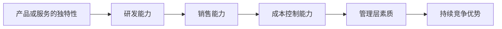

# 费雪的竞争优势分析：持续成功的关键

> 关键词：费雪、竞争优势、持续成功、企业分析、投资策略

> 摘要：本文围绕费雪的竞争优势分析展开，深入探讨这一分析方法对于企业持续成功的重要性。通过阐述核心概念、算法原理、数学模型等内容，结合实际案例详细解读费雪竞争优势分析在企业和投资领域的应用。同时介绍相关工具和资源，最后总结其未来发展趋势与挑战，并提供常见问题解答和扩展阅读资料，旨在为读者全面呈现费雪竞争优势分析的全貌和价值。

## 1. 背景介绍 
### 1.1 目的和范围
本文章的目的在于深入剖析费雪的竞争优势分析理论，探究其在企业发展和投资决策中如何助力实现持续成功。范围涵盖费雪竞争优势分析的核心概念、算法原理、数学模型，以及在实际项目中的应用案例，并介绍与之相关的工具、资源和研究成果。

### 1.2 预期读者
预期读者包括企业管理人员、创业者、投资者、金融分析师以及对企业竞争优势和投资策略感兴趣的学术研究人员。企业管理人员和创业者可从中获取提升企业竞争力的方法；投资者和金融分析师能借助该理论优化投资决策；学术研究人员则可将其作为进一步研究的参考。

### 1.3 文档结构概述
本文首先介绍费雪竞争优势分析的背景，包括目的、预期读者和文档结构。接着阐述核心概念及其联系，以文本示意图和 Mermaid 流程图展示。然后讲解核心算法原理和具体操作步骤，结合 Python 代码详细说明。之后介绍数学模型和公式，并举例说明。通过项目实战展示代码案例和详细解释。再探讨实际应用场景，推荐相关工具和资源。最后总结未来发展趋势与挑战，提供常见问题解答和扩展阅读资料。

### 1.4 术语表
#### 1.4.1 核心术语定义
- **费雪的竞争优势分析**：由菲利普·费雪（Philip Fisher）提出的一种分析企业竞争优势的方法，通过评估企业的多个方面，判断其是否具备可持续的竞争优势，从而为投资和企业战略决策提供依据。
- **竞争优势**：企业在市场中相对于竞争对手所具有的独特优势，能够使其在长期内获得高于行业平均水平的利润。
- **持续成功**：企业在较长时间内保持良好的经营业绩、市场地位和发展态势，能够不断适应市场变化并实现增长。

#### 1.4.2 相关概念解释
- **护城河理论**：与费雪的竞争优势分析相关，指企业拥有的一种类似于护城河的保护机制，使其能够抵御竞争对手的侵蚀，保持自身的竞争优势。例如，品牌优势、技术专利、成本优势等都可以构成企业的护城河。
- **成长型投资**：基于对企业未来成长潜力的评估进行投资的策略，费雪的竞争优势分析是成长型投资的重要理论基础之一。投资者通过寻找具有持续竞争优势的成长型企业，在其发展过程中获得资本增值。

#### 1.4.3 缩略词列表
- **ROE**：Return on Equity，净资产收益率，是衡量企业盈利能力的重要指标，反映股东权益的收益水平。
- **EPS**：Earnings Per Share，每股收益，指税后利润与股本总数的比率，反映普通股的获利水平。

## 2. 核心概念与联系 
费雪的竞争优势分析主要围绕企业的多个关键方面展开，以评估其是否具备持续的竞争优势。核心概念包括以下几个方面：

### 产品或服务的独特性
企业的产品或服务具有独特的特点，能够满足客户的特定需求，并且难以被竞争对手模仿。这种独特性可以体现在产品的质量、性能、功能、设计、品牌等方面。例如，苹果公司的 iPhone 手机以其简洁的设计、流畅的操作系统和强大的生态系统，在智能手机市场中具有独特的竞争优势。

### 研发能力
强大的研发能力使企业能够不断推出新产品、改进现有产品，以适应市场的变化和客户的需求。研发能力不仅包括技术研发，还包括产品创新、工艺改进等方面。例如，华为公司在通信技术领域投入大量的研发资源，不断推出新的技术和产品，保持了在全球通信市场的领先地位。

### 销售能力
有效的销售能力能够将企业的产品或服务推向市场，提高市场份额。销售能力包括销售渠道的建设、销售团队的管理、市场营销策略的制定等方面。例如，可口可乐公司通过建立广泛的销售渠道和强大的市场营销团队，将其产品销售到全球各地，成为全球饮料市场的领导者。

### 成本控制能力
良好的成本控制能力可以使企业在保证产品或服务质量的前提下，降低生产成本，提高利润空间。成本控制能力包括采购成本控制、生产过程成本控制、管理成本控制等方面。例如，沃尔玛公司通过优化供应链管理、采用先进的信息技术等手段，实现了成本的有效控制，从而在零售市场中具有价格优势。

### 管理层素质
优秀的管理层是企业持续成功的关键因素之一。管理层应具备战略眼光、决策能力、领导力、创新精神等素质，能够带领企业制定正确的发展战略，应对各种挑战。例如，巴菲特非常看重企业管理层的素质，认为优秀的管理层能够为企业创造长期的价值。

这些核心概念之间相互关联、相互影响。产品或服务的独特性需要研发能力的支持；销售能力可以将产品或服务的独特性转化为市场份额；成本控制能力可以提高产品或服务的竞争力；而管理层素质则贯穿于企业的各个方面，影响着企业的决策和运营。

以下是核心概念联系的文本示意图：

```plaintext
产品或服务的独特性
    |
    v
研发能力
    |
    v
销售能力
    |
    v
成本控制能力
    |
    v
管理层素质
    |
    v
持续竞争优势
```

以下是 Mermaid 流程图：



## 3. 核心算法原理 & 具体操作步骤 
### 核心算法原理
费雪的竞争优势分析并没有严格意义上的数学算法，但可以通过建立评估指标体系，对企业的各个方面进行量化评估。以下是一个简化的评估指标体系示例：

| 评估指标 | 权重 | 评分标准 |
| --- | --- | --- |
| 产品或服务独特性 | 0.2 | 高：8 - 10分；中：4 - 7分；低：1 - 3分 |
| 研发能力 | 0.2 | 高：8 - 10分；中：4 - 7分；低：1 - 3分 |
| 销售能力 | 0.2 | 高：8 - 10分；中：4 - 7分；低：1 - 3分 |
| 成本控制能力 | 0.2 | 高：8 - 10分；中：4 - 7分；低：1 - 3分 |
| 管理层素质 | 0.2 | 高：8 - 10分；中：4 - 7分；低：1 - 3分 |

通过对每个指标进行评分，然后乘以相应的权重，最后将各项得分相加，得到企业的综合评估得分。得分越高，说明企业的竞争优势越强。

### 具体操作步骤
以下是使用 Python 实现上述评估指标体系的代码示例：

```python
# 定义评估指标权重
weights = {
    "产品或服务独特性": 0.2,
    "研发能力": 0.2,
    "销售能力": 0.2,
    "成本控制能力": 0.2,
    "管理层素质": 0.2
}

# 定义评分函数
def score_evaluation(ratings):
    total_score = 0
    for indicator, rating in ratings.items():
        weight = weights[indicator]
        total_score += rating * weight
    return total_score

# 示例企业的评分
ratings_example = {
    "产品或服务独特性": 8,
    "研发能力": 7,
    "销售能力": 6,
    "成本控制能力": 7,
    "管理层素质": 8
}

# 计算综合评估得分
score = score_evaluation(ratings_example)
print(f"该企业的综合评估得分: {score}")
```

### 代码解释
1. **定义评估指标权重**：使用字典 `weights` 存储每个评估指标的权重。
2. **定义评分函数**：`score_evaluation` 函数接受一个字典 `ratings` 作为参数，该字典包含每个评估指标的评分。函数遍历字典，将每个指标的评分乘以相应的权重，并将结果累加到 `total_score` 中，最后返回综合评估得分。
3. **示例企业的评分**：使用字典 `ratings_example` 存储示例企业的各项评分。
4. **计算综合评估得分**：调用 `score_evaluation` 函数，传入示例企业的评分字典，计算并打印综合评估得分。

## 4. 数学模型和公式 & 详细讲解 & 举例说明 
### 数学模型和公式
设企业的评估指标有 $n$ 个，分别为 $x_1, x_2, \cdots, x_n$，对应的权重为 $w_1, w_2, \cdots, w_n$，且 $\sum_{i=1}^{n} w_i = 1$。则企业的综合评估得分 $S$ 可以用以下公式表示：

$$S = \sum_{i=1}^{n} w_i x_i$$

### 详细讲解
这个公式的核心思想是通过加权平均的方法，将企业在各个评估指标上的得分综合起来，得到一个反映企业整体竞争优势的得分。权重 $w_i$ 表示每个评估指标在综合评估中的重要程度，得分 $x_i$ 表示企业在该指标上的表现。

### 举例说明
假设企业有三个评估指标：产品创新能力、市场份额、成本控制能力，对应的权重分别为 $w_1 = 0.3$，$w_2 = 0.4$，$w_3 = 0.3$。企业在这三个指标上的得分分别为 $x_1 = 8$，$x_2 = 7$，$x_3 = 6$。则企业的综合评估得分 $S$ 为：

$$S = 0.3 \times 8 + 0.4 \times 7 + 0.3 \times 6$$
$$S = 2.4 + 2.8 + 1.8$$
$$S = 7$$

这意味着该企业的综合竞争优势得分为 7 分，可以根据预先设定的评分标准对企业的竞争优势进行评价。

## 5. 项目实战：代码实际案例和详细解释说明 
### 5.1  开发环境搭建
为了运行上述代码示例，需要搭建 Python 开发环境。以下是具体步骤：

1. **安装 Python**：访问 Python 官方网站（https://www.python.org/downloads/），下载并安装适合你操作系统的 Python 版本。建议安装 Python 3.7 及以上版本。
2. **安装代码编辑器**：可以选择 Visual Studio Code、PyCharm 等代码编辑器。这些编辑器都提供了丰富的插件和功能，方便 Python 开发。
3. **创建虚拟环境（可选）**：为了避免不同项目之间的依赖冲突，建议使用虚拟环境。可以使用 `venv` 模块创建虚拟环境，命令如下：

```bash
python -m venv myenv
```

激活虚拟环境：

- 在 Windows 上：

```bash
myenv\Scripts\activate
```

- 在 Linux 或 macOS 上：

```bash
source myenv/bin/activate
```

### 5.2  源代码详细实现和代码解读
以下是一个更完整的代码示例，包含用户输入评分和对综合评估得分的解读：

```python
# 定义评估指标权重
weights = {
    "产品或服务独特性": 0.2,
    "研发能力": 0.2,
    "销售能力": 0.2,
    "成本控制能力": 0.2,
    "管理层素质": 0.2
}

# 定义评分函数
def score_evaluation(ratings):
    total_score = 0
    for indicator, rating in ratings.items():
        weight = weights[indicator]
        total_score += rating * weight
    return total_score

# 定义评分标准
def interpret_score(score):
    if score >= 8:
        return "竞争优势非常强，具有较高的投资价值和发展潜力。"
    elif score >= 6:
        return "竞争优势较强，在市场中具有一定的竞争力。"
    elif score >= 4:
        return "竞争优势一般，需要进一步提升。"
    else:
        return "竞争优势较弱，面临较大的市场风险。"

# 获取用户输入的评分
ratings = {}
for indicator in weights.keys():
    while True:
        try:
            rating = int(input(f"请输入 {indicator} 的评分（1 - 10分）: "))
            if 1 <= rating <= 10:
                ratings[indicator] = rating
                break
            else:
                print("评分应在 1 - 10 分之间，请重新输入。")
        except ValueError:
            print("输入无效，请输入一个整数。")

# 计算综合评估得分
score = score_evaluation(ratings)

# 解读综合评估得分
interpretation = interpret_score(score)

# 输出结果
print(f"该企业的综合评估得分: {score}")
print(f"评估结果解读: {interpretation}")
```

### 代码解读与分析
1. **定义评估指标权重**：使用字典 `weights` 存储每个评估指标的权重。
2. **定义评分函数**：`score_evaluation` 函数接受一个字典 `ratings` 作为参数，计算企业的综合评估得分。
3. **定义评分标准**：`interpret_score` 函数根据综合评估得分，返回对企业竞争优势的解读。
4. **获取用户输入的评分**：通过循环遍历评估指标，提示用户输入每个指标的评分，并进行输入验证。
5. **计算综合评估得分**：调用 `score_evaluation` 函数，传入用户输入的评分字典，计算综合评估得分。
6. **解读综合评估得分**：调用 `interpret_score` 函数，根据综合评估得分进行解读。
7. **输出结果**：打印企业的综合评估得分和评估结果解读。

## 6. 实际应用场景 
### 企业战略规划
企业管理人员可以使用费雪的竞争优势分析方法，评估企业在各个方面的竞争优势，从而制定相应的战略规划。例如，如果企业发现自身在产品研发方面具有较强的优势，可以加大研发投入，推出更多创新产品，以进一步提升市场竞争力。如果企业在成本控制方面存在不足，可以采取措施优化供应链管理、降低生产成本。

### 投资决策
投资者可以运用费雪的竞争优势分析，筛选具有持续竞争优势的企业进行投资。通过评估企业的产品或服务独特性、研发能力、销售能力、成本控制能力和管理层素质等方面，判断企业的投资价值。例如，投资者可以选择那些在多个方面具有优势的企业，长期持有其股票，以获得资本增值。

### 市场竞争分析
企业可以通过对竞争对手进行费雪竞争优势分析，了解竞争对手的优势和劣势，从而制定相应的竞争策略。例如，如果竞争对手在产品品牌方面具有优势，企业可以通过提升产品质量、优化客户服务等方式，提高自身的品牌形象，以缩小与竞争对手的差距。

### 企业并购与重组
在企业并购与重组过程中，费雪的竞争优势分析可以帮助企业评估目标企业的价值。通过分析目标企业的竞争优势，判断其与自身业务的协同效应，从而决定是否进行并购或重组。例如，如果目标企业在某个领域具有独特的技术或市场渠道，与自身业务具有较强的互补性，企业可以考虑进行并购，以实现资源整合和协同发展。

## 7. 工具和资源推荐
### 7.1 学习资源推荐
#### 7.1.1 书籍推荐
- 《怎样选择成长股》（Common Stocks and Uncommon Profits）：菲利普·费雪的经典著作，详细阐述了他的投资理念和选股方法，包括对企业竞争优势的分析。
- 《竞争优势：透视企业护城河》（The Little Book That Builds Wealth: The Knockout Formula for Finding Great Investments）：介绍了企业护城河的概念和分析方法，与费雪的竞争优势分析相关。
- 《巴菲特之道》（The Warren Buffett Way）：虽然主要讲述巴菲特的投资策略，但其中也涉及到对企业竞争优势的评估，与费雪的理念有相通之处。

#### 7.1.2 在线课程
- Coursera 上的“投资学原理”（Principles of Investment）课程：涵盖了投资分析的基本原理和方法，包括对企业竞争优势的分析。
- edX 上的“金融市场”（Financial Markets）课程：提供了金融市场的全面知识，其中包括企业估值和竞争优势分析的内容。

#### 7.1.3 技术博客和网站
- Seeking Alpha（https://seekingalpha.com/）：一个金融市场分析网站，提供了大量关于企业分析和投资策略的文章，包括对企业竞争优势的研究。
- Morningstar（https://www.morningstar.com/）：提供专业的投资研究和分析，包括对企业的评级和竞争优势评估。

### 7.2 开发工具框架推荐
#### 7.2.1 IDE和编辑器
- Visual Studio Code：一款轻量级的代码编辑器，支持 Python 开发，具有丰富的插件和功能。
- PyCharm：专门为 Python 开发设计的集成开发环境，提供了代码编辑、调试、版本控制等功能。

#### 7.2.2 调试和性能分析工具
- pdb：Python 内置的调试工具，可以帮助开发者定位和解决代码中的问题。
- cProfile：Python 标准库中的性能分析工具，可以分析代码的执行时间和调用关系。

#### 7.2.3 相关框架和库
- Pandas：一个强大的数据处理和分析库，可以用于处理和分析企业的财务数据和市场数据。
- NumPy：用于科学计算的基础库，提供了高效的数组操作和数学函数。

### 7.3 相关论文著作推荐
#### 7.3.1 经典论文
- "The Theory of Competitive Advantage" by Michael E. Porter：迈克尔·波特的经典论文，提出了企业竞争优势的理论框架，对费雪的竞争优势分析有重要的影响。
- "Firm Resources and Sustained Competitive Advantage" by Jay B. Barney：探讨了企业资源与持续竞争优势之间的关系，为企业竞争优势分析提供了理论基础。

#### 7.3.2 最新研究成果
- 可以关注《Journal of Financial Economics》、《The Review of Financial Studies》等金融经济领域的顶级期刊，了解关于企业竞争优势和投资策略的最新研究成果。

#### 7.3.3 应用案例分析
- 可以参考一些知名企业的案例分析报告，如苹果、谷歌、亚马逊等，了解它们在竞争优势方面的实践和经验。

## 8. 总结：未来发展趋势与挑战
### 未来发展趋势
- **数字化转型驱动竞争优势重塑**：随着数字化技术的快速发展，企业的竞争优势将越来越依赖于数字化能力。例如，利用大数据、人工智能、物联网等技术，企业可以实现精准营销、智能生产、供应链优化等，从而提升自身的竞争力。
- **可持续发展成为竞争优势的重要组成部分**：消费者对环境保护、社会责任等方面的关注度不断提高，企业的可持续发展能力将成为其竞争优势的重要组成部分。例如，采用环保材料、推行绿色生产、积极参与公益事业等，不仅可以提升企业的社会形象，还可以降低成本、开拓新市场。
- **跨界融合与生态竞争加剧**：不同行业之间的界限越来越模糊，企业之间的竞争将不再局限于单一行业，而是扩展到整个生态系统。例如，科技企业与金融企业、医疗企业的融合，将创造出全新的商业模式和竞争格局。

### 挑战
- **技术更新换代快**：数字化技术的快速发展使得技术更新换代的速度加快，企业需要不断投入研发资源，跟上技术发展的步伐，否则将面临被淘汰的风险。
- **数据安全与隐私保护**：在数字化时代，企业需要处理大量的客户数据和业务数据，数据安全与隐私保护成为企业面临的重要挑战。一旦发生数据泄露事件，将对企业的声誉和竞争力造成严重影响。
- **人才短缺**：具备数字化技术和创新能力的人才短缺，企业需要吸引和留住优秀的人才，以提升自身的创新能力和竞争力。

## 9. 附录：常见问题与解答
### 问题 1：费雪的竞争优势分析适用于所有行业吗？
解答：费雪的竞争优势分析方法具有一定的通用性，但不同行业的特点和竞争环境存在差异，因此在应用时需要根据行业特点进行适当调整。例如，在高科技行业，研发能力和创新能力可能更为重要；而在传统制造业，成本控制能力和生产效率可能是关键因素。

### 问题 2：如何准确评估企业的管理层素质？
解答：评估企业的管理层素质可以从多个方面入手，包括管理层的教育背景、工作经验、业绩记录、战略眼光、决策能力、领导力等。可以通过查阅企业的年报、新闻报道、行业研究报告等资料，了解管理层的相关信息。此外，还可以通过与管理层进行沟通交流，观察他们的思维方式和决策风格。

### 问题 3：费雪的竞争优势分析与其他分析方法有什么区别？
解答：费雪的竞争优势分析侧重于从企业的基本面出发，评估企业的内在价值和竞争优势。与其他分析方法相比，它更注重企业的长期发展潜力和可持续性。例如，技术分析主要关注股票价格的走势和交易量，而费雪的竞争优势分析更关注企业的业务模式、产品或服务、管理层素质等方面。

### 问题 4：在实际应用中，如何确定评估指标的权重？
解答：评估指标的权重可以根据行业特点、企业战略和分析目的进行确定。一般来说，可以通过专家评估、历史数据分析、层次分析法等方法来确定权重。在实际应用中，也可以根据经验和判断进行适当调整，以确保权重的合理性和有效性。

## 10. 扩展阅读 & 参考资料
### 扩展阅读
- 《创新者的窘境》（The Innovator's Dilemma）：探讨了企业在创新过程中面临的挑战和机遇，对理解企业的竞争优势和持续成功具有重要的启示。
- 《从优秀到卓越》（Good to Great）：研究了那些从优秀走向卓越的企业的成功经验，分析了企业实现持续成功的关键因素。

### 参考资料
- Fisher, Philip A. Common Stocks and Uncommon Profits. Harper & Brothers, 1958.
- Porter, Michael E. Competitive Strategy: Techniques for Analyzing Industries and Competitors. Free Press, 1980.
- Barney, Jay B. "Firm Resources and Sustained Competitive Advantage." Journal of Management, vol. 17, no. 1, 1991, pp. 99-120.

作者：AI天才研究院/AI Genius Institute & 禅与计算机程序设计艺术 /Zen And The Art of Computer Programming