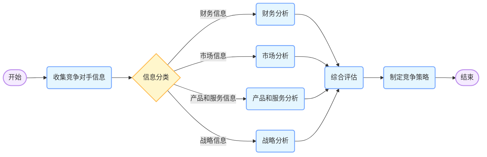

# 费雪的竞争对手分析方法

> 关键词：费雪、竞争对手分析方法、企业竞争、市场评估、财务分析

> 摘要：本文围绕费雪的竞争对手分析方法展开深入探讨。首先介绍该方法的背景，明确其目的、适用读者以及文档结构等。接着阐述核心概念与联系，剖析该方法的原理与架构。通过Python代码详细讲解核心算法原理及具体操作步骤，同时给出相关数学模型和公式并举例说明。在项目实战部分，提供开发环境搭建、源代码实现与解读。还探讨了该方法的实际应用场景，推荐相关学习资源、开发工具框架以及论文著作。最后总结未来发展趋势与挑战，列出常见问题解答和参考资料，旨在为读者全面深入地理解和应用费雪的竞争对手分析方法提供指引。

## 1. 背景介绍 
### 1.1 目的和范围
费雪的竞争对手分析方法旨在帮助企业全面、深入地了解其竞争对手，从而制定出更具针对性和竞争力的战略决策。该方法的应用范围广泛，涵盖了各种行业和规模的企业。通过对竞争对手的分析，企业可以明确自身在市场中的地位，识别潜在的竞争威胁和机会，优化产品和服务，提高市场份额和盈利能力。

### 1.2 预期读者
本文的预期读者主要包括企业管理人员、市场营销人员、战略规划师、投资者以及对企业竞争分析感兴趣的研究人员。这些读者希望通过学习费雪的竞争对手分析方法，提升自身在竞争环境中的决策能力和洞察力。

### 1.3 文档结构概述
本文将按照以下结构进行阐述：首先介绍费雪的竞争对手分析方法的核心概念与联系，包括其原理和架构；接着详细讲解核心算法原理和具体操作步骤，并给出Python代码示例；然后介绍相关的数学模型和公式，并举例说明；通过项目实战展示该方法的实际应用，包括开发环境搭建、源代码实现和代码解读；探讨该方法的实际应用场景；推荐相关的学习资源、开发工具框架和论文著作；最后总结未来发展趋势与挑战，列出常见问题解答和参考资料。

### 1.4 术语表
#### 1.4.1 核心术语定义
- **竞争对手分析**：对企业所处市场中的竞争对手进行全面、系统的研究和评估，以了解其优势、劣势、战略和市场行为。
- **费雪的竞争对手分析方法**：由费雪提出的一套用于分析竞争对手的理论和方法体系，强调从多个维度对竞争对手进行评估。
- **市场份额**：企业在特定市场中所占据的销售额或销售量的比例。
- **财务比率**：用于评估企业财务状况和经营绩效的一系列指标，如利润率、资产负债率等。

#### 1.4.2 相关概念解释
- **竞争优势**：企业相对于竞争对手所具有的独特优势，能够使其在市场中获得更高的利润和市场份额。
- **战略群组**：在同一行业中，具有相似战略和市场定位的企业所组成的群体。
- **波特五力模型**：一种用于分析行业竞争态势的工具，包括供应商的议价能力、购买者的议价能力、潜在进入者的威胁、替代品的威胁和现有竞争者的竞争。

#### 1.4.3 缩略词列表
- **ROE**：净资产收益率（Return on Equity）
- **ROA**：总资产收益率（Return on Assets）
- **EPS**：每股收益（Earnings Per Share）

## 2. 核心概念与联系 

费雪的竞争对手分析方法基于对企业多个方面的综合评估，其核心概念主要包括以下几个方面：

### 核心概念原理
- **财务分析**：通过对竞争对手的财务报表进行分析，了解其盈利能力、偿债能力、运营能力等。例如，利润率可以反映企业的盈利水平，资产负债率可以评估企业的偿债风险。
- **市场分析**：研究竞争对手的市场份额、市场定位、目标客户群体等，了解其在市场中的地位和竞争策略。
- **产品和服务分析**：评估竞争对手的产品和服务的特点、质量、价格、创新能力等，找出其优势和劣势。
- **战略分析**：分析竞争对手的战略规划、发展方向和竞争策略，预测其未来的市场行为。

### 架构的文本示意图
```plaintext
费雪的竞争对手分析方法
|-- 财务分析
|   |-- 盈利能力分析
|   |-- 偿债能力分析
|   |-- 运营能力分析
|-- 市场分析
|   |-- 市场份额分析
|   |-- 市场定位分析
|   |-- 目标客户群体分析
|-- 产品和服务分析
|   |-- 产品特点分析
|   |-- 服务质量分析
|   |-- 价格策略分析
|   |-- 创新能力分析
|-- 战略分析
|   |-- 战略规划分析
|   |-- 发展方向分析
|   |-- 竞争策略分析
```

### Mermaid 流程图


## 3. 核心算法原理 & 具体操作步骤 

### 核心算法原理
费雪的竞争对手分析方法主要通过对多个指标进行量化分析，然后综合评估竞争对手的实力。下面以财务分析中的盈利能力分析为例，介绍核心算法原理。

盈利能力分析常用的指标有净资产收益率（ROE）、总资产收益率（ROA）和每股收益（EPS）。

- **净资产收益率（ROE）**：反映股东权益的收益水平，用以衡量公司运用自有资本的效率。计算公式为：
$ROE = \frac{净利润}{股东权益} \times 100\%$

- **总资产收益率（ROA）**：衡量企业运用全部资产的总体获利能力。计算公式为：
$ROA = \frac{净利润}{总资产} \times 100\%$

- **每股收益（EPS）**：反映普通股的获利水平。计算公式为：
$EPS = \frac{净利润 - 优先股股息}{发行在外的普通股股数}$

### 具体操作步骤
以下是使用Python代码实现对竞争对手盈利能力分析的具体操作步骤：

```python
# 步骤1：定义财务数据
net_income = 1000000  # 净利润
shareholders_equity = 5000000  # 股东权益
total_assets = 8000000  # 总资产
preferred_dividends = 50000  # 优先股股息
outstanding_common_shares = 200000  # 发行在外的普通股股数

# 步骤2：计算盈利能力指标
# 计算净资产收益率（ROE）
roe = (net_income / shareholders_equity) * 100

# 计算总资产收益率（ROA）
roa = (net_income / total_assets) * 100

# 计算每股收益（EPS）
eps = (net_income - preferred_dividends) / outstanding_common_shares

# 步骤3：输出结果
print(f"净资产收益率（ROE）: {roe:.2f}%")
print(f"总资产收益率（ROA）: {roa:.2f}%")
print(f"每股收益（EPS）: {eps:.2f}")
```

### 代码解释
- 步骤1：定义了竞争对手的财务数据，包括净利润、股东权益、总资产、优先股股息和发行在外的普通股股数。
- 步骤2：根据上述公式计算了净资产收益率（ROE）、总资产收益率（ROA）和每股收益（EPS）。
- 步骤3：使用`print`函数输出计算结果，保留两位小数。

## 4. 数学模型和公式 & 详细讲解 & 举例说明 

### 财务分析相关公式
#### 偿债能力分析
- **流动比率**：衡量企业流动资产在短期债务到期以前，可以变为现金用于偿还负债的能力。计算公式为：
$$流动比率 = \frac{流动资产}{流动负债}$$
一般认为，流动比率应在2左右较为合适。例如，某企业流动资产为500万元，流动负债为250万元，则其流动比率为：
$流动比率 = \frac{500}{250} = 2$

- **速动比率**：是衡量企业流动资产中可以立即变现用于偿还流动负债的能力。计算公式为：
$$速动比率 = \frac{流动资产 - 存货}{流动负债}$$
速动比率一般应保持在1左右。假设某企业流动资产为800万元，存货为200万元，流动负债为400万元，则其速动比率为：
$速动比率 = \frac{800 - 200}{400} = 1.5$

#### 运营能力分析
- **存货周转率**：反映存货的周转速度，即存货的流动性及存货资金占用量是否合理。计算公式为：
$$存货周转率 = \frac{营业成本}{平均存货余额}$$
假设某企业一年的营业成本为1000万元，年初存货余额为200万元，年末存货余额为300万元，则平均存货余额为：
$平均存货余额 = \frac{200 + 300}{2} = 250$（万元）
存货周转率为：
$存货周转率 = \frac{1000}{250} = 4$（次）

### 市场分析相关公式
- **市场份额**：企业在特定市场中所占据的销售额或销售量的比例。计算公式为：
$$市场份额 = \frac{企业销售额}{市场总销售额} \times 100\%$$
例如，某企业在某一市场的销售额为500万元，该市场的总销售额为2000万元，则该企业的市场份额为：
$市场份额 = \frac{500}{2000} \times 100\% = 25\%$

## 5. 项目实战：代码实际案例和详细解释说明 

### 5.1  开发环境搭建
为了实现费雪的竞争对手分析方法的项目实战，我们需要搭建以下开发环境：
- **Python环境**：建议使用Python 3.7及以上版本。可以从Python官方网站（https://www.python.org/downloads/）下载并安装。
- **开发工具**：推荐使用PyCharm，它是一款功能强大的Python集成开发环境（IDE），可以从JetBrains官方网站（https://www.jetbrains.com/pycharm/download/）下载并安装。
- **必要的Python库**：我们需要安装`pandas`和`numpy`库，用于数据处理和分析。可以使用以下命令进行安装：
```sh
pip install pandas numpy
```

### 5.2  源代码详细实现和代码解读
以下是一个完整的Python代码示例，用于对多个竞争对手进行财务分析和综合评估：

```python
import pandas as pd
import numpy as np

# 定义竞争对手的财务数据
data = {
    '竞争对手': ['竞争对手A', '竞争对手B', '竞争对手C'],
    '净利润': [1000000, 1200000, 800000],
    '股东权益': [5000000, 6000000, 4000000],
    '总资产': [8000000, 9000000, 7000000],
    '优先股股息': [50000, 60000, 40000],
    '发行在外的普通股股数': [200000, 220000, 180000]
}

# 创建DataFrame对象
df = pd.DataFrame(data)

# 计算盈利能力指标
df['净资产收益率（ROE）'] = (df['净利润'] / df['股东权益']) * 100
df['总资产收益率（ROA）'] = (df['净利润'] / df['总资产']) * 100
df['每股收益（EPS）'] = (df['净利润'] - df['优先股股息']) / df['发行在外的普通股股数']

# 综合评估：假设各指标权重相同
weights = [1/3, 1/3, 1/3]
df['综合得分'] = df[['净资产收益率（ROE）', '总资产收益率（ROA）', '每股收益（EPS）']].apply(
    lambda row: np.dot(row, weights), axis=1
)

# 按综合得分降序排序
df = df.sort_values(by='综合得分', ascending=False)

# 输出结果
print(df)
```

### 5.3  代码解读与分析
- **数据定义**：使用字典`data`定义了三个竞争对手的财务数据，包括净利润、股东权益、总资产、优先股股息和发行在外的普通股股数。
- **创建DataFrame对象**：使用`pandas`库的`DataFrame`函数将字典数据转换为DataFrame对象，方便进行数据处理和分析。
- **计算盈利能力指标**：根据前面介绍的公式，计算了每个竞争对手的净资产收益率（ROE）、总资产收益率（ROA）和每股收益（EPS），并将结果添加到DataFrame中。
- **综合评估**：假设各指标的权重相同，使用`np.dot`函数计算每个竞争对手的综合得分，并将结果添加到DataFrame中。
- **排序并输出结果**：使用`sort_values`函数按综合得分降序排序，最后输出结果。

通过这个项目实战，我们可以对多个竞争对手的财务状况进行综合评估，找出最具竞争力的对手。

## 6. 实际应用场景 
费雪的竞争对手分析方法在企业的多个方面都有广泛的应用，以下是一些常见的实际应用场景：

### 战略规划
企业在制定战略规划时，需要了解竞争对手的情况，以便确定自身的竞争优势和市场定位。通过费雪的竞争对手分析方法，企业可以评估竞争对手的实力和战略，制定出更具针对性的战略规划，如市场拓展战略、产品创新战略等。

### 市场营销
在市场营销活动中，了解竞争对手的产品和服务特点、价格策略、目标客户群体等信息非常重要。企业可以根据竞争对手的情况，调整自己的市场营销策略，如优化产品定价、改进产品包装、加强品牌推广等，以提高市场份额和竞争力。

### 投资决策
投资者在进行投资决策时，需要对目标企业及其竞争对手进行全面的分析。费雪的竞争对手分析方法可以帮助投资者评估企业的竞争地位和发展潜力，从而做出更明智的投资决策。

### 并购重组
在企业进行并购重组时，需要对目标企业和竞争对手进行深入的分析。通过分析竞争对手的情况，企业可以评估并购重组的可行性和潜在风险，制定出合理的并购重组方案。

## 7. 工具和资源推荐
### 7.1 学习资源推荐
#### 7.1.1 书籍推荐
- 《竞争战略》（迈克尔·波特著）：这本书是竞争战略领域的经典之作，介绍了波特五力模型等重要的竞争分析工具和方法。
- 《财务报表分析》（黄世忠著）：详细讲解了财务报表分析的方法和技巧，对于理解费雪的竞争对手分析方法中的财务分析部分非常有帮助。
- 《市场营销管理》（菲利普·科特勒著）：全面介绍了市场营销的理论和实践，对于了解竞争对手分析在市场营销中的应用具有重要的指导意义。

#### 7.1.2 在线课程
- Coursera平台上的“竞争战略分析”课程：由知名商学院教授授课，系统介绍了竞争战略分析的方法和工具。
- edX平台上的“财务报表分析与估值”课程：深入讲解了财务报表分析的原理和方法，以及如何运用财务分析进行企业估值。

#### 7.1.3 技术博客和网站
- 艾瑞咨询网：提供了大量的行业研究报告和市场分析文章，对于了解行业竞争态势和竞争对手情况非常有帮助。
- 雪球网：是一个投资者社区，上面有很多关于企业分析和竞争分析的文章和讨论，可以从中获取有价值的信息和观点。

### 7.2 开发工具框架推荐
#### 7.2.1 IDE和编辑器
- PyCharm：功能强大的Python集成开发环境，提供了代码编辑、调试、版本控制等一系列功能，非常适合Python开发。
- Jupyter Notebook：交互式的开发环境，支持Python、R等多种编程语言，方便进行数据处理和分析。

#### 7.2.2 调试和性能分析工具
- PDB：Python自带的调试工具，可以帮助开发者定位和解决代码中的问题。
- cProfile：Python标准库中的性能分析工具，可以分析代码的运行时间和函数调用情况，帮助开发者优化代码性能。

#### 7.2.3 相关框架和库
- Pandas：用于数据处理和分析的Python库，提供了高效的数据结构和数据操作方法，非常适合处理竞争对手的财务数据和市场数据。
- NumPy：Python的科学计算库，提供了高效的数组操作和数学函数，对于计算各种财务指标和进行综合评估非常有用。

### 7.3 相关论文著作推荐
#### 7.3.1 经典论文
- Michael E. Porter. "How Competitive Forces Shape Strategy". Harvard Business Review, 1979. 该论文提出了波特五力模型，是竞争战略领域的经典之作。
- Alfred Rappaport. "Creating Shareholder Value: The New Standard for Business Performance". The Free Press, 1986. 这本书介绍了股东价值创造的理论和方法，对于理解企业的竞争优势和价值评估具有重要的意义。

#### 7.3.2 最新研究成果
- 关注顶级学术期刊如《Management Science》、《Strategic Management Journal》等，这些期刊上经常发表关于竞争战略和竞争对手分析的最新研究成果。

#### 7.3.3 应用案例分析
- 《哈佛商业评论》上有很多关于企业竞争分析和战略决策的应用案例分析文章，可以从中学习到实际应用中的经验和方法。

## 8. 总结：未来发展趋势与挑战
### 未来发展趋势
- **数字化和智能化**：随着信息技术的快速发展，竞争对手分析将越来越依赖于数字化和智能化的工具和方法。例如，利用大数据分析和人工智能算法可以更高效地收集、处理和分析竞争对手的信息，提高分析的准确性和及时性。
- **多维度分析**：未来的竞争对手分析将不仅仅局限于财务、市场、产品等传统维度，还将拓展到技术创新、企业文化、社会责任等多个维度，以更全面地评估竞争对手的实力和潜力。
- **动态监测**：市场环境变化迅速，竞争对手的情况也在不断变化。因此，未来的竞争对手分析将更加注重动态监测，实时跟踪竞争对手的战略调整和市场行为，及时做出相应的决策。

### 挑战
- **数据获取和质量**：获取准确、全面的竞争对手信息是进行有效分析的前提。然而，竞争对手往往会对自身的信息进行保密，数据获取难度较大。此外，数据的质量也会影响分析结果的准确性，需要对数据进行清洗和验证。
- **分析方法的复杂性**：随着竞争对手分析维度的增加和分析方法的不断发展，分析过程变得越来越复杂。需要具备专业的知识和技能才能正确运用各种分析方法，对分析人员的素质要求较高。
- **竞争环境的不确定性**：市场环境充满了不确定性，竞争对手的战略和行为也难以预测。这给竞争对手分析带来了一定的困难，需要不断调整分析方法和策略，以适应变化的市场环境。

## 9. 附录：常见问题与解答
### 问题1：费雪的竞争对手分析方法适用于所有行业吗？
解答：费雪的竞争对手分析方法具有一定的通用性，适用于大多数行业。但不同行业的竞争特点和关键因素可能有所不同，在应用该方法时需要结合行业特点进行适当的调整和补充。

### 问题2：如何获取竞争对手的财务数据？
解答：可以通过以下途径获取竞争对手的财务数据：
- 公开披露的财务报表：上市公司通常会定期公布财务报表，可以从证券交易所网站、公司官方网站等渠道获取。
- 行业研究报告：一些专业的市场研究机构会发布行业研究报告，其中可能包含竞争对手的财务数据。
- 政府部门和行业协会：政府部门和行业协会可能会收集和发布一些行业相关的数据，包括竞争对手的财务信息。

### 问题3：在综合评估竞争对手时，如何确定各指标的权重？
解答：确定各指标的权重可以采用以下方法：
- 专家意见法：邀请行业专家、企业管理人员等根据经验和专业知识确定各指标的权重。
- 层次分析法（AHP）：通过构建层次结构模型，比较各指标之间的相对重要性，确定各指标的权重。
- 数据驱动法：根据历史数据和实际情况，通过统计分析等方法确定各指标的权重。

## 10. 扩展阅读 & 参考资料
- [1] 迈克尔·波特. 竞争战略[M]. 华夏出版社, 2005.
- [2] 黄世忠. 财务报表分析[M]. 中国财政经济出版社, 2017.
- [3] 菲利普·科特勒. 市场营销管理[M]. 中国人民大学出版社, 2016.
- [4] Michael E. Porter. "How Competitive Forces Shape Strategy". Harvard Business Review, 1979.
- [5] Alfred Rappaport. "Creating Shareholder Value: The New Standard for Business Performance". The Free Press, 1986.

作者：AI天才研究院/AI Genius Institute & 禅与计算机程序设计艺术 /Zen And The Art of Computer Programming