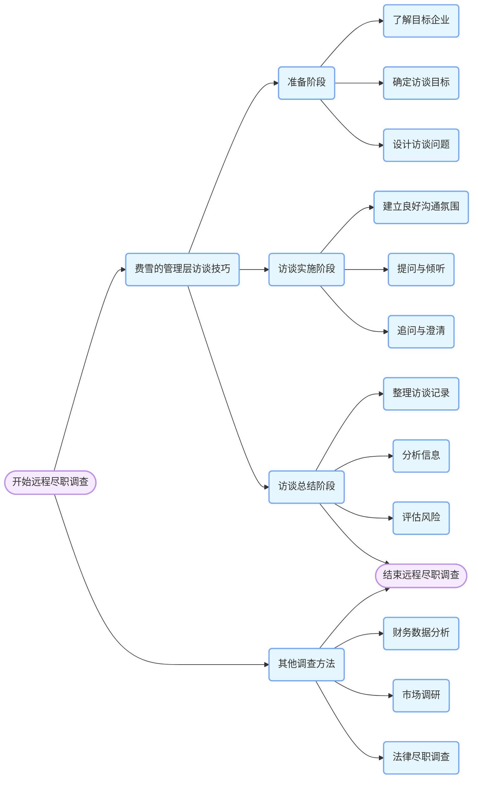

# 费雪的管理层访谈技巧：远程尽职调查的新方法

> 关键词：费雪管理层访谈技巧、远程尽职调查、尽职调查方法、管理层沟通、信息获取

> 摘要：本文聚焦于费雪的管理层访谈技巧在远程尽职调查中的应用，深入探讨这一全新方法。首先介绍相关背景，让读者了解目的、预期读者、文档结构及术语。接着阐述核心概念与联系，通过文本示意图和Mermaid流程图清晰呈现原理架构。详细讲解核心算法原理和具体操作步骤，运用Python代码进行阐释。同时给出数学模型和公式并举例说明。在项目实战部分，从开发环境搭建到源代码实现与解读，提供完整实践指导。分析实际应用场景，推荐学习资源、开发工具框架及相关论文著作。最后总结未来发展趋势与挑战，解答常见问题并提供扩展阅读和参考资料，为读者全面掌握这一远程尽职调查新方法提供帮助。

## 1. 背景介绍 
### 1.1 目的和范围
在当今全球化和数字化的时代，尽职调查面临着新的挑战和机遇。传统的现场尽职调查方式可能受到地理、时间和成本等因素的限制。费雪的管理层访谈技巧为远程尽职调查提供了一种新的途径，本文章的目的在于深入剖析这一技巧在远程尽职调查中的应用，详细阐述其原理、方法和实践操作。范围涵盖了从核心概念的解释到实际项目的案例分析，以及相关工具和资源的推荐，旨在为读者提供全面且深入的理解。

### 1.2 预期读者
本文预期读者包括投资领域的专业人士，如风险投资家、私募股权投资者等，他们在尽职调查过程中需要与目标公司管理层进行有效沟通以获取关键信息；企业并购顾问，负责评估目标企业的价值和潜力，远程尽职调查是其重要工作环节；金融分析师，需要对企业进行深入研究和评估；同时也适合对尽职调查和沟通技巧感兴趣的学生和研究人员阅读。

### 1.3 文档结构概述
本文将按照以下结构展开：首先介绍相关背景知识，让读者了解文章的目的、适用对象和整体框架。接着阐述核心概念与联系，通过文本示意图和流程图帮助读者理解费雪管理层访谈技巧与远程尽职调查的关系。详细讲解核心算法原理和具体操作步骤，并使用Python代码进行说明。然后给出数学模型和公式，结合实际例子进行解释。在项目实战部分，从开发环境搭建到源代码实现和解读，提供完整的实践指导。分析该方法在实际中的应用场景，推荐相关的学习资源、开发工具框架和论文著作。最后总结未来发展趋势与挑战，解答常见问题并提供扩展阅读和参考资料。

### 1.4 术语表
#### 1.4.1 核心术语定义
- **费雪的管理层访谈技巧**：指由费雪提出的一套用于与企业管理层进行有效沟通和访谈的方法，旨在获取企业真实、全面的信息。
- **远程尽职调查**：在不进行现场实地考察的情况下，通过远程通讯手段（如视频会议、电话等）对目标企业进行全面调查和评估的过程。
- **尽职调查**：是指在投资、并购等商业活动中，对目标企业的财务、法律、业务等方面进行全面、深入的调查和评估，以了解其真实情况和潜在风险。

#### 1.4.2 相关概念解释
- **信息不对称**：在商业交易中，交易双方对相关信息的掌握程度存在差异，一方比另一方拥有更多或更准确的信息。在尽职调查中，投资方通常需要通过各种方法来减少与目标企业之间的信息不对称。
- **有效沟通**：指在访谈过程中，双方能够准确、清晰地表达自己的想法和观点，并且能够理解对方的意图，从而实现信息的有效传递和交流。

#### 1.4.3 缩略词列表
无

## 2. 核心概念与联系 
### 核心概念原理
费雪的管理层访谈技巧基于这样一个原理：企业管理层是企业运营和发展的核心人物，他们对企业的各个方面有着最直接、最深入的了解。通过与管理层进行有效的访谈，可以获取到关于企业战略、业务模式、财务状况、市场竞争力等关键信息。在远程尽职调查中，由于无法进行现场实地考察，与管理层的访谈就显得尤为重要。访谈技巧的核心在于如何引导管理层提供真实、全面的信息，以及如何通过提问和交流挖掘出潜在的问题和风险。

### 架构的文本示意图
```plaintext
远程尽职调查
|
|-- 费雪的管理层访谈技巧
|   |-- 准备阶段
|   |   |-- 了解目标企业
|   |   |-- 确定访谈目标
|   |   |-- 设计访谈问题
|   |
|   |-- 访谈实施阶段
|   |   |-- 建立良好沟通氛围
|   |   |-- 提问与倾听
|   |   |-- 追问与澄清
|   |
|   |-- 访谈总结阶段
|       |-- 整理访谈记录
|       |-- 分析信息
|       |-- 评估风险
|
|-- 其他调查方法
|   |-- 财务数据分析
|   |-- 市场调研
|   |-- 法律尽职调查
```

### Mermaid流程图


## 3. 核心算法原理 & 具体操作步骤 
### 核心算法原理
虽然这里的“算法”并非传统意义上的计算机算法，但可以用一种逻辑流程来表示费雪的管理层访谈技巧在远程尽职调查中的应用。其核心原理在于通过一系列有序的步骤，从管理层那里获取有用信息，并对这些信息进行评估和分析。可以将其看作一个信息收集和处理的过程，类似于一个简单的算法模型：输入是与管理层的交流过程，输出是对目标企业的评估结果。

### 具体操作步骤及Python代码示例
```python
# 步骤1: 准备阶段
def preparation_phase(target_company_info):
    # 了解目标企业
    print(f"正在了解目标企业: {target_company_info}")
    # 确定访谈目标
    interview_goals = ["了解企业战略", "评估管理层能力", "发现潜在风险"]
    print(f"确定访谈目标: {interview_goals}")
    # 设计访谈问题
    questions = [
        "贵公司的长期战略是什么？",
        "管理层在过去面临的最大挑战是什么，是如何解决的？",
        "公司目前面临的潜在风险有哪些？"
    ]
    print(f"设计访谈问题: {questions}")
    return questions

# 步骤2: 访谈实施阶段
def interview_implementation_phase(questions):
    print("开始访谈实施阶段")
    responses = []
    for question in questions:
        print(f"提问: {question}")
        # 模拟管理层的回答
        response = input("请输入管理层的回答: ")
        responses.append(response)
    print("访谈实施阶段结束")
    return responses

# 步骤3: 访谈总结阶段
def interview_summary_phase(responses):
    print("开始访谈总结阶段")
    # 整理访谈记录
    print("整理访谈记录...")
    # 分析信息
    print("分析信息...")
    # 评估风险
    print("评估风险...")
    print("访谈总结阶段结束")

# 主函数
def main():
    target_company_info = "ABC科技公司，专注于人工智能领域的研发和应用"
    questions = preparation_phase(target_company_info)
    responses = interview_implementation_phase(questions)
    interview_summary_phase(responses)

if __name__ == "__main__":
    main()
```
### 代码解释
- `preparation_phase` 函数：该函数模拟了准备阶段的操作，包括了解目标企业、确定访谈目标和设计访谈问题。最后返回设计好的问题列表。
- `interview_implementation_phase` 函数：模拟访谈实施阶段，遍历问题列表，依次提问并接收管理层的回答，将回答存储在 `responses` 列表中。
- `interview_summary_phase` 函数：模拟访谈总结阶段，包括整理访谈记录、分析信息和评估风险。
- `main` 函数：调用上述三个函数，完成整个访谈流程。

## 4. 数学模型和公式 & 详细讲解 & 举例说明 
### 数学模型
在费雪的管理层访谈技巧用于远程尽职调查中，可以构建一个简单的评估模型。假设我们通过访谈获取了关于企业的多个方面的信息，如战略得分 $S$、管理层能力得分 $M$、潜在风险得分 $R$ 等。我们可以用一个加权求和的公式来计算企业的综合评估得分 $E$。

### 数学公式
$$E = w_S \times S + w_M \times M + w_R \times R$$

其中，$w_S$、$w_M$、$w_R$ 分别是战略、管理层能力、潜在风险的权重，且 $w_S + w_M + w_R = 1$。

### 详细讲解
- **得分计算**：战略得分 $S$、管理层能力得分 $M$、潜在风险得分 $R$ 可以通过对访谈中获取的信息进行量化评估得到。例如，战略得分可以根据企业战略的清晰性、可行性等方面进行打分，满分为 10 分；管理层能力得分可以根据管理层的经验、决策能力等方面进行打分；潜在风险得分可以根据企业面临的市场风险、竞争风险等方面进行打分。
- **权重确定**：权重的确定需要根据具体的尽职调查目标和重点来进行。如果投资者更关注企业的战略规划，那么 $w_S$ 可以设置得较高；如果更关注管理层的能力，那么 $w_M$ 可以设置得较高。

### 举例说明
假设我们对一家科技企业进行远程尽职调查，通过访谈评估得到战略得分 $S = 7$ 分，管理层能力得分 $M = 8$ 分，潜在风险得分 $R = 3$ 分。我们设定战略的权重 $w_S = 0.4$，管理层能力的权重 $w_M = 0.4$，潜在风险的权重 $w_R = 0.2$。

则该企业的综合评估得分 $E$ 为：

$$E = 0.4 \times 7 + 0.4 \times 8 + 0.2 \times 3$$
$$E = 2.8 + 3.2 + 0.6$$
$$E = 6.6$$

通过这个综合评估得分，我们可以对该企业有一个初步的判断。得分越高，说明企业在战略、管理层能力和风险控制等方面表现越好；得分越低，则需要进一步深入分析存在的问题。

## 5. 项目实战：代码实际案例和详细解释说明 
### 5.1  开发环境搭建
在进行与费雪的管理层访谈技巧相关的项目实战时，我们可以使用 Python 作为主要的开发语言。以下是开发环境搭建的步骤：

#### 安装 Python
首先，从 Python 官方网站（https://www.python.org/downloads/）下载并安装适合你操作系统的 Python 版本。建议安装 Python 3.7 及以上版本。

#### 安装开发工具
可以选择使用 Visual Studio Code（VS Code）作为开发工具。VS Code 是一款轻量级且功能强大的代码编辑器，支持 Python 开发。下载地址为：https://code.visualstudio.com/。安装完成后，在 VS Code 中安装 Python 扩展，以便更好地进行 Python 开发。

#### 创建虚拟环境
为了避免不同项目之间的依赖冲突，建议创建虚拟环境。在命令行中执行以下命令：

```bash
# 创建虚拟环境
python -m venv myenv

# 激活虚拟环境（Windows）
myenv\Scripts\activate

# 激活虚拟环境（Linux/Mac）
source myenv/bin/activate
```

### 5.2  源代码详细实现和代码解读
以下是一个更完整的 Python 代码示例，用于模拟费雪的管理层访谈技巧在远程尽职调查中的应用：

```python
# 定义问题类
class InterviewQuestion:
    def __init__(self, question, category):
        self.question = question
        self.category = category

    def __str__(self):
        return f"{self.category}: {self.question}"

# 准备阶段
def preparation_phase(target_company_info):
    print(f"正在了解目标企业: {target_company_info}")
    interview_goals = ["了解企业战略", "评估管理层能力", "发现潜在风险"]
    print(f"确定访谈目标: {interview_goals}")

    # 设计访谈问题
    questions = [
        InterviewQuestion("贵公司的长期战略是什么？", "企业战略"),
        InterviewQuestion("管理层在过去面临的最大挑战是什么，是如何解决的？", "管理层能力"),
        InterviewQuestion("公司目前面临的潜在风险有哪些？", "潜在风险")
    ]
    print("设计访谈问题:")
    for question in questions:
        print(question)
    return questions

# 访谈实施阶段
def interview_implementation_phase(questions):
    print("开始访谈实施阶段")
    responses = {}
    for question in questions:
        print(f"提问: {question.question}")
        response = input("请输入管理层的回答: ")
        responses[question.category] = response
    print("访谈实施阶段结束")
    return responses

# 访谈总结阶段
def interview_summary_phase(responses):
    print("开始访谈总结阶段")
    # 整理访谈记录
    print("整理访谈记录...")
    for category, response in responses.items():
        print(f"{category}: {response}")
    # 分析信息
    print("分析信息...")
    # 这里可以添加更复杂的信息分析逻辑
    # 例如，根据回答进行关键词提取、情感分析等
    # 评估风险
    print("评估风险...")
    print("访谈总结阶段结束")

# 主函数
def main():
    target_company_info = "ABC科技公司，专注于人工智能领域的研发和应用"
    questions = preparation_phase(target_company_info)
    responses = interview_implementation_phase(questions)
    interview_summary_phase(responses)

if __name__ == "__main__":
    main()
```

### 代码解读
- **InterviewQuestion 类**：用于封装访谈问题和问题所属的类别，方便后续的管理和处理。
- `preparation_phase` 函数：在准备阶段，首先打印目标企业信息和访谈目标，然后设计访谈问题并存储在 `InterviewQuestion` 对象列表中，最后返回该列表。
- `interview_implementation_phase` 函数：在访谈实施阶段，遍历问题列表，依次提问并接收管理层的回答，将回答存储在字典 `responses` 中，键为问题类别，值为回答内容。
- `interview_summary_phase` 函数：在访谈总结阶段，首先整理访谈记录，打印每个问题类别的回答内容。然后可以添加更复杂的信息分析逻辑，如关键词提取、情感分析等。最后进行风险评估。
- `main` 函数：调用上述三个函数，完成整个访谈流程。

### 5.3  代码解读与分析
#### 优点
- **模块化设计**：代码采用模块化设计，将准备阶段、访谈实施阶段和访谈总结阶段分别封装在不同的函数中，提高了代码的可读性和可维护性。
- **问题分类管理**：使用 `InterviewQuestion` 类对访谈问题进行分类管理，方便后续的信息整理和分析。
- **可扩展性**：在访谈总结阶段，可以方便地添加更复杂的信息分析逻辑，如关键词提取、情感分析等，以提高对访谈信息的处理能力。

#### 缺点
- **模拟性较强**：代码中很多操作是模拟的，如信息分析和风险评估部分只是简单打印提示信息，没有实现具体的功能。
- **缺乏异常处理**：代码没有对可能出现的异常情况进行处理，如用户输入错误、网络异常等。

#### 改进建议
- **实现具体分析功能**：在访谈总结阶段，实现具体的信息分析功能，如使用自然语言处理技术进行关键词提取、情感分析等。
- **添加异常处理**：在代码中添加异常处理机制，提高代码的健壮性。例如，在接收用户输入时，对输入进行合法性检查。

## 6. 实际应用场景 
### 风险投资领域
在风险投资中，投资者需要对目标企业进行全面的尽职调查，以评估投资风险和潜在回报。由于投资项目可能分布在不同地区，远程尽职调查变得越来越重要。费雪的管理层访谈技巧可以帮助投资者通过远程访谈获取目标企业管理层的信息，了解企业的战略规划、业务模式、市场竞争力等方面的情况。例如，投资者可以通过与管理层的访谈，了解企业的技术创新能力、团队管理能力等，从而判断企业的发展潜力。

### 企业并购领域
在企业并购过程中，收购方需要对被收购企业进行详细的尽职调查，以确定收购价格和整合方案。远程尽职调查可以节省时间和成本，提高尽职调查的效率。费雪的管理层访谈技巧可以帮助收购方与被收购企业管理层进行有效的沟通，了解企业的财务状况、法律风险、人力资源等方面的情况。例如，收购方可以通过与管理层的访谈，了解企业的客户关系、供应商情况等，从而评估企业的市场地位和竞争力。

### 金融分析领域
金融分析师需要对企业进行深入的研究和评估，为投资者提供投资建议。远程尽职调查可以让金融分析师更方便地获取企业管理层的信息，从而更准确地评估企业的价值和风险。费雪的管理层访谈技巧可以帮助金融分析师通过与管理层的访谈，了解企业的未来发展规划、行业趋势等方面的信息。例如，金融分析师可以通过与管理层的访谈，了解企业的新产品研发计划、市场拓展策略等，从而预测企业的未来业绩。

## 7. 工具和资源推荐
### 7.1 学习资源推荐
#### 7.1.1 书籍推荐
- 《尽职调查：风险评估与财务分析》：本书详细介绍了尽职调查的流程、方法和技巧，包括财务尽职调查、法律尽职调查、业务尽职调查等方面的内容，对于深入理解尽职调查有很大帮助。
- 《沟通的艺术》：讲解了沟通的原理、技巧和策略，对于提升与管理层的沟通能力有很大的启发作用。

#### 7.1.2 在线课程
- Coursera 上的“商业尽职调查”课程：由知名商学院教授授课，系统地介绍了商业尽职调查的理论和实践。
- Udemy 上的“高效沟通技巧”课程：提供了实用的沟通技巧和方法，帮助学习者提高沟通能力。

#### 7.1.3 技术博客和网站
- 知乎：有很多关于尽职调查和沟通技巧的讨论和分享，可以从中获取不同的观点和经验。
- 投资界网站：提供了大量的投资案例和尽职调查分析，对于了解实际应用场景有很大帮助。

### 7.2 开发工具框架推荐
#### 7.2.1 IDE和编辑器
- Visual Studio Code：功能强大、轻量级的代码编辑器，支持 Python 开发，有丰富的插件可以扩展功能。
- PyCharm：专业的 Python 集成开发环境，提供了代码调试、自动补全、代码分析等功能，适合大型 Python 项目的开发。

#### 7.2.2 调试和性能分析工具
- pdb：Python 自带的调试工具，可以在代码中设置断点，逐步执行代码，方便调试和排查问题。
- cProfile：Python 标准库中的性能分析工具，可以分析代码的运行时间和函数调用情况，帮助优化代码性能。

#### 7.2.3 相关框架和库
- NLTK（Natural Language Toolkit）：用于自然语言处理的 Python 库，可以进行文本分类、情感分析、关键词提取等操作，在访谈信息分析中可以发挥重要作用。
- Pandas：用于数据处理和分析的 Python 库，可以方便地对访谈数据进行整理和分析。

### 7.3 相关论文著作推荐
#### 7.3.1 经典论文
- “The Role of Management Interviews in Due Diligence”：探讨了管理层访谈在尽职调查中的重要作用和方法。
- “Effective Communication in Remote Due Diligence”：研究了远程尽职调查中有效沟通的策略和技巧。

#### 7.3.2 最新研究成果
- 关注学术数据库（如 IEEE Xplore、ACM Digital Library 等）上关于尽职调查和沟通技巧的最新研究论文，了解该领域的前沿动态。

#### 7.3.3 应用案例分析
- 一些专业的商业研究机构会发布关于尽职调查的应用案例分析报告，可以从中学习实际应用中的经验和教训。

## 8. 总结：未来发展趋势与挑战
### 未来发展趋势
- **数字化程度不断提高**：随着信息技术的不断发展，远程尽职调查的数字化程度将不断提高。例如，利用人工智能技术进行访谈信息的自动分析和处理，提高尽职调查的效率和准确性。
- **跨领域融合**：费雪的管理层访谈技巧将与其他领域的技术和方法进行更深入的融合，如大数据分析、区块链技术等。例如，结合大数据分析可以更全面地了解目标企业的市场情况和行业趋势。
- **国际化应用**：在全球化的背景下，远程尽职调查将越来越多地应用于国际业务中。费雪的管理层访谈技巧也将在不同文化和商业环境中得到更广泛的应用和发展。

### 挑战
- **信息真实性验证**：在远程尽职调查中，由于无法进行现场实地考察，获取的信息可能存在真实性问题。如何有效地验证管理层提供的信息的真实性是一个重要的挑战。
- **文化差异和语言障碍**：在国际业务中，不同国家和地区的文化差异和语言障碍可能会影响与管理层的沟通效果。需要具备跨文化沟通能力和语言能力，以确保访谈的顺利进行。
- **技术安全问题**：随着数字化程度的提高，远程尽职调查涉及到大量的信息传输和存储，技术安全问题变得尤为重要。如何保障信息的安全和隐私，防止信息泄露和被篡改是一个亟待解决的问题。

## 9. 附录：常见问题与解答
### 问题1：如何确保在远程访谈中获取到真实的信息？
解答：可以采取以下措施来确保获取到真实的信息：
- 在访谈前充分了解目标企业的背景信息，以便在访谈中进行验证和对比。
- 设计巧妙的问题，避免直接询问可能引起管理层抵触的问题。可以采用开放式问题和追问的方式，引导管理层提供详细的信息。
- 与管理层建立良好的沟通氛围，让他们感到舒适和信任，从而更愿意提供真实的信息。
- 结合其他调查方法，如财务数据分析、市场调研等，对访谈获取的信息进行验证和补充。

### 问题2：在远程访谈中，如何应对管理层的回避或模糊回答？
解答：当遇到管理层回避或模糊回答时，可以采取以下方法：
- 重新表述问题，以更清晰、具体的方式再次提问。
- 进行追问，要求管理层提供更详细的信息或具体的例子。
- 引用之前了解到的相关信息，引导管理层围绕问题进行回答。
- 强调获取准确信息的重要性，让管理层意识到提供真实、详细信息的必要性。

### 问题3：如何评估远程访谈中获取的信息的价值？
解答：可以从以下几个方面评估信息的价值：
- 与访谈目标的相关性：信息是否与访谈目标紧密相关，是否能够满足尽职调查的需求。
- 信息的准确性和可靠性：通过与其他渠道获取的信息进行对比和验证，评估信息的准确性和可靠性。
- 信息的新颖性和独特性：是否提供了新的、有价值的见解和观点。
- 信息对决策的影响：信息是否能够对投资决策、并购决策等产生重要的影响。

## 10. 扩展阅读 & 参考资料
### 扩展阅读
- 《投资最重要的事》：这本书深入探讨了投资中的各种关键因素和决策方法，对于理解尽职调查在投资中的重要性有很大帮助。
- 《商业洞察力》：帮助读者提高对商业现象的洞察力和分析能力，在尽职调查中能够更敏锐地发现问题和潜在风险。

### 参考资料
- 相关学术论文和研究报告，如上述提到的经典论文和最新研究成果。
- 行业报告和统计数据，用于了解目标企业所在行业的发展趋势和市场情况。
- 企业公开披露的信息，如年报、季报等，作为尽职调查的重要参考依据。

作者：AI天才研究院/AI Genius Institute & 禅与计算机程序设计艺术 /Zen And The Art of Computer Programming