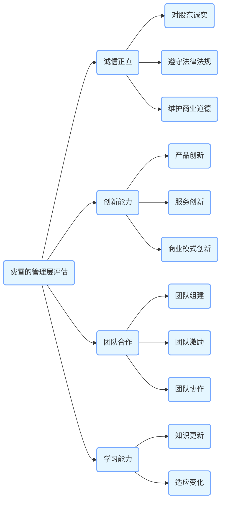

# 费雪的管理层评估：优秀的公司需要优秀的领导

> 关键词：费雪管理层评估、优秀公司、优秀领导、评估指标、公司发展

> 摘要：本文围绕费雪的管理层评估展开，深入探讨优秀的领导对于优秀公司的重要性。详细介绍了费雪管理层评估的背景知识，包括目的、预期读者、文档结构和相关术语。阐述了核心概念与联系，通过文本示意图和 Mermaid 流程图清晰展示。对核心算法原理及具体操作步骤进行讲解，并结合 Python 源代码进行说明。分析了数学模型和公式，辅以举例加深理解。通过项目实战案例，展示了评估方法的实际应用。探讨了该评估在实际场景中的应用，推荐了相关的学习资源、开发工具框架和论文著作。最后总结了未来发展趋势与挑战，提供常见问题解答和扩展阅读参考资料，旨在为企业评估管理层、选拔优秀领导提供全面而深入的指导。

## 1. 背景介绍 
### 1.1 目的和范围
费雪的管理层评估旨在为投资者、企业所有者和其他利益相关者提供一种科学、系统的方法来评估公司管理层的能力和素质。其范围涵盖了对管理层各个方面的考察，包括战略规划能力、决策能力、团队管理能力、创新能力等，以判断管理层是否能够带领公司实现长期稳定的发展，创造良好的经济效益和社会效益。通过这种评估，可以帮助投资者做出更明智的投资决策，企业所有者更好地选拔和管理管理层，同时也为管理层自身提供改进和提升的方向。

### 1.2 预期读者
本文的预期读者主要包括以下几类人群：
- **投资者**：希望通过评估公司管理层来选择具有投资价值的公司，提高投资回报率，降低投资风险。
- **企业所有者**：需要对现有管理层进行评估，以确定是否需要调整管理层结构或选拔新的管理层成员，确保公司的持续发展。
- **企业管理者**：可以通过了解费雪的管理层评估方法，自我审视和提升自身的管理能力和素质，更好地领导团队实现公司目标。
- **研究人员**：对企业管理和领导力研究感兴趣的学者和研究人员，可将本文作为研究参考，深入探讨管理层评估的理论和实践。

### 1.3 文档结构概述
本文将按照以下结构进行阐述：
- 核心概念与联系：介绍费雪管理层评估的核心概念，通过文本示意图和 Mermaid 流程图展示各概念之间的关系。
- 核心算法原理 & 具体操作步骤：详细讲解评估的核心算法原理，并给出具体的操作步骤，同时使用 Python 源代码进行说明。
- 数学模型和公式 & 详细讲解 & 举例说明：分析评估所涉及的数学模型和公式，通过具体例子加深理解。
- 项目实战：通过实际案例展示费雪管理层评估的具体应用，包括开发环境搭建、源代码实现和代码解读。
- 实际应用场景：探讨该评估方法在不同场景下的应用，如投资决策、企业管理等。
- 工具和资源推荐：推荐相关的学习资源、开发工具框架和论文著作，帮助读者进一步深入学习。
- 总结：总结未来发展趋势与挑战，为读者提供前瞻性的思考。
- 附录：解答常见问题，提供扩展阅读和参考资料。

### 1.4 术语表
#### 1.4.1 核心术语定义
- **费雪的管理层评估**：由菲利普·费雪（Philip A. Fisher）提出的一种用于评估公司管理层能力和素质的方法，通过多维度的考察来判断管理层是否能够有效领导公司发展。
- **管理层能力**：指管理层在战略规划、决策制定、团队管理、资源配置等方面所具备的能力和水平。
- **战略规划能力**：管理层制定公司长期发展战略和目标的能力，包括对市场趋势、行业竞争和公司自身优势的分析和判断。
- **决策能力**：在面对各种复杂情况和问题时，管理层做出正确决策的能力，需要综合考虑各种因素和风险。
- **团队管理能力**：管理层领导和激励团队成员，合理分配工作任务，营造良好团队氛围，提高团队绩效的能力。

#### 1.4.2 相关概念解释
- **领导力**：领导力是指管理者通过影响和引导团队成员，实现组织目标的能力。优秀的领导需要具备良好的沟通能力、决策能力、激励能力和团队建设能力等。
- **公司治理**：公司治理是指通过一系列的制度和机制，协调公司各利益相关者之间的关系，保证公司决策的科学性和公正性，促进公司的长期稳定发展。管理层评估是公司治理的重要组成部分。
- **企业文化**：企业文化是企业在长期发展过程中形成的价值观、行为准则和经营理念的总和。优秀的管理层能够塑造积极向上的企业文化，增强企业的凝聚力和竞争力。

#### 1.4.3 缩略词列表
- **ROE**：Return on Equity，净资产收益率，用于衡量公司运用自有资本的效率。
- **EPS**：Earnings Per Share，每股收益，反映公司的盈利能力。

## 2. 核心概念与联系 
### 核心概念原理
费雪的管理层评估基于这样一个核心原理：优秀的管理层是公司成功的关键因素之一。一个具备卓越能力和素质的管理层能够制定出科学合理的发展战略，做出明智的决策，有效地管理团队和资源，推动公司不断创新和发展。

费雪认为，评估管理层需要从多个维度进行考察，包括：
- **诚信正直**：管理层必须具备高度的诚信和道德标准，诚实对待股东、员工和其他利益相关者，遵守法律法规和商业道德。
- **创新能力**：在快速变化的市场环境中，管理层需要具备创新意识和能力，不断推出新产品、新服务和新的商业模式，以保持公司的竞争力。
- **团队合作**：管理层需要能够组建和领导一个高效的团队，发挥团队成员的优势，实现团队目标。
- **学习能力**：管理层需要不断学习和更新知识，适应市场变化和行业发展的需求。

### 架构的文本示意图
```plaintext
费雪的管理层评估
|-- 诚信正直
|   |-- 对股东诚实
|   |-- 遵守法律法规
|   |-- 维护商业道德
|-- 创新能力
|   |-- 产品创新
|   |-- 服务创新
|   |-- 商业模式创新
|-- 团队合作
|   |-- 团队组建
|   |-- 团队激励
|   |-- 团队协作
|-- 学习能力
|   |-- 知识更新
|   |-- 适应变化
```

### Mermaid 流程图


## 3. 核心算法原理 & 具体操作步骤 
### 核心算法原理
费雪的管理层评估并没有一个固定的、精确的算法，但可以通过建立一个综合评估模型来实现。该模型可以采用加权评分的方法，对管理层的各个评估维度进行量化评分，然后根据各维度的权重计算出管理层的综合得分。

设评估维度有 $n$ 个，分别为 $x_1, x_2, \cdots, x_n$，对应的权重为 $w_1, w_2, \cdots, w_n$，且 $\sum_{i=1}^{n} w_i = 1$。每个维度的评分为 $s_i$，则管理层的综合得分 $S$ 可以表示为：

$$S = \sum_{i=1}^{n} w_i s_i$$

### 具体操作步骤
1. **确定评估维度**：根据费雪的管理层评估理念，确定需要评估的维度，如诚信正直、创新能力、团队合作、学习能力等。
2. **设定权重**：根据各维度对公司发展的重要程度，为每个维度设定相应的权重。例如，可以通过专家打分法或层次分析法来确定权重。
3. **制定评分标准**：为每个评估维度制定详细的评分标准，明确不同得分对应的表现水平。例如，对于创新能力维度，可以分为高、中、低三个等级，分别对应不同的得分区间。
4. **收集数据**：通过各种渠道收集管理层在各评估维度的相关信息，如公司年报、新闻报道、员工反馈等。
5. **进行评分**：根据收集到的数据和评分标准，对管理层在每个维度进行评分。
6. **计算综合得分**：将各维度的评分乘以对应的权重，然后求和得到管理层的综合得分。
7. **结果分析**：根据综合得分对管理层的能力和素质进行评估，判断其是否能够满足公司发展的需求。

### Python 源代码实现
```python
# 评估维度
dimensions = ['诚信正直', '创新能力', '团队合作', '学习能力']

# 各维度权重
weights = [0.25, 0.25, 0.25, 0.25]

# 各维度评分
scores = [80, 70, 85, 75]

# 计算综合得分
def calculate_total_score(weights, scores):
    total_score = 0
    for i in range(len(weights)):
        total_score += weights[i] * scores[i]
    return total_score

# 调用函数计算综合得分
total_score = calculate_total_score(weights, scores)

print(f"管理层的综合得分是: {total_score}")
```

## 4. 数学模型和公式 & 详细讲解 & 举例说明 
### 数学模型
如前所述，费雪的管理层评估数学模型采用加权评分法，其核心公式为：

$$S = \sum_{i=1}^{n} w_i s_i$$

其中，$S$ 表示管理层的综合得分，$n$ 表示评估维度的数量，$w_i$ 表示第 $i$ 个评估维度的权重，$s_i$ 表示第 $i$ 个评估维度的评分。

### 详细讲解
- **评估维度**：评估维度是对管理层能力和素质进行考察的各个方面，如诚信正直、创新能力、团队合作等。不同的评估维度反映了管理层在不同领域的表现。
- **权重**：权重表示每个评估维度在综合评估中的重要程度。权重的设定需要根据公司的战略目标、行业特点和发展阶段等因素进行综合考虑。例如，对于处于创新驱动型行业的公司，创新能力维度的权重可能会相对较高。
- **评分**：评分是对管理层在每个评估维度的表现进行量化的结果。评分标准可以根据实际情况进行制定，一般可以采用百分制或等级制。

### 举例说明
假设一家科技公司对其管理层进行评估，确定了四个评估维度：诚信正直、创新能力、团队合作和学习能力，各维度的权重分别为 0.2、0.3、0.3 和 0.2。经过对管理层的考察，各维度的评分如下：
- 诚信正直：85 分
- 创新能力：70 分
- 团队合作：80 分
- 学习能力：75 分

根据加权评分公式，计算管理层的综合得分：

$$S = 0.2 \times 85 + 0.3 \times 70 + 0.3 \times 80 + 0.2 \times 75$$
$$S = 17 + 21 + 24 + 15$$
$$S = 77$$

因此，该公司管理层的综合得分是 77 分。根据预先设定的评分标准，可以判断该管理层的表现处于中等水平，需要在某些方面进行改进和提升。

## 5. 项目实战：代码实际案例和详细解释说明 
### 5.1  开发环境搭建
为了实现费雪的管理层评估项目，我们可以使用 Python 语言进行开发。以下是开发环境搭建的步骤：
1. **安装 Python**：从 Python 官方网站（https://www.python.org/downloads/）下载并安装适合你操作系统的 Python 版本。建议安装 Python 3.6 及以上版本。
2. **安装开发工具**：可以选择使用 PyCharm、Visual Studio Code 等集成开发环境（IDE），也可以使用 Jupyter Notebook 进行交互式开发。这里以 PyCharm 为例，从 JetBrains 官方网站（https://www.jetbrains.com/pycharm/download/）下载并安装 PyCharm 社区版。
3. **创建项目**：打开 PyCharm，选择“Create New Project”，指定项目的存储路径和 Python 解释器，然后点击“Create”创建项目。

### 5.2  源代码详细实现和代码解读
以下是一个完整的 Python 代码示例，用于实现费雪的管理层评估：

```python
# 评估维度
dimensions = ['诚信正直', '创新能力', '团队合作', '学习能力']

# 各维度权重
weights = [0.2, 0.3, 0.3, 0.2]

# 初始化各维度评分
scores = []

# 输入各维度评分
for dimension in dimensions:
    score = float(input(f"请输入管理层在 {dimension} 维度的评分（0-100）: "))
    scores.append(score)

# 计算综合得分
def calculate_total_score(weights, scores):
    total_score = 0
    for i in range(len(weights)):
        total_score += weights[i] * scores[i]
    return total_score

# 调用函数计算综合得分
total_score = calculate_total_score(weights, scores)

# 输出评估结果
print("\n管理层评估结果：")
for i in range(len(dimensions)):
    print(f"{dimensions[i]}: {scores[i]} 分")
print(f"综合得分: {total_score} 分")

# 根据综合得分给出评价
if total_score >= 90:
    print("管理层表现优秀，具备卓越的领导能力和素质，能够带领公司实现长期稳定发展。")
elif total_score >= 80:
    print("管理层表现良好，在各方面都有较好的表现，能够有效地推动公司发展。")
elif total_score >= 70:
    print("管理层表现中等，需要在某些方面进行改进和提升，以更好地适应公司发展的需求。")
else:
    print("管理层表现较差，需要进行全面的反思和改进，否则可能会影响公司的发展。")
```

### 代码解读与分析
1. **评估维度和权重定义**：定义了四个评估维度 `dimensions` 和对应的权重 `weights`，可以根据实际情况进行调整。
2. **输入评分**：通过 `input()` 函数提示用户输入管理层在每个维度的评分，并将评分存储在 `scores` 列表中。
3. **计算综合得分**：定义了 `calculate_total_score()` 函数，用于根据加权评分公式计算管理层的综合得分。
4. **输出评估结果**：将各维度的评分和综合得分输出，并根据综合得分给出相应的评价。

通过这个项目实战，我们可以看到如何使用 Python 实现费雪的管理层评估，并且可以根据实际需求进行扩展和优化。

## 6. 实际应用场景 
### 投资决策
投资者在选择投资标的时，除了关注公司的财务状况和市场前景外，还需要考虑公司管理层的能力和素质。通过费雪的管理层评估方法，投资者可以对公司管理层进行全面、客观的评估，判断其是否能够带领公司实现持续增长，从而做出更明智的投资决策。例如，如果一家公司的管理层在诚信正直、创新能力和团队合作等方面表现出色，那么该公司更有可能在市场竞争中脱颖而出，具有较高的投资价值。

### 企业管理
企业所有者和高层管理者可以使用费雪的管理层评估方法对现有管理层进行定期评估，了解管理层的优势和不足，为管理层的选拔、培训和激励提供依据。同时，评估结果也可以作为管理层自我改进和提升的参考，促进管理层不断提高自身的能力和素质，更好地领导公司发展。例如，如果评估发现管理层在创新能力方面存在不足，企业可以通过组织培训、引入创新人才等方式来提升管理层的创新能力。

### 战略规划
在制定公司战略规划时，管理层的能力和素质是重要的考虑因素之一。通过对管理层的评估，企业可以了解管理层的优势和劣势，结合公司的战略目标和市场环境，制定出更加符合实际情况的战略规划。例如，如果管理层在市场拓展方面具有较强的能力，那么公司可以制定更加积极的市场扩张战略；如果管理层在成本控制方面表现出色，那么公司可以注重提高运营效率，降低成本。

### 企业文化建设
优秀的管理层能够塑造积极向上的企业文化，增强企业的凝聚力和竞争力。通过费雪的管理层评估，企业可以选拔出具有良好价值观和领导能力的管理层，他们能够以身作则，引导员工树立正确的价值观和行为准则，营造良好的企业文化氛围。例如，一个诚信正直的管理层能够倡导诚实守信的企业文化，让员工在工作中遵守道德规范，提高企业的社会形象。

## 7. 工具和资源推荐
### 7.1 学习资源推荐
#### 7.1.1 书籍推荐
- 《怎样选择成长股》（Common Stocks and Uncommon Profits）：作者菲利普·费雪（Philip A. Fisher），本书是费雪的经典著作，详细阐述了他的投资理念和选股方法，其中包括对公司管理层的评估方法。
- 《从优秀到卓越》（Good to Great）：作者吉姆·柯林斯（Jim Collins），书中研究了多家从优秀走向卓越的公司，分析了这些公司管理层的共同特点和成功经验，对理解优秀领导的特质具有重要的参考价值。
- 《基业长青》（Built to Last）：同样是吉姆·柯林斯的著作，探讨了那些能够长期保持卓越的公司的成功秘诀，其中管理层的领导力和管理能力是关键因素之一。

#### 7.1.2 在线课程
- Coursera 平台上的“Leadership Principles”课程：由知名商学院教授授课，介绍了领导力的基本原理和实践方法，包括如何评估和培养优秀的领导。
- edX 平台上的“Strategic Management”课程：讲解了企业战略管理的理论和方法，其中涉及到管理层在战略制定和执行中的作用和评估。

#### 7.1.3 技术博客和网站
- Harvard Business Review（哈佛商业评论）：提供了大量关于企业管理、领导力和战略规划的文章和研究报告，是获取最新管理理念和实践经验的重要来源。
- McKinsey & Company（麦肯锡公司）官网：麦肯锡是全球知名的管理咨询公司，其官网发布了许多关于企业管理和领导力的研究成果和案例分析。

### 7.2 开发工具框架推荐
#### 7.2.1 IDE和编辑器
- PyCharm：功能强大的 Python 集成开发环境，提供了代码编辑、调试、版本控制等一系列功能，适合开发 Python 项目。
- Visual Studio Code：轻量级的代码编辑器，支持多种编程语言，具有丰富的插件扩展功能，可以根据需要安装 Python 相关插件进行开发。

#### 7.2.2 调试和性能分析工具
- PDB：Python 内置的调试器，可以帮助开发者定位和解决代码中的问题。
- cProfile：Python 标准库中的性能分析工具，可以分析代码的运行时间和函数调用情况，帮助优化代码性能。

#### 7.2.3 相关框架和库
- Pandas：用于数据处理和分析的 Python 库，可以方便地处理和分析管理层评估所需的数据。
- NumPy：Python 的数值计算库，提供了高效的数组操作和数学函数，可用于实现评估算法中的数学计算。

### 7.3 相关论文著作推荐
#### 7.3.1 经典论文
- "The Theory of the Growth of the Firm" by Edith Penrose：该论文提出了企业成长理论，强调了管理层的能力和资源配置对企业成长的重要性。
- "Managerial Discretion and Accounting Choices" by Ross L. Watts and Jerold L. Zimmerman：研究了管理层在会计选择中的自由裁量权，对理解管理层的决策行为具有重要意义。

#### 7.3.2 最新研究成果
- 关注顶级管理学期刊，如 Academy of Management Journal、Strategic Management Journal 等，这些期刊发表了许多关于管理层评估、领导力和企业战略的最新研究成果。
- 参加国际管理学术会议，如 Academy of Management Annual Meeting，与国内外学者交流最新的研究进展。

#### 7.3.3 应用案例分析
- 可以通过阅读知名咨询公司的案例报告，如波士顿咨询公司（BCG）、贝恩公司（Bain & Company）的案例研究，了解不同行业和企业在管理层评估和领导力发展方面的实践经验和成功案例。

## 8. 总结：未来发展趋势与挑战
### 未来发展趋势
- **数字化评估**：随着信息技术的不断发展，管理层评估将越来越多地采用数字化手段。通过大数据分析、人工智能等技术，可以更全面、准确地收集和分析管理层的相关数据，提高评估的效率和准确性。例如，利用社交媒体数据和员工在线反馈系统，实时了解管理层的口碑和员工满意度。
- **多元化评估指标**：未来的管理层评估将不再局限于传统的几个维度，而是会引入更多元化的评估指标。除了关注管理层的战略规划、决策能力和团队管理能力外，还会更加注重管理层的社会责任意识、可持续发展能力和数字化转型能力等。
- **个性化评估**：不同行业、不同企业的发展需求和特点各不相同，未来的管理层评估将更加注重个性化。根据企业的战略目标、文化背景和发展阶段，制定适合企业自身的评估标准和方法，以更好地选拔和培养符合企业需求的管理层。

### 挑战
- **数据隐私和安全**：在数字化评估过程中，需要收集大量的管理层相关数据，包括个人信息、工作绩效数据等。如何确保这些数据的隐私和安全，防止数据泄露和滥用，是一个亟待解决的问题。
- **评估标准的主观性**：尽管可以通过建立数学模型和评分标准来尽量减少评估的主观性，但在实际评估过程中，仍然不可避免地存在一定的主观因素。如何提高评估标准的客观性和公正性，是管理层评估面临的一大挑战。
- **快速变化的市场环境**：市场环境瞬息万变，管理层需要不断适应变化，调整战略和决策。如何在快速变化的市场环境中及时、准确地评估管理层的能力和素质，判断其是否能够应对市场挑战，是未来管理层评估需要解决的重要问题。

## 9. 附录：常见问题与解答
### 问题 1：费雪的管理层评估方法适用于所有类型的企业吗？
解答：费雪的管理层评估方法具有一定的通用性，但并不是适用于所有类型的企业。不同行业、不同规模和不同发展阶段的企业对管理层的能力和素质要求可能会有所不同。例如，创新型企业可能更注重管理层的创新能力和技术背景，而传统制造业企业可能更关注管理层的成本控制和生产管理能力。因此，在应用费雪的管理层评估方法时，需要根据企业的实际情况进行适当的调整和优化。

### 问题 2：如何确定各评估维度的权重？
解答：确定各评估维度的权重可以采用多种方法，常见的有专家打分法、层次分析法等。专家打分法是邀请相关领域的专家根据各维度的重要程度进行打分，然后取平均值作为权重。层次分析法是一种系统分析方法，通过建立层次结构模型，比较各维度之间的相对重要性，从而确定权重。在实际应用中，可以结合企业的战略目标、行业特点和发展阶段等因素，综合考虑选择合适的方法来确定权重。

### 问题 3：评估结果如何应用到企业管理中？
解答：评估结果可以应用到企业管理的多个方面。在管理层选拔方面，可以根据评估结果选择具有优秀能力和素质的人员担任管理职务；在管理层培训方面，可以针对评估中发现的不足之处，为管理层制定个性化的培训计划，提升其能力和素质；在管理层激励方面，可以将评估结果与薪酬、晋升等激励机制挂钩，激励管理层努力工作，提高绩效。同时，评估结果也可以作为企业战略规划和决策的参考依据，帮助企业更好地制定发展战略。

### 问题 4：费雪的管理层评估方法与其他评估方法有什么区别？
解答：费雪的管理层评估方法强调从多个维度全面评估管理层的能力和素质，注重管理层的诚信正直、创新能力、团队合作和学习能力等方面。与一些只关注财务指标或单一能力维度的评估方法相比，费雪的方法更加综合和全面。此外，费雪的评估方法更注重管理层的长期发展能力和对公司的战略引领作用，而不仅仅关注短期的业绩表现。

## 10. 扩展阅读 & 参考资料
### 扩展阅读
- 《领导力21法则》（The 21 Irrefutable Laws of Leadership）：作者约翰·麦克斯韦尔（John C. Maxwell），介绍了领导力的 21 条法则，帮助读者提升领导力水平。
- 《卓有成效的管理者》（The Effective Executive）：作者彼得·德鲁克（Peter F. Drucker），探讨了管理者如何在有限的时间和资源内，做出有效的决策和取得卓越的绩效。

### 参考资料
- Fisher, Philip A. Common Stocks and Uncommon Profits. Harper & Brothers, 1958.
- Collins, Jim. Good to Great: Why Some Companies Make the Leap... and Others Don't. HarperBusiness, 2001.
- Penrose, Edith T. The Theory of the Growth of the Firm. Basil Blackwell, 1959.

作者：AI天才研究院/AI Genius Institute & 禅与计算机程序设计艺术 /Zen And The Art of Computer Programming