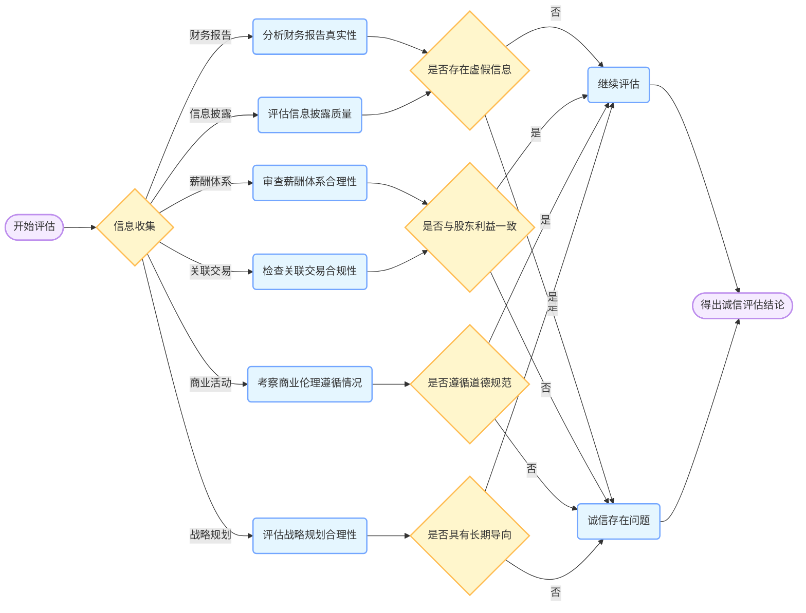

# 费雪的管理层诚信评估

> 关键词：费雪、管理层诚信评估、投资分析、企业管理、财务分析、定性评估、商业伦理

> 摘要：本文围绕费雪的管理层诚信评估展开深入探讨。首先介绍了评估的背景，包括目的、预期读者、文档结构和相关术语。接着阐述了核心概念及联系，构建了评估的理论框架。详细讲解了核心算法原理和具体操作步骤，通过 Python 代码进行示例。运用数学模型和公式对评估过程进行量化说明，并举例分析。通过项目实战展示了如何在实际中进行评估，包括开发环境搭建、源代码实现与解读。分析了评估在实际中的应用场景，推荐了学习、开发和研究的相关工具与资源。最后总结了未来发展趋势与挑战，解答了常见问题，并提供了扩展阅读和参考资料，旨在帮助投资者和企业管理者更全面、准确地评估管理层诚信，为投资决策和企业管理提供有力支持。

## 1. 背景介绍 
### 1.1 目的和范围
在投资领域，管理层的诚信水平对企业的长期发展和投资者的利益有着至关重要的影响。菲利普·费雪（Philip A. Fisher）作为投资界的传奇人物，提出了一系列评估企业的方法，其中管理层诚信评估是其重要组成部分。本文的目的在于深入剖析费雪的管理层诚信评估方法，详细介绍其原理、操作步骤以及在实际投资和企业管理中的应用。

范围涵盖了从理论层面的概念阐述到实际操作的案例分析，包括评估所需的核心算法、数学模型，以及相关的开发环境搭建和代码实现。同时，还会探讨该评估方法在不同行业和场景下的应用，为投资者、企业管理者和相关研究人员提供全面、系统的参考。

### 1.2 预期读者
本文的预期读者主要包括以下几类人群：
- **投资者**：无论是个人投资者还是机构投资者，都希望通过评估管理层诚信来筛选出更具投资价值的企业，降低投资风险，提高投资回报率。
- **企业管理者**：了解费雪的管理层诚信评估方法，有助于企业管理者审视自身管理团队的诚信状况，发现潜在问题并及时改进，提升企业的声誉和竞争力。
- **金融分析师**：为他们提供一种深入分析企业的新视角和方法，丰富其研究工具和评估体系。
- **学术研究人员**：作为研究企业管理、投资理论和商业伦理等领域的参考资料，推动相关学术研究的发展。

### 1.3 文档结构概述
本文将按照以下结构展开：
- **核心概念与联系**：介绍费雪管理层诚信评估的核心概念，分析各概念之间的关系，并通过文本示意图和 Mermaid 流程图进行直观展示。
- **核心算法原理 & 具体操作步骤**：详细讲解评估所涉及的核心算法原理，结合 Python 源代码阐述具体的操作步骤。
- **数学模型和公式 & 详细讲解 & 举例说明**：运用数学模型和公式对评估过程进行量化分析，并通过具体案例加深理解。
- **项目实战：代码实际案例和详细解释说明**：通过实际项目案例，展示如何搭建开发环境，实现评估代码，并对代码进行详细解读和分析。
- **实际应用场景**：探讨费雪的管理层诚信评估方法在不同行业和场景下的实际应用。
- **工具和资源推荐**：推荐学习、开发和研究相关的工具、资源和论文著作。
- **总结：未来发展趋势与挑战**：总结评估方法的发展趋势，分析面临的挑战。
- **附录：常见问题与解答**：解答读者在学习和应用过程中可能遇到的常见问题。
- **扩展阅读 & 参考资料**：提供进一步学习和研究的扩展阅读材料和参考资料。

### 1.4 术语表
#### 1.4.1 核心术语定义
- **管理层诚信**：指企业管理层在经营决策、信息披露、利益分配等方面遵循诚实、守信、公正的原则，不进行欺诈、隐瞒或不正当的行为。
- **费雪评估体系**：菲利普·费雪提出的一套评估企业的方法，包括对企业业务、管理层、财务状况等多个方面的综合评估。
- **定性评估**：基于非量化的信息和判断，对管理层诚信进行主观评价的方法。
- **定量评估**：运用数学模型和统计数据，对管理层诚信进行量化分析的方法。

#### 1.4.2 相关概念解释
- **商业伦理**：商业活动中应遵循的道德原则和规范，与管理层诚信密切相关，是评估管理层诚信的重要考量因素。
- **信息披露质量**：企业向投资者和社会公众披露信息的真实性、准确性、完整性和及时性，是反映管理层诚信的重要指标之一。
- **关联交易**：企业与其关联方之间的交易，若交易过程不透明、存在利益输送等问题，可能影响管理层诚信。

#### 1.4.3 缩略词列表
- **ROE**：Return on Equity，净资产收益率，用于衡量企业盈利能力和管理层运营效率的指标。
- **EPS**：Earnings Per Share，每股收益，反映企业每股普通股的盈利水平。

## 2. 核心概念与联系 

### 核心概念原理
费雪的管理层诚信评估基于对管理层行为和决策的多维度分析，旨在判断管理层是否以股东利益为导向，是否诚实、公正地经营企业。核心概念主要包括以下几个方面：

#### 诚实与透明
管理层应在信息披露、财务报告等方面保持诚实，不隐瞒重要信息，不进行虚假陈述。例如，准确及时地披露企业的财务状况、经营业绩、重大事项等，让投资者能够全面了解企业的真实情况。

#### 利益一致性
管理层的利益应与股东利益相一致，避免出现管理层为了自身利益而损害股东利益的情况。例如，合理的薪酬体系设计应与企业的长期业绩挂钩，激励管理层为股东创造价值。

#### 道德与伦理
管理层应遵循商业伦理和道德规范，在经营活动中不进行不正当竞争、欺诈、贿赂等行为。良好的道德品质是管理层诚信的重要基础。

#### 长期导向
管理层应具备长期战略眼光，注重企业的可持续发展，而不是追求短期利益。例如，在研发投入、市场拓展等方面进行长期规划，为企业的未来发展奠定基础。

### 架构的文本示意图
```plaintext
管理层诚信评估
|-- 诚实与透明
|   |-- 信息披露质量
|   |-- 财务报告真实性
|-- 利益一致性
|   |-- 薪酬体系合理性
|   |-- 关联交易合规性
|-- 道德与伦理
|   |-- 商业伦理遵循情况
|   |-- 法律合规性
|-- 长期导向
|   |-- 战略规划合理性
|   |-- 研发投入与创新
```

### Mermaid 流程图


该流程图展示了费雪管理层诚信评估的基本流程，从信息收集开始，对多个方面进行分析和判断，最终得出管理层诚信评估的结论。

## 3. 核心算法原理 & 具体操作步骤 

### 核心算法原理
费雪的管理层诚信评估并没有严格意义上的统一算法，更多的是一种综合分析的方法。但可以通过构建量化指标和权重体系来进行相对客观的评估。以下是一种简化的算法原理：

#### 指标选取
选取与管理层诚信相关的多个指标，如信息披露质量、财务报告真实性、薪酬体系合理性、关联交易合规性、商业伦理遵循情况、战略规划合理性等。

#### 指标量化
为每个指标设定量化标准，例如，信息披露质量可以根据披露的及时性、完整性、准确性等方面进行打分；财务报告真实性可以通过审计意见、财务指标的合理性等进行评估。

#### 权重分配
根据各指标对管理层诚信的重要程度，为每个指标分配相应的权重。例如，财务报告真实性的权重可能相对较高，而战略规划合理性的权重可以根据企业的行业特点和发展阶段进行调整。

#### 综合得分计算
将每个指标的得分乘以其对应的权重，然后求和得到管理层诚信的综合得分。综合得分越高，说明管理层的诚信水平越高。

### 具体操作步骤及 Python 源代码示例

```python
# 定义指标和权重
indicators = {
    "信息披露质量": 0.2,
    "财务报告真实性": 0.3,
    "薪酬体系合理性": 0.15,
    "关联交易合规性": 0.1,
    "商业伦理遵循情况": 0.15,
    "战略规划合理性": 0.1
}

# 模拟各指标的得分
scores = {
    "信息披露质量": 80,
    "财务报告真实性": 90,
    "薪酬体系合理性": 70,
    "关联交易合规性": 75,
    "商业伦理遵循情况": 85,
    "战略规划合理性": 78
}

# 计算综合得分
total_score = 0
for indicator, weight in indicators.items():
    score = scores[indicator]
    total_score += score * weight

# 输出结果
print(f"管理层诚信综合得分: {total_score}")
```

### 代码解释
1. **指标和权重定义**：使用字典 `indicators` 定义了各个评估指标及其对应的权重。
2. **指标得分模拟**：使用字典 `scores` 模拟了各指标的得分情况。在实际应用中，这些得分需要根据具体的评估标准进行计算。
3. **综合得分计算**：通过遍历指标和权重字典，将每个指标的得分乘以其对应的权重，并累加到 `total_score` 中。
4. **结果输出**：打印出管理层诚信的综合得分。

通过这种方式，可以对管理层诚信进行初步的量化评估。但需要注意的是，实际评估过程中需要更深入地收集和分析数据，以确保评估结果的准确性。

## 4. 数学模型和公式 & 详细讲解 & 举例说明 

### 数学模型和公式
设 $n$ 为评估指标的数量，$w_i$ 为第 $i$ 个指标的权重，满足 $\sum_{i=1}^{n} w_i = 1$，$s_i$ 为第 $i$ 个指标的得分，则管理层诚信的综合得分 $S$ 可以用以下公式表示：

$$S = \sum_{i=1}^{n} w_i \times s_i$$

### 详细讲解
该公式的核心思想是将各个评估指标的得分按照其重要程度进行加权求和，得到一个综合的得分来反映管理层的诚信水平。权重 $w_i$ 表示了第 $i$ 个指标在整体评估中的重要性，得分 $s_i$ 则是对该指标的具体量化评价。

### 举例说明
假设我们有三个评估指标：信息披露质量、财务报告真实性、薪酬体系合理性，其权重分别为 $w_1 = 0.3$，$w_2 = 0.5$，$w_3 = 0.2$，对应的得分分别为 $s_1 = 80$，$s_2 = 90$，$s_3 = 70$。

根据上述公式，管理层诚信的综合得分 $S$ 为：

$$
\begin{align*}
S &= w_1 \times s_1 + w_2 \times s_2 + w_3 \times s_3 \\
&= 0.3 \times 80 + 0.5 \times 90 + 0.2 \times 70 \\
&= 24 + 45 + 14 \\
&= 83
\end{align*}
$$

这意味着该管理层的诚信综合得分为 83 分，根据设定的评分标准，可以判断该管理层的诚信水平较高。

在实际应用中，评估指标的数量和权重可以根据具体情况进行调整，指标得分的计算也需要结合详细的评估标准和数据收集。例如，信息披露质量的得分可以根据披露的及时性、完整性、准确性等多个子指标进行综合计算。

## 5. 项目实战：代码实际案例和详细解释说明 

### 5.1  开发环境搭建
为了实现费雪的管理层诚信评估项目，我们可以使用 Python 作为开发语言，并结合一些常用的数据分析库。以下是搭建开发环境的详细步骤：

#### 安装 Python
首先，确保你已经安装了 Python。可以从 [Python 官方网站](https://www.python.org/downloads/) 下载适合你操作系统的 Python 版本，建议选择 Python 3.7 及以上版本。

#### 安装虚拟环境（可选但推荐）
使用虚拟环境可以隔离项目的依赖，避免不同项目之间的冲突。可以使用 `venv` 模块创建虚拟环境：

```bash
python -m venv management_integrity_env
```

激活虚拟环境：
- **Windows**：
```bash
management_integrity_env\Scripts\activate
```
- **Linux/MacOS**：
```bash
source management_integrity_env/bin/activate
```

#### 安装必要的库
在虚拟环境中，使用 `pip` 安装所需的库，如 `pandas` 用于数据处理，`numpy` 用于数值计算：

```bash
pip install pandas numpy
```

### 5.2  源代码详细实现和代码解读
以下是一个更完整的 Python 代码示例，用于实现管理层诚信评估：

```python
import pandas as pd
import numpy as np

# 定义指标和权重
indicators = {
    "信息披露质量": 0.2,
    "财务报告真实性": 0.3,
    "薪酬体系合理性": 0.15,
    "关联交易合规性": 0.1,
    "商业伦理遵循情况": 0.15,
    "战略规划合理性": 0.1
}

# 模拟数据，假设从 CSV 文件中读取各企业的指标得分
data = {
    "企业名称": ["企业 A", "企业 B", "企业 C"],
    "信息披露质量": [80, 75, 85],
    "财务报告真实性": [90, 80, 88],
    "薪酬体系合理性": [70, 72, 78],
    "关联交易合规性": [75, 70, 82],
    "商业伦理遵循情况": [85, 82, 90],
    "战略规划合理性": [78, 75, 80]
}

df = pd.DataFrame(data)

# 计算综合得分
def calculate_integrity_score(row):
    total_score = 0
    for indicator, weight in indicators.items():
        score = row[indicator]
        total_score += score * weight
    return total_score

df["管理层诚信综合得分"] = df.apply(calculate_integrity_score, axis=1)

# 输出结果
print(df[["企业名称", "管理层诚信综合得分"]])
```

### 代码解读
1. **导入必要的库**：导入 `pandas` 和 `numpy` 库，用于数据处理和数值计算。
2. **定义指标和权重**：使用字典 `indicators` 定义了各个评估指标及其对应的权重。
3. **模拟数据**：使用字典 `data` 模拟了三家企业的各指标得分，并将其转换为 `pandas` 的 `DataFrame` 对象 `df`。在实际应用中，可以从 CSV 文件、数据库等数据源中读取数据。
4. **定义计算综合得分的函数**：`calculate_integrity_score` 函数接受一行数据作为输入，根据公式计算该行对应的企业的管理层诚信综合得分。
5. **应用函数计算综合得分**：使用 `df.apply` 方法将 `calculate_integrity_score` 函数应用到 `df` 的每一行，计算出每家企业的管理层诚信综合得分，并将结果存储在新的列 `管理层诚信综合得分` 中。
6. **输出结果**：打印出每家企业的名称和管理层诚信综合得分。

### 5.3  代码解读与分析
通过上述代码，我们可以对多家企业的管理层诚信进行评估和比较。代码的优点在于：
- **灵活性**：可以方便地调整评估指标和权重，以适应不同的评估需求。
- **可扩展性**：可以很容易地添加更多的指标和数据处理步骤，如数据清洗、异常值处理等。
- **可视化**：结合 `pandas` 和其他可视化库（如 `matplotlib`、`seaborn`），可以将评估结果进行可视化展示，更直观地呈现管理层诚信的分布情况。

然而，代码也存在一些局限性：
- **数据质量依赖**：评估结果的准确性高度依赖于输入数据的质量。如果数据存在误差或缺失，可能会影响评估结果的可靠性。
- **主观因素**：指标的选取和权重的分配仍然存在一定的主观因素，需要根据具体情况进行合理调整。

在实际应用中，需要进一步优化数据收集和处理方法，结合更多的定性分析和专业判断，以提高评估的准确性和可靠性。

## 6. 实际应用场景 
费雪的管理层诚信评估方法在多个实际场景中具有重要的应用价值：

### 投资决策
投资者在选择投资标的时，管理层诚信是一个关键的考量因素。通过评估管理层的诚信水平，投资者可以筛选出那些更值得信赖的企业，降低投资风险。例如，一家管理层诚信度高的企业更有可能如实披露财务信息，合理规划企业发展战略，为股东创造长期价值。投资者可以将管理层诚信评估结果与其他财务指标和行业分析相结合，做出更明智的投资决策。

### 企业并购与重组
在企业并购和重组过程中，了解目标企业管理层的诚信状况至关重要。如果目标企业存在管理层诚信问题，可能会给并购方带来潜在的法律风险、财务风险和声誉风险。通过对目标企业管理层进行诚信评估，并购方可以提前发现问题，采取相应的措施进行防范和应对，如调整并购价格、增加尽职调查的深度等。

### 企业内部管理
企业自身也可以运用费雪的管理层诚信评估方法来审视和改进内部管理。通过定期评估管理层的诚信水平，企业可以发现管理团队在信息披露、利益分配、商业伦理等方面存在的问题，并及时进行纠正和改进。这有助于提升企业的整体管理水平，增强员工的信任和忠诚度，促进企业的可持续发展。

### 金融监管
金融监管机构可以将管理层诚信评估作为监管的重要内容之一。对于诚信度较低的企业，监管机构可以加强监管力度，要求其进行整改，提高信息披露质量，规范经营行为。这有助于维护金融市场的稳定和公平，保护投资者的合法权益。

### 行业研究与分析
行业研究机构和分析师可以运用管理层诚信评估方法对不同企业进行比较和分析，了解行业内管理层诚信的整体状况和差异。这有助于发现行业内的优秀企业和潜在问题，为行业发展提供参考和建议。

## 7. 工具和资源推荐
### 7.1 学习资源推荐
#### 7.1.1 书籍推荐
- 《怎样选择成长股》（*Common Stocks and Uncommon Profits*）：菲利普·费雪的经典著作，详细介绍了他的投资理念和评估企业的方法，包括对管理层的评估。
- 《聪明的投资者》（*The Intelligent Investor*）：本杰明·格雷厄姆（Benjamin Graham）的著作，虽然主要侧重于价值投资，但也强调了管理层诚信在投资决策中的重要性。
- 《财务报表分析与证券定价》（*Financial Statement Analysis and Security Valuation*）：帮助读者深入理解财务报表，掌握通过财务数据评估管理层诚信的方法。

#### 7.1.2 在线课程
- Coursera 上的“投资学原理”（*Principles of Investing*）：涵盖了投资的基本概念和方法，包括对企业管理层的评估。
- edX 上的“财务报表分析”（*Financial Statement Analysis*）：深入讲解财务报表的分析方法，有助于提高对管理层诚信的判断能力。

#### 7.1.3 技术博客和网站
- Seeking Alpha：提供专业的投资分析和研究报告，包括对企业管理层的评价和分析。
- 雪球网：国内知名的投资交流平台，投资者可以在上面分享对企业管理层诚信的看法和经验。

### 7.2 开发工具框架推荐
#### 7.2.1 IDE和编辑器
- PyCharm：一款功能强大的 Python 集成开发环境，提供代码编辑、调试、版本控制等功能，适合开发管理层诚信评估项目。
- Jupyter Notebook：交互式的开发环境，方便进行数据探索、分析和可视化，适合快速验证算法和展示评估结果。

#### 7.2.2 调试和性能分析工具
- PDB：Python 内置的调试器，可以帮助开发者定位和解决代码中的问题。
- cProfile：Python 标准库中的性能分析工具，用于分析代码的运行时间和性能瓶颈。

#### 7.2.3 相关框架和库
- Pandas：用于数据处理和分析，提供了丰富的数据结构和函数，方便对评估数据进行清洗、转换和计算。
- Numpy：用于数值计算，提供了高效的数组操作和数学函数，是进行量化评估的基础库。
- Scikit-learn：机器学习库，可用于构建更复杂的评估模型，如分类模型、聚类模型等。

### 7.3 相关论文著作推荐
#### 7.3.1 经典论文
- Jensen, M. C., & Meckling, W. H. (1976). *Theory of the firm: Managerial behavior, agency costs and ownership structure*. Journal of Financial Economics, 3(4), 305-360. 该论文提出了代理理论，探讨了管理层与股东之间的利益冲突和代理成本问题，对理解管理层诚信的重要性具有重要意义。
- Fama, E. F., & Jensen, M. C. (1983). *Separation of ownership and control*. Journal of Law and Economics, 26(2), 301-325. 研究了所有权和控制权分离对企业治理和管理层行为的影响。

#### 7.3.2 最新研究成果
可以通过学术数据库（如 Google Scholar、Web of Science、EBSCOhost 等）搜索关于管理层诚信评估的最新研究论文，了解该领域的前沿动态和研究方法。

#### 7.3.3 应用案例分析
一些商业杂志（如《哈佛商业评论》、《财经》等）会刊登企业管理层诚信方面的案例分析，通过实际案例可以更好地理解管理层诚信评估在实际中的应用和挑战。

## 8. 总结：未来发展趋势与挑战
### 未来发展趋势
#### 多维度数据融合
随着信息技术的发展，可用于评估管理层诚信的数据来源将越来越广泛，除了传统的财务数据和公开信息外，还将包括社交媒体数据、网络舆情数据、供应链数据等。通过融合多维度的数据，可以更全面、准确地评估管理层诚信。

#### 人工智能与机器学习的应用
人工智能和机器学习技术将在管理层诚信评估中发挥越来越重要的作用。例如，利用自然语言处理技术分析企业公告和新闻报道，挖掘潜在的诚信问题；使用机器学习算法构建更精准的评估模型，提高评估的自动化和智能化水平。

#### 行业标准和规范的完善
随着管理层诚信评估的重要性日益凸显，行业内可能会逐渐形成统一的评估标准和规范。这将有助于提高评估结果的可比性和可信度，促进评估方法的广泛应用。

#### 国际化合作与交流
在全球化的背景下，企业的跨国经营和投资活动日益频繁，管理层诚信评估也需要进行国际化的合作与交流。不同国家和地区可以分享评估经验和方法，共同应对管理层诚信问题带来的挑战。

### 挑战
#### 数据质量和真实性
虽然数据来源越来越丰富，但数据质量和真实性仍然是一个挑战。虚假数据、不完整数据和数据偏差可能会导致评估结果的不准确。因此，需要建立有效的数据验证和清洗机制，确保数据的可靠性。

#### 主观因素的影响
管理层诚信评估在一定程度上仍然依赖于主观判断，如指标的选取、权重的分配等。不同的评估者可能会得出不同的结果，这增加了评估的不确定性。如何减少主观因素的影响，提高评估的客观性和公正性是一个亟待解决的问题。

#### 法律法规和监管环境的差异
不同国家和地区的法律法规和监管环境存在差异，这给跨国企业的管理层诚信评估带来了挑战。评估方法需要考虑到这些差异，确保评估结果符合当地的法律和监管要求。

#### 技术应用的复杂性
人工智能和机器学习技术的应用需要具备一定的技术能力和专业知识。企业和评估机构需要培养相关的技术人才，以应对技术应用过程中的复杂性和挑战。

## 9. 附录：常见问题与解答
### 问题 1：如何确定评估指标的权重？
评估指标的权重确定需要综合考虑多个因素，包括指标对管理层诚信的重要程度、数据的可获取性和可靠性等。可以采用专家意见法、层次分析法等方法来确定权重。专家意见法是邀请行业专家根据经验和专业知识对各指标的重要性进行打分，然后取平均值作为权重。层次分析法是一种系统的决策分析方法，通过建立层次结构模型，比较各指标之间的相对重要性，从而确定权重。

### 问题 2：评估结果的准确性如何保证？
为了保证评估结果的准确性，需要从以下几个方面入手：
- **数据质量**：确保收集到的数据真实、准确、完整。可以通过多渠道验证数据，进行数据清洗和预处理，去除异常值和错误数据。
- **评估方法**：选择合适的评估方法和模型，结合定性分析和定量分析，综合考虑多个因素。
- **专业判断**：评估过程中需要结合专业知识和经验进行判断，尤其是对于一些难以量化的指标，如商业伦理遵循情况。
- **定期评估**：定期对管理层诚信进行评估，及时发现和反映管理层行为的变化。

### 问题 3：管理层诚信评估与企业财务状况评估有什么关系？
管理层诚信评估与企业财务状况评估密切相关。管理层的诚信水平会直接影响企业的财务报告真实性和信息披露质量，进而影响对企业财务状况的评估。如果管理层存在诚信问题，可能会进行财务造假、隐瞒债务等行为，导致财务报表不能真实反映企业的财务状况。因此，在进行企业财务状况评估时，需要考虑管理层诚信因素；同时，管理层诚信评估也可以通过分析财务数据来发现潜在的问题。

### 问题 4：评估结果可以直接用于投资决策吗？
评估结果不能直接用于投资决策，而应该作为投资决策的重要参考因素之一。管理层诚信评估只是从一个方面对企业进行评估，投资决策还需要考虑企业的行业前景、市场竞争力、财务状况、估值水平等多个因素。此外，评估结果也存在一定的不确定性，需要结合其他信息进行综合分析和判断。

## 10. 扩展阅读 & 参考资料
### 扩展阅读
- 《从优秀到卓越》（*Good to Great*）：探讨了企业如何从优秀走向卓越，其中涉及到管理层的领导力和诚信对企业发展的重要影响。
- 《基业长青》（*Built to Last*）：研究了具有长期竞争优势的企业的成功因素，包括管理层的价值观和诚信文化。

### 参考资料
- Fisher, P. A. (1958). *Common Stocks and Uncommon Profits*. Harper & Brothers.
- Graham, B., & Dodd, D. L. (1934). *Security Analysis*. McGraw-Hill.
- Koller, T., Goedhart, M., & Wessels, D. (2015). *Valuation: Measuring and Managing the Value of Companies*. John Wiley & Sons.

作者：AI天才研究院/AI Genius Institute & 禅与计算机程序设计艺术 /Zen And The Art of Computer Programming