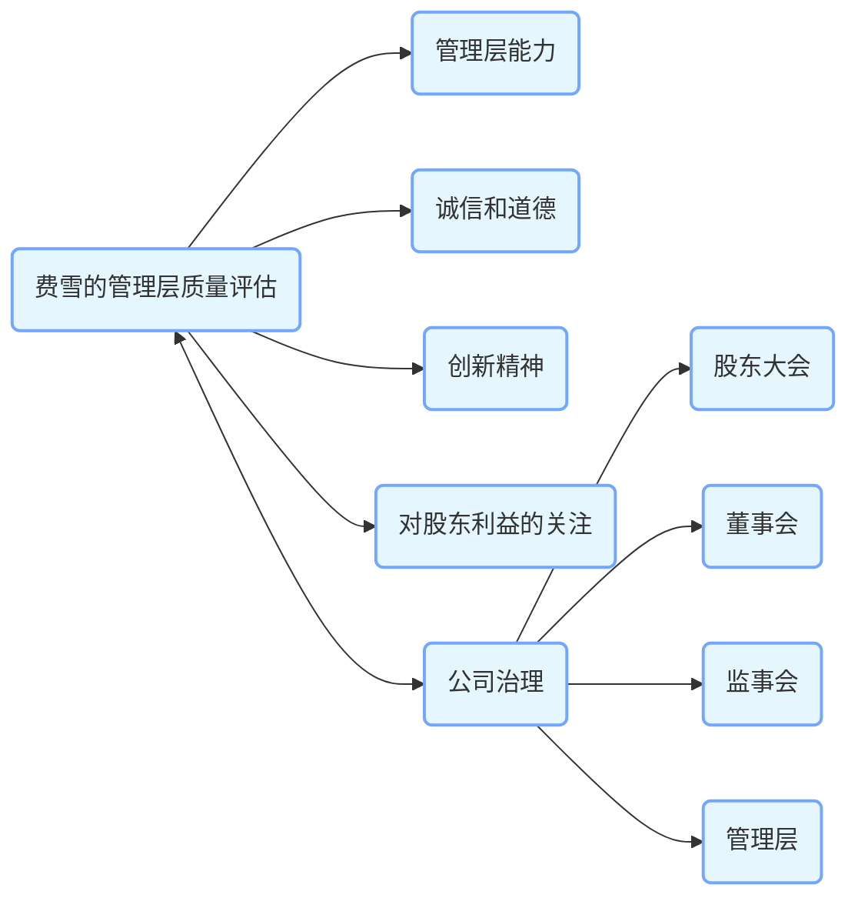

# 费雪的管理层质量评估：公司治理在投资决策中的作用

> 关键词：费雪管理层质量评估、公司治理、投资决策、管理层能力、股东利益

> 摘要：本文深入探讨了费雪的管理层质量评估方法以及公司治理在投资决策中的重要作用。通过对核心概念的剖析、算法原理的阐述、数学模型的建立、项目实战案例的分析等，详细介绍了如何评估管理层质量以及公司治理对投资决策的影响。同时，提供了相关的工具和资源推荐，总结了未来发展趋势与挑战，并对常见问题进行了解答，旨在为投资者在投资决策过程中提供全面而深入的参考。

## 1. 背景介绍 
### 1.1 目的和范围
本文章的目的在于深入研究费雪的管理层质量评估体系，并探讨公司治理在投资决策中所起到的关键作用。范围涵盖了从核心概念的解析、评估方法的原理阐述、实际案例的分析，到相关工具资源的推荐以及未来发展趋势的展望等多个方面，旨在为投资者提供一个全面、系统的视角，帮助他们在投资决策过程中更加科学、合理地考虑管理层质量和公司治理因素。

### 1.2 预期读者
本文的预期读者主要包括专业投资者、金融分析师、投资顾问、企业管理人员以及对投资决策和公司治理感兴趣的学者和研究人员。无论是希望提升投资分析能力的专业人士，还是想要深入了解企业管理与投资关系的爱好者，都能从本文中获取有价值的信息。

### 1.3 文档结构概述
本文将按照以下结构展开：首先介绍相关的核心概念，明确费雪的管理层质量评估和公司治理的内涵以及它们之间的联系；接着阐述核心算法原理和具体操作步骤，包括如何运用相关指标进行评估；然后建立数学模型和公式，并通过具体例子进行详细讲解；之后通过项目实战案例展示如何在实际中应用这些评估方法；再介绍实际应用场景，说明这些方法在不同投资情境下的作用；接着推荐相关的工具和资源，为读者进一步学习和实践提供支持；最后总结未来发展趋势与挑战，解答常见问题，并提供扩展阅读和参考资料。

### 1.4 术语表
#### 1.4.1 核心术语定义
- **费雪的管理层质量评估**：是由投资大师菲利普·费雪提出的一套评估企业管理层质量的方法，主要从管理层的能力、诚信、创新精神、对股东利益的关注等多个维度对管理层进行综合评价。
- **公司治理**：是指通过一套包括正式或非正式的、内部或外部的制度或机制来协调公司与所有利益相关者之间的利益关系，以保证公司决策的科学性与公正性，从而最终维护公司各方面的利益。
- **投资决策**：是指投资者为了实现其预期的投资目标，运用一定的科学理论、方法和手段，通过一定的程序对投资的必要性、投资目标、投资规模、投资方向、投资结构、投资成本与收益等经济活动中重大问题所进行的分析、判断和方案选择。

#### 1.4.2 相关概念解释
- **管理层能力**：包括战略规划能力、组织协调能力、市场洞察能力、风险管理能力等，是管理层有效领导企业实现目标的综合能力体现。
- **股东利益**：是指股东在公司中享有的经济利益和权利，如股息分配、股权增值、参与公司决策等。
- **利益相关者**：是指与公司存在利益关系的个人或组织，包括股东、债权人、员工、供应商、客户、社区等。

#### 1.4.3 缩略词列表
本文中未涉及缩略词。

## 2. 核心概念与联系 

### 费雪的管理层质量评估核心概念
费雪认为，优秀的管理层是企业成功的关键因素之一。他强调从多个方面评估管理层的质量，包括：
- **管理层的能力**：管理层需要具备卓越的战略眼光，能够准确把握市场趋势，制定合理的企业发展战略。例如，苹果公司的乔布斯，他以敏锐的市场洞察力和创新能力，带领苹果推出了一系列具有划时代意义的产品，使苹果成为全球最有价值的公司之一。
- **诚信和道德**：管理层应秉持诚实、守信的原则，遵守法律法规和商业道德。诚信的管理层能够赢得投资者、员工和客户的信任，为企业的长期发展奠定坚实基础。
- **创新精神**：在快速变化的市场环境中，管理层需要鼓励创新，推动企业不断推出新产品、新服务和新的商业模式。例如，特斯拉的马斯克，他以创新的电动汽车技术和可持续能源理念，颠覆了传统汽车行业。
- **对股东利益的关注**：管理层应将股东利益放在重要位置，合理分配利润，提高股东回报率。例如，巴菲特旗下的伯克希尔·哈撒韦公司，管理层始终致力于为股东创造长期价值。

### 公司治理核心概念
公司治理是一种制度安排，旨在协调公司各利益相关者之间的关系，确保公司决策的科学性和公正性。其核心要素包括：
- **股东大会**：是公司的最高权力机构，股东通过股东大会行使表决权，决定公司的重大事项。
- **董事会**：负责公司的战略决策和监督管理层的工作。董事会成员应具备丰富的专业知识和经验，能够独立、客观地做出决策。
- **监事会**：对公司的财务和经营活动进行监督，确保公司合规运营。
- **管理层**：负责公司的日常经营管理，执行董事会的决策。

### 两者之间的联系
费雪的管理层质量评估与公司治理密切相关。良好的公司治理结构有助于选拔和监督优秀的管理层，确保管理层的行为符合股东利益和公司的长远发展。而优秀的管理层能够更好地执行公司治理的各项制度和决策，推动公司的发展。例如，在一个完善的公司治理结构中，董事会能够对管理层进行有效的监督和激励，促使管理层提高自身素质和能力，为股东创造更大的价值。

### 文本示意图
```plaintext
费雪的管理层质量评估
|-- 管理层能力
|   |-- 战略规划能力
|   |-- 组织协调能力
|   |-- 市场洞察能力
|   |-- 风险管理能力
|-- 诚信和道德
|-- 创新精神
|-- 对股东利益的关注

公司治理
|-- 股东大会
|-- 董事会
|-- 监事会
|-- 管理层

两者联系
费雪的管理层质量评估 <-- 相互影响 --> 公司治理
```

### Mermaid 流程图


## 3. 核心算法原理 & 具体操作步骤 

### 核心算法原理
我们可以通过构建一个综合评估模型来对管理层质量和公司治理进行评估。该模型可以采用加权平均的方法，将各个评估指标进行量化，并赋予不同的权重，最后计算出综合得分。具体公式如下：

$$S = \sum_{i=1}^{n} w_i \times x_i$$

其中，$S$ 表示综合得分，$w_i$ 表示第 $i$ 个指标的权重，$x_i$ 表示第 $i$ 个指标的得分，$n$ 表示指标的数量。

### 具体操作步骤

#### 步骤 1：确定评估指标
根据费雪的管理层质量评估和公司治理的核心概念，我们可以确定以下评估指标：
- **管理层能力指标**：包括战略规划能力、组织协调能力、市场洞察能力、风险管理能力等。
- **诚信和道德指标**：可以通过管理层的过往行为记录、是否存在违规违法行为等进行评估。
- **创新精神指标**：可以从企业的研发投入、新产品推出速度、专利数量等方面进行衡量。
- **对股东利益的关注指标**：可以通过股息分配率、股东回报率等指标进行评估。
- **公司治理结构指标**：包括股东大会的有效性、董事会的独立性、监事会的监督作用等。

#### 步骤 2：确定指标权重
根据各个指标的重要性，我们可以为每个指标赋予相应的权重。例如，管理层能力指标的权重可以设置为 0.3，诚信和道德指标的权重可以设置为 0.2，创新精神指标的权重可以设置为 0.2，对股东利益的关注指标的权重可以设置为 0.2，公司治理结构指标的权重可以设置为 0.1。

#### 步骤 3：指标量化
对于每个评估指标，我们需要将其进行量化。例如，对于战略规划能力指标，可以根据企业的战略规划是否明确、是否具有前瞻性等进行打分，满分可以设置为 10 分。

#### 步骤 4：计算综合得分
根据上述公式，将各个指标的得分乘以相应的权重，然后相加，得到综合得分。

### Python 源代码实现
```python
# 定义评估指标和权重
indicators = ['管理层能力', '诚信和道德', '创新精神', '对股东利益的关注', '公司治理结构']
weights = [0.3, 0.2, 0.2, 0.2, 0.1]

# 定义指标得分
scores = [8, 7, 6, 7, 8]

# 计算综合得分
def calculate_score(weights, scores):
    total_score = 0
    for i in range(len(weights)):
        total_score += weights[i] * scores[i]
    return total_score

# 调用函数计算综合得分
score = calculate_score(weights, scores)
print(f"综合得分: {score}")
```

## 4. 数学模型和公式 & 详细讲解 & 举例说明 

### 数学模型和公式
如前文所述，我们采用加权平均的数学模型来计算综合得分：

$$S = \sum_{i=1}^{n} w_i \times x_i$$

其中，$S$ 表示综合得分，$w_i$ 表示第 $i$ 个指标的权重，$x_i$ 表示第 $i$ 个指标的得分，$n$ 表示指标的数量。

### 详细讲解
这个数学模型的核心思想是将各个评估指标的得分按照其重要性进行加权求和，得到一个综合的评估结果。权重 $w_i$ 反映了每个指标在整体评估中的相对重要性，得分 $x_i$ 则是对每个指标的具体量化评价。通过这种方式，我们可以综合考虑多个因素，更加全面、客观地评估管理层质量和公司治理水平。

### 举例说明
假设我们要评估一家公司的管理层质量和公司治理水平，根据上述确定的评估指标和权重，我们对该公司的各个指标进行打分：
| 评估指标 | 得分 | 权重 |
| --- | --- | --- |
| 管理层能力 | 8 | 0.3 |
| 诚信和道德 | 7 | 0.2 |
| 创新精神 | 6 | 0.2 |
| 对股东利益的关注 | 7 | 0.2 |
| 公司治理结构 | 8 | 0.1 |

根据公式计算综合得分：

$$S = 0.3 \times 8 + 0.2 \times 7 + 0.2 \times 6 + 0.2 \times 7 + 0.1 \times 8$$

$$S = 2.4 + 1.4 + 1.2 + 1.4 + 0.8$$

$$S = 7.2$$

这意味着该公司的管理层质量和公司治理水平的综合得分为 7.2 分。我们可以根据这个得分对该公司进行进一步的分析和比较，例如与同行业其他公司的得分进行对比，判断该公司在管理层质量和公司治理方面的优势和不足。

## 5. 项目实战：代码实际案例和详细解释说明 

### 5.1 开发环境搭建
为了实现上述评估模型，我们需要搭建一个 Python 开发环境。具体步骤如下：
1. **安装 Python**：从 Python 官方网站（https://www.python.org/downloads/）下载并安装适合你操作系统的 Python 版本。建议安装 Python 3.7 及以上版本。
2. **安装开发工具**：可以选择安装 PyCharm、Visual Studio Code 等集成开发环境（IDE），也可以使用 Jupyter Notebook 进行代码编写和调试。这里我们以 PyCharm 为例，从 JetBrains 官方网站（https://www.jetbrains.com/pycharm/download/）下载并安装 PyCharm 社区版。
3. **创建项目**：打开 PyCharm，选择“Create New Project”，创建一个新的 Python 项目。

### 5.2 源代码详细实现和代码解读
以下是一个完整的 Python 代码示例，用于实现管理层质量和公司治理的评估：

```python
# 定义评估指标和权重
indicators = ['管理层能力', '诚信和道德', '创新精神', '对股东利益的关注', '公司治理结构']
weights = [0.3, 0.2, 0.2, 0.2, 0.1]

# 定义函数获取用户输入的指标得分
def get_scores(indicators):
    scores = []
    for indicator in indicators:
        while True:
            try:
                score = float(input(f"请输入 {indicator} 的得分 (0-10): "))
                if 0 <= score <= 10:
                    scores.append(score)
                    break
                else:
                    print("得分必须在 0 到 10 之间，请重新输入。")
            except ValueError:
                print("输入无效，请输入一个有效的数字。")
    return scores

# 定义函数计算综合得分
def calculate_score(weights, scores):
    total_score = 0
    for i in range(len(weights)):
        total_score += weights[i] * scores[i]
    return total_score

# 主程序
if __name__ == "__main__":
    # 获取用户输入的指标得分
    scores = get_scores(indicators)
    
    # 计算综合得分
    score = calculate_score(weights, scores)
    
    # 输出结果
    print(f"\n各指标得分:")
    for i in range(len(indicators)):
        print(f"{indicators[i]}: {scores[i]}")
    print(f"\n综合得分: {score}")
```

### 代码解读与分析
1. **定义评估指标和权重**：通过 `indicators` 列表定义了评估指标，通过 `weights` 列表定义了相应的权重。
2. **获取用户输入的指标得分**：`get_scores` 函数用于获取用户输入的每个指标的得分，并进行有效性检查，确保得分在 0 到 10 之间。
3. **计算综合得分**：`calculate_score` 函数根据加权平均公式计算综合得分。
4. **主程序**：在主程序中，首先调用 `get_scores` 函数获取用户输入的得分，然后调用 `calculate_score` 函数计算综合得分，最后输出各指标得分和综合得分。

通过这个代码示例，我们可以方便地对不同公司的管理层质量和公司治理水平进行评估，为投资决策提供参考。

## 6. 实际应用场景 
### 股票投资决策
在股票投资中，投资者可以运用费雪的管理层质量评估和公司治理分析方法，对目标公司进行深入研究。通过评估管理层的能力、诚信、创新精神以及公司的治理结构，投资者可以判断公司的长期发展潜力和稳定性。例如，如果一家公司的管理层具有卓越的战略眼光和创新能力，并且公司治理结构完善，那么该公司在未来可能具有较高的盈利能力和市场竞争力，投资者可以考虑将其纳入投资组合。

### 私募股权投资
私募股权投资机构在选择投资项目时，也非常注重管理层质量和公司治理。优秀的管理层能够带领企业实现快速发展，而良好的公司治理可以保障投资者的权益。在投资前，私募股权投资机构会对目标企业的管理层进行全面评估，包括其过往业绩、团队协作能力等。同时，也会关注公司的治理结构，如董事会的独立性、监事会的监督作用等。只有当管理层质量和公司治理都达到一定标准时，私募股权投资机构才会考虑投资。

### 企业并购
在企业并购过程中，收购方需要对被收购方的管理层质量和公司治理进行评估。如果被收购方的管理层能力较强，并且公司治理良好，那么收购后可以实现资源的有效整合，提高企业的整体竞争力。相反，如果被收购方的管理层存在问题，或者公司治理结构不完善，那么收购后可能会面临诸多挑战，甚至导致并购失败。因此，对管理层质量和公司治理的评估是企业并购决策的重要依据之一。

### 风险投资
风险投资机构通常投资于初创企业，这些企业的发展前景很大程度上取决于管理层的质量。风险投资机构会关注初创企业管理层的创新精神、执行力和团队建设能力等。同时，也会要求初创企业建立完善的公司治理结构，以保障投资者的利益。通过对管理层质量和公司治理的评估，风险投资机构可以筛选出具有潜力的初创企业进行投资。

## 7. 工具和资源推荐
### 7.1 学习资源推荐
#### 7.1.1 书籍推荐
- 《怎样选择成长股》（菲利普·费雪著）：本书是费雪的经典著作，详细阐述了他的投资理念和选股方法，其中包括对管理层质量的评估。
- 《公司治理》（科林·梅耶著）：全面介绍了公司治理的理论和实践，对理解公司治理的核心概念和重要性具有重要意义。
- 《聪明的投资者》（本杰明·格雷厄姆著）：虽然主要侧重于价值投资，但也涉及到了对管理层质量和公司治理的讨论，是投资者的必读经典之一。

#### 7.1.2 在线课程
- Coursera 上的“投资学原理”课程：该课程涵盖了投资决策的各个方面，包括对企业基本面的分析，其中会涉及到管理层质量和公司治理的内容。
- edX 上的“公司治理与领导力”课程：专门针对公司治理和管理层领导力进行深入讲解，通过案例分析和实践项目，帮助学习者掌握相关知识和技能。

#### 7.1.3 技术博客和网站
- 雪球网：是一个投资者交流的社区，上面有很多关于企业分析和投资决策的文章，其中不乏对管理层质量和公司治理的讨论。
- 价值投资网：专注于价值投资领域，提供了大量关于企业基本面分析的资料和研究报告，对投资者了解管理层质量和公司治理具有参考价值。

### 7.2 开发工具框架推荐
#### 7.2.1 IDE和编辑器
- PyCharm：是一款专业的 Python 集成开发环境，具有强大的代码编辑、调试和项目管理功能，适合开发各种 Python 应用程序。
- Visual Studio Code：是一款轻量级的代码编辑器，支持多种编程语言，并且有丰富的插件扩展功能，可以方便地进行 Python 开发。

#### 7.2.2 调试和性能分析工具
- Py-Spy：是一个用于分析 Python 程序性能的工具，可以帮助开发者找出程序中的性能瓶颈。
- PDB：是 Python 自带的调试器，可以方便地对 Python 代码进行调试和排错。

#### 7.2.3 相关框架和库
- Pandas：是一个用于数据处理和分析的 Python 库，可以方便地对评估数据进行处理和分析。
- Numpy：是一个用于科学计算的 Python 库，提供了高效的数组操作和数学函数，在计算综合得分等方面具有重要作用。

### 7.3 相关论文著作推荐
#### 7.3.1 经典论文
- “Agency Costs of Free Cash Flow, Corporate Finance, and Takeovers”（Michael C. Jensen 著）：该论文探讨了公司治理中的代理问题和自由现金流的成本，对理解公司治理的经济原理具有重要意义。
- “Separation of Ownership and Control”（Adolf A. Berle 和 Gardiner C. Means 著）：首次提出了所有权和控制权分离的概念，为公司治理理论的发展奠定了基础。

#### 7.3.2 最新研究成果
- 可以关注《Journal of Financial Economics》《Review of Financial Studies》等金融领域的顶级学术期刊，上面会发表关于管理层质量评估和公司治理的最新研究成果。

#### 7.3.3 应用案例分析
- 《哈佛商业评论》上经常会刊登一些企业管理和投资决策的案例分析，其中包括对管理层质量和公司治理的案例研究，可以从中学习到实际应用中的经验和方法。

## 8. 总结：未来发展趋势与挑战
### 未来发展趋势
- **数字化转型对管理层能力的要求提高**：随着科技的快速发展，企业面临着数字化转型的压力。未来，管理层需要具备更强的数字化素养和创新能力，能够运用大数据、人工智能等技术推动企业的发展。
- **公司治理的国际化和标准化**：随着全球经济一体化的发展，公司治理的国际化和标准化趋势将越来越明显。企业需要遵循国际通行的公司治理准则，提高自身的治理水平，以增强在国际市场上的竞争力。
- **社会责任意识的增强**：未来，投资者将更加关注企业的社会责任表现，包括环境保护、员工福利、社区发展等方面。管理层需要将社会责任纳入企业的战略规划中，实现经济效益和社会效益的双赢。

### 挑战
- **管理层评估的主观性**：费雪的管理层质量评估方法在一定程度上依赖于主观判断，不同的评估者可能会得出不同的结论。如何减少评估的主观性，提高评估的准确性和客观性，是未来需要解决的问题之一。
- **公司治理的复杂性**：随着企业规模的扩大和业务的多元化，公司治理的复杂性也在增加。如何建立有效的公司治理机制，协调各利益相关者之间的关系，是企业面临的一大挑战。
- **市场环境的不确定性**：市场环境的不确定性给投资决策带来了很大的困难。管理层需要具备更强的风险管理能力，能够应对各种突发情况，保障企业的稳定发展。

## 9. 附录：常见问题与解答
### 问题 1：如何确定评估指标的权重？
答：确定评估指标的权重可以采用多种方法，如专家打分法、层次分析法等。专家打分法是邀请相关领域的专家对各个指标的重要性进行打分，然后取平均值作为权重。层次分析法是一种系统的决策分析方法，通过构建层次结构模型，比较各指标之间的相对重要性，从而确定权重。

### 问题 2：评估指标的得分如何确定？
答：评估指标的得分可以根据具体情况采用不同的方法确定。对于一些可以量化的指标，如股息分配率、股东回报率等，可以直接根据实际数据进行计算得分。对于一些难以量化的指标，如管理层的诚信和道德、创新精神等，可以采用问卷调查、专家评估等方法进行打分。

### 问题 3：公司治理和管理层质量对企业的业绩有多大影响？
答：公司治理和管理层质量对企业的业绩有着重要的影响。良好的公司治理可以保障企业决策的科学性和公正性，提高企业的运营效率和风险管理能力。优秀的管理层能够制定合理的战略规划，带领企业实现快速发展。大量的研究表明，公司治理和管理层质量较好的企业，其业绩通常也比较优秀。

### 问题 4：如何提高企业的管理层质量和公司治理水平？
答：提高企业的管理层质量可以从以下几个方面入手：加强管理层的培训和学习，提高其专业素养和管理能力；建立有效的激励机制，激发管理层的积极性和创造力；加强对管理层的监督和考核，确保其行为符合企业和股东的利益。提高企业的公司治理水平可以从完善公司治理结构、加强信息披露、强化内部控制等方面入手。

## 10. 扩展阅读 & 参考资料
### 扩展阅读
- 《投资最重要的事》（霍华德·马克斯著）：深入探讨了投资决策中的关键因素，对理解管理层质量和公司治理在投资中的作用具有重要启示。
- 《金融炼金术》（乔治·索罗斯著）：介绍了索罗斯的投资哲学和方法，其中涉及到对企业基本面和市场趋势的分析，有助于拓展投资者的思维。

### 参考资料
- 菲利普·费雪. 怎样选择成长股[M]. 海南出版社, 2013.
- 科林·梅耶. 公司治理[M]. 机械工业出版社, 2014.
- 本杰明·格雷厄姆. 聪明的投资者[M]. 人民邮电出版社, 2015.

作者：AI天才研究院/AI Genius Institute & 禅与计算机程序设计艺术 /Zen And The Art of Computer Programming