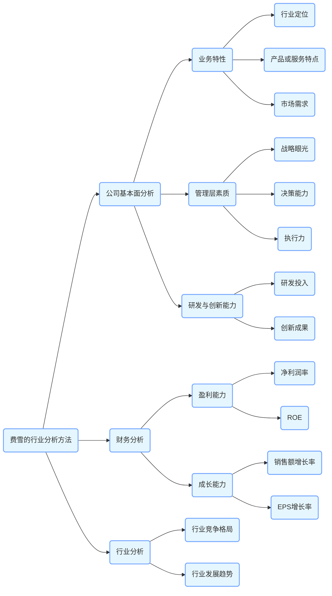

# 费雪的行业分析方法

> 关键词：费雪、行业分析方法、公司研究、投资决策、成长型股票

> 摘要：本文深入探讨了费雪的行业分析方法。费雪的行业分析方法以寻找成长型公司为核心，对投资者进行合理的投资决策具有重要指导意义。文章首先介绍了该方法产生的背景、目的、适用读者等内容，接着阐述了核心概念与联系，详细讲解了核心算法原理及具体操作步骤，通过数学模型和公式进行理论支撑，并结合实际案例说明其应用。还探讨了该方法在实际投资中的应用场景，推荐了相关学习工具和资源。最后总结了该方法的未来发展趋势与挑战，解答了常见问题，并提供了扩展阅读和参考资料，旨在帮助读者全面掌握费雪的行业分析方法，提升投资分析能力。

## 1. 背景介绍 
### 1.1 目的和范围
费雪的行业分析方法旨在帮助投资者从众多行业和公司中筛选出具有长期成长潜力的投资标的。该方法的核心在于深入研究公司的业务、管理、技术等多个方面，以判断公司是否具备持续增长的能力。其范围涵盖了各个行业的上市公司，无论是传统制造业、新兴科技行业还是服务业等，都可以运用费雪的方法进行分析。通过这种分析，投资者可以做出更明智的投资决策，提高投资回报率。

### 1.2 预期读者
本文的预期读者主要包括对投资领域感兴趣的个人投资者、金融行业的从业者（如分析师、基金经理等）以及相关专业的学生。对于个人投资者来说，掌握费雪的行业分析方法可以帮助他们更好地管理自己的投资组合，避免盲目跟风投资。金融行业从业者可以将该方法作为一种重要的分析工具，提升自己的专业能力和投资决策水平。而相关专业的学生则可以通过学习该方法，加深对投资学和行业分析的理解。

### 1.3 文档结构概述
本文将按照以下结构进行阐述：首先介绍费雪行业分析方法的背景信息，包括目的、预期读者和文档结构等；接着讲解核心概念与联系，明确该方法涉及的关键概念及其相互关系；然后详细阐述核心算法原理和具体操作步骤，并结合 Python 代码进行说明；再通过数学模型和公式对方法进行理论推导和举例说明；之后通过项目实战展示代码的实际应用和详细解读；探讨该方法在实际中的应用场景；推荐相关的学习工具和资源；最后总结该方法的未来发展趋势与挑战，解答常见问题，并提供扩展阅读和参考资料。

### 1.4 术语表
#### 1.4.1 核心术语定义
- **成长型公司**：指那些具有高于行业平均增长率的公司，通常表现为销售额、利润等指标的持续增长。这些公司往往在技术创新、市场拓展等方面具有优势。
- **边际利润率**：是指每增加一单位销售量所增加的利润，反映了公司在生产和销售过程中的盈利能力。
- **研发投入**：公司为了开发新产品、改进现有产品或提高生产技术而投入的资金。研发投入的多少在一定程度上反映了公司的创新能力和未来发展潜力。

#### 1.4.2 相关概念解释
- **行业竞争格局**：描述了行业内各公司之间的竞争关系和市场份额分布情况。一个行业的竞争格局可以分为完全竞争、垄断竞争、寡头垄断和完全垄断等不同类型。
- **管理层能力**：包括管理层的战略眼光、决策能力、组织协调能力等方面。优秀的管理层能够带领公司在激烈的市场竞争中取得优势。

#### 1.4.3 缩略词列表
- **ROE**：净资产收益率（Return on Equity），是衡量公司盈利能力的重要指标，反映了股东权益的收益水平。
- **EPS**：每股收益（Earnings Per Share），指税后利润与股本总数的比率，是普通股股东每持有一股所能享有的企业净利润或需承担的企业净亏损。

## 2. 核心概念与联系 

### 核心概念原理
费雪的行业分析方法建立在对公司基本面的深入研究之上。其核心原理是通过对公司的多个方面进行评估，寻找那些具有独特竞争优势和持续成长潜力的公司。主要关注以下几个核心概念：

- **公司的业务特性**：了解公司所处的行业、产品或服务的特点、市场需求等。例如，一家科技公司的产品是否具有创新性、是否能够满足市场的潜在需求等。
- **管理层素质**：优秀的管理层是公司成功的关键因素之一。管理层应具备良好的战略眼光、决策能力和执行力，能够带领公司在市场竞争中取得优势。
- **研发与创新能力**：在当今快速发展的时代，研发与创新能力对于公司的持续发展至关重要。公司需要不断投入资源进行研发，推出新产品或改进现有产品，以保持市场竞争力。

### 架构的文本示意图
```plaintext
费雪的行业分析方法
|-- 公司基本面分析
|   |-- 业务特性
|   |   |-- 行业定位
|   |   |-- 产品或服务特点
|   |   |-- 市场需求
|   |-- 管理层素质
|   |   |-- 战略眼光
|   |   |-- 决策能力
|   |   |-- 执行力
|   |-- 研发与创新能力
|   |   |-- 研发投入
|   |   |-- 创新成果
|-- 财务分析
|   |-- 盈利能力
|   |   |-- 净利润率
|   |   |-- ROE
|   |-- 成长能力
|   |   |-- 销售额增长率
|   |   |-- EPS 增长率
|-- 行业分析
|   |-- 行业竞争格局
|   |-- 行业发展趋势
```

### Mermaid 流程图


## 3. 核心算法原理 & 具体操作步骤 

### 核心算法原理
费雪的行业分析方法并没有严格意义上的固定算法，但可以通过一系列的指标和分析步骤来评估公司的投资价值。其核心思想是综合考虑公司的基本面、财务状况和行业环境等因素。以下是一些关键指标的计算和分析方法：

- **盈利能力评估**：
    - 净利润率 = 净利润 / 营业收入，反映了公司在扣除所有成本后每单位营业收入所获得的利润。
    - ROE = 净利润 / 净资产，衡量了公司运用自有资本的效率。

- **成长能力评估**：
    - 销售额增长率 = （本期销售额 - 上期销售额） / 上期销售额，反映了公司销售额的增长速度。
    - EPS 增长率 = （本期 EPS - 上期 EPS） / 上期 EPS，体现了公司每股收益的增长情况。

### 具体操作步骤

#### 步骤 1：确定研究的行业和公司
首先，投资者需要根据自己的投资目标和风险偏好，选择感兴趣的行业和公司。可以通过研究行业报告、财经新闻等途径获取相关信息。

#### 步骤 2：收集公司的基本面信息
包括公司的业务范围、产品或服务特点、市场份额、管理层背景等。可以通过公司的年报、招股说明书、官方网站等渠道获取这些信息。

#### 步骤 3：进行财务分析
收集公司的财务报表，计算上述关键指标，并与同行业的其他公司进行比较。可以使用财务分析软件或在线工具来辅助计算。

#### 步骤 4：分析行业竞争格局和发展趋势
研究行业内的主要竞争对手、市场份额分布、行业政策等因素，了解行业的发展前景和潜在风险。

#### 步骤 5：综合评估公司的投资价值
根据以上分析结果，对公司的投资价值进行综合评估。可以采用打分法或建立评估模型来量化评估结果。

### Python 代码实现
```python
import pandas as pd

# 模拟公司财务数据
data = {
    '公司名称': ['公司A', '公司B', '公司C'],
    '营业收入': [1000, 2000, 1500],
    '净利润': [100, 200, 150],
    '净资产': [500, 1000, 750],
    '上期销售额': [900, 1800, 1300],
    '上期EPS': [0.5, 1, 0.75]
}

df = pd.DataFrame(data)

# 计算关键指标
df['净利润率'] = df['净利润'] / df['营业收入']
df['ROE'] = df['净利润'] / df['净资产']
df['销售额增长率'] = (df['营业收入'] - df['上期销售额']) / df['上期销售额']
# 假设 EPS 可以通过净利润和股本计算，这里简单模拟
df['EPS'] = df['净利润'] / 100  # 假设股本为 100
df['EPS增长率'] = (df['EPS'] - df['上期EPS']) / df['上期EPS']

print(df)
```
在上述代码中，我们首先模拟了三家公司的财务数据，然后使用 Pandas 库计算了净利润率、ROE、销售额增长率和 EPS 增长率等关键指标，并将结果打印输出。

## 4. 数学模型和公式 & 详细讲解 & 举例说明 

### 数学模型和公式
#### 盈利能力指标
- **净利润率公式**：
$$净利润率 = \frac{净利润}{营业收入}$$
净利润率反映了公司的经营效益，净利润率越高，说明公司在营业收入中能够获得更多的利润。例如，一家公司的营业收入为 1000 万元，净利润为 100 万元，则其净利润率为 $\frac{100}{1000} = 0.1$ 或 10%。

- **ROE 公式**：
$$ROE = \frac{净利润}{净资产}$$
ROE 衡量了公司运用自有资本的效率，ROE 越高，说明公司利用股东投入的资金创造利润的能力越强。假设一家公司的净利润为 200 万元，净资产为 1000 万元，则其 ROE 为 $\frac{200}{1000} = 0.2$ 或 20%。

#### 成长能力指标
- **销售额增长率公式**：
$$销售额增长率 = \frac{本期销售额 - 上期销售额}{上期销售额}$$
销售额增长率反映了公司业务的扩张速度。例如，某公司上期销售额为 800 万元，本期销售额为 1000 万元，则其销售额增长率为 $\frac{1000 - 800}{800} = 0.25$ 或 25%。

- **EPS 增长率公式**：
$$EPS增长率 = \frac{本期EPS - 上期EPS}{上期EPS}$$
EPS 增长率体现了公司每股收益的增长情况。假设一家公司上期 EPS 为 0.5 元，本期 EPS 为 0.6 元，则其 EPS 增长率为 $\frac{0.6 - 0.5}{0.5} = 0.2$ 或 20%。

### 详细讲解
这些指标相互关联，共同反映了公司的经营状况和发展潜力。盈利能力指标（净利润率和 ROE）主要关注公司当前的盈利水平和资本利用效率，而成长能力指标（销售额增长率和 EPS 增长率）则侧重于公司未来的发展趋势。在分析公司时，需要综合考虑这些指标，不能仅仅依赖某一个指标来做出决策。

### 举例说明
假设我们要分析两家公司 A 和 B 的投资价值。以下是它们的财务数据：

| 公司 | 营业收入（万元） | 净利润（万元） | 净资产（万元） | 上期销售额（万元） | 上期 EPS（元） | 本期 EPS（元） |
| ---- | ---- | ---- | ---- | ---- | ---- | ---- |
| A | 1500 | 150 | 750 | 1200 | 0.7 | 0.8 |
| B | 2000 | 200 | 1000 | 1800 | 0.9 | 1.1 |

计算各项指标：

- 公司 A：
    - 净利润率 = $\frac{150}{1500} = 0.1$ 或 10%
    - ROE = $\frac{150}{750} = 0.2$ 或 20%
    - 销售额增长率 = $\frac{1500 - 1200}{1200} = 0.25$ 或 25%
    - EPS 增长率 = $\frac{0.8 - 0.7}{0.7} \approx 0.143$ 或 14.3%

- 公司 B：
    - 净利润率 = $\frac{200}{2000} = 0.1$ 或 10%
    - ROE = $\frac{200}{1000} = 0.2$ 或 20%
    - 销售额增长率 = $\frac{2000 - 1800}{1800} \approx 0.111$ 或 11.1%
    - EPS 增长率 = $\frac{1.1 - 0.9}{0.9} \approx 0.222$ 或 22.2%

从上述计算结果可以看出，两家公司的净利润率和 ROE 相同，但公司 A 的销售额增长率较高，而公司 B 的 EPS 增长率较高。在实际分析中，还需要结合公司的基本面、行业环境等因素进行综合判断。

## 5. 项目实战：代码实际案例和详细解释说明 

### 5.1  开发环境搭建
为了实现费雪的行业分析方法的代码实战，我们需要搭建以下开发环境：

- **Python 环境**：建议使用 Python 3.7 及以上版本。可以从 Python 官方网站（https://www.python.org/downloads/）下载并安装。
- **开发工具**：推荐使用 PyCharm 或 Jupyter Notebook。PyCharm 是一款功能强大的 Python 集成开发环境，适合大型项目的开发；Jupyter Notebook 则更适合交互式编程和数据分析。
- **相关库**：需要安装 Pandas、Numpy 等库。可以使用以下命令进行安装：
```sh
pip install pandas numpy
```

### 5.2  源代码详细实现和代码解读
以下是一个完整的代码示例，用于对多家公司进行财务分析，并根据费雪的行业分析方法的核心指标进行评估：

```python
import pandas as pd

# 读取公司财务数据文件（假设数据存储在 CSV 文件中）
data = pd.read_csv('company_financial_data.csv')

# 计算关键指标
data['净利润率'] = data['净利润'] / data['营业收入']
data['ROE'] = data['净利润'] / data['净资产']
data['销售额增长率'] = (data['本期销售额'] - data['上期销售额']) / data['上期销售额']
data['EPS增长率'] = (data['本期EPS'] - data['上期EPS']) / data['上期EPS']

# 筛选出盈利能力和成长能力较强的公司
profitable_companies = data[(data['净利润率'] > 0.1) & (data['ROE'] > 0.15)]
growing_companies = data[(data['销售额增长率'] > 0.1) & (data['EPS增长率'] > 0.1)]

# 找出同时满足盈利能力和成长能力要求的公司
target_companies = pd.merge(profitable_companies, growing_companies, how='inner')

print("满足盈利能力和成长能力要求的公司：")
print(target_companies)
```

### 代码解读与分析
1. **数据读取**：使用 `pandas` 库的 `read_csv` 函数读取存储公司财务数据的 CSV 文件。确保 CSV 文件包含以下列：`公司名称`、`营业收入`、`净利润`、`净资产`、`上期销售额`、`本期销售额`、`上期EPS`、`本期EPS`。
2. **指标计算**：根据前面介绍的公式，计算净利润率、ROE、销售额增长率和 EPS 增长率。
3. **筛选公司**：通过设定阈值，筛选出盈利能力和成长能力较强的公司。这里设定净利润率大于 10%、ROE 大于 15% 为盈利能力较强；销售额增长率和 EPS 增长率均大于 10% 为成长能力较强。
4. **找出目标公司**：使用 `pandas` 的 `merge` 函数找出同时满足盈利能力和成长能力要求的公司。
5. **结果输出**：将筛选出的目标公司打印输出。

通过这个代码示例，我们可以对多家公司进行快速的财务分析和筛选，为投资决策提供参考。

## 6. 实际应用场景 
### 股票投资
在股票投资领域，费雪的行业分析方法可以帮助投资者筛选出具有成长潜力的股票。投资者可以运用该方法对不同行业的公司进行分析，评估其盈利能力、成长能力和竞争优势，从而选择合适的投资标的。例如，通过分析科技行业的公司，找出那些研发投入高、市场份额不断扩大、管理层优秀的公司，将其纳入投资组合。

### 基金管理
基金经理在构建基金组合时，也可以采用费雪的行业分析方法。他们可以对不同行业的公司进行全面评估，根据基金的投资策略和目标，选择具有不同风险收益特征的公司进行投资。例如，成长型基金可以重点投资那些成长能力较强的公司，而价值型基金则可以关注那些盈利能力稳定、估值合理的公司。

### 企业战略规划
企业在制定战略规划时，也可以借鉴费雪的行业分析方法。通过对行业竞争格局和发展趋势的分析，企业可以了解自身的优势和劣势，制定相应的战略措施。例如，企业可以根据市场需求和技术发展趋势，加大研发投入，推出新产品，提高市场竞争力。

### 风险评估
在进行风险评估时，费雪的行业分析方法可以帮助投资者和企业识别潜在的风险因素。例如，通过分析公司的财务状况和行业环境，评估公司面临的市场风险、竞争风险和经营风险等。如果一家公司的销售额增长率下降、净利润率降低，可能意味着该公司面临着市场竞争加剧或经营管理不善等问题，投资者和企业需要及时采取措施降低风险。

## 7. 工具和资源推荐
### 7.1 学习资源推荐
#### 7.1.1 书籍推荐
- 《怎样选择成长股》（菲利普·费雪著）：这是费雪的经典著作，详细阐述了他的投资理念和行业分析方法，是学习费雪方法的必读之书。
- 《聪明的投资者》（本杰明·格雷厄姆著）：虽然这本书主要强调价值投资，但其中的一些分析方法和理念与费雪的方法有一定的关联，对投资者有很大的启发。
- 《财务报表分析与证券定价》（斯蒂芬·佩因曼著）：该书深入讲解了财务报表分析的方法和技巧，对于运用费雪的方法进行财务分析有很大的帮助。

#### 7.1.2 在线课程
- Coursera 平台上的“投资学原理”课程：该课程涵盖了投资学的基本原理和方法，包括行业分析、公司估值等内容，由知名高校的教授授课。
- 网易云课堂上的“财务分析实战”课程：主要讲解财务报表分析的实际应用，通过案例分析帮助学员掌握财务分析的技巧。

#### 7.1.3 技术博客和网站
- 雪球网：国内知名的投资社区，汇聚了众多投资者和分析师的观点和分析报告，可以了解到最新的行业动态和公司分析。
- Seeking Alpha：国外的投资研究网站，提供大量的股票分析、行业研究和投资策略等内容。

### 7.2 开发工具框架推荐
#### 7.2.1 IDE和编辑器
- PyCharm：功能强大的 Python 集成开发环境，具有代码自动补全、调试、版本控制等功能，适合专业开发者使用。
- Jupyter Notebook：交互式编程环境，方便进行数据分析和可视化，适合数据科学家和分析师使用。

#### 7.2.2 调试和性能分析工具
- Py-Spy：用于分析 Python 程序的性能瓶颈，可以找出程序中耗时较长的代码段。
- PDB：Python 自带的调试工具，可以帮助开发者定位和解决代码中的问题。

#### 7.2.3 相关框架和库
- Pandas：用于数据处理和分析的 Python 库，提供了丰富的数据结构和函数，方便进行数据清洗、转换和计算。
- Numpy：用于科学计算的 Python 库，提供了高效的数组操作和数学函数，是很多数据分析和机器学习库的基础。

### 7.3 相关论文著作推荐
#### 7.3.1 经典论文
- “Common Stock and Uncommon Profits”（菲利普·费雪著）：费雪的经典论文，系统阐述了他的投资哲学和行业分析方法。
- “The Theory of Investment Value”（约翰·伯尔·威廉姆斯著）：提出了现金流折现模型，对公司估值和投资分析有重要影响。

#### 7.3.2 最新研究成果
- 关注顶级金融学术期刊，如《Journal of Finance》、《Review of Financial Studies》等，这些期刊会发表关于投资分析、行业研究等方面的最新研究成果。

#### 7.3.3 应用案例分析
- 一些知名投资机构的研究报告和案例分析，如巴菲特的伯克希尔·哈撒韦公司的年报，其中包含了很多关于公司分析和投资决策的案例和思路。

## 8. 总结：未来发展趋势与挑战
### 未来发展趋势
- **数字化和智能化**：随着信息技术的不断发展，费雪的行业分析方法将与数字化和智能化技术相结合。例如，利用大数据分析和人工智能算法，可以更高效地收集和分析公司的财务数据、行业信息等，提高分析的准确性和效率。
- **跨学科融合**：行业分析不仅仅局限于财务和经济领域，还将与管理学、社会学、心理学等学科进行融合。通过综合考虑多个因素，可以更全面地评估公司的投资价值。
- **全球化视野**：在全球化的背景下，投资者需要具备全球化的视野，分析不同国家和地区的行业和公司。费雪的行业分析方法将更加注重国际市场的研究和比较。

### 挑战
- **数据质量和可靠性**：准确的数据分析依赖于高质量的数据。然而，在实际应用中，数据可能存在误差、缺失或造假等问题，这给行业分析带来了挑战。投资者需要加强数据验证和清洗，提高数据的质量和可靠性。
- **市场不确定性**：市场环境是复杂多变的，受到宏观经济、政策法规、技术创新等多种因素的影响。即使采用了科学的分析方法，也难以完全预测市场的走势和公司的未来发展。投资者需要具备风险意识，合理配置资产，降低市场不确定性带来的风险。
- **竞争加剧**：随着投资分析方法的普及，越来越多的投资者和机构采用类似的方法进行分析，市场竞争加剧。这使得寻找具有独特投资价值的公司变得更加困难，投资者需要不断提升自己的分析能力和洞察力。

## 9. 附录：常见问题与解答
### 问题 1：费雪的行业分析方法适用于所有行业吗？
解答：费雪的行业分析方法具有一定的通用性，但并不是适用于所有行业。不同行业具有不同的特点和发展规律，在应用该方法时需要根据行业的实际情况进行调整和补充。例如，对于新兴科技行业，可能需要更加关注公司的研发能力和创新成果；而对于传统制造业，可能更注重公司的成本控制和生产效率。

### 问题 2：如何判断管理层的素质？
解答：判断管理层的素质可以从多个方面入手。首先，可以了解管理层的教育背景、工作经验和专业技能。其次，观察管理层的战略决策和执行能力，例如公司的业务拓展方向、市场份额的变化等。此外，还可以关注管理层的诚信和道德品质，以及与股东的沟通情况。

### 问题 3：财务指标的阈值应该如何确定？
解答：财务指标的阈值并没有固定的标准，需要根据行业的平均水平、公司的历史数据和市场环境等因素进行综合考虑。一般来说，可以参考同行业其他公司的指标数据，以及行业的发展趋势来确定合理的阈值。同时，还需要结合公司的基本面和其他非财务因素进行分析，不能仅仅依赖财务指标来做出决策。

### 问题 4：如何获取公司的详细财务数据？
解答：可以通过以下途径获取公司的详细财务数据：
- 公司的官方网站：大多数上市公司会在其官方网站上公布年度报告、中期报告等财务信息。
- 证券交易所网站：证券交易所会提供上市公司的财务报表和相关公告。
- 金融数据提供商：如 Wind、东方财富等，这些平台提供了丰富的金融数据和分析工具。

## 10. 扩展阅读 & 参考资料
### 扩展阅读
- 《金融炼金术》（乔治·索罗斯著）：探讨了金融市场的运行规律和投资者的心理因素，对投资分析有一定的启发。
- 《创新者的窘境》（克莱顿·克里斯坦森著）：分析了创新对企业和行业的影响，对于理解行业发展趋势有很大帮助。

### 参考资料
- 菲利普·费雪的相关著作和论文。
- 各大金融学术期刊上发表的关于投资分析和行业研究的论文。
- 相关财经网站和投资社区的分析报告和文章。

作者：AI天才研究院/AI Genius Institute & 禅与计算机程序设计艺术 /Zen And The Art of Computer Programming