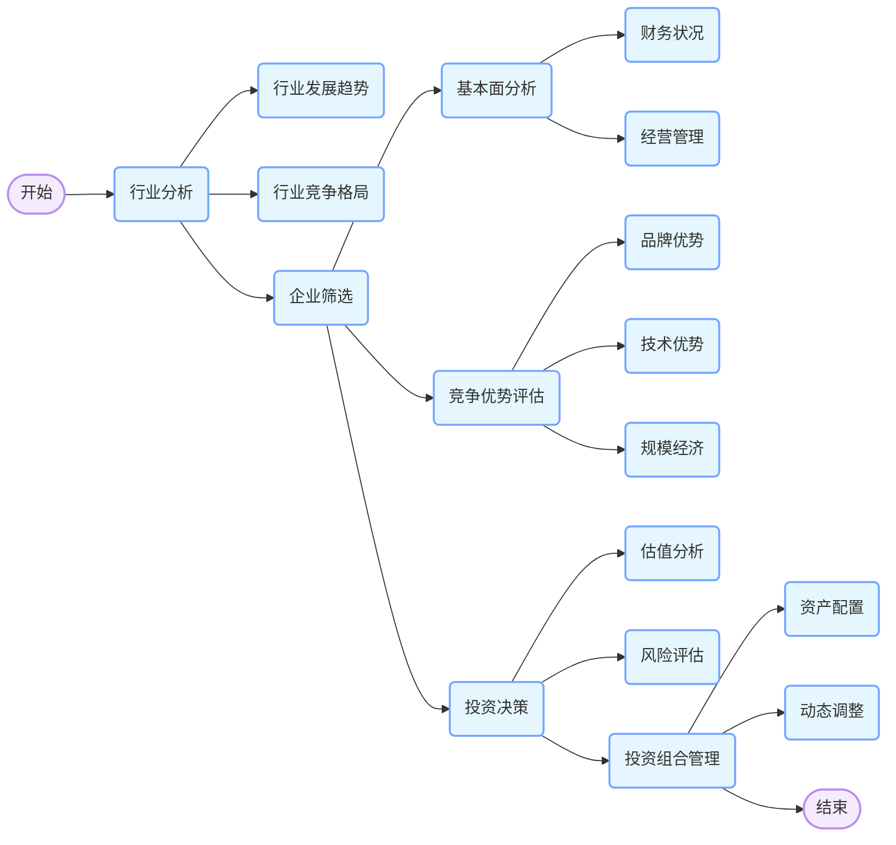

# 费雪的行业领导者投资法

> 关键词：费雪、行业领导者、投资法、成长股、基本面分析

> 摘要：本文深入探讨费雪的行业领导者投资法，详细阐述该投资法的背景、核心概念、算法原理、数学模型等内容。通过项目实战案例，展示如何运用这一投资法进行实际操作，并介绍其在不同场景下的应用。同时，推荐了相关的学习资源、开发工具和论文著作，最后总结其未来发展趋势与挑战，旨在为投资者提供全面且深入的关于费雪行业领导者投资法的知识体系和实践指导。

## 1. 背景介绍 
### 1.1 目的和范围
费雪的行业领导者投资法旨在帮助投资者识别具有长期增长潜力的行业领导者企业，并通过投资这些企业实现资产的增值。其范围涵盖了各个行业，通过对企业基本面、行业竞争格局等多方面的分析，筛选出具备竞争优势和成长潜力的企业作为投资标的。

### 1.2 预期读者
本文预期读者主要包括对股票投资有兴趣的个人投资者、金融从业者、投资研究人员等。无论是初涉投资领域的新手，还是有一定经验的专业人士，都能从本文中获取关于费雪行业领导者投资法的深入理解和实践指导。

### 1.3 文档结构概述
本文首先介绍费雪行业领导者投资法的背景信息，包括目的、预期读者和文档结构。接着阐述核心概念与联系，包括该投资法的原理和架构。然后详细讲解核心算法原理及具体操作步骤，并通过数学模型和公式进行进一步说明。之后通过项目实战展示实际应用案例，包括开发环境搭建、源代码实现和代码解读。再介绍该投资法的实际应用场景，推荐相关的工具和资源。最后总结未来发展趋势与挑战，解答常见问题并提供扩展阅读和参考资料。

### 1.4 术语表
#### 1.4.1 核心术语定义
- **行业领导者**：在特定行业中具有领先地位，包括市场份额、技术实力、品牌影响力等方面处于优势的企业。
- **成长股**：指发行股票时规模并不大，但公司的业务蒸蒸日上，管理良好，利润丰厚，产品在市场上有较强竞争力的上市公司的股票。
- **基本面分析**：通过对宏观经济、行业和公司基本情况的分析，评估股票的内在价值，从而判断股票的投资价值。

#### 1.4.2 相关概念解释
- **竞争优势**：企业相对于竞争对手所具有的独特优势，如成本优势、技术优势、品牌优势等，这些优势有助于企业在市场竞争中获得更高的市场份额和利润。
- **可持续增长**：企业在长期内能够保持稳定的增长态势，不受短期市场波动的影响，主要依靠自身的核心竞争力和市场需求的持续增长。

#### 1.4.3 缩略词列表
- **EPS**：每股收益（Earnings Per Share），是指税后利润与股本总数的比率，它是测定股票投资价值的重要指标之一。
- **ROE**：净资产收益率（Return on Equity），是净利润与平均股东权益的百分比，反映股东权益的收益水平，用以衡量公司运用自有资本的效率。

## 2. 核心概念与联系 
### 核心概念原理
费雪的行业领导者投资法基于这样一个原理：行业领导者企业通常具有强大的竞争优势和良好的发展前景。这些企业在市场上占据主导地位，能够更好地抵御市场风险，并且有能力持续创新和扩大市场份额。通过投资行业领导者企业，投资者可以分享企业成长带来的收益。

行业领导者企业的优势主要体现在以下几个方面：
- **品牌优势**：知名品牌能够吸引更多的消费者，提高产品的市场认可度和忠诚度，从而为企业带来稳定的收入。
- **技术优势**：领先的技术可以使企业生产出更优质、更具竞争力的产品，提高生产效率，降低成本。
- **规模经济**：大规模生产和销售可以降低单位成本，提高企业的盈利能力。

### 架构的文本示意图
```plaintext
费雪的行业领导者投资法
|-- 行业分析
|   |-- 行业发展趋势
|   |-- 行业竞争格局
|-- 企业筛选
|   |-- 基本面分析
|   |   |-- 财务状况
|   |   |-- 经营管理
|   |-- 竞争优势评估
|       |-- 品牌优势
|       |-- 技术优势
|       |-- 规模经济
|-- 投资决策
|   |-- 估值分析
|   |-- 风险评估
|-- 投资组合管理
|   |-- 资产配置
|   |-- 动态调整
```

### Mermaid 流程图


## 3. 核心算法原理 & 具体操作步骤 
### 核心算法原理
费雪的行业领导者投资法的核心算法原理是通过对行业和企业的多维度分析，筛选出具有投资价值的行业领导者企业。具体来说，包括以下几个方面：
- **行业分析算法**：通过对行业的市场规模、增长率、竞争格局等指标进行分析，评估行业的发展前景和吸引力。可以使用以下公式计算行业吸引力得分：
$$行业吸引力得分 = 市场规模得分 \times 权重_1 + 增长率得分 \times 权重_2 + 竞争格局得分 \times 权重_3$$
其中，市场规模得分、增长率得分和竞争格局得分可以根据设定的标准进行量化，权重可以根据投资者的偏好进行调整。
- **企业筛选算法**：对企业的基本面和竞争优势进行评估，计算企业的综合得分。基本面评估包括财务状况、经营管理等方面，竞争优势评估包括品牌优势、技术优势、规模经济等方面。可以使用以下公式计算企业综合得分：
$$企业综合得分 = 基本面得分 \times 权重_4 + 竞争优势得分 \times 权重_5$$
其中，基本面得分和竞争优势得分可以根据具体的评估指标进行量化，权重可以根据投资者的偏好进行调整。

### 具体操作步骤
#### 步骤 1：行业分析
- 收集行业相关数据，包括市场规模、增长率、竞争格局等。
- 根据设定的标准对行业的各项指标进行量化，计算行业吸引力得分。
- 筛选出行业吸引力得分较高的行业作为投资候选行业。

#### 步骤 2：企业筛选
- 在候选行业中收集企业相关数据，包括财务报表、经营管理信息、品牌影响力、技术实力等。
- 根据设定的标准对企业的基本面和竞争优势进行量化，计算企业综合得分。
- 筛选出企业综合得分较高的企业作为投资候选企业。

#### 步骤 3：投资决策
- 对候选企业进行估值分析，评估企业的内在价值。可以使用市盈率（P/E）、市净率（P/B）等估值指标。
- 进行风险评估，分析企业面临的各种风险，如市场风险、行业风险、企业自身风险等。
- 根据估值分析和风险评估结果，确定投资决策，包括是否投资、投资金额等。

#### 步骤 4：投资组合管理
- 根据投资决策结果，进行资产配置，将资金分配到不同的候选企业中。
- 定期对投资组合进行动态调整，根据企业的发展情况和市场变化，调整投资组合的结构。

### Python 源代码实现
```python
import pandas as pd

# 行业分析
def industry_analysis(industry_data):
    # 计算市场规模得分
    market_size_scores = []
    for size in industry_data['market_size']:
        if size > 1000:
            market_size_scores.append(3)
        elif size > 500:
            market_size_scores.append(2)
        else:
            market_size_scores.append(1)
    
    # 计算增长率得分
    growth_rate_scores = []
    for rate in industry_data['growth_rate']:
        if rate > 0.2:
            growth_rate_scores.append(3)
        elif rate > 0.1:
            growth_rate_scores.append(2)
        else:
            growth_rate_scores.append(1)
    
    # 计算竞争格局得分
    competition_scores = []
    for concentration in industry_data['competition_concentration']:
        if concentration > 0.8:
            competition_scores.append(3)
        elif concentration > 0.6:
            competition_scores.append(2)
        else:
            competition_scores.append(1)
    
    # 计算行业吸引力得分
    industry_scores = []
    weight1 = 0.4
    weight2 = 0.3
    weight3 = 0.3
    for i in range(len(industry_data)):
        score = market_size_scores[i] * weight1 + growth_rate_scores[i] * weight2 + competition_scores[i] * weight3
        industry_scores.append(score)
    
    industry_data['industry_score'] = industry_scores
    # 筛选出行业吸引力得分较高的行业
    selected_industries = industry_data[industry_data['industry_score'] >= 2]
    return selected_industries

# 企业筛选
def company_screening(company_data):
    # 计算基本面得分
    fundamental_scores = []
    for roe in company_data['ROE']:
        if roe > 0.2:
            fundamental_scores.append(3)
        elif roe > 0.1:
            fundamental_scores.append(2)
        else:
            fundamental_scores.append(1)
    
    # 计算竞争优势得分
    competitive_advantage_scores = []
    for brand_strength in company_data['brand_strength']:
        if brand_strength > 8:
            competitive_advantage_scores.append(3)
        elif brand_strength > 6:
            competitive_advantage_scores.append(2)
        else:
            competitive_advantage_scores.append(1)
    
    # 计算企业综合得分
    company_scores = []
    weight4 = 0.5
    weight5 = 0.5
    for i in range(len(company_data)):
        score = fundamental_scores[i] * weight4 + competitive_advantage_scores[i] * weight5
        company_scores.append(score)
    
    company_data['company_score'] = company_scores
    # 筛选出企业综合得分较高的企业
    selected_companies = company_data[company_data['company_score'] >= 2]
    return selected_companies

# 示例数据
industry_data = pd.DataFrame({
    'market_size': [1200, 600, 300],
    'growth_rate': [0.25, 0.15, 0.05],
    'competition_concentration': [0.85, 0.7, 0.5]
})

company_data = pd.DataFrame({
    'ROE': [0.22, 0.12, 0.08],
    'brand_strength': [9, 7, 5]
})

# 行业分析
selected_industries = industry_analysis(industry_data)
print("Selected Industries:")
print(selected_industries)

# 企业筛选
selected_companies = company_screening(company_data)
print("Selected Companies:")
print(selected_companies)
```

## 4. 数学模型和公式 & 详细讲解 & 举例说明 
### 行业吸引力得分公式
$$行业吸引力得分 = 市场规模得分 \times 权重_1 + 增长率得分 \times 权重_2 + 竞争格局得分 \times 权重_3$$

#### 详细讲解
- **市场规模得分**：反映了行业的市场容量大小。市场规模越大，通常意味着行业的发展空间越大，企业的潜在市场份额也越大。可以根据市场规模的大小将其划分为不同的等级，并赋予相应的得分。
- **增长率得分**：体现了行业的发展速度。增长率越高，说明行业处于快速发展阶段，企业有更多的机会实现增长。可以根据增长率的高低将其划分为不同的等级，并赋予相应的得分。
- **竞争格局得分**：衡量了行业的竞争激烈程度。竞争格局越集中，说明行业领导者企业的优势越明显，市场稳定性越高。可以根据竞争格局的集中程度将其划分为不同的等级，并赋予相应的得分。
- **权重**：权重的设置反映了投资者对不同指标的重视程度。投资者可以根据自己的投资偏好和风险承受能力调整权重。

#### 举例说明
假设某行业的市场规模为 800，增长率为 0.18，竞争格局集中度为 0.75。设定市场规模得分的划分标准为：大于 1000 得 3 分，大于 500 得 2 分，小于等于 500 得 1 分；增长率得分的划分标准为：大于 0.2 得 3 分，大于 0.1 得 2 分，小于等于 0.1 得 1 分；竞争格局得分的划分标准为：大于 0.8 得 3 分，大于 0.6 得 2 分，小于等于 0.6 得 1 分。权重设置为：权重 1 = 0.4，权重 2 = 0.3，权重 3 = 0.3。

则该行业的市场规模得分 = 2 分，增长率得分 = 2 分，竞争格局得分 = 2 分。

行业吸引力得分 = 2 × 0.4 + 2 × 0.3 + 2 × 0.3 = 2 分。

### 企业综合得分公式
$$企业综合得分 = 基本面得分 \times 权重_4 + 竞争优势得分 \times 权重_5$$

#### 详细讲解
- **基本面得分**：主要基于企业的财务状况和经营管理情况进行评估。财务状况包括盈利能力、偿债能力、运营能力等方面，经营管理包括管理层素质、战略规划等方面。可以根据相关指标的表现将其划分为不同的等级，并赋予相应的得分。
- **竞争优势得分**：从品牌优势、技术优势、规模经济等方面对企业的竞争优势进行评估。可以根据企业在这些方面的表现将其划分为不同的等级，并赋予相应的得分。
- **权重**：权重的设置反映了投资者对基本面和竞争优势的重视程度。投资者可以根据自己的投资偏好和风险承受能力调整权重。

#### 举例说明
假设某企业的 ROE 为 0.15，品牌强度为 7。设定基本面得分（以 ROE 为例）的划分标准为：大于 0.2 得 3 分，大于 0.1 得 2 分，小于等于 0.1 得 1 分；竞争优势得分（以品牌强度为例）的划分标准为：大于 8 得 3 分，大于 6 得 2 分，小于等于 6 得 1 分。权重设置为：权重 4 = 0.5，权重 5 = 0.5。

则该企业的基本面得分 = 2 分，竞争优势得分 = 2 分。

企业综合得分 = 2 × 0.5 + 2 × 0.5 = 2 分。

## 5. 项目实战：代码实际案例和详细解释说明 
### 5.1  开发环境搭建
#### 安装 Python
首先需要安装 Python 环境，建议使用 Python 3.7 及以上版本。可以从 Python 官方网站（https://www.python.org/downloads/） 下载并安装适合自己操作系统的 Python 版本。

#### 安装必要的库
在项目中使用了 Pandas 库进行数据处理，因此需要安装 Pandas 库。可以使用以下命令进行安装：
```sh
pip install pandas
```

### 5.2  源代码详细实现和代码解读
```python
import pandas as pd

# 行业分析
def industry_analysis(industry_data):
    # 计算市场规模得分
    market_size_scores = []
    for size in industry_data['market_size']:
        if size > 1000:
            market_size_scores.append(3)
        elif size > 500:
            market_size_scores.append(2)
        else:
            market_size_scores.append(1)
    
    # 计算增长率得分
    growth_rate_scores = []
    for rate in industry_data['growth_rate']:
        if rate > 0.2:
            growth_rate_scores.append(3)
        elif rate > 0.1:
            growth_rate_scores.append(2)
        else:
            growth_rate_scores.append(1)
    
    # 计算竞争格局得分
    competition_scores = []
    for concentration in industry_data['competition_concentration']:
        if concentration > 0.8:
            competition_scores.append(3)
        elif concentration > 0.6:
            competition_scores.append(2)
        else:
            competition_scores.append(1)
    
    # 计算行业吸引力得分
    industry_scores = []
    weight1 = 0.4
    weight2 = 0.3
    weight3 = 0.3
    for i in range(len(industry_data)):
        score = market_size_scores[i] * weight1 + growth_rate_scores[i] * weight2 + competition_scores[i] * weight3
        industry_scores.append(score)
    
    industry_data['industry_score'] = industry_scores
    # 筛选出行业吸引力得分较高的行业
    selected_industries = industry_data[industry_data['industry_score'] >= 2]
    return selected_industries

# 企业筛选
def company_screening(company_data):
    # 计算基本面得分
    fundamental_scores = []
    for roe in company_data['ROE']:
        if roe > 0.2:
            fundamental_scores.append(3)
        elif roe > 0.1:
            fundamental_scores.append(2)
        else:
            fundamental_scores.append(1)
    
    # 计算竞争优势得分
    competitive_advantage_scores = []
    for brand_strength in company_data['brand_strength']:
        if brand_strength > 8:
            competitive_advantage_scores.append(3)
        elif brand_strength > 6:
            competitive_advantage_scores.append(2)
        else:
            competitive_advantage_scores.append(1)
    
    # 计算企业综合得分
    company_scores = []
    weight4 = 0.5
    weight5 = 0.5
    for i in range(len(company_data)):
        score = fundamental_scores[i] * weight4 + competitive_advantage_scores[i] * weight5
        company_scores.append(score)
    
    company_data['company_score'] = company_scores
    # 筛选出企业综合得分较高的企业
    selected_companies = company_data[company_data['company_score'] >= 2]
    return selected_companies

# 示例数据
industry_data = pd.DataFrame({
    'market_size': [1200, 600, 300],
    'growth_rate': [0.25, 0.15, 0.05],
    'competition_concentration': [0.85, 0.7, 0.5]
})

company_data = pd.DataFrame({
    'ROE': [0.22, 0.12, 0.08],
    'brand_strength': [9, 7, 5]
})

# 行业分析
selected_industries = industry_analysis(industry_data)
print("Selected Industries:")
print(selected_industries)

# 企业筛选
selected_companies = company_screening(company_data)
print("Selected Companies:")
print(selected_companies)
```

#### 代码解读
- **行业分析函数 `industry_analysis`**：
  - 首先，通过遍历行业数据中的市场规模、增长率和竞争格局集中度，根据设定的标准计算相应的得分。
  - 然后，根据权重计算行业吸引力得分，并将其添加到行业数据中。
  - 最后，筛选出行业吸引力得分大于等于 2 的行业作为候选行业。
- **企业筛选函数 `company_screening`**：
  - 同样，通过遍历企业数据中的 ROE 和品牌强度，根据设定的标准计算基本面得分和竞争优势得分。
  - 接着，根据权重计算企业综合得分，并将其添加到企业数据中。
  - 最后，筛选出企业综合得分大于等于 2 的企业作为候选企业。
- **示例数据**：定义了行业数据和企业数据的示例，用于测试函数的功能。
- **调用函数**：分别调用行业分析函数和企业筛选函数，并打印出筛选结果。

### 5.3  代码解读与分析
#### 优点
- **模块化设计**：将行业分析和企业筛选分别封装成函数，提高了代码的复用性和可维护性。
- **易于扩展**：可以根据需要修改得分标准和权重，或者添加更多的评估指标，以适应不同的投资需求。
- **数据处理方便**：使用 Pandas 库进行数据处理，使得数据的读取、计算和筛选更加方便快捷。

#### 缺点
- **得分标准和权重的主观性**：得分标准和权重的设置具有一定的主观性，不同的投资者可能会有不同的看法，需要根据自己的经验和判断进行调整。
- **数据的局限性**：示例数据只是简单的模拟，实际应用中需要收集更全面、准确的数据，以提高分析结果的准确性。

## 6. 实际应用场景 
### 个人投资者
个人投资者可以运用费雪的行业领导者投资法进行股票投资。通过对行业和企业的分析，筛选出具有投资价值的行业领导者企业，构建自己的投资组合。这种方法可以帮助个人投资者降低投资风险，提高投资收益。例如，个人投资者可以关注科技、消费、医疗等行业的领导者企业，如苹果、茅台、恒瑞医药等，通过长期持有这些企业的股票，分享企业成长带来的收益。

### 机构投资者
机构投资者，如基金公司、证券公司等，可以将费雪的行业领导者投资法作为投资决策的参考依据。在进行资产配置和股票选择时，通过对行业和企业的深入分析，筛选出优质的投资标的，优化投资组合。例如，基金公司可以根据该投资法选择行业领导者企业作为基金的重仓股，以提高基金的业绩表现。

### 投资研究机构
投资研究机构可以运用费雪的行业领导者投资法进行行业和企业研究。通过对不同行业和企业的分析，撰写研究报告，为投资者提供投资建议和参考。例如，投资研究机构可以发布关于某个行业的深度研究报告，分析该行业的发展趋势和竞争格局，推荐该行业的领导者企业。

## 7. 工具和资源推荐
### 7.1 学习资源推荐
#### 7.1.1 书籍推荐
- 《怎样选择成长股》（菲利普·费雪著）：费雪的经典著作，详细阐述了他的投资理念和方法，是学习费雪投资法的必读之书。
- 《聪明的投资者》（本杰明·格雷厄姆著）：价值投资的经典著作，对基本面分析和投资决策有深入的讲解，与费雪的投资法相互补充。
- 《金融炼金术》（乔治·索罗斯著）：介绍了索罗斯的投资哲学和操作方法，对投资者的思维方式和投资策略有一定的启发。

#### 7.1.2 在线课程
- Coursera 上的“投资学原理”：由知名大学教授授课，系统讲解投资学的基本原理和方法，包括行业分析、企业估值等内容。
- 网易云课堂上的“股票投资实战技巧”：结合实际案例，介绍股票投资的实战技巧和方法，对费雪的行业领导者投资法有一定的应用讲解。

#### 7.1.3 技术博客和网站
- 雪球网：国内知名的投资社区，有大量的投资者分享投资经验和研究成果，可以学习到不同的投资策略和方法。
- 东方财富网：提供丰富的金融资讯和数据，包括行业数据、企业财务报表等，是进行行业和企业分析的重要工具。

### 7.2 开发工具框架推荐
#### 7.2.1 IDE和编辑器
- PyCharm：一款专业的 Python 集成开发环境，具有代码编辑、调试、版本控制等功能，方便开发和调试 Python 代码。
- Jupyter Notebook：一个交互式的开发环境，可以将代码、文本、图表等结合在一起，方便进行数据分析和展示。

#### 7.2.2 调试和性能分析工具
- PDB：Python 自带的调试工具，可以帮助开发者定位代码中的问题。
- cProfile：Python 标准库中的性能分析工具，可以分析代码的运行时间和函数调用情况，帮助优化代码性能。

#### 7.2.3 相关框架和库
- Pandas：用于数据处理和分析的 Python 库，提供了高效的数据结构和数据操作方法。
- NumPy：用于科学计算的 Python 库，提供了高效的数组操作和数学函数。

### 7.3 相关论文著作推荐
#### 7.3.1 经典论文
- 《资本资产定价模型：理论与实证》：介绍了资本资产定价模型的基本原理和实证研究，对投资组合的构建和风险评估有重要的指导意义。
- 《有效市场假说》：阐述了有效市场假说的基本概念和理论，对投资者的投资策略和市场行为有一定的影响。

#### 7.3.2 最新研究成果
- 关注顶尖金融学术期刊，如《Journal of Finance》《Review of Financial Studies》等，了解投资领域的最新研究成果和发展趋势。

#### 7.3.3 应用案例分析
- 可以参考一些知名投资机构的研究报告和案例分析，了解他们如何运用各种投资方法进行投资决策和风险管理。

## 8. 总结：未来发展趋势与挑战
### 未来发展趋势
- **数字化和智能化**：随着科技的不断发展，投资领域将越来越多地应用数字化和智能化技术。例如，利用大数据和人工智能技术进行行业和企业分析，提高投资决策的准确性和效率。
- **全球化**：全球经济一体化的趋势将继续加强，投资者将有更多的机会投资于全球范围内的行业领导者企业。同时，也需要考虑不同国家和地区的政治、经济、文化等因素对投资的影响。
- **可持续投资**：越来越多的投资者开始关注企业的社会责任和可持续发展能力，将环境、社会和治理（ESG）因素纳入投资决策中。费雪的行业领导者投资法也可以结合 ESG 因素，筛选出更具可持续发展潜力的企业。

### 挑战
- **市场不确定性**：市场环境复杂多变，受到宏观经济、政策、突发事件等多种因素的影响，增加了投资决策的难度。投资者需要不断关注市场动态，及时调整投资策略。
- **数据质量和准确性**：费雪的行业领导者投资法依赖于大量的行业和企业数据，数据的质量和准确性直接影响分析结果的可靠性。投资者需要确保数据来源的可靠性，并对数据进行清洗和预处理。
- **竞争加剧**：随着投资市场的发展，越来越多的投资者开始关注行业领导者企业，导致竞争加剧。投资者需要不断提高自己的分析能力和投资水平，才能在竞争中脱颖而出。

## 9. 附录：常见问题与解答
### 问题 1：如何确定行业吸引力得分和企业综合得分的权重？
答：权重的确定可以根据投资者的投资偏好和风险承受能力进行调整。一般来说，如果投资者更注重行业的发展前景，可以适当提高市场规模得分和增长率得分的权重；如果投资者更注重企业的基本面和竞争优势，可以适当提高基本面得分和竞争优势得分的权重。投资者可以通过历史数据回测和模拟投资等方法，找到适合自己的权重设置。

### 问题 2：费雪的行业领导者投资法适用于所有行业吗？
答：费雪的行业领导者投资法适用于大多数行业，但不同行业的特点和竞争格局不同，在应用时需要进行适当的调整。例如，对于新兴行业，可能更注重企业的技术创新能力和市场拓展能力；对于传统行业，可能更注重企业的品牌优势和成本控制能力。

### 问题 3：如何判断一个企业是否是行业领导者？
答：判断一个企业是否是行业领导者可以从多个方面进行分析，包括市场份额、技术实力、品牌影响力、管理团队、财务状况等。一般来说，行业领导者企业在这些方面都具有明显的优势。例如，市场份额较大、技术领先、品牌知名度高、管理团队优秀、财务状况良好等。

## 10. 扩展阅读 & 参考资料
- 菲利普·费雪. 《怎样选择成长股》. 海南出版社.
- 本杰明·格雷厄姆. 《聪明的投资者》. 人民邮电出版社.
- 乔治·索罗斯. 《金融炼金术》. 海南出版社.
- 《Journal of Finance》《Review of Financial Studies》等金融学术期刊.
- 雪球网、东方财富网等金融资讯网站.

作者：AI天才研究院/AI Genius Institute & 禅与计算机程序设计艺术 /Zen And The Art of Computer Programming