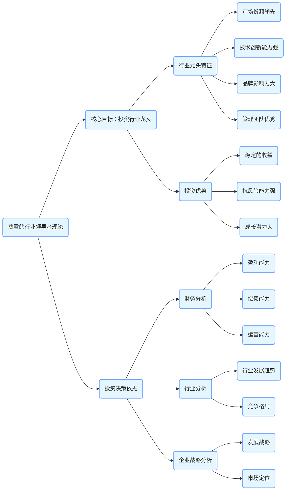

# 费雪的行业领导者理论：投资行业龙头

> 关键词：费雪的行业领导者理论、投资、行业龙头、财务分析、市场竞争力

> 摘要：本文围绕费雪的行业领导者理论展开，深入探讨投资行业龙头这一策略。首先介绍该理论的背景，包括目的、预期读者等。接着阐述核心概念，通过示意图和流程图展示其原理架构。详细讲解核心算法原理，并用 Python 代码呈现具体操作步骤。引入数学模型和公式进行详细分析并举例说明。通过项目实战，从开发环境搭建到源代码实现与解读，深入剖析该理论在实际投资中的应用。探讨其实际应用场景，推荐相关工具和资源，最后总结未来发展趋势与挑战，解答常见问题并提供扩展阅读与参考资料，旨在为投资者提供全面且深入的投资指导。

## 1. 背景介绍 
### 1.1 目的和范围
费雪的行业领导者理论为投资者提供了一种具有战略性的投资思路，即聚焦于行业龙头企业进行投资。本文的目的在于全面、深入地解析这一理论，详细探究其核心概念、算法原理、数学模型以及实际应用。范围涵盖理论的各个方面，从基础概念到实际投资操作，旨在帮助投资者理解为何投资行业龙头以及如何进行有效的投资决策。

### 1.2 预期读者
本文预期读者包括各类投资者，无论是初涉投资领域的新手，渴望获取系统的投资知识和策略；还是有一定经验的专业投资者，希望从理论层面进一步深化对投资行业龙头策略的理解；同时也适合金融专业的学生和研究人员，为他们的学术研究和学习提供参考。

### 1.3 文档结构概述
本文将按照以下结构进行阐述：首先介绍费雪的行业领导者理论的背景信息，包括目的、读者群体和文档结构等。接着深入剖析核心概念，通过示意图和流程图直观展示其原理架构。然后详细讲解核心算法原理，并使用 Python 代码进行具体操作步骤的演示。引入数学模型和公式进行理论分析，并结合实际例子进行说明。通过项目实战，从开发环境搭建到源代码实现与解读，深入探讨该理论在实际投资中的应用。之后探讨该理论的实际应用场景，推荐相关的学习资源、开发工具框架以及论文著作。最后总结未来发展趋势与挑战，解答常见问题并提供扩展阅读与参考资料。

### 1.4 术语表
#### 1.4.1 核心术语定义
- **费雪的行业领导者理论**：由投资大师菲利普·费雪提出，该理论认为在投资过程中，应重点关注那些在行业中占据领导地位的企业，因为这些企业通常具有更强的市场竞争力、更稳定的财务状况和更好的发展前景，能够为投资者带来更高的回报。
- **行业龙头**：指在某个行业中，在市场份额、技术实力、品牌影响力、管理水平等方面具有明显优势，处于领先地位的企业。这些企业往往能够引领行业的发展趋势，对行业的市场格局和发展方向具有重要的影响力。
- **投资回报率（ROI）**：是指通过投资而应返回的价值，即企业从一项投资活动中得到的经济回报。它涵盖了企业的获利目标，是衡量投资效果的重要指标之一。计算公式为：$ROI = \frac{投资收益 - 投资成本}{投资成本} \times 100\%$。
- **市场竞争力**：企业在市场中与其他竞争对手相比所具备的优势和能力，包括产品或服务的质量、价格、创新能力、营销能力等多个方面。具有较强市场竞争力的企业能够在市场中获得更多的份额和利润。

#### 1.4.2 相关概念解释
- **护城河理论**：由巴菲特提出，与费雪的行业领导者理论有一定关联。“护城河”是指企业抵御竞争对手的可持续竞争优势，如品牌优势、成本优势、技术优势等。行业龙头企业往往具有较宽的“护城河”，能够在激烈的市场竞争中保持领先地位。
- **成长股投资**：成长股是指那些销售额和利润额持续增长，且增长速度快于整个行业平均水平的股票。投资成长股的策略是寻找具有高成长潜力的企业进行投资，期望在企业成长过程中获得丰厚的回报。费雪的行业领导者理论在一定程度上也关注企业的成长潜力，认为行业龙头企业更有可能成为成长股。

#### 1.4.3 缩略词列表
- **ROI**：投资回报率（Return on Investment）

## 2. 核心概念与联系 
费雪的行业领导者理论核心在于识别并投资于行业中的龙头企业。行业龙头企业通常具有以下几个关键特征：
1. **市场份额领先**：在行业中占据较大的市场份额，能够对市场价格和供需关系产生重要影响。
2. **技术创新能力强**：不断投入研发，推出新产品和新技术，保持在行业中的技术领先地位。
3. **品牌影响力大**：拥有知名品牌，消费者对其产品或服务具有较高的认可度和忠诚度。
4. **管理团队优秀**：具备高素质的管理团队，能够制定科学合理的发展战略，有效组织和管理企业的运营。

### 文本示意图
```plaintext
费雪的行业领导者理论
|
|-- 核心目标：投资行业龙头
|   |
|   |-- 行业龙头特征
|   |   |-- 市场份额领先
|   |   |-- 技术创新能力强
|   |   |-- 品牌影响力大
|   |   |-- 管理团队优秀
|   |
|   |-- 投资优势
|   |   |-- 稳定的收益
|   |   |-- 抗风险能力强
|   |   |-- 成长潜力大
|
|-- 投资决策依据
|   |
|   |-- 财务分析
|   |   |-- 盈利能力
|   |   |-- 偿债能力
|   |   |-- 运营能力
|   |
|   |-- 行业分析
|   |   |-- 行业发展趋势
|   |   |-- 竞争格局
|   |
|   |-- 企业战略分析
|   |   |-- 发展战略
|   |   |-- 市场定位
```

### Mermaid 流程图


## 3. 核心算法原理 & 具体操作步骤 
### 核心算法原理
在运用费雪的行业领导者理论进行投资决策时，核心算法原理主要基于对企业的综合评估。通过对财务指标、行业地位和企业战略等多个方面的分析，计算出一个综合得分，以此来判断企业是否为行业龙头以及是否值得投资。

### 具体操作步骤
以下是使用 Python 实现的具体操作步骤：

```python
import pandas as pd

# 定义财务指标权重
financial_weights = {
    '盈利能力': 0.3,
    '偿债能力': 0.2,
    '运营能力': 0.2
}

# 定义行业指标权重
industry_weights = {
    '行业发展趋势': 0.2,
    '竞争格局': 0.1
}

# 定义企业战略指标权重
strategy_weights = {
    '发展战略': 0.1,
    '市场定位': 0.1
}

# 定义评估函数
def evaluate_company(financial_scores, industry_scores, strategy_scores):
    financial_score = sum([financial_scores[key] * financial_weights[key] for key in financial_scores])
    industry_score = sum([industry_scores[key] * industry_weights[key] for key in industry_scores])
    strategy_score = sum([strategy_scores[key] * strategy_weights[key] for key in strategy_scores])
    
    total_score = financial_score + industry_score + strategy_score
    return total_score

# 示例数据
financial_scores_example = {
    '盈利能力': 80,
    '偿债能力': 70,
    '运营能力': 75
}

industry_scores_example = {
    '行业发展趋势': 85,
    '竞争格局': 70
}

strategy_scores_example = {
    '发展战略': 80,
    '市场定位': 75
}

# 计算综合得分
total_score = evaluate_company(financial_scores_example, industry_scores_example, strategy_scores_example)
print(f"综合得分: {total_score}")
```

### 代码解释
1. **定义权重**：首先定义了财务指标、行业指标和企业战略指标的权重，这些权重反映了各个指标在综合评估中的重要性。
2. **定义评估函数**：`evaluate_company` 函数接受三个参数，分别是财务指标得分、行业指标得分和企业战略指标得分。函数内部根据权重计算各个部分的得分，并将它们相加得到综合得分。
3. **示例数据**：提供了一组示例数据，用于演示如何调用评估函数。
4. **计算综合得分**：调用 `evaluate_company` 函数，传入示例数据，计算并打印综合得分。

## 4. 数学模型和公式 & 详细讲解 & 举例说明 
### 数学模型
综合得分的数学模型可以表示为：

$$S = \sum_{i=1}^{n} w_{i} \times s_{i}$$

其中，$S$ 表示综合得分，$w_{i}$ 表示第 $i$ 个指标的权重，$s_{i}$ 表示第 $i$ 个指标的得分，$n$ 表示指标的总数。

### 详细讲解
在我们的例子中，指标分为财务指标、行业指标和企业战略指标三类。每个类别下又包含多个具体指标。我们先分别计算每个类别的得分，然后将它们相加得到综合得分。

例如，财务指标得分 $S_{f}$ 的计算公式为：

$$S_{f} = w_{f1} \times s_{f1} + w_{f2} \times s_{f2} + w_{f3} \times s_{f3}$$

其中，$w_{f1}$、$w_{f2}$、$w_{f3}$ 分别是盈利能力、偿债能力、运营能力的权重，$s_{f1}$、$s_{f2}$、$s_{f3}$ 分别是对应的得分。

同理，行业指标得分 $S_{i}$ 和企业战略指标得分 $S_{s}$ 也可以按照类似的公式计算。最后，综合得分 $S$ 为：

$$S = S_{f} + S_{i} + S_{s}$$

### 举例说明
假设某企业的财务指标得分如下：盈利能力 $s_{f1} = 80$，偿债能力 $s_{f2} = 70$，运营能力 $s_{f3} = 75$；行业指标得分：行业发展趋势 $s_{i1} = 85$，竞争格局 $s_{i2} = 70$；企业战略指标得分：发展战略 $s_{s1} = 80$，市场定位 $s_{s2} = 75$。

根据前面定义的权重，财务指标得分 $S_{f}$ 为：

$$S_{f} = 0.3 \times 80 + 0.2 \times 70 + 0.2 \times 75 = 24 + 14 + 15 = 53$$

行业指标得分 $S_{i}$ 为：

$$S_{i} = 0.2 \times 85 + 0.1 \times 70 = 17 + 7 = 24$$

企业战略指标得分 $S_{s}$ 为：

$$S_{s} = 0.1 \times 80 + 0.1 \times 75 = 8 + 7.5 = 15.5$$

综合得分 $S$ 为：

$$S = 53 + 24 + 15.5 = 92.5$$

通过这个综合得分，我们可以对该企业进行评估，如果得分较高，说明该企业在各个方面表现较好，更有可能是行业龙头，值得投资。

## 5. 项目实战：代码实际案例和详细解释说明 
### 5.1  开发环境搭建
在进行项目实战之前，需要搭建相应的开发环境。以下是具体步骤：
1. **安装 Python**：从 Python 官方网站（https://www.python.org/downloads/）下载并安装 Python 3.x 版本。
2. **安装必要的库**：使用 `pip` 命令安装所需的库，如 `pandas` 用于数据处理。
```bash
pip install pandas
```
3. **选择开发工具**：可以选择使用 Jupyter Notebook、PyCharm 等开发工具。这里以 Jupyter Notebook 为例，安装方法如下：
```bash
pip install jupyter
```
安装完成后，在命令行中输入 `jupyter notebook` 启动 Jupyter Notebook 服务器，然后在浏览器中打开相应的链接即可开始编写代码。

### 5.2  源代码详细实现和代码解读
以下是一个完整的项目实战代码示例，用于评估多个企业是否为行业龙头：

```python
import pandas as pd

# 定义财务指标权重
financial_weights = {
    '盈利能力': 0.3,
    '偿债能力': 0.2,
    '运营能力': 0.2
}

# 定义行业指标权重
industry_weights = {
    '行业发展趋势': 0.2,
    '竞争格局': 0.1
}

# 定义企业战略指标权重
strategy_weights = {
    '发展战略': 0.1,
    '市场定位': 0.1
}

# 定义评估函数
def evaluate_company(financial_scores, industry_scores, strategy_scores):
    financial_score = sum([financial_scores[key] * financial_weights[key] for key in financial_scores])
    industry_score = sum([industry_scores[key] * industry_weights[key] for key in industry_scores])
    strategy_score = sum([strategy_scores[key] * strategy_weights[key] for key in strategy_scores])
    
    total_score = financial_score + industry_score + strategy_score
    return total_score

# 示例数据：多个企业的评估数据
companies_data = [
    {
        '公司名称': '企业 A',
        '财务指标': {
            '盈利能力': 80,
            '偿债能力': 70,
            '运营能力': 75
        },
        '行业指标': {
            '行业发展趋势': 85,
            '竞争格局': 70
        },
        '战略指标': {
            '发展战略': 80,
            '市场定位': 75
        }
    },
    {
        '公司名称': '企业 B',
        '财务指标': {
            '盈利能力': 70,
            '偿债能力': 60,
            '运营能力': 65
        },
        '行业指标': {
            '行业发展趋势': 75,
            '竞争格局': 60
        },
        '战略指标': {
            '发展战略': 70,
            '市场定位': 65
        }
    }
]

# 评估每个企业
results = []
for company in companies_data:
    company_name = company['公司名称']
    financial_scores = company['财务指标']
    industry_scores = company['行业指标']
    strategy_scores = company['战略指标']
    
    total_score = evaluate_company(financial_scores, industry_scores, strategy_scores)
    results.append({
        '公司名称': company_name,
        '综合得分': total_score
    })

# 将结果转换为 DataFrame 并排序
results_df = pd.DataFrame(results)
results_df = results_df.sort_values(by='综合得分', ascending=False)

print(results_df)
```

### 代码解读
1. **定义权重**：与前面的示例相同，定义了财务指标、行业指标和企业战略指标的权重。
2. **定义评估函数**：`evaluate_company` 函数用于计算企业的综合得分。
3. **示例数据**：定义了一个包含多个企业评估数据的列表 `companies_data`，每个企业的数据包括公司名称、财务指标得分、行业指标得分和战略指标得分。
4. **评估每个企业**：使用 `for` 循环遍历 `companies_data` 列表，调用 `evaluate_company` 函数计算每个企业的综合得分，并将结果存储在 `results` 列表中。
5. **结果处理**：将 `results` 列表转换为 `pandas` 的 `DataFrame` 对象，并按照综合得分降序排序。最后打印排序后的结果。

### 5.3  代码解读与分析
通过上述代码，我们可以对多个企业进行综合评估，并根据综合得分对它们进行排序。综合得分较高的企业更有可能是行业龙头，值得进一步关注和投资。

在实际应用中，我们可以根据需要调整权重，以反映不同指标在不同行业或市场环境下的重要性。同时，我们可以收集更多的企业数据，进行更全面的评估。

## 6. 实际应用场景 
### 股票投资
在股票市场中，投资者可以运用费雪的行业领导者理论选择投资标的。通过分析各个行业的龙头企业，评估其财务状况、行业地位和发展战略，选择综合得分较高的企业进行投资。由于行业龙头企业通常具有较强的市场竞争力和稳定的盈利能力，投资它们可以降低投资风险，获得较为稳定的回报。

### 基金投资
基金经理在构建投资组合时，也可以参考费雪的行业领导者理论。将行业龙头企业纳入投资组合中，以提高组合的整体质量和稳定性。同时，通过分散投资不同行业的龙头企业，可以进一步降低系统性风险。

### 风险投资
在风险投资领域，投资者可以关注那些具有成为行业龙头潜力的初创企业。通过分析企业的技术创新能力、市场定位和团队实力等因素，判断其是否有可能在未来成为行业领导者。如果发现具有潜力的企业，可以进行早期投资，以获取高额回报。

### 企业并购
在企业并购活动中，收购方可以运用该理论选择目标企业。优先考虑收购行业龙头企业或具有成为行业龙头潜力的企业，以扩大自身的市场份额和竞争力。通过整合资源，实现协同效应，提升企业的整体价值。

## 7. 工具和资源推荐
### 7.1 学习资源推荐
#### 7.1.1 书籍推荐
- 《怎样选择成长股》：菲利普·费雪的经典著作，详细阐述了他的投资理念和方法，包括如何选择具有成长潜力的企业，是学习费雪的行业领导者理论的必读之书。
- 《聪明的投资者》：本杰明·格雷厄姆的著作，被誉为投资界的圣经。书中介绍了价值投资的基本原理和方法，对理解投资行业龙头的重要性有很大帮助。
- 《巴菲特致股东的信：投资者和公司高管教程》：沃伦·巴菲特的书信集，包含了他多年来的投资经验和智慧。通过阅读这本书，可以学习到巴菲特如何选择优秀的企业进行投资，与费雪的理论相互印证。

#### 7.1.2 在线课程
- Coursera 上的“投资学原理”课程：由知名大学教授授课，系统介绍投资学的基本原理和方法，包括股票投资、债券投资等内容，对理解费雪的行业领导者理论有一定的帮助。
- 网易云课堂上的“财务报表分析”课程：该课程详细讲解了如何分析企业的财务报表，是运用费雪的理论进行投资决策的重要基础。

#### 7.1.3 技术博客和网站
- 雪球网：国内知名的投资社区，汇聚了众多投资者和投资专家。在雪球网上可以关注行业龙头企业的动态，学习其他投资者的经验和观点。
- 东方财富网：提供丰富的金融资讯和数据，包括企业的财务报表、行业分析报告等，是投资者进行研究和分析的重要工具。

### 7.2 开发工具框架推荐
#### 7.2.1 IDE和编辑器
- PyCharm：一款专业的 Python 集成开发环境，具有代码编辑、调试、自动补全、版本控制等功能，适合进行 Python 代码的开发和调试。
- Jupyter Notebook：一个交互式的开发环境，支持多种编程语言，如 Python、R 等。可以方便地进行数据分析和可视化，适合进行投资数据的分析和处理。

#### 7.2.2 调试和性能分析工具
- PDB：Python 自带的调试工具，可以帮助开发者在代码中设置断点，逐步执行代码，查看变量的值，定位和解决问题。
- cProfile：Python 标准库中的性能分析工具，可以分析代码的运行时间和函数调用次数，帮助开发者找出代码中的性能瓶颈。

#### 7.2.3 相关框架和库
- Pandas：一个强大的数据处理和分析库，提供了丰富的数据结构和函数，如 DataFrame、Series 等，方便进行数据的读取、清洗、分析和可视化。
- NumPy：一个用于科学计算的 Python 库，提供了高效的多维数组对象和各种数学函数，是进行数据分析和机器学习的基础库。

### 7.3 相关论文著作推荐
#### 7.3.1 经典论文
- 《The Cross - Section of Expected Stock Returns》：Fama 和 French 发表的经典论文，提出了三因子模型，对股票收益的影响因素进行了深入分析，为投资决策提供了重要的理论依据。
- 《Capital Asset Pricing Model: Theory and Evidence》：对资本资产定价模型（CAPM）进行了系统的阐述和实证研究，有助于理解资产定价的基本原理。

#### 7.3.2 最新研究成果
- 关注顶级金融学术期刊，如《Journal of Finance》、《Review of Financial Studies》等，这些期刊会发表最新的金融研究成果，包括关于行业龙头企业的研究。
- 一些知名研究机构，如麦肯锡、波士顿咨询集团等发布的研究报告，也可以提供关于行业龙头企业的最新动态和分析。

#### 7.3.3 应用案例分析
- 《案例分析：投资行业龙头企业的成功经验》：通过实际案例分析，介绍了投资者如何运用费雪的行业领导者理论选择行业龙头企业进行投资，并获得成功的经验和教训。
- 一些金融媒体和网站也会发布行业龙头企业的投资案例分析，投资者可以从中学习到实际操作中的技巧和方法。

## 8. 总结：未来发展趋势与挑战
### 未来发展趋势
1. **数字化转型加速**：随着科技的不断发展，行业龙头企业将更加注重数字化转型，利用大数据、人工智能、物联网等技术提升企业的运营效率和创新能力。投资者在选择行业龙头企业时，需要关注企业的数字化转型战略和进展。
2. **绿色可持续发展**：全球对环境保护和可持续发展的关注度不断提高，行业龙头企业将面临更多的环境和社会责任要求。那些积极推动绿色可持续发展的企业将更具竞争力，也更受投资者青睐。
3. **国际化布局**：经济全球化的趋势不可逆转，行业龙头企业将加大国际化布局的力度，拓展海外市场，获取更多的资源和机会。投资者需要关注企业的国际化战略和海外市场表现。

### 挑战
1. **市场竞争加剧**：随着行业的发展和市场的开放，行业龙头企业面临的竞争将越来越激烈。新的竞争对手可能会凭借技术创新和商业模式创新迅速崛起，对传统行业龙头企业的地位构成威胁。
2. **技术变革风险**：科技的快速发展带来了技术变革的风险。行业龙头企业如果不能及时跟上技术发展的步伐，可能会被市场淘汰。投资者需要关注企业的技术创新能力和对新技术的应用能力。
3. **宏观经济不确定性**：宏观经济环境的不确定性，如经济衰退、通货膨胀、利率波动等，会对行业龙头企业的经营业绩产生影响。投资者需要密切关注宏观经济形势的变化，调整投资策略。

## 9. 附录：常见问题与解答
### 问题 1：如何确定一个企业是否为行业龙头？
解答：可以从多个方面进行判断，包括市场份额、技术创新能力、品牌影响力、管理团队等。市场份额领先是一个重要的指标，但不是唯一的指标。还需要综合考虑企业的技术研发投入、产品创新能力、品牌知名度和美誉度、管理团队的经验和能力等因素。同时，可以参考行业分析报告和专业机构的评估。

### 问题 2：投资行业龙头企业是否一定能获得高回报？
解答：投资行业龙头企业并不一定能获得高回报。虽然行业龙头企业通常具有较强的市场竞争力和稳定的盈利能力，但市场是复杂多变的，受到宏观经济环境、行业竞争态势、企业自身经营管理等多种因素的影响。投资者需要进行全面的分析和评估，同时注意分散投资风险。

### 问题 3：如何调整评估指标的权重？
解答：评估指标的权重可以根据不同的行业特点、市场环境和投资目标进行调整。例如，在科技行业，技术创新能力可能更为重要，可以适当提高相关指标的权重；在传统制造业，成本控制和运营效率可能更为关键，可以增加相应指标的权重。投资者可以根据自己的经验和研究，结合市场实际情况进行合理调整。

### 问题 4：费雪的行业领导者理论适用于所有行业吗？
解答：费雪的行业领导者理论具有一定的普遍性，但并不是适用于所有行业。在一些新兴行业或竞争激烈的行业，行业格局可能尚未稳定，难以确定明显的行业龙头。此外，不同行业的特点和发展规律也有所不同，需要结合具体行业情况进行分析和应用。

## 10. 扩展阅读 & 参考资料
### 扩展阅读
- 《金融炼金术》：乔治·索罗斯的著作，介绍了他的反身性理论和投资哲学，对理解金融市场的运行机制有很大帮助。
- 《投资中最简单的事》：邱国鹭的著作，分享了他多年的投资经验和心得，提供了一些简单实用的投资方法和策略。

### 参考资料
- 菲利普·费雪的相关著作和演讲资料。
- 金融学术期刊上发表的关于行业龙头企业和投资策略的研究论文。
- 各大金融网站和媒体发布的行业分析报告和企业研究资料。

作者：AI天才研究院/AI Genius Institute & 禅与计算机程序设计艺术 /Zen And The Art of Computer Programming