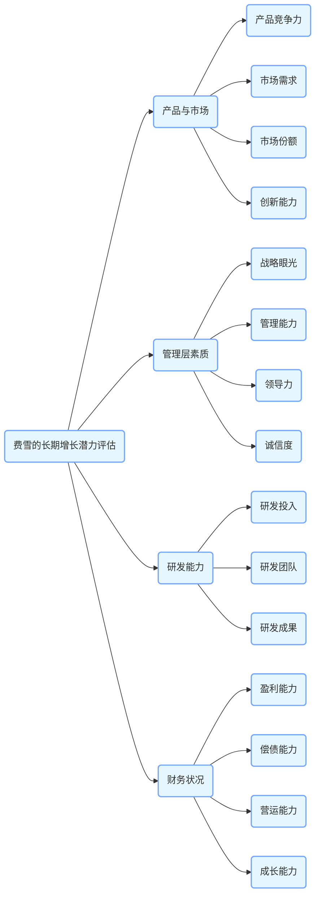

# 费雪的长期增长潜力评估

> 关键词：费雪、长期增长潜力评估、投资分析、财务指标、定性分析

> 摘要：本文围绕费雪的长期增长潜力评估展开，旨在深入剖析费雪所提出的评估企业长期增长潜力的方法和理论。详细介绍了费雪评估的背景知识，包括目的、预期读者等。阐述了核心概念及相互联系，通过Python代码展示核心算法原理和具体操作步骤，结合数学模型和公式进行理论说明并举例。以实际项目为案例，详细讲解开发环境搭建、源代码实现和代码解读。探讨了该评估方法在不同场景的实际应用，推荐了相关的学习资源、开发工具框架和论文著作。最后总结了未来发展趋势与挑战，解答常见问题并提供扩展阅读和参考资料，帮助读者全面掌握费雪的长期增长潜力评估方法。

## 1. 背景介绍 
### 1.1 目的和范围
费雪的长期增长潜力评估方法旨在帮助投资者筛选出具有长期增长潜力的企业，从而做出更明智的投资决策。该方法不仅仅关注企业的短期财务表现，更着重于评估企业在未来数年甚至数十年内的可持续增长能力。其范围涵盖了对企业多个方面的综合分析，包括但不限于企业的产品与市场、管理层素质、研发能力、财务状况等。通过这种全面的评估，投资者能够更准确地判断企业是否值得长期投资。

### 1.2 预期读者
本文的预期读者主要包括各类投资者，无论是个人投资者还是机构投资者，都可以从费雪的长期增长潜力评估方法中获得有益的启示。此外，金融分析师、企业管理者也能从中了解如何从投资者的角度评估企业的增长潜力，从而更好地制定企业战略和发展规划。对于学习金融、投资相关专业的学生来说，本文也是一个深入了解投资分析方法的重要参考资料。

### 1.3 文档结构概述
本文首先介绍费雪长期增长潜力评估的背景知识，包括目的、预期读者和文档结构等。接着阐述核心概念及相互联系，通过文本示意图和Mermaid流程图进行清晰展示。然后详细讲解核心算法原理和具体操作步骤，使用Python代码进行说明。再结合数学模型和公式，对评估方法进行理论上的详细讲解并举例。之后通过实际项目案例，介绍开发环境搭建、源代码实现和代码解读。探讨该评估方法在实际中的应用场景，推荐相关的学习资源、开发工具框架和论文著作。最后总结未来发展趋势与挑战，解答常见问题并提供扩展阅读和参考资料。

### 1.4 术语表
#### 1.4.1 核心术语定义
- **长期增长潜力**：指企业在未来较长时间内，能够持续实现营业收入、利润等关键指标增长的能力。这种增长不仅仅是数量上的增加，还包括企业在市场份额、技术创新、品牌影响力等方面的提升。
- **费雪评估方法**：由菲利普·费雪（Philip Fisher）提出的一种评估企业长期增长潜力的方法，该方法综合考虑企业的多个方面，包括企业的业务模式、管理层素质、研发能力、财务状况等，以判断企业是否具有长期投资价值。
- **定性分析**：基于对企业的非量化因素进行分析，如企业的管理层素质、企业文化、品牌形象等，以评估企业的长期增长潜力。
- **定量分析**：通过对企业的财务数据、市场数据等量化指标进行分析，如营业收入增长率、净利润率、资产负债率等，以评估企业的经营状况和增长潜力。

#### 1.4.2 相关概念解释
- **护城河理论**：与费雪的长期增长潜力评估相关的一个概念，由巴菲特提出。指企业拥有的一种可持续的竞争优势，能够保护企业的市场份额和利润，使其在竞争中脱颖而出。费雪的评估方法也关注企业是否具有类似的竞争优势，如独特的产品、强大的品牌、高效的供应链等。
- **成长股投资**：一种投资策略，专注于投资具有高增长潜力的股票。费雪的长期增长潜力评估方法为成长股投资提供了重要的分析工具，帮助投资者筛选出具有长期增长潜力的成长股。

#### 1.4.3 缩略词列表
- **EPS**：Earnings Per Share，每股收益，是指普通股股东每持有一股所能享有的企业净利润或需承担的企业净亏损。
- **ROE**：Return on Equity，净资产收益率，是衡量企业运用自有资本的效率指标，反映了股东权益的收益水平。

## 2. 核心概念与联系 

### 核心概念原理
费雪的长期增长潜力评估方法基于以下核心原理：企业的长期增长潜力取决于多个因素的综合作用，包括企业的产品与市场、管理层素质、研发能力、财务状况等。这些因素相互影响、相互作用，共同决定了企业的未来发展前景。

从产品与市场角度来看，企业需要拥有具有竞争力的产品或服务，能够满足市场需求，并且具有持续创新的能力，以适应市场变化。管理层素质是企业成功的关键因素之一，优秀的管理层能够制定正确的战略规划，有效地组织和管理企业资源，推动企业不断发展。研发能力是企业保持竞争力的重要保障，通过持续的研发投入，企业能够推出新的产品或服务，提高生产效率，降低成本。财务状况则反映了企业的经营稳定性和抗风险能力，良好的财务状况能够为企业的长期发展提供坚实的基础。

### 架构的文本示意图
```plaintext
费雪的长期增长潜力评估
|-- 产品与市场
|   |-- 产品竞争力
|   |-- 市场需求
|   |-- 市场份额
|   |-- 创新能力
|-- 管理层素质
|   |-- 战略眼光
|   |-- 管理能力
|   |-- 领导力
|   |-- 诚信度
|-- 研发能力
|   |-- 研发投入
|   |-- 研发团队
|   |-- 研发成果
|-- 财务状况
|   |-- 盈利能力
|   |-- 偿债能力
|   |-- 营运能力
|   |-- 成长能力
```

### Mermaid流程图


## 3. 核心算法原理 & 具体操作步骤 

### 核心算法原理
费雪的长期增长潜力评估并没有一个固定的、精确的算法公式，而是一种综合评估的方法。但可以通过一些量化指标和定性分析来进行评估。以下是一种简化的思路，通过计算综合得分来评估企业的长期增长潜力。

假设我们选取了$n$个评估指标，每个指标赋予一个权重$w_i$，其中$\sum_{i=1}^{n}w_i = 1$。每个指标对应一个得分$s_i$，则企业的综合得分$S$可以通过以下公式计算：

$$S=\sum_{i=1}^{n}w_i\times s_i$$

### 具体操作步骤

#### 步骤1：确定评估指标
根据费雪的评估方法，确定需要评估的指标，如产品竞争力、市场份额、管理层素质、研发投入等。

#### 步骤2：设定指标权重
根据各个指标的重要性，为每个指标设定相应的权重。例如，产品竞争力的权重可以设定为0.2，市场份额的权重设定为0.15等。

#### 步骤3：对每个指标进行评分
根据企业的实际情况，对每个指标进行评分，评分范围可以设定为0 - 10分。例如，产品竞争力方面，如果企业的产品具有很强的竞争力，可以评分为8分；如果竞争力较弱，可以评分为3分。

#### 步骤4：计算综合得分
根据上述公式，计算企业的综合得分。

### Python源代码实现
```python
# 定义评估指标
indicators = ['产品竞争力', '市场份额', '管理层素质', '研发投入']

# 定义指标权重
weights = [0.2, 0.15, 0.3, 0.35]

# 假设对某企业各指标的评分
scores = [8, 7, 9, 8]

# 计算综合得分
total_score = 0
for i in range(len(indicators)):
    total_score += weights[i] * scores[i]

print(f"该企业的综合得分是: {total_score}")
```

### 代码解释
1. **定义评估指标**：使用列表`indicators`存储需要评估的指标名称。
2. **定义指标权重**：使用列表`weights`存储每个指标的权重，权重之和为1。
3. **假设对某企业各指标的评分**：使用列表`scores`存储对某企业各指标的评分。
4. **计算综合得分**：通过循环遍历每个指标，将指标的权重乘以评分，并累加到`total_score`中。
5. **输出结果**：打印该企业的综合得分。

## 4. 数学模型和公式 & 详细讲解 & 举例说明 

### 数学模型
费雪的长期增长潜力评估的数学模型可以用上述提到的综合得分公式来表示：

$$S=\sum_{i=1}^{n}w_i\times s_i$$

其中，$S$表示企业的综合得分，反映了企业的长期增长潜力；$n$表示评估指标的数量；$w_i$表示第$i$个指标的权重；$s_i$表示第$i$个指标的得分。

### 详细讲解
- **权重$w_i$**：权重体现了每个指标在评估中的重要性。例如，在评估企业的长期增长潜力时，如果认为管理层素质对企业的发展至关重要，那么可以为管理层素质这个指标赋予较高的权重，如0.3。权重的设定需要根据具体的评估目的和实际情况进行调整。
- **得分$s_i$**：得分是对企业在每个指标上的表现进行量化的结果。得分的确定可以通过多种方式，如参考行业标准、对比竞争对手、进行专家评估等。例如，在评估产品竞争力时，可以根据产品的质量、价格、品牌等因素进行综合评估，给出一个0 - 10分的得分。
- **综合得分$S$**：综合得分是将各个指标的得分按照权重进行加权求和得到的结果。综合得分越高，说明企业的长期增长潜力越大。

### 举例说明
假设我们要评估两家企业A和B的长期增长潜力，选取了以下四个评估指标：产品竞争力、市场份额、管理层素质、研发投入。各指标的权重分别为0.2、0.15、0.3、0.35。对两家企业各指标的评分如下表所示：

| 企业 | 产品竞争力（得分） | 市场份额（得分） | 管理层素质（得分） | 研发投入（得分） |
| ---- | ---- | ---- | ---- | ---- |
| A | 8 | 7 | 9 | 8 |
| B | 7 | 8 | 8 | 9 |

#### 计算企业A的综合得分
$$
\begin{align*}
S_A&=0.2\times8 + 0.15\times7 + 0.3\times9 + 0.35\times8\\
&=1.6 + 1.05 + 2.7 + 2.8\\
&=8.15
\end{align*}
$$

#### 计算企业B的综合得分
$$
\begin{align*}
S_B&=0.2\times7 + 0.15\times8 + 0.3\times8 + 0.35\times9\\
&=1.4 + 1.2 + 2.4 + 3.15\\
&=8.15
\end{align*}
$$

从计算结果可以看出，企业A和企业B的综合得分相同，说明在当前的评估体系下，两家企业的长期增长潜力相当。但在实际评估中，还需要进一步分析每个指标的具体情况，以及考虑其他未纳入评估体系的因素。

## 5. 项目实战：代码实际案例和详细解释说明 

### 5.1  开发环境搭建
#### 安装Python
首先需要安装Python，建议安装Python 3.7及以上版本。可以从Python官方网站（https://www.python.org/downloads/）下载对应操作系统的安装包，按照安装向导进行安装。

#### 安装必要的库
在进行费雪的长期增长潜力评估项目时，可能需要用到一些Python库，如`pandas`用于数据处理，`numpy`用于数值计算。可以使用以下命令进行安装：
```sh
pip install pandas numpy
```

### 5.2  源代码详细实现和代码解读

```python
import pandas as pd
import numpy as np

# 定义评估指标
indicators = ['产品竞争力', '市场份额', '管理层素质', '研发投入']

# 定义指标权重
weights = np.array([0.2, 0.15, 0.3, 0.35])

# 读取企业数据
data = pd.read_csv('enterprise_data.csv')

# 初始化综合得分列表
total_scores = []

# 遍历每家企业的数据
for index, row in data.iterrows():
    scores = np.array([row[indicator] for indicator in indicators])
    total_score = np.dot(weights, scores)
    total_scores.append(total_score)

# 将综合得分添加到数据框中
data['综合得分'] = total_scores

# 按照综合得分降序排序
sorted_data = data.sort_values(by='综合得分', ascending=False)

# 输出排名前三的企业
top_three = sorted_data.head(3)
print("排名前三的企业：")
print(top_three)
```

### 代码解读
1. **导入必要的库**：导入`pandas`和`numpy`库，用于数据处理和数值计算。
2. **定义评估指标和权重**：定义需要评估的指标和每个指标的权重，使用`numpy`数组存储权重。
3. **读取企业数据**：使用`pandas`的`read_csv`函数读取存储企业数据的CSV文件。假设CSV文件的列名与评估指标一致。
4. **初始化综合得分列表**：创建一个空列表`total_scores`，用于存储每家企业的综合得分。
5. **遍历每家企业的数据**：使用`iterrows`方法遍历数据框中的每一行，获取每家企业各指标的得分，使用`numpy`的`dot`函数计算综合得分，并将其添加到`total_scores`列表中。
6. **将综合得分添加到数据框中**：使用`data['综合得分'] = total_scores`将综合得分添加到数据框中。
7. **按照综合得分降序排序**：使用`sort_values`方法对数据框按照综合得分进行降序排序。
8. **输出排名前三的企业**：使用`head(3)`方法选取排名前三的企业，并打印输出。

### 5.3  代码解读与分析
- **数据处理**：使用`pandas`库可以方便地读取和处理企业数据，将数据存储在数据框中，便于进行后续的计算和分析。
- **数值计算**：使用`numpy`库的`dot`函数可以高效地计算综合得分，避免了使用循环进行手动计算，提高了代码的执行效率。
- **排序和筛选**：使用`pandas`的`sort_values`和`head`方法可以方便地对企业进行排序和筛选，找出排名前三的企业。

通过这个项目实战，我们可以看到如何使用Python代码实现费雪的长期增长潜力评估，并对多家企业进行排名和筛选。

## 6. 实际应用场景 
### 股票投资
在股票投资领域，费雪的长期增长潜力评估方法可以帮助投资者筛选出具有长期增长潜力的股票。投资者可以使用该方法对不同企业进行评估，选择综合得分较高的企业进行投资。通过长期持有这些具有增长潜力的股票，投资者有望获得较高的投资回报。

### 企业战略规划
企业管理者可以使用费雪的评估方法来评估自身企业的长期增长潜力，找出企业的优势和劣势。根据评估结果，企业可以制定相应的战略规划，加强优势领域的发展，改进劣势领域的不足，从而提升企业的长期竞争力。

### 风险投资
风险投资机构在选择投资项目时，需要评估项目的长期增长潜力。费雪的评估方法可以为风险投资机构提供一个全面的评估框架，帮助他们筛选出具有高增长潜力的项目进行投资。

### 行业研究
研究机构可以使用费雪的评估方法对某个行业内的企业进行评估，了解行业内企业的整体增长潜力和竞争格局。通过对行业内企业的长期增长潜力进行比较和分析，研究机构可以为行业发展提供有价值的建议和预测。

## 7. 工具和资源推荐
### 7.1 学习资源推荐
#### 7.1.1 书籍推荐
- 《怎样选择成长股》（Common Stocks and Uncommon Profits）：菲利普·费雪的经典著作，详细阐述了他的投资理念和长期增长潜力评估方法，是学习费雪投资理论的必读之书。
- 《聪明的投资者》（The Intelligent Investor）：本杰明·格雷厄姆的经典著作，虽然侧重于价值投资，但其中也包含了很多关于企业分析和评估的方法，与费雪的评估方法相互补充。
- 《财务报表分析与证券定价》（Financial Statement Analysis and Security Valuation）：这本书系统地介绍了财务报表分析的方法和技术，对于理解企业的财务状况和增长潜力具有重要的帮助。

#### 7.1.2 在线课程
- Coursera上的“投资学原理”（Principles of Investing）课程：该课程由知名教授授课，涵盖了投资学的基本原理和方法，包括企业估值、投资组合管理等内容，对学习费雪的长期增长潜力评估方法有一定的帮助。
- edX上的“财务报表分析”（Financial Statement Analysis）课程：该课程深入讲解了财务报表分析的方法和技巧，通过实际案例分析帮助学员掌握如何从财务报表中评估企业的增长潜力。

#### 7.1.3 技术博客和网站
- 雪球网（https://xueqiu.com/）：国内知名的投资社区，有很多投资者分享自己的投资经验和研究成果，其中不乏对企业长期增长潜力的分析和评估。
- Seeking Alpha（https://seekingalpha.com/）：国外知名的金融投资网站，提供大量的股票分析报告和投资建议，对于学习费雪的评估方法和了解市场动态有很大的帮助。

### 7.2 开发工具框架推荐
#### 7.2.1 IDE和编辑器
- PyCharm：一款专业的Python集成开发环境，具有强大的代码编辑、调试和分析功能，适合进行Python项目的开发。
- Jupyter Notebook：一个交互式的开发环境，支持Python代码的编写和运行，同时可以方便地展示代码的执行结果和可视化图表，适合进行数据分析和实验。

#### 7.2.2 调试和性能分析工具
- pdb：Python自带的调试工具，可以帮助开发者定位代码中的问题和错误。
- cProfile：Python的性能分析工具，可以分析代码的执行时间和资源消耗情况，帮助开发者优化代码性能。

#### 7.2.3 相关框架和库
- pandas：一个强大的数据处理和分析库，提供了丰富的数据结构和函数，方便进行数据的读取、清洗、处理和分析。
- numpy：一个用于数值计算的Python库，提供了高效的数组和矩阵运算功能，是进行数据分析和科学计算的基础库。
- matplotlib：一个用于数据可视化的Python库，可以绘制各种类型的图表，如折线图、柱状图、散点图等，帮助开发者直观地展示数据。

### 7.3 相关论文著作推荐
#### 7.3.1 经典论文
- "The Superinvestors of Graham-and-Doddsville"：沃伦·巴菲特的经典论文，介绍了价值投资的理念和方法，与费雪的长期增长潜力评估方法有一定的关联。
- "Earnings, Book Values, and Dividends in Equity Valuation"：该论文探讨了企业盈利、账面价值和股息在股票估值中的作用，对于理解企业的财务状况和增长潜力具有重要的参考价值。

#### 7.3.2 最新研究成果
- 可以关注《Journal of Financial Economics》、《The Review of Financial Studies》等知名金融学术期刊，这些期刊会发表关于企业估值、投资分析等方面的最新研究成果。

#### 7.3.3 应用案例分析
- 可以查阅一些投资研究机构发布的研究报告，其中会包含对具体企业的长期增长潜力评估和投资分析案例，通过学习这些案例可以更好地掌握费雪的评估方法。

## 8. 总结：未来发展趋势与挑战
### 未来发展趋势
- **数据驱动的评估方法**：随着信息技术的不断发展，企业的数据量越来越大，数据的质量和可用性也越来越高。未来，费雪的长期增长潜力评估方法可能会更多地结合大数据和人工智能技术，通过对海量数据的分析和挖掘，更准确地评估企业的长期增长潜力。
- **跨学科的综合评估**：企业的长期增长潜力受到多个因素的影响，包括经济、技术、社会、环境等。未来的评估方法可能会更加注重跨学科的综合评估，将经济学、管理学、技术学、社会学等多个学科的知识和方法相结合，提供更全面、更深入的评估结果。
- **个性化的投资建议**：不同的投资者有不同的投资目标、风险偏好和投资期限。未来，费雪的评估方法可能会更加注重个性化的投资建议，根据投资者的具体情况，为其提供定制化的投资方案。

### 挑战
- **数据质量和可靠性**：数据是评估企业长期增长潜力的基础，但数据的质量和可靠性可能会受到多种因素的影响，如数据的准确性、完整性、及时性等。如何确保数据的质量和可靠性是未来面临的一个重要挑战。
- **模型的准确性和稳定性**：费雪的评估方法通常需要建立数学模型来进行量化分析，但模型的准确性和稳定性可能会受到多种因素的影响，如模型的假设条件、参数的选择等。如何提高模型的准确性和稳定性是未来需要解决的一个关键问题。
- **市场的不确定性**：企业的长期增长潜力受到市场环境的影响，而市场环境是充满不确定性的。如何在不确定的市场环境中准确地评估企业的长期增长潜力是未来面临的一个巨大挑战。

## 9. 附录：常见问题与解答
### 问题1：费雪的长期增长潜力评估方法是否适用于所有行业？
答：费雪的评估方法具有一定的通用性，但不同行业的企业具有不同的特点和发展规律，因此在应用该方法时需要根据行业的特点进行适当的调整。例如，对于高科技行业的企业，研发能力和创新能力可能更为重要；而对于传统制造业的企业，生产效率和成本控制可能更为关键。

### 问题2：如何确定评估指标的权重？
答：确定评估指标的权重需要综合考虑多个因素，包括指标的重要性、数据的可获取性、评估的目的等。可以采用专家评估法、层次分析法等方法来确定指标的权重。在实际应用中，也可以根据经验和历史数据进行调整和优化。

### 问题3：费雪的评估方法是否可以完全替代其他投资分析方法？
答：费雪的评估方法是一种重要的投资分析方法，但不能完全替代其他投资分析方法。不同的投资分析方法具有不同的特点和适用范围，在进行投资决策时，需要综合运用多种方法，从不同的角度对企业进行评估和分析，以提高投资决策的准确性和可靠性。

## 10. 扩展阅读 & 参考资料
### 扩展阅读
- 《投资最重要的事》（The Most Important Thing Illuminated）：霍华德·马克斯的著作，探讨了投资中的一些重要理念和方法，对于深入理解投资分析和决策具有重要的启示。
- 《金融炼金术》（The Alchemy of Finance）：乔治·索罗斯的著作，介绍了他的投资哲学和操作方法，对投资者的思维方式和投资策略有很大的启发。

### 参考资料
- Fisher, Philip A. Common Stocks and Uncommon Profits. Harper & Row, 1958.
- Graham, Benjamin. The Intelligent Investor. HarperBusiness, 2003.
- Penman, Stephen H. Financial Statement Analysis and Security Valuation. McGraw-Hill Education, 2018.

作者：AI天才研究院/AI Genius Institute & 禅与计算机程序设计艺术 /Zen And The Art of Computer Programming