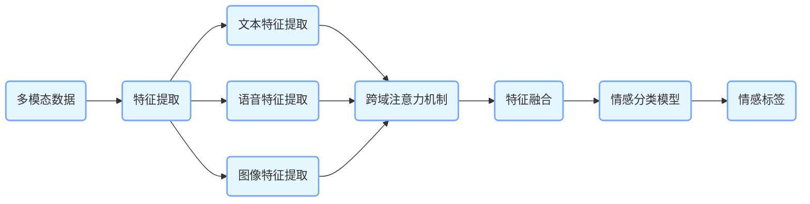

# 跨域注意力机制在多模态情感分析中的应用

> 关键词：跨域注意力机制、多模态情感分析、深度学习、特征融合、情感识别

> 摘要：本文深入探讨了跨域注意力机制在多模态情感分析中的应用。多模态情感分析旨在综合文本、语音、视觉等多种模态信息来准确识别情感，而跨域注意力机制能够有效地捕捉不同模态之间的关联和重要信息，提升情感分析的性能。文章首先介绍了相关背景知识，包括目的和范围、预期读者等；接着阐述了核心概念与联系，给出了原理和架构的示意图及流程图；详细讲解了核心算法原理并结合 Python 代码进行说明；探讨了相关的数学模型和公式；通过项目实战展示了代码实现和解读；分析了实际应用场景；推荐了学习、开发相关的工具和资源；最后总结了未来发展趋势与挑战，并给出常见问题解答和参考资料。

## 1. 背景介绍 
### 1.1 目的和范围
多模态情感分析是人工智能领域的一个重要研究方向，其目的是通过融合多种模态的数据，如文本、语音、图像等，来更准确地理解人类的情感状态。传统的单模态情感分析方法往往受到单一信息源的限制，无法全面地捕捉情感信息。而跨域注意力机制为多模态情感分析提供了一种有效的手段，能够在不同模态之间进行信息交互和权重分配，从而提高情感分析的准确性和鲁棒性。

本文的范围涵盖了跨域注意力机制的基本原理、在多模态情感分析中的应用算法、相关数学模型、实际项目案例以及未来发展趋势等方面，旨在为读者全面深入地了解跨域注意力机制在多模态情感分析中的应用提供参考。

### 1.2 预期读者
本文预期读者包括对人工智能、深度学习、自然语言处理、计算机视觉等领域感兴趣的研究人员、学生和工程师。对于希望深入了解多模态情感分析技术以及跨域注意力机制应用的专业人士，本文将提供有价值的技术知识和实践经验。

### 1.3 文档结构概述
本文按照以下结构进行组织：
1. **背景介绍**：介绍文章的目的、范围、预期读者和文档结构，以及相关术语的定义和解释。
2. **核心概念与联系**：阐述跨域注意力机制和多模态情感分析的核心概念，给出原理和架构的文本示意图和 Mermaid 流程图。
3. **核心算法原理 & 具体操作步骤**：详细讲解跨域注意力机制在多模态情感分析中的核心算法原理，并使用 Python 源代码进行说明。
4. **数学模型和公式 & 详细讲解 & 举例说明**：介绍相关的数学模型和公式，并通过具体例子进行详细讲解。
5. **项目实战：代码实际案例和详细解释说明**：通过实际项目案例，展示跨域注意力机制在多模态情感分析中的代码实现和详细解释。
6. **实际应用场景**：分析跨域注意力机制在多模态情感分析中的实际应用场景。
7. **工具和资源推荐**：推荐学习、开发相关的工具和资源，包括书籍、在线课程、技术博客、IDE、调试工具、相关框架和库以及论文著作等。
8. **总结：未来发展趋势与挑战**：总结跨域注意力机制在多模态情感分析中的未来发展趋势和面临的挑战。
9. **附录：常见问题与解答**：解答读者在学习和实践过程中可能遇到的常见问题。
10. **扩展阅读 & 参考资料**：提供扩展阅读的建议和参考资料列表。

### 1.4 术语表
#### 1.4.1 核心术语定义
- **跨域注意力机制**：一种能够在不同领域或模态之间进行信息交互和权重分配的注意力机制，用于捕捉不同模态之间的关联和重要信息。
- **多模态情感分析**：综合文本、语音、视觉等多种模态信息来识别和理解人类情感状态的技术。
- **模态**：指数据的不同形式，如文本、语音、图像等。
- **注意力权重**：在注意力机制中，用于衡量不同信息的重要程度的权重值。

#### 1.4.2 相关概念解释
- **特征融合**：将不同模态的特征进行整合，以获取更全面和丰富的信息。
- **深度学习**：一种基于人工神经网络的机器学习方法，能够自动学习数据的特征和模式。
- **情感识别**：从数据中识别和分类出不同的情感状态，如积极、消极、中性等。

#### 1.4.3 缩略词列表
- **CNN**：卷积神经网络（Convolutional Neural Network）
- **RNN**：循环神经网络（Recurrent Neural Network）
- **LSTM**：长短期记忆网络（Long Short-Term Memory）
- **GRU**：门控循环单元（Gated Recurrent Unit）
- **Transformer**：一种基于注意力机制的深度学习模型

## 2. 核心概念与联系 

### 2.1 跨域注意力机制原理
跨域注意力机制的核心思想是在不同模态之间建立联系，通过计算注意力权重来突出重要信息。传统的注意力机制主要关注同一模态内的信息，而跨域注意力机制则扩展到不同模态之间。

假设我们有两种模态的数据，分别为 $X = [x_1, x_2, \cdots, x_n]$ 和 $Y = [y_1, y_2, \cdots, y_m]$，其中 $x_i$ 和 $y_j$ 分别表示第 $i$ 个和第 $j$ 个特征向量。跨域注意力机制通过计算注意力分数 $e_{ij}$ 来衡量 $x_i$ 和 $y_j$ 之间的相关性：

$$e_{ij} = f(x_i, y_j)$$

其中 $f$ 是一个相关性函数，常见的有内积、拼接后线性变换等。然后通过 softmax 函数将注意力分数转换为注意力权重 $\alpha_{ij}$：

$$\alpha_{ij} = \frac{\exp(e_{ij})}{\sum_{k=1}^{m} \exp(e_{ik})}$$

最后，根据注意力权重对 $Y$ 进行加权求和，得到与 $x_i$ 相关的上下文向量 $c_i$：

$$c_i = \sum_{j=1}^{m} \alpha_{ij} y_j$$

### 2.2 多模态情感分析原理
多模态情感分析的目标是综合多种模态的信息来准确识别情感。一般来说，多模态情感分析包括以下几个步骤：
1. **数据采集**：收集文本、语音、图像等多种模态的数据。
2. **特征提取**：从不同模态的数据中提取特征，如文本的词向量、语音的声学特征、图像的视觉特征等。
3. **特征融合**：将不同模态的特征进行融合，以获取更全面和丰富的信息。
4. **情感分类**：使用分类模型对融合后的特征进行分类，得到情感标签。

### 2.3 跨域注意力机制与多模态情感分析的联系
跨域注意力机制在多模态情感分析中起着关键作用。它能够帮助模型更好地捕捉不同模态之间的关联和重要信息，从而提高情感分析的性能。具体来说，跨域注意力机制可以用于以下几个方面：
- **特征融合**：在特征融合阶段，跨域注意力机制可以根据不同模态特征之间的相关性，动态地调整融合的权重，使得模型更加关注重要的信息。
- **信息交互**：跨域注意力机制可以促进不同模态之间的信息交互，使得模型能够综合考虑多种模态的信息来进行情感分析。

### 2.4 文本示意图
```plaintext
多模态数据（文本、语音、图像）
|
|-- 特征提取
|   |-- 文本特征提取（词向量等）
|   |-- 语音特征提取（声学特征等）
|   |-- 图像特征提取（视觉特征等）
|
|-- 跨域注意力机制
|   |-- 计算注意力权重
|   |-- 加权求和得到上下文向量
|
|-- 特征融合
|
|-- 情感分类模型
|   |-- 输出情感标签
```

### 2.5 Mermaid 流程图


## 3. 核心算法原理 & 具体操作步骤 

### 3.1 跨域注意力机制算法原理
跨域注意力机制的核心是计算注意力权重和加权求和。下面是一个简化的跨域注意力机制的 Python 代码实现：

```python
import torch
import torch.nn as nn

class CrossDomainAttention(nn.Module):
    def __init__(self, input_dim1, input_dim2):
        super(CrossDomainAttention, self).__init__()
        self.linear1 = nn.Linear(input_dim1, input_dim2)
        self.softmax = nn.Softmax(dim=-1)

    def forward(self, x1, x2):
        # x1: [batch_size, seq_len1, input_dim1]
        # x2: [batch_size, seq_len2, input_dim2]
        attn_scores = torch.matmul(self.linear1(x1), x2.transpose(-2, -1))  # [batch_size, seq_len1, seq_len2]
        attn_weights = self.softmax(attn_scores)  # [batch_size, seq_len1, seq_len2]
        context = torch.matmul(attn_weights, x2)  # [batch_size, seq_len1, input_dim2]
        return context, attn_weights
```

### 3.2 具体操作步骤
1. **数据准备**：收集多模态数据，包括文本、语音、图像等，并进行预处理，如分词、特征提取等。
2. **特征提取**：使用合适的模型（如 CNN、RNN 等）从不同模态的数据中提取特征。
3. **跨域注意力机制计算**：将不同模态的特征输入到跨域注意力机制中，计算注意力权重和上下文向量。
4. **特征融合**：将上下文向量与原始特征进行融合，可以采用拼接、加权求和等方式。
5. **情感分类**：使用分类模型（如全连接层、卷积层等）对融合后的特征进行分类，得到情感标签。

### 3.3 完整代码示例
```python
import torch
import torch.nn as nn

# 定义跨域注意力机制
class CrossDomainAttention(nn.Module):
    def __init__(self, input_dim1, input_dim2):
        super(CrossDomainAttention, self).__init__()
        self.linear1 = nn.Linear(input_dim1, input_dim2)
        self.softmax = nn.Softmax(dim=-1)

    def forward(self, x1, x2):
        attn_scores = torch.matmul(self.linear1(x1), x2.transpose(-2, -1))
        attn_weights = self.softmax(attn_scores)
        context = torch.matmul(attn_weights, x2)
        return context, attn_weights

# 定义多模态情感分析模型
class MultiModalSentimentAnalysis(nn.Module):
    def __init__(self, text_dim, audio_dim, visual_dim, hidden_dim, num_classes):
        super(MultiModalSentimentAnalysis, self).__init__()
        self.cross_attn_text_audio = CrossDomainAttention(text_dim, audio_dim)
        self.cross_attn_text_visual = CrossDomainAttention(text_dim, visual_dim)
        self.fc1 = nn.Linear(text_dim + audio_dim + visual_dim, hidden_dim)
        self.relu = nn.ReLU()
        self.fc2 = nn.Linear(hidden_dim, num_classes)

    def forward(self, text_features, audio_features, visual_features):
        # 计算跨域注意力
        text_audio_context, _ = self.cross_attn_text_audio(text_features, audio_features)
        text_visual_context, _ = self.cross_attn_text_visual(text_features, visual_features)

        # 特征融合
        fused_features = torch.cat((text_features, text_audio_context, text_visual_context), dim=-1)

        # 情感分类
        out = self.fc1(fused_features)
        out = self.relu(out)
        out = self.fc2(out)
        return out
```

## 4. 数学模型和公式 & 详细讲解 & 举例说明 

### 4.1 跨域注意力机制数学模型
如前面所述，跨域注意力机制的数学模型主要包括注意力分数计算、注意力权重计算和上下文向量计算。

#### 注意力分数计算
注意力分数 $e_{ij}$ 用于衡量 $x_i$ 和 $y_j$ 之间的相关性，常见的计算方式有：
- **内积**：$e_{ij} = x_i^T y_j$
- **拼接后线性变换**：$e_{ij} = W^T [x_i; y_j]$，其中 $W$ 是可学习的权重矩阵。

#### 注意力权重计算
通过 softmax 函数将注意力分数转换为注意力权重：

$$\alpha_{ij} = \frac{\exp(e_{ij})}{\sum_{k=1}^{m} \exp(e_{ik})}$$

#### 上下文向量计算
根据注意力权重对 $Y$ 进行加权求和，得到上下文向量 $c_i$：

$$c_i = \sum_{j=1}^{m} \alpha_{ij} y_j$$

### 4.2 详细讲解
跨域注意力机制的核心思想是通过注意力权重来突出不同模态之间的重要信息。在计算注意力分数时，我们可以根据不同的任务和数据特点选择合适的计算方式。内积计算简单高效，但对于不同维度的特征可能不太适用；拼接后线性变换则可以通过学习权重矩阵来更好地捕捉特征之间的关系。

在计算注意力权重时，softmax 函数将注意力分数转换为概率分布，使得所有注意力权重之和为 1。这样可以确保在加权求和时，每个特征向量的贡献是合理的。

最后，上下文向量 $c_i$ 是根据注意力权重对 $Y$ 进行加权求和得到的，它综合了 $Y$ 中与 $x_i$ 相关的信息。

### 4.3 举例说明
假设我们有两个模态的数据：文本特征 $X = [[1, 2], [3, 4]]$ 和语音特征 $Y = [[5, 6], [7, 8]]$。我们使用内积计算注意力分数：

$$e_{11} = [1, 2]^T [5, 6] = 1\times5 + 2\times6 = 17$$
$$e_{12} = [1, 2]^T [7, 8] = 1\times7 + 2\times8 = 23$$
$$e_{21} = [3, 4]^T [5, 6] = 3\times5 + 4\times6 = 39$$
$$e_{22} = [3, 4]^T [7, 8] = 3\times7 + 4\times8 = 53$$

然后计算注意力权重：

$$\alpha_{11} = \frac{\exp(17)}{\exp(17) + \exp(23)} \approx 0.0025$$
$$\alpha_{12} = \frac{\exp(23)}{\exp(17) + \exp(23)} \approx 0.9975$$
$$\alpha_{21} = \frac{\exp(39)}{\exp(39) + \exp(53)} \approx 0.0000$$
$$\alpha_{22} = \frac{\exp(53)}{\exp(39) + \exp(53)} \approx 1.0000$$

最后计算上下文向量：

$$c_1 = \alpha_{11} [5, 6] + \alpha_{12} [7, 8] \approx 0.0025 [5, 6] + 0.9975 [7, 8] \approx [6.995, 7.995]$$
$$c_2 = \alpha_{21} [5, 6] + \alpha_{22} [7, 8] \approx 0.0000 [5, 6] + 1.0000 [7, 8] \approx [7, 8]$$

## 5. 项目实战：代码实际案例和详细解释说明 

### 5.1  开发环境搭建
在进行跨域注意力机制在多模态情感分析中的项目实战之前，需要搭建相应的开发环境。以下是一些主要的步骤：
1. **安装 Python**：建议使用 Python 3.6 及以上版本。
2. **安装深度学习框架**：推荐使用 PyTorch，安装命令如下：
```bash
pip install torch torchvision
```
3. **安装其他依赖库**：根据项目需求，可能需要安装一些其他的库，如 numpy、pandas、matplotlib 等。
```bash
pip install numpy pandas matplotlib
```

### 5.2  源代码详细实现和代码解读
以下是一个完整的跨域注意力机制在多模态情感分析中的项目实战代码示例：

```python
import torch
import torch.nn as nn
import torch.optim as optim
from torch.utils.data import Dataset, DataLoader
import numpy as np

#