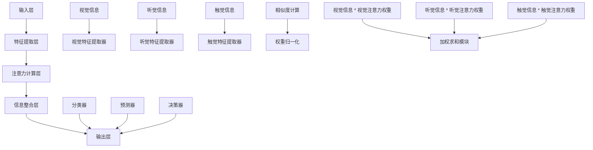

# 跨感官注意力机制:整合多源感知信息

> 关键词：跨感官注意力机制、多源感知信息、信息整合、深度学习、认知计算

> 摘要：本文聚焦于跨感官注意力机制，旨在深入探讨如何整合多源感知信息。首先介绍了跨感官注意力机制的研究背景、目的、预期读者和文档结构等内容。接着详细阐述了核心概念与联系，包括其原理和架构，并给出相应的文本示意图和 Mermaid 流程图。然后对核心算法原理进行讲解，结合 Python 源代码展示具体操作步骤。同时，通过数学模型和公式对其进行理论支持，并举例说明。在项目实战部分，给出了开发环境搭建、源代码实现及代码解读。还分析了实际应用场景，推荐了相关的学习资源、开发工具框架和论文著作。最后总结了未来发展趋势与挑战，并提供常见问题解答和扩展阅读参考资料，为该领域的研究和应用提供全面而深入的指导。

## 1. 背景介绍 
### 1.1 目的和范围
在现实世界中，人类通过多种感官（如视觉、听觉、触觉等）获取信息，并能自然地整合这些多源感知信息，以做出准确的决策和反应。然而，在人工智能和计算机科学领域，如何让机器具备类似的跨感官信息整合能力，是一个具有挑战性但又极具潜力的研究方向。跨感官注意力机制的研究目的就是模拟人类的这种能力，使机器能够更好地处理和理解多源感知信息，从而提升其在各种任务中的性能，如智能机器人导航、多媒体内容分析、虚拟现实交互等。

本文章的范围涵盖了跨感官注意力机制的基本概念、核心算法原理、数学模型、项目实战、实际应用场景以及相关的工具和资源推荐等方面。通过对这些内容的详细阐述，帮助读者全面了解跨感官注意力机制，并为其在实际项目中的应用提供指导。

### 1.2 预期读者
本文的预期读者主要包括人工智能、计算机科学、认知科学等领域的研究人员和开发者。对于那些对多模态信息处理、深度学习算法感兴趣的学生和爱好者，本文也提供了一个深入学习跨感官注意力机制的良好途径。此外，从事智能机器人、虚拟现实、多媒体技术等相关行业的工程师和技术人员，也可以从本文中获取关于跨感官注意力机制的实际应用和开发经验。

### 1.3 文档结构概述
本文将按照以下结构进行组织：
- 核心概念与联系：介绍跨感官注意力机制的基本概念、原理和架构，并通过文本示意图和 Mermaid 流程图进行直观展示。
- 核心算法原理 & 具体操作步骤：详细讲解跨感官注意力机制的核心算法，结合 Python 源代码说明具体的操作步骤。
- 数学模型和公式 & 详细讲解 & 举例说明：使用数学模型和公式对跨感官注意力机制进行理论分析，并通过具体例子加深读者的理解。
- 项目实战：代码实际案例和详细解释说明：给出一个实际的项目案例，包括开发环境搭建、源代码实现和代码解读。
- 实际应用场景：分析跨感官注意力机制在不同领域的实际应用场景。
- 工具和资源推荐：推荐相关的学习资源、开发工具框架和论文著作。
- 总结：未来发展趋势与挑战：总结跨感官注意力机制的发展趋势，并分析其面临的挑战。
- 附录：常见问题与解答：解答读者在学习和应用跨感官注意力机制过程中可能遇到的常见问题。
- 扩展阅读 & 参考资料：提供相关的扩展阅读材料和参考资料，方便读者进一步深入学习。

### 1.4 术语表
#### 1.4.1 核心术语定义
- **跨感官注意力机制**：一种能够处理和整合来自不同感官通道（如视觉、听觉、触觉等）信息的注意力机制，通过对多源感知信息的加权分配，使模型能够更加聚焦于重要的信息。
- **多源感知信息**：指来自不同感官通道的信息，如视觉图像、听觉音频、触觉信号等。
- **注意力权重**：在注意力机制中，用于衡量每个输入信息的重要程度的数值，通过对输入信息进行加权求和，突出重要信息。
- **信息整合**：将来自不同源的信息进行融合和处理，以获得更全面、准确的信息表示。

#### 1.4.2 相关概念解释
- **深度学习**：一种基于人工神经网络的机器学习方法，通过多层神经网络自动学习数据的特征和模式，在图像识别、语音识别等领域取得了显著的成果。
- **多模态学习**：研究如何处理和整合来自不同模态（如文本、图像、音频等）信息的学习方法，旨在利用不同模态信息之间的互补性，提高模型的性能。
- **认知计算**：模拟人类的认知过程，使计算机能够理解、推理和学习，从而更好地处理复杂的信息和任务。

#### 1.4.3 缩略词列表
- **CNN**：Convolutional Neural Network，卷积神经网络
- **RNN**：Recurrent Neural Network，循环神经网络
- **LSTM**：Long Short-Term Memory，长短期记忆网络
- **Transformer**：一种基于注意力机制的深度学习模型架构

## 2. 核心概念与联系 
### 核心概念原理
跨感官注意力机制的核心原理是模拟人类大脑在处理多源感知信息时的注意力分配过程。人类大脑能够根据当前的任务和环境，自动地将注意力集中在某些感官信息上，而忽略其他不重要的信息。在跨感官注意力机制中，通过引入注意力权重，对来自不同感官通道的信息进行加权求和，从而突出重要的信息，抑制不重要的信息。

具体来说，跨感官注意力机制通常包括以下几个步骤：
1. **特征提取**：从不同的感官通道中提取特征，例如使用卷积神经网络（CNN）提取视觉图像的特征，使用循环神经网络（RNN）或长短期记忆网络（LSTM）提取听觉音频的特征。
2. **注意力计算**：根据提取的特征，计算每个感官信息的注意力权重。注意力权重的计算通常基于特征之间的相似度或相关性，例如使用点积注意力、缩放点积注意力等方法。
3. **信息整合**：将每个感官信息乘以对应的注意力权重，然后进行加权求和，得到整合后的信息表示。
4. **任务处理**：使用整合后的信息表示进行具体的任务处理，例如分类、预测、决策等。

### 架构的文本示意图
以下是跨感官注意力机制的架构文本示意图：

```
输入层：
|-- 视觉信息（图像）
|-- 听觉信息（音频）
|-- 触觉信息（信号）
|--...

特征提取层：
|-- 视觉特征提取器（CNN）
|-- 听觉特征提取器（RNN/LSTM）
|-- 触觉特征提取器（自定义网络）
|--...

注意力计算层：
|-- 注意力权重计算模块
|   |-- 相似度计算
|   |-- 权重归一化
|--...

信息整合层：
|-- 加权求和模块
|   |-- 视觉信息 * 视觉注意力权重
|   |-- 听觉信息 * 听觉注意力权重
|   |-- 触觉信息 * 触觉注意力权重
|   |--...

输出层：
|-- 任务处理模块
|   |-- 分类器
|   |-- 预测器
|   |-- 决策器
|   |--...
```

### Mermaid 流程图


## 3. 核心算法原理 & 具体操作步骤 
### 核心算法原理
跨感官注意力机制的核心算法主要基于注意力机制的原理，其中最常用的是缩放点积注意力（Scaled Dot-Product Attention）。缩放点积注意力的计算公式如下：

$$Attention(Q, K, V) = softmax(\frac{QK^T}{\sqrt{d_k}})V$$

其中，$Q$ 是查询矩阵（Query），$K$ 是键矩阵（Key），$V$ 是值矩阵（Value），$d_k$ 是键向量的维度。$QK^T$ 计算查询向量与键向量之间的相似度，$\frac{1}{\sqrt{d_k}}$ 是缩放因子，用于防止点积结果过大。最后，通过 softmax 函数将相似度转换为注意力权重，并与值矩阵 $V$ 相乘，得到加权求和后的输出。

在跨感官注意力机制中，$Q$、$K$ 和 $V$ 可以分别来自不同的感官通道的特征表示。例如，$Q$ 可以是视觉特征，$K$ 和 $V$ 可以是听觉特征，通过计算视觉特征与听觉特征之间的注意力权重，实现跨感官信息的整合。

### 具体操作步骤
以下是使用 Python 和 PyTorch 实现缩放点积注意力的具体代码：

```python
import torch
import torch.nn as nn

class ScaledDotProductAttention(nn.Module):
    def __init__(self, d_k):
        super(ScaledDotProductAttention, self).__init__()
        self.d_k = d_k

    def forward(self, q, k, v, mask=None):
        attn_scores = torch.matmul(q, k.transpose(-2, -1)) / torch.sqrt(torch.tensor(self.d_k, dtype=torch.float32))
        if mask is not None:
            attn_scores = attn_scores.masked_fill(mask == 0, -1e9)
        attn_weights = torch.softmax(attn_scores, dim=-1)
        output = torch.matmul(attn_weights, v)
        return output, attn_weights

# 示例使用
d_k = 64
batch_size = 32
seq_len = 10
input_dim = 64

q = torch.randn(batch_size, seq_len, d_k)
k = torch.randn(batch_size, seq_len, d_k)
v = torch.randn(batch_size, seq_len, input_dim)

attention_layer = ScaledDotProductAttention(d_k)
output, attn_weights = attention_layer(q, k, v)

print("Output shape:", output.shape)
print("Attention weights shape:", attn_weights.shape)
```

### 代码解释
1. **`ScaledDotProductAttention` 类**：定义了缩放点积注意力层，继承自 `nn.Module`。
2. **`__init__` 方法**：初始化缩放因子 $d_k$。
3. **`forward` 方法**：实现了缩放点积注意力的前向传播过程。具体步骤如下：
    - 计算查询矩阵 $Q$ 与键矩阵 $K$ 的点积，并除以缩放因子 $\sqrt{d_k}$。
    - 如果存在掩码 `mask`，则将掩码为 0 的位置的注意力分数设置为负无穷大。
    - 使用 softmax 函数将注意力分数转换为注意力权重。
    - 将注意力权重与值矩阵 $V$ 相乘，得到加权求和后的输出。
4. **示例使用**：创建了随机的查询矩阵 $Q$、键矩阵 $K$ 和值矩阵 $V$，并调用 `ScaledDotProductAttention` 层进行计算，最后打印输出和注意力权重的形状。

## 4. 数学模型和公式 & 详细讲解 & 举例说明 
### 数学模型和公式
#### 缩放点积注意力公式
如前面所述，缩放点积注意力的公式为：

$$Attention(Q, K, V) = softmax(\frac{QK^T}{\sqrt{d_k}})V$$

其中，$Q \in \mathbb{R}^{n \times d_k}$，$K \in \mathbb{R}^{m \times d_k}$，$V \in \mathbb{R}^{m \times d_v}$，$n$ 是查询的数量，$m$ 是键和值的数量，$d_k$ 是键向量的维度，$d_v$ 是值向量的维度。

#### 多头注意力公式
在实际应用中，通常会使用多头注意力（Multi-Head Attention）来增强模型的表达能力。多头注意力的公式如下：

$$MultiHead(Q, K, V) = Concat(head_1, head_2,..., head_h)W^O$$

其中，$head_i = Attention(QW_i^Q, KW_i^K, VW_i^V)$，$W_i^Q \in \mathbb{R}^{d_{model} \times d_k}$，$W_i^K \in \mathbb{R}^{d_{model} \times d_k}$，$W_i^V \in \mathbb{R}^{d_{model} \times d_v}$，$W^O \in \mathbb{R}^{hd_v \times d_{model}}$，$h$ 是头的数量，$d_{model}$ 是模型的维度。

### 详细讲解
#### 缩放点积注意力
缩放点积注意力的核心思想是通过计算查询向量与键向量之间的相似度，来确定每个值向量的重要程度。具体来说，查询向量 $Q$ 表示当前需要关注的信息，键向量 $K$ 表示所有可能的信息，通过点积运算可以得到查询向量与每个键向量之间的相似度。由于点积结果可能会很大，因此需要除以缩放因子 $\sqrt{d_k}$ 来防止梯度爆炸。最后，通过 softmax 函数将相似度转换为注意力权重，用于对值向量进行加权求和。

#### 多头注意力
多头注意力通过多个独立的注意力头并行计算，每个注意力头关注不同的子空间，从而增强模型的表达能力。具体来说，多头注意力将输入的查询、键和值分别通过不同的线性变换 $W_i^Q$、$W_i^K$ 和 $W_i^V$ 投影到不同的子空间，然后在每个子空间中计算缩放点积注意力，最后将所有注意力头的输出拼接起来，并通过另一个线性变换 $W^O$ 得到最终的输出。

### 举例说明
假设我们有一个视觉特征向量 $Q$ 和一个听觉特征向量 $K$、$V$，维度分别为 $d_{model} = 128$，$d_k = d_v = 64$，头的数量 $h = 8$。

首先，将 $Q$、$K$ 和 $V$ 分别通过 8 个不同的线性变换 $W_i^Q$、$W_i^K$ 和 $W_i^V$ 投影到 8 个子空间，每个子空间的维度为 $d_k = d_v = 64$。然后，在每个子空间中计算缩放点积注意力，得到 8 个注意力头的输出。最后，将这 8 个注意力头的输出拼接起来，得到维度为 $8 \times 64 = 512$ 的向量，再通过线性变换 $W^O$ 得到维度为 $d_{model} = 128$ 的最终输出。

通过这种方式，多头注意力可以同时关注视觉特征和听觉特征之间的不同关系，从而实现跨感官信息的有效整合。

## 5. 项目实战：代码实际案例和详细解释说明 
### 5.1  开发环境搭建
#### 安装 Python
首先，确保你已经安装了 Python 3.6 或更高版本。可以从 Python 官方网站（https://www.python.org/downloads/）下载并安装适合你操作系统的 Python 版本。

#### 安装 PyTorch
PyTorch 是一个流行的深度学习框架，用于实现跨感官注意力机制。可以根据你的 CUDA 版本和操作系统，从 PyTorch 官方网站（https://pytorch.org/get-started/locally/）选择合适的安装命令进行安装。例如，如果你使用的是 CPU 版本的 PyTorch，可以使用以下命令进行安装：

```bash
pip install torch torchvision
```

#### 安装其他依赖库
还需要安装一些其他的依赖库，如 NumPy、Matplotlib 等。可以使用以下命令进行安装：

```bash
pip install numpy matplotlib
```

### 5.2  源代码详细实现和代码解读
以下是一个使用 PyTorch 实现跨感官注意力机制的完整代码示例，用于处理视觉和听觉信息的分类任务：

```python
import torch
import torch.nn as nn
import torch.optim as optim
from torch.utils.data import DataLoader, Dataset
import numpy as np

# 定义跨感官注意力模型
class CrossModalAttentionModel(nn.Module):
    def __init__(self, d_model, num_heads, num_classes):
        super(CrossModalAttentionModel, self).__init__()
        self.d_model = d_model
        self.num_heads = num_heads
        self.multihead_attn = nn.MultiheadAttention(d_model, num_heads)
        self.fc = nn.Linear(d_model, num_classes)

    def forward(self, visual_input, auditory_input):
        # 拼接视觉和听觉输入
        input = torch.cat((visual_input, auditory_input), dim=1)
        # 计算多头注意力
        attn_output, _ = self.multihead_attn(input.transpose(0, 1), input.transpose(0, 1), input.transpose(0, 1))
        attn_output = attn_output.transpose(0, 1)
        # 全局平均池化
        pooled_output = torch.mean(attn_output, dim=1)
        # 全连接层分类
        output = self.fc(pooled_output)
        return output

# 定义自定义数据集
class CrossModalDataset(Dataset):
    def __init__(self, visual_data, auditory_data, labels):
        self.visual_data = visual_data
        self.auditory_data = auditory_data
        self.labels = labels

    def __len__(self):
        return len(self.labels)

    def __getitem__(self, idx):
        visual_sample = self.visual_data[idx]
        auditory_sample = self.auditory_data[idx]
        label = self.labels[idx]
        return visual_sample, auditory_sample, label

# 生成示例数据
num_samples = 1000
d_model = 128
num_classes = 10

visual_data = torch.randn(num_samples, 10, d_model)
auditory_data = torch.randn(num_samples, 10, d_model)
labels = torch.randint(0, num_classes, (num_samples,))

# 创建数据集和数据加载器
dataset = CrossModalDataset(visual_data, auditory_data, labels)
dataloader = DataLoader(dataset, batch_size=32, shuffle=True)

# 初始化模型、损失函数和优化器
model = CrossModalAttentionModel(d_model, num_heads=8, num_classes=num_classes)
criterion = nn.CrossEntropyLoss()
optimizer = optim.Adam(model.parameters(), lr=0.001)

# 训练模型
num_epochs = 10
for epoch in range(num_epochs):
    running_loss = 0.0
    for visual_batch, auditory_batch, label_batch in dataloader:
        optimizer.zero_grad()
        output = model(visual_batch, auditory_batch)
        loss = criterion(output, label_batch)
        loss.backward()
        optimizer.step()
        running_loss += loss.item()
    print(f'Epoch {epoch + 1}, Loss: {running_loss / len(dataloader)}')
```

### 5.3  代码解读与分析
#### `CrossModalAttentionModel` 类
- **`__init__` 方法**：初始化模型的参数，包括模型维度 `d_model`、头的数量 `num_heads` 和类别数量 `num_classes`。创建多头注意力层 `nn.MultiheadAttention` 和全连接层 `nn.Linear`。
- **`forward` 方法**：实现模型的前向传播过程。首先将视觉输入和听觉输入拼接起来，然后通过多头注意力层计算注意力，接着进行全局平均池化，最后通过全连接层进行分类。

#### `CrossModalDataset` 类
- **`__init__` 方法**：初始化数据集，包括视觉数据、听觉数据和标签。
- **`__len__` 方法**：返回数据集的长度。
- **`__getitem__` 方法**：根据索引返回一个样本，包括视觉样本、听觉样本和标签。

#### 主程序
- 生成示例数据，包括视觉数据、听觉数据和标签。
- 创建数据集和数据加载器。
- 初始化模型、损失函数和优化器。
- 训练模型，通过多个 epoch 迭代训练数据，计算损失并更新模型参数。

通过这个代码示例，我们可以看到如何使用 PyTorch 实现跨感官注意力机制，并应用于分类任务。

## 6. 实际应用场景 
### 智能机器人导航
在智能机器人导航中，机器人需要同时处理视觉、听觉和触觉等多源感知信息，以实现准确的导航和避障。跨感官注意力机制可以帮助机器人根据当前的任务和环境，自动地将注意力集中在重要的信息上，例如在复杂的环境中，机器人可以通过视觉信息识别障碍物，通过听觉信息感知周围的声音信号，通过触觉信息检测与物体的接触，然后通过跨感官注意力机制整合这些信息，做出准确的导航决策。

### 多媒体内容分析
在多媒体内容分析中，如视频分类、音频识别等任务，需要同时处理视觉和听觉信息。跨感官注意力机制可以帮助模型更好地理解视频和音频之间的关系，例如在视频分类任务中，模型可以通过跨感官注意力机制关注视频中的关键帧和音频中的重要语音信息，从而提高分类的准确性。

### 虚拟现实交互
在虚拟现实交互中，用户可以通过视觉、听觉和触觉等多种感官与虚拟环境进行交互。跨感官注意力机制可以帮助系统根据用户的行为和意图，动态地调整对不同感官信息的关注程度，例如在用户进行游戏时，系统可以通过跨感官注意力机制增强用户对游戏中重要声音和视觉效果的感知，提高用户的沉浸感。

### 医疗诊断
在医疗诊断中，医生通常需要综合考虑患者的症状、影像检查结果、实验室检查数据等多源信息。跨感官注意力机制可以应用于医疗诊断系统中，帮助系统自动地整合这些多源信息，例如通过分析患者的X光图像、CT扫描结果和病历文本等信息，辅助医生做出更准确的诊断。

## 7. 工具和资源推荐
### 7.1 学习资源推荐
#### 7.1.1 书籍推荐
- 《深度学习》（Deep Learning）：由 Ian Goodfellow、Yoshua Bengio 和 Aaron Courville 撰写，是深度学习领域的经典教材，涵盖了深度学习的基本概念、算法和应用。
- 《动手学深度学习》（Dive into Deep Learning）：由 Aston Zhang、Zack C. Lipton、Mu Li 和 Alexander J. Smola 撰写，提供了丰富的代码示例和实践指导，适合初学者快速上手深度学习。
- 《神经网络与深度学习》（Neural Networks and Deep Learning）：由 Michael Nielsen 撰写，以通俗易懂的方式介绍了神经网络和深度学习的基本原理和算法。

#### 7.1.2 在线课程
- Coursera 上的“深度学习专项课程”（Deep Learning Specialization）：由 Andrew Ng 教授授课，包括五门课程，全面介绍了深度学习的各个方面。
- edX 上的“使用 PyTorch 进行深度学习”（Introduction to Deep Learning with PyTorch）：由 Facebook AI Research 团队授课，重点介绍了 PyTorch 的使用和深度学习的实践。
- 哔哩哔哩上的“李宏毅机器学习课程”：由台湾大学李宏毅教授授课，课程内容生动有趣，适合初学者学习机器学习和深度学习。

#### 7.1.3 技术博客和网站
- Medium 上的 Towards Data Science：一个专注于数据科学和机器学习的技术博客，提供了大量的优质文章和教程。
- arXiv.org：一个预印本平台，收录了大量的学术论文，包括人工智能、机器学习等领域的最新研究成果。
- GitHub：一个开源代码托管平台，上面有许多优秀的深度学习项目和代码示例，可以学习和参考。

### 7.2 开发工具框架推荐
#### 7.2.1 IDE和编辑器
- PyCharm：一个专业的 Python IDE，提供了丰富的代码编辑、调试和项目管理功能，适合开发深度学习项目。
- Jupyter Notebook：一个交互式的开发环境，支持 Python、R 等多种编程语言，非常适合进行数据分析和模型实验。
- Visual Studio Code：一个轻量级的代码编辑器，支持多种编程语言和插件扩展，适合快速开发和调试代码。

#### 7.2.2 调试和性能分析工具
- PyTorch Profiler：PyTorch 自带的性能分析工具，可以帮助开发者分析模型的运行时间和内存使用情况。
- TensorBoard：一个可视化工具，用于监控和分析深度学习模型的训练过程和性能指标。
- NVIDIA Nsight Systems：一个用于 GPU 性能分析的工具，可以帮助开发者优化 GPU 代码的性能。

#### 7.2.3 相关框架和库
- PyTorch：一个流行的深度学习框架，提供了丰富的神经网络层和优化算法，支持 GPU 加速。
- TensorFlow：另一个广泛使用的深度学习框架，具有强大的分布式训练和部署能力。
- NumPy：一个用于科学计算的 Python 库，提供了高效的数组操作和数学函数。
- Matplotlib：一个用于数据可视化的 Python 库，可以绘制各种类型的图表和图形。

### 7.3 相关论文著作推荐
#### 7.3.1 经典论文
- “Attention Is All You Need”：介绍了 Transformer 模型，提出了缩放点积注意力和多头注意力机制，是注意力机制领域的经典论文。
- “Show, Attend and Tell: Neural Image Caption Generation with Visual Attention”：将注意力机制应用于图像描述生成任务，展示了注意力机制在视觉领域的应用效果。
- “Multimodal Deep Learning”：综述了多模态深度学习的研究进展，包括多模态数据的表示、融合和学习方法。

#### 7.3.2 最新研究成果
- 可以通过 arXiv.org 等预印本平台关注跨感官注意力机制和多模态学习领域的最新研究成果。
- 参加相关的学术会议，如 NeurIPS、ICML、CVPR 等，了解最新的研究动态和趋势。

#### 7.3.3 应用案例分析
- 可以在学术数据库（如 IEEE Xplore、ACM Digital Library 等）中搜索跨感官注意力机制在不同领域的应用案例，学习其具体的实现方法和应用效果。

## 8. 总结：未来发展趋势与挑战
### 未来发展趋势
#### 多模态融合的深度和广度不断拓展
未来，跨感官注意力机制将不仅仅局限于视觉和听觉等常见的感官通道，还将涉及更多的感官信息，如嗅觉、味觉等，实现更加全面和深入的多模态融合。同时，多模态融合的方法也将不断创新，例如结合知识图谱、语义信息等，提高模型对多源感知信息的理解和处理能力。

#### 与其他技术的融合创新
跨感官注意力机制将与其他技术（如强化学习、生成对抗网络等）进行深度融合，创造出更加智能和强大的系统。例如，在智能机器人领域，将跨感官注意力机制与强化学习相结合，可以使机器人更好地适应复杂的环境和任务，实现自主学习和决策。

#### 应用领域的不断扩大
随着跨感官注意力机制的不断发展和完善，其应用领域将不断扩大，除了现有的智能机器人导航、多媒体内容分析、虚拟现实交互等领域，还将在智能家居、智能医疗、智能交通等领域得到广泛应用，为人们的生活和工作带来更多的便利和创新。

### 挑战
#### 数据获取和标注的困难
跨感官注意力机制需要大量的多源感知数据进行训练，但获取和标注这些数据往往非常困难。例如，在获取嗅觉和味觉数据时，需要专门的传感器和设备，而且数据的标注也需要专业的知识和经验。因此，如何有效地获取和标注多源感知数据是一个亟待解决的问题。

#### 模型复杂度和计算资源的挑战
跨感官注意力机制通常需要处理大量的多源感知信息，模型的复杂度较高，需要大量的计算资源进行训练和推理。在实际应用中，如何在有限的计算资源下实现高效的跨感官注意力机制是一个挑战。

#### 理论基础和解释性的不足
目前，跨感官注意力机制的理论基础还不够完善，对其工作原理和内在机制的理解还不够深入。同时，模型的解释性也较差，难以向用户解释模型的决策过程和结果。因此，如何建立更加完善的理论基础和提高模型的解释性是未来研究的重要方向。

## 9. 附录：常见问题与解答
### 问题 1：跨感官注意力机制与传统注意力机制有什么区别？
传统注意力机制通常只处理单一模态的信息，如视觉图像或文本，而跨感官注意力机制可以同时处理来自不同感官通道的信息，如视觉、听觉、触觉等。跨感官注意力机制通过整合多源感知信息，能够更好地模拟人类的认知过程，提高模型的性能和泛化能力。

### 问题 2：如何选择合适的特征提取方法？
选择合适的特征提取方法需要考虑数据的类型和特点。对于视觉信息，可以使用卷积神经网络（CNN）进行特征提取；对于听觉信息，可以使用循环神经网络（RNN）或长短期记忆网络（LSTM）进行特征提取；对于其他类型的信息，可以根据具体情况选择合适的网络结构或自定义特征提取方法。

### 问题 3：跨感官注意力机制的训练过程需要注意什么？
在训练跨感官注意力机制时，需要注意以下几点：
- 数据的预处理：对不同感官通道的数据进行统一的预处理，如归一化、缩放等，以提高模型的训练效果。
- 损失函数的选择：根据具体的任务选择合适的损失函数，如交叉熵损失函数、均方误差损失函数等。
- 超参数的调整：合理调整模型的超参数，如学习率、批量大小、迭代次数等，以获得最佳的训练效果。

### 问题 4：如何评估跨感官注意力机制的性能？
可以使用以下指标来评估跨感官注意力机制的性能：
- 准确率：在分类任务中，准确率是指模型正确分类的样本数占总样本数的比例。
- 召回率：在分类任务中，召回率是指模型正确分类的正样本数占实际正样本数的比例。
- F1 值：F1 值是准确率和召回率的调和平均数，用于综合评估模型的性能。
- 均方误差：在回归任务中，均方误差是指模型预测值与真实值之间的平方误差的平均值。

## 10. 扩展阅读 & 参考资料
### 扩展阅读
- 《人工智能：现代方法》（Artificial Intelligence: A Modern Approach）：全面介绍了人工智能的基本概念、算法和应用，是人工智能领域的经典教材。
- 《深度学习进阶：自然语言处理》（Deep Learning for Natural Language Processing）：深入介绍了深度学习在自然语言处理领域的应用，包括注意力机制、Transformer 模型等。
- 《计算机视觉：模型、学习和推理》（Computer Vision: Models, Learning, and Inference）：详细介绍了计算机视觉的基本概念、算法和模型，包括卷积神经网络、目标检测、图像分割等。

### 参考资料
- Vaswani, A., Shazeer, N., Parmar, N., Uszkoreit, J., Jones, L., Gomez, A. N.,... & Polosukhin, I. (2017). Attention is all you need. Advances in neural information processing systems, 5998-6008.
- Xu, K., Ba, J., Kiros, R., Cho, K., Courville, A., Salakhudinov, R.,... & Bengio, Y. (2015). Show, attend and tell: Neural image caption generation with visual attention. arXiv preprint arXiv:1502.03044.
- Baltrušaitis, T., Ahuja, C., & Morency, L. P. (2018). Multimodal machine learning: A survey and taxonomy. IEEE transactions on pattern analysis and machine intelligence, 41(2), 423-443.

作者：AI天才研究院/AI Genius Institute & 禅与计算机程序设计艺术 /Zen And The Art of Computer Programming