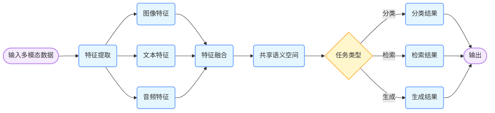

# 跨模态学习在AI系统能力拓展中的重要性

> 关键词：跨模态学习、AI系统能力拓展、多模态数据、特征融合、应用场景

> 摘要：本文深入探讨了跨模态学习在AI系统能力拓展中的重要性。首先介绍了跨模态学习的背景，包括其目的、预期读者、文档结构和相关术语。接着阐述了跨模态学习的核心概念与联系，通过文本示意图和Mermaid流程图展示其原理和架构。详细讲解了核心算法原理和具体操作步骤，并结合Python源代码进行说明。分析了跨模态学习的数学模型和公式，辅以举例加深理解。通过项目实战，展示了代码的实际案例并进行详细解读。列举了跨模态学习的实际应用场景，推荐了相关的学习资源、开发工具框架和论文著作。最后总结了跨模态学习的未来发展趋势与挑战，还提供了常见问题解答和扩展阅读参考资料。旨在让读者全面了解跨模态学习对AI系统能力拓展的关键作用。

## 1. 背景介绍 
### 1.1 目的和范围
跨模态学习的目的在于打破不同模态数据之间的壁垒，使AI系统能够综合利用多种类型的数据，如文本、图像、音频、视频等，从而提升系统的整体性能和智能水平。传统的AI系统往往只专注于单一模态的数据处理，这限制了系统对复杂现实世界的理解和处理能力。跨模态学习通过融合不同模态的数据，挖掘它们之间的内在联系，为AI系统赋予更强大的感知、理解和决策能力。

本文的范围涵盖了跨模态学习的基本概念、核心算法、数学模型、实际应用等方面，旨在全面阐述跨模态学习在AI系统能力拓展中的重要性，并为读者提供相关的技术知识和实践指导。

### 1.2 预期读者
本文预期读者包括AI领域的研究人员、开发者、学生以及对跨模态学习和AI技术感兴趣的专业人士。对于研究人员，本文可以提供最新的研究思路和方法；对于开发者，能够帮助他们掌握跨模态学习的技术细节，应用到实际项目中；对于学生，有助于他们深入了解跨模态学习的原理和应用场景，为未来的学习和研究打下基础。

### 1.3 文档结构概述
本文将按照以下结构进行阐述：首先介绍跨模态学习的背景知识，包括目的、读者和文档结构等；接着详细讲解跨模态学习的核心概念与联系，通过示意图和流程图展示其原理和架构；然后介绍核心算法原理和具体操作步骤，结合Python代码进行说明；分析跨模态学习的数学模型和公式，并举例说明；通过项目实战展示代码的实际应用和详细解读；列举跨模态学习的实际应用场景；推荐相关的学习资源、开发工具框架和论文著作；最后总结跨模态学习的未来发展趋势与挑战，提供常见问题解答和扩展阅读参考资料。

### 1.4 术语表
#### 1.4.1 核心术语定义
- **跨模态学习（Cross-modal Learning）**：指的是在不同类型的模态数据（如文本、图像、音频等）之间进行信息交互和融合的学习过程，旨在挖掘不同模态数据之间的关联和互补性，以提升AI系统的性能。
- **模态（Modality）**：表示数据的不同类型或形式，常见的模态包括视觉模态（如图像、视频）、听觉模态（如音频）、文本模态等。
- **特征融合（Feature Fusion）**：将来自不同模态的特征进行组合或集成的过程，以获取更全面、更有代表性的特征表示。
- **多模态数据（Multi-modal Data）**：包含多种不同模态信息的数据集合，例如带有文字描述的图像、包含语音和视频的多媒体文件等。

#### 1.4.2 相关概念解释
- **跨模态检索（Cross-modal Retrieval）**：允许用户使用一种模态的数据（如文本）来检索另一种模态的数据（如图像），例如通过输入文字描述来搜索相关的图片。
- **跨模态生成（Cross-modal Generation）**：根据一种模态的数据生成另一种模态的数据，例如根据文本描述生成对应的图像。
- **模态对齐（Modality Alignment）**：找到不同模态数据之间的对应关系，使得不同模态的数据能够在同一语义空间中进行比较和交互。

#### 1.4.3 缩略词列表
- **CNN（Convolutional Neural Network）**：卷积神经网络，常用于处理图像和视频数据。
- **RNN（Recurrent Neural Network）**：循环神经网络，适用于处理序列数据，如文本和音频。
- **Transformer**：一种基于注意力机制的神经网络架构，在自然语言处理和跨模态学习中得到广泛应用。

## 2. 核心概念与联系 

### 核心概念原理
跨模态学习的核心在于理解不同模态数据之间的语义关联，将它们映射到一个共享的语义空间中，以便进行有效的信息交互和融合。不同模态的数据具有不同的特征表示和分布，例如图像数据通常用像素值表示，文本数据则由单词和句子组成。跨模态学习的任务就是找到一种方法，将这些不同的表示转换为可以相互比较和关联的形式。

以图像和文本的跨模态学习为例，我们的目标是让AI系统能够理解图像中的内容，并将其与对应的文本描述联系起来。这需要解决两个主要问题：一是如何从图像和文本中提取有效的特征；二是如何将这些特征映射到同一个语义空间中。

### 架构的文本示意图
```plaintext
输入：
|-- 图像数据
|-- 文本数据
|-- 音频数据
|-- 其他模态数据

特征提取：
|-- 图像特征提取器（如CNN）
|-- 文本特征提取器（如Transformer）
|-- 音频特征提取器（如RNN）

特征融合：
|-- 早期融合：在特征提取阶段就将不同模态的特征进行融合
|-- 晚期融合：在分类或决策阶段将不同模态的特征进行融合

共享语义空间：
|-- 将不同模态的特征映射到同一个语义空间中

输出：
|-- 分类结果
|-- 检索结果
|-- 生成结果
```

### Mermaid流程图


## 3. 核心算法原理 & 具体操作步骤 

### 核心算法原理
跨模态学习中常用的算法包括基于深度学习的方法，如卷积神经网络（CNN）、循环神经网络（RNN）和Transformer等。下面以图像和文本的跨模态学习为例，介绍核心算法原理。

#### 特征提取
- **图像特征提取**：通常使用CNN来提取图像的特征。CNN通过卷积层、池化层和全连接层等结构，自动学习图像的局部特征和全局特征。例如，使用预训练的ResNet模型可以提取图像的高级语义特征。
- **文本特征提取**：对于文本数据，常用的方法是使用Transformer模型。Transformer通过自注意力机制能够捕捉文本中的长距离依赖关系，提取文本的语义特征。例如，使用预训练的BERT模型可以得到文本的上下文表示。

#### 特征融合
- **早期融合**：在特征提取阶段就将不同模态的特征进行融合。例如，可以将图像特征和文本特征拼接在一起，然后输入到一个全连接层中进行进一步的处理。
- **晚期融合**：在分类或决策阶段将不同模态的特征进行融合。例如，可以分别对图像特征和文本特征进行分类，然后将分类结果进行融合，得到最终的决策。

#### 模态对齐
为了使不同模态的特征能够在同一语义空间中进行比较和交互，需要进行模态对齐。常用的方法是使用跨模态损失函数，如对比损失（Contrastive Loss）和三元组损失（Triplet Loss），来约束不同模态的特征在语义空间中的距离。

### 具体操作步骤
#### 步骤1：数据准备
收集和整理多模态数据集，包括图像、文本、音频等数据，并进行标注和预处理。例如，对图像进行裁剪、缩放和归一化处理，对文本进行分词和编码处理。

#### 步骤2：特征提取
使用预训练的模型（如ResNet、BERT）对不同模态的数据进行特征提取。以下是使用Python和PyTorch实现图像和文本特征提取的示例代码：

```python
import torch
import torchvision.models as models
from transformers import BertTokenizer, BertModel

# 图像特征提取
def extract_image_features(image):
    model = models.resnet50(pretrained=True)
    model.eval()
    with torch.no_grad():
        features = model(image)
    return features

# 文本特征提取
def extract_text_features(text):
    tokenizer = BertTokenizer.from_pretrained('bert-base-uncased')
    model = BertModel.from_pretrained('bert-base-uncased')
    model.eval()
    inputs = tokenizer(text, return_tensors='pt')
    with torch.no_grad():
        outputs = model(**inputs)
        features = outputs.last_hidden_state.mean(dim=1)
    return features

# 示例数据
image = torch.randn(1, 3, 224, 224)
text = "This is a sample sentence."

# 提取特征
image_features = extract_image_features(image)
text_features = extract_text_features(text)

print("Image features shape:", image_features.shape)
print("Text features shape:", text_features.shape)
```

#### 步骤3：特征融合
根据选择的融合方法（早期融合或晚期融合），将不同模态的特征进行融合。以下是早期融合的示例代码：

```python
# 早期融合
def early_fusion(image_features, text_features):
    fused_features = torch.cat((image_features, text_features), dim=1)
    return fused_features

fused_features = early_fusion(image_features, text_features)
print("Fused features shape:", fused_features.shape)
```

#### 步骤4：模型训练
使用融合后的特征训练一个分类器或其他模型，以完成具体的任务，如图像-文本匹配、图像分类等。在训练过程中，使用跨模态损失函数来优化模型的参数。

#### 步骤5：模型评估
使用测试数据集对训练好的模型进行评估，计算准确率、召回率、F1值等指标，评估模型的性能。

## 4. 数学模型和公式 & 详细讲解 & 举例说明 

### 特征提取的数学模型
#### 图像特征提取
对于图像特征提取，CNN的卷积层可以表示为：

$$
y_{i,j}^l = \sum_{m=0}^{M-1} \sum_{n=0}^{N-1} x_{i+m,j+n}^{l-1} \cdot w_{m,n}^l + b^l
$$

其中，$y_{i,j}^l$ 是第 $l$ 层卷积层在位置 $(i,j)$ 的输出，$x_{i+m,j+n}^{l-1}$ 是第 $l-1$ 层的输入，$w_{m,n}^l$ 是卷积核的权重，$b^l$ 是偏置，$M$ 和 $N$ 是卷积核的大小。

#### 文本特征提取
Transformer的自注意力机制可以表示为：

$$
\text{Attention}(Q, K, V) = \text{softmax}\left(\frac{QK^T}{\sqrt{d_k}}\right)V
$$

其中，$Q$、$K$ 和 $V$ 分别是查询矩阵、键矩阵和值矩阵，$d_k$ 是查询和键的维度。

### 特征融合的数学模型
#### 早期融合
早期融合可以简单地表示为特征拼接：

$$
f_{fused} = [f_{image}; f_{text}]
$$

其中，$f_{fused}$ 是融合后的特征，$f_{image}$ 和 $f_{text}$ 分别是图像特征和文本特征。

#### 晚期融合
晚期融合可以通过加权求和的方式进行：

$$
\hat{y} = \alpha \cdot y_{image} + (1 - \alpha) \cdot y_{text}
$$

其中，$\hat{y}$ 是最终的预测结果，$y_{image}$ 和 $y_{text}$ 分别是图像和文本的分类结果，$\alpha$ 是权重系数。

### 模态对齐的数学模型
#### 对比损失
对比损失用于约束相似样本在语义空间中的距离较近，不相似样本的距离较远。其公式为：

$$
L_{contrastive} = \frac{1}{2N} \sum_{i=1}^{N} y d^2 + (1 - y) \max(m - d, 0)^2
$$

其中，$N$ 是样本数量，$y$ 是样本对的标签（1表示相似，0表示不相似），$d$ 是样本对在语义空间中的距离，$m$ 是边际值。

#### 三元组损失
三元组损失通过三元组 $(a, p, n)$ 来约束样本之间的距离，其中 $a$ 是锚样本，$p$ 是正样本（与锚样本相似），$n$ 是负样本（与锚样本不相似）。其公式为：

$$
L_{triplet} = \sum_{i=1}^{N} \max(d(a_i, p_i) - d(a_i, n_i) + m, 0)
$$

其中，$d(a_i, p_i)$ 和 $d(a_i, n_i)$ 分别是锚样本与正样本、锚样本与负样本在语义空间中的距离，$m$ 是边际值。

### 举例说明
假设我们有一个图像-文本匹配的任务，输入是一张图像和一段文本。我们首先使用CNN提取图像的特征 $f_{image}$，使用Transformer提取文本的特征 $f_{text}$。然后进行早期融合，得到融合后的特征 $f_{fused} = [f_{image}; f_{text}]$。接着，我们将融合后的特征输入到一个全连接层中，得到预测的匹配分数 $\hat{y}$。在训练过程中，我们使用对比损失来优化模型的参数，使得相似的图像-文本对的匹配分数较高，不相似的图像-文本对的匹配分数较低。

## 5. 项目实战：代码实际案例和详细解释说明 

### 5.1  开发环境搭建
#### 操作系统
推荐使用Linux系统，如Ubuntu 18.04或更高版本，因为Linux系统在AI开发中具有良好的稳定性和兼容性。

#### 编程语言和框架
- **Python**：选择Python 3.7或更高版本，因为Python是AI开发中最常用的编程语言，具有丰富的库和工具。
- **PyTorch**：一个开源的深度学习框架，提供了丰富的神经网络层和优化算法，方便进行模型的开发和训练。
- **torchvision**：PyTorch的视觉库，包含了常用的图像数据集和预训练模型。
- **transformers**：Hugging Face开发的自然语言处理库，提供了各种预训练的语言模型，如BERT、GPT等。

#### 安装步骤
```bash
# 创建虚拟环境
python -m venv venv
source venv/bin/activate

# 安装PyTorch
pip install torch torchvision

# 安装transformers
pip install transformers
```

### 5.2  源代码详细实现和代码解读
以下是一个简单的图像-文本匹配的项目实战代码：

```python
import torch
import torch.nn as nn
import torch.optim as optim
from torchvision.models import resnet50
from transformers import BertTokenizer, BertModel
from torch.utils.data import Dataset, DataLoader

# 自定义数据集类
class ImageTextDataset(Dataset):
    def __init__(self, images, texts, labels):
        self.images = images
        self.texts = texts
        self.labels = labels
        self.tokenizer = BertTokenizer.from_pretrained('bert-base-uncased')

    def __len__(self):
        return len(self.images)

    def __getitem__(self, idx):
        image = self.images[idx]
        text = self.texts[idx]
        label = self.labels[idx]

        inputs = self.tokenizer(text, return_tensors='pt', padding='max_length', truncation=True, max_length=128)
        input_ids = inputs['input_ids'].squeeze()
        attention_mask = inputs['attention_mask'].squeeze()

        return image, input_ids, attention_mask, label

# 跨模态模型
class CrossModalModel(nn.Module):
    def __init__(self):
        super(CrossModalModel, self).__init__()
        self.image_model = resnet50(pretrained=True)
        self.image_model.fc = nn.Identity()
        self.text_model = BertModel.from_pretrained('bert-base-uncased')
        self.fc = nn.Linear(2048 + 768, 1)

    def forward(self, image, input_ids, attention_mask):
        image_features = self.image_model(image)
        text_outputs = self.text_model(input_ids=input_ids, attention_mask=attention_mask)
        text_features = text_outputs.last_hidden_state.mean(dim=1)
        fused_features = torch.cat((image_features, text_features), dim=1)
        output = self.fc(fused_features)
        return output

# 训练函数
def train(model, dataloader, criterion, optimizer, device):
    model.train()
    total_loss = 0
    for images, input_ids, attention_mask, labels in dataloader:
        images = images.to(device)
        input_ids = input_ids.to(device)
        attention_mask = attention_mask.to(device)
        labels = labels.to(device).float().unsqueeze(1)

        optimizer.zero_grad()
        outputs = model(images, input_ids, attention_mask)
        loss = criterion(outputs, labels)
        loss.backward()
        optimizer.step()

        total_loss += loss.item()

    return total_loss / len(dataloader)

# 主函数
if __name__ == "__main__":
    # 示例数据
    images = torch.randn(100, 3, 224, 224)
    texts = ["This is a sample sentence."] * 100
    labels = torch.randint(0, 2, (100,))

    # 创建数据集和数据加载器
    dataset = ImageTextDataset(images, texts, labels)
    dataloader = DataLoader(dataset, batch_size=16, shuffle=True)

    # 初始化模型、损失函数和优化器
    device = torch.device("cuda" if torch.cuda.is_available() else "cpu")
    model = CrossModalModel().to(device)
    criterion = nn.BCEWithLogitsLoss()
    optimizer = optim.Adam(model.parameters(), lr=1e-4)

    # 训练模型
    num_epochs = 10
    for epoch in range(num_epochs):
        loss = train(model, dataloader, criterion, optimizer, device)
        print(f'Epoch {epoch+1}/{num_epochs}, Loss: {loss:.4f}')
```

### 5.3  代码解读与分析
#### 自定义数据集类 `ImageTextDataset`
该类继承自 `torch.utils.data.Dataset`，用于加载图像和文本数据。在 `__getitem__` 方法中，对文本数据进行分词和编码处理，返回图像、输入ID、注意力掩码和标签。

#### 跨模态模型 `CrossModalModel`
该类继承自 `nn.Module`，包含一个图像模型（ResNet50）和一个文本模型（BERT）。在 `forward` 方法中，分别提取图像和文本的特征，然后将它们拼接在一起，输入到一个全连接层中，得到最终的输出。

#### 训练函数 `train`
该函数用于训练模型。在每个训练步骤中，将数据移动到设备上，计算模型的输出和损失，然后进行反向传播和参数更新。

#### 主函数
在主函数中，创建示例数据、数据集和数据加载器，初始化模型、损失函数和优化器，然后进行模型训练。

## 6. 实际应用场景 
### 智能安防
在智能安防领域，跨模态学习可以结合视频监控和音频数据，提高对异常事件的检测和识别能力。例如，通过分析监控视频中的人物行为和声音特征，可以更准确地判断是否发生了盗窃、暴力等事件。

### 医疗诊断
在医疗诊断中，跨模态学习可以融合医学影像（如X光、CT、MRI）和临床文本信息（如病历、诊断报告），帮助医生更全面地了解患者的病情，提高诊断的准确性和效率。

### 智能交通
在智能交通系统中，跨模态学习可以结合摄像头拍摄的道路图像、车辆传感器数据和交通信息文本，实现交通流量预测、交通事故预警和自动驾驶等功能。

### 教育领域
在教育领域，跨模态学习可以将教学视频、课件文本和学生的语音交互数据相结合，实现个性化的学习推荐和智能辅导，提高学生的学习效果。

### 娱乐产业
在娱乐产业中，跨模态学习可以用于电影、游戏等的内容创作和推荐。例如，根据用户的文本描述生成对应的游戏场景或电影情节，或者根据用户的观影历史和偏好推荐相关的电影和音乐。

## 7. 工具和资源推荐
### 7.1 学习资源推荐
#### 7.1.1 书籍推荐
- 《深度学习》（Deep Learning）：由Ian Goodfellow、Yoshua Bengio和Aaron Courville撰写，是深度学习领域的经典教材，涵盖了神经网络、卷积神经网络、循环神经网络等内容。
- 《Python深度学习》（Deep Learning with Python）：由Francois Chollet撰写，介绍了如何使用Python和Keras进行深度学习模型的开发和训练。
- 《自然语言处理入门》（Natural Language Processing with Python）：由Steven Bird、Ewan Klein和Edward Loper撰写，是自然语言处理领域的入门书籍，介绍了文本处理、词法分析、句法分析等内容。

#### 7.1.2 在线课程
- Coursera上的“深度学习专项课程”（Deep Learning Specialization）：由Andrew Ng教授讲授，包括神经网络和深度学习、改善深层神经网络、结构化机器学习项目、卷积神经网络和序列模型等课程。
- edX上的“人工智能基础”（Introduction to Artificial Intelligence）：由MIT教授讲授，介绍了人工智能的基本概念、算法和应用。
- 中国大学MOOC上的“深度学习”课程：由清华大学、北京大学等高校的教授讲授，涵盖了深度学习的理论和实践。

#### 7.1.3 技术博客和网站
- Medium：一个技术博客平台，有很多关于AI和跨模态学习的优秀文章。
- arXiv：一个预印本平台，提供了最新的AI研究论文。
- Hugging Face：一个自然语言处理的开源社区，提供了丰富的预训练模型和工具。

### 7.2 开发工具框架推荐
#### 7.2.1 IDE和编辑器
- PyCharm：一个专业的Python集成开发环境，提供了代码编辑、调试、版本控制等功能。
- Jupyter Notebook：一个交互式的开发环境，适合进行数据探索和模型实验。
- Visual Studio Code：一个轻量级的代码编辑器，支持多种编程语言和插件扩展。

#### 7.2.2 调试和性能分析工具
- PyTorch Profiler：PyTorch自带的性能分析工具，可以帮助开发者分析模型的运行时间和内存使用情况。
- TensorBoard：一个可视化工具，用于监控模型的训练过程和性能指标。
- cProfile：Python标准库中的性能分析工具，可以分析Python代码的运行时间和函数调用次数。

#### 7.2.3 相关框架和库
- PyTorch：一个开源的深度学习框架，提供了丰富的神经网络层和优化算法。
- TensorFlow：另一个流行的深度学习框架，具有强大的分布式训练和部署能力。
- Transformers：Hugging Face开发的自然语言处理库，提供了各种预训练的语言模型。
- TorchVision：PyTorch的视觉库，包含了常用的图像数据集和预训练模型。

### 7.3 相关论文著作推荐
#### 7.3.1 经典论文
- “Attention Is All You Need”：介绍了Transformer模型，是自然语言处理领域的经典论文。
- “Deep Residual Learning for Image Recognition”：提出了残差网络（ResNet），在图像识别领域取得了很好的效果。
- “BERT: Pre-training of Deep Bidirectional Transformers for Language Understanding”：提出了BERT模型，在自然语言处理任务中取得了巨大的成功。

#### 7.3.2 最新研究成果
- 关注arXiv上关于跨模态学习的最新论文，了解该领域的最新研究动态。
- 参加国际学术会议，如CVPR、ICCV、NIPS等，听取最新的研究报告。

#### 7.3.3 应用案例分析
- 查阅相关的学术期刊和会议论文，了解跨模态学习在不同领域的应用案例和实践经验。
- 关注科技公司的技术博客，了解他们在跨模态学习方面的应用和创新。

## 8. 总结：未来发展趋势与挑战
### 未来发展趋势
#### 多模态融合的深度和广度不断拓展
未来，跨模态学习将不仅仅局限于图像、文本和音频等常见模态的融合，还将涉及更多的模态，如触觉、嗅觉等，实现更加全面和深入的多模态感知和理解。

#### 与其他技术的融合
跨模态学习将与强化学习、元学习、联邦学习等其他技术相结合，进一步提升AI系统的智能水平和适应性。例如，结合强化学习可以使跨模态模型在动态环境中进行决策和优化。

#### 应用场景的不断扩大
随着跨模态学习技术的不断发展，其应用场景将不断扩大，涵盖更多的领域，如智能家居、智能金融、智能农业等，为人们的生活和工作带来更多的便利和创新。

### 挑战
#### 数据的稀缺性和不平衡性
跨模态数据的收集和标注成本较高，导致数据的稀缺性问题。此外，不同模态数据之间的分布可能存在不平衡性，这会影响模型的训练效果和泛化能力。

#### 模态之间的语义鸿沟
不同模态的数据具有不同的特征表示和语义含义，如何有效地弥合模态之间的语义鸿沟，实现跨模态的语义理解和交互，仍然是一个挑战。

#### 计算资源的需求
跨模态学习通常需要处理大量的数据和复杂的模型，对计算资源的需求较高。如何在有限的计算资源下提高模型的训练效率和性能，是一个亟待解决的问题。

## 9. 附录：常见问题与解答
### 问题1：跨模态学习和多模态学习有什么区别？
跨模态学习强调不同模态数据之间的交互和融合，重点在于挖掘不同模态数据之间的关联和互补性。而多模态学习更广泛地涵盖了对多种模态数据的处理和分析，可以包括单模态学习和跨模态学习。

### 问题2：如何选择合适的特征融合方法？
选择合适的特征融合方法需要考虑具体的任务和数据特点。早期融合适用于不同模态数据之间相关性较强的情况，可以在特征提取阶段就进行融合。晚期融合适用于不同模态数据之间相关性较弱的情况，可以在分类或决策阶段进行融合。

### 问题3：跨模态学习模型的训练时间较长，有什么方法可以加快训练速度？
可以采用以下方法加快训练速度：
- 使用预训练的模型进行特征提取，减少模型的训练参数。
- 采用分布式训练技术，利用多个GPU或计算节点进行并行训练。
- 优化数据加载和预处理过程，减少数据传输和处理的时间。

### 问题4：跨模态学习在实际应用中面临的主要问题是什么？
跨模态学习在实际应用中面临的主要问题包括数据的稀缺性和不平衡性、模态之间的语义鸿沟、计算资源的需求等。此外，还需要考虑模型的可解释性和可靠性，以确保在实际应用中的安全性和有效性。

## 10. 扩展阅读 & 参考资料
### 扩展阅读
- 《人工智能：现代方法》（Artificial Intelligence: A Modern Approach）：全面介绍了人工智能的基本概念、算法和应用，是人工智能领域的经典教材。
- 《机器学习》（Machine Learning）：由Tom M. Mitchell撰写，介绍了机器学习的基本理论和算法，适合初学者学习。
- 《计算机视觉：算法与应用》（Computer Vision: Algorithms and Applications）：介绍了计算机视觉的基本算法和应用，包括图像特征提取、目标检测、图像分割等内容。

### 参考资料
- Goodfellow, I., Bengio, Y., & Courville, A. (2016). Deep Learning. MIT Press.
- Chollet, F. (2017). Deep Learning with Python. Manning Publications.
- Bird, S., Klein, E., & Loper, E. (2009). Natural Language Processing with Python. O'Reilly Media.

作者：AI天才研究院/AI Genius Institute & 禅与计算机程序设计艺术 /Zen And The Art of Computer Programming