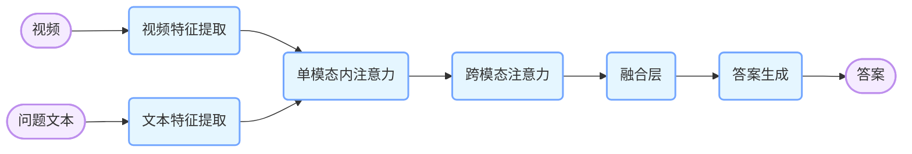

# 跨模态注意力在视频问答任务中的创新

> 关键词：跨模态注意力、视频问答任务、多模态融合、深度学习、注意力机制

> 摘要：本文聚焦于跨模态注意力在视频问答任务中的创新应用。首先介绍了视频问答任务的背景和重要性，以及跨模态注意力机制的基本概念。详细阐述了跨模态注意力的核心原理和架构，通过Python代码展示其具体实现步骤。同时，给出相关数学模型和公式，并结合实际例子进行说明。通过项目实战，深入分析代码实现和解读。探讨了跨模态注意力在视频问答任务中的实际应用场景，推荐了学习资源、开发工具框架和相关论文著作。最后总结了未来发展趋势与挑战，为相关领域的研究和实践提供了全面而深入的参考。

## 1. 背景介绍 
### 1.1 目的和范围
视频问答任务旨在让计算机理解视频内容，并根据视频信息回答相关问题。随着多媒体技术的发展，视频数据呈爆炸式增长，视频问答任务具有重要的现实意义，如智能视频检索、智能客服等。本文的目的是探讨跨模态注意力机制在视频问答任务中的创新应用，范围涵盖跨模态注意力的原理、算法实现、实际应用以及未来发展等方面。

### 1.2 预期读者
本文预期读者包括人工智能、计算机视觉、自然语言处理等领域的研究人员、开发者，以及对跨模态学习和视频问答任务感兴趣的技术爱好者。

### 1.3 文档结构概述
本文首先介绍背景信息，包括目的、预期读者和文档结构。接着阐述跨模态注意力的核心概念与联系，包括原理和架构，并给出示意图和流程图。然后详细讲解核心算法原理和具体操作步骤，通过Python代码进行说明。之后介绍数学模型和公式，并举例说明。通过项目实战展示代码实现和解读。探讨实际应用场景，推荐相关工具和资源。最后总结未来发展趋势与挑战，提供常见问题解答和扩展阅读参考。

### 1.4 术语表
#### 1.4.1 核心术语定义
- **跨模态注意力**：指在处理多种不同模态数据（如视频、文本）时，通过注意力机制动态地分配权重，使模型能够聚焦于不同模态数据中与任务相关的部分。
- **视频问答任务**：给定一个视频和一个相关问题，模型需要根据视频内容回答问题。
- **多模态融合**：将不同模态的数据（如视觉、听觉、文本）进行整合，以获得更全面的信息表示。
- **注意力机制**：一种模拟人类注意力的机制，通过计算不同元素的重要性权重，选择性地关注输入数据的关键部分。

#### 1.4.2 相关概念解释
- **模态**：指数据的不同形式，如视觉模态（图像、视频）、听觉模态（音频）、文本模态等。
- **特征表示**：将原始数据转换为适合模型处理的向量表示。
- **深度学习模型**：基于神经网络的模型，具有强大的学习能力和表达能力。

#### 1.4.3 缩略词列表
- **CNN**：卷积神经网络（Convolutional Neural Network）
- **LSTM**：长短期记忆网络（Long Short-Term Memory）
- **Transformer**：一种基于注意力机制的深度学习模型架构

## 2. 核心概念与联系 
### 核心概念原理
跨模态注意力机制的核心思想是在不同模态数据之间建立关联，通过注意力权重来动态地选择和融合不同模态的信息。在视频问答任务中，视频和问题分别属于视觉模态和文本模态。模型需要理解问题的语义，并从视频中找到与之相关的信息。

具体来说，跨模态注意力机制可以分为两种类型：单模态内注意力和跨模态注意力。单模态内注意力用于在同一模态数据内部进行信息筛选和聚焦，例如在视频帧序列中选择重要的帧，或者在问题文本中选择关键的词汇。跨模态注意力则用于在不同模态数据之间进行信息交互和融合，例如根据问题文本的信息来关注视频中的特定区域或对象。

### 架构示意图
以下是一个简化的跨模态注意力在视频问答任务中的架构示意图：



### 解释
1. **视频特征提取**：使用卷积神经网络（CNN）等模型从视频帧中提取视觉特征。
2. **文本特征提取**：使用循环神经网络（如LSTM）或Transformer等模型从问题文本中提取语义特征。
3. **单模态内注意力**：分别对视频特征和文本特征进行单模态内的信息筛选和聚焦。
4. **跨模态注意力**：在视频特征和文本特征之间进行信息交互和融合，根据问题文本的信息来关注视频中的相关部分。
5. **融合层**：将经过跨模态注意力处理后的视频特征和文本特征进行融合，得到一个综合的特征表示。
6. **答案生成**：根据融合后的特征表示生成问题的答案。

## 3. 核心算法原理 & 具体操作步骤 
### 算法原理
跨模态注意力机制的核心算法可以基于Transformer架构来实现。Transformer架构中的多头注意力机制可以很好地处理不同模态数据之间的交互。以下是多头注意力机制的原理：

多头注意力机制将输入的查询（Query）、键（Key）和值（Value）分别进行线性变换，然后计算多个不同的注意力头，最后将这些注意力头的结果进行拼接和线性变换得到最终的输出。

具体公式如下：

$$\text{Attention}(Q, K, V) = \text{softmax}(\frac{QK^T}{\sqrt{d_k}})V$$

其中，$Q$ 是查询矩阵，$K$ 是键矩阵，$V$ 是值矩阵，$d_k$ 是键向量的维度。

多头注意力机制的公式为：

$$\text{MultiHead}(Q, K, V) = \text{Concat}(\text{head}_1, \cdots, \text{head}_h)W^O$$

其中，$\text{head}_i = \text{Attention}(QW_i^Q, KW_i^K, VW_i^V)$，$W_i^Q$、$W_i^K$、$W_i^V$ 是线性变换的权重矩阵，$W^O$ 是最终输出的线性变换权重矩阵。

### 具体操作步骤
以下是使用Python和PyTorch实现跨模态注意力机制的具体步骤：

```python
import torch
import torch.nn as nn

class MultiHeadAttention(nn.Module):
    def __init__(self, embed_size, num_heads):
        super(MultiHeadAttention, self).__init__()
        self.embed_size = embed_size
        self.num_heads = num_heads
        self.head_dim = embed_size // num_heads

        assert (
            self.head_dim * num_heads == embed_size
        ), "Embedding size needs to be divisible by num_heads"

        self.values = nn.Linear(self.head_dim, self.head_dim, bias=False)
        self.keys = nn.Linear(self.head_dim, self.head_dim, bias=False)
        self.queries = nn.Linear(self.head_dim, self.head_dim, bias=False)
        self.fc_out = nn.Linear(num_heads * self.head_dim, embed_size)

    def forward(self, values, keys, query, mask):
        N = query.shape[0]
        value_len, key_len, query_len = values.shape[1], keys.shape[1], query.shape[1]

        # Split the embedding into self.num_heads different pieces
        values = values.reshape(N, value_len, self.num_heads, self.head_dim)
        keys = keys.reshape(N, key_len, self.num_heads, self.head_dim)
        queries = query.reshape(N, query_len, self.num_heads, self.head_dim)

        values = self.values(values)
        keys = self.keys(keys)
        queries = self.queries(queries)

        # Scaled dot-product attention
        energy = torch.einsum("nqhd,nkhd->nhqk", [queries, keys])
        if mask is not None:
            energy = energy.masked_fill(mask == 0, float("-1e20"))

        attention = torch.softmax(energy / (self.embed_size ** (1 / 2)), dim=3)

        out = torch.einsum("nhql,nlhd->nqhd", [attention, values]).reshape(
            N, query_len, self.num_heads * self.head_dim
        )

        out = self.fc_out(out)
        return out

```

### 代码解释
1. **`__init__` 方法**：初始化多头注意力机制的参数，包括嵌入维度 `embed_size` 和头的数量 `num_heads`。同时，定义了线性变换的层 `values`、`keys`、`queries` 和最终输出的层 `fc_out`。
2. **`forward` 方法**：实现了多头注意力机制的前向传播过程。具体步骤如下：
    - 将输入的 `values`、`keys` 和 `query` 按照头的数量进行分割。
    - 对分割后的 `values`、`keys` 和 `query` 进行线性变换。
    - 计算注意力分数 `energy`，并根据掩码 `mask` 进行处理。
    - 对注意力分数进行 softmax 操作得到注意力权重 `attention`。
    - 根据注意力权重对 `values` 进行加权求和得到输出 `out`。
    - 对输出进行线性变换得到最终结果。

## 4. 数学模型和公式 & 详细讲解 & 举例说明 
### 数学模型和公式
#### 单模态内注意力
单模态内注意力可以使用点积注意力来实现。假设输入的特征序列为 $X = [x_1, x_2, \cdots, x_n]$，其中 $x_i \in \mathbb{R}^d$ 是第 $i$ 个特征向量，$d$ 是特征维度。查询向量为 $q \in \mathbb{R}^d$。

注意力分数的计算公式为：

$$e_i = q^T x_i$$

注意力权重的计算公式为：

$$\alpha_i = \frac{\exp(e_i)}{\sum_{j=1}^n \exp(e_j)}$$

加权后的特征表示为：

$$\hat{x} = \sum_{i=1}^n \alpha_i x_i$$

#### 跨模态注意力
跨模态注意力可以使用多头注意力机制来实现，具体公式如前面所述。

### 详细讲解
#### 单模态内注意力
单模态内注意力的作用是在同一模态数据内部选择重要的信息。例如，在视频问答任务中，单模态内注意力可以用于选择视频帧序列中的重要帧，或者问题文本中的关键词汇。通过计算注意力权重，模型可以更加关注与任务相关的部分。

#### 跨模态注意力
跨模态注意力的作用是在不同模态数据之间进行信息交互和融合。例如，在视频问答任务中，跨模态注意力可以根据问题文本的信息来关注视频中的特定区域或对象。通过多头注意力机制，模型可以同时考虑多个不同的视角，从而更全面地捕捉不同模态数据之间的关系。

### 举例说明
假设我们有一个视频帧序列 $X = [x_1, x_2, x_3]$，其中 $x_i \in \mathbb{R}^5$ 是第 $i$ 个视频帧的特征向量，查询向量 $q \in \mathbb{R}^5$ 是问题文本的特征表示。

首先计算注意力分数：

$$e_1 = q^T x_1$$
$$e_2 = q^T x_2$$
$$e_3 = q^T x_3$$

假设 $e_1 = 2$，$e_2 = 3$，$e_3 = 1$。

然后计算注意力权重：

$$\alpha_1 = \frac{\exp(2)}{\exp(2) + \exp(3) + \exp(1)} \approx 0.24$$
$$\alpha_2 = \frac{\exp(3)}{\exp(2) + \exp(3) + \exp(1)} \approx 0.71$$
$$\alpha_3 = \frac{\exp(1)}{\exp(2) + \exp(3) + \exp(1)} \approx 0.05$$

最后计算加权后的特征表示：

$$\hat{x} = \alpha_1 x_1 + \alpha_2 x_2 + \alpha_3 x_3$$

这个加权后的特征表示 $\hat{x}$ 就是经过单模态内注意力处理后的视频特征，它更加关注与问题相关的视频帧。

## 5. 项目实战：代码实际案例和详细解释说明 
### 5.1  开发环境搭建
#### 操作系统
推荐使用Ubuntu 18.04或以上版本，或者Windows 10操作系统。

#### Python环境
建议使用Python 3.7或以上版本，可以使用Anaconda来管理Python环境。

#### 依赖库安装
安装以下必要的Python库：
```bash
pip install torch torchvision numpy pandas tqdm
```

### 5.2  源代码详细实现和代码解读
以下是一个完整的跨模态注意力在视频问答任务中的代码示例：

```python
import torch
import torch.nn as nn
import torch.optim as optim
from torch.utils.data import Dataset, DataLoader
import numpy as np
import pandas as pd
from tqdm import tqdm

# 定义数据集类
class VideoQADataset(Dataset):
    def __init__(self, video_features, question_features, answers):
        self.video_features = video_features
        self.question_features = question_features
        self.answers = answers

    def __len__(self):
        return len(self.answers)

    def __getitem__(self, idx):
        video_feature = self.video_features[idx]
        question_feature = self.question_features[idx]
        answer = self.answers[idx]
        return video_feature, question_feature, answer

# 定义跨模态注意力模型
class CrossModalAttentionModel(nn.Module):
    def __init__(self, embed_size, num_heads):
        super(CrossModalAttentionModel, self).__init__()
        self.multihead_attention = MultiHeadAttention(embed_size, num_heads)
        self.fc = nn.Linear(embed_size, 1)

    def forward(self, video_features, question_features):
        attention_output = self.multihead_attention(video_features, video_features, question_features, None)
        output = self.fc(attention_output)
        return output

# 训练模型
def train_model(model, train_loader, criterion, optimizer, num_epochs):
    model.train()
    for epoch in range(num_epochs):
        running_loss = 0.0
        for video_features, question_features, answers in tqdm(train_loader):
            optimizer.zero_grad()
            outputs = model(video_features, question_features)
            loss = criterion(outputs.squeeze(), answers.float())
            loss.backward()
            optimizer.step()
            running_loss += loss.item()
        print(f'Epoch {epoch+1}/{num_epochs}, Loss: {running_loss/len(train_loader)}')

# 主函数
if __name__ == "__main__":
    # 生成随机数据
    num_samples = 100
    embed_size = 64
    num_heads = 4
    video_features = torch.randn(num_samples, 10, embed_size)
    question_features = torch.randn(num_samples, 1, embed_size)
    answers = torch.randint(0, 2, (num_samples,))

    # 创建数据集和数据加载器
    dataset = VideoQADataset(video_features, question_features, answers)
    train_loader = DataLoader(dataset, batch_size=16, shuffle=True)

    # 初始化模型、损失函数和优化器
    model = CrossModalAttentionModel(embed_size, num_heads)
    criterion = nn.BCEWithLogitsLoss()
    optimizer = optim.Adam(model.parameters(), lr=0.001)

    # 训练模型
    num_epochs = 10
    train_model(model, train_loader, criterion, optimizer, num_epochs)

```

### 代码解读与分析
#### 数据集类 `VideoQADataset`
这个类继承自 `torch.utils.data.Dataset`，用于封装视频特征、问题特征和答案数据。`__len__` 方法返回数据集的样本数量，`__getitem__` 方法根据索引返回对应的视频特征、问题特征和答案。

#### 跨模态注意力模型 `CrossModalAttentionModel`
这个类继承自 `nn.Module`，包含一个多头注意力层 `multihead_attention` 和一个全连接层 `fc`。`forward` 方法实现了模型的前向传播过程，将问题特征作为查询，视频特征作为键和值，经过多头注意力层处理后，再通过全连接层得到输出。

#### 训练函数 `train_model`
这个函数用于训练模型。在每个 epoch 中，遍历训练数据加载器，计算损失并进行反向传播和参数更新。

#### 主函数
生成随机的视频特征、问题特征和答案数据，创建数据集和数据加载器。初始化模型、损失函数和优化器，然后调用 `train_model` 函数进行训练。

## 6. 实际应用场景 
### 智能视频检索
在智能视频检索系统中，用户可以输入一个问题，系统需要根据视频内容回答问题并返回相关的视频片段。跨模态注意力机制可以帮助模型更好地理解问题的语义，并从视频中找到与之相关的信息，从而提高视频检索的准确性。

### 智能客服
在视频客服场景中，客户可以通过视频和文本与客服进行交互。跨模态注意力机制可以帮助客服系统更好地理解客户的问题和意图，结合视频中的信息提供更准确的回答和解决方案。

### 教育领域
在在线教育中，视频课程是一种常见的教学资源。跨模态注意力机制可以用于实现视频问答功能，学生可以针对视频内容提出问题，系统可以根据视频信息进行回答，帮助学生更好地理解课程内容。

## 7. 工具和资源推荐
### 7.1 学习资源推荐
#### 7.1.1 书籍推荐
- 《深度学习》（Deep Learning）：由Ian Goodfellow、Yoshua Bengio和Aaron Courville所著，是深度学习领域的经典教材，涵盖了神经网络、卷积神经网络、循环神经网络等基础知识。
- 《计算机视觉：算法与应用》（Computer Vision: Algorithms and Applications）：介绍了计算机视觉的基本算法和应用，包括图像特征提取、目标检测、图像分割等内容。
- 《自然语言处理入门》（Natural Language Processing with Python）：通过Python代码介绍了自然语言处理的基本技术，如文本预处理、词法分析、句法分析等。

#### 7.1.2 在线课程
- Coursera上的“深度学习专项课程”（Deep Learning Specialization）：由Andrew Ng教授授课，涵盖了深度学习的各个方面，包括神经网络基础、卷积神经网络、循环神经网络等。
- edX上的“计算机视觉：从基础到实践”（Computer Vision: From Fundamentals to Practice）：介绍了计算机视觉的基本概念和算法，以及如何使用Python和OpenCV进行实现。
- 哔哩哔哩上的“自然语言处理入门教程”：适合初学者学习自然语言处理的基础知识和实践技巧。

#### 7.1.3 技术博客和网站
- arXiv：一个预印本数据库，包含了大量的人工智能、计算机科学等领域的最新研究成果。
- Medium：一个技术博客平台，有很多关于深度学习、计算机视觉、自然语言处理等领域的优质文章。
- 机器之心：专注于人工智能领域的资讯和技术分享，提供了很多最新的研究动态和技术解读。

### 7.2 开发工具框架推荐
#### 7.2.1 IDE和编辑器
- PyCharm：一款专门为Python开发设计的集成开发环境，具有代码编辑、调试、代码分析等功能。
- Jupyter Notebook：一个交互式的开发环境，适合进行数据探索、模型实验和代码演示。
- Visual Studio Code：一款轻量级的代码编辑器，支持多种编程语言和插件扩展，可用于Python开发。

#### 7.2.2 调试和性能分析工具
- PyTorch Profiler：PyTorch自带的性能分析工具，可以帮助开发者分析模型的运行时间、内存使用等情况。
- TensorBoard：一个可视化工具，可以用于监控模型的训练过程，如损失曲线、准确率曲线等。
- cProfile：Python标准库中的性能分析工具，可以分析Python代码的运行时间和函数调用情况。

#### 7.2.3 相关框架和库
- PyTorch：一个开源的深度学习框架，具有动态图、易于使用等特点，广泛应用于计算机视觉、自然语言处理等领域。
- OpenCV：一个开源的计算机视觉库，提供了丰富的图像处理和计算机视觉算法。
- NLTK：一个自然语言处理工具包，提供了多种自然语言处理任务的工具和数据集。

### 7.3 相关论文著作推荐
#### 7.3.1 经典论文
- “Attention Is All You Need”：提出了Transformer架构，是注意力机制在深度学习领域的经典论文。
- “Show, Attend and Tell: Neural Image Caption Generation with Visual Attention”：将注意力机制应用于图像描述生成任务，取得了很好的效果。
- “Multimodal Deep Learning”：介绍了多模态深度学习的基本概念和方法。

#### 7.3.2 最新研究成果
- 关注arXiv上关于跨模态注意力、视频问答任务的最新论文，了解该领域的最新研究动态和技术进展。

#### 7.3.3 应用案例分析
- 阅读相关的学术会议论文和工业界的技术博客，了解跨模态注意力在实际应用中的案例和经验。

## 8. 总结：未来发展趋势与挑战
### 未来发展趋势
#### 更复杂的多模态融合
未来的跨模态注意力模型将更加注重多种模态数据的深度融合，不仅包括视觉、文本和听觉模态，还可能涉及触觉、嗅觉等其他模态，以实现更加全面和准确的信息理解。

#### 端到端的学习
随着深度学习技术的发展，未来的视频问答系统将朝着端到端的学习方向发展，即直接从原始的视频和文本数据中学习，而不需要手动进行特征工程，从而提高模型的性能和泛化能力。

#### 强化学习的应用
强化学习可以用于优化跨模态注意力模型的决策过程，通过奖励机制引导模型学习更加有效的注意力分配策略，提高视频问答任务的准确性和效率。

### 挑战
#### 数据获取和标注
多模态数据的获取和标注是一个挑战，因为需要同时收集多种不同模态的数据，并进行准确的标注。此外，不同模态数据之间的时间和空间对齐也是一个难题。

#### 计算资源和效率
跨模态注意力模型通常需要大量的计算资源和时间进行训练，尤其是在处理大规模的视频数据时。如何提高模型的训练效率和降低计算成本是一个亟待解决的问题。

#### 语义理解和推理
视频问答任务需要模型具备较高的语义理解和推理能力，能够理解问题的语义，并根据视频内容进行逻辑推理。目前的模型在这方面还存在一定的不足，需要进一步研究和改进。

## 9. 附录：常见问题与解答
### 跨模态注意力和单模态注意力有什么区别？
单模态注意力用于在同一模态数据内部进行信息筛选和聚焦，而跨模态注意力用于在不同模态数据之间进行信息交互和融合。跨模态注意力可以根据一种模态的数据信息来关注另一种模态数据中的相关部分，从而实现多模态数据的协同处理。

### 跨模态注意力模型的训练难度大吗？
跨模态注意力模型的训练难度相对较大，主要原因包括：多模态数据的获取和标注困难、不同模态数据之间的特征表示和语义理解存在差异、模型的复杂度较高，需要大量的计算资源和时间进行训练。

### 如何评估跨模态注意力模型在视频问答任务中的性能？
可以使用准确率、召回率、F1值等指标来评估模型的性能。此外，还可以进行人工评估，通过让人类评判模型的回答是否准确和合理来评估模型的性能。

## 10. 扩展阅读 & 参考资料
### 扩展阅读
- 《多模态机器学习：基础与应用》
- 《深度学习实战：基于Python和TensorFlow》

### 参考资料
- Vaswani, A., Shazeer, N., Parmar, N., Uszkoreit, J., Jones, L., Gomez, A. N.,... & Polosukhin, I. (2017). Attention is all you need. Advances in neural information processing systems.
- Xu, K., Ba, J., Kiros, R., Cho, K., Courville, A., Salakhudinov, R.,... & Bengio, Y. (2015). Show, attend and tell: Neural image caption generation with visual attention. In Proceedings of the IEEE international conference on computer vision (pp. 2048-2057).

作者：AI天才研究院/AI Genius Institute & 禅与计算机程序设计艺术 /Zen And The Art of Computer Programming