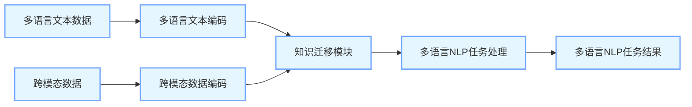

# 跨模态知识迁移在多语言NLP中的应用

> 关键词：跨模态知识迁移、多语言NLP、自然语言处理、知识表示、跨语言理解

> 摘要：本文聚焦于跨模态知识迁移在多语言自然语言处理（NLP）中的应用。首先介绍了相关背景，包括目的、预期读者、文档结构和术语表。接着阐述了核心概念与联系，通过文本示意图和Mermaid流程图展示其原理和架构。详细讲解了核心算法原理，并给出Python源代码示例。同时给出了数学模型和公式，辅以举例说明。通过项目实战，从开发环境搭建、源代码实现与解读等方面进行深入分析。探讨了实际应用场景，推荐了相关的学习资源、开发工具框架和论文著作。最后总结了未来发展趋势与挑战，并提供了常见问题解答和扩展阅读参考资料。旨在全面深入地剖析跨模态知识迁移在多语言NLP中的应用，为相关领域的研究和实践提供有价值的参考。

## 1. 背景介绍 
### 1.1 目的和范围
在当今全球化的时代，多语言自然语言处理（NLP）面临着诸多挑战。不同语言之间存在着巨大的差异，包括语法结构、词汇语义等方面，这使得构建通用的多语言NLP系统变得十分困难。同时，随着多媒体技术的发展，文本数据往往与图像、音频等其他模态的数据相互关联。跨模态知识迁移为解决多语言NLP中的问题提供了新的思路和方法。

本文的目的在于深入探讨跨模态知识迁移在多语言NLP中的应用，详细介绍相关的理论、算法和实践案例。范围涵盖了跨模态知识迁移的核心概念、算法原理、数学模型、实际应用场景等方面，旨在为研究者和开发者提供全面而深入的技术指导。

### 1.2 预期读者
本文的预期读者主要包括以下几类人群：
- **自然语言处理研究者**：对跨模态知识迁移和多语言NLP领域感兴趣，希望深入了解相关理论和技术，为进一步的研究提供参考。
- **人工智能开发者**：从事多语言NLP系统开发的工程师，需要掌握跨模态知识迁移的方法，以提升系统的性能和效果。
- **数据科学家**：关注数据挖掘和知识表示的专业人员，希望了解如何利用跨模态数据进行知识迁移，以解决实际问题。
- **高校学生**：学习计算机科学、人工智能、自然语言处理等相关专业的本科生和研究生，作为学习和研究的参考资料。

### 1.3 文档结构概述
本文的结构如下：
- 核心概念与联系：介绍跨模态知识迁移和多语言NLP的核心概念，以及它们之间的联系，并通过文本示意图和Mermaid流程图进行展示。
- 核心算法原理 & 具体操作步骤：详细讲解跨模态知识迁移的核心算法原理，并给出Python源代码示例，说明具体的操作步骤。
- 数学模型和公式 & 详细讲解 & 举例说明：给出跨模态知识迁移的数学模型和公式，进行详细讲解，并通过具体例子进行说明。
- 项目实战：代码实际案例和详细解释说明：通过一个实际的项目案例，介绍开发环境搭建、源代码实现和代码解读等方面的内容。
- 实际应用场景：探讨跨模态知识迁移在多语言NLP中的实际应用场景。
- 工具和资源推荐：推荐相关的学习资源、开发工具框架和论文著作。
- 总结：未来发展趋势与挑战：总结跨模态知识迁移在多语言NLP中的发展趋势和面临的挑战。
- 附录：常见问题与解答：提供常见问题的解答，帮助读者更好地理解和应用相关技术。
- 扩展阅读 & 参考资料：提供扩展阅读的建议和相关的参考资料。

### 1.4 术语表
#### 1.4.1 核心术语定义
- **跨模态知识迁移**：将一种模态（如图像、音频）中的知识迁移到另一种模态（如文本）中，以提升目标模态的处理效果。
- **多语言NLP**：处理多种语言的自然语言处理任务，包括文本分类、机器翻译、情感分析等。
- **知识表示**：将知识以计算机可处理的形式进行表示，如向量、矩阵等。
- **跨语言理解**：理解不同语言之间的语义关系，实现跨语言的信息检索和交流。

#### 1.4.2 相关概念解释
- **模态**：指数据的不同表现形式，如文本、图像、音频等。
- **知识迁移**：将在一个领域或任务中学习到的知识应用到另一个领域或任务中。
- **预训练模型**：在大规模数据上进行无监督学习得到的模型，可以作为初始化模型用于后续的任务。

#### 1.4.3 缩略词列表
- **NLP**：Natural Language Processing，自然语言处理
- **CNN**：Convolutional Neural Network，卷积神经网络
- **RNN**：Recurrent Neural Network，循环神经网络
- **Transformer**：一种基于注意力机制的神经网络架构

## 2. 核心概念与联系 

### 核心概念原理
跨模态知识迁移的核心思想是利用不同模态数据之间的关联，将一种模态中的知识迁移到另一种模态中，以提升目标模态的处理效果。在多语言NLP中，跨模态知识迁移可以通过结合图像、音频等非文本模态的数据，丰富文本的语义表示，从而提高多语言NLP任务的性能。

例如，在图像描述生成任务中，我们可以将图像中的视觉信息迁移到文本描述中，生成更加准确和丰富的描述。在多语言机器翻译任务中，我们可以利用图像等跨模态信息来辅助理解源语言和目标语言的语义，提高翻译的质量。

### 架构的文本示意图
```plaintext
跨模态知识迁移在多语言NLP中的架构

输入：
- 多语言文本数据
- 跨模态数据（如图像、音频）

处理流程：
1. 多语言文本编码：使用多语言预训练模型对文本进行编码，得到文本的语义表示。
2. 跨模态数据编码：使用相应的模型（如CNN、RNN等）对跨模态数据进行编码，得到跨模态数据的特征表示。
3. 知识迁移模块：将跨模态数据的特征表示与文本的语义表示进行融合，实现知识迁移。
4. 多语言NLP任务处理：将融合后的表示输入到相应的多语言NLP任务模型中，进行任务处理（如文本分类、机器翻译等）。

输出：
- 多语言NLP任务结果（如分类标签、翻译结果等）
```

### Mermaid流程图


## 3. 核心算法原理 & 具体操作步骤 

### 核心算法原理
在跨模态知识迁移中，常用的算法包括基于注意力机制的融合方法和多模态对抗训练方法。下面以基于注意力机制的融合方法为例进行介绍。

基于注意力机制的融合方法的核心思想是通过注意力机制动态地分配跨模态数据的特征权重，将其与文本的语义表示进行融合。具体步骤如下：
1. **特征提取**：分别对多语言文本和跨模态数据进行特征提取，得到文本的语义表示 $\mathbf{h}_t$ 和跨模态数据的特征表示 $\mathbf{h}_m$。
2. **注意力计算**：计算跨模态数据特征对文本语义的注意力权重 $\mathbf{\alpha}$，公式如下：
   $$\mathbf{\alpha} = \text{softmax}(\mathbf{W}_a[\mathbf{h}_t; \mathbf{h}_m] + \mathbf{b}_a)$$
   其中，$\mathbf{W}_a$ 是注意力权重矩阵，$\mathbf{b}_a$ 是偏置向量。
3. **特征融合**：根据注意力权重将跨模态数据特征与文本语义表示进行融合，得到融合后的表示 $\mathbf{h}_{fusion}$，公式如下：
   $$\mathbf{h}_{fusion} = \mathbf{\alpha} \odot \mathbf{h}_m + (1 - \mathbf{\alpha}) \odot \mathbf{h}_t$$
   其中，$\odot$ 表示逐元素相乘。

### 具体操作步骤及Python源代码
以下是一个简单的Python示例，演示了基于注意力机制的跨模态知识迁移的具体操作步骤：

```python
import torch
import torch.nn as nn
import torch.nn.functional as F

# 定义注意力模块
class AttentionModule(nn.Module):
    def __init__(self, input_dim):
        super(AttentionModule, self).__init__()
        self.W_a = nn.Linear(input_dim * 2, 1)

    def forward(self, h_t, h_m):
        # 拼接文本和跨模态特征
        concat_features = torch.cat([h_t, h_m], dim=1)
        # 计算注意力分数
        attention_scores = self.W_a(concat_features)
        # 计算注意力权重
        attention_weights = F.softmax(attention_scores, dim=0)
        # 特征融合
        h_fusion = attention_weights * h_m + (1 - attention_weights) * h_t
        return h_fusion

# 示例输入
text_features = torch.randn(10, 512)  # 文本特征，batch_size=10, feature_dim=512
modal_features = torch.randn(10, 512)  # 跨模态特征，batch_size=10, feature_dim=512

# 初始化注意力模块
attention_module = AttentionModule(512)

# 进行特征融合
h_fusion = attention_module(text_features, modal_features)

print("融合后的特征形状:", h_fusion.shape)
```

在上述代码中，我们首先定义了一个注意力模块 `AttentionModule`，该模块接受文本特征和跨模态特征作为输入，通过注意力机制计算注意力权重，并将跨模态特征与文本特征进行融合。然后，我们生成了示例输入，并使用注意力模块进行特征融合，最后打印出融合后的特征形状。

## 4. 数学模型和公式 & 详细讲解 & 举例说明 

### 数学模型和公式
在跨模态知识迁移中，我们可以使用以下数学模型来描述基于注意力机制的融合过程：

#### 特征提取
假设我们有一个多语言文本序列 $\mathbf{x}_t = [x_{t1}, x_{t2}, \cdots, x_{tn}]$ 和一个跨模态数据序列 $\mathbf{x}_m = [x_{m1}, x_{m2}, \cdots, x_{mk}]$。通过相应的编码器（如多语言预训练模型和CNN、RNN等），我们可以得到文本的语义表示 $\mathbf{h}_t$ 和跨模态数据的特征表示 $\mathbf{h}_m$：
$$\mathbf{h}_t = \text{Encoder}_t(\mathbf{x}_t)$$
$$\mathbf{h}_m = \text{Encoder}_m(\mathbf{x}_m)$$

#### 注意力计算
注意力权重 $\mathbf{\alpha}$ 的计算可以表示为：
$$\mathbf{\alpha} = \text{softmax}(\mathbf{W}_a[\mathbf{h}_t; \mathbf{h}_m] + \mathbf{b}_a)$$
其中，$\mathbf{W}_a$ 是注意力权重矩阵，$\mathbf{b}_a$ 是偏置向量，$[\mathbf{h}_t; \mathbf{h}_m]$ 表示将 $\mathbf{h}_t$ 和 $\mathbf{h}_m$ 进行拼接。

#### 特征融合
融合后的表示 $\mathbf{h}_{fusion}$ 可以表示为：
$$\mathbf{h}_{fusion} = \mathbf{\alpha} \odot \mathbf{h}_m + (1 - \mathbf{\alpha}) \odot \mathbf{h}_t$$
其中，$\odot$ 表示逐元素相乘。

### 详细讲解
- **特征提取**：编码器的作用是将输入的文本和跨模态数据转换为向量表示，以便后续的处理。多语言预训练模型（如mBERT、XLM-R等）可以有效地捕捉多语言文本的语义信息，而CNN、RNN等模型可以用于提取跨模态数据的特征。
- **注意力计算**：注意力机制的作用是动态地分配跨模态数据特征的权重，使得模型能够更加关注与文本语义相关的跨模态信息。通过计算注意力权重，我们可以将跨模态数据的特征与文本的语义表示进行融合。
- **特征融合**：将注意力权重与跨模态数据特征和文本语义表示进行逐元素相乘，然后相加，得到融合后的表示。这样可以将跨模态数据的知识迁移到文本表示中，提高文本的语义表示能力。

### 举例说明
假设我们有一个图像描述生成任务，输入是一张图像和对应的多语言文本描述。我们首先使用CNN对图像进行特征提取，得到图像的特征表示 $\mathbf{h}_m$，使用多语言预训练模型对文本描述进行编码，得到文本的语义表示 $\mathbf{h}_t$。

然后，我们计算注意力权重 $\mathbf{\alpha}$，例如，$\mathbf{\alpha} = [0.2, 0.8]$，表示图像特征在融合中的权重为0.8，文本特征的权重为0.2。接着，我们将注意力权重与图像特征和文本特征进行逐元素相乘，得到：
$$\mathbf{\alpha} \odot \mathbf{h}_m = 0.8 \times \mathbf{h}_m$$
$$(1 - \mathbf{\alpha}) \odot \mathbf{h}_t = 0.2 \times \mathbf{h}_t$$
最后，将两者相加，得到融合后的表示 $\mathbf{h}_{fusion}$：
$$\mathbf{h}_{fusion} = 0.8 \times \mathbf{h}_m + 0.2 \times \mathbf{h}_t$$
这个融合后的表示包含了图像和文本的信息，可以用于后续的图像描述生成任务。

## 5. 项目实战：代码实际案例和详细解释说明 

### 5.1  开发环境搭建
在进行跨模态知识迁移在多语言NLP中的项目实战之前，我们需要搭建相应的开发环境。以下是具体的步骤：

#### 安装Python
首先，确保你已经安装了Python 3.6或更高版本。你可以从Python官方网站（https://www.python.org/downloads/）下载并安装Python。

#### 创建虚拟环境
为了避免不同项目之间的依赖冲突，建议使用虚拟环境。可以使用 `venv` 或 `conda` 来创建虚拟环境。以下是使用 `venv` 创建虚拟环境的示例：
```bash
python -m venv myenv
source myenv/bin/activate  # 激活虚拟环境（Linux/Mac）
myenv\Scripts\activate  # 激活虚拟环境（Windows）
```

#### 安装依赖库
在虚拟环境中，安装项目所需的依赖库，包括 `torch`、`transformers`、`numpy` 等。可以使用 `pip` 进行安装：
```bash
pip install torch transformers numpy
```

### 5.2  源代码详细实现和代码解读
以下是一个简单的跨模态知识迁移在多语言文本分类任务中的项目实战代码示例：

```python
import torch
import torch.nn as nn
import torch.optim as optim
from transformers import AutoTokenizer, AutoModel
import numpy as np

# 定义跨模态知识迁移模型
class CrossModalClassifier(nn.Module):
    def __init__(self, model_name, num_classes):
        super(CrossModalClassifier, self).__init__()
        # 加载多语言预训练模型
        self.text_encoder = AutoModel.from_pretrained(model_name)
        # 定义注意力模块
        self.attention = AttentionModule(self.text_encoder.config.hidden_size)
        # 定义分类器
        self.classifier = nn.Linear(self.text_encoder.config.hidden_size, num_classes)

    def forward(self, input_ids, attention_mask, modal_features):
        # 文本编码
        text_output = self.text_encoder(input_ids=input_ids, attention_mask=attention_mask)
        text_features = text_output.last_hidden_state[:, 0, :]  # 取 [CLS] 标记的输出
        # 特征融合
        h_fusion = self.attention(text_features, modal_features)
        # 分类
        logits = self.classifier(h_fusion)
        return logits

# 定义注意力模块
class AttentionModule(nn.Module):
    def __init__(self, input_dim):
        super(AttentionModule, self).__init__()
        self.W_a = nn.Linear(input_dim * 2, 1)

    def forward(self, h_t, h_m):
        # 拼接文本和跨模态特征
        concat_features = torch.cat([h_t, h_m], dim=1)
        # 计算注意力分数
        attention_scores = self.W_a(concat_features)
        # 计算注意力权重
        attention_weights = torch.softmax(attention_scores, dim=0)
        # 特征融合
        h_fusion = attention_weights * h_m + (1 - attention_weights) * h_t
        return h_fusion

# 示例数据
model_name = 'bert-base-multilingual-cased'
num_classes = 2
input_texts = ["This is a sample text.", "Another sample text."]
modal_features = torch.randn(len(input_texts), 768)  # 示例跨模态特征

# 数据预处理
tokenizer = AutoTokenizer.from_pretrained(model_name)
inputs = tokenizer(input_texts, return_tensors='pt', padding=True, truncation=True)
input_ids = inputs['input_ids']
attention_mask = inputs['attention_mask']

# 初始化模型
model = CrossModalClassifier(model_name, num_classes)

# 定义损失函数和优化器
criterion = nn.CrossEntropyLoss()
optimizer = optim.Adam(model.parameters(), lr=1e-5)

# 训练模型
num_epochs = 3
for epoch in range(num_epochs):
    optimizer.zero_grad()
    logits = model(input_ids, attention_mask, modal_features)
    labels = torch.randint(0, num_classes, (len(input_texts),))  # 示例标签
    loss = criterion(logits, labels)
    loss.backward()
    optimizer.step()
    print(f'Epoch {epoch+1}/{num_epochs}, Loss: {loss.item()}')
```

### 代码解读与分析
- **模型定义**：`CrossModalClassifier` 类定义了跨模态知识迁移的文本分类模型。该模型包含一个多语言预训练模型 `text_encoder`、一个注意力模块 `attention` 和一个分类器 `classifier`。
- **数据预处理**：使用 `AutoTokenizer` 对输入文本进行分词和编码，得到 `input_ids` 和 `attention_mask`。同时，生成示例跨模态特征 `modal_features`。
- **前向传播**：在 `forward` 方法中，首先对文本进行编码，得到文本特征 `text_features`。然后，使用注意力模块将文本特征与跨模态特征进行融合，得到融合后的特征 `h_fusion`。最后，将融合后的特征输入到分类器中，得到分类结果 `logits`。
- **训练过程**：定义损失函数 `criterion` 和优化器 `optimizer`，在每个训练周期中，计算损失并进行反向传播和参数更新。

通过这个项目实战，我们可以看到如何将跨模态知识迁移应用到多语言文本分类任务中，提高模型的性能。

## 6. 实际应用场景 
跨模态知识迁移在多语言NLP中有许多实际应用场景，以下是一些常见的场景：

### 多语言图像描述生成
在多语言图像描述生成任务中，跨模态知识迁移可以利用图像的视觉信息来辅助生成更加准确和丰富的多语言描述。例如，在一个国际旅游网站中，需要为不同语言的用户提供景点图片的描述。通过跨模态知识迁移，我们可以将图像中的视觉特征迁移到文本描述中，生成符合不同语言习惯的描述文本。

### 多语言机器翻译
在多语言机器翻译任务中，跨模态知识迁移可以利用图像、音频等跨模态信息来辅助理解源语言和目标语言的语义，提高翻译的质量。例如，在翻译一些与图像相关的文本时，如产品说明书、旅游指南等，结合图像信息可以更好地理解文本的含义，从而生成更准确的翻译结果。

### 多语言情感分析
在多语言情感分析任务中，跨模态知识迁移可以利用音频的情感信息来辅助判断文本的情感倾向。例如，在分析一段多语言的视频评论时，结合视频中的音频情感信息，可以更准确地判断评论的情感是积极、消极还是中性。

### 多语言信息检索
在多语言信息检索任务中，跨模态知识迁移可以利用图像、音频等跨模态信息来扩展检索的范围和准确性。例如，在一个多语言的图片搜索引擎中，用户可以输入文本查询关键词，同时结合图像的视觉特征进行检索，提高检索的效果。

## 7. 工具和资源推荐
### 7.1 学习资源推荐
#### 7.1.1 书籍推荐
- 《自然语言处理入门》：这本书全面介绍了自然语言处理的基本概念、算法和应用，适合初学者入门。
- 《深度学习》：由Ian Goodfellow、Yoshua Bengio和Aaron Courville合著，是深度学习领域的经典教材，对理解跨模态知识迁移的深度学习方法有很大帮助。
- 《多语言自然语言处理》：专门介绍了多语言自然语言处理的相关技术和方法，包括跨语言理解、机器翻译等。

#### 7.1.2 在线课程
- Coursera上的“Natural Language Processing Specialization”：由斯坦福大学的教授授课，涵盖了自然语言处理的各个方面，包括跨模态知识迁移的相关内容。
- edX上的“Deep Learning Specialization”：由Andrew Ng教授授课，深入介绍了深度学习的理论和实践，对理解跨模态知识迁移的深度学习模型有很大帮助。

#### 7.1.3 技术博客和网站
- arXiv.org：一个预印本平台，提供了大量的学术论文，包括跨模态知识迁移和多语言NLP领域的最新研究成果。
- Towards Data Science：一个数据科学和机器学习的技术博客，有很多关于跨模态知识迁移和自然语言处理的文章。
- Hugging Face Blog：Hugging Face官方博客，提供了关于自然语言处理模型和工具的最新信息。

### 7.2 开发工具框架推荐
#### 7.2.1 IDE和编辑器
- PyCharm：一款功能强大的Python集成开发环境，提供了代码编辑、调试、版本控制等功能，适合开发跨模态知识迁移和多语言NLP项目。
- Jupyter Notebook：一个交互式的开发环境，适合进行数据探索、模型训练和结果展示，非常适合初学者和研究者使用。

#### 7.2.2 调试和性能分析工具
- TensorBoard：一个用于可视化深度学习模型训练过程和结果的工具，可以帮助我们监控模型的训练进度、损失函数变化等。
- PyTorch Profiler：PyTorch提供的性能分析工具，可以帮助我们找出模型中的性能瓶颈，优化模型的运行效率。

#### 7.2.3 相关框架和库
- PyTorch：一个开源的深度学习框架，提供了丰富的神经网络层和优化算法，适合开发跨模态知识迁移和多语言NLP模型。
- Transformers：Hugging Face开发的一个自然语言处理库，提供了大量的预训练模型和工具，方便我们进行多语言NLP任务的开发。
- OpenCV：一个开源的计算机视觉库，提供了丰富的图像处理和计算机视觉算法，适合处理跨模态数据中的图像信息。

### 7.3 相关论文著作推荐
#### 7.3.1 经典论文
- "Attention Is All You Need"：提出了Transformer架构，为跨模态知识迁移和多语言NLP中的序列建模提供了强大的工具。
- "BERT: Pre-training of Deep Bidirectional Transformers for Language Understanding"：介绍了BERT预训练模型，开创了预训练模型在自然语言处理中的应用先河。
- "Multilingual BERT: A Step Towards Universal Language Representation"：介绍了多语言BERT模型，为多语言自然语言处理提供了有效的解决方案。

#### 7.3.2 最新研究成果
- 可以关注ACL（Association for Computational Linguistics）、EMNLP（Conference on Empirical Methods in Natural Language Processing）等自然语言处理领域的顶级会议，获取跨模态知识迁移和多语言NLP领域的最新研究成果。

#### 7.3.3 应用案例分析
- 可以参考一些实际应用案例的论文，了解跨模态知识迁移在多语言NLP中的具体应用和实践经验。例如，一些关于多语言图像描述生成、多语言机器翻译等方面的论文。

## 8. 总结：未来发展趋势与挑战
### 未来发展趋势
- **更复杂的跨模态融合方法**：未来的研究将探索更复杂的跨模态融合方法，如基于图神经网络的跨模态融合、多模态对抗训练等，以更好地利用不同模态数据之间的关联，提高跨模态知识迁移的效果。
- **跨模态知识图谱的构建**：构建跨模态知识图谱，将不同模态的数据和知识进行整合，为多语言NLP提供更丰富的知识支持。例如，将图像、文本、音频等信息关联起来，形成一个统一的知识图谱。
- **多模态预训练模型的发展**：随着预训练模型的不断发展，未来将出现更多的多模态预训练模型，这些模型可以在大规模的跨模态数据上进行预训练，然后应用到各种多语言NLP任务中，提高模型的性能和泛化能力。
- **跨语言跨模态的应用拓展**：跨模态知识迁移在多语言NLP中的应用将不断拓展，例如在智能客服、智能教育、智能医疗等领域的应用，为人们提供更加智能、便捷的服务。

### 挑战
- **跨模态数据的获取和标注**：跨模态数据的获取和标注是一个挑战，因为不同模态的数据具有不同的特点和格式，需要专门的技术和工具进行处理。同时，标注跨模态数据需要耗费大量的人力和物力。
- **跨模态语义理解的困难**：不同模态数据之间的语义关系复杂，如何准确地理解和表示跨模态语义是一个挑战。例如，如何将图像中的视觉信息准确地映射到文本的语义中，是一个需要解决的问题。
- **计算资源的需求**：跨模态知识迁移和多语言NLP模型通常需要大量的计算资源进行训练和推理，这对硬件设备和计算成本提出了较高的要求。如何在有限的计算资源下提高模型的性能和效率是一个挑战。
- **跨语言文化差异的处理**：在多语言NLP中，不同语言之间存在着文化差异，如何处理这些文化差异，使模型能够在不同语言和文化背景下都能取得良好的效果，是一个需要解决的问题。

## 9. 附录：常见问题与解答
### 问题1：跨模态知识迁移和传统的知识迁移有什么区别？
传统的知识迁移主要关注同一模态（如文本）内的知识迁移，而跨模态知识迁移则是将不同模态（如文本、图像、音频）之间的知识进行迁移。跨模态知识迁移可以利用不同模态数据之间的互补信息，提高目标模态的处理效果。

### 问题2：如何选择合适的跨模态数据进行知识迁移？
选择合适的跨模态数据需要考虑以下因素：
- **数据的相关性**：跨模态数据应与目标任务相关，例如在图像描述生成任务中，选择与图像相关的文本数据。
- **数据的质量**：跨模态数据的质量应较高，避免噪声和错误数据的影响。
- **数据的规模**：跨模态数据的规模应足够大，以保证模型能够学习到足够的知识。

### 问题3：跨模态知识迁移在多语言NLP中的应用有哪些局限性？
跨模态知识迁移在多语言NLP中的应用存在以下局限性：
- **跨模态数据的获取和标注困难**：如前所述，跨模态数据的获取和标注需要耗费大量的人力和物力。
- **跨模态语义理解的困难**：不同模态数据之间的语义关系复杂，准确理解和表示跨模态语义存在困难。
- **计算资源的需求**：跨模态知识迁移和多语言NLP模型通常需要大量的计算资源进行训练和推理。

### 问题4：如何评估跨模态知识迁移在多语言NLP中的效果？
可以使用以下指标来评估跨模态知识迁移在多语言NLP中的效果：
- **准确率**：在分类、翻译等任务中，计算模型预测结果的准确率。
- **召回率**：在信息检索等任务中，计算模型召回相关信息的比例。
- **F1值**：综合考虑准确率和召回率的指标。
- **BLEU分数**：在机器翻译任务中，常用的评估指标，用于衡量翻译结果与参考翻译的相似度。

## 10. 扩展阅读 & 参考资料
### 扩展阅读
- 《计算机视觉：模型、学习和推理》：深入介绍了计算机视觉的相关知识，对于理解跨模态知识迁移中的图像数据处理有很大帮助。
- 《语音识别原理与应用》：介绍了语音识别的基本原理和应用，对于理解跨模态知识迁移中的音频数据处理有一定的参考价值。

### 参考资料
- Vaswani, A., Shazeer, N., Parmar, N., Uszkoreit, J., Jones, L., Gomez, A. N.,... & Polosukhin, I. (2017). Attention is all you need. In Advances in neural information processing systems (pp. 5998-6008).
- Devlin, J., Chang, M. W., Lee, K., & Toutanova, K. (2018). Bert: Pre-training of deep bidirectional transformers for language understanding. arXiv preprint arXiv:1810.04805.
- Conneau, A., Khandelwal, K., Goyal, N., Chaudhary, V., Wenzek, G., Guzmán, F.,... & Stoyanov, V. (2019). Unsupervised cross-lingual representation learning at scale. arXiv preprint arXiv:1911.02116.

作者：AI天才研究院/AI Genius Institute & 禅与计算机程序设计艺术 /Zen And The Art of Computer Programming