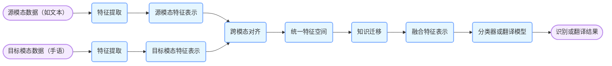

# 跨模态知识迁移在手语识别与翻译中的应用

> 关键词：跨模态知识迁移、手语识别、手语翻译、多模态学习、深度学习

> 摘要：本文深入探讨了跨模态知识迁移在手语识别与翻译中的应用。首先介绍了跨模态知识迁移和手语识别与翻译的背景知识，包括研究目的、预期读者、文档结构和相关术语。接着阐述了核心概念，如跨模态知识表示、迁移机制等，并给出了原理和架构的示意图与流程图。详细讲解了核心算法原理，使用Python代码进行了说明，同时给出了数学模型和公式，并举例解释。通过项目实战，展示了开发环境搭建、源代码实现及代码解读。分析了实际应用场景，推荐了学习资源、开发工具框架和相关论文著作。最后总结了未来发展趋势与挑战，解答了常见问题，并提供了扩展阅读和参考资料，旨在为相关领域的研究和实践提供全面而深入的指导。

## 1. 背景介绍 
### 1.1 目的和范围
手语作为聋哑人群体重要的交流方式，其准确的识别与翻译对于促进聋哑人与正常人之间的沟通交流具有重大意义。然而，手语数据的获取存在一定难度，且标注成本较高，导致训练数据有限。跨模态知识迁移技术可以将其他模态（如文本、图像、语音等）中丰富的知识迁移到手语识别与翻译任务中，从而提高手语识别与翻译的准确性和效率。

本文的范围涵盖了跨模态知识迁移的基本原理、在手语识别与翻译中的具体应用方法、相关算法的实现以及实际应用场景分析等方面。旨在为研究人员和开发者提供一个全面的技术参考，帮助他们更好地理解和应用跨模态知识迁移技术来解决手语识别与翻译中的问题。

### 1.2 预期读者
本文预期读者包括人工智能、计算机视觉、自然语言处理等领域的研究人员，对跨模态学习和手语识别与翻译感兴趣的学生，以及从事相关软件开发和应用的工程师。这些读者可能具备一定的机器学习和深度学习基础知识，但不一定对手语识别与翻译和跨模态知识迁移有深入的了解。通过阅读本文，他们可以系统地学习跨模态知识迁移在手语识别与翻译中的应用技术。

### 1.3 文档结构概述
本文将按照以下结构进行组织：
- 核心概念与联系：介绍跨模态知识迁移、手语识别与翻译的核心概念，以及它们之间的联系，并给出相应的原理和架构示意图与流程图。
- 核心算法原理 & 具体操作步骤：详细讲解跨模态知识迁移在手语识别与翻译中常用的算法原理，并使用Python代码进行实现。
- 数学模型和公式 & 详细讲解 & 举例说明：给出跨模态知识迁移和手语识别与翻译的数学模型和公式，并通过具体例子进行解释。
- 项目实战：代码实际案例和详细解释说明：通过一个实际的项目案例，展示跨模态知识迁移在手语识别与翻译中的应用，包括开发环境搭建、源代码实现和代码解读。
- 实际应用场景：分析跨模态知识迁移在手语识别与翻译中的实际应用场景。
- 工具和资源推荐：推荐学习跨模态知识迁移和手语识别与翻译所需的书籍、在线课程、技术博客和网站，以及开发工具框架和相关论文著作。
- 总结：未来发展趋势与挑战：总结跨模态知识迁移在手语识别与翻译中的应用现状，分析未来的发展趋势和面临的挑战。
- 附录：常见问题与解答：解答读者在学习和应用跨模态知识迁移和手语识别与翻译过程中可能遇到的常见问题。
- 扩展阅读 & 参考资料：提供相关的扩展阅读材料和参考资料，方便读者进一步深入学习。

### 1.4 术语表
#### 1.4.1 核心术语定义
- **跨模态知识迁移**：将一种模态（如文本、图像、语音等）中的知识迁移到另一种模态（如手语）中，以提高目标模态任务（如手语识别与翻译）的性能。
- **手语识别**：将手语动作转换为对应的文本或语义信息的过程。
- **手语翻译**：将手语动作转换为另一种语言（如口语或书面语）的过程。
- **多模态学习**：同时处理和分析多种模态数据（如文本、图像、语音等）的学习方法。
- **深度学习**：一种基于人工神经网络的机器学习方法，通过构建多层神经网络来学习数据的特征和模式。

#### 1.4.2 相关概念解释
- **模态**：指数据的不同表现形式，如文本、图像、语音、手语等。不同模态的数据具有不同的特征和表示方式。
- **知识表示**：将知识以某种形式进行表示，以便计算机能够处理和理解。在跨模态知识迁移中，需要将不同模态的知识表示为统一的特征空间。
- **迁移学习**：将在一个任务或领域中学习到的知识应用到另一个相关任务或领域中的学习方法。跨模态知识迁移是迁移学习的一种特殊形式。

#### 1.4.3 缩略词列表
- **CNN**：Convolutional Neural Network，卷积神经网络
- **RNN**：Recurrent Neural Network，循环神经网络
- **LSTM**：Long Short-Term Memory，长短期记忆网络
- **GRU**：Gated Recurrent Unit，门控循环单元
- **Transformer**：一种基于注意力机制的深度学习模型

## 2. 核心概念与联系 

### 2.1 跨模态知识迁移的核心概念
跨模态知识迁移的核心思想是利用不同模态数据之间的相关性，将一种模态中丰富的知识迁移到另一种模态中。在跨模态知识迁移中，通常需要解决以下几个关键问题：
- **跨模态知识表示**：将不同模态的数据表示为统一的特征空间，以便进行知识的迁移和融合。常见的方法包括使用深度学习模型（如CNN、RNN等）提取不同模态数据的特征，并将这些特征映射到同一个低维空间中。
- **迁移机制**：确定如何将源模态中的知识迁移到目标模态中。常见的迁移机制包括基于特征的迁移、基于模型的迁移和基于实例的迁移等。
- **跨模态对齐**：找到不同模态数据之间的对应关系，以便更好地进行知识的迁移和融合。跨模态对齐可以通过计算不同模态数据之间的相似度或相关性来实现。

### 2.2 手语识别与翻译的核心概念
手语识别是指将手语动作转换为对应的文本或语义信息的过程。手语识别通常可以分为基于视觉的手语识别和基于传感器的手语识别两种方式。基于视觉的手语识别通过摄像头采集手语视频，然后使用计算机视觉技术对手语动作进行分析和识别；基于传感器的手语识别则通过佩戴在手上的传感器（如惯性传感器、肌电传感器等）采集手语动作的相关数据，然后进行分析和识别。

手语翻译是指将手语动作转换为另一种语言（如口语或书面语）的过程。手语翻译通常需要先进行手语识别，然后将识别结果转换为目标语言。手语翻译可以分为实时翻译和离线翻译两种方式。实时翻译要求在短时间内完成手语的识别和翻译，通常用于实时交流场景；离线翻译则可以在较长时间内完成手语的识别和翻译，通常用于视频字幕生成等场景。

### 2.3 跨模态知识迁移与手语识别与翻译的联系
跨模态知识迁移可以为手语识别与翻译提供丰富的知识和信息，从而提高手语识别与翻译的准确性和效率。具体来说，跨模态知识迁移可以在手语识别与翻译中发挥以下作用：
- **数据增强**：由于手语数据的获取和标注成本较高，导致训练数据有限。跨模态知识迁移可以利用其他模态（如文本、图像、语音等）中丰富的数据来增强手语训练数据，从而提高手语识别与翻译模型的泛化能力。
- **特征融合**：不同模态的数据具有不同的特征和信息。跨模态知识迁移可以将不同模态的数据特征进行融合，从而提取更丰富、更全面的手语特征，提高手语识别与翻译的准确性。
- **语义理解**：手语的语义理解是手语识别与翻译的关键。跨模态知识迁移可以利用其他模态（如文本）中丰富的语义信息来辅助手语的语义理解，从而提高手语识别与翻译的准确性。

### 2.4 核心概念原理和架构的文本示意图
```plaintext
+-------------------+         +-------------------+
| 源模态数据（如文本） |         | 目标模态数据（手语） |
+-------------------+         +-------------------+
          |                           |
          | 特征提取（如CNN、RNN）    | 特征提取（如CNN、RNN）
          v                           v
+-------------------+         +-------------------+
| 源模态特征表示     |         | 目标模态特征表示   |
+-------------------+         +-------------------+
          |                           |
          | 跨模态对齐（如计算相似度） |
          v                           v
+-------------------+         +-------------------+
| 统一特征空间       |         | 统一特征空间       |
+-------------------+         +-------------------+
          |                           |
          | 知识迁移（如基于特征的迁移） |
          v                           v
+-------------------+         +-------------------+
| 融合特征表示       |         | 融合特征表示       |
+-------------------+         +-------------------+
          |                           |
          | 分类器或翻译模型（如LSTM、Transformer） |
          v                           v
+-------------------+         +-------------------+
| 识别或翻译结果     |         | 识别或翻译结果     |
+-------------------+         +-------------------+
```

### 2.5 Mermaid流程图


## 3. 核心算法原理 & 具体操作步骤 

### 3.1 基于特征的跨模态知识迁移算法原理
基于特征的跨模态知识迁移算法的核心思想是将源模态和目标模态的数据特征映射到同一个低维空间中，然后在这个统一的特征空间中进行知识的迁移和融合。具体步骤如下：
1. **特征提取**：使用深度学习模型（如CNN、RNN等）分别提取源模态和目标模态数据的特征。
2. **特征映射**：将源模态和目标模态的特征映射到同一个低维空间中。可以使用线性映射或非线性映射的方法，如主成分分析（PCA）、核主成分分析（KPCA）等。
3. **知识迁移**：在统一的特征空间中，将源模态的特征信息迁移到目标模态的特征中。可以使用加权平均、特征拼接等方法进行知识的迁移。
4. **模型训练**：使用迁移后的特征训练目标模态的分类器或翻译模型。

### 3.2 Python代码实现
```python
import numpy as np
from sklearn.decomposition import PCA
from sklearn.linear_model import LogisticRegression

# 假设我们有源模态数据和目标模态数据
# 源模态数据
source_data = np.random.rand(100, 10)  # 100个样本，每个样本10个特征
source_labels = np.random.randint(0, 2, 100)  # 100个样本的标签

# 目标模态数据
target_data = np.random.rand(50, 10)  # 50个样本，每个样本10个特征
target_labels = np.random.randint(0, 2, 50)  # 50个样本的标签

# 步骤1：特征提取
# 这里假设特征已经提取好，直接使用原始数据

# 步骤2：特征映射
pca = PCA(n_components=5)  # 将特征维度降低到5
source_features = pca.fit_transform(source_data)
target_features = pca.transform(target_data)

# 步骤3：知识迁移
# 这里使用简单的特征拼接方法
combined_features = np.concatenate((source_features, target_features), axis=0)
combined_labels = np.concatenate((source_labels, target_labels), axis=0)

# 步骤4：模型训练
model = LogisticRegression()
model.fit(combined_features, combined_labels)

# 预测目标模态数据
predictions = model.predict(target_features)
print("预测结果:", predictions)
```

### 3.3 具体操作步骤解释
1. **数据准备**：准备源模态数据和目标模态数据，包括数据的特征和标签。
2. **特征提取**：使用深度学习模型（如CNN、RNN等）提取源模态和目标模态数据的特征。在上述代码中，我们假设特征已经提取好，直接使用原始数据。
3. **特征映射**：使用PCA将源模态和目标模态的特征映射到同一个低维空间中。PCA可以找到数据的主成分，从而将数据的维度降低。
4. **知识迁移**：将源模态和目标模态的特征进行拼接，得到一个新的特征矩阵。在实际应用中，还可以使用加权平均等方法进行知识的迁移。
5. **模型训练**：使用迁移后的特征训练一个分类器（如逻辑回归）。在上述代码中，我们使用逻辑回归模型进行训练。
6. **预测**：使用训练好的模型对目标模态数据进行预测。

## 4. 数学模型和公式 & 详细讲解 & 举例说明 

### 4.1 跨模态知识表示的数学模型
假设我们有两种模态的数据：源模态数据 $X_s \in \mathbb{R}^{n_s \times d_s}$ 和目标模态数据 $X_t \in \mathbb{R}^{n_t \times d_t}$，其中 $n_s$ 和 $n_t$ 分别是源模态和目标模态数据的样本数量，$d_s$ 和 $d_t$ 分别是源模态和目标模态数据的特征维度。

我们的目标是将源模态和目标模态的数据特征映射到同一个低维空间 $\mathbb{R}^k$ 中，其中 $k \ll d_s, d_t$。可以使用一个映射函数 $f_s: \mathbb{R}^{d_s} \to \mathbb{R}^k$ 和 $f_t: \mathbb{R}^{d_t} \to \mathbb{R}^k$ 来实现特征的映射。

在实际应用中，通常使用神经网络来学习这些映射函数。例如，对于源模态数据，可以使用一个卷积神经网络（CNN）来提取特征，然后使用一个全连接层将特征映射到低维空间中。对于目标模态数据，也可以使用类似的方法进行特征提取和映射。

### 4.2 跨模态对齐的数学公式
跨模态对齐的目标是找到源模态和目标模态数据之间的对应关系。可以使用相似度度量函数来计算不同模态数据之间的相似度。常见的相似度度量函数包括欧氏距离、余弦相似度等。

假设我们已经将源模态和目标模态的数据特征映射到同一个低维空间中，得到源模态特征 $F_s \in \mathbb{R}^{n_s \times k}$ 和目标模态特征 $F_t \in \mathbb{R}^{n_t \times k}$。可以使用余弦相似度来计算源模态和目标模态特征之间的相似度：
$$
\text{Sim}(F_s, F_t) = \frac{F_s F_t^T}{\|F_s\| \|F_t\|}
$$
其中，$\|F_s\|$ 和 $\|F_t\|$ 分别是源模态和目标模态特征的范数。

### 4.3 知识迁移的数学模型
知识迁移的目标是将源模态中的知识迁移到目标模态中。可以使用加权平均的方法来实现知识的迁移。假设我们已经计算出源模态和目标模态特征之间的相似度矩阵 $S \in \mathbb{R}^{n_s \times n_t}$，则可以将源模态的特征信息迁移到目标模态的特征中：
$$
F_t' = \sum_{i=1}^{n_s} \frac{S_{i,j}}{\sum_{l=1}^{n_s} S_{l,j}} F_{s,i}
$$
其中，$F_t'$ 是迁移后的目标模态特征，$S_{i,j}$ 是源模态第 $i$ 个样本和目标模态第 $j$ 个样本之间的相似度，$F_{s,i}$ 是源模态第 $i$ 个样本的特征。

### 4.4 举例说明
假设我们有两个模态的数据：文本数据和图像数据。文本数据的特征维度为 $d_s = 100$，图像数据的特征维度为 $d_t = 200$。我们希望将文本数据中的知识迁移到图像数据中。

首先，我们使用一个文本编码器（如BERT）提取文本数据的特征，得到源模态特征 $F_s \in \mathbb{R}^{n_s \times 100}$。然后，使用一个图像编码器（如ResNet）提取图像数据的特征，得到目标模态特征 $F_t \in \mathbb{R}^{n_t \times 200}$。

接着，我们使用PCA将源模态和目标模态的特征映射到同一个低维空间 $\mathbb{R}^k$ 中，其中 $k = 50$。得到映射后的源模态特征 $F_s' \in \mathbb{R}^{n_s \times 50}$ 和目标模态特征 $F_t' \in \mathbb{R}^{n_t \times 50}$。

然后，我们使用余弦相似度计算源模态和目标模态特征之间的相似度矩阵 $S \in \mathbb{R}^{n_s \times n_t}$。最后，使用加权平均的方法将源模态的特征信息迁移到目标模态的特征中，得到迁移后的目标模态特征 $F_t'' \in \mathbb{R}^{n_t \times 50}$。

## 5. 项目实战：代码实际案例和详细解释说明 

### 5.1  开发环境搭建
#### 5.1.1 安装Python
首先，需要安装Python 3.x版本。可以从Python官方网站（https://www.python.org/downloads/）下载并安装Python。

#### 5.1.2 安装深度学习框架
推荐使用PyTorch作为深度学习框架。可以使用以下命令安装PyTorch：
```sh
pip install torch torchvision
```

#### 5.1.3 安装其他依赖库
还需要安装一些其他的依赖库，如NumPy、Pandas、Matplotlib等。可以使用以下命令安装：
```sh
pip install numpy pandas matplotlib
```

### 5.2  源代码详细实现和代码解读
```python
import torch
import torch.nn as nn
import torch.optim as optim
from torch.utils.data import Dataset, DataLoader
import numpy as np

# 定义数据集类
class SignLanguageDataset(Dataset):
    def __init__(self, data, labels):
        self.data = data
        self.labels = labels

    def __len__(self):
        return len(self.data)

    def __getitem__(self, idx):
        sample = self.data[idx]
        label = self.labels[idx]
        return torch.tensor(sample, dtype=torch.float32), torch.tensor(label, dtype=torch.long)

# 定义源模态特征提取器
class SourceFeatureExtractor(nn.Module):
    def __init__(self, input_dim, hidden_dim, output_dim):
        super(SourceFeatureExtractor, self).__init__()
        self.fc1 = nn.Linear(input_dim, hidden_dim)
        self.relu = nn.ReLU()
        self.fc2 = nn.Linear(hidden_dim, output_dim)

    def forward(self, x):
        x = self.fc1(x)
        x = self.relu(x)
        x = self.fc2(x)
        return x

# 定义目标模态特征提取器
class TargetFeatureExtractor(nn.Module):
    def __init__(self, input_dim, hidden_dim, output_dim):
        super(TargetFeatureExtractor, self).__init__()
        self.fc1 = nn.Linear(input_dim, hidden_dim)
        self.relu = nn.ReLU()
        self.fc2 = nn.Linear(hidden_dim, output_dim)

    def forward(self, x):
        x = self.fc1(x)
        x = self.relu(x)
        x = self.fc2(x)
        return x

# 定义分类器
class Classifier(nn.Module):
    def __init__(self, input_dim, num_classes):
        super(Classifier, self).__init__()
        self.fc = nn.Linear(input_dim, num_classes)

    def forward(self, x):
        x = self.fc(x)
        return x

# 定义跨模态知识迁移模型
class CrossModalTransferModel(nn.Module):
    def __init__(self, source_input_dim, target_input_dim, hidden_dim, feature_dim, num_classes):
        super(CrossModalTransferModel, self).__init__()
        self.source_feature_extractor = SourceFeatureExtractor(source_input_dim, hidden_dim, feature_dim)
        self.target_feature_extractor = TargetFeatureExtractor(target_input_dim, hidden_dim, feature_dim)
        self.classifier = Classifier(feature_dim, num_classes)

    def forward(self, source_x, target_x):
        source_features = self.source_feature_extractor(source_x)
        target_features = self.target_feature_extractor(target_x)
        # 这里简单地将源模态和目标模态的特征拼接起来
        combined_features = torch.cat((source_features, target_features), dim=0)
        logits = self.classifier(combined_features)
        return logits

# 生成模拟数据
source_data = np.random.rand(100, 10)  # 100个样本，每个样本10个特征
source_labels = np.random.randint(0, 2, 100)  # 100个样本的标签
target_data = np.random.rand(50, 20)  # 50个样本，每个样本20个特征
target_labels = np.random.randint(0, 2, 50)  # 50个样本的标签

# 创建数据集和数据加载器
source_dataset = SignLanguageDataset(source_data, source_labels)
target_dataset = SignLanguageDataset(target_data, target_labels)
source_dataloader = DataLoader(source_dataset, batch_size=10, shuffle=True)
target_dataloader = DataLoader(target_dataset, batch_size=10, shuffle=True)

# 初始化模型
model = CrossModalTransferModel(source_input_dim=10, target_input_dim=20, hidden_dim=50, feature_dim=20, num_classes=2)

# 定义损失函数和优化器
criterion = nn.CrossEntropyLoss()
optimizer = optim.Adam(model.parameters(), lr=0.001)

# 训练模型
num_epochs = 10
for epoch in range(num_epochs):
    for (source_batch, source_labels_batch), (target_batch, target_labels_batch) in zip(source_dataloader, target_dataloader):
        optimizer.zero_grad()
        logits = model(source_batch, target_batch)
        combined_labels = torch.cat((source_labels_batch, target_labels_batch), dim=0)
        loss = criterion(logits, combined_labels)
        loss.backward()
        optimizer.step()
    print(f'Epoch {epoch+1}/{num_epochs}, Loss: {loss.item()}')
```

### 5.3  代码解读与分析
#### 5.3.1 数据集类
`SignLanguageDataset` 类继承自 `torch.utils.data.Dataset`，用于封装手语数据集。该类实现了 `__len__` 和 `__getitem__` 方法，分别用于返回数据集的长度和获取指定索引的样本。

#### 5.3.2 特征提取器
`SourceFeatureExtractor` 和 `TargetFeatureExtractor` 类分别用于提取源模态和目标模态数据的特征。这两个类都是简单的全连接神经网络，包含两个线性层和一个ReLU激活函数。

#### 5.3.3 分类器
`Classifier` 类用于对手语数据进行分类。该类是一个简单的全连接层，将特征映射到类别空间。

#### 5.3.4 跨模态知识迁移模型
`CrossModalTransferModel` 类将源模态特征提取器、目标模态特征提取器和分类器组合在一起。在 `forward` 方法中，分别提取源模态和目标模态的特征，然后将它们拼接起来，最后输入到分类器中进行分类。

#### 5.3.5 数据生成和加载
使用 `np.random.rand` 生成模拟的源模态和目标模态数据，并使用 `SignLanguageDataset` 类封装数据集。然后使用 `DataLoader` 类创建数据加载器，用于批量加载数据。

#### 5.3.6 模型训练
使用交叉熵损失函数和Adam优化器对模型进行训练。在每个epoch中，遍历源模态和目标模态的数据加载器，计算损失并进行反向传播和参数更新。

## 6. 实际应用场景 
### 6.1 实时手语交流辅助系统
跨模态知识迁移在手语识别与翻译中的一个重要应用场景是实时手语交流辅助系统。该系统可以实时识别聋哑人的手语动作，并将其翻译为口语或文字，同时将正常人的口语或文字转换为手语动画，从而实现聋哑人与正常人之间的实时交流。

在实时手语交流辅助系统中，跨模态知识迁移可以利用文本、语音等模态中的知识来提高手语识别与翻译的准确性和效率。例如，可以使用大规模的文本语料库来训练语言模型，然后将语言模型中的知识迁移到手语识别与翻译模型中，从而提高手语语义理解的准确性。

### 6.2 手语教育与培训
跨模态知识迁移还可以应用于手语教育与培训领域。通过将视频、图像等模态中的知识迁移到手语学习系统中，可以为学习者提供更加丰富、生动的学习资源。例如，可以使用视频教程来展示手语动作的标准姿势和发音，然后使用跨模态知识迁移技术将视频中的知识迁移到学习者的手语识别与翻译模型中，帮助学习者更好地掌握手语知识和技能。

### 6.3 手语视频字幕生成
手语视频字幕生成是跨模态知识迁移在手语识别与翻译中的另一个重要应用场景。该应用可以将手语视频中的手语动作转换为文字字幕，从而方便聋哑人观看视频和理解视频内容。

在手语视频字幕生成中，跨模态知识迁移可以利用视频中的视觉信息和语音信息来提高手语识别与翻译的准确性。例如，可以使用计算机视觉技术提取视频中的手语动作特征，同时使用语音识别技术提取视频中的语音信息，然后将这两种模态的信息进行融合和迁移，从而提高手语识别与翻译的准确性。

## 7. 工具和资源推荐
### 7.1 学习资源推荐
#### 7.1.1 书籍推荐
- 《深度学习》（Deep Learning）：由Ian Goodfellow、Yoshua Bengio和Aaron Courville撰写，是深度学习领域的经典教材，涵盖了深度学习的基本概念、算法和应用。
- 《Python深度学习》（Deep Learning with Python）：由Francois Chollet撰写，是一本面向Python开发者的深度学习入门书籍，介绍了如何使用Keras框架进行深度学习模型的开发。
- 《多模态机器学习：基础与应用》（Multimodal Machine Learning: Foundations and Applications）：由Tadas Baltrušaitis、Chongyang Ma和Louis-Philippe Morency撰写，是多模态机器学习领域的权威书籍，涵盖了多模态数据处理、跨模态知识迁移等方面的内容。

#### 7.1.2 在线课程
- Coursera上的“深度学习专项课程”（Deep Learning Specialization）：由Andrew Ng教授授课，是深度学习领域的经典在线课程，涵盖了深度学习的基础知识、卷积神经网络、循环神经网络等方面的内容。
- edX上的“多模态机器学习”（Multimodal Machine Learning）：由Louis-Philippe Morency教授授课，是多模态机器学习领域的专业在线课程，介绍了多模态数据处理、跨模态知识迁移等方面的技术和应用。
- 哔哩哔哩上的“动手学深度学习”（Dive into Deep Learning）：由李沐等老师授课，是一门免费的深度学习在线课程，使用MXNet框架进行教学，适合初学者学习。

#### 7.1.3 技术博客和网站
- arXiv.org：是一个开放的预印本平台，提供了大量的学术论文，包括人工智能、机器学习、深度学习等领域的最新研究成果。
- Medium：是一个技术博客平台，有很多人工智能和机器学习领域的专家在上面分享自己的经验和见解。
- Towards Data Science：是一个专注于数据科学和机器学习的技术博客，提供了很多实用的教程和案例分析。

### 7.2 开发工具框架推荐
#### 7.2.1 IDE和编辑器
- PyCharm：是一款专门为Python开发设计的集成开发环境（IDE），提供了代码编辑、调试、版本控制等功能，适合专业开发者使用。
- Jupyter Notebook：是一个交互式的笔记本环境，支持Python、R等多种编程语言，适合数据科学家和研究人员进行数据分析和模型开发。
- Visual Studio Code：是一款轻量级的代码编辑器，支持多种编程语言和插件，具有丰富的扩展功能，适合初学者和小型项目开发。

#### 7.2.2 调试和性能分析工具
- TensorBoard：是TensorFlow框架提供的一个可视化工具，可以用于可视化模型的训练过程、损失函数变化、模型结构等信息，帮助开发者进行调试和性能分析。
- PyTorch Profiler：是PyTorch框架提供的一个性能分析工具，可以用于分析模型的计算时间、内存使用等信息，帮助开发者优化模型性能。
- cProfile：是Python标准库提供的一个性能分析工具，可以用于分析Python代码的执行时间和函数调用次数，帮助开发者找出代码中的性能瓶颈。

#### 7.2.3 相关框架和库
- PyTorch：是一个开源的深度学习框架，提供了丰富的神经网络层和优化算法，支持GPU加速，适合进行深度学习模型的开发和训练。
- TensorFlow：是另一个开源的深度学习框架，由Google开发，提供了高级的深度学习API和分布式训练功能，适合大规模深度学习模型的开发和部署。
- Scikit-learn：是一个开源的机器学习库，提供了丰富的机器学习算法和工具，如分类、回归、聚类等，适合进行传统机器学习任务的开发。

### 7.3 相关论文著作推荐
#### 7.3.1 经典论文
- “Learning Deep Features for Discriminative Localization”：提出了基于卷积神经网络的全局平均池化（Global Average Pooling）方法，用于图像分类和目标定位。
- “Attention Is All You Need”：提出了Transformer模型，是自然语言处理领域的重要突破，为跨模态知识迁移提供了强大的模型基础。
- “Unsupervised Domain Adaptation by Backpropagation”：提出了基于反向传播的无监督域适应方法，为跨模态知识迁移中的域适应问题提供了有效的解决方案。

#### 7.3.2 最新研究成果
- “Cross-Modal Knowledge Transfer for Sign Language Recognition and Translation”：研究了跨模态知识迁移在手语识别与翻译中的应用，提出了一种基于多模态注意力机制的跨模态知识迁移方法。
- “Multimodal Fusion for Sign Language Recognition: A Survey”：对多模态融合在手语识别中的应用进行了综述，介绍了不同的多模态融合方法和技术。
- “Self-Supervised Learning for Sign Language Recognition”：研究了自监督学习在手语识别中的应用，提出了一种基于对比学习的自监督学习方法，用于提高手语识别的性能。

#### 7.3.3 应用案例分析
- “A Real-Time Sign Language Translation System Using Deep Learning”：介绍了一个基于深度学习的实时手语翻译系统的设计和实现，分析了系统的性能和应用效果。
- “Sign Language Education Using Multimodal Technologies”：研究了多模态技术在手语教育中的应用，介绍了一个基于虚拟现实和增强现实的手语教育系统的设计和实现。
- “Sign Language Video Captioning with Multimodal Attention”：提出了一种基于多模态注意力机制的手语视频字幕生成方法，分析了方法的性能和应用效果。

## 8. 总结：未来发展趋势与挑战
### 8.1 未来发展趋势
#### 8.1.1 多模态融合的深度和广度不断拓展
未来，跨模态知识迁移在手语识别与翻译中的应用将更加注重多模态融合的深度和广度。除了现有的文本、图像、语音等模态，还将融合更多的模态信息，如触觉、嗅觉等，以提供更加丰富、全面的手语知识和信息。同时，多模态融合的方法和技术也将不断创新和发展，以提高手语识别与翻译的准确性和效率。

#### 8.1.2 自监督学习和无监督学习的应用将更加广泛
自监督学习和无监督学习可以在没有大量标注数据的情况下进行模型训练，因此在跨模态知识迁移和手语识别与翻译中具有很大的应用潜力。未来，自监督学习和无监督学习的方法和技术将不断发展和完善，以提高手语识别与翻译模型的泛化能力和适应性。

#### 8.1.3 与虚拟现实和增强现实技术的结合将更加紧密
虚拟现实和增强现实技术可以为手语识别与翻译提供更加真实、生动的交互环境。未来，跨模态知识迁移和手语识别与翻译技术将与虚拟现实和增强现实技术更加紧密地结合，开发出更加智能、便捷的手语交流辅助系统和手语教育与培训系统。

### 8.2 面临的挑战
#### 8.2.1 数据获取和标注的困难
手语数据的获取和标注是跨模态知识迁移和手语识别与翻译中的一个重要挑战。手语数据的获取需要专业的设备和人员，且标注成本较高。此外，手语的多样性和复杂性也增加了数据标注的难度。因此，如何高效地获取和标注手语数据是未来需要解决的一个重要问题。

#### 8.2.2 跨模态知识表示和对齐的难题
跨模态知识表示和对齐是跨模态知识迁移中的核心问题。不同模态的数据具有不同的特征和表示方式，如何将它们表示为统一的特征空间，并找到它们之间的对应关系是一个具有挑战性的问题。目前，虽然已经提出了很多跨模态知识表示和对齐的方法，但仍然存在很多不足之处，需要进一步的研究和改进。

#### 8.2.3 模型的可解释性和鲁棒性问题
深度学习模型在跨模态知识迁移和手语识别与翻译中取得了很好的效果，但这些模型往往缺乏可解释性和鲁棒性。在实际应用中，模型的可解释性和鲁棒性非常重要，因为它们关系到模型的可靠性和安全性。因此，如何提高跨模态知识迁移和手语识别与翻译模型的可解释性和鲁棒性是未来需要解决的一个重要问题。

## 9. 附录：常见问题与解答
### 9.1 跨模态知识迁移需要多少源模态数据和目标模态数据？
跨模态知识迁移所需的源模态数据和目标模态数据的数量取决于具体的任务和模型。一般来说，源模态数据越多，模型可以学习到的知识就越丰富，迁移的效果也就越好。目标模态数据的数量也会影响模型的性能，如果目标模态数据过少，模型可能会出现过拟合的问题。在实际应用中，可以通过实验来确定合适的源模态数据和目标模态数据的数量。

### 9.2 跨模态知识迁移的效果受哪些因素影响？
跨模态知识迁移的效果受多种因素影响，主要包括以下几个方面：
- **源模态和目标模态的相关性**：源模态和目标模态之间的相关性越强，知识迁移的效果就越好。
- **特征表示的质量**：特征表示的质量直接影响跨模态知识迁移的效果。好的特征表示可以更好地捕捉数据的本质特征，从而提高知识迁移的准确性。
- **迁移机制的选择**：不同的迁移机制适用于不同的任务和数据，选择合适的迁移机制可以提高知识迁移的效果。
- **模型的复杂度**：模型的复杂度也会影响跨模态知识迁移的效果。过于复杂的模型可能会出现过拟合的问题，而过于简单的模型可能无法学习到足够的知识。

### 9.3 如何评估跨模态知识迁移在手语识别与翻译中的效果？
可以使用以下几种方法来评估跨模态知识迁移在手语识别与翻译中的效果：
- **准确率**：计算手语识别与翻译的准确率，即正确识别和翻译的样本数占总样本数的比例。
- **召回率**：计算手语识别与翻译的召回率，即正确识别和翻译的正样本数占实际正样本数的比例。
- **F1值**：F1值是准确率和召回率的调和平均数，可以综合评估手语识别与翻译的效果。
- **困惑度**：在语言模型中，可以使用困惑度来评估模型的性能。困惑度越低，说明模型的性能越好。

### 9.4 跨模态知识迁移可以应用于其他领域吗？
可以，跨模态知识迁移可以应用于很多其他领域，如计算机视觉、自然语言处理、语音识别等。例如，在计算机视觉中，可以将图像数据中的知识迁移到视频数据中，以提高视频分析的准确性；在自然语言处理中，可以将文本数据中的知识迁移到语音数据中，以提高语音识别和理解的性能。

## 10. 扩展阅读 & 参考资料
### 10.1 扩展阅读材料
- 《人工智能：一种现代的方法》（Artificial Intelligence: A Modern Approach）：是人工智能领域的经典教材，涵盖了人工智能的基本概念、算法和应用。
- 《计算机视觉：算法与应用》（Computer Vision: Algorithms and Applications）：是计算机视觉领域的权威书籍，介绍了计算机视觉的基本算法和应用。
- 《自然语言处理入门》（Natural Language Processing with Python）：是一本面向Python开发者的自然语言处理入门书籍，介绍了如何使用Python进行自然语言处理任务的开发。

### 10.2 参考资料
- 相关的学术论文和研究报告，可以从IEEE Xplore、ACM Digital Library等学术数据库中获取。
- 开源的手语数据集和代码库，如WLASL、SignBank等，可以从GitHub等代码托管平台上获取。
- 深度学习框架的官方文档和教程，如PyTorch、TensorFlow等，可以从官方网站上获取。

作者：AI天才研究院/AI Genius Institute & 禅与计算机程序设计艺术 /Zen And The Art of Computer Programming