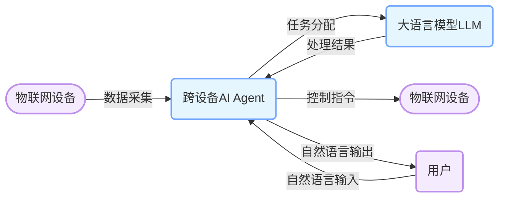

# 跨设备AI Agent：LLM在物联网环境中的部署

> 关键词：跨设备AI Agent、大语言模型（LLM）、物联网、部署、边缘计算

> 摘要：本文聚焦于跨设备AI Agent在物联网环境中部署大语言模型（LLM）这一前沿技术领域。详细阐述了相关核心概念、算法原理、数学模型，通过项目实战展示代码实现与解读。探讨了其实际应用场景，推荐了学习资源、开发工具框架以及相关论文著作。最后对未来发展趋势与挑战进行总结，并提供常见问题解答和扩展阅读参考资料，旨在为读者全面深入地理解和实践该技术提供系统的指导。

## 1. 背景介绍 
### 1.1 目的和范围
随着物联网（IoT）技术的飞速发展，大量设备相互连接并产生海量数据。同时，大语言模型（LLM）如GPT系列展现出强大的自然语言处理能力。将LLM部署到物联网环境中，借助跨设备AI Agent实现更智能、高效的交互和决策成为研究热点。本文的目的是深入探讨如何在物联网环境中部署LLM，涵盖从核心概念到实际应用的各个方面，为开发者和研究人员提供全面的技术指导。范围包括核心概念的解析、算法原理的阐述、数学模型的建立、项目实战的演示、应用场景的分析以及相关资源的推荐等。

### 1.2 预期读者
本文预期读者包括对人工智能、物联网技术感兴趣的开发者、研究人员、技术爱好者。对于正在从事相关领域项目开发的工程师，本文可提供具体的技术实现思路和实践经验；对于科研人员，有助于深入了解该领域的理论基础和前沿动态；对于技术爱好者，能够帮助其建立对跨设备AI Agent和LLM在物联网环境中部署的整体认知。

### 1.3 文档结构概述
本文将按照以下结构展开：首先介绍相关核心概念及它们之间的联系，并通过文本示意图和Mermaid流程图进行可视化展示；接着阐述核心算法原理和具体操作步骤，结合Python源代码详细说明；然后建立数学模型和公式，并举例说明；通过项目实战展示代码的实际案例和详细解释；分析该技术的实际应用场景；推荐学习资源、开发工具框架和相关论文著作；最后总结未来发展趋势与挑战，提供常见问题解答和扩展阅读参考资料。

### 1.4 术语表
#### 1.4.1 核心术语定义
- **跨设备AI Agent**：能够在不同设备之间进行协作和交互的智能代理，可在物联网环境中实现数据收集、处理和决策等功能。
- **大语言模型（LLM）**：基于深度学习的大型语言模型，具有强大的自然语言理解和生成能力，如GPT、BERT等。
- **物联网（IoT）**：通过各种信息传感器、射频识别技术、全球定位系统等技术，实时采集任何需要监控、连接、互动的物体或过程，采集其声、光、热、电、力学、化学、生物、位置等各种需要的信息，通过各类可能的网络接入，实现物与物、物与人的泛在连接，实现对物品和过程的智能化感知、识别和管理。
- **边缘计算**：在靠近物或数据源头的一侧，采用网络、计算、存储、应用核心能力为一体的开放平台，就近提供最近端服务。其应用程序在边缘侧发起，产生更快的网络服务响应，满足行业在实时业务、应用智能、安全与隐私保护等方面的基本需求。

#### 1.4.2 相关概念解释
- **设备异构性**：物联网环境中的设备具有不同的硬件架构、计算能力、存储容量和通信协议等特点，这给LLM的部署带来了挑战。
- **模型压缩**：为了在资源受限的物联网设备上部署LLM，需要对模型进行压缩，减少模型的参数数量和计算量，同时保持模型的性能。
- **联邦学习**：一种分布式机器学习技术，允许在多个设备或机构之间进行协作训练，而无需共享原始数据，保护数据隐私。

#### 1.4.3 缩略词列表
- **LLM**：Large Language Model（大语言模型）
- **IoT**：Internet of Things（物联网）
- **AI**：Artificial Intelligence（人工智能）
- **NLP**：Natural Language Processing（自然语言处理）
- **ML**：Machine Learning（机器学习）

## 2. 核心概念与联系 

### 核心概念原理
跨设备AI Agent在物联网环境中部署LLM涉及多个核心概念，它们相互关联，共同构成了一个复杂的系统。

- **跨设备AI Agent**：作为智能代理，负责在不同的物联网设备之间进行协调和通信。它可以根据设备的状态和任务需求，将LLM的计算任务分配到合适的设备上执行。例如，在一个智能家居系统中，AI Agent可以根据不同家电设备的计算能力和负载情况，决定将语音识别和自然语言处理任务分配给哪台设备。
- **大语言模型（LLM）**：是基于深度学习的语言模型，通过大量的文本数据进行训练，学习语言的模式和语义信息。LLM可以用于自然语言理解、文本生成、问答系统等任务。在物联网环境中，LLM可以为用户提供更加智能和自然的交互体验，例如通过语音指令控制家电设备、查询天气信息等。
- **物联网（IoT）**：是一个由各种物理设备、传感器、执行器等组成的网络，这些设备通过互联网连接在一起，实现数据的采集、传输和共享。在物联网环境中，设备产生大量的数据，这些数据可以作为LLM的输入，用于训练和推理。同时，LLM的输出结果可以反馈给物联网设备，实现智能控制和决策。

### 架构的文本示意图
```plaintext
物联网设备（传感器、执行器等） <----> 跨设备AI Agent <----> 大语言模型（LLM）
|                                          |
|                                          |
|                                          |
V                                          V
数据采集与传输                        自然语言处理与决策
```

### Mermaid流程图


该流程图展示了跨设备AI Agent在物联网环境中部署LLM的工作流程。物联网设备负责采集数据并将其传输给跨设备AI Agent，AI Agent根据任务需求将数据发送给LLM进行处理。LLM处理后将结果返回给AI Agent，AI Agent根据结果生成控制指令发送给物联网设备，实现智能控制。同时，用户可以通过自然语言与AI Agent进行交互，AI Agent利用LLM进行自然语言处理并返回相应的结果。

## 3. 核心算法原理 & 具体操作步骤 

### 核心算法原理
在物联网环境中部署LLM的核心算法主要涉及模型压缩、模型量化和边缘计算。

- **模型压缩**：通过剪枝、量化等技术减少LLM的参数数量和计算量。剪枝是指去除模型中对性能影响较小的参数，例如一些权重值较小的连接。量化是将模型的浮点数参数转换为低精度的整数或定点数，从而减少内存占用和计算量。

- **模型量化**：将模型的权重和激活值从浮点数表示转换为低精度的整数表示。常见的量化方法包括8位量化、4位量化等。量化可以在不显著损失模型性能的前提下，大幅减少模型的存储空间和计算量。

- **边缘计算**：将LLM的计算任务部分或全部迁移到靠近数据源的边缘设备上进行，减少数据传输延迟和对云端服务器的依赖。边缘设备可以是物联网设备本身，也可以是专门的边缘计算节点。

### 具体操作步骤
以下是在物联网环境中部署LLM的具体操作步骤，结合Python代码进行详细说明。

#### 步骤1：选择合适的LLM
首先需要选择适合物联网环境的LLM。一些轻量级的LLM，如DistilBERT、TinyBERT等，具有较小的模型规模和较低的计算复杂度，更适合在资源受限的物联网设备上部署。

```python
from transformers import DistilBertTokenizer, DistilBertForQuestionAnswering

# 加载DistilBERT分词器和问答模型
tokenizer = DistilBertTokenizer.from_pretrained('distilbert-base-uncased-distilled-squad')
model = DistilBertForQuestionAnswering.from_pretrained('distilbert-base-uncased-distilled-squad')
```

#### 步骤2：模型压缩和量化
使用`torch.quantization`库对模型进行量化。

```python
import torch

# 配置量化参数
model.qconfig = torch.quantization.get_default_qconfig('fbgemm')

# 准备模型进行量化
model_prepared = torch.quantization.prepare(model)

# 进行量化
model_quantized = torch.quantization.convert(model_prepared)
```

#### 步骤3：边缘计算部署
将量化后的模型部署到边缘设备上。可以使用边缘计算框架，如TensorFlow Lite、PyTorch Mobile等。

```python
import torch
from torch.utils.mobile_optimizer import optimize_for_mobile

# 转换模型为TorchScript格式
scripted_model = torch.jit.script(model_quantized)

# 优化模型以用于移动设备
optimized_model = optimize_for_mobile(scripted_model)

# 保存优化后的模型
optimized_model._save_for_lite_interpreter("distilbert_quantized.ptl")
```

#### 步骤4：跨设备AI Agent实现
实现跨设备AI Agent，负责在物联网设备和LLM之间进行数据传输和任务分配。可以使用消息队列协议，如MQTT，实现设备之间的通信。

```python
import paho.mqtt.client as mqtt

# 定义MQTT回调函数
def on_connect(client, userdata, flags, rc):
    print("Connected with result code "+str(rc))
    client.subscribe("iot/input")

def on_message(client, userdata, msg):
    input_text = msg.payload.decode()
    # 处理输入文本
    inputs = tokenizer(input_text, return_tensors='pt')
    outputs = model_quantized(**inputs)
    answer = tokenizer.decode(outputs.start_logits.argmax(), skip_special_tokens=True)
    # 发布处理结果
    client.publish("iot/output", answer)

# 创建MQTT客户端
client = mqtt.Client()
client.on_connect = on_connect
client.on_message = on_message

# 连接到MQTT服务器
client.connect("localhost", 1883, 60)

# 开始循环处理网络流量
client.loop_forever()
```

## 4. 数学模型和公式 & 详细讲解 & 举例说明 

### 模型压缩的数学原理
模型压缩主要通过剪枝和量化实现。剪枝的目标是去除模型中对性能影响较小的参数，从而减少模型的复杂度。设模型的权重矩阵为 $W \in \mathbb{R}^{m \times n}$，其中 $m$ 是输入维度，$n$ 是输出维度。剪枝可以通过设置一个阈值 $\theta$，将权重矩阵中绝对值小于 $\theta$ 的元素置为零，得到剪枝后的权重矩阵 $\hat{W}$：

$$
\hat{W}_{ij} = 
\begin{cases}
W_{ij}, & \text{if } |W_{ij}| \geq \theta \\
0, & \text{otherwise}
\end{cases}
$$

量化是将浮点数表示的权重转换为低精度的整数表示。常见的量化方法是线性量化，将浮点数 $x$ 映射到整数 $q$：

$$
q = \text{round}\left(\frac{x}{S} + Z\right)
$$

其中 $S$ 是缩放因子，$Z$ 是零点，$\text{round}$ 是四舍五入函数。反量化则是将整数 $q$ 转换回浮点数 $\hat{x}$：

$$
\hat{x} = S(q - Z)
$$

### 边缘计算的数学模型
边缘计算的目标是在满足物联网设备资源约束的前提下，最小化数据传输延迟和计算成本。设 $D$ 是物联网设备集合，$M$ 是任务集合，$C_{i}$ 是设备 $i$ 的计算能力，$B_{i}$ 是设备 $i$ 的带宽，$T_{ij}$ 是任务 $j$ 在设备 $i$ 上的计算时间，$L_{ij}$ 是任务 $j$ 在设备 $i$ 上的数据传输延迟。则边缘计算的优化问题可以表示为：

$$
\begin{aligned}
\min_{x_{ij}} & \sum_{i \in D} \sum_{j \in M} (T_{ij} + L_{ij}) x_{ij} \\
\text{s.t.} & \sum_{j \in M} T_{ij} x_{ij} \leq C_{i}, \quad \forall i \in D \\
& \sum_{j \in M} L_{ij} x_{ij} \leq B_{i}, \quad \forall i \in D \\
& x_{ij} \in \{0, 1\}, \quad \forall i \in D, j \in M
\end{aligned}
$$

其中 $x_{ij}$ 是一个二进制变量，表示任务 $j$ 是否分配给设备 $i$ 执行。

### 举例说明
假设我们有一个简单的神经网络模型，其权重矩阵为：

$$
W = 
\begin{bmatrix}
0.1 & 0.2 & 0.3 \\
0.4 & 0.01 & 0.5 \\
0.6 & 0.7 & 0.02
\end{bmatrix}
$$

设剪枝阈值 $\theta = 0.05$，则剪枝后的权重矩阵为：

$$
\hat{W} = 
\begin{bmatrix}
0.1 & 0.2 & 0.3 \\
0.4 & 0 & 0.5 \\
0.6 & 0.7 & 0
\end{bmatrix}
$$

对于量化，假设缩放因子 $S = 0.1$，零点 $Z = 0$，则权重矩阵 $W$ 量化后的整数矩阵为：

$$
Q = 
\begin{bmatrix}
1 & 2 & 3 \\
4 & 0 & 5 \\
6 & 7 & 0
\end{bmatrix}
$$

反量化后的权重矩阵 $\hat{W}$ 与原权重矩阵 $W$ 基本一致，只是存在一定的量化误差。

## 5. 项目实战：代码实际案例和详细解释说明 

### 5.1  开发环境搭建
#### 硬件环境
- 物联网设备：可以选择树莓派、Arduino等开发板作为物联网设备。这些设备具有较低的功耗和成本，适合用于物联网实验和开发。
- 边缘计算节点：可以使用NVIDIA Jetson Nano等边缘计算平台，提供较强的计算能力。
- 服务器：如果需要进行云端计算，可以使用阿里云、腾讯云等云计算平台。

#### 软件环境
- 操作系统：在物联网设备和边缘计算节点上可以安装Linux系统，如Raspbian、Ubuntu等。
- 编程语言：使用Python进行开发，Python具有丰富的机器学习和深度学习库，如PyTorch、TensorFlow等。
- 开发工具：使用Visual Studio Code、PyCharm等集成开发环境（IDE）进行代码编写和调试。

### 5.2  源代码详细实现和代码解读
以下是一个完整的项目实战代码，实现了在物联网环境中使用跨设备AI Agent部署LLM进行问答系统的功能。

```python
import paho.mqtt.client as mqtt
from transformers import DistilBertTokenizer, DistilBertForQuestionAnswering
import torch
from torch.utils.mobile_optimizer import optimize_for_mobile

# 加载DistilBERT分词器和问答模型
tokenizer = DistilBertTokenizer.from_pretrained('distilbert-base-uncased-distilled-squad')
model = DistilBertForQuestionAnswering.from_pretrained('distilbert-base-uncased-distilled-squad')

# 配置量化参数
model.qconfig = torch.quantization.get_default_qconfig('fbgemm')

# 准备模型进行量化
model_prepared = torch.quantization.prepare(model)

# 进行量化
model_quantized = torch.quantization.convert(model_prepared)

# 转换模型为TorchScript格式
scripted_model = torch.jit.script(model_quantized)

# 优化模型以用于移动设备
optimized_model = optimize_for_mobile(scripted_model)

# 保存优化后的模型
optimized_model._save_for_lite_interpreter("distilbert_quantized.ptl")

# 定义MQTT回调函数
def on_connect(client, userdata, flags, rc):
    print("Connected with result code "+str(rc))
    client.subscribe("iot/input")

def on_message(client, userdata, msg):
    input_text = msg.payload.decode()
    # 处理输入文本
    inputs = tokenizer(input_text, return_tensors='pt')
    outputs = model_quantized(**inputs)
    answer_start = torch.argmax(outputs.start_logits)
    answer_end = torch.argmax(outputs.end_logits) + 1
    answer = tokenizer.convert_tokens_to_string(tokenizer.convert_ids_to_tokens(inputs['input_ids'][0][answer_start:answer_end]))
    # 发布处理结果
    client.publish("iot/output", answer)

# 创建MQTT客户端
client = mqtt.Client()
client.on_connect = on_connect
client.on_message = on_message

# 连接到MQTT服务器
client.connect("localhost", 1883, 60)

# 开始循环处理网络流量
client.loop_forever()
```

### 代码解读与分析
- **模型加载与量化**：使用`transformers`库加载DistilBERT分词器和问答模型，然后使用`torch.quantization`库对模型进行量化，减少模型的计算量和内存占用。
- **模型优化与保存**：将量化后的模型转换为TorchScript格式，并使用`optimize_for_mobile`函数进行优化，最后保存为`.ptl`文件，以便在移动设备或边缘设备上部署。
- **MQTT通信**：使用`paho-mqtt`库实现MQTT通信，订阅`iot/input`主题接收用户输入的问题，处理后将答案发布到`iot/output`主题。
- **自然语言处理**：使用DistilBERT模型对用户输入的问题进行处理，通过计算`start_logits`和`end_logits`确定答案的起始和结束位置，然后将对应的token转换为字符串作为答案。

## 6. 实际应用场景 
### 智能家居
在智能家居系统中，跨设备AI Agent可以结合LLM实现更加智能的语音交互和设备控制。用户可以通过语音指令询问天气、控制家电设备、查询日程安排等。例如，用户说“打开客厅的灯”，AI Agent利用LLM理解用户的意图，并将控制指令发送给相应的智能灯具。同时，LLM可以根据用户的使用习惯和环境数据，提供个性化的建议和服务，如自动调节室内温度、亮度等。

### 智能医疗
在智能医疗领域，跨设备AI Agent和LLM可以用于辅助诊断、健康监测和医疗咨询等。物联网设备如智能手环、血压计等可以实时采集患者的生理数据，并将数据传输给AI Agent。AI Agent利用LLM对数据进行分析和处理，为医生提供辅助诊断建议。同时，患者可以通过语音与AI Agent进行交互，询问医疗知识、查询药品信息等。

### 工业物联网
在工业物联网中，跨设备AI Agent和LLM可以实现设备故障预测、生产过程优化和供应链管理等功能。传感器设备可以实时监测工业设备的运行状态和生产数据，AI Agent将数据发送给LLM进行分析和预测。LLM可以根据历史数据和实时监测结果，预测设备可能出现的故障，并提前发出预警。同时，LLM可以对生产过程进行优化，提高生产效率和质量。

### 智能交通
在智能交通系统中，跨设备AI Agent和LLM可以用于交通流量监测、智能驾驶辅助和出行规划等。物联网设备如摄像头、雷达等可以实时采集交通数据，AI Agent将数据传输给LLM进行分析和处理。LLM可以根据交通流量情况，提供实时的路况信息和出行建议。同时，在智能驾驶领域，LLM可以与自动驾驶系统进行集成，理解交通规则和人类语言指令，提高自动驾驶的安全性和智能性。

## 7. 工具和资源推荐
### 7.1 学习资源推荐
#### 7.1.1 书籍推荐
- 《深度学习》（Deep Learning）：由Ian Goodfellow、Yoshua Bengio和Aaron Courville所著，是深度学习领域的经典教材，涵盖了神经网络、卷积神经网络、循环神经网络等基础知识。
- 《自然语言处理入门》（Natural Language Processing with Python）：介绍了使用Python进行自然语言处理的基本方法和技术，包括分词、词性标注、命名实体识别等。
- 《物联网：技术、应用与标准》（Internet of Things: Technologies, Applications, and Standards）：全面介绍了物联网的技术架构、应用场景和相关标准，对于理解物联网环境下的技术应用有很大帮助。

#### 7.1.2 在线课程
- Coursera上的“深度学习专项课程”（Deep Learning Specialization）：由Andrew Ng教授授课，涵盖了深度学习的各个方面，包括神经网络、卷积神经网络、循环神经网络等。
- edX上的“自然语言处理基础”（Foundations of Natural Language Processing）：介绍了自然语言处理的基本概念和方法，包括词法分析、句法分析、语义分析等。
- Udemy上的“物联网开发实战”（Internet of Things Development: Hands-On Projects）：通过实际项目案例，介绍了物联网开发的流程和技术，包括传感器应用、数据传输、云计算等。

#### 7.1.3 技术博客和网站
- Towards Data Science：是一个专注于数据科学和机器学习的技术博客，提供了大量的技术文章和案例分析。
- Medium上的AI板块：有很多关于人工智能和大语言模型的最新研究成果和技术分享。
- IoT Analytics：专注于物联网领域的数据分析和市场研究，提供了物联网行业的最新动态和趋势分析。

### 7.2 开发工具框架推荐
#### 7.2.1 IDE和编辑器
- Visual Studio Code：是一个轻量级的代码编辑器，支持多种编程语言和插件扩展，适合用于Python开发。
- PyCharm：是专门为Python开发设计的集成开发环境，提供了丰富的代码调试、代码分析和项目管理功能。
- Jupyter Notebook：是一个交互式的开发环境，适合用于数据分析和模型训练，支持Python、R等多种编程语言。

#### 7.2.2 调试和性能分析工具
- TensorBoard：是TensorFlow提供的可视化工具，可以用于监控模型训练过程、可视化模型结构和分析性能指标。
- PyTorch Profiler：是PyTorch提供的性能分析工具，可以帮助开发者找出模型训练和推理过程中的性能瓶颈。
- cProfile：是Python内置的性能分析工具，可以分析Python代码的执行时间和函数调用情况。

#### 7.2.3 相关框架和库
- Transformers：是Hugging Face开发的自然语言处理框架，提供了丰富的预训练模型和工具，方便开发者进行自然语言处理任务。
- PyTorch：是一个开源的深度学习框架，具有动态计算图和易于使用的API，广泛应用于自然语言处理、计算机视觉等领域。
- TensorFlow：是Google开发的深度学习框架，具有强大的分布式训练和部署能力，适用于大规模的深度学习应用。

### 7.3 相关论文著作推荐
#### 7.3.1 经典论文
- “Attention Is All You Need”：提出了Transformer架构，是现代大语言模型的基础。
- “BERT: Pre-training of Deep Bidirectional Transformers for Language Understanding”：介绍了BERT模型，开创了预训练语言模型的先河。
- “DistilBERT, a distilled version of BERT: smaller, faster, cheaper and lighter”：介绍了DistilBERT模型，是一种轻量级的预训练语言模型，适合在资源受限的设备上部署。

#### 7.3.2 最新研究成果
- 关注arXiv上关于大语言模型和物联网的最新研究论文，了解该领域的前沿动态和技术创新。
- 参加相关的学术会议，如NeurIPS、ACL、ICML等，获取最新的研究成果和学术交流机会。

#### 7.3.3 应用案例分析
- 查阅行业报告和案例分析，了解跨设备AI Agent和LLM在实际应用中的经验和教训。例如，一些科技公司发布的关于智能家居、智能医疗等领域的应用案例。

## 8. 总结：未来发展趋势与挑战
### 未来发展趋势
- **模型轻量化**：随着物联网设备的不断普及，对LLM的轻量化需求将越来越高。未来的研究将致力于开发更加高效的模型压缩和量化技术，进一步减少模型的参数数量和计算量，使其能够在资源受限的物联网设备上高效运行。
- **多模态融合**：将语言、图像、音频等多种模态的数据进行融合，实现更加智能和全面的交互。例如，在智能家居系统中，用户可以通过语音和手势相结合的方式控制家电设备；在智能医疗领域，结合医学影像和文本信息进行辅助诊断。
- **联邦学习与隐私保护**：联邦学习技术将在物联网环境中得到更广泛的应用，通过在多个设备或机构之间进行协作训练，保护数据隐私。未来的研究将致力于提高联邦学习的效率和安全性，解决数据异构性和通信开销等问题。
- **自主学习与进化**：跨设备AI Agent将具备更强的自主学习和进化能力，能够根据环境变化和用户反馈不断优化自身的性能和决策策略。例如，在智能交通系统中，AI Agent可以根据实时交通情况自动调整交通信号控制策略。

### 挑战
- **设备异构性**：物联网环境中的设备具有不同的硬件架构、计算能力和存储容量，这给LLM的部署带来了挑战。需要开发适应不同设备的模型部署方案，确保模型能够在各种设备上稳定运行。
- **数据隐私与安全**：物联网设备产生大量的敏感数据，如个人健康信息、家庭隐私等。在部署LLM时，需要确保数据的隐私和安全，防止数据泄露和滥用。
- **通信带宽与延迟**：在物联网环境中，设备之间的通信带宽有限，数据传输延迟较大。这会影响LLM的实时性和性能，需要开发高效的数据传输和处理算法，减少通信开销和延迟。
- **模型可解释性**：LLM通常是基于深度学习的黑盒模型，其决策过程难以解释。在一些关键应用领域，如医疗、金融等，需要模型具有可解释性，以便用户理解和信任模型的决策结果。

## 9. 附录：常见问题与解答
### 问题1：为什么要在物联网环境中部署LLM？
在物联网环境中部署LLM可以实现更加智能和自然的交互，提高物联网系统的智能化水平。例如，用户可以通过语音指令控制物联网设备，查询信息等。同时，LLM可以对物联网设备产生的数据进行分析和处理，提供更加精准的决策支持。

### 问题2：如何选择适合物联网环境的LLM？
选择适合物联网环境的LLM需要考虑模型的规模、计算复杂度、性能等因素。一些轻量级的LLM，如DistilBERT、TinyBERT等，具有较小的模型规模和较低的计算复杂度，更适合在资源受限的物联网设备上部署。

### 问题3：模型量化会影响模型的性能吗？
模型量化会在一定程度上影响模型的性能，但通过合理的量化方法和参数调整，可以将性能损失控制在可接受的范围内。在实际应用中，需要根据具体的任务和设备资源情况，权衡模型量化带来的性能损失和计算资源节省。

### 问题4：如何确保物联网环境中数据的隐私和安全？
可以采用多种技术手段确保物联网环境中数据的隐私和安全，如加密技术、访问控制、联邦学习等。加密技术可以对数据进行加密处理，防止数据在传输和存储过程中被窃取。访问控制可以限制对数据的访问权限，只有授权的用户和设备才能访问数据。联邦学习可以在不共享原始数据的情况下进行模型训练，保护数据隐私。

### 问题5：跨设备AI Agent如何实现任务分配？
跨设备AI Agent可以根据设备的状态和任务需求，将LLM的计算任务分配到合适的设备上执行。例如，可以根据设备的计算能力、存储容量、网络带宽等因素进行任务分配。同时，AI Agent可以实时监测设备的状态，动态调整任务分配策略，以提高系统的整体性能和效率。

## 10. 扩展阅读 & 参考资料
- 《人工智能：一种现代的方法》（Artificial Intelligence: A Modern Approach）
- 《深度学习实战》（Deep Learning in Practice）
- 官方文档：Hugging Face Transformers官方文档、PyTorch官方文档、TensorFlow官方文档
- 学术论文数据库：IEEE Xplore、ACM Digital Library、ScienceDirect等

作者：AI天才研究院/AI Genius Institute & 禅与计算机程序设计艺术 /Zen And The Art of Computer Programming